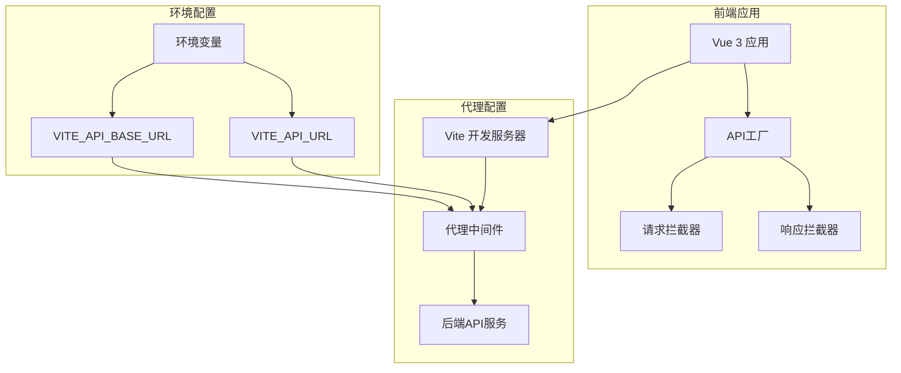
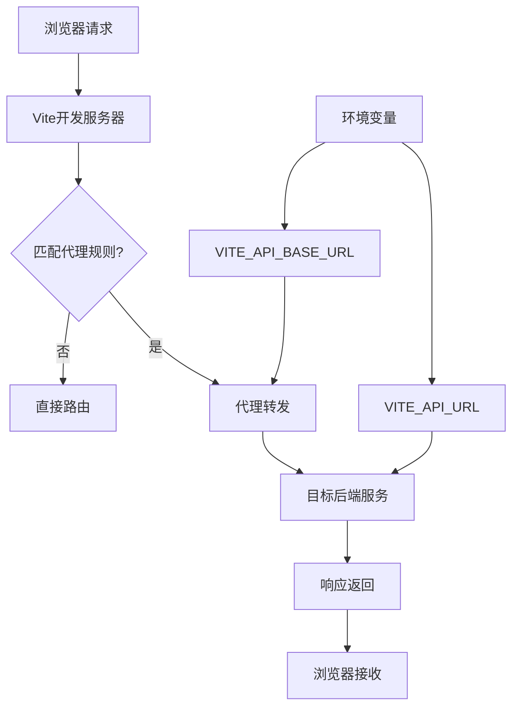
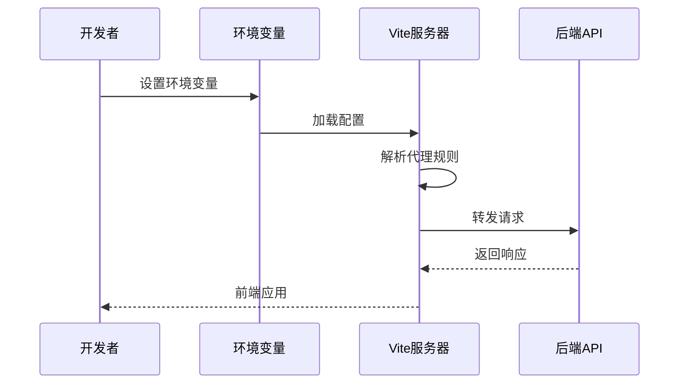
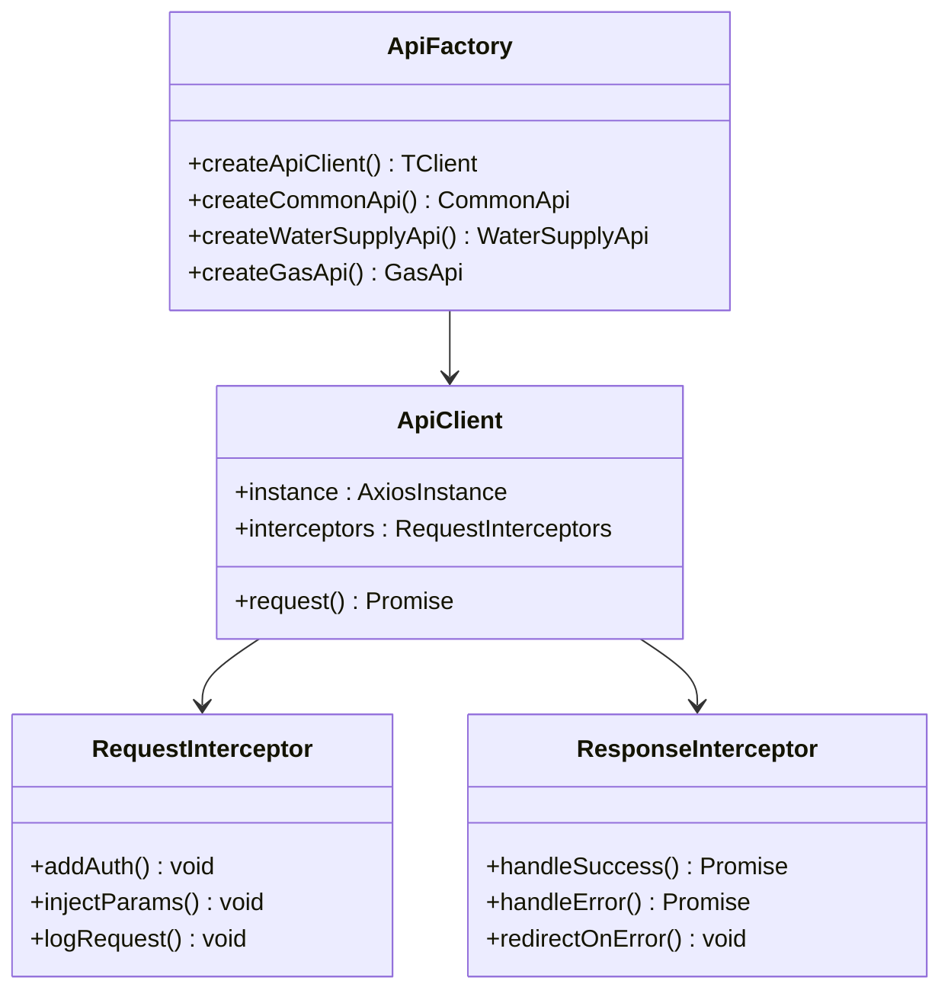
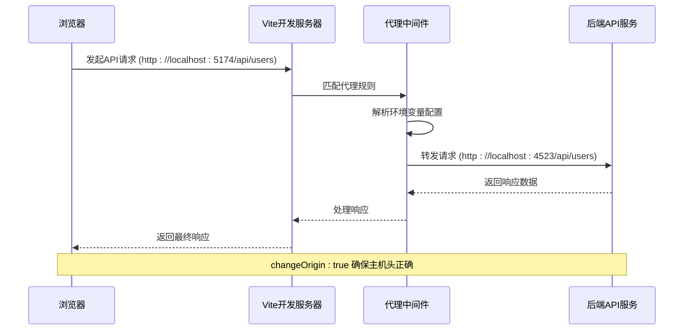
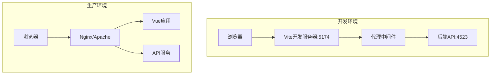

# API代理配置

<cite>
**本文档中引用的文件**
- [vite.config.js](file://vite.config.js)
- [package.json](file://package.json)
- [src/api/apiFactory.ts](file://src/api/apiFactory.ts)
- [src/api/apiConfig.ts](file://src/api/apiConfig.ts)
- [src/services/commonService.ts](file://src/services/commonService.ts)
- [src/services/loginService.ts](file://src/services/loginService.ts)
- [src/api/common.ts](file://src/api/common.ts)
</cite>

## 目录
1. [简介](#简介)
2. [项目结构概览](#项目结构概览)
3. [Vite代理配置详解](#vite代理配置详解)
4. [环境变量配置](#环境变量配置)
5. [API调用架构](#api调用架构)
6. [开发环境跨域请求流程](#开发环境跨域请求流程)
7. [生产环境部署注意事项](#生产环境部署注意事项)
8. [故障排除指南](#故障排除指南)
9. [最佳实践建议](#最佳实践建议)

## 简介

政府dashboard项目采用现代化的前端架构，使用Vue 3和Vite构建工具。为了处理开发环境中的跨域问题，项目配置了智能的API代理系统。该系统通过Vite的开发服务器代理功能，实现了前后端分离开发的最佳实践。

本文档详细解释了项目中API代理配置的工作原理，包括环境变量驱动的动态配置、反向代理机制以及完整的请求流程。

## 项目结构概览

项目采用模块化的API架构设计，主要包含以下核心组件：



**图表来源**
- [vite.config.js](file://vite.config.js#L28-L40)
- [src/api/apiFactory.ts](file://src/api/apiFactory.ts#L86-L94)

**章节来源**
- [vite.config.js](file://vite.config.js#L1-L81)
- [package.json](file://package.json#L1-L48)

## Vite代理配置详解

### 核心代理配置

项目在`vite.config.js`中配置了智能的代理系统，支持动态环境变量驱动的代理规则：



**图表来源**
- [vite.config.js](file://vite.config.js#L34-L39)

### 代理配置解析

代理配置的核心逻辑位于Vite配置文件中：

1. **动态环境变量加载**：通过`loadEnv()`函数动态加载环境变量
2. **代理规则定义**：使用环境变量`VITE_API_BASE_URL`作为代理路径前缀
3. **目标服务配置**：通过`VITE_API_URL`指定后端服务地址
4. **变更源配置**：启用`changeOrigin: true`确保正确的主机头

### 关键配置参数

| 参数 | 类型 | 说明 | 示例值 |
|------|------|------|--------|
| `target` | string | 后端服务目标地址 | `http://localhost:4523` |
| `changeOrigin` | boolean | 是否变更请求源 | `true` |
| `VITE_API_BASE_URL` | string | 代理路径前缀 | `/api` |
| `VITE_API_URL` | string | 后端服务地址 | `http://localhost:4523` |

**章节来源**
- [vite.config.js](file://vite.config.js#L15-L40)

## 环境变量配置

### 核心环境变量

项目使用以下关键环境变量来控制API代理行为：

| 变量名 | 类型 | 默认值 | 说明 |
|--------|------|--------|------|
| `VITE_API_URL` | string | - | 后端API服务的基础URL |
| `VITE_API_BASE_URL` | string | `/clapi` | API请求的路径前缀 |
| `VITE_BASE_URL` | string | `/clmap/` | 应用的基础路径 |
| `NODE_ENV` | string | `development` | 当前运行环境 |

### 环境变量使用模式



**图表来源**
- [vite.config.js](file://vite.config.js#L16-L17)
- [src/api/apiFactory.ts](file://src/api/apiFactory.ts#L86-L87)

### 配置示例

#### 开发环境配置 (.env.development)
```bash
# API服务地址
VITE_API_URL=http://localhost:4523

# API路径前缀
VITE_API_BASE_URL=/api

# 应用基础路径
VITE_BASE_URL=/clmap/

# 构建优化
VITE_DROP_CONSOLE=false
VITE_DROP_DEBUGGER=false
```

#### 生产环境配置 (.env.production)
```bash
# API服务地址
VITE_API_URL=https://api.example.com

# API路径前缀
VITE_API_BASE_URL=/api

# 应用基础路径
VITE_BASE_URL=/dashboard/

# 构建优化
VITE_DROP_CONSOLE=true
VITE_DROP_DEBUGGER=true
```

**章节来源**
- [vite.config.js](file://vite.config.js#L16-L21)
- [src/api/apiFactory.ts](file://src/api/apiFactory.ts#L86-L87)

## API调用架构

### API工厂模式

项目采用工厂模式创建API客户端，提供了统一的请求和响应处理机制：



**图表来源**
- [src/api/apiFactory.ts](file://src/api/apiFactory.ts#L67-L208)
- [src/api/apiFactory.ts](file://src/api/apiFactory.ts#L211-L252)

### 请求拦截器功能

API工厂中的请求拦截器实现了以下核心功能：

1. **认证令牌注入**：自动添加JWT令牌到请求头
2. **参数合并**：将业务模块参数与请求参数合并
3. **开发调试**：在开发环境下记录请求详情
4. **错误预处理**：统一处理请求配置错误

### 响应拦截器功能

响应拦截器负责处理API响应：

1. **业务状态码处理**：根据响应状态码执行相应逻辑
2. **错误提示**：显示用户友好的错误消息
3. **认证失效处理**：自动跳转到登录页面
4. **网络错误处理**：处理各种网络异常情况

**章节来源**
- [src/api/apiFactory.ts](file://src/api/apiFactory.ts#L99-L208)
- [src/services/commonService.ts](file://src/services/commonService.ts#L1-L131)

## 开发环境跨域请求流程

### 完整请求流程图



**图表来源**
- [vite.config.js](file://vite.config.js#L34-L39)
- [src/api/apiFactory.ts](file://src/api/apiFactory.ts#L100-L125)

### changeOrigin配置详解

`changeOrigin: true`配置的作用至关重要：

1. **主机头重写**：将请求的Host头改为目标服务器的地址
2. **跨域兼容性**：解决某些后端服务对Host头的严格校验
3. **代理透明性**：使后端服务认为请求直接来自目标服务器

### 代理规则匹配机制

代理系统按照以下优先级匹配请求：

1. **精确匹配**：完全匹配`VITE_API_BASE_URL`的路径
2. **前缀匹配**：匹配以`VITE_API_BASE_URL`开头的路径
3. **通配符匹配**：支持更灵活的路径模式

**章节来源**
- [vite.config.js](file://vite.config.js#L34-L39)

## 生产环境部署注意事项

### 构建时配置

生产环境下的API配置需要特别注意以下几点：

1. **静态资源路径**：确保`base`配置正确
2. **API路径调整**：根据部署环境调整API路径
3. **环境变量固化**：构建时将环境变量嵌入到代码中

### 部署架构对比



### 生产环境配置要点

| 配置项 | 开发环境 | 生产环境 | 说明 |
|--------|----------|----------|------|
| `base` | `/clmap/` | `/dashboard/` | 应用基础路径 |
| `VITE_API_URL` | `http://localhost:4523` | `https://api.example.com` | API服务地址 |
| `VITE_API_BASE_URL` | `/api` | `/api` | API路径前缀 |
| 代理配置 | 启用 | 禁用 | 生产环境无需代理 |

### Nginx配置示例

```nginx
location /api/ {
    proxy_pass http://backend-api-server/;
    proxy_set_header Host $host;
    proxy_set_header X-Real-IP $remote_addr;
    proxy_set_header X-Forwarded-For $proxy_add_x_forwarded_for;
    proxy_set_header X-Forwarded-Proto $scheme;
}

location / {
    root /var/www/html;
    try_files $uri /index.html;
}
```

**章节来源**
- [vite.config.js](file://vite.config.js#L42-L80)
- [package.json](file://package.json#L9-L13)

## 故障排除指南

### 常见问题及解决方案

#### 1. 代理不生效

**症状**：请求直接发送到浏览器，未经过代理

**排查步骤**：
- 检查环境变量是否正确设置
- 验证代理规则是否匹配
- 确认Vite服务器正在运行

**解决方案**：
```javascript
// 在vite.config.js中添加调试输出
console.log('Proxy config:', {
  target: env.VITE_API_URL,
  baseUrl: env.VITE_API_BASE_URL
});
```

#### 2. CORS错误

**症状**：浏览器控制台出现CORS相关错误

**原因分析**：
- `changeOrigin`配置缺失或设置错误
- 后端服务未正确配置CORS策略

**解决方案**：
```javascript
// 确保代理配置中包含changeOrigin
proxy: {
  [env.VITE_API_BASE_URL]: {
    target: env.VITE_API_URL,
    changeOrigin: true, // 必须设置为true
    rewrite: (path) => path.replace(/^\/api/, '') // 路径重写
  }
}
```

#### 3. 环境变量未生效

**症状**：API请求使用默认值而非环境变量

**排查方法**：
```javascript
// 在开发环境中添加调试
if (import.meta.env.DEV) {
  console.log('Environment variables loaded:', import.meta.env);
}
```

#### 4. 请求超时

**症状**：API请求长时间无响应

**可能原因**：
- 后端服务不可用
- 网络连接问题
- 代理配置错误

**解决方案**：
```javascript
// 在apiFactory中添加超时配置
const apiConfig = {
  baseURL: env.VITE_API_BASE_URL || '/clapi',
  timeout: 30000, // 30秒超时
  headers: {
    'Content-Type': 'application/json',
  }
};
```

### 调试技巧

1. **启用开发日志**：在开发环境下启用详细的请求日志
2. **网络面板监控**：使用浏览器开发者工具监控网络请求
3. **代理规则验证**：确认代理规则正确匹配请求路径
4. **环境变量检查**：验证所有必要的环境变量都已正确设置

**章节来源**
- [src/api/apiFactory.ts](file://src/api/apiFactory.ts#L116-L125)
- [src/api/apiFactory.ts](file://src/api/apiFactory.ts#L136-L208)

## 最佳实践建议

### 1. 环境变量管理

- 使用`.env`文件管理不同环境的配置
- 为敏感信息创建单独的`.env.local`文件
- 在CI/CD环境中使用环境变量覆盖

### 2. 代理配置优化

- 合理设置代理路径前缀，避免与其他路由冲突
- 使用通配符代理处理复杂的API路径
- 定期清理不必要的代理规则

### 3. API调用最佳实践

- 统一使用API工厂创建客户端
- 实现完善的错误处理机制
- 在开发环境下启用详细的调试信息

### 4. 性能优化

- 合理配置构建优化选项
- 使用代码分割减少初始加载时间
- 实现请求缓存机制

### 5. 安全考虑

- 在生产环境中禁用不必要的开发工具
- 正确配置HTTPS和安全头部
- 实现适当的认证和授权机制

通过遵循这些最佳实践，可以确保项目的API代理配置既高效又安全，为开发团队提供良好的开发体验，同时保证生产环境的稳定性和安全性。