# API工厂机制

<cite>
**本文档中引用的文件**
- [apiFactory.ts](file://src/api/apiFactory.ts)
- [apiConfig.ts](file://src/api/apiConfig.ts)
- [common.ts](file://src/api/common.ts)
- [waterSupplyAndDrainage.ts](file://src/api/waterSupplyAndDrainage.ts)
- [gas.ts](file://src/api/gas.ts)
- [waterSupplyService.ts](file://src/services/waterSupplyService.ts)
- [gasService.ts](file://src/services/gasService.ts)
- [README.md](file://src/api/README.md)
</cite>

## 目录
1. [简介](#简介)
2. [核心架构](#核心架构)
3. [createApiClient泛型函数详解](#createapiclient泛型函数详解)
4. [ApiConstructor与ApiClientBase设计](#apiconstructor与apiclientbase设计)
5. [BusinessModule业务模块系统](#businessmodule业务模块系统)
6. [便捷工厂函数](#便捷工厂函数)
7. [安全认证机制](#安全认证机制)
8. [开发环境功能](#开发环境功能)
9. [使用示例](#使用示例)
10. [最佳实践](#最佳实践)

## 简介

API工厂机制是政府dashboard项目中的核心API管理架构，基于`swagger-typescript-api`生成的客户端，提供了统一的API创建、配置和管理功能。该机制通过泛型设计实现了对任意Swagger API的通用支持，同时集成了业务模块参数注入、安全认证、错误处理和开发调试等功能。

## 核心架构

API工厂机制采用分层架构设计，主要包含以下核心组件：

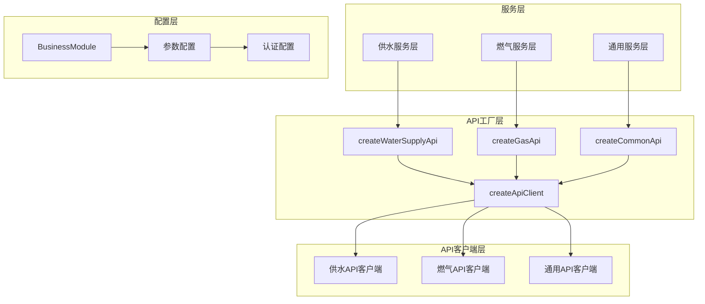

**图表来源**
- [apiFactory.ts](file://src/api/apiFactory.ts#L210-L252)
- [waterSupplyService.ts](file://src/services/waterSupplyService.ts#L1-L10)
- [gasService.ts](file://src/services/gasService.ts#L1-L15)

## createApiClient泛型函数详解

`createApiClient`是整个API工厂机制的核心函数，采用了强大的泛型设计模式，能够创建任意Swagger API客户端的实例。

### 函数签名与类型定义

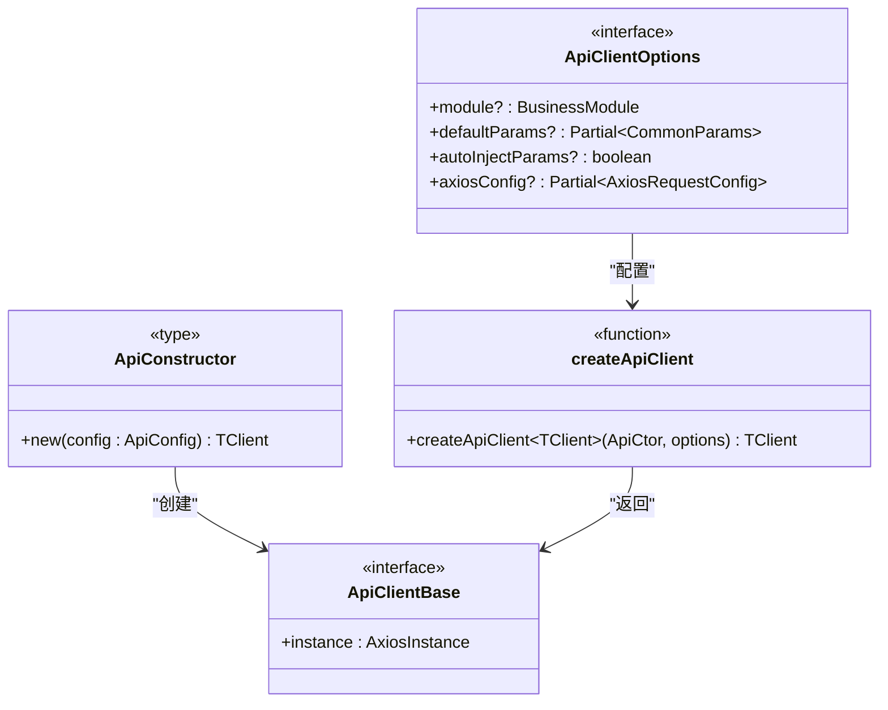

**图表来源**
- [apiFactory.ts](file://src/api/apiFactory.ts#L38-L59)

### 核心实现流程

函数执行遵循以下流程：

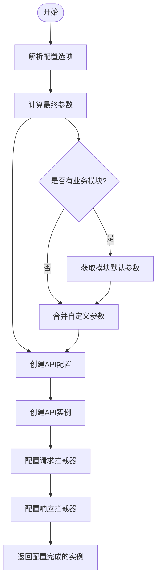

**图表来源**
- [apiFactory.ts](file://src/api/apiFactory.ts#L67-L208)

### 参数处理机制

函数通过`getModuleParams`和`mergeParams`实现灵活的参数注入：

| 参数类型 | 优先级 | 作用 |
|---------|--------|------|
| 模块默认参数 | 低 | 业务模块的基础配置 |
| 自定义参数 | 高 | 覆盖模块默认参数 |
| 请求参数 | 最高 | 运行时动态传入 |

**节来源**
- [apiFactory.ts](file://src/api/apiFactory.ts#L78-L84)
- [apiConfig.ts](file://src/api/apiConfig.ts#L79-L97)

## ApiConstructor与ApiClientBase设计

### ApiConstructor类型设计

`ApiConstructor<TClient>`是一个泛型构造函数类型，确保传入的API类具有正确的结构：

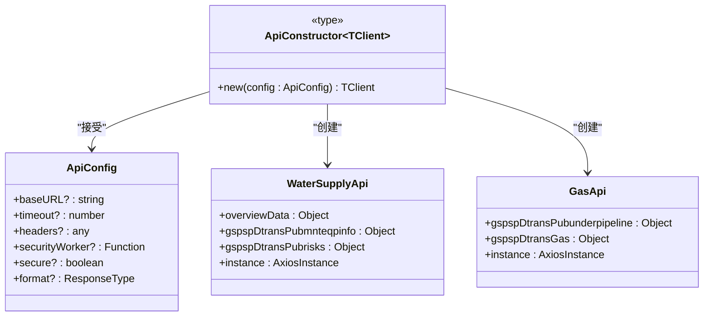

**图表来源**
- [apiFactory.ts](file://src/api/apiFactory.ts#L38-L45)
- [waterSupplyAndDrainage.ts](file://src/api/waterSupplyAndDrainage.ts#L146-L730)
- [gas.ts](file://src/api/gas.ts#L146-L531)

### ApiClientBase接口要求

所有API客户端必须实现`ApiClientBase`接口，确保具备基本的Axios实例访问能力：

| 属性 | 类型 | 用途 |
|------|------|------|
| instance | AxiosInstance | 提供HTTP请求能力 |

这种设计保证了工厂函数能够统一处理所有类型的API客户端。

**节来源**
- [apiFactory.ts](file://src/api/apiFactory.ts#L43-L45)

## BusinessModule业务模块系统

### 业务模块枚举定义

`BusinessModule`枚举定义了系统支持的所有业务模块：

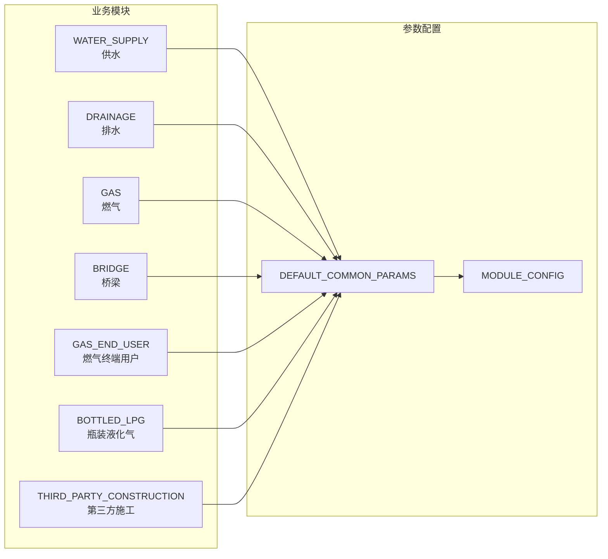

**图表来源**
- [apiConfig.ts](file://src/api/apiConfig.ts#L7-L22)

### 模块参数配置

每个业务模块都有对应的默认参数配置：

| 模块 | Sszx参数值 | 说明 |
|------|------------|------|
| WATER_SUPPLY | csaqzx_gs | 供水专项 |
| DRAINAGE | csaqzx_ps | 排水专项 |
| GAS | csaqzx_rq | 燃气专项 |
| BRIDGE | csaqzx_ql | 桥梁专项 |
| GAS_END_USER | csaqzx_rqzdyh | 燃气终端用户 |
| BOTTLED_LPG | csaqzx_pzyhq | 瓶装液化气 |
| THIRD_PARTY_CONSTRUCTION | csaqzx_sfsg | 第三方施工 |

### 参数注入机制

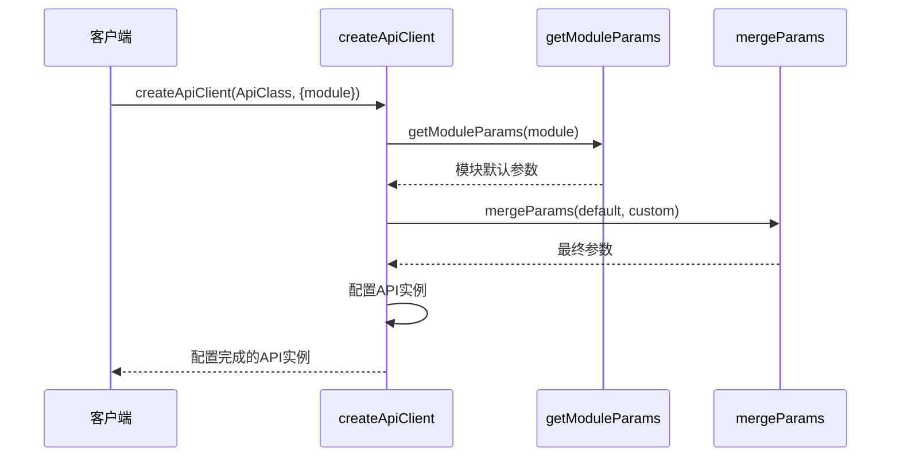

**图表来源**
- [apiFactory.ts](file://src/api/apiFactory.ts#L78-L84)
- [apiConfig.ts](file://src/api/apiConfig.ts#L79-L97)

**节来源**
- [apiConfig.ts](file://src/api/apiConfig.ts#L7-L97)

## 便捷工厂函数

API工厂提供了多个便捷的工厂函数，针对不同的业务模块进行了专门优化：

### 供水排水模块

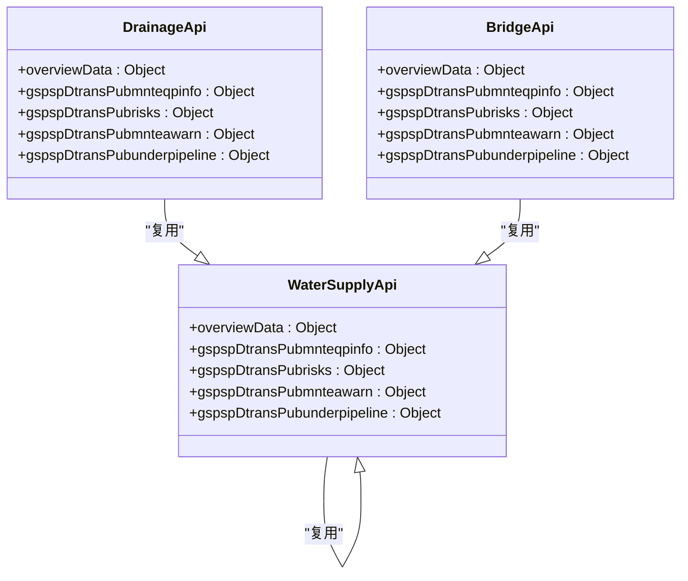

**图表来源**
- [apiFactory.ts](file://src/api/apiFactory.ts#L221-L243)

### 燃气模块

燃气模块拥有独立的API客户端，提供了更丰富的功能：

| 功能分类 | 主要接口方法 |
|----------|-------------|
| 管网统计 | gasCdRatioList, gasMaterialRatioList |
| 企业信息 | pageList, gasenterpriseledgerDetail |
| 场站管理 | gasfldstationPageList |
| 用户管理 | bottlegasuserPageList |
| 监测设备 | eqpPageList, glmbbhEqpPageList |

### 通用模块

通用模块不注入业务参数，适用于登录、数据字典等通用功能：

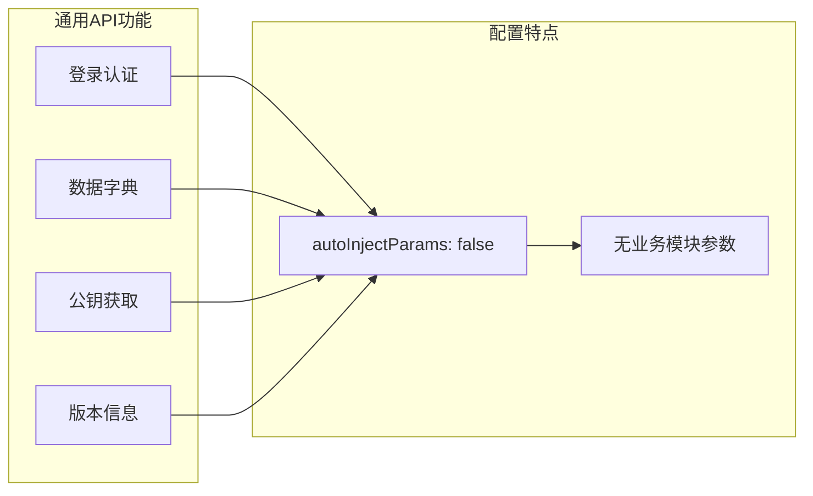

**图表来源**
- [apiFactory.ts](file://src/api/apiFactory.ts#L250-L252)

**节来源**
- [apiFactory.ts](file://src/api/apiFactory.ts#L213-L252)

## 安全认证机制

### Token获取与注入

API工厂实现了统一的安全认证机制：

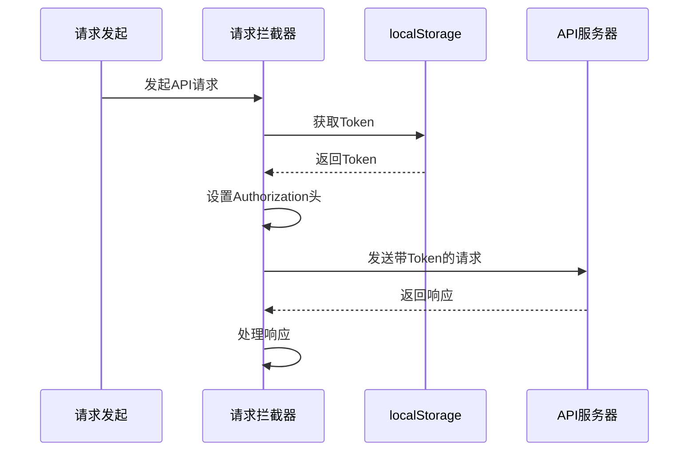

**图表来源**
- [apiFactory.ts](file://src/api/apiFactory.ts#L102-L106)

### 认证Token管理

| 操作 | 实现方式 | 安全考虑 |
|------|----------|----------|
| 获取 | localStorage.getItem('token') | 客户端存储 |
| 注入 | Authorization头 | HTTP标准 |
| 清理 | 自动移除过期Token | 防止误用 |

### 错误处理与重定向

当遇到认证相关错误时，系统会自动处理：

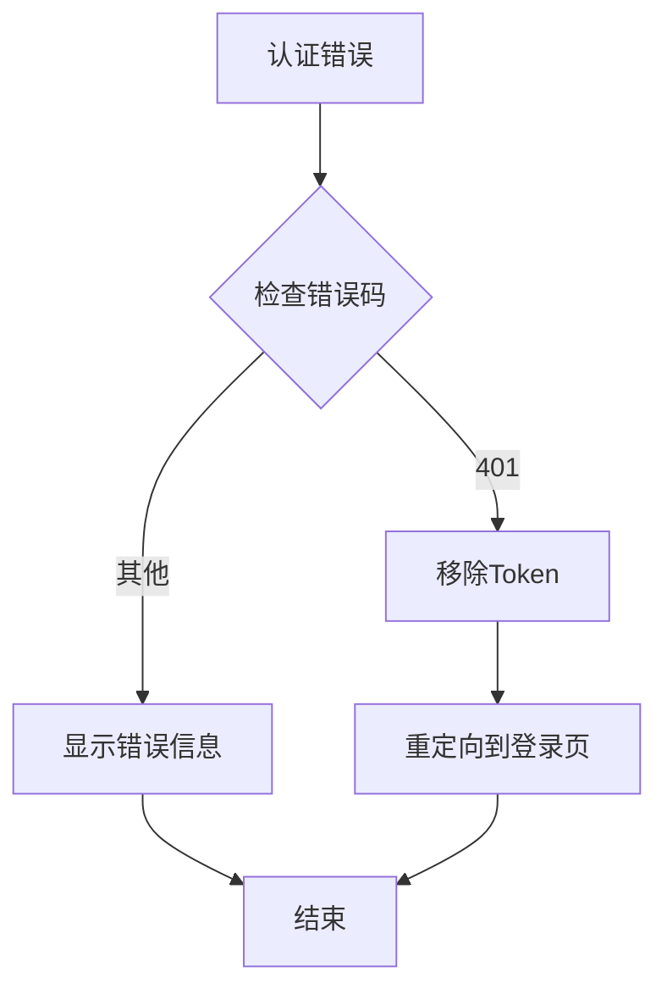

**图表来源**
- [apiFactory.ts](file://src/api/apiFactory.ts#L153-L164)

**节来源**
- [apiFactory.ts](file://src/api/apiFactory.ts#L13-L18)
- [apiFactory.ts](file://src/api/apiFactory.ts#L153-L164)

## 开发环境功能

### 请求/响应日志记录

开发环境下，API工厂会自动记录详细的请求和响应信息：

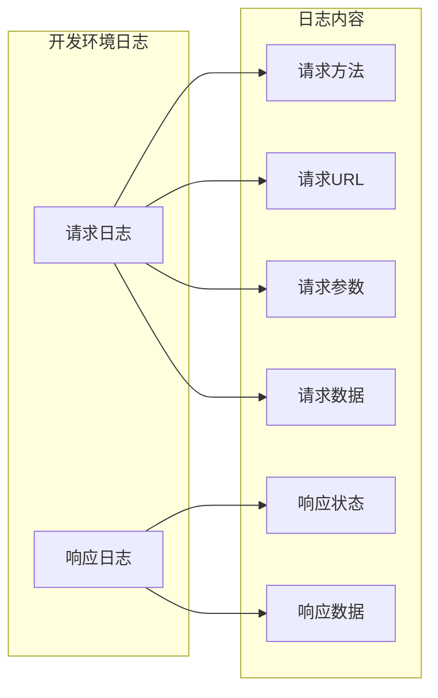

**图表来源**
- [apiFactory.ts](file://src/api/apiFactory.ts#L117-L124)
- [apiFactory.ts](file://src/api/apiFactory.ts#L139-L145)

### 环境检测机制

日志记录仅在开发环境启用：

| 环境变量 | 检测方式 | 功能 |
|----------|----------|------|
| DEV | import.meta.env.DEV | 开发环境标识 |
| VITE_API_BASE_URL | import.meta.env.VITE_API_BASE_URL | API基础URL |

### 错误提示系统

系统集成了统一的错误提示机制：

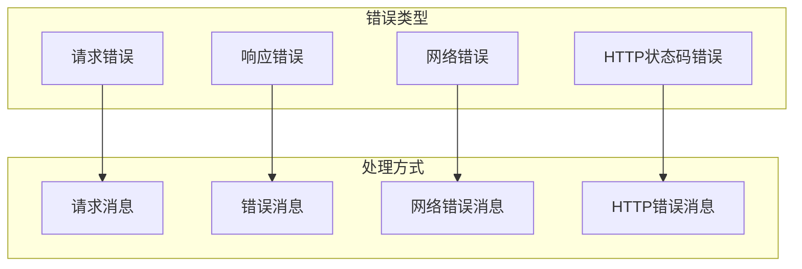

**图表来源**
- [apiFactory.ts](file://src/api/apiFactory.ts#L128-L132)
- [apiFactory.ts](file://src/api/apiFactory.ts#L170-L204)

**节来源**
- [apiFactory.ts](file://src/api/apiFactory.ts#L117-L145)
- [apiFactory.ts](file://src/api/apiFactory.ts#L128-L204)

## 使用示例

### 基本使用模式

#### 服务层调用（推荐）

```typescript
// 供水模块使用
import { getWaterOverview, getDeviceStatusRate } from '@/services/waterSupplyService'

async function fetchData() {
  const overview = await getWaterOverview()
  const status = await getDeviceStatusRate({ Sszx: 'csaqzx_gs' })
}

// 燃气模块使用
import { getGasEnterprisePageList, getGasOnlineStatus } from '@/services/gasService'

async function fetchGasData() {
  const enterprises = await getGasEnterprisePageList()
  const onlineStatus = await getGasOnlineStatus()
}
```

#### 直接API调用

```typescript
// 创建API实例
import { createWaterSupplyApi, createGasApi } from '@/api'

const waterApi = createWaterSupplyApi()
const gasApi = createGasApi()

// 直接调用API方法
const overview = await waterApi.overviewData.List()
const enterprises = await gasApi.gspspDtransGas.pageList()
```

### 高级配置示例

#### 自定义参数注入

```typescript
// 创建带有自定义参数的API实例
const customWaterApi = createApiClient(WaterSupplyApi, {
  module: BusinessModule.WATER_SUPPLY,
  defaultParams: {
    Dsbm: '420200', // 市州编码
    Qhbm: '420222', // 区划编码
    Ssjz: 'custom_value' // 自定义参数
  },
  autoInjectParams: true
})
```

#### 自定义Axios配置

```typescript
// 创建带有自定义配置的API实例
const debugApi = createApiClient(CommonApi, {
  axiosConfig: {
    timeout: 30000,
    headers: {
      'X-Custom-Header': 'custom-value'
    }
  }
})
```

### 错误处理示例

```typescript
import { createWaterSupplyApi } from '@/api'

const waterApi = createWaterSupplyApi()

try {
  const data = await waterApi.overviewData.List()
  // 处理成功响应
} catch (error) {
  if (error.response) {
    // 服务器返回错误
    console.error('API Error:', error.response.data)
  } else if (error.request) {
    // 请求未收到响应
    console.error('Network Error')
  } else {
    // 其他错误
    console.error('Error:', error.message)
  }
}
```

**节来源**
- [waterSupplyService.ts](file://src/services/waterSupplyService.ts#L1-L162)
- [gasService.ts](file://src/services/gasService.ts#L1-L218)

## 最佳实践

### 模块化组织

1. **按业务模块分离API**：每个业务模块使用独立的API客户端
2. **服务层封装**：在service层提供业务友好的函数接口
3. **配置集中管理**：通过apiConfig.ts统一管理业务参数

### 性能优化

1. **实例复用**：避免重复创建相同的API实例
2. **懒加载**：按需创建API实例
3. **缓存策略**：合理利用浏览器缓存

### 安全考虑

1. **Token管理**：确保Token的安全存储和传输
2. **错误处理**：避免敏感信息泄露
3. **权限控制**：在前端进行基础的权限检查

### 开发调试

1. **环境区分**：正确配置开发和生产环境
2. **日志记录**：充分利用开发环境的日志功能
3. **错误监控**：建立完善的错误监控体系

### 扩展性设计

1. **泛型支持**：保持对新API模块的良好兼容性
2. **配置灵活性**：提供丰富的配置选项
3. **插件机制**：支持自定义拦截器和中间件

通过遵循这些最佳实践，可以充分发挥API工厂机制的优势，构建稳定、高效、可维护的API管理系统。