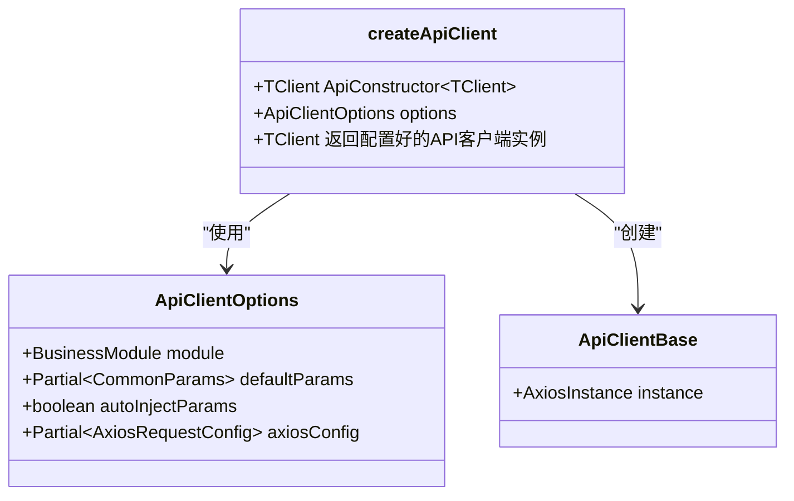
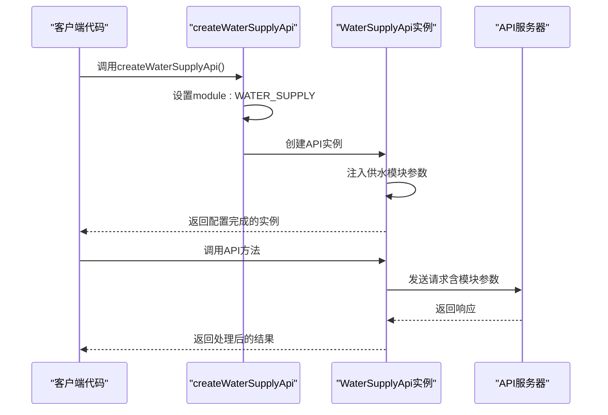
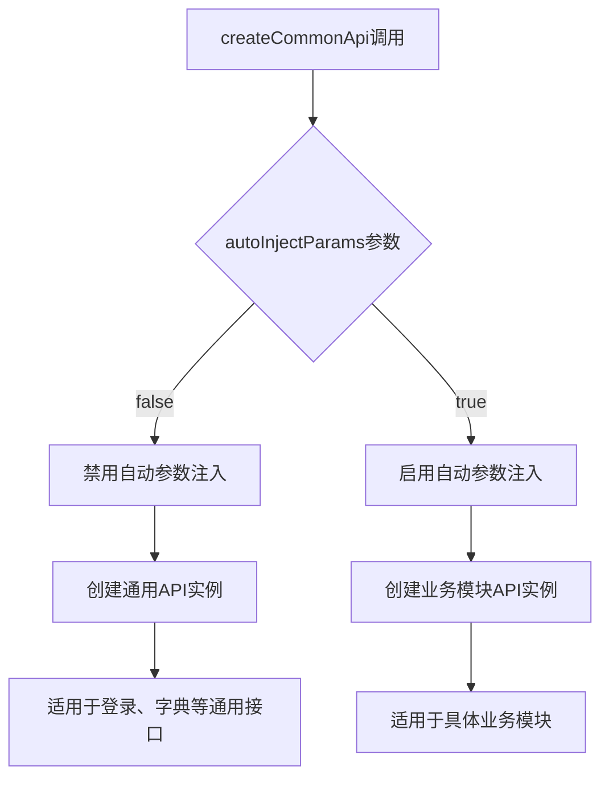
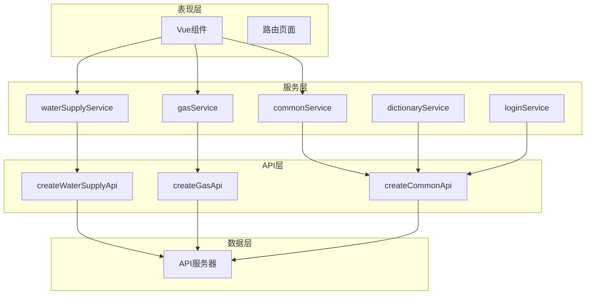

# 便捷工厂函数

<cite>
**本文档中引用的文件**
- [apiFactory.ts](file://src/api/apiFactory.ts)
- [apiConfig.ts](file://src/api/apiConfig.ts)
- [common.ts](file://src/api/common.ts)
- [waterSupplyAndDrainage.ts](file://src/api/waterSupplyAndDrainage.ts)
- [gas.ts](file://src/api/gas.ts)
- [waterSupplyService.ts](file://src/services/waterSupplyService.ts)
- [gasService.ts](file://src/services/gasService.ts)
- [commonService.ts](file://src/services/commonService.ts)
- [dictionaryService.ts](file://src/services/dictionaryService.ts)
- [loginService.ts](file://src/services/loginService.ts)
</cite>

## 目录
1. [简介](#简介)
2. [核心设计理念](#核心设计理念)
3. [createApiClient泛型工厂函数](#createapiclient泛型工厂函数)
4. [便捷工厂函数详解](#便捷工厂函数详解)
5. [createCommonApi的特殊性](#createcommonapi的特殊性)
6. [服务层集成使用](#服务层集成使用)
7. [实际调用示例](#实际调用示例)
8. [架构优势分析](#架构优势分析)
9. [最佳实践建议](#最佳实践建议)

## 简介

便捷工厂函数是政府dashboard项目中API调用层的重要设计模式，通过封装createApiClient函数，为不同的业务模块提供了简化的API实例创建方式。这些函数不仅降低了API调用的复杂度，还提高了开发效率和代码的可维护性。

## 核心设计理念

便捷工厂函数的设计遵循以下核心理念：

### 统一化管理
- **参数标准化**：通过BusinessModule枚举统一管理业务模块参数
- **配置集中化**：将API客户端的配置逻辑集中到工厂函数中
- **行为一致性**：确保所有业务模块的API实例具有相同的行为特征

### 简化复杂度
- **隐藏实现细节**：开发者无需关心底层的API客户端创建过程
- **参数自动注入**：根据业务模块自动注入必要的公共参数
- **错误处理统一**：内置统一的错误处理和拦截器配置

### 可扩展性
- **模块化设计**：每个业务模块都有独立的工厂函数
- **灵活配置**：支持自定义参数覆盖和额外配置
- **向后兼容**：保持与现有API调用方式的兼容性

## createApiClient泛型工厂函数

createApiClient是整个便捷工厂函数体系的核心，它是一个泛型函数，能够创建任意Swagger Typescript API生成的API客户端实例。

### 函数签名与参数



**图表来源**
- [apiFactory.ts](file://src/api/apiFactory.ts#L67-L208)

### 核心功能特性

#### 1. 模块化参数管理
- **自动参数注入**：根据BusinessModule枚举自动注入对应的公共参数
- **参数合并机制**：支持自定义参数覆盖默认参数
- **灵活配置**：允许禁用自动参数注入（用于通用接口）

#### 2. 统一拦截器配置
- **请求拦截**：自动添加认证Token和业务参数
- **响应拦截**：统一处理业务状态码和错误信息
- **开发调试**：提供详细的请求/响应日志输出

#### 3. 错误处理机制
- **HTTP状态码处理**：针对不同HTTP状态码提供相应的处理策略
- **业务错误处理**：解析API返回的业务状态码并显示相应提示
- **网络错误处理**：优雅处理网络连接失败等异常情况

**章节来源**
- [apiFactory.ts](file://src/api/apiFactory.ts#L67-L208)

## 便捷工厂函数详解

项目中共有四个主要的便捷工厂函数，分别对应不同的业务模块：

### createWaterSupplyApi - 供水模块



**图表来源**
- [apiFactory.ts](file://src/api/apiFactory.ts#L221-L223)

#### 功能特点
- **模块标识**：使用`BusinessModule.WATER_SUPPLY`标识供水业务
- **参数预设**：自动注入市州编码、区划编码和专项标识
- **适用场景**：供水管网监控、水质监测、隐患排查等业务

### createGasApi - 燃气模块

燃气模块工厂函数专门处理燃气相关的业务需求：

#### 核心功能
- **燃气专项标识**：使用`BusinessModule.GAS`标识燃气业务
- **多维度数据**：支持燃气管网、场站、用户等多个维度的数据查询
- **实时监控**：提供在线状态、预警信息等实时数据接口

### createDrainageApi - 排水模块

排水模块工厂函数负责排水系统的相关业务：

#### 主要用途
- **排水管网管理**：管网长度、材质、管点数量统计
- **排水设施监控**：泵站、河道、雨量站等设施状态
- **风险评估**：排水系统隐患识别和风险等级评估

### createBridgeApi - 桥梁模块

桥梁模块工厂函数专注于桥梁相关的业务功能：

#### 应用场景
- **桥梁健康监测**：桥梁结构状态、变形监测等
- **基础设施管理**：桥梁基础信息、维护记录等
- **安全预警**：桥梁安全隐患识别和预警

**章节来源**
- [apiFactory.ts](file://src/api/apiFactory.ts#L221-L244)

## createCommonApi的特殊性

createCommonApi是唯一一个禁用了公共参数自动注入的便捷工厂函数，专门用于处理登录、数据字典等通用接口。

### 设计原理



**图表来源**
- [apiFactory.ts](file://src/api/apiFactory.ts#L250-L252)

### 适用场景分析

#### 1. 登录认证接口
- **无业务参数**：登录接口不需要业务模块参数
- **安全性要求**：独立的认证流程，避免参数污染
- **通用性**：适用于所有用户的认证需求

#### 2. 数据字典接口
- **静态数据**：字典数据不依赖特定业务模块
- **全局共享**：字典数据对所有业务模块都可用
- **缓存友好**：适合进行全局缓存管理

#### 3. 系统配置接口
- **系统级参数**：涉及系统级别的配置信息
- **权限控制**：需要独立的权限验证机制
- **版本管理**：支持配置版本的管理和切换

### 实现机制

createCommonApi通过设置`autoInjectParams: false`参数，完全绕过了业务模块参数的自动注入机制，确保通用接口的纯净性和独立性。

**章节来源**
- [apiFactory.ts](file://src/api/apiFactory.ts#L246-L252)
- [commonService.ts](file://src/services/commonService.ts#L12)

## 服务层集成使用

便捷工厂函数在服务层的集成使用体现了良好的分层架构设计：

### 服务层架构图



**图表来源**
- [waterSupplyService.ts](file://src/services/waterSupplyService.ts#L6)
- [gasService.ts](file://src/services/gasService.ts#L13)
- [commonService.ts](file://src/services/commonService.ts#L12)

### 模块化服务设计

#### 供水服务模块
- **职责分离**：专门处理供水相关的业务逻辑
- **参数封装**：自动处理市州编码、区划编码等参数
- **数据转换**：将API响应数据转换为业务所需格式

#### 燃气服务模块
- **业务专精**：专注于燃气领域的专业功能
- **状态管理**：提供燃气设备状态的实时监控
- **统计分析**：支持各种燃气相关指标的统计分析

#### 通用服务模块
- **基础设施**：提供登录、字典等基础服务
- **跨模块共享**：为其他业务模块提供通用功能
- **安全认证**：处理用户认证和权限管理

**章节来源**
- [waterSupplyService.ts](file://src/services/waterSupplyService.ts#L1-L162)
- [gasService.ts](file://src/services/gasService.ts#L1-L218)
- [commonService.ts](file://src/services/commonService.ts#L1-L131)

## 实际调用示例

以下是便捷工厂函数在实际项目中的使用示例：

### 供水模块API调用

```typescript
// 在服务层中使用
import { createWaterSupplyApi } from "@/api/apiFactory";

const waterApi = createWaterSupplyApi();

// 调用API方法
const overviewData = await waterApi.overviewData.List({
  Jcsslx: "供水",
  Sjly: "系统"
});
```

### 燃气模块API调用

```typescript
// 在服务层中使用
import { createGasApi } from "@/api/apiFactory";

const gasApi = createGasApi();

// 调用API方法
const equipmentStatus = await gasApi.gspspDtransPubmnteqpinfo.gasRateListList();
```

### 通用接口调用

```typescript
// 在服务层中使用
import { createCommonApi } from "@/api/apiFactory";

const commonApi = createCommonApi();

// 调用通用接口
const loginResult = await commonApi.login.loginCreate(loginData);
const dictionaryData = await commonApi.data.dataitemDetailsDetail("USER_STATUS");
```

### 服务层封装示例

```typescript
// 供水服务封装
export async function getWaterOverview(params?: {
  Jcsslx?: string;
  Sjly?: string;
}) {
  const res = await waterApi.overviewData.List(params);
  return res.data || [];
}

// 燃气服务封装  
export async function getGasMaterialRatio() {
  const res = await gasApi.gspspDtransPubunderpipeline.gasMaterialRatioList();
  return res.data || [];
}

// 登录服务封装
export async function login(account: string, password: string) {
  const loginData = { account, password };
  const res = await commonApi.login.loginCreate(loginData);
  return res;
}
```

**章节来源**
- [waterSupplyService.ts](file://src/services/waterSupplyService.ts#L15-L20)
- [gasService.ts](file://src/services/gasService.ts#L21-L24)
- [commonService.ts](file://src/services/commonService.ts#L29-L35)

## 架构优势分析

便捷工厂函数的设计带来了显著的架构优势：

### 1. 开发效率提升

- **减少重复代码**：避免在每个服务中重复创建API实例
- **简化调用方式**：提供简洁的函数调用接口
- **快速上手**：新开发者可以快速开始业务开发

### 2. 维护成本降低

- **集中管理**：API配置和错误处理集中在工厂函数中
- **统一升级**：一处修改，所有业务模块受益
- **易于测试**：便于进行单元测试和集成测试

### 3. 代码质量保证

- **类型安全**：利用TypeScript泛型提供完整的类型支持
- **参数校验**：自动注入的参数经过严格校验
- **错误处理**：统一的错误处理机制确保用户体验

### 4. 扩展性保障

- **模块独立**：各业务模块相互独立，互不影响
- **配置灵活**：支持自定义参数和额外配置
- **向后兼容**：保持与现有代码的兼容性

## 最佳实践建议

基于项目实践，以下是使用便捷工厂函数的最佳实践建议：

### 1. 参数传递策略

```typescript
// 推荐：使用对象解构传递参数
export async function getRiskStatusCount(param: {
  Glmblx: string;
}) {
  const queryParam = {
    Dsbm: "420200",
    Qhbm: "420222",
    ...param
  }
  const res = await waterApi.gspspDtransPubrisks.riskStatusCountList(queryParam);
  return res.data || [];
}

// 避免：直接传递大量硬编码参数
const res = await waterApi.someMethod({
  Dsbm: "420200",
  Qhbm: "420222",
  Sszx: "csaqzx_gs",
  // ... 其他硬编码参数
});
```

### 2. 错误处理模式

```typescript
// 推荐：统一的错误处理
export async function fetchData() {
  try {
    const result = await api.someMethod();
    return result.data;
  } catch (error) {
    console.error('API调用失败:', error);
    // 可以在这里进行更详细的错误分类处理
    throw error;
  }
}

// 避免：忽略错误或处理不当
const result = await api.someMethod(); // 没有错误处理
```

### 3. 服务层设计原则

```typescript
// 推荐：服务层封装API调用
export class WaterSupplyService {
  private api: WaterSupplyApi<unknown>;
  
  constructor() {
    this.api = createWaterSupplyApi();
  }
  
  async getOverview(params: OverviewParams) {
    const response = await this.api.overviewData.List(params);
    return this.transformResponse(response);
  }
  
  private transformResponse(response: any) {
    // 数据转换和格式化
    return response.data || [];
  }
}

// 避免：直接在组件中调用API
// 组件中应该只调用服务层方法
```

### 4. 性能优化考虑

```typescript
// 推荐：合理使用缓存
export async function getCachedData(code: string) {
  const cacheKey = `dict_${code}`;
  const cached = localStorage.getItem(cacheKey);
  
  if (cached) {
    return JSON.parse(cached);
  }
  
  const data = await getDataItemDetails(code);
  localStorage.setItem(cacheKey, JSON.stringify(data));
  return data;
}

// 避免：频繁重复调用相同的API
// 对于不经常变化的数据，应该考虑缓存机制
```

通过遵循这些最佳实践，可以充分发挥便捷工厂函数的优势，构建高质量、可维护的API调用层。