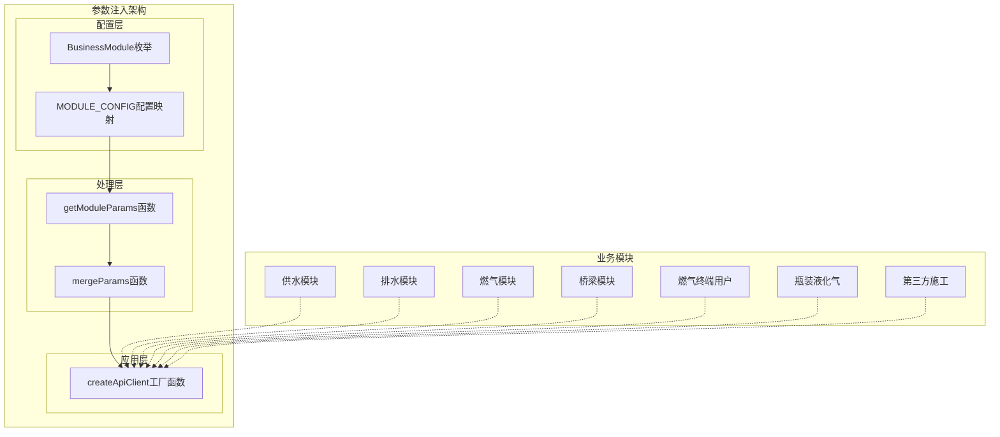
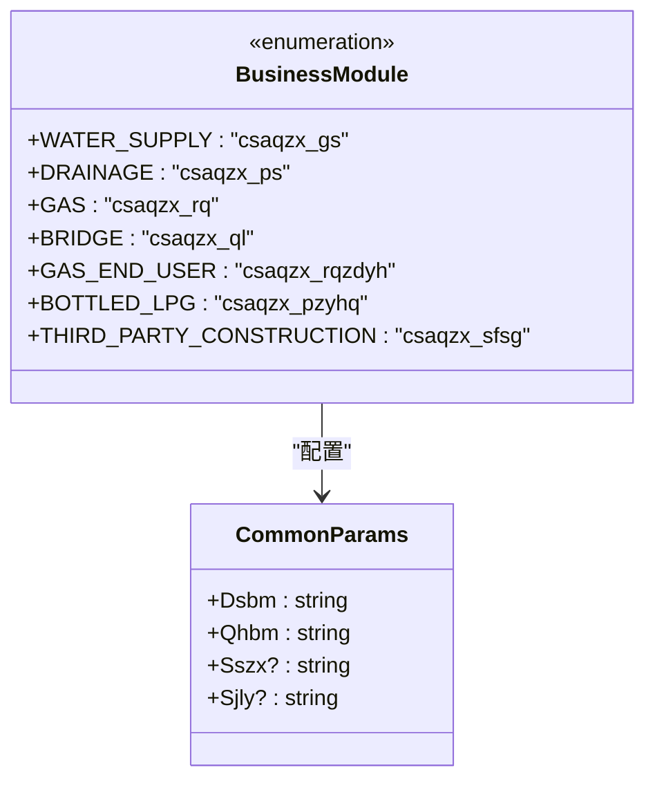
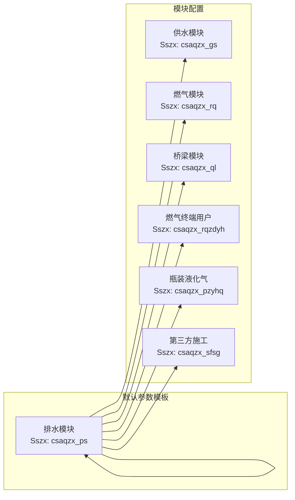
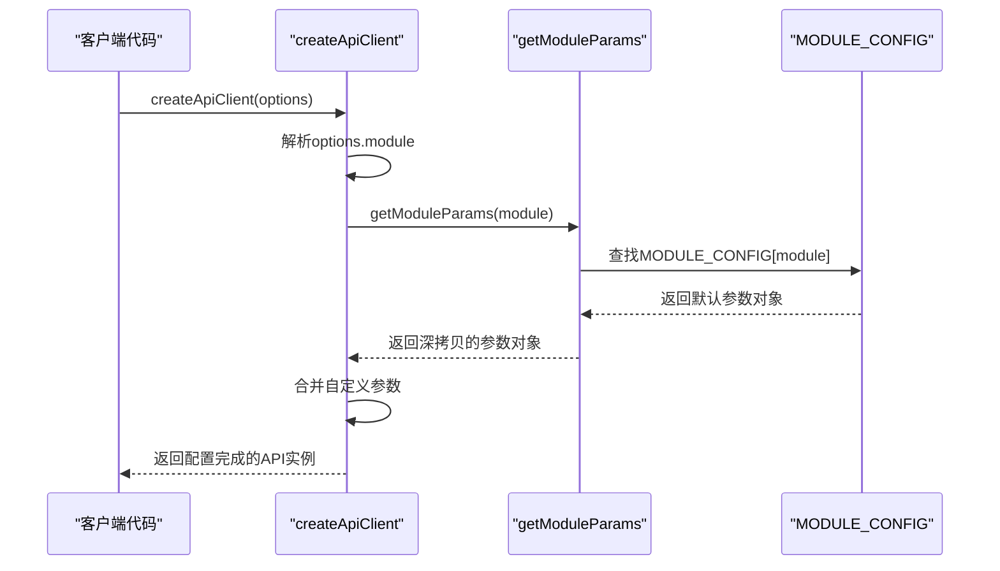
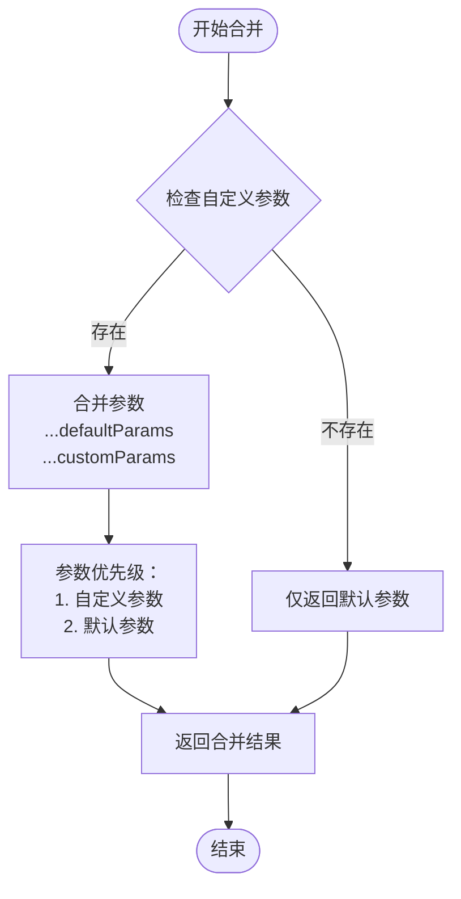
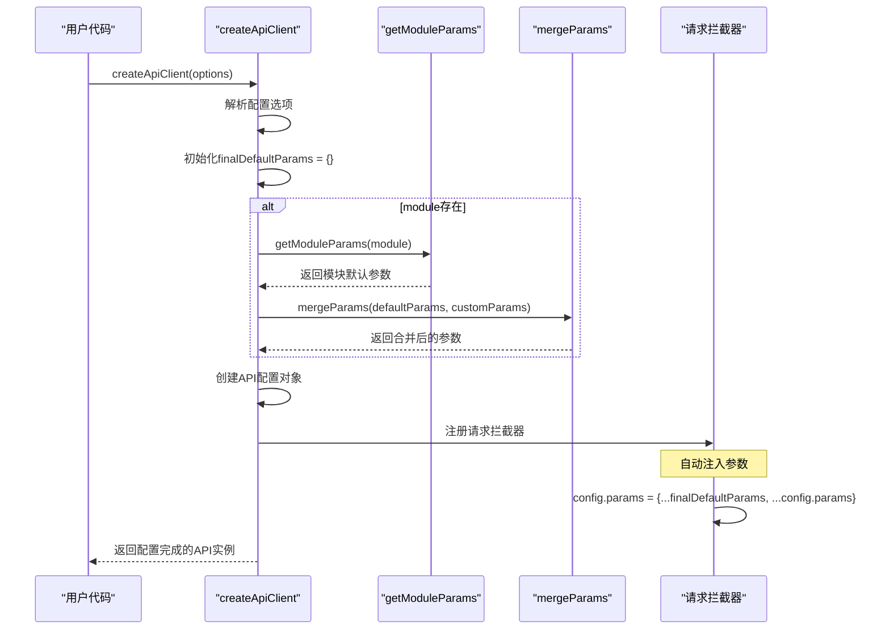
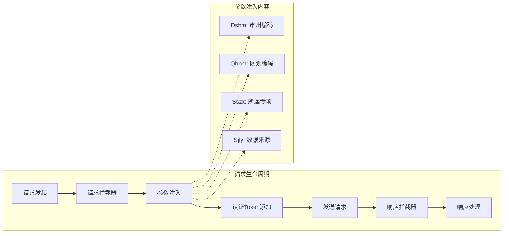

# 参数注入机制

<cite>
**本文档中引用的文件**
- [apiConfig.ts](file://src/api/apiConfig.ts)
- [apiFactory.ts](file://src/api/apiFactory.ts)
- [waterSupplyAndDrainage.ts](file://src/api/waterSupplyAndDrainage.ts)
- [gas.ts](file://src/api/gas.ts)
- [waterSupplyService.ts](file://src/services/waterSupplyService.ts)
- [gasService.ts](file://src/services/gasService.ts)
- [common.ts](file://src/api/common.ts)
</cite>

## 目录
1. [概述](#概述)
2. [核心组件架构](#核心组件架构)
3. [BusinessModule枚举详解](#businessmodule枚举详解)
4. [MODULE_CONFIG配置映射表](#module_config配置映射表)
5. [getModuleParams函数工作原理](#getmoduleparams函数工作原理)
6. [mergeParams函数实现机制](#mergeparams函数实现机制)
7. [参数注入完整流程](#参数注入完整流程)
8. [实际应用场景](#实际应用场景)
9. [最佳实践与注意事项](#最佳实践与注意事项)
10. [总结](#总结)

## 概述

参数注入机制是政府Dashboard项目中一个精心设计的API参数管理系统，它通过BusinessModule枚举、getModuleParams函数和mergeParams函数的协同工作，为不同的业务模块提供标准化的默认参数配置。该机制确保了系统在调用API时能够自动携带必要的业务上下文参数（如市州编码、区划编码、所属专项等），同时支持自定义参数的灵活覆盖。

这种设计模式不仅提高了代码的可维护性和一致性，还简化了业务模块的API调用过程，使开发者能够专注于业务逻辑而非重复的参数配置。

## 核心组件架构

参数注入机制由三个核心组件构成，形成了一个完整的参数管理体系：



**图表来源**
- [apiConfig.ts](file://src/api/apiConfig.ts#L6-L22)
- [apiConfig.ts](file://src/api/apiConfig.ts#L42-L72)
- [apiFactory.ts](file://src/api/apiFactory.ts#L78-L83)

**章节来源**
- [apiConfig.ts](file://src/api/apiConfig.ts#L1-L98)
- [apiFactory.ts](file://src/api/apiFactory.ts#L1-L253)

## BusinessModule枚举详解

BusinessModule枚举定义了系统中所有支持的业务模块，每个枚举值对应一个特定的业务领域，并具有独特的标识符：



**图表来源**
- [apiConfig.ts](file://src/api/apiConfig.ts#L6-L22)

### 枚举值详细说明

| 枚举值 | 标识符 | 业务含义 | 应用场景 |
|--------|--------|----------|----------|
| WATER_SUPPLY | csaqzx_gs | 供水 | 供水管网、水厂、泵站等基础设施管理 |
| DRAINAGE | csaqzx_ps | 排水 | 排水管网、污水厂、雨水系统等 |
| GAS | csaqzx_rq | 燃气 | 天然气管网、燃气场站、燃气企业等 |
| BRIDGE | csaqzx_ql | 桥梁 | 桥梁检测、维护、风险评估 |
| GAS_END_USER | csaqzx_rqzdyh | 燃气终端用户 | 居民用户、工商业用户的用气管理 |
| BOTTLED_LPG | csaqzx_pzyhq | 瓶装液化气 | 液化气瓶、供应站、运输车管理 |
| THIRD_PARTY_CONSTRUCTION | csaqzx_sfsg | 第三方施工 | 施工现场监管、安全检查 |

**章节来源**
- [apiConfig.ts](file://src/api/apiConfig.ts#L6-L22)

## MODULE_CONFIG配置映射表

MODULE_CONFIG是一个精心设计的配置映射表，为每个业务模块提供了标准化的默认参数集合。该映射表基于DEFAULT_COMMON_PARAMS进行扩展，确保了参数的一致性和完整性。



**图表来源**
- [apiConfig.ts](file://src/api/apiConfig.ts#L37-L41)
- [apiConfig.ts](file://src/api/apiConfig.ts#L42-L72)

### 配置表结构分析

MODULE_CONFIG采用Record类型定义，确保了类型安全和配置的完整性：

```typescript
// 配置映射表结构
export const MODULE_CONFIG: Record<BusinessModule, CommonParams> = {
  [BusinessModule.WATER_SUPPLY]: {
    ...DEFAULT_COMMON_PARAMS,
    Sszx: BusinessModule.WATER_SUPPLY,
  },
  // 其他模块配置...
}
```

### 默认参数模板

DEFAULT_COMMON_PARAMS定义了所有业务模块共享的基础参数：

| 参数名 | 类型 | 默认值 | 说明 |
|--------|------|--------|------|
| Dsbm | string | 420200 | 市州编码（黄石市） |
| Qhbm | string | 420222 | 区划编码（阳新县） |
| Sszx | string | - | 所属专项（各模块独有） |
| Sjly | string | - | 数据来源（可选） |

**章节来源**
- [apiConfig.ts](file://src/api/apiConfig.ts#L37-L72)

## getModuleParams函数工作原理

getModuleParams函数是参数注入机制的核心处理器之一，负责根据指定的业务模块从MODULE_CONFIG中提取对应的默认参数配置。



**图表来源**
- [apiFactory.ts](file://src/api/apiFactory.ts#L78-L83)
- [apiConfig.ts](file://src/api/apiConfig.ts#L78-L81)

### 函数实现细节

getModuleParams函数采用了简洁而高效的实现方式：

```typescript
export function getModuleParams(module: BusinessModule): CommonParams {
  return { ...MODULE_CONFIG[module] }
}
```

该实现的关键特性：
1. **深拷贝保护**：使用展开运算符创建新对象，避免直接引用导致的意外修改
2. **类型安全保障**：编译时确保返回值符合CommonParams接口
3. **性能优化**：简单的对象复制操作，开销极小

**章节来源**
- [apiConfig.ts](file://src/api/apiConfig.ts#L78-L81)

## mergeParams函数实现机制

mergeParams函数实现了参数合并的核心逻辑，遵循"自定义参数优先"的原则，确保用户提供的自定义参数能够正确覆盖默认参数。



**图表来源**
- [apiConfig.ts](file://src/api/apiConfig.ts#L88-L97)

### 合并策略分析

mergeParams函数采用ES6展开运算符实现参数合并，其核心逻辑体现了现代JavaScript的最佳实践：

```typescript
export function mergeParams(
  defaultParams: Partial<CommonParams>,
  customParams?: Partial<CommonParams>
): Partial<CommonParams> {
  return {
    ...defaultParams,
    ...customParams,
  }
}
```

### 优先级规则

参数合并遵循严格的优先级规则：

1. **自定义参数优先**：如果自定义参数中包含某个字段，该值将覆盖默认参数中的同名字段
2. **默认参数降级**：只有当自定义参数中不存在某个字段时，才会使用默认参数的值
3. **部分匹配**：支持只覆盖部分参数，其他参数保持不变

### 实际合并效果

以下展示了不同场景下的合并结果：

| 默认参数 | 自定义参数 | 合并结果 | 说明 |
|----------|------------|----------|------|
| `{ Dsbm: "420200", Qhbm: "420222" }` | `{}` | `{ Dsbm: "420200", Qhbm: "420222" }` | 无自定义参数，使用默认值 |
| `{ Dsbm: "420200", Qhbm: "420222" }` | `{ Dsbm: "420201" }` | `{ Dsbm: "420201", Qhbm: "420222" }` | Dsbm被自定义参数覆盖 |
| `{ Dsbm: "420200", Qhbm: "420222" }` | `{ Qhbm: "420223" }` | `{ Dsbm: "420200", Qhbm: "420223" }` | Qhbm被自定义参数覆盖 |
| `{ Dsbm: "420200", Qhbm: "420222" }` | `{ Dsbm: "420201", Qhbm: "420223" }` | `{ Dsbm: "420201", Qhbm: "420223" }` | 双参数都被覆盖 |

**章节来源**
- [apiConfig.ts](file://src/api/apiConfig.ts#L88-L97)

## 参数注入完整流程

参数注入机制在createApiClient工厂函数中实现了完整的参数处理流程，从模块识别到最终的API配置生成。



**图表来源**
- [apiFactory.ts](file://src/api/apiFactory.ts#L78-L83)
- [apiFactory.ts](file://src/api/apiFactory.ts#L108-L114)

### 详细流程步骤

#### 1. 配置选项解析
createApiClient函数首先解构传入的配置选项：

```typescript
const {
  module,
  defaultParams = {},
  autoInjectParams = true,
  axiosConfig = {},
} = options
```

#### 2. 默认参数计算
根据module参数决定是否应用模块默认参数：

```typescript
let finalDefaultParams: Partial<CommonParams> = {}
if (module) {
  finalDefaultParams = getModuleParams(module)
}
finalDefaultParams = mergeParams(finalDefaultParams, defaultParams)
```

#### 3. API配置创建
构建基础的API配置对象：

```typescript
const baseURL = (import.meta as any).env?.VITE_API_BASE_URL || '/clapi'
const apiConfig: ApiConfig = {
  baseURL,
  timeout: 15000,
  headers: {
    'Content-Type': 'application/json',
  },
  ...axiosConfig,
}
```

#### 4. 请求拦截器注册
在请求拦截器中实现参数自动注入：

```typescript
if (autoInjectParams && Object.keys(finalDefaultParams).length > 0) {
  config.params = {
    ...finalDefaultParams,
    ...config.params, // 请求时传入的参数优先级更高
  }
}
```

### 参数注入时机

参数注入发生在请求发送之前，通过Axios的请求拦截器实现：



**图表来源**
- [apiFactory.ts](file://src/api/apiFactory.ts#L108-L114)

**章节来源**
- [apiFactory.ts](file://src/api/apiFactory.ts#L67-L208)

## 实际应用场景

参数注入机制在项目中有着广泛的应用场景，以下通过具体的代码示例展示其实际使用效果。

### 供水模块API实例创建

```typescript
// 创建供水模块API实例
const waterApi = createWaterSupplyApi()

// 实际调用效果
const data = await waterApi.overviewData.List({
  Jcsslx: 'jcssdstj0501', // 供水管网
  Sjly: 'company_code'   // 数据来源
})
```

**参数注入效果**：
- 自动添加：`Dsbm: "420200"`, `Qhbm: "420222"`, `Sszx: "csaqzx_gs"`
- 用户参数：`Jcsslx: "jcssdstj0501"`, `Sjly: "company_code"`
- 最终请求参数：`{ Dsbm: "420200", Qhbm: "420222", Sszx: "csaqzx_gs", Jcsslx: "jcssdstj0501", Sjly: "company_code" }`

### 燃气模块API实例创建

```typescript
// 创建燃气模块API实例
const gasApi = createGasApi()

// 调用燃气相关接口
const materialRatio = await gasApi.gspspDtransPubunderpipeline.gasMaterialRatioList()
const emergencyCapacity = await gasApi.yjnl.listList()
```

**参数注入效果**：
- 自动添加：`Dsbm: "420200"`, `Qhbm: "420222"`, `Sszx: "csaqzx_rq"`
- 无需额外参数，所有接口自动携带业务上下文

### 自定义参数覆盖示例

```typescript
// 创建带有自定义参数的API实例
const customWaterApi = createApiClient(WaterSupplyApi, {
  module: BusinessModule.WATER_SUPPLY,
  defaultParams: {
    Dsbm: "420201", // 覆盖市州编码
    Sjly: "custom_source" // 自定义数据来源
  }
})

// 调用时仍然可以传递额外参数
const result = await customWaterApi.overviewData.List({
  Jcsslx: 'jcssdstj0501'
})
```

**参数合并效果**：
- 默认参数：`Dsbm: "420200", Qhbm: "420222", Sszx: "csaqzx_gs"`
- 自定义参数：`Dsbm: "420201", Sjly: "custom_source"`
- 合并结果：`Dsbm: "420201", Qhbm: "420222", Sszx: "csaqzx_gs", Sjly: "custom_source"`

### 通用API实例创建

```typescript
// 创建通用API实例（不注入业务模块参数）
const commonApi = createCommonApi()

// 用于登录、数据字典等通用功能
const loginResult = await commonApi.login.publicKeyList()
```

**特点**：
- 不自动注入业务模块参数
- 适用于跨模块的通用功能
- 完全由用户控制参数传递

**章节来源**
- [apiFactory.ts](file://src/api/apiFactory.ts#L221-L252)
- [waterSupplyService.ts](file://src/services/waterSupplyService.ts#L8-L20)
- [gasService.ts](file://src/services/gasService.ts#L13-L23)

## 最佳实践与注意事项

### 参数设计原则

1. **最小化默认参数**：只提供业务必需的最小参数集
2. **明确的覆盖规则**：自定义参数始终优先于默认参数
3. **类型安全保证**：使用TypeScript确保参数类型的正确性
4. **向后兼容性**：新增参数时保持现有接口的兼容性

### 性能优化建议

1. **避免频繁创建实例**：API实例创建成本较高，建议复用
2. **合理使用自定义参数**：只在必要时提供自定义参数
3. **参数缓存策略**：对于静态参数，考虑在应用层面缓存

### 错误处理策略

1. **参数验证**：在参数注入前验证必填参数
2. **类型检查**：确保参数类型符合预期
3. **错误提示**：提供清晰的参数错误信息

### 调试技巧

1. **开发环境日志**：利用开发环境的日志功能查看注入的参数
2. **参数追踪**：在拦截器中记录参数变化
3. **单元测试**：编写针对参数注入的单元测试

### 扩展性考虑

1. **新模块添加**：按照现有模式添加新的BusinessModule枚举值
2. **配置扩展**：在MODULE_CONFIG中添加新模块的默认配置
3. **接口兼容**：确保新添加的模块与现有接口兼容

## 总结

参数注入机制通过BusinessModule枚举、getModuleParams函数和mergeParams函数的完美协作，构建了一个高效、灵活且类型安全的参数管理系统。该机制的主要优势包括：

### 核心价值

1. **标准化配置**：为不同业务模块提供统一的参数配置标准
2. **自动化处理**：减少手动参数配置的工作量和出错概率
3. **灵活性保障**：支持自定义参数覆盖，满足特殊需求
4. **类型安全保障**：利用TypeScript确保参数的类型安全
5. **易于扩展**：新业务模块的添加只需更新配置即可

### 技术亮点

- **函数式编程**：采用纯函数设计，便于测试和维护
- **组合优于继承**：通过函数组合实现复杂的功能
- **类型推导**：充分利用TypeScript的类型推导能力
- **拦截器模式**：优雅地实现横切关注点的处理

### 应用效果

该机制成功地简化了API调用的复杂度，提高了开发效率，同时确保了系统的稳定性和可维护性。通过合理的抽象和封装，使得业务开发者能够专注于核心业务逻辑，而不必关心底层的参数管理细节。

这种设计模式不仅适用于当前的政府Dashboard项目，也为类似的企业级应用开发提供了宝贵的参考经验。