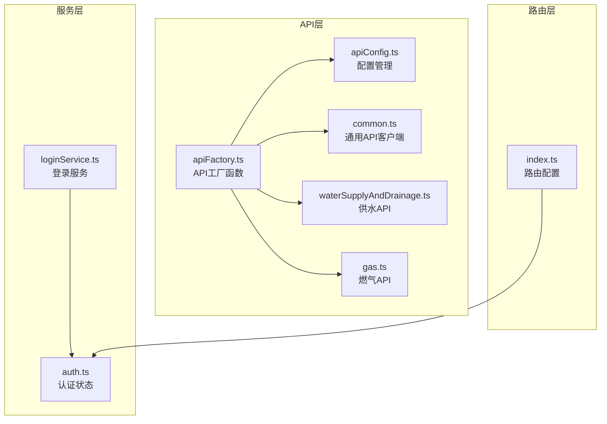
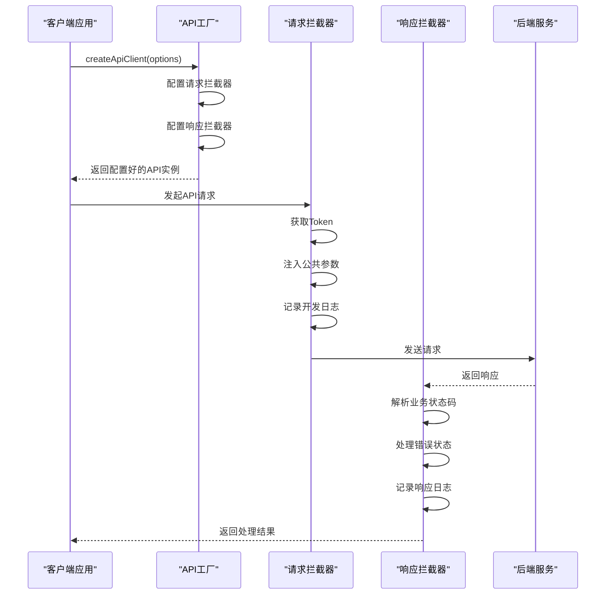
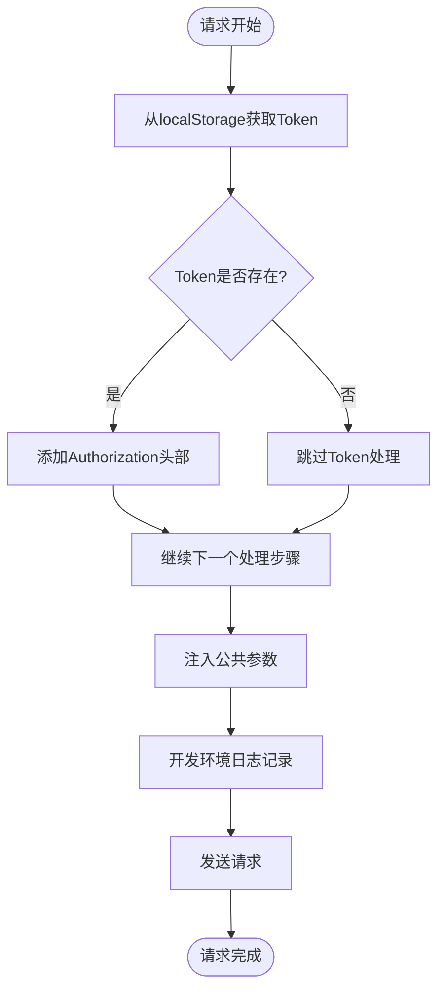
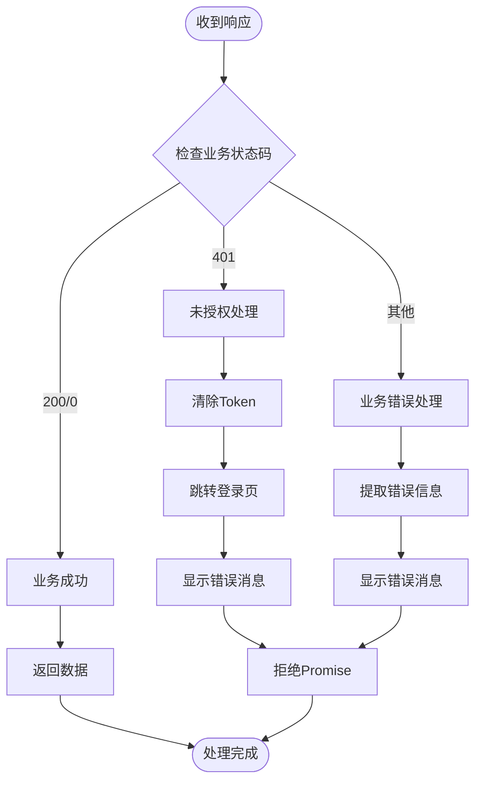
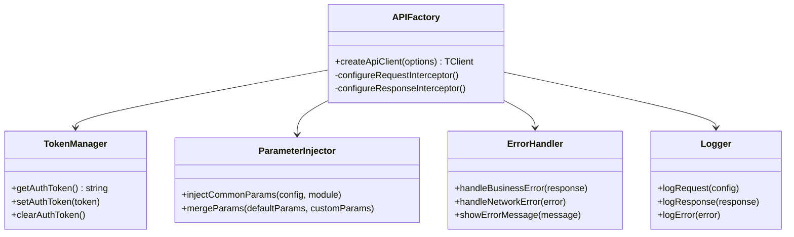
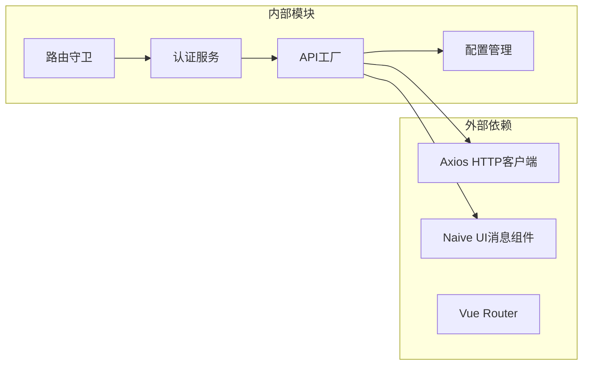

# 拦截器配置

<cite>
**本文档引用的文件**
- [apiFactory.ts](file://src/api/apiFactory.ts)
- [apiConfig.ts](file://src/api/apiConfig.ts)
- [common.ts](file://src/api/common.ts)
- [waterSupplyAndDrainage.ts](file://src/api/waterSupplyAndDrainage.ts)
- [gas.ts](file://src/api/gas.ts)
- [loginService.ts](file://src/services/loginService.ts)
- [auth.ts](file://src/stores/auth.ts)
- [index.ts](file://src/router/index.ts)
</cite>

## 目录
1. [概述](#概述)
2. [项目结构](#项目结构)
3. [核心组件](#核心组件)
4. [架构概览](#架构概览)
5. [详细组件分析](#详细组件分析)
6. [依赖关系分析](#依赖关系分析)
7. [性能考虑](#性能考虑)
8. [故障排除指南](#故障排除指南)
9. [结论](#结论)

## 概述

API工厂中的拦截器配置是整个政府Dashboard系统中负责统一处理HTTP请求和响应的核心机制。该系统通过精心设计的拦截器链实现了以下关键功能：

- **认证Token管理**：自动从localStorage获取并注入Authorization头部
- **参数注入**：根据业务模块自动注入公共参数（市州编码、区划编码等）
- **开发环境日志**：提供详细的请求和响应日志记录
- **统一错误处理**：基于业务状态码和HTTP状态码的全局错误处理
- **关注点分离**：通过模块化设计提升代码复用性和可维护性

## 项目结构

**图表来源**
- [apiFactory.ts](file://src/api/apiFactory.ts#L1-L253)
- [apiConfig.ts](file://src/api/apiConfig.ts#L1-L98)
- [common.ts](file://src/api/common.ts#L1-L961)

**章节来源**
- [apiFactory.ts](file://src/api/apiFactory.ts#L1-L253)
- [apiConfig.ts](file://src/api/apiConfig.ts#L1-L98)

## 核心组件

### API工厂函数

API工厂函数是整个拦截器系统的核心入口点，提供了统一的API客户端创建机制。该函数支持泛型配置，能够为不同的业务模块创建专门的API实例。

### 配置管理系统

配置管理系统负责管理业务模块参数、默认参数和模块映射关系。它提供了灵活的参数合并机制，允许业务模块参数与自定义参数的优先级控制。

### 拦截器链

拦截器链由两个主要部分组成：
- **请求拦截器**：处理请求前的准备工作
- **响应拦截器**：处理响应后的业务逻辑

**章节来源**
- [apiFactory.ts](file://src/api/apiFactory.ts#L67-L208)
- [apiConfig.ts](file://src/api/apiConfig.ts#L75-L98)

## 架构概览

**图表来源**
- [apiFactory.ts](file://src/api/apiFactory.ts#L99-L207)

## 详细组件分析

### 请求拦截器实现

请求拦截器负责在每个API请求发送之前执行必要的预处理工作，确保请求符合系统的安全和业务要求。

#### Token注入机制

**图表来源**
- [apiFactory.ts](file://src/api/apiFactory.ts#L102-L126)

#### 公共参数注入

公共参数注入机制根据业务模块自动添加必要的系统参数，确保每个请求都包含正确的上下文信息。

| 参数类型 | 字段名 | 默认值 | 说明 |
|---------|--------|--------|------|
| 市州编码 | Dsbm | 420200 | 黄石市编码 |
| 区划编码 | Qhbm | 420222 | 阳新县编码 |
| 所属专项 | Sszx | 根据模块 | 业务专项标识 |
| 数据来源 | Sjly | 可选 | 数据来源标识 |

#### 开发环境日志记录

在开发环境中，请求拦截器会记录详细的请求信息，包括方法、URL、参数和数据内容，便于调试和问题排查。

**章节来源**
- [apiFactory.ts](file://src/api/apiFactory.ts#L100-L126)
- [apiConfig.ts](file://src/api/apiConfig.ts#L25-L40)

### 响应拦截器实现

响应拦截器负责处理所有API响应，统一解析业务状态码，并对各种错误情况进行适当的处理。

#### 业务状态码处理

**图表来源**
- [apiFactory.ts](file://src/api/apiFactory.ts#L136-L206)

#### HTTP状态码错误处理

响应拦截器针对不同的HTTP状态码提供专门的错误处理逻辑：

| HTTP状态码 | 处理方式 | 用户提示 |
|-----------|----------|----------|
| 401 | 清除Token并跳转登录 | "登录已过期，请重新登录" |
| 403 | 权限不足 | "没有权限访问该资源" |
| 404 | 资源不存在 | "请求的资源不存在" |
| 500 | 服务器错误 | "登录已过期，请重新登录" |
| 502 | 网关错误 | "网关错误" |
| 503 | 服务不可用 | "服务暂时不可用" |

#### 错误信息提取机制

响应拦截器具有智能的错误信息提取能力，优先从`info`字段提取错误信息，如果不存在则尝试从`message`字段获取。

**章节来源**
- [apiFactory.ts](file://src/api/apiFactory.ts#L136-L206)

### 关注点分离设计

拦截器系统通过模块化设计实现了良好的关注点分离：

**图表来源**
- [apiFactory.ts](file://src/api/apiFactory.ts#L16-L208)
- [apiConfig.ts](file://src/api/apiConfig.ts#L75-L98)

**章节来源**
- [apiFactory.ts](file://src/api/apiFactory.ts#L16-L208)
- [apiConfig.ts](file://src/api/apiConfig.ts#L75-L98)

## 依赖关系分析

**图表来源**
- [apiFactory.ts](file://src/api/apiFactory.ts#L7-L12)
- [index.ts](file://src/router/index.ts#L1-L7)

**章节来源**
- [apiFactory.ts](file://src/api/apiFactory.ts#L7-L12)
- [index.ts](file://src/router/index.ts#L1-L7)

## 性能考虑

拦截器系统在设计时充分考虑了性能优化：

- **延迟加载**：只有在实际使用API时才创建拦截器
- **缓存机制**：Token和公共参数采用内存缓存
- **条件执行**：开发环境日志只在DEV模式下启用
- **异步处理**：错误处理采用异步方式，避免阻塞主线程

## 故障排除指南

### 常见问题及解决方案

#### Token注入失败
**症状**：请求被拒绝，返回401未授权
**原因**：localStorage中缺少有效的Token
**解决方案**：检查登录流程，确保Token正确存储

#### 参数注入异常
**症状**：请求参数不完整或错误
**原因**：业务模块配置缺失或参数合并失败
**解决方案**：验证模块配置和参数合并逻辑

#### 响应处理错误
**症状**：业务错误无法正确显示
**原因**：错误信息提取逻辑异常
**解决方案**：检查响应数据结构和错误处理逻辑

**章节来源**
- [apiFactory.ts](file://src/api/apiFactory.ts#L128-L132)
- [apiFactory.ts](file://src/api/apiFactory.ts#L169-L206)

## 结论

API工厂中的拦截器配置系统通过精心设计的架构和实现，成功实现了以下目标：

1. **统一性**：为所有API请求提供一致的处理流程
2. **安全性**：自动处理认证Token，确保请求的安全性
3. **灵活性**：支持不同业务模块的个性化配置
4. **可维护性**：通过关注点分离提升代码质量
5. **可观测性**：提供完善的日志记录和错误处理

该系统不仅满足了当前的功能需求，还为未来的扩展和维护奠定了坚实的基础。通过模块化的架构设计和清晰的关注点分离，开发者可以轻松地添加新的业务逻辑或修改现有行为，而不会影响系统的整体稳定性。