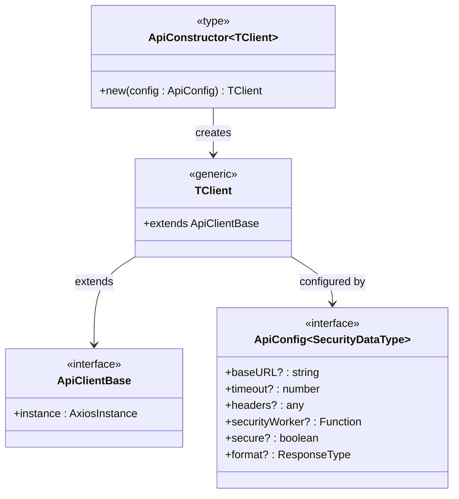
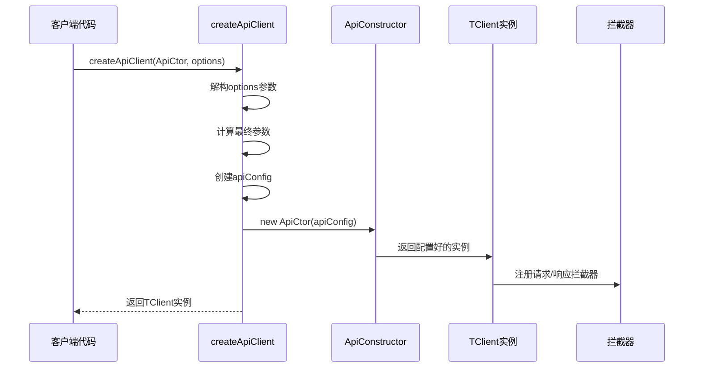
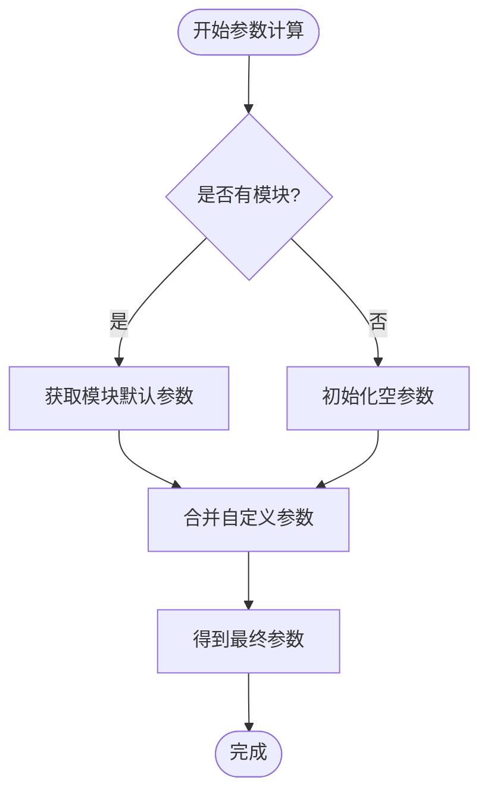
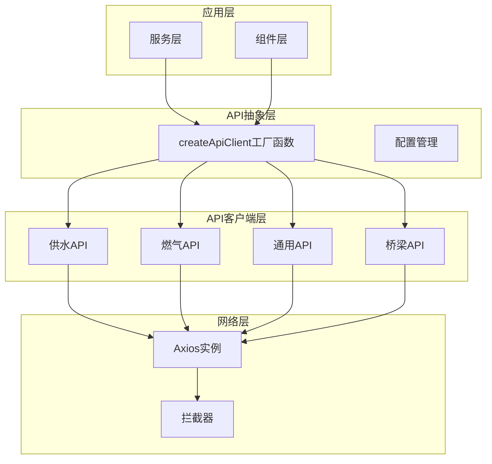
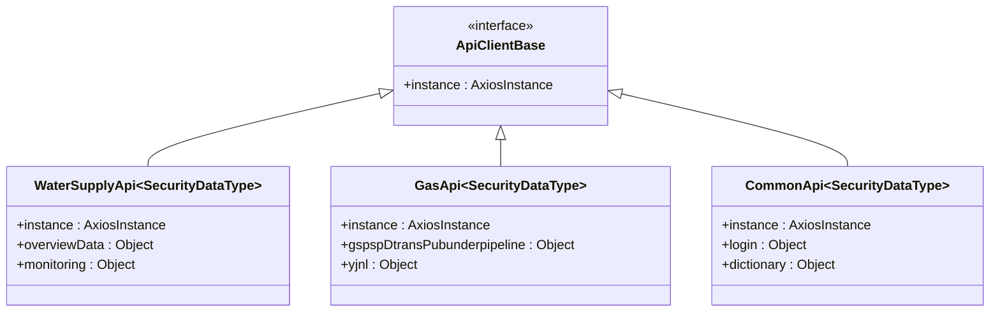
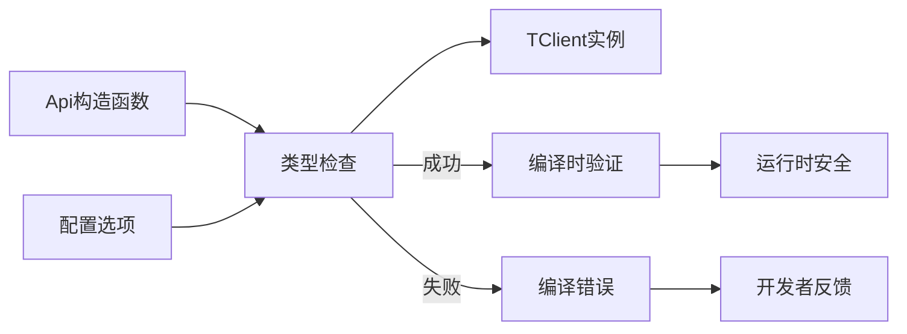
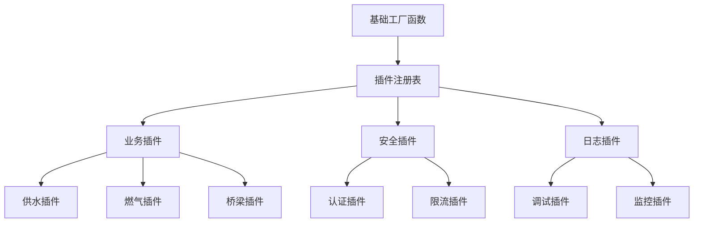

# 泛型API工厂函数

<cite>
**本文档中引用的文件**
- [apiFactory.ts](file://src/api/apiFactory.ts)
- [apiConfig.ts](file://src/api/apiConfig.ts)
- [common.ts](file://src/api/common.ts)
- [waterSupplyAndDrainage.ts](file://src/api/waterSupplyAndDrainage.ts)
- [gas.ts](file://src/api/gas.ts)
- [gasService.ts](file://src/services/gasService.ts)
- [README.md](file://src/api/README.md)
</cite>

## 目录
1. [简介](#简介)
2. [设计原理](#设计原理)
3. [核心类型定义](#核心类型定义)
4. [函数实现详解](#函数实现详解)
5. [架构设计](#架构设计)
6. [使用示例](#使用示例)
7. [类型安全优势](#类型安全优势)
8. [扩展性分析](#扩展性分析)
9. [最佳实践](#最佳实践)
10. [总结](#总结)

## 简介

createApiClient是一个高度灵活的泛型API工厂函数，专门设计用于创建由swagger-typescript-api生成的各种API客户端实例。该函数通过统一的配置管理和拦截器机制，为不同业务模块提供了标准化的API访问方式，同时保持了类型安全性和可扩展性。

该函数的核心价值在于：
- **通用性**：支持任意由swagger-typescript-api生成的API客户端
- **类型安全**：利用TypeScript泛型确保编译时类型检查
- **配置统一**：提供集中式的API配置和拦截器管理
- **模块化**：支持业务模块参数自动注入和隔离

## 设计原理

### 泛型约束设计

createApiClient采用了精心设计的泛型约束体系，确保类型安全的同时提供最大的灵活性：



**图表来源**
- [apiFactory.ts](file://src/api/apiFactory.ts#L38-L45)

### 构造函数注入模式

该函数采用构造函数注入模式，允许传入任何符合特定接口规范的API客户端构造函数：



**图表来源**
- [apiFactory.ts](file://src/api/apiFactory.ts#L67-L208)

## 核心类型定义

### ApiConstructor<TClient>类型

ApiConstructor是一个关键的类型定义，它约束了传入的构造函数必须接受ApiConfig类型的配置参数并返回TClient类型的实例：

```typescript
type ApiConstructor<TClient> = new (config: ApiConfig) => TClient
```

这个类型定义的关键特性：
- **泛型约束**：确保传入的构造函数与目标类型兼容
- **配置参数**：要求构造函数接受ApiConfig作为唯一参数
- **返回类型**：保证返回值符合预期的客户端类型

### ApiClientBase接口

ApiClientBase定义了所有API客户端必须满足的基本契约：

```typescript
interface ApiClientBase {
  instance: AxiosInstance
}
```

这个接口的作用：
- **Axios集成**：确保每个客户端都包含Axios实例
- **拦截器支持**：为统一的请求/响应处理提供基础
- **类型一致性**：为泛型约束提供明确的基类

### ApiClientOptions配置选项

ApiClientOptions提供了丰富的配置选项，支持灵活的定制需求：

| 配置项 | 类型 | 默认值 | 说明 |
|--------|------|--------|------|
| module | BusinessModule | undefined | 业务模块，自动应用默认参数 |
| defaultParams | Partial<CommonParams> | {} | 自定义默认参数，会覆盖模块默认参数 |
| autoInjectParams | boolean | true | 是否自动添加公共参数 |
| axiosConfig | Partial<AxiosRequestConfig> | {} | 自定义Axios配置 |

**节来源**
- [apiFactory.ts](file://src/api/apiFactory.ts#L38-L59)

## 函数实现详解

### 参数解析与验证

函数首先对传入的options参数进行解构和验证：

```typescript
const {
  module,
  defaultParams = {},
  autoInjectParams = true,
  axiosConfig = {},
} = options
```

这种解构赋值不仅简化了代码，还提供了合理的默认值处理。

### 参数计算逻辑

函数实现了智能的参数计算逻辑，支持模块级和自定义参数的合并：



**图表来源**
- [apiFactory.ts](file://src/api/apiFactory.ts#L78-L83)

### API配置构建

函数构建了一个标准化的API配置对象：

```typescript
const apiConfig: ApiConfig = {
  baseURL,
  timeout: 15000,
  headers: {
    'Content-Type': 'application/json',
  },
  ...axiosConfig,
}
```

这个配置包含了：
- **基础URL**：从环境变量或默认值获取
- **超时设置**：15秒的标准超时时间
- **内容类型**：JSON格式的默认头部
- **扩展配置**：支持自定义Axios配置

### 拦截器配置

函数注册了两套拦截器，分别处理请求和响应：

#### 请求拦截器功能
- **认证Token注入**：自动添加Authorization头部
- **参数合并**：将业务模块参数与请求参数合并
- **开发环境日志**：提供详细的请求调试信息

#### 响应拦截器功能
- **业务状态码处理**：统一处理业务层面的成功/失败状态
- **HTTP状态码处理**：针对不同HTTP状态码提供相应处理
- **错误提示**：使用Naive UI的消息组件显示错误信息

**节来源**
- [apiFactory.ts](file://src/api/apiFactory.ts#L96-L208)

## 架构设计

### 整体架构图



**图表来源**
- [apiFactory.ts](file://src/api/apiFactory.ts#L213-L252)

### 模块化设计

该架构采用了高度模块化的设计原则：

1. **业务模块隔离**：每个业务模块都有独立的API客户端
2. **配置分离**：业务参数与技术配置完全分离
3. **扩展性**：新增业务模块只需添加对应的工厂函数

### 类型层次结构



**图表来源**
- [waterSupplyAndDrainage.ts](file://src/api/waterSupplyAndDrainage.ts#L146-L147)
- [gas.ts](file://src/api/gas.ts#L146-L147)
- [common.ts](file://src/api/common.ts#L834-L835)

## 使用示例

### 基本使用模式

#### 1. 服务层封装模式（推荐）

```typescript
// 基于API客户端的服务层
import { createGasApi } from "@/api/apiFactory";

const gasApi = createGasApi();

export async function getGasCdRatio() {
  const res = await gasApi.gspspDtransPubunderpipeline.gasCdRatioList();
  return res.data || [];
}
```

#### 2. 直接API客户端模式

```typescript
import { createWaterSupplyApi, createCommonApi } from '@/api'

const waterApi = createWaterSupplyApi()
const commonApi = createCommonApi()

// 调用接口
const data = await waterApi.overviewData.List()
const publicKey = await commonApi.login.publicKeyList()
```

### 高级配置示例

#### 自定义参数注入

```typescript
// 创建带有自定义参数的API实例
const customWaterApi = createApiClient(WaterSupplyApi, {
  module: BusinessModule.WATER_SUPPLY,
  defaultParams: {
    Ssjg: 'custom_value'  // 自定义参数
  },
  autoInjectParams: true
})
```

#### 禁用参数注入

```typescript
// 创建不注入业务参数的通用API
const commonApi = createApiClient(CommonApi, {
  autoInjectParams: false
})
```

#### 自定义Axios配置

```typescript
const debugApi = createApiClient(WaterSupplyApi, {
  module: BusinessModule.WATER_SUPPLY,
  axiosConfig: {
    timeout: 30000,  // 增加超时时间
    headers: {
      'X-Custom-Header': 'custom-value'
    }
  }
})
```

**节来源**
- [gasService.ts](file://src/services/gasService.ts#L13-L15)
- [apiFactory.ts](file://src/api/apiFactory.ts#L221-L251)

## 类型安全优势

### 编译时类型检查

createApiClient通过泛型约束提供了强大的编译时类型安全保障：



### 类型推断机制

TypeScript能够自动推断返回的客户端类型：

```typescript
// 类型自动推断为 WaterSupplyApi<unknown>
const waterApi = createWaterSupplyApi()

// 类型自动推断为 GasApi<unknown>
const gasApi = createGasApi()
```

### 接口完整性保证

通过ApiClientBase接口约束，确保所有API客户端都具有相同的接口特征：

```typescript
// 所有API客户端都必须包含instance属性
function processApi(client: ApiClientBase) {
  // 可以安全地访问client.instance
  client.instance.get('/endpoint')
}
```

**节来源**
- [apiFactory.ts](file://src/api/apiFactory.ts#L67-L70)

## 扩展性分析

### 新增业务模块流程

添加新的业务模块遵循标准的扩展流程：

#### 步骤1：生成API客户端

```bash
npx swagger-typescript-api \
  -p "http://your-api-url/swagger.json" \
  -o ./src/api/ \
  -n newModuleName \
  --axios
```

#### 步骤2：添加工厂函数

```typescript
import { Api as NewModuleApi } from './newModuleName'

export function createNewModuleApi(): NewModuleApi<unknown> {
  return createApiClient(NewModuleApi, { 
    module: BusinessModule.NEW_MODULE 
  })
}
```

### 插件化架构

该设计支持插件化的架构扩展：



### 配置驱动扩展

通过配置文件可以轻松扩展功能：

```typescript
// 在apiConfig.ts中添加新的业务模块
export enum BusinessModule {
  NEW_MODULE = 'csaqzx_new',
}

export const MODULE_CONFIG: Record<BusinessModule, CommonParams> = {
  [BusinessModule.NEW_MODULE]: {
    ...DEFAULT_COMMON_PARAMS,
    Sszx: BusinessModule.NEW_MODULE,
  },
}
```

**节来源**
- [README.md](file://src/api/README.md#L47-L68)
- [apiConfig.ts](file://src/api/apiConfig.ts#L7-L22)

## 最佳实践

### 1. 服务层封装

推荐使用服务层封装API调用，提供更好的业务逻辑组织：

```typescript
// waterSupplyService.ts
import { createWaterSupplyApi } from '@/api/apiFactory'

const waterApi = createWaterSupplyApi()

export async function getWaterOverview() {
  try {
    const response = await waterApi.overviewData.List()
    return response.data
  } catch (error) {
    console.error('获取供水总览失败:', error)
    throw error
  }
}
```

### 2. 错误处理策略

实现统一的错误处理机制：

```typescript
// 错误处理中间件
function createErrorHandler(apiClient: any) {
  return new Proxy(apiClient, {
    get(target, prop) {
      const originalMethod = target[prop]
      if (typeof originalMethod === 'function') {
        return async function(...args: any[]) {
          try {
            return await originalMethod.apply(this, args)
          } catch (error) {
            // 统一错误处理逻辑
            handleApiError(error)
            throw error
          }
        }
      }
      return originalMethod
    }
  })
}
```

### 3. 缓存策略

结合缓存机制提高性能：

```typescript
// 缓存包装器
function createCachedApi(apiClient: any, cacheDuration = 5 * 60 * 1000) {
  const cache = new Map()
  
  return new Proxy(apiClient, {
    get(target, prop) {
      const originalMethod = target[prop]
      if (typeof originalMethod === 'function') {
        return async function(...args: any[]) {
          const cacheKey = `${prop}_${JSON.stringify(args)}`
          const cached = cache.get(cacheKey)
          
          if (cached && Date.now() - cached.timestamp < cacheDuration) {
            return cached.data
          }
          
          const result = await originalMethod.apply(this, args)
          cache.set(cacheKey, { data: result, timestamp: Date.now() })
          return result
        }
      }
      return originalMethod
    }
  })
}
```

### 4. 监控和追踪

集成监控和追踪功能：

```typescript
// 监控包装器
function createMonitoredApi(apiClient: any) {
  return new Proxy(apiClient, {
    get(target, prop) {
      const originalMethod = target[prop]
      if (typeof originalMethod === 'function') {
        return async function(...args: any[]) {
          const startTime = performance.now()
          
          try {
            const result = await originalMethod.apply(this, args)
            const duration = performance.now() - startTime
            
            // 发送监控指标
            sendMetric('api_call_success', {
              method: String(prop),
              duration,
              module: 'water_supply'
            })
            
            return result
          } catch (error) {
            const duration = performance.now() - startTime
            
            // 发送错误指标
            sendMetric('api_call_error', {
              method: String(prop),
              duration,
              error: error.message,
              module: 'water_supply'
            })
            
            throw error
          }
        }
      }
      return originalMethod
    }
  })
}
```

## 总结

createApiClient泛型函数代表了现代前端API设计的最佳实践，它巧妙地结合了以下关键技术特点：

### 核心优势

1. **类型安全**：通过泛型约束和接口定义确保编译时类型安全
2. **高度通用**：支持任意由swagger-typescript-api生成的API客户端
3. **配置统一**：提供集中式的拦截器和配置管理
4. **模块化设计**：支持业务模块的独立配置和参数注入
5. **易于扩展**：遵循开放封闭原则，便于添加新功能

### 技术创新

- **构造函数注入**：通过依赖注入模式提高代码的可测试性和可维护性
- **拦截器链**：实现了请求/响应的统一处理机制
- **参数合并策略**：智能的参数计算和合并算法
- **错误处理机制**：多层次的错误处理和用户反馈

### 应用价值

该设计不仅解决了实际开发中的痛点，还为大型项目的API管理提供了标准化的解决方案。通过这种架构，团队可以：

- **提高开发效率**：减少重复的API配置工作
- **降低维护成本**：统一的错误处理和日志记录
- **增强代码质量**：强类型约束确保代码的可靠性
- **支持快速迭代**：模块化设计便于功能扩展

createApiClient函数的设计充分体现了现代TypeScript开发的最佳实践，为构建高质量的企业级应用提供了坚实的基础架构支撑。