# API集成

<cite>
**本文档引用的文件**
- [httpClient.ts](file://src/services/httpClient.ts)
- [config.ts](file://src/services/config.ts)
- [gasService.ts](file://src/services/gasService.ts)
- [waterSupplyService.ts](file://src/services/waterSupplyService.ts)
- [commonService.ts](file://src/services/commonService.ts)
- [vite.config.js](file://vite.config.js)
- [dictionaryStore.ts](file://src/stores/dictionaryStore.ts)
</cite>

## 更新摘要
**变更内容**
- 删除了旧的API工厂机制，引入了现代化的HTTP客户端架构
- 新增了统一的请求队列管理和并发控制机制
- 更新了服务层封装方式，直接使用新的HTTP客户端
- 改进了错误处理和消息防重复机制
- 保持了原有的业务模块配置和环境变量管理

## 目录
1. [概述](#概述)
2. [HTTP客户端架构](#http客户端架构)
3. [统一HTTP客户端](#统一http客户端)
4. [请求队列管理](#请求队列管理)
5. [服务层封装](#服务层封装)
6. [Vite代理配置](#vite代理配置)
7. [API调用流程](#api调用流程)
8. [错误处理机制](#错误处理机制)
9. [API版本管理](#api版本管理)
10. [Mock数据使用](#mock数据使用)
11. [最佳实践](#最佳实践)

## 概述

政府dashboard项目采用现代化的HTTP客户端架构，通过httpClient.ts提供统一的API请求管理。整个API集成体系包含以下核心组件：

- **统一HTTP客户端**：提供统一的请求配置、拦截器和错误处理
- **请求队列管理**：支持并发控制和请求去重
- **服务层封装**：封装具体的业务逻辑和参数管理
- **配置层**：管理业务模块参数和环境变量
- **拦截器层**：统一处理请求/响应拦截和错误处理

## HTTP客户端架构

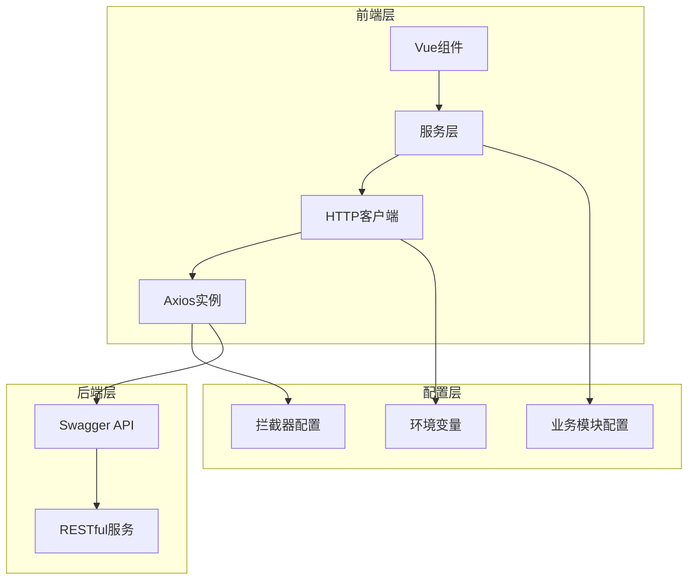

**图表来源**
- [httpClient.ts](file://src/services/httpClient.ts#L96-L104)
- [config.ts](file://src/services/config.ts#L48-L53)

**章节来源**
- [httpClient.ts](file://src/services/httpClient.ts#L1-L297)
- [config.ts](file://src/services/config.ts#L1-L114)

## 统一HTTP客户端

### HTTP客户端核心功能

httpClient.ts提供了现代化的HTTP客户端，替代了旧的API工厂机制：

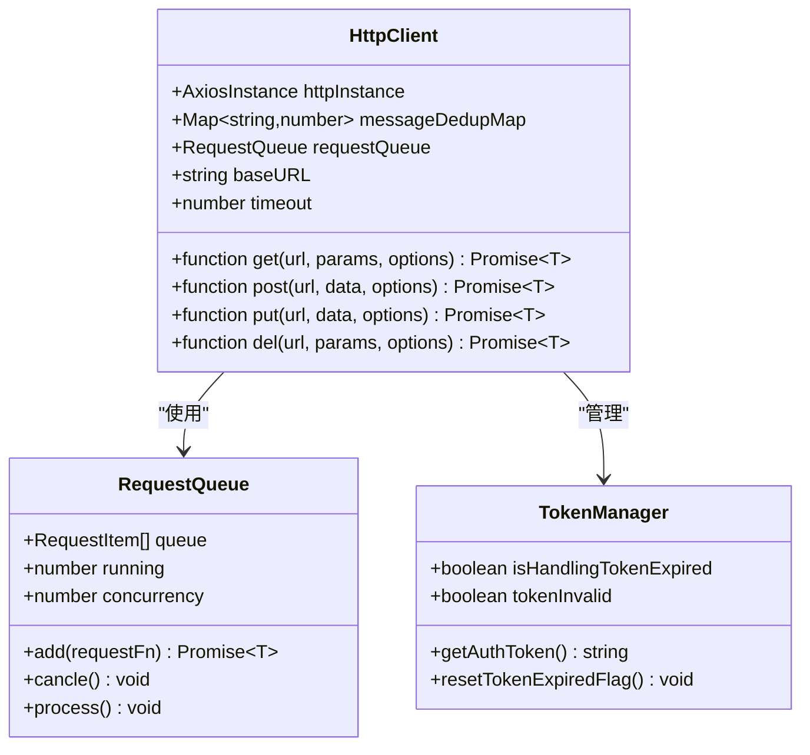

**图表来源**
- [httpClient.ts](file://src/services/httpClient.ts#L53-L92)
- [httpClient.ts](file://src/services/httpClient.ts#L20-L29)

### 请求拦截器配置

HTTP客户端内置了完整的请求拦截器，处理认证、参数注入和开发调试：

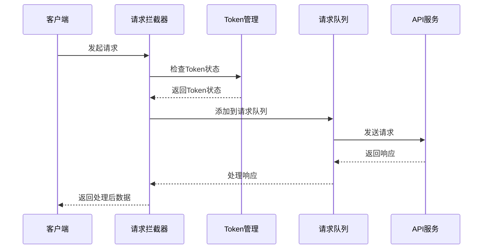

**图表来源**
- [httpClient.ts](file://src/services/httpClient.ts#L107-L140)

### 响应拦截器配置

响应拦截器负责统一处理业务状态码、错误提示和数据转换：

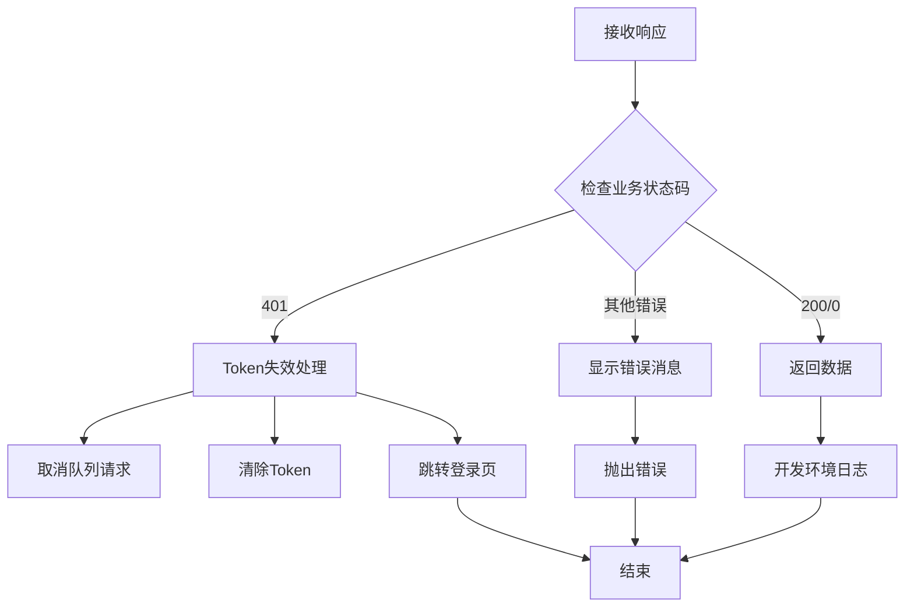

**图表来源**
- [httpClient.ts](file://src/services/httpClient.ts#L143-L231)

**章节来源**
- [httpClient.ts](file://src/services/httpClient.ts#L96-L297)

## 请求队列管理

### 并发控制机制

HTTP客户端实现了智能的请求队列管理，支持并发控制和请求去重：

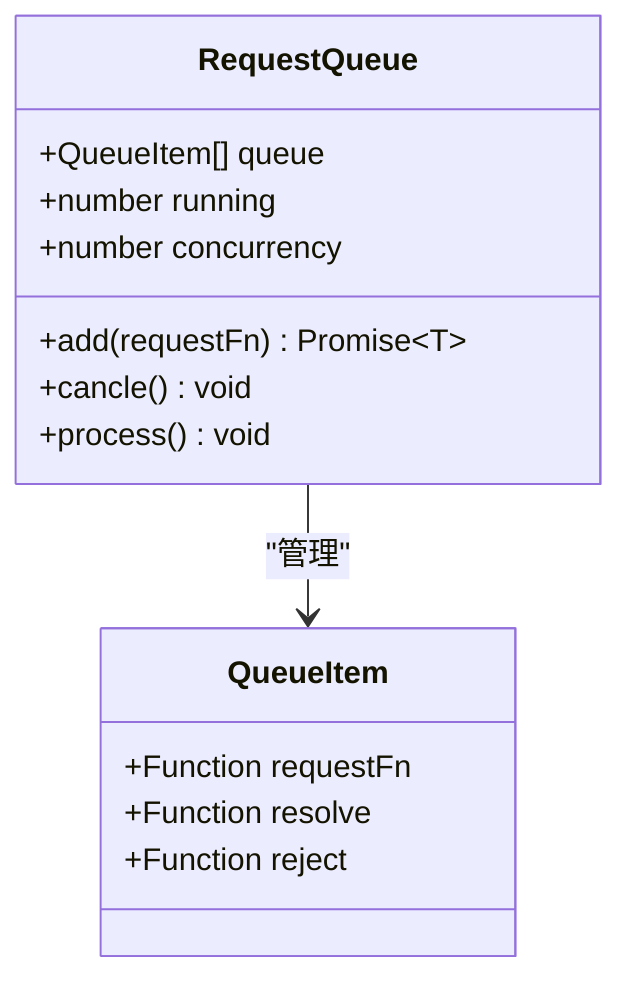

**图表来源**
- [httpClient.ts](file://src/services/httpClient.ts#L53-L92)

### Token失效处理

当检测到Token失效时，系统会自动取消所有排队的请求：

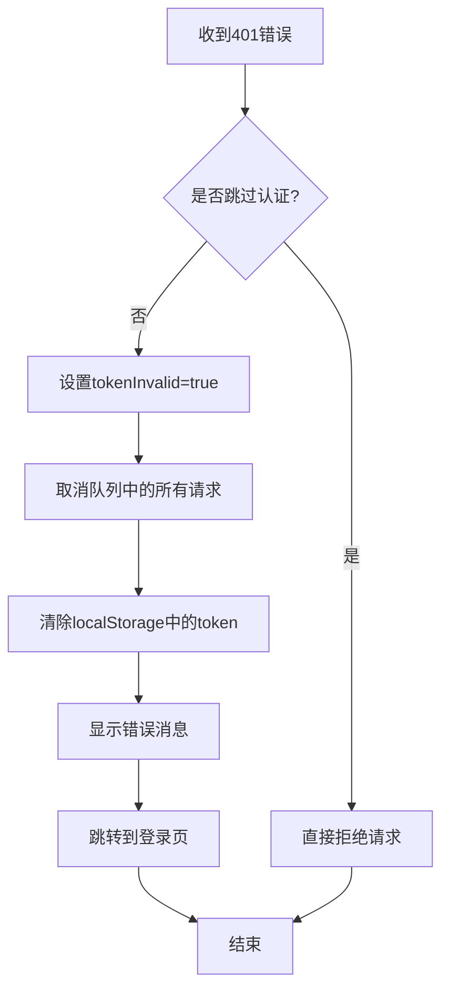

**图表来源**
- [httpClient.ts](file://src/services/httpClient.ts#L161-L174)

**章节来源**
- [httpClient.ts](file://src/services/httpClient.ts#L53-L92)

## 服务层封装

### 供水模块服务

waterSupplyService.ts提供了供水相关的业务服务函数，现在直接使用新的HTTP客户端：

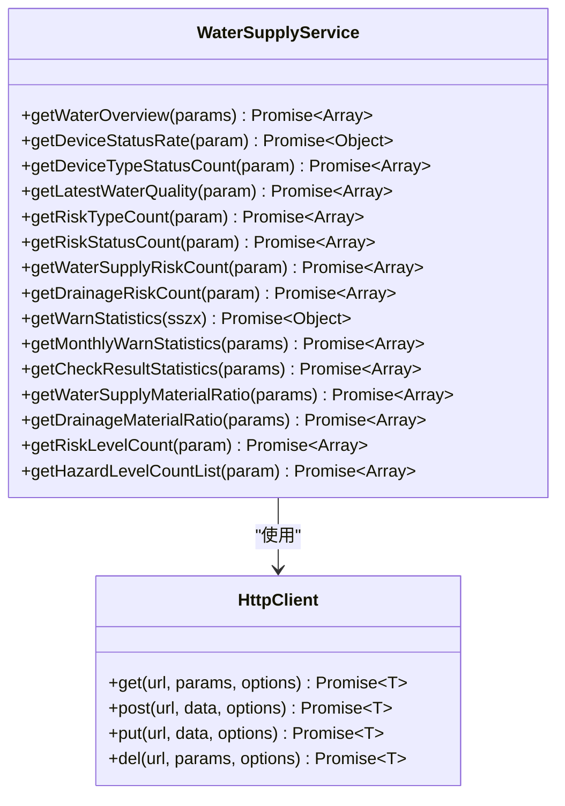

**图表来源**
- [waterSupplyService.ts](file://src/services/waterSupplyService.ts#L1-L186)
- [httpClient.ts](file://src/services/httpClient.ts#L243-L294)

### 燃气模块服务

gasService.ts实现了燃气相关的业务逻辑，同样直接使用新的HTTP客户端：

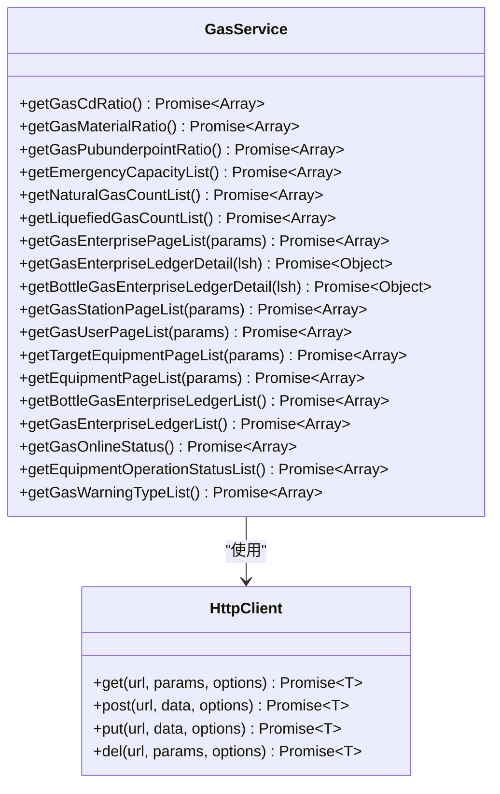

**图表来源**
- [gasService.ts](file://src/services/gasService.ts#L1-L192)
- [httpClient.ts](file://src/services/httpClient.ts#L243-L294)

### 通用服务层

commonService.ts提供了登录、字典等通用功能的服务封装：

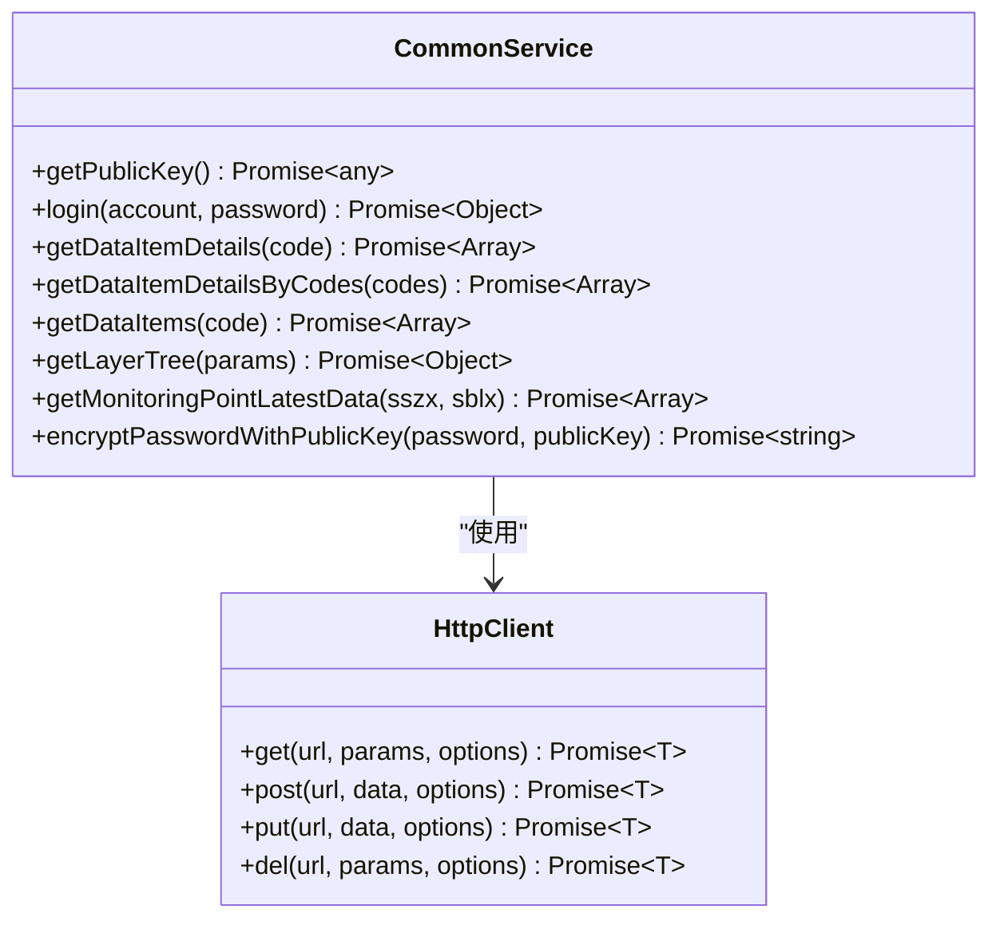

**图表来源**
- [commonService.ts](file://src/services/commonService.ts#L1-L160)
- [httpClient.ts](file://src/services/httpClient.ts#L243-L294)

**章节来源**
- [waterSupplyService.ts](file://src/services/waterSupplyService.ts#L1-L186)
- [gasService.ts](file://src/services/gasService.ts#L1-L192)
- [commonService.ts](file://src/services/commonService.ts#L1-L160)

## Vite代理配置

### 代理机制

Vite配置了反向代理来解决开发环境的跨域问题：

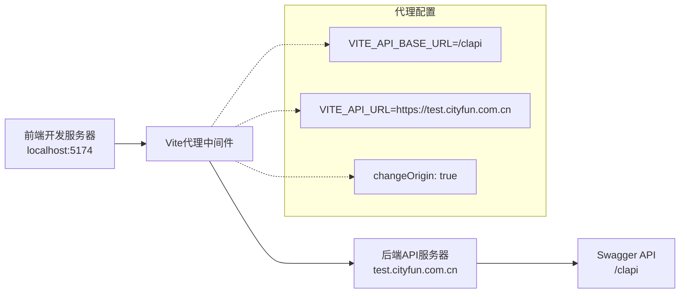

**图表来源**
- [vite.config.js](file://vite.config.js#L35-L40)

### 环境变量配置

项目通过环境变量管理API配置，支持开发和生产环境分离：

| 环境变量 | 默认值 | 说明 |
|---------|--------|------|
| VITE_API_BASE_URL | /clapi | API请求的基础路径 |
| VITE_API_URL | - | 后端服务的实际地址 |
| VITE_BASE_URL | /clmap/ | 静态资源的基础路径 |
| VITE_DROP_CONSOLE | false | 是否移除console语句 |
| VITE_DROP_DEBUGGER | false | 是否移除debugger语句 |

**章节来源**
- [vite.config.js](file://vite.config.js#L1-L82)

## API调用流程

### 完整数据流

从组件发起请求到状态更新的完整数据流：

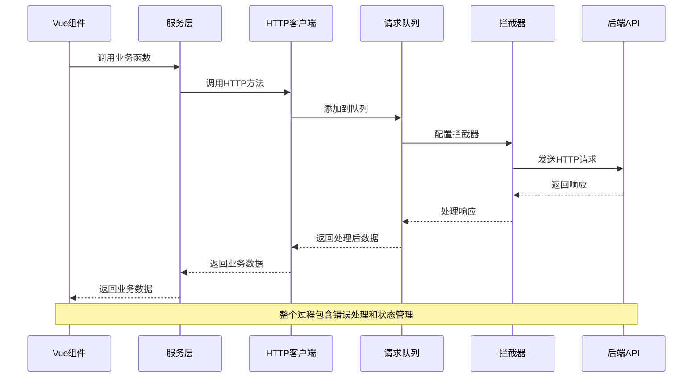

**图表来源**
- [httpClient.ts](file://src/services/httpClient.ts#L107-L231)
- [waterSupplyService.ts](file://src/services/waterSupplyService.ts#L15-L22)

### 代码示例模式

以下是典型的API调用模式：

```typescript
// 服务层函数示例
export async function getWaterOverview(params?: {
  Sszx: string
  Jcsslx?: string
  Sjly?: string
}) {
  const res = await get<any>('/gspspDtransPubbasicfacilitiesinfo/list', { ...defaultParams, ...params })
  return res.data || []
}

// 在组件中使用
import { getWaterOverview } from '@/services/waterSupplyService'

onMounted(async () => {
  try {
    const data = await getWaterOverview({ Sszx: 'csaqzx_gs' })
    state.waterData = data
  } catch (error) {
    console.error('获取供水数据失败:', error)
  }
})
```

**章节来源**
- [waterSupplyService.ts](file://src/services/waterSupplyService.ts#L15-L22)

## 错误处理机制

### 统一错误处理

HTTP客户端实现了多层次的错误处理机制：

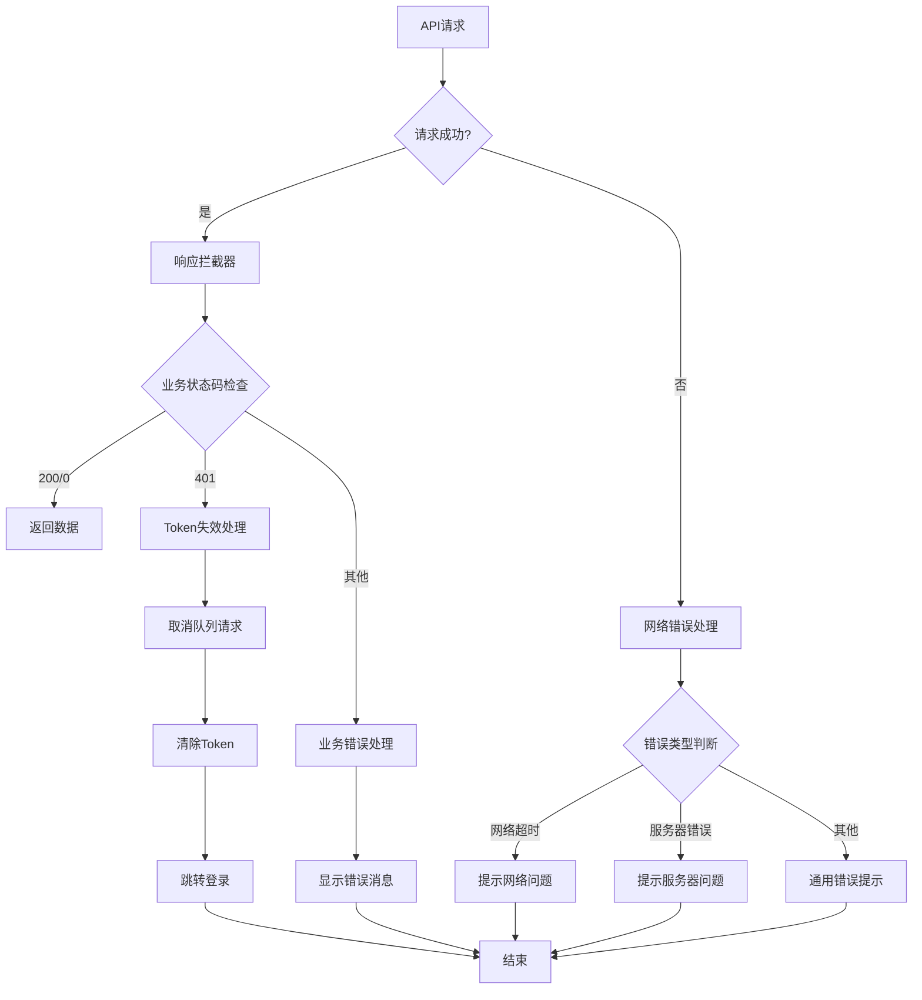

**图表来源**
- [httpClient.ts](file://src/services/httpClient.ts#L143-L231)

### 错误类型处理

| 错误类型 | HTTP状态码 | 处理方式 |
|---------|-----------|----------|
| 未授权 | 401 | Token失效，清除Token，跳转登录页 |
| 权限不足 | 403 | 显示权限不足提示 |
| 资源不存在 | 404 | 显示资源不存在提示 |
| 服务器错误 | 500 | 清除Token，跳转登录页 |
| 网关错误 | 502 | 显示网关错误提示 |
| 服务不可用 | 503 | 显示服务暂时不可用提示 |

**章节来源**
- [httpClient.ts](file://src/services/httpClient.ts#L143-L231)

## API版本管理

### 业务模块版本控制

项目通过业务模块枚举实现API版本管理：

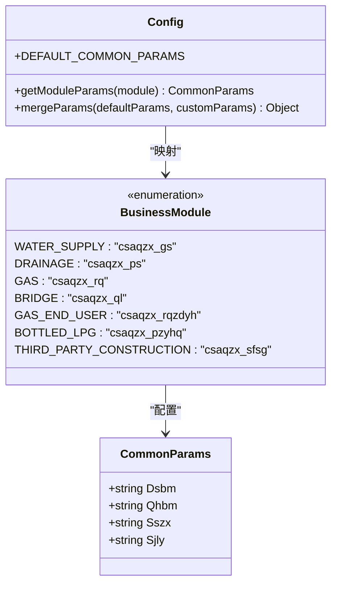

**图表来源**
- [config.ts](file://src/services/config.ts#L8-L53)

### 向后兼容策略

1. **参数合并策略**：自定义参数优先于默认参数
2. **响应格式标准化**：统一返回格式，便于前端处理
3. **错误码标准化**：使用统一的业务状态码体系
4. **渐进式迁移**：保留旧接口，逐步替换新接口

**章节来源**
- [config.ts](file://src/services/config.ts#L48-L66)

## Mock数据使用

### 字典数据缓存机制

dictionaryStore.ts实现了智能的字典数据缓存机制：

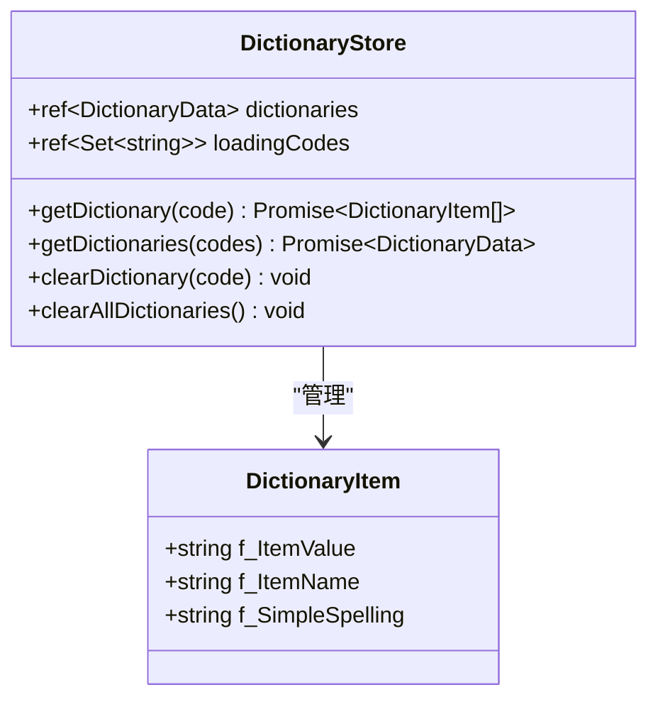

**图表来源**
- [dictionaryStore.ts](file://src/stores/dictionaryStore.ts#L26-L225)

### 缓存策略

1. **内存缓存**：数据存储在内存中，访问速度快
2. **并发去重**：相同字典码的并发请求会被去重
3. **懒加载**：只在需要时才加载字典数据
4. **手动刷新**：支持手动清除特定字典的缓存

**章节来源**
- [dictionaryStore.ts](file://src/stores/dictionaryStore.ts#L38-L97)

## 最佳实践

### API调用最佳实践

1. **使用服务层函数**：避免直接操作HTTP客户端
2. **参数校验**：在服务层进行参数验证
3. **错误处理**：在组件层面处理业务错误
4. **状态管理**：合理使用Pinia store管理API状态
5. **请求去重**：利用内置的请求队列避免重复请求

### 开发调试建议

1. **启用开发日志**：开发环境下会输出详细的请求/响应日志
2. **使用浏览器开发者工具**：监控网络请求和响应
3. **模拟数据**：在开发阶段可以使用mock数据
4. **错误边界**：在组件层面设置错误边界

### 性能优化

1. **请求去重**：利用内置的消息防重复机制
2. **数据缓存**：合理使用字典缓存机制
3. **懒加载**：按需加载API模块
4. **批量请求**：对于相关数据使用批量API

**章节来源**
- [httpClient.ts](file://src/services/httpClient.ts#L35-L49)
- [dictionaryStore.ts](file://src/stores/dictionaryStore.ts#L104-L197)