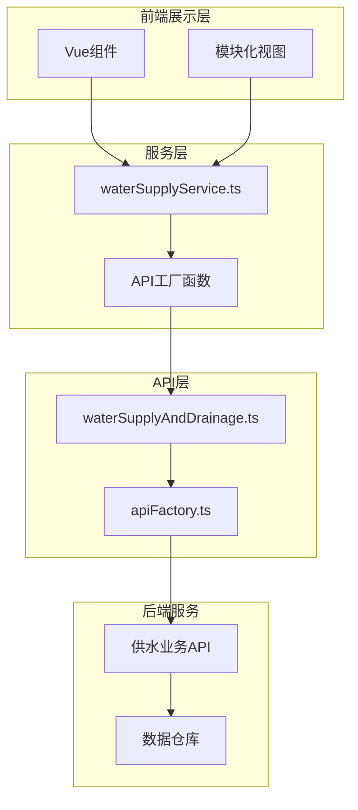
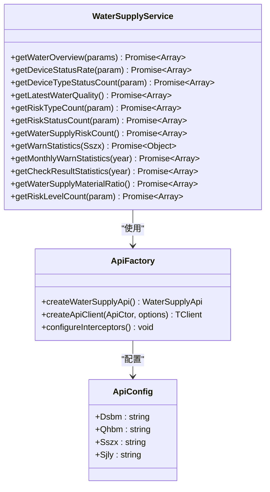
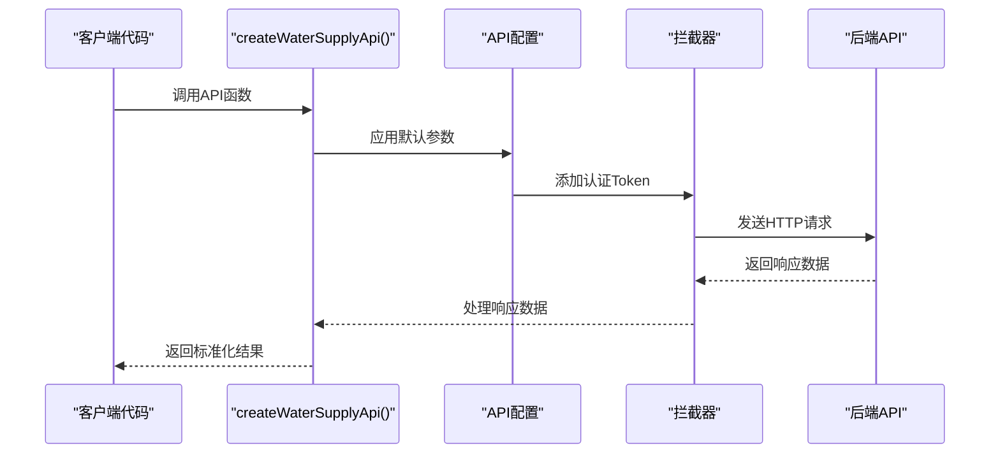
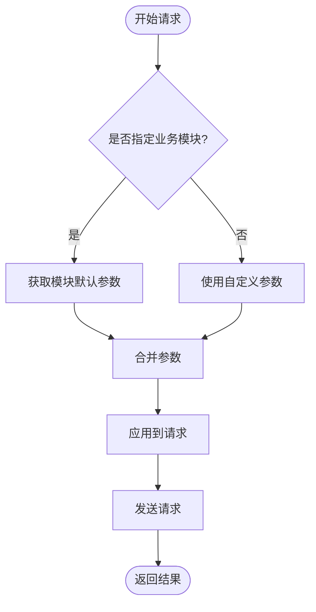
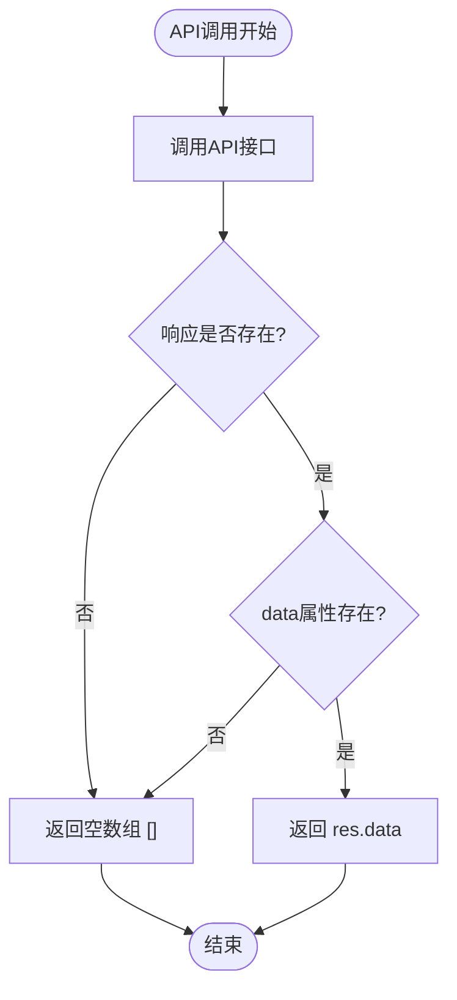
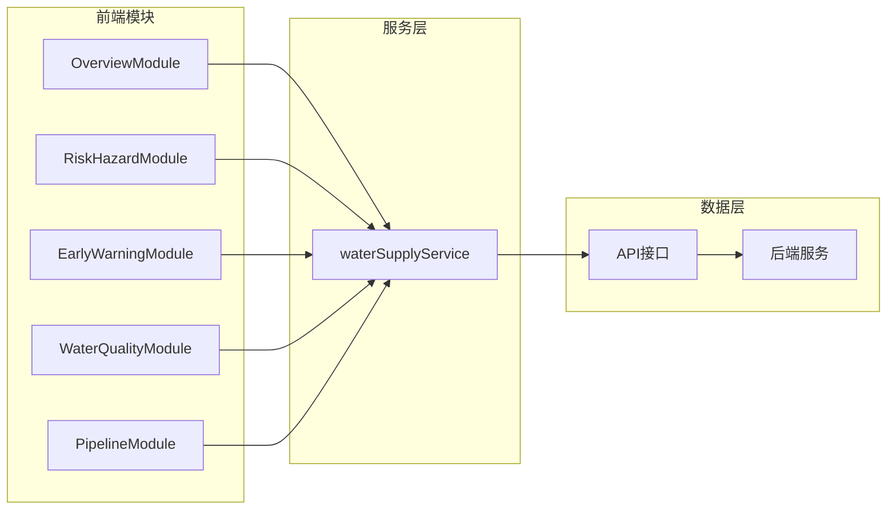
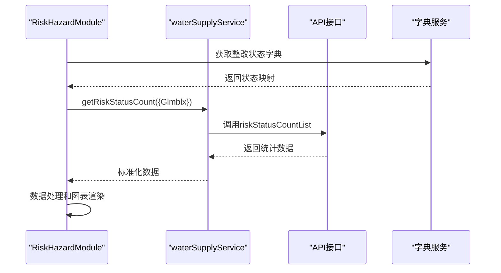

# 供水服务实现

<cite>
**本文档引用的文件**
- [waterSupplyService.ts](file://src/services/waterSupplyService.ts)
- [waterSupplyAndDrainage.ts](file://src/api/waterSupplyAndDrainage.ts)
- [apiFactory.ts](file://src/api/apiFactory.ts)
- [apiConfig.ts](file://src/api/apiConfig.ts)
- [OverviewModule.vue](file://src/views/WaterSupply/components/OverviewModule.vue)
- [RiskHazardModule.vue](file://src/views/WaterSupply/components/RiskHazardModule.vue)
- [EarlyWarningModule.vue](file://src/views/WaterSupply/components/EarlyWarningModule.vue)
- [index.vue](file://src/views/WaterSupply/index.vue)
</cite>

## 目录
1. [简介](#简介)
2. [项目架构概览](#项目架构概览)
3. [核心服务层分析](#核心服务层分析)
4. [API封装机制](#api封装机制)
5. [核心接口详解](#核心接口详解)
6. [数据标准化处理](#数据标准化处理)
7. [业务模块集成](#业务模块集成)
8. [性能与容错机制](#性能与容错机制)
9. [实际调用示例](#实际调用示例)
10. [总结](#总结)

## 简介

供水服务层是政府dashboard系统中负责供水业务数据管理的核心模块，基于`waterSupplyAndDrainage.ts`生成的API客户端，提供了函数化的调用方式。该服务层通过`createWaterSupplyApi()`封装函数，实现了对供水基础设施、水质监测、风险隐患、预警统计等业务模块的数据获取和处理功能。

## 项目架构概览

供水服务层采用分层架构设计，主要包含以下层次：



**图表来源**
- [waterSupplyService.ts](file://src/services/waterSupplyService.ts#L1-L162)
- [apiFactory.ts](file://src/api/apiFactory.ts#L1-L253)

**章节来源**
- [waterSupplyService.ts](file://src/services/waterSupplyService.ts#L1-L10)
- [apiFactory.ts](file://src/api/apiFactory.ts#L210-L223)

## 核心服务层分析

### 服务层结构

供水服务层位于`src/services/`目录下，主要包含以下核心功能模块：



**图表来源**
- [waterSupplyService.ts](file://src/services/waterSupplyService.ts#L8-L162)
- [apiFactory.ts](file://src/api/apiFactory.ts#L67-L208)
- [apiConfig.ts](file://src/api/apiConfig.ts#L25-L40)

### 核心服务函数

服务层提供了11个核心服务函数，每个函数都针对特定的业务需求：

| 函数名称 | 功能描述 | 返回数据类型 | 主要用途 |
|---------|----------|-------------|----------|
| `getWaterOverview` | 获取基础设施总览统计 | `Array` | 基础设施数量统计 |
| `getDeviceStatusRate` | 获取设备运行状态比例 | `Array` | 设备状态监控 |
| `getDeviceTypeStatusCount` | 获取设备类型状态统计 | `Array` | 设备分类统计 |
| `getLatestWaterQuality` | 获取最新水质监测数据 | `Array` | 水质实时监控 |
| `getRiskTypeCount` | 获取隐患类型统计 | `Array` | 风险分类统计 |
| `getRiskStatusCount` | 获取隐患整改状态统计 | `Array` | 整改进度跟踪 |
| `getWaterSupplyRiskCount` | 获取供水管网隐患统计 | `Array` | 管网风险评估 |
| `getWarnStatistics` | 获取预警统计信息 | `Object` | 预警数据分析 |
| `getMonthlyWarnStatistics` | 获取月度预警统计 | `Array` | 预警趋势分析 |
| `getCheckResultStatistics` | 获取排查结果统计 | `Array` | 排查效果评估 |
| `getWaterSupplyMaterialRatio` | 获取供水管线材质占比 | `Array` | 管线材料分析 |
| `getRiskLevelCount` | 获取风险等级数量 | `Array` | 风险等级分布 |

**章节来源**
- [waterSupplyService.ts](file://src/services/waterSupplyService.ts#L15-L162)

## API封装机制

### createWaterSupplyApi()函数

`createWaterSupplyApi()`是供水服务层的核心封装函数，它基于Swagger生成的API客户端，提供了统一的配置和拦截器机制：



**图表来源**
- [apiFactory.ts](file://src/api/apiFactory.ts#L100-L132)
- [apiFactory.ts](file://src/api/apiFactory.ts#L136-L206)

### 参数注入机制

服务层实现了智能的参数注入机制，支持业务模块默认参数和自定义参数的合并：



**图表来源**
- [apiFactory.ts](file://src/api/apiFactory.ts#L78-L84)
- [apiConfig.ts](file://src/api/apiConfig.ts#L79-L81)

**章节来源**
- [apiFactory.ts](file://src/api/apiFactory.ts#L67-L208)
- [apiConfig.ts](file://src/api/apiConfig.ts#L79-L97)

## 核心接口详解

### getWaterOverview - 基础设施总览

该接口用于获取供水基础设施的总体统计信息，支持按专项类型过滤：

#### 参数结构
- `Jcsslx?: string` - 基础设施类型代码
- `Sjly?: string` - 数据来源标识

#### 返回数据格式
```typescript
interface WaterOverviewResponse {
  lsh: string;           // 流水号
  dsbm: string;         // 市州编码
  qhbm: string;         // 区划编码
  sszx: string;         // 所属专项
  jcsslx: string;       // 基础设施类型
  jcsstjsl: number;     // 基础设施统计数量
  yjcjcsstjsl: number;  // 已监测基础设施统计数量
  jcfgl: number;        // 监测覆盖率
  tjsj: string;         // 统计时间
  yskzjbz: string;      // 原始库主键标志
  sjtbzt: string;       // 数据同步状态
  tbsj: string;         // 同步时间
  sjly: string;         // 数据来源
  sjbb: number;         // 数据版本
}
```

**章节来源**
- [waterSupplyService.ts](file://src/services/waterSupplyService.ts#L15-L21)
- [waterSupplyAndDrainage.ts](file://src/api/waterSupplyAndDrainage.ts#L156-L208)

### getDeviceStatusRate - 设备运行状态

该接口获取供水设备的运行状态比例数据，支持区域和专项过滤：

#### 参数结构
- `Sszx: string` - 所属专项（必填）
- `Sjly?: string` - 数据来源

#### Sszx专项类型说明
- `csaqzx_gs` - 供水专项
- `csaqzx_ps` - 排水专项  
- `csaqzx_rq` - 燃气专项
- `csaqzx_ql` - 桥梁专项

**章节来源**
- [waterSupplyService.ts](file://src/services/waterSupplyService.ts#L27-L33)
- [apiConfig.ts](file://src/api/apiConfig.ts#L7-L22)

### getRiskTypeCount - 隐患类型统计

该接口专门用于获取隐患类型的统计信息，具有特殊的默认值注入逻辑：

#### Dsbm与Qhbm默认值注入
```typescript
const queryParam = {
  Dsbm: "420200",    // 黄石市
  Qhbm: "420222",    // 阳新县
  ...param          // 用户自定义参数
}
```

#### 地理编码意义
- **Dsbm (420200)**: 湖北省黄石市
- **Qhbm (420222)**: 湖北省黄石市阳新县

这些编码遵循国家行政区划标准，确保数据的地理准确性。

**章节来源**
- [waterSupplyService.ts](file://src/services/waterSupplyService.ts#L62-L72)
- [apiConfig.ts](file://src/api/apiConfig.ts#L37-L40)

### getRiskStatusCount - 隐患整改状态

该接口获取隐患的整改状态统计，支持关联目标类型的过滤：

#### 参数结构
- `Glmblx: string` - 关联目标类型（逗号分隔）

#### Glmblx类型说明
- `glmblx_gs` - 供水相关隐患
- `glmblx_ps` - 排水相关隐患
- `glmblx_rq` - 燃气相关隐患

**章节来源**
- [waterSupplyService.ts](file://src/services/waterSupplyService.ts#L80-L90)

### getWarnStatistics - 预警统计

该接口获取特定专项的预警统计信息，支持年份过滤：

#### 参数结构
- `Sszx: string` - 所属专项（固定值：'csaqzx_gs'）

#### Year参数
- 固定值：'2025'（当前年份）
- 支持动态年份查询

**章节来源**
- [waterSupplyService.ts](file://src/services/waterSupplyService.ts#L106-L112)

## 数据标准化处理

### res?.data || [] 容错机制

供水服务层广泛采用了数据标准化处理模式，确保在各种异常情况下都能返回合理的默认值：



**图表来源**
- [waterSupplyService.ts](file://src/services/waterSupplyService.ts#L19-L21)
- [waterSupplyService.ts](file://src/services/waterSupplyService.ts#L31-L33)

### 容错处理策略

1. **网络异常处理**: 自动捕获网络错误并返回空数组
2. **API响应异常**: 处理API返回的错误状态码
3. **数据格式异常**: 确保返回数据始终为数组格式
4. **业务逻辑异常**: 在业务层面进行数据验证和转换

**章节来源**
- [waterSupplyService.ts](file://src/services/waterSupplyService.ts#L15-L162)

## 业务模块集成

### 模块化架构

供水服务层与前端业务模块紧密集成，形成了完整的业务闭环：



**图表来源**
- [OverviewModule.vue](file://src/views/WaterSupply/components/OverviewModule.vue#L26-L27)
- [RiskHazardModule.vue](file://src/views/WaterSupply/components/RiskHazardModule.vue#L45-L46)
- [EarlyWarningModule.vue](file://src/views/WaterSupply/components/EarlyWarningModule.vue#L88-L92)

### 数据获取流程

以风险隐患模块为例，展示完整的数据获取流程：



**图表来源**
- [RiskHazardModule.vue](file://src/views/WaterSupply/components/RiskHazardModule.vue#L58-L74)

**章节来源**
- [OverviewModule.vue](file://src/views/WaterSupply/components/OverviewModule.vue#L26-L27)
- [RiskHazardModule.vue](file://src/views/WaterSupply/components/RiskHazardModule.vue#L45-L46)
- [EarlyWarningModule.vue](file://src/views/WaterSupply/components/EarlyWarningModule.vue#L88-L92)

## 性能与容错机制

### 请求拦截器配置

服务层实现了完善的请求拦截器，提供以下功能：

1. **认证Token管理**: 自动添加Authorization头
2. **参数合并**: 智能合并默认参数和自定义参数
3. **开发环境日志**: 提供详细的请求/响应日志
4. **错误处理**: 统一的错误处理和用户提示

### 响应拦截器配置

响应拦截器提供了多层次的错误处理：

1. **业务状态码处理**: 根据code字段判断请求成功与否
2. **HTTP状态码处理**: 处理4xx、5xx等HTTP错误
3. **网络错误处理**: 处理网络连接失败等情况
4. **用户友好提示**: 通过消息组件向用户显示错误信息

**章节来源**
- [apiFactory.ts](file://src/api/apiFactory.ts#L100-L206)

## 实际调用示例

### 基础设施总览数据获取

```typescript
// 获取供水基础设施总览数据
const overviewData = await getWaterOverview({
  Jcsslx: 'jcssdstj0501', // 供水管网
  Sjly: 'company_code'    // 数据来源
});

// 数据处理示例
const pipelineCount = overviewData.find(item => 
  item.jcsslx === 'jcssdstj0501'
)?.jcsstjsl || 0;
```

### 风险隐患统计分析

```typescript
// 获取整改状态统计
const riskStatusData = await getRiskStatusCount({
  Glmblx: 'glmblx_gs' // 供水相关隐患
});

// 数据分析示例
const totalRisks = riskStatusData.reduce((sum, item) => sum + item.count, 0);
const rectifiedPercentage = (riskStatusData.find(item => 
  item.riskStatus === '已整改'
)?.count || 0) / totalRisks * 100;
```

### 预警统计综合分析

```typescript
// 并行获取多个预警统计数据
const [checkResults, warnStats, monthlyData] = await Promise.all([
  getCheckResultStatistics('2025'),
  getWarnStatistics('csaqzx_gs'),
  getMonthlyWarnStatistics('2025')
]);

// 处理预警处置率
const disposalRate = warnStats.totalCount > 0 
  ? Math.round((warnStats.handledCount / warnStats.totalCount) * 100) + '%'
  : '0%';
```

**章节来源**
- [OverviewModule.vue](file://src/views/WaterSupply/components/OverviewModule.vue#L71-L88)
- [RiskHazardModule.vue](file://src/views/WaterSupply/components/RiskHazardModule.vue#L58-L74)
- [EarlyWarningModule.vue](file://src/views/WaterSupply/components/EarlyWarningModule.vue#L129-L156)

## 总结

供水服务层通过`createWaterSupplyApi()`封装函数，构建了一个完整、可靠、易用的供水业务数据服务体系。该体系具有以下特点：

1. **模块化设计**: 清晰的职责分离和模块化架构
2. **标准化处理**: 统一的数据格式和容错机制
3. **智能参数注入**: 自动化的地理编码和业务参数管理
4. **完善的错误处理**: 多层次的异常处理和用户提示
5. **高性能响应**: 优化的请求管理和并发处理

该服务层不仅满足了当前的业务需求，还为未来的扩展和维护奠定了坚实的基础，是政府dashboard系统中供水业务管理的重要组成部分。