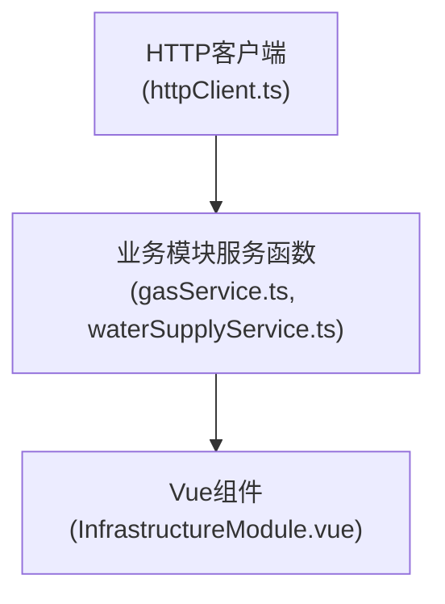

# 服务层实现

<cite>
**本文档引用的文件**
- [gasService.ts](file://src/services/gasService.ts)
- [waterSupplyService.ts](file://src/services/waterSupplyService.ts)
- [httpClient.ts](file://src/services/httpClient.ts)
- [config.ts](file://src/services/config.ts)
- [InfrastructureModule.vue](file://src/views/GasModule/components/InfrastructureModule.vue)
- [OverviewModule.vue](file://src/views/WaterSupply/components/OverviewModule.vue)
</cite>

## 更新摘要
**变更内容**
- 服务层架构统一：从分散的API工厂模式迁移到统一的httpClient架构
- 删除了apiFactory.ts和apiConfig.ts文件
- 引入了新的httpClient.ts作为统一的HTTP客户端
- 服务层函数直接使用httpClient的get/post方法
- 参数处理逻辑得到简化，移除了复杂的工厂函数

## 目录
1. [引言](#引言)
2. [服务层架构与函数化封装模式](#服务层架构与函数化封装模式)
3. [HTTP客户端统一架构](#http客户端统一架构)
4. [参数处理逻辑](#参数处理逻辑)
5. [错误处理与数据标准化](#错误处理与数据标准化)
6. [组件调用示例](#组件调用示例)
7. [总结](#总结)

## 引言
本项目的服务层实现旨在为前端应用提供一个清晰、一致且易于使用的后端接口访问方式。通过在`gasService.ts`和`waterSupplyService.ts`中对HTTP请求进行函数化封装，将底层的HTTP客户端转换为具有明确语义的异步函数，极大地提升了代码的可读性和可维护性。本文档将详细分析这一实现模式，涵盖HTTP客户端的统一配置、参数处理、错误处理以及在组件中的实际调用流程。

## 服务层架构与函数化封装模式

服务层的核心设计模式是**函数化封装**。它通过在`src/services`目录下的`gasService.ts`和`waterSupplyService.ts`文件中，直接使用`httpClient.ts`提供的HTTP客户端方法（如`get`、`post`）进行二次封装，暴露为一系列简单、语义化的异步函数。

这种模式的主要优势在于：
- **语义清晰**：函数名如`getGasCdRatio`、`getWaterOverview`直接表达了其业务意图，开发者无需关心底层HTTP请求的细节。
- **职责分离**：业务逻辑与网络请求逻辑分离，使组件代码更加简洁，专注于UI和状态管理。
- **易于测试**：封装后的函数可以独立于网络环境进行单元测试。
- **架构简化**：移除了复杂的API工厂模式，降低了系统复杂度。

**服务层封装模式流程图**


**Diagram sources**
- [httpClient.ts](file://src/services/httpClient.ts#L240-L294)
- [gasService.ts](file://src/services/gasService.ts#L1-L192)
- [waterSupplyService.ts](file://src/services/waterSupplyService.ts#L1-L186)

**Section sources**
- [gasService.ts](file://src/services/gasService.ts#L1-L192)
- [waterSupplyService.ts](file://src/services/waterSupplyService.ts#L1-L186)

## HTTP客户端统一架构

服务层通过`httpClient.ts`提供的统一HTTP客户端来处理所有网络请求，这是实现统一配置和错误处理的关键。

### HTTP客户端核心特性

1. **统一配置**：`httpClient.ts`创建了一个全局的Axios实例，设置了基础URL、超时时间、请求头等统一配置。
2. **请求队列管理**：实现了`RequestQueue`类来控制并发请求数量，防止过多并发请求导致性能问题。
3. **Token管理**：提供了完整的Token管理机制，包括Token失效检测和自动重定向到登录页面。
4. **消息去重**：实现了消息防重复机制，避免同一错误信息频繁弹出。
5. **拦截器统一处理**：配置了请求和响应拦截器，统一处理认证、错误和业务状态码。

### 请求方法封装

`httpClient.ts`提供了四种基本的HTTP请求方法：
- `get(url, params?, options?)`：GET请求
- `post(url, data?, options?)`：POST请求  
- `put(url, data?, options?)`：PUT请求
- `del(url, params?, options?)`：DELETE请求

每个方法都经过请求队列包装，确保请求的有序执行和并发控制。

**Section sources**
- [httpClient.ts](file://src/services/httpClient.ts#L1-L297)

## 参数处理逻辑

服务层函数对参数的处理体现了其灵活性和健壮性。以`getGasStationPageList`为例，其参数处理逻辑如下：

1.  **参数定义**：函数接受一个可选的`params`对象，该对象定义了所有可能的查询参数。
2.  **参数合并**：直接使用扩展运算符将默认参数和自定义参数合并，形成最终的请求参数。
3.  **请求发起**：将合并后的参数传递给`httpClient.ts`中的`get`方法。

```mermaid
flowchart TD
Start([getGasStationPageList(params)]) --> Merge["合并默认参数与自定义参数"]
Merge --> Filter["过滤 params"]
Filter --> Filtered{"过滤后有参数?"}
Filtered --> |是| UseFiltered["使用 filteredParams"]
Filtered --> |否| UseDefault["使用默认参数"]
UseFiltered --> CallAPI["调用 get() 方法"]
UseDefault --> CallAPI
CallAPI --> Return["返回 res.data || 默认值"]
```

**Diagram sources**
- [gasService.ts](file://src/services/gasService.ts#L92-L107)

**Section sources**
- [gasService.ts](file://src/services/gasService.ts#L92-L107)
- [waterSupplyService.ts](file://src/services/waterSupplyService.ts#L15-L22)

## 错误处理与数据标准化

服务层的错误处理和数据标准化在`httpClient.ts`的拦截器中统一实现，确保了整个应用的一致性。

### 响应拦截器处理流程

1.  **开发环境日志**：在开发环境下输出详细的请求和响应日志。
2.  **业务状态码处理**：检查响应数据中的`code`字段。如果为`200`或`0`，则认为请求成功，直接返回`response.data`。
3.  **Token失效处理**：如果`code`为`401`，清除本地Token并跳转到登录页，同时取消所有排队的请求。
4.  **业务错误处理**：对于其他业务错误码，提取`info`或`message`字段，通过`naive-ui`的消息组件向用户显示错误提示。
5.  **HTTP状态码处理**：根据不同的HTTP状态码（如404, 500, 502等）给出相应的错误提示。

### 数据标准化

服务层的每个具体函数都对返回数据进行标准化处理：
- 对于期望返回数组的函数，即使`res.data`为`null`或`undefined`，也会返回一个空数组`[]`。
- 对于期望返回对象的函数，即使`res.data`为`null`或`undefined`，也会返回一个空对象`{}`。

```typescript
// 示例：数据标准化
export async function getGasCdRatio() {
  const res = await get<any>('/gspspDtransPubunderpipeline/gasCdRatio', defaultParams)
  return res.data || []
}
```

**Section sources**
- [httpClient.ts](file://src/services/httpClient.ts#L142-L231)
- [gasService.ts](file://src/services/gasService.ts#L15-L18)

## 组件调用示例

以下是一个从Vue组件调用服务层函数的完整流程示例，展示了参数传递、加载状态管理和错误提示。

以`InfrastructureModule.vue`组件为例，它调用了`getNaturalGasCountList`函数：

1.  **导入服务函数**：在组件中导入所需的服务函数。
    ```typescript
    import { getNaturalGasCountList } from "@/services/gasService";
    ```
2.  **定义响应式数据**：使用`ref`定义存储数据和加载状态的变量。
    ```typescript
    const naturalGasStats = ref([]);
    const loading = ref(false);
    ```
3.  **调用服务函数**：在`onMounted`或事件处理函数中，使用`async/await`调用服务函数。
    ```typescript
    const fetchNaturalGasStats = async () => {
      loading.value = true; // 开启加载状态
      try {
        const data = await getNaturalGasCountList(); // 调用服务层函数
        naturalGasStats.value = data.map(...); // 处理并赋值
      } catch (error) {
        console.error('获取数据失败:', error); // 捕获并处理错误
      } finally {
        loading.value = false; // 关闭加载状态
      }
    };
    ```
4.  **处理响应**：在`try`块中处理成功响应，将数据映射到视图模型。在`catch`块中捕获错误（尽管大部分错误已在拦截器中处理并提示，但此处可用于日志记录）。在`finally`块中关闭加载状态。

这个流程清晰地展示了如何在组件中安全、优雅地使用服务层函数，实现了加载状态的管理，并依赖于服务层的统一错误处理机制。

**Section sources**
- [InfrastructureModule.vue](file://src/views/GasModule/components/InfrastructureModule.vue#L115-L171)
- [OverviewModule.vue](file://src/views/WaterSupply/components/OverviewModule.vue#L82-L101)

## 总结
本项目的服务层实现通过`httpClient.ts`的统一HTTP客户端架构，实现了网络请求的统一管理和错误处理。`gasService.ts`和`waterSupplyService.ts`通过对HTTP客户端的函数化封装，提供了语义清晰、易于使用的接口。服务层通过参数合并、统一的响应拦截器和数据标准化（`res.data || 默认值`），确保了请求的健壮性和返回数据的安全性。最终，组件可以以一种简洁、一致的方式调用这些服务函数，专注于业务逻辑和用户体验，形成了一个高效、可维护的前端架构。