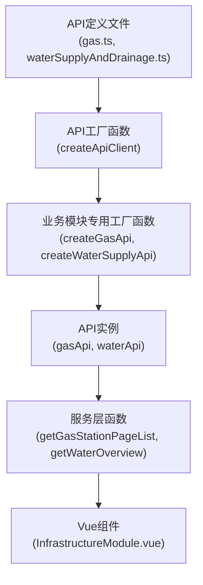

# 服务层实现

<cite>
**本文档引用的文件**
- [gasService.ts](file://src/services/gasService.ts)
- [waterSupplyService.ts](file://src/services/waterSupplyService.ts)
- [apiFactory.ts](file://src/api/apiFactory.ts)
- [apiConfig.ts](file://src/api/apiConfig.ts)
- [gas.ts](file://src/api/gas.ts)
- [waterSupplyAndDrainage.ts](file://src/api/waterSupplyAndDrainage.ts)
- [InfrastructureModule.vue](file://src/views/gasModule/components/InfrastructureModule.vue)
- [OverviewModule.vue](file://src/views/WaterSupply/components/OverviewModule.vue)
</cite>

## 目录
1. [引言](#引言)
2. [服务层架构与函数化封装模式](#服务层架构与函数化封装模式)
3. [API实例获取机制](#api实例获取机制)
4. [参数处理逻辑](#参数处理逻辑)
5. [错误处理与数据标准化](#错误处理与数据标准化)
6. [组件调用示例](#组件调用示例)
7. [总结](#总结)

## 引言
本项目的服务层实现旨在为前端应用提供一个清晰、一致且易于使用的后端接口访问方式。通过在`gasService.ts`和`waterSupplyService.ts`中对API进行函数化封装，将底层生成的复杂API客户端转换为具有明确语义的异步函数，极大地提升了代码的可读性和可维护性。本文档将详细分析这一实现模式，涵盖API实例的创建、参数处理、错误处理以及在组件中的实际调用流程。

## 服务层架构与函数化封装模式

服务层的核心设计模式是**函数化封装**。它通过在`src/services`目录下的`gasService.ts`和`waterSupplyService.ts`文件中，将由`swagger-typescript-api`工具生成的、结构复杂的API客户端（如`gas.ts`和`waterSupplyAndDrainage.ts`）进行二次封装，暴露为一系列简单、语义化的异步函数。

这种模式的主要优势在于：
- **语义清晰**：函数名如`getGasCdRatio`、`getWaterOverview`直接表达了其业务意图，开发者无需关心底层API的URL或参数细节。
- **职责分离**：业务逻辑与网络请求逻辑分离，使组件代码更加简洁，专注于UI和状态管理。
- **易于测试**：封装后的函数可以独立于网络环境进行单元测试。

**服务层封装模式流程图**


**Diagram sources**
- [gas.ts](file://src/api/gas.ts)
- [waterSupplyAndDrainage.ts](file://src/api/waterSupplyAndDrainage.ts)
- [apiFactory.ts](file://src/api/apiFactory.ts)
- [gasService.ts](file://src/services/gasService.ts)
- [waterSupplyService.ts](file://src/services/waterSupplyService.ts)

**Section sources**
- [gasService.ts](file://src/services/gasService.ts#L1-L218)
- [waterSupplyService.ts](file://src/services/waterSupplyService.ts#L1-L162)

## API实例获取机制

服务层通过`apiFactory.ts`中定义的工厂函数来获取API实例，这是实现统一配置和业务模块参数注入的关键。

1.  **工厂函数定义**：`apiFactory.ts`文件导出了多个便捷的工厂函数，如`createGasApi()`和`createWaterSupplyApi()`。
2.  **内部实现**：这些便捷函数内部调用一个通用的`createApiClient<TClient>`泛型函数。
3.  **模块参数注入**：当调用`createGasApi()`时，它会传入`BusinessModule.GAS`作为参数。`createApiClient`函数会根据此模块，从`apiConfig.ts`中获取对应的默认参数（如`Dsbm`, `Qhbm`, `Sszx`）。
4.  **实例创建**：`createApiClient`使用这些配置创建一个`Axios`实例，并应用请求/响应拦截器，最后返回一个配置好的API客户端实例。

在`gasService.ts`和`waterSupplyService.ts`中，通过调用这些工厂函数来创建单例API实例：
```typescript
// gasService.ts
import { createGasApi } from "@/api/apiFactory";
const gasApi = createGasApi(); // 创建并配置好的燃气模块API实例
```

这个`gasApi`实例已经包含了所有必要的认证信息和公共参数，后续的服务函数可以直接使用它发起请求。

**Section sources**
- [apiFactory.ts](file://src/api/apiFactory.ts#L211-L237)
- [apiConfig.ts](file://src/api/apiConfig.ts#L7-L22)
- [gasService.ts](file://src/services/gasService.ts#L13-L15)
- [waterSupplyService.ts](file://src/services/waterSupplyService.ts#L6-L8)

## 参数处理逻辑

服务层函数对参数的处理体现了其灵活性和健壮性。以`getGasStationPageList`为例，其参数处理逻辑如下：

1.  **参数定义**：函数接受一个可选的`params`对象，该对象定义了所有可能的查询参数，如`page`, `rows`, `ssqy`, `czmc`等。
2.  **参数过滤**：在发起请求前，函数会创建一个`filteredParams`对象。它使用`Object.entries`和`filter`方法，遍历传入的`params`，**过滤掉值为`undefined`或空字符串的键值对**。这可以避免将无效的查询参数发送到后端，防止不必要的数据过滤或潜在的错误。
3.  **请求发起**：将过滤后的`filteredParams`传递给底层API客户端的`gasfldstationPageList`方法。

```mermaid
flowchart TD
Start([getGasStationPageList(params)]) --> Validate{"params存在?"}
Validate --> |否| UseUndefined["使用 undefined"]
Validate --> |是| Filter["过滤 params"]
Filter --> Filtered{"过滤后有参数?"}
Filtered --> |是| UseFiltered["使用 filteredParams"]
Filtered --> |否| UseUndefined
UseFiltered --> CallAPI["调用 gasApi.gspspDtransGas.gasfldstationPageList()"]
UseUndefined --> CallAPI
CallAPI --> Return["返回 res.data || []"]
```

**Diagram sources**
- [gasService.ts](file://src/services/gasService.ts#L111-L123)

**Section sources**
- [gasService.ts](file://src/services/gasService.ts#L111-L124)

## 错误处理与数据标准化

服务层的错误处理和数据标准化主要在`apiFactory.ts`的**响应拦截器**中统一实现，确保了整个应用的一致性。

1.  **响应拦截器**：`createApiClient`函数为每个API实例配置了响应拦截器。
2.  **业务状态码处理**：拦截器首先检查响应数据中的`code`字段。如果`code`为`200`或`0`，则认为请求成功，直接返回`response.data`。如果`code`为`401`，则清除本地Token并跳转到登录页。对于其他业务错误码，会提取`info`或`message`字段，通过`naive-ui`的`message`组件向用户显示错误提示。
3.  **HTTP状态码处理**：如果请求失败（如网络错误），拦截器会根据HTTP状态码（如404, 500, 502等）给出相应的错误提示。
4.  **数据标准化**：在服务层的每个具体函数中，都会对最终返回的数据进行标准化处理。无论底层API返回的数据结构如何，服务层函数都保证返回一个**安全的、非空的默认值**。例如，对于期望返回数组的函数，即使`res.data`为`null`或`undefined`，也会返回一个空数组`[]`；对于期望返回对象的函数，则返回一个空对象`{}`。

```typescript
// 示例：数据标准化
export async function getGasCdRatio() {
  const res = await gasApi.gspspDtransPubunderpipeline.gasCdRatioList();
  return res.data || []; // 统一返回 res.data || 默认值
}
```

这种模式确保了调用方无需在每次调用后都进行空值检查，简化了组件逻辑。

**Section sources**
- [apiFactory.ts](file://src/api/apiFactory.ts#L135-L205)
- [gasService.ts](file://src/services/gasService.ts#L21-L23)

## 组件调用示例

以下是一个从Vue组件调用服务层函数的完整流程示例，展示了参数传递、加载状态管理和错误提示。

以`InfrastructureModule.vue`组件为例，它调用了`getNaturalGasCountList`函数：

1.  **导入服务函数**：在组件中导入所需的服务函数。
    ```typescript
    import { getNaturalGasCountList } from "@/services/gasService";
    ```
2.  **定义响应式数据**：使用`ref`定义存储数据和加载状态的变量。
    ```typescript
    const naturalGasStats = ref([]);
    const loading = ref(false);
    ```
3.  **调用服务函数**：在`onMounted`或事件处理函数中，使用`async/await`调用服务函数。
    ```typescript
    const fetchNaturalGasStats = async () => {
      loading.value = true; // 开启加载状态
      try {
        const data = await getNaturalGasCountList(); // 调用服务层函数
        naturalGasStats.value = data.map(...); // 处理并赋值
      } catch (error) {
        console.error('获取数据失败:', error); // 捕获并处理错误
      } finally {
        loading.value = false; // 关闭加载状态
      }
    };
    ```
4.  **处理响应**：在`try`块中处理成功响应，将数据映射到视图模型。在`catch`块中捕获错误（尽管大部分错误已在拦截器中处理并提示，但此处可用于日志记录）。在`finally`块中关闭加载状态。

这个流程清晰地展示了如何在组件中安全、优雅地使用服务层函数，实现了加载状态的管理，并依赖于服务层的统一错误处理机制。

**Section sources**
- [InfrastructureModule.vue](file://src/views/gasModule/components/InfrastructureModule.vue#L51-L117)
- [OverviewModule.vue](file://src/views/WaterSupply/components/OverviewModule.vue#L27-L88)

## 总结
本项目的服务层实现通过`apiFactory.ts`的工厂模式和`apiConfig.ts`的模块化配置，实现了API客户端的统一创建和参数注入。`gasService.ts`和`waterSupplyService.ts`通过对底层API的函数化封装，提供了语义清晰、易于使用的接口。服务层通过参数过滤、统一的响应拦截器和数据标准化（`res.data || 默认值`），确保了请求的健壮性和返回数据的安全性。最终，组件可以以一种简洁、一致的方式调用这些服务函数，专注于业务逻辑和用户体验，形成了一个高效、可维护的前端架构。