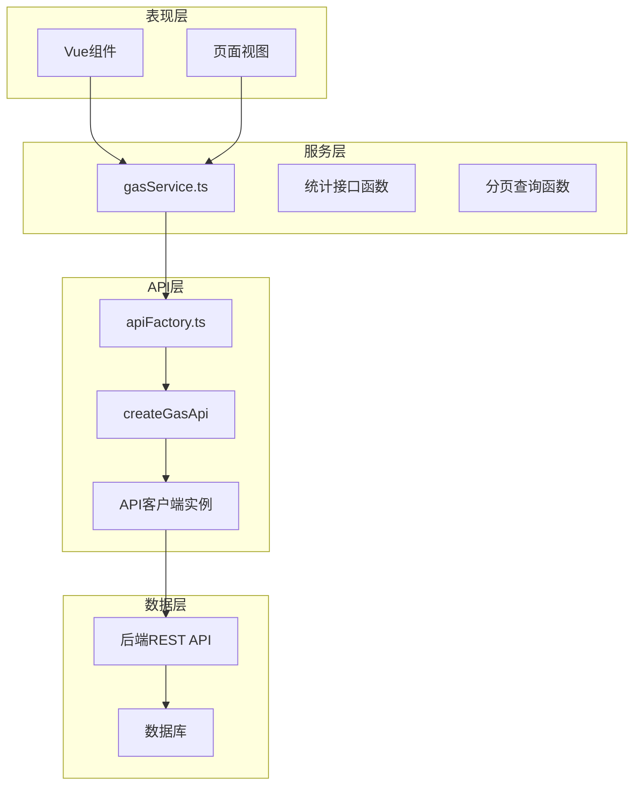
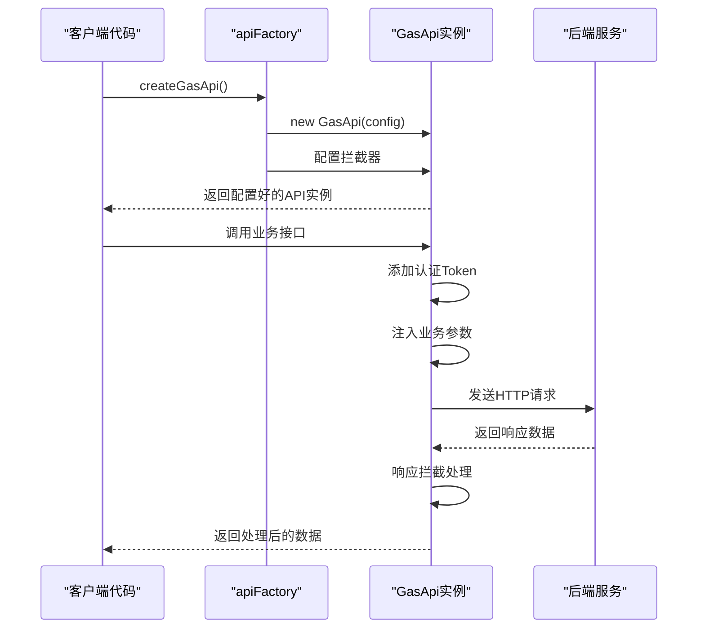
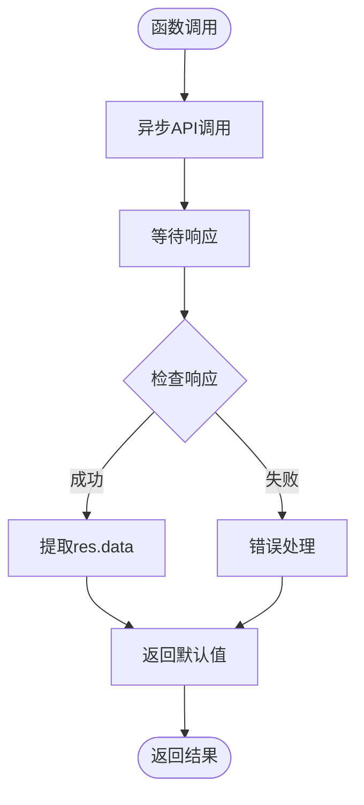
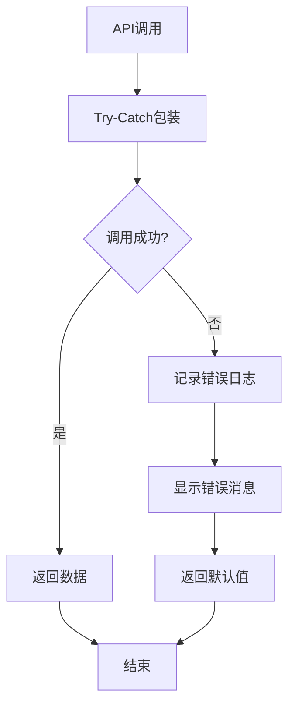

# 燃气服务实现

<cite>
**本文档引用的文件**
- [gasService.ts](file://src/services/gasService.ts)
- [gas.ts](file://src/api/gas.ts)
- [apiFactory.ts](file://src/api/apiFactory.ts)
- [apiConfig.ts](file://src/api/apiConfig.ts)
- [index.ts](file://src/types/index.ts)
- [EmergencyResourceModule.vue](file://src/views/gasModule/components/EmergencyResourceModule.vue)
- [InfrastructureModule.vue](file://src/views/gasModule/components/InfrastructureModule.vue)
- [MonitoringDeviceModule.vue](file://src/views/gasModule/components/MonitoringDeviceModule.vue)
- [GasPipelineModule.vue](file://src/views/gasModule/components/GasPipelineModule.vue)
- [StationListPanel.vue](file://src/views/gasModule/components/map/StationListPanel.vue)
</cite>

## 目录
1. [简介](#简介)
2. [项目架构概览](#项目架构概览)
3. [API工厂模式](#api工厂模式)
4. [统计类接口详解](#统计类接口详解)
5. [分页查询接口详解](#分页查询接口详解)
6. [服务函数实现模式](#服务函数实现模式)
7. [组件调用示例](#组件调用示例)
8. [错误处理与回退策略](#错误处理与回退策略)
9. [业务模块集成](#业务模块集成)
10. [性能优化建议](#性能优化建议)

## 简介

燃气服务层是政府Dashboard系统中燃气模块的核心数据访问层，基于`createGasApi()`创建的API实例提供了完整的燃气业务数据接口。该服务层采用函数式编程模式，封装了统计类接口和分页查询接口，为上层组件提供简洁易用的数据获取方法。

## 项目架构概览

燃气服务层采用分层架构设计，主要包含以下核心组件：



**图表来源**
- [gasService.ts](file://src/services/gasService.ts#L12-L14)
- [apiFactory.ts](file://src/api/apiFactory.ts#L234-L237)

**章节来源**
- [gasService.ts](file://src/services/gasService.ts#L1-L218)
- [apiFactory.ts](file://src/api/apiFactory.ts#L1-L253)

## API工厂模式

### createGasApi()函数

`createGasApi()`是燃气服务层的核心入口函数，基于API工厂模式创建专门的燃气业务API客户端实例。



**图表来源**
- [apiFactory.ts](file://src/api/apiFactory.ts#L234-L237)
- [apiFactory.ts](file://src/api/apiFactory.ts#L99-L208)

### API配置特性

燃气API客户端具备以下核心特性：

| 特性 | 描述 | 实现位置 |
|------|------|----------|
| 认证拦截 | 自动添加JWT Token到请求头 | 请求拦截器 |
| 参数注入 | 自动注入业务模块参数 | 请求拦截器 |
| 错误处理 | 统一的HTTP状态码处理 | 响应拦截器 |
| 开发调试 | 开发环境请求/响应日志 | 请求/响应拦截器 |
| 业务模块 | 集成燃气专项业务参数 | apiConfig模块 |

**章节来源**
- [apiFactory.ts](file://src/api/apiFactory.ts#L99-L208)
- [apiConfig.ts](file://src/api/apiConfig.ts#L1-L98)

## 统计类接口详解

统计类接口主要用于获取燃气系统的各类统计数据，采用无参数的GET请求方式。

### getGasCdRatio - 燃气管网长度占比统计

**业务含义**: 获取燃气管网按长度占比的统计信息，用于分析不同压力等级或材质的管网分布情况。

**实现逻辑**:
- 调用`gasCdRatioList()`接口
- 返回结果处理：`res.data || []`
- 数据格式：数组对象，包含类型名称和占比数据

**使用场景**: 
- 燃气管网压力等级分析
- 材质分布统计展示
- 基础设施规划决策支持

**章节来源**
- [gasService.ts](file://src/services/gasService.ts#L21-L24)

### getGasMaterialRatio - 燃气管网材质占比统计

**业务含义**: 获取燃气管网按材质类型的占比统计，帮助评估管网老化程度和维护需求。

**实现逻辑**:
- 调用`gasMaterialRatioList()`接口
- 返回结果处理：`res.data || []`
- 数据格式：材质类型 → 数量/占比的映射关系

**使用场景**:
- 管网材质老化评估
- 维护成本预测
- 更换计划制定

**章节来源**
- [gasService.ts](file://src/services/gasService.ts#L30-L33)

### getEmergencyCapacityList - 应急能力数量统计

**业务含义**: 获取燃气系统的应急资源能力统计，包括专家、队伍、物资等应急资源的数量。

**实现逻辑**:
- 调用`listList()`接口
- 返回结果处理：`res.data || []`
- 数据格式：资源类型 → 数量的统计列表

**使用场景**:
- 应急预案编制
- 资源调配决策
- 应急能力评估

**章节来源**
- [gasService.ts](file://src/services/gasService.ts#L48-L51)

### getNaturalGasCountList - 天然气基础设施数量统计

**业务含义**: 获取天然气基础设施的数量统计，包括企业、供应站、管网等设施的数量。

**实现逻辑**:
- 调用`trqCountListList()`接口
- 返回结果处理：`res.data || []`
- 数据格式：设施类型 → 数量的统计信息

**使用场景**:
- 基础设施普查
- 规划建设参考
- 投资效益评估

**章节来源**
- [gasService.ts](file://src/services/gasService.ts#L57-L60)

### getLiquefiedGasCountList - 液化气基础设施数量统计

**业务含义**: 获取液化气基础设施的数量统计，涵盖气瓶、运输车辆、充装站等设施。

**实现逻辑**:
- 调用`yhqCountListList()`接口
- 返回结果处理：`res.data || []`
- 数据格式：设施类型 → 数量的统计信息

**使用场景**:
- 液化气市场分析
- 安全监管依据
- 服务能力建设

**章节来源**
- [gasService.ts](file://src/services/gasService.ts#L66-L69)

## 分页查询接口详解

分页查询接口支持复杂的查询条件过滤，采用参数对象的方式传递查询条件。

### getGasStationPageList - 燃气场站分页列表

**业务含义**: 获取燃气场站的分页查询列表，支持多维度筛选条件。

**参数过滤机制**:
```typescript
// filteredParams的Object.entries过滤逻辑
const filteredParams = params ? Object.fromEntries(
  Object.entries(params).filter(([_, value]) => value !== undefined && value !== '')
) : undefined;
```

**支持的查询参数**:
| 参数名 | 类型 | 描述 | 示例值 |
|--------|------|------|--------|
| page | string | 页码 | "1" |
| rows | string | 每页数量 | "10" |
| ssqy | string | 所属企业 | "企业编码" |
| czmc | string | 场站名称 | "场站名称" |
| Czlx | string | 场站类型 | "类型编码" |
| Yysfzc | string | 运营状态 | "运营状态编码" |

**实现逻辑**:
- 参数预处理：过滤掉undefined和空字符串
- 调用`gasfldstationPageList()`接口
- 返回结果处理：`res.data || []`

**使用场景**:
- 场站信息管理
- 运营状态监控
- 企业资质审核

**章节来源**
- [gasService.ts](file://src/services/gasService.ts#L111-L124)

### getGasUserPageList - 用气用户分页列表

**业务含义**: 获取燃气用户的分页查询列表，支持用户基本信息和用气状态的查询。

**参数过滤机制**:
- 保留所有非空参数
- 支持动态查询条件组合

**支持的查询参数**:
| 参数名 | 类型 | 描述 | 示例值 |
|--------|------|------|--------|
| page | string | 页码 | "1" |
| rows | string | 每页数量 | "10" |
| sqqybm | string | 售气企业编码 | "企业编码" |
| Yhmc | string | 用户名称 | "用户姓名" |
| Yhlx | string | 用户类型 | "类型编码" |
| Yysfzc | number | 运营状态 | 1 |

**实现逻辑**:
- 直接传递参数给API
- 调用`bottlegasuserPageList()`接口
- 返回结果处理：`res.data || []`

**使用场景**:
- 用户信息管理
- 用气行为分析
- 服务质量监控

**章节来源**
- [gasService.ts](file://src/services/gasService.ts#L128-L141)

### getGasEnterprisePageList - 燃气企业视图分页列表

**业务含义**: 获取燃气企业的分页查询列表，提供企业基本信息和资质信息。

**参数过滤机制**:
- 支持燃气类型、企业名称等条件过滤
- 动态构建查询参数

**支持的查询参数**:
| 参数名 | 类型 | 描述 | 示例值 |
|--------|------|------|--------|
| page | string | 页码 | "1" |
| rows | string | 每页数量 | "10" |
| rqlx | string | 燃气类型 | "rqlx001" |
| qymc | string | 企业名称 | "企业名称" |

**实现逻辑**:
- 参数直接传递给API
- 调用`pageList()`接口
- 返回结果处理：`res.data || []`

**使用场景**:
- 企业资质管理
- 市场主体监管
- 行业数据分析

**章节来源**
- [gasService.ts](file://src/services/gasService.ts#L76-L84)

## 服务函数实现模式

### 统一的返回值处理模式

所有服务函数都遵循统一的返回值处理模式：

```typescript
// 统一的错误处理和默认值返回
return res.data || [];
```

这种模式的优势：
- **安全性**: 防止undefined/null值导致的运行时错误
- **一致性**: 所有接口返回相同的数据结构
- **可预测性**: 调用者无需额外的null检查

### 异步处理模式

所有服务函数都是异步的，采用Promise模式：



**图表来源**
- [gasService.ts](file://src/services/gasService.ts#L21-L24)
- [gasService.ts](file://src/services/gasService.ts#L48-L51)

**章节来源**
- [gasService.ts](file://src/services/gasService.ts#L1-L218)

## 组件调用示例

### 应急资源模块调用示例

以下是应急资源模块中使用`getEmergencyCapacityList`的完整示例：

```typescript
// 组件挂载时获取应急资源数据
const fetchEmergencyCapacityList = async () => {
  try {
    const data = await getEmergencyCapacityList();
    
    // 映射接口数据到组件数据结构
    const typeMap = {
      应急专家: "expert",
      医疗队伍: "medical",
      避难场所: "shelter",
      救援队伍: "rescue-team",
      救援人员: "rescue-personnel",
      救援仓库: "rescue-warehouse",
      救援车辆: "rescue-vehicle",
    };
    
    // 更新资源统计数据
    data.forEach((item) => {
      const type = typeMap[item.name];
      if (type) {
        if (type !== "rescue-vehicle") {
          const stat = resourceStats.value.find((s) => s.type === type);
          if (stat) {
            stat.count = item.count;
          }
        } else {
          vehicleCount.value = item.count;
        }
      }
    });
  } catch (error) {
    console.error("获取应急资源数据失败:", error);
  }
};
```

**章节来源**
- [EmergencyResourceModule.vue](file://src/views/gasModule/components/EmergencyResourceModule.vue#L80-L116)

### 基础设施模块调用示例

基础设施模块展示了多种统计类接口的使用：

```typescript
// 获取天然气基础设施数量统计
const fetchNaturalGasStats = async () => {
  if (loadedData.value.naturalGasStats) return;
  try {
    const data = await getNaturalGasCountList();
    naturalGasStats.value = data.map(item => ({
      key: item.name,
      label: item.name,
      value: item.count,
      unit: getUnitByName(item.name)
    }));
    loadedData.value.naturalGasStats = true;
  } catch (error) {
    console.error('获取天然气统计数据失败:', error);
  }
};

// 获取天然气企业列表
const fetchNaturalGasEnterprises = async () => {
  if (loadedData.value.naturalGasEnterprises) return;
  try {
    const data = await getGasEnterpriseLedgerList();
    naturalGasTableConfig.value.data = data;
    loadedData.value.naturalGasEnterprises = true;
  } catch (error) {
    console.error('获取天然气企业列表失败:', error);
  }
};
```

**章节来源**
- [InfrastructureModule.vue](file://src/views/gasModule/components/InfrastructureModule.vue#L102-L141)

### 场站查询组件调用示例

场站查询组件展示了分页查询接口的使用：

```typescript
// 加载场站数据
const loadStations = async () => {
  try {
    const res = await getGasEnterprisePageList({
      page: currentPage.value.toString(),
      rows: pageSize.value.toString(),
      rqlx: filters.value.type,
      qymc: searchKeyword.value
    });
    if (res) {
      stations.value = res;
    }
  } catch (error) {
    console.error("加载场站数据失败:", error);
  }
}

// 监听筛选条件变化
watch([searchKeyword, () => filters.value.type], () => {
  currentPage.value = 1;
  loadStations();
}, { deep: true });
```

**章节来源**
- [StationListPanel.vue](file://src/views/gasModule/components/map/StationListPanel.vue#L130-L145)

## 错误处理与回退策略

### 统一的错误处理机制

燃气服务层采用多层次的错误处理策略：



**图表来源**
- [EmergencyResourceModule.vue](file://src/views/gasModule/components/EmergencyResourceModule.vue#L113-L115)
- [InfrastructureModule.vue](file://src/views/gasModule/components/InfrastructureModule.vue#L114-L116)

### 回退策略实现

1. **数据回退**: 返回空数组或空对象作为默认值
2. **错误提示**: 使用naive-ui的消息组件显示错误信息
3. **日志记录**: 在控制台记录详细的错误信息
4. **状态管理**: 设置加载状态标志避免重复请求

### 错误类型处理

| 错误类型 | 处理方式 | 用户体验 |
|----------|----------|----------|
| 网络错误 | 显示"网络连接失败" | 提示检查网络设置 |
| 401未授权 | 清除Token并跳转登录 | 自动重新登录 |
| 403权限不足 | 显示"没有权限访问" | 提示联系管理员 |
| 404资源不存在 | 显示"请求的资源不存在" | 提示刷新页面 |
| 500服务器错误 | 显示"服务器内部错误" | 提示稍后重试 |

**章节来源**
- [apiFactory.ts](file://src/api/apiFactory.ts#L136-L206)

## 业务模块集成

### 燃气专项业务参数

燃气服务层集成了专门的业务模块参数，确保所有请求都包含正确的业务上下文：

```typescript
// 燃气专项默认参数
const MODULE_CONFIG: Record<BusinessModule, CommonParams> = {
  [BusinessModule.GAS]: {
    ...DEFAULT_COMMON_PARAMS,
    Sszx: BusinessModule.GAS, // csaqzx_rq
  },
  [BusinessModule.GAS_END_USER]: {
    ...DEFAULT_COMMON_PARAMS,
    Sszx: BusinessModule.GAS_END_USER, // csaqzx_rqzdyh
  },
  [BusinessModule.BOTTLED_LPG]: {
    ...DEFAULT_COMMON_PARAMS,
    Sszx: BusinessModule.BOTTLED_LPG, // csaqzx_pzyhq
  },
}
```

### 业务模块常量

燃气模块使用了专门的业务模块常量：

| 常量 | 值 | 描述 |
|------|-----|------|
| BusinessModule.GAS | csaqzx_rq | 燃气专项 |
| BusinessModule.GAS_END_USER | csaqzx_rqzdyh | 燃气终端用户 |
| BusinessModule.BOTTLED_LPG | csaqzx_pzyhq | 瓶装液化气 |

**章节来源**
- [apiConfig.ts](file://src/api/apiConfig.ts#L42-L72)
- [index.ts](file://src/types/index.ts#L9-L10)

## 性能优化建议

### 数据缓存策略

1. **组件级缓存**: 使用`loadedData`标志避免重复请求
2. **懒加载**: 按需加载不同类型的数据
3. **防抖处理**: 对频繁的筛选操作进行防抖

### 请求优化

1. **参数过滤**: 使用`Object.entries`过滤无效参数
2. **批量请求**: 将相关的统计接口合并为批量请求
3. **分页加载**: 实现无限滚动或分页加载

### 内存管理

1. **及时清理**: 组件卸载时清理定时器和事件监听
2. **状态管理**: 使用Vue的响应式系统管理数据状态
3. **错误恢复**: 实现错误状态的自动恢复机制

### 监控与调试

1. **开发环境日志**: 启用详细的请求/响应日志
2. **性能监控**: 监控API调用的响应时间
3. **错误追踪**: 集成错误追踪系统

通过以上优化策略，可以显著提升燃气服务层的性能和用户体验，为政府Dashboard系统提供稳定可靠的数据支撑。