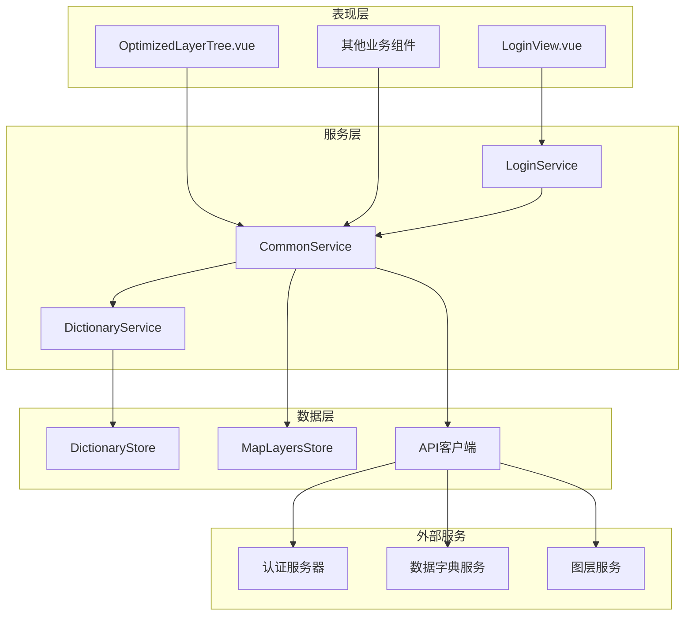
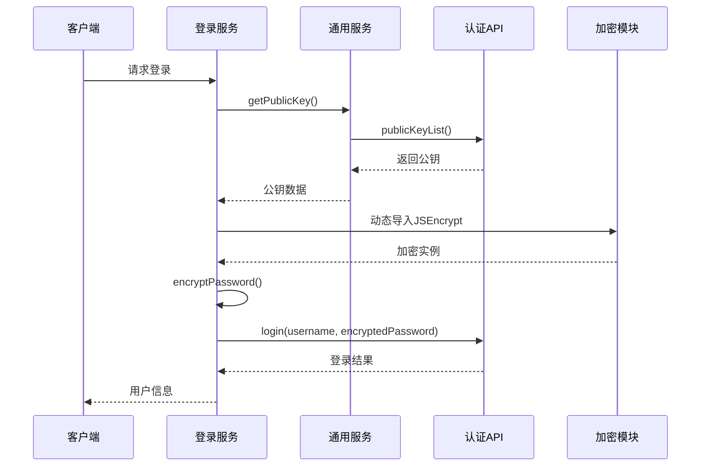
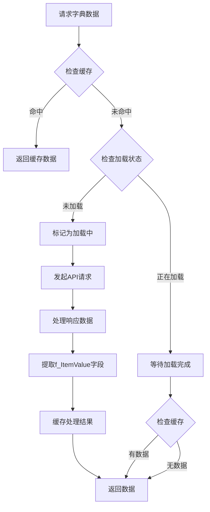
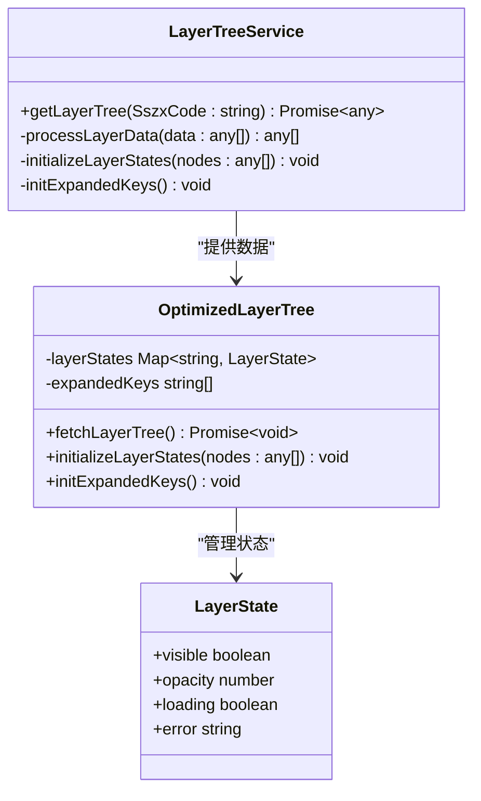
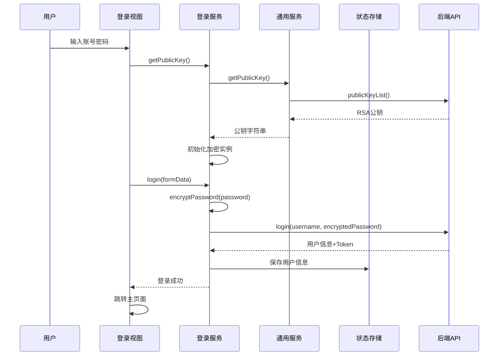
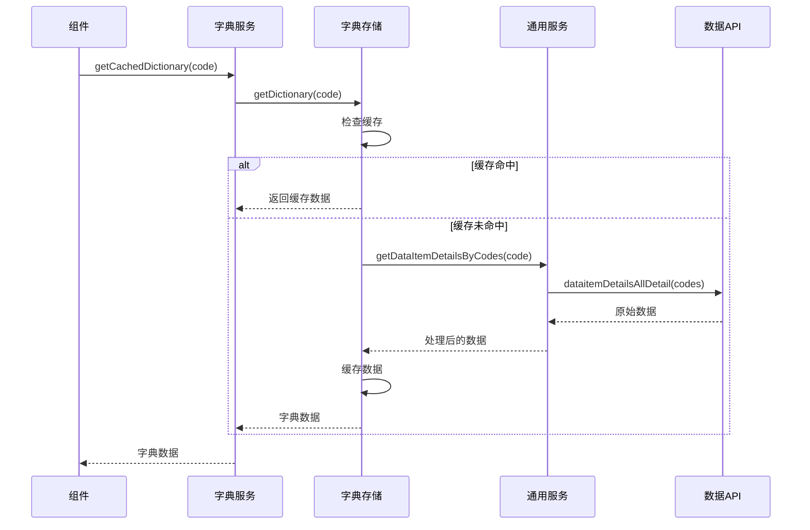
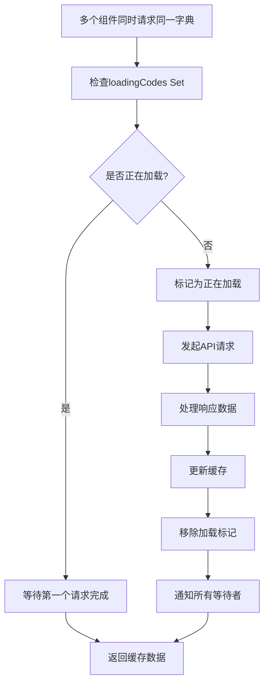

# 通用服务实现

<cite>
**本文档引用的文件**
- [commonService.ts](file://src/services/commonService.ts)
- [loginService.ts](file://src/services/loginService.ts)
- [dictionaryService.ts](file://src/services/dictionaryService.ts)
- [dictionaryStore.ts](file://src/stores/dictionaryStore.ts)
- [mapLayers.ts](file://src/stores/mapLayers.ts)
- [LoginView.vue](file://src/views/LoginView.vue)
- [OptimizedLayerTree.vue](file://src/mapComponents/OptimizedLayerTree.vue)
- [common.ts](file://src/api/common.ts)
- [index.ts](file://src/types/index.ts)
</cite>

## 目录
1. [简介](#简介)
2. [项目架构概览](#项目架构概览)
3. [登录认证系统](#登录认证系统)
4. [数据字典服务](#数据字典服务)
5. [图层树服务](#图层树服务)
6. [服务间协作流程](#服务间协作流程)
7. [性能优化策略](#性能优化策略)
8. [错误处理机制](#错误处理机制)
9. [最佳实践指南](#最佳实践指南)
10. [总结](#总结)

## 简介

本文档详细解析了政府dashboard项目中的通用服务层实现，重点分析了`commonService.ts`中提供的核心基础能力。该服务层为整个应用提供了认证、字典管理和图层初始化等关键功能，采用模块化设计和异步处理机制，确保系统的可维护性和扩展性。

## 项目架构概览

通用服务层采用分层架构设计，包含以下核心组件：

**图表来源**
- [LoginView.vue](file://src/views/LoginView.vue#L1-L50)
- [OptimizedLayerTree.vue](file://src/mapComponents/OptimizedLayerTree.vue#L1-L50)
- [commonService.ts](file://src/services/commonService.ts#L1-L30)

## 登录认证系统

### RSA加密动态导入机制

登录认证系统采用了先进的RSA公钥加密机制，确保密码传输的安全性。系统实现了智能的动态导入策略：

**图表来源**
- [loginService.ts](file://src/services/loginService.ts#L17-L108)
- [commonService.ts](file://src/services/commonService.ts#L18-L131)

### 异常处理逻辑

系统实现了多层次的异常处理机制：

1. **公钥获取异常处理**：当公钥获取失败时，系统会记录错误日志并抛出具体异常
2. **密码加密异常处理**：加密失败时，系统会回退到明文传输，并记录警告信息
3. **登录过程异常处理**：登录失败时，系统会清理无效的认证状态

**章节来源**
- [loginService.ts](file://src/services/loginService.ts#L17-L108)
- [commonService.ts](file://src/services/commonService.ts#L18-L131)

## 数据字典服务

### 缓存优化策略

数据字典服务采用了先进的缓存优化策略，显著提升了系统性能：

**图表来源**
- [dictionaryStore.ts](file://src/stores/dictionaryStore.ts#L38-L95)
- [dictionaryService.ts](file://src/services/dictionaryService.ts#L15-L45)

### 数据结构转换规则

系统实现了严格的数据结构转换规则，确保数据的一致性和可用性：

| 输入字段 | 输出字段 | 类型 | 描述 |
|---------|---------|------|------|
| itemDetailEntityList | f_ItemValue | string | 字典值 |
| itemDetailEntityList | f_ItemName | string | 字典名称 |
| itemDetailEntityList | f_SimpleSpelling | string | 简拼 |
| itemCode | itemCode | string | 字典编码 |

**章节来源**
- [dictionaryStore.ts](file://src/stores/dictionaryStore.ts#L68-L82)
- [commonService.ts](file://src/services/commonService.ts#L63-L82)

## 图层树服务

### SszxCode参数处理

图层树服务通过SszxCode参数实现灵活的图层过滤和展示：

**图表来源**
- [commonService.ts](file://src/services/commonService.ts#L85-L91)
- [OptimizedLayerTree.vue](file://src/mapComponents/OptimizedLayerTree.vue#L115-L140)

### 图层状态管理

系统实现了完整的图层状态管理机制：

1. **可见性控制**：支持图层的显示/隐藏切换
2. **透明度调节**：提供0-100%的透明度范围
3. **加载状态跟踪**：实时监控图层加载进度
4. **错误状态处理**：优雅处理加载失败的情况

**章节来源**
- [mapLayers.ts](file://src/stores/mapLayers.ts#L1-L114)
- [OptimizedLayerTree.vue](file://src/mapComponents/OptimizedLayerTree.vue#L145-L185)

## 服务间协作流程

### 登录认证完整流程

**图表来源**
- [LoginView.vue](file://src/views/LoginView.vue#L67-L105)
- [loginService.ts](file://src/services/loginService.ts#L85-L108)

### 字典数据获取流程

**图表来源**
- [dictionaryService.ts](file://src/services/dictionaryService.ts#L15-L28)
- [dictionaryStore.ts](file://src/stores/dictionaryStore.ts#L38-L95)

## 性能优化策略

### 并发请求处理

系统实现了智能的并发请求处理机制，避免重复请求：

**图表来源**
- [dictionaryStore.ts](file://src/stores/dictionaryStore.ts#L103-L193)

### 内存管理优化

1. **懒加载机制**：只在需要时加载加密模块
2. **状态清理**：及时清理无效的状态信息
3. **缓存策略**：合理设置缓存过期时间

**章节来源**
- [loginService.ts](file://src/services/loginService.ts#L276-L280)
- [dictionaryStore.ts](file://src/stores/dictionaryStore.ts#L200-L222)

## 错误处理机制

### 分层错误处理

系统实现了分层的错误处理机制：

| 层级 | 处理策略 | 示例场景 |
|------|----------|----------|
| 服务层 | 记录日志并抛出具体异常 | 公钥获取失败 |
| 组件层 | 显示友好错误提示 | 网络连接超时 |
| 用户层 | 提供操作反馈 | 登录失败提示 |

### 异常恢复策略

1. **降级处理**：加密失败时使用明文传输
2. **重试机制**：网络异常时自动重试
3. **状态重置**：异常后重置相关状态

**章节来源**
- [loginService.ts](file://src/services/loginService.ts#L29-L32)
- [commonService.ts](file://src/services/commonService.ts#L127-L130)

## 最佳实践指南

### 登录认证集成

1. **公钥预加载**：在应用启动时预先获取公钥
2. **加密实例复用**：避免重复创建加密实例
3. **状态同步**：确保认证状态的一致性

### 字典服务使用

1. **批量请求**：优先使用批量接口减少请求次数
2. **缓存利用**：充分利用缓存机制提升性能
3. **错误处理**：妥善处理字典数据缺失的情况

### 图层树管理

1. **状态持久化**：保存用户的图层选择状态
2. **异步加载**：支持大图层树的异步加载
3. **性能监控**：监控图层加载性能

**章节来源**
- [LoginView.vue](file://src/views/LoginView.vue#L67-L70)
- [OptimizedLayerTree.vue](file://src/mapComponents/OptimizedLayerTree.vue#L115-L140)

## 总结

通用服务层通过精心设计的架构和优化策略，为政府dashboard项目提供了稳定可靠的基础服务。其核心优势包括：

1. **安全性**：采用RSA加密确保数据传输安全
2. **性能**：通过缓存和优化策略提升系统响应速度
3. **可维护性**：模块化设计便于功能扩展和维护
4. **用户体验**：完善的错误处理和状态管理

开发者在集成这些服务时，应当遵循最佳实践指南，充分利用系统的优化特性，确保应用的稳定性和用户体验。