# 统一HTTP客户端

<cite>
**本文档引用的文件**  
- [httpClient.ts](file://src/services/httpClient.ts)
- [commonService.ts](file://src/services/commonService.ts)
- [bridgeService.ts](file://src/services/bridgeService.ts)
- [gasService.ts](file://src/services/gasService.ts)
- [waterSupplyService.ts](file://src/services/waterSupplyService.ts)
- [config.ts](file://src/services/config.ts)
- [loginService.ts](file://src/services/loginService.ts)
- [dictionaryService.ts](file://src/services/dictionaryService.ts)
- [statusService.ts](file://src/services/statusService.ts)
- [wfsService.ts](file://src/services/wfsService.ts)
- [auth.ts](file://src/stores/auth.ts)
- [dictionaryStore.ts](file://src/stores/dictionaryStore.ts)
- [main.ts](file://src/main.ts)
- [vite.config.js](file://vite.config.js)
- [package.json](file://package.json)
- [index.ts](file://src/router/index.ts)
</cite>

## 目录
1. [项目结构](#项目结构)
2. [统一HTTP客户端核心实现](#统一http客户端核心实现)
3. [请求拦截器与响应处理](#请求拦截器与响应处理)
4. [服务层调用模式](#服务层调用模式)
5. [认证与Token管理](#认证与token管理)
6. [错误处理与消息提示](#错误处理与消息提示)
7. [请求并发控制](#请求并发控制)
8. [WFS服务特殊实现](#wfs服务特殊实现)
9. [配置与环境变量](#配置与环境变量)
10. [状态管理集成](#状态管理集成)

## 项目结构

政府dashboard项目的整体结构清晰，采用模块化设计，主要分为以下几个部分：

- `public/`: 静态资源目录，包含Cesium地图库和其他静态文件
- `src/`: 源代码目录，包含所有前端代码
  - `assets/`: 项目静态资源，如样式、字体等
  - `components/`: 通用UI组件
  - `config/`: 配置文件
  - `hook/`: 自定义Hook
  - `layouts/`: 页面布局组件
  - `mapComponents/`: 地图相关组件
  - `router/`: 路由配置
  - `services/`: 服务层，包含HTTP客户端和业务服务
  - `stores/`: 状态管理（Pinia）
  - `types/`: 类型定义
  - `views/`: 页面视图组件
  - `App.vue` 和 `main.ts`: 应用入口

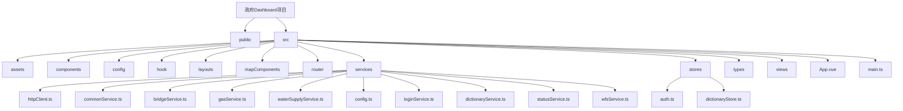

**图源**  
- [项目结构](file://README.md)

## 统一HTTP客户端核心实现

统一HTTP客户端是整个项目的核心网络通信模块，位于`src/services/httpClient.ts`文件中。该模块基于Axios库构建，提供了统一的请求配置、拦截器和错误处理机制。

客户端的主要特性包括：
- 统一的基础URL配置
- 默认的请求超时设置（15秒）
- JSON内容类型默认设置
- 请求和响应拦截器
- 统一的错误处理和用户提示

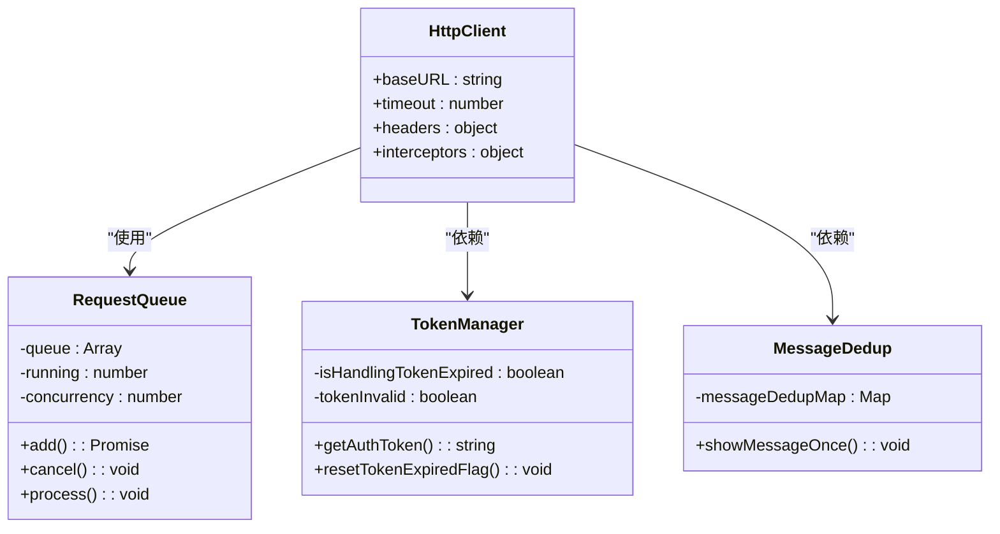

**图源**  
- [httpClient.ts](file://src/services/httpClient.ts#L6-L297)

**本节源**  
- [httpClient.ts](file://src/services/httpClient.ts#L6-L297)

## 请求拦截器与响应处理

HTTP客户端实现了完整的请求-响应拦截机制，确保了请求的一致性和响应的统一处理。

### 请求拦截器

请求拦截器在发送请求前执行，主要功能包括：
- 检查Token是否失效
- 自动添加认证Token到请求头
- 开发环境下记录请求日志
- 移除skipAuth标记

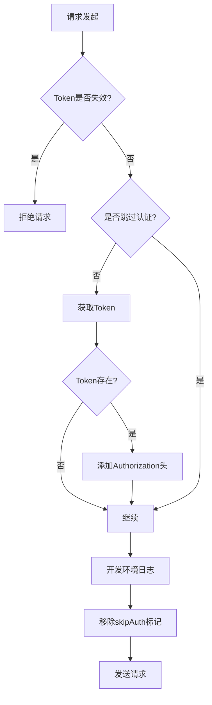

**图源**  
- [httpClient.ts](file://src/services/httpClient.ts#L107-L139)

### 响应拦截器

响应拦截器在接收到响应后执行，主要功能包括：
- 处理业务状态码（200、401等）
- 统一错误提示
- Token过期处理
- 网络错误处理

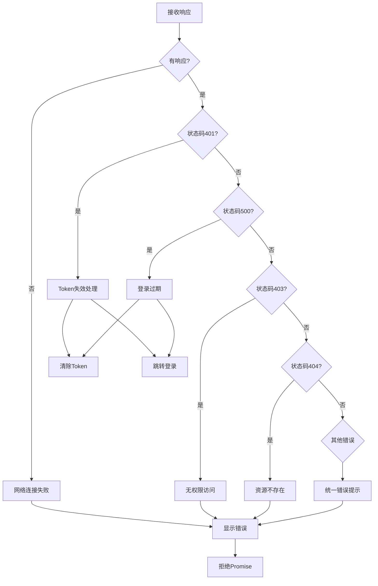

**图源**  
- [httpClient.ts](file://src/services/httpClient.ts#L142-L230)

**本节源**  
- [httpClient.ts](file://src/services/httpClient.ts#L107-L230)

## 服务层调用模式

项目中的服务层采用统一的调用模式，所有业务服务都通过统一HTTP客户端进行网络通信。

### 服务层结构

服务层位于`src/services/`目录下，主要包括：
- `commonService.ts`: 通用服务（登录、字典等）
- `bridgeService.ts`: 桥梁模块服务
- `gasService.ts`: 燃气模块服务
- `waterSupplyService.ts`: 供水模块服务
- `statusService.ts`: 综合态势服务
- `wfsService.ts`: WFS服务

### 服务调用示例

以桥梁服务为例，展示了服务层如何使用统一HTTP客户端：

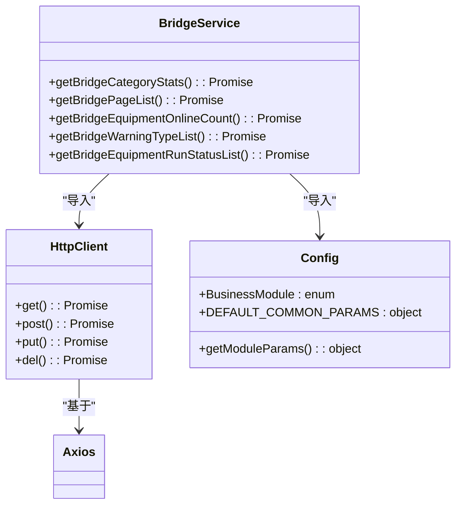

**图源**  
- [bridgeService.ts](file://src/services/bridgeService.ts#L1-L57)
- [config.ts](file://src/services/config.ts#L1-L114)

**本节源**  
- [bridgeService.ts](file://src/services/bridgeService.ts#L1-L57)
- [gasService.ts](file://src/services/gasService.ts#L1-L192)
- [waterSupplyService.ts](file://src/services/waterSupplyService.ts#L1-L186)

## 认证与Token管理

项目实现了完整的认证与Token管理机制，确保用户会话的安全性和连续性。

### Token管理机制

Token管理主要在`httpClient.ts`和`auth.ts`中实现，关键特性包括：
- Token失效标志位
- Token处理锁
- 本地存储集成
- 自动重定向

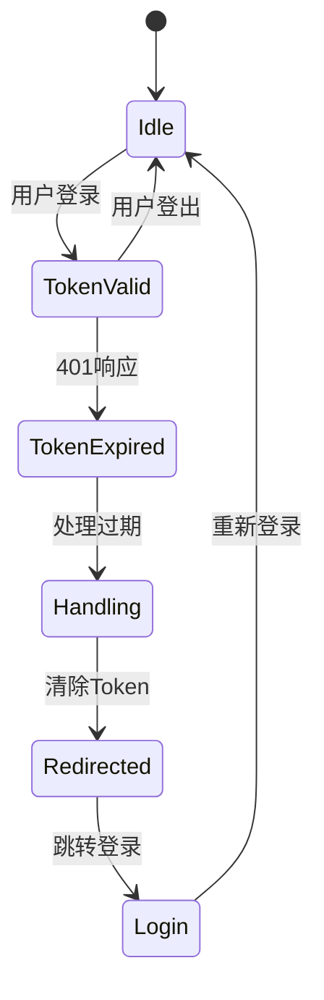

### 登录服务

`loginService.ts`提供了完整的登录服务，包括：
- RSA公钥获取
- 密码加密
- 登录请求
- 用户信息存储

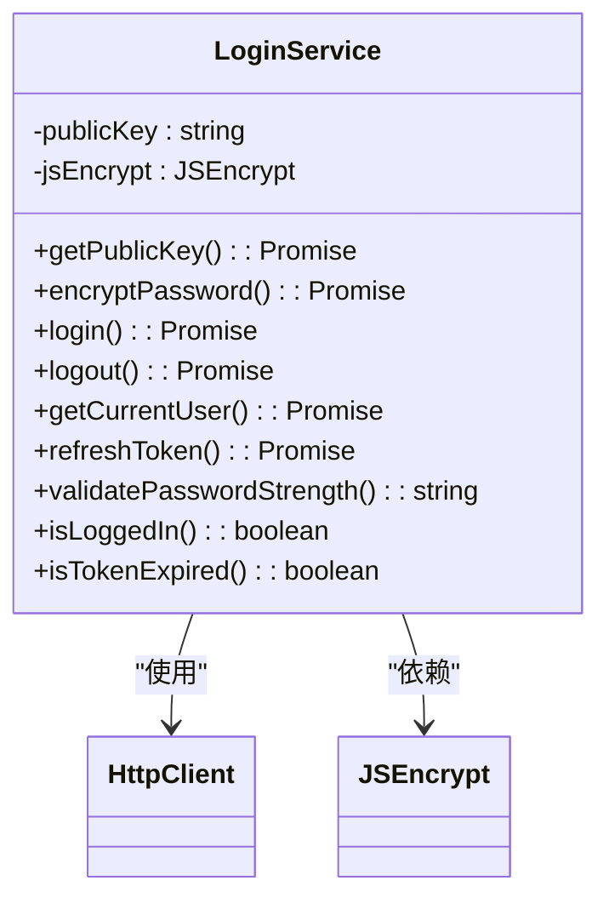

**图源**  
- [httpClient.ts](file://src/services/httpClient.ts#L14-L29)
- [loginService.ts](file://src/services/loginService.ts#L1-L295)
- [auth.ts](file://src/stores/auth.ts#L1-L76)

**本节源**  
- [httpClient.ts](file://src/services/httpClient.ts#L14-L29)
- [loginService.ts](file://src/services/loginService.ts#L1-L295)
- [auth.ts](file://src/stores/auth.ts#L1-L76)

## 错误处理与消息提示

项目实现了智能的错误处理和消息提示机制，避免重复提示相同的错误信息。

### 消息去重机制

通过`messageDedupMap`实现消息去重，确保相同错误在1秒内只显示一次：

```typescript
const messageDedupMap = new Map<string, number>()

function showMessageOnce(msg: string): void {
  const now = Date.now()
  const lastShownTime = messageDedupMap.get(msg)
  
  if (!lastShownTime || now - lastShownTime >= 1000) {
    message.error(msg)
    messageDedupMap.set(msg, now)
  }
  
  // 清理过期的记录
  messageDedupMap.forEach((time, key) => {
    if (now - time >= 1000) {
      messageDedupMap.delete(key)
    }
  })
}
```

### 错误处理流程

```mermaid
flowchart TD
A[发生错误] --> B{网络错误?}
B --> |是| C[显示"网络连接失败"]
B --> |否| D{响应存在?}
D --> |否| C
D --> |是| E{状态码401?}
E --> |是| F[显示"登录已过期"]
E --> |否| G{状态码500?}
G --> |是| F
G --> |否| H{状态码403?}
H --> |是| I[显示"没有权限"]
H --> |否| J{状态码404?}
J --> |是| K[显示"资源不存在"]
J --> |否| L[显示具体错误信息]
C --> M[去重检查]
F --> M
I --> M
K --> M
L --> M
M --> N[显示错误消息]
```

**图源**  
- [httpClient.ts](file://src/services/httpClient.ts#L31-L49)

**本节源**  
- [httpClient.ts](file://src/services/httpClient.ts#L31-L49)

## 请求并发控制

为了防止Token失效时大量请求同时被拒绝，项目实现了请求队列机制。

### 请求队列实现

`RequestQueue`类实现了并发控制和请求排队：

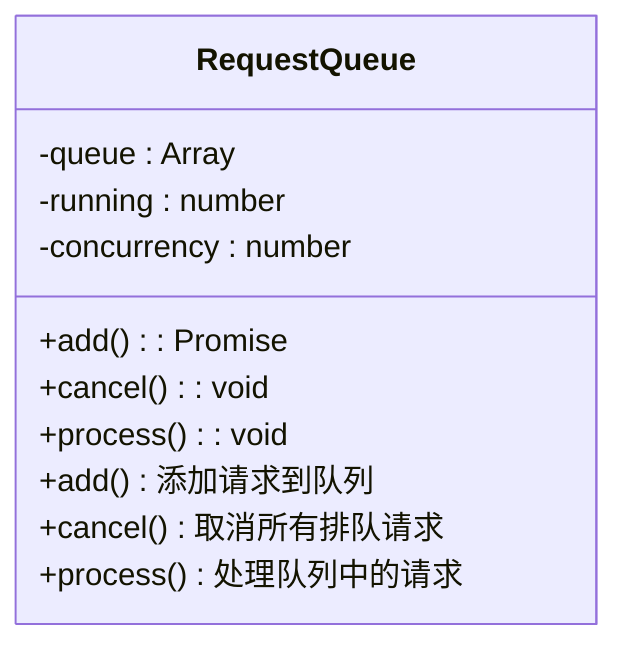

### 并发控制流程

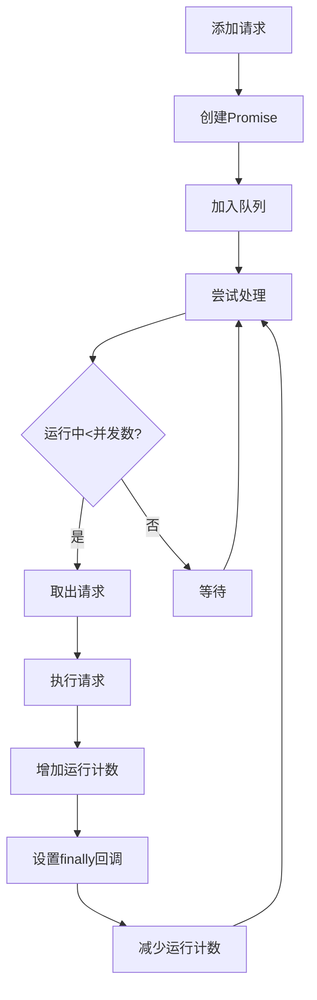

当Token失效时，`requestQueue.cancel()`会取消所有排队的请求，避免大量错误提示：

```typescript
if (response.data.code === 401) {
  tokenInvalid = true
  requestQueue.cancel() // 取消所有排队请求
  
  if (!isHandlingTokenExpired) {
    isHandlingTokenExpired = true
    localStorage.removeItem('token')
    showMessageOnce('登录已过期，请重新登录')
    router.push('/login')
  }
}
```

**图源**  
- [httpClient.ts](file://src/services/httpClient.ts#L53-L90)

**本节源**  
- [httpClient.ts](file://src/services/httpClient.ts#L53-L90)

## WFS服务特殊实现

对于WFS服务，项目采用了原生fetch实现，而不是统一HTTP客户端，以满足特定需求。

### WFS服务特点

- 使用原生fetch而非Axios
- 支持WFS标准协议
- 可配置GeoServer实例
- 提供多种查询方式

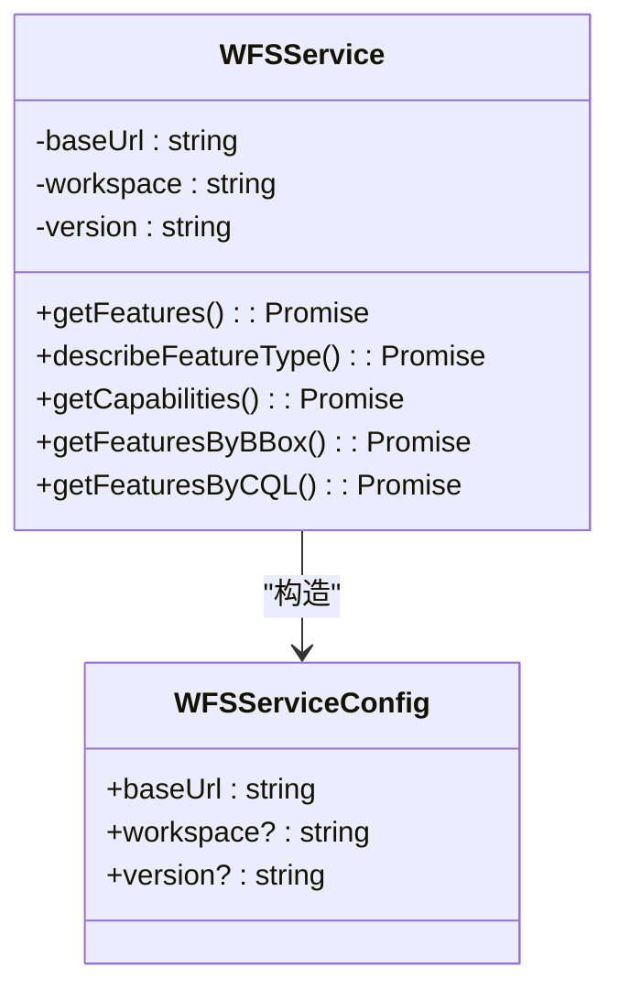

### WFS查询流程

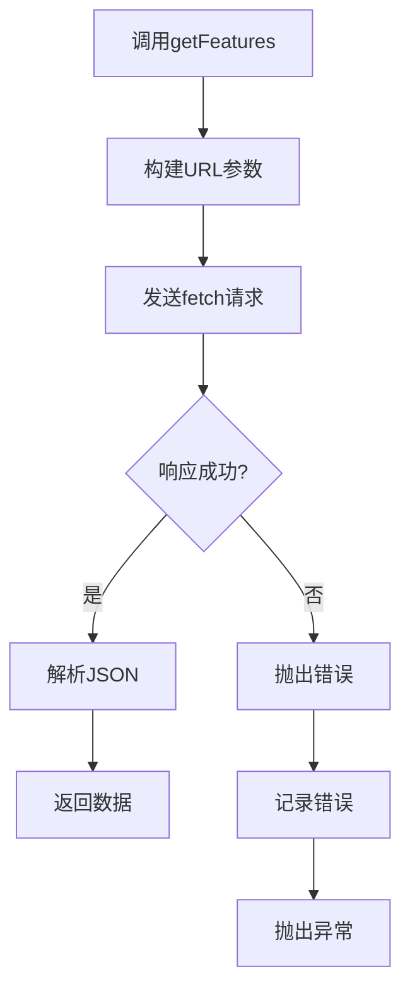

**图源**  
- [wfsService.ts](file://src/services/wfsService.ts#L1-L199)

**本节源**  
- [wfsService.ts](file://src/services/wfsService.ts#L1-L199)

## 配置与环境变量

项目通过多种方式管理配置和环境变量，确保灵活性和安全性。

### 环境变量配置

在`vite.config.js`中配置了环境变量和代理：

```javascript
export default defineConfig(({ command, mode }) => {
  const env = loadEnv(mode, process.cwd(), "");
  
  return {
    base: env.VITE_BASE_URL || "/clmap/",
    server: {
      proxy: {
        [env.VITE_API_BASE_URL]: {
          target: env.VITE_API_URL,
          changeOrigin: true,
        }
      },
    },
    define: {
      __APP_VERSION__: JSON.stringify(env.VITE_APP_VERSION || "1.0.0"),
    }
  };
});
```

### API配置

`config.ts`文件定义了业务模块枚举和公共参数：

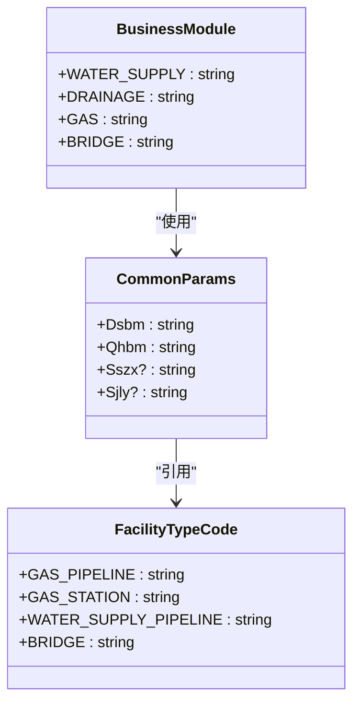

**图源**  
- [vite.config.js](file://vite.config.js#L1-L83)
- [config.ts](file://src/services/config.ts#L1-L114)

**本节源**  
- [vite.config.js](file://vite.config.js#L1-L83)
- [config.ts](file://src/services/config.ts#L1-L114)

## 状态管理集成

项目使用Pinia进行状态管理，与HTTP客户端紧密集成。

### 认证状态管理

`auth.ts`存储用户认证状态：

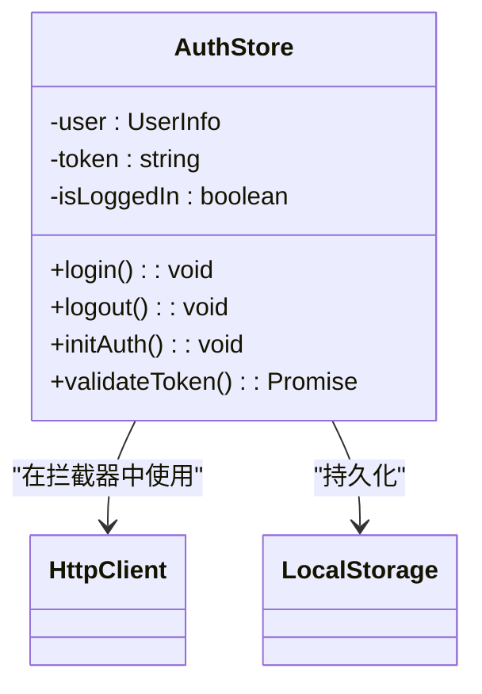

### 字典状态管理

`dictionaryStore.ts`管理字典数据缓存：

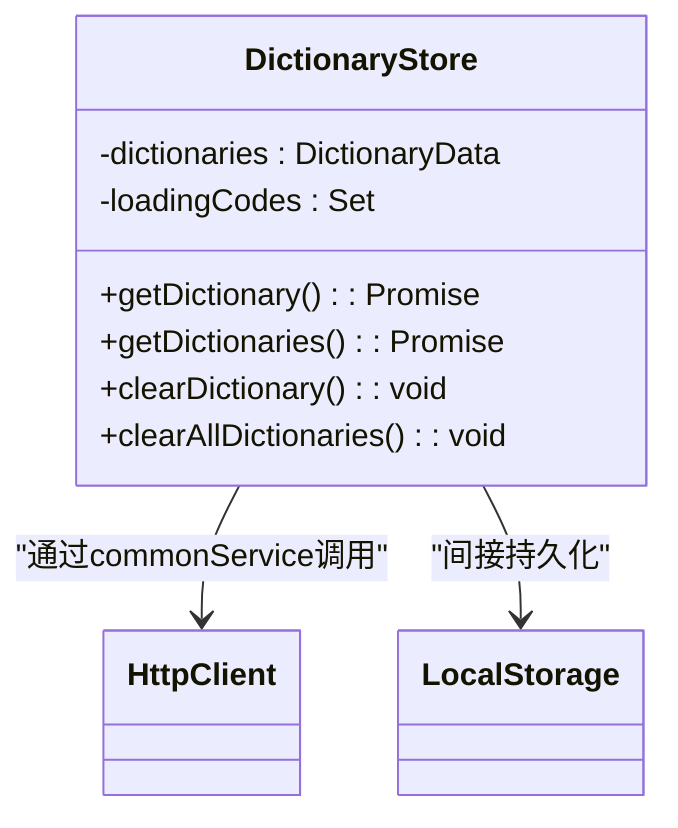

### 路由守卫集成

在`router/index.ts`中，路由守卫与认证状态集成：

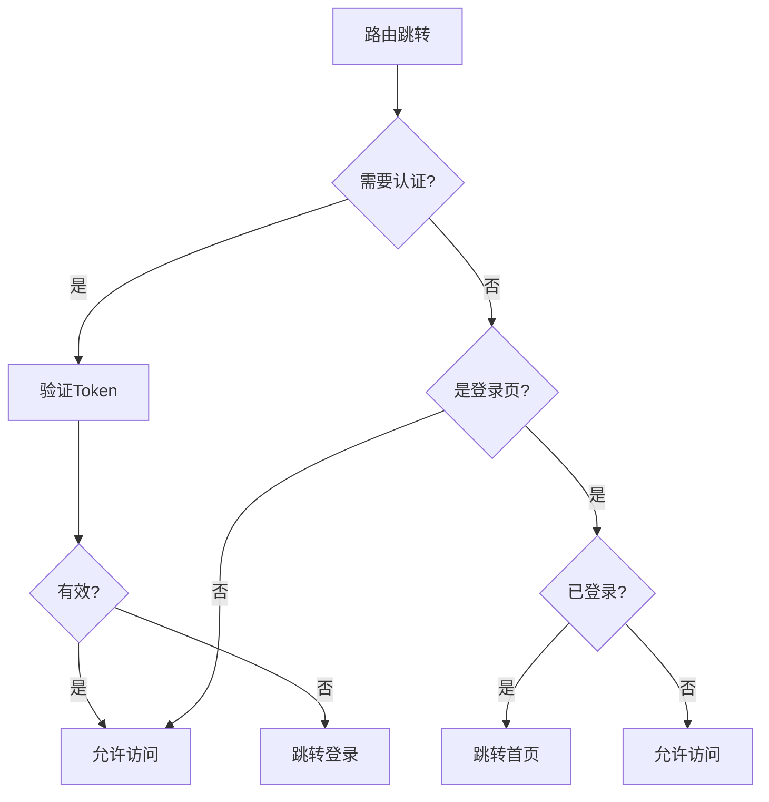

**图源**  
- [auth.ts](file://src/stores/auth.ts#L1-L76)
- [dictionaryStore.ts](file://src/stores/dictionaryStore.ts#L1-L225)
- [index.ts](file://src/router/index.ts#L1-L136)

**本节源**  
- [auth.ts](file://src/stores/auth.ts#L1-L76)
- [dictionaryStore.ts](file://src/stores/dictionaryStore.ts#L1-L225)
- [index.ts](file://src/router/index.ts#L1-L136)