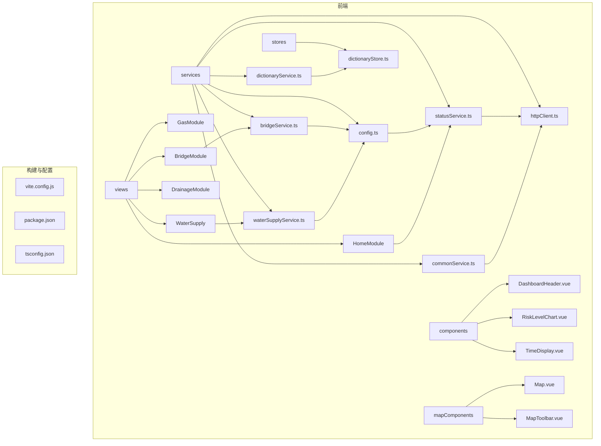
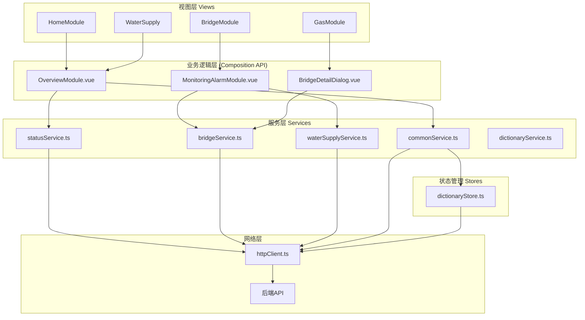
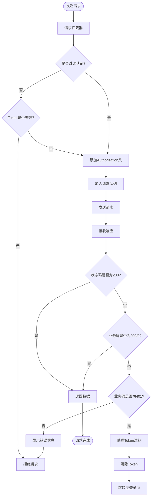
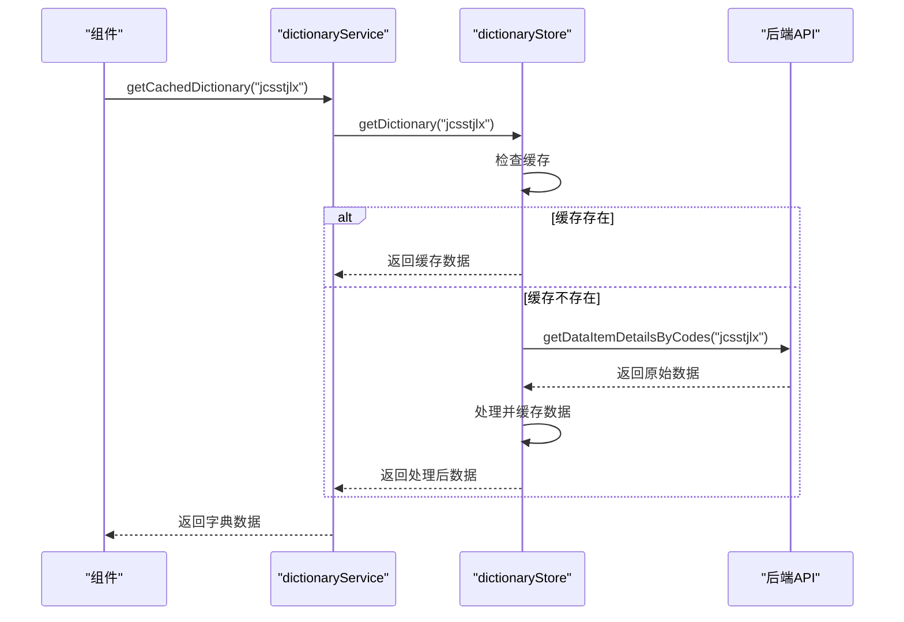
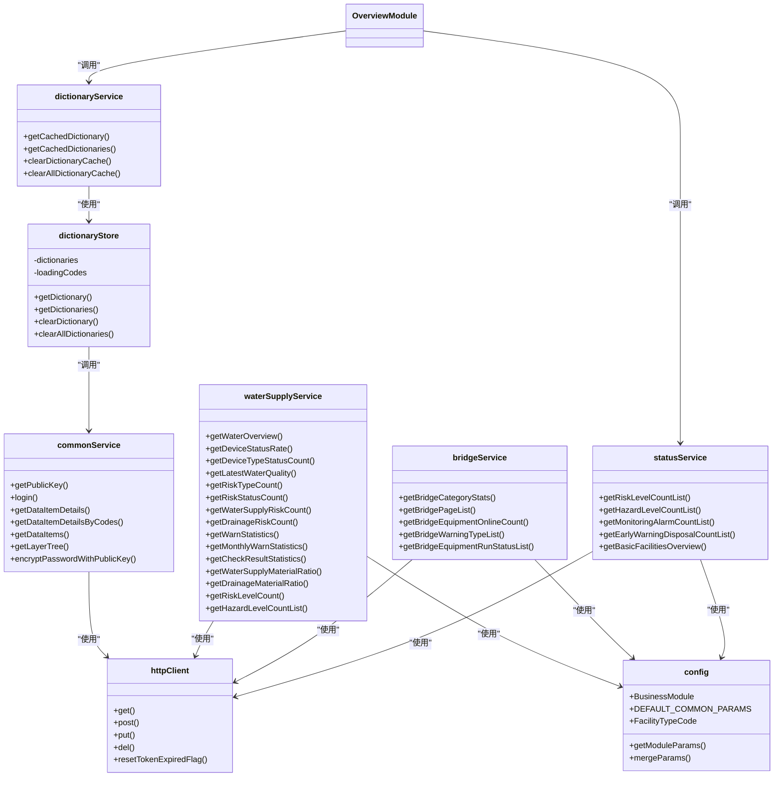

# 综合状态API服务

<cite>
**本文档引用文件**  
- [statusService.ts](file://src/services/statusService.ts)
- [httpClient.ts](file://src/services/httpClient.ts)
- [config.ts](file://src/services/config.ts)
- [commonService.ts](file://src/services/commonService.ts)
- [dictionaryStore.ts](file://src/stores/dictionaryStore.ts)
- [dictionaryService.ts](file://src/services/dictionaryService.ts)
- [bridgeService.ts](file://src/services/bridgeService.ts)
- [waterSupplyService.ts](file://src/services/waterSupplyService.ts)
- [mapConfig.ts](file://src/config/mapConfig.ts)
- [OverviewModule.vue](file://src/views/HomeModule/components/OverviewModule.vue)
- [OverviewModule.vue](file://src/views/BridgeModule/components/OverviewModule.vue)
- [vite.config.js](file://vite.config.js)
- [package.json](file://package.json)
</cite>

## 目录
1. [简介](#简介)
2. [项目结构](#项目结构)
3. [核心组件](#核心组件)
4. [架构概览](#架构概览)
5. [详细组件分析](#详细组件分析)
6. [依赖分析](#依赖分析)
7. [性能考虑](#性能考虑)
8. [故障排除指南](#故障排除指南)
9. [结论](#结论)

## 简介
本项目是一个面向政府管理的城市基础设施综合态势监控仪表板系统，专注于供水、排水、燃气和桥梁等关键市政设施的实时监控与数据分析。系统通过统一的API服务层与后端交互，获取风险等级、隐患统计、监测报警、预警处置及基础设施总览等关键指标数据，并在前端以可视化方式呈现。该系统为城市管理者提供全面、直观的决策支持，提升城市运行安全水平。

## 项目结构
该项目采用基于Vue 3和TypeScript的标准前端架构，结合Pinia进行状态管理，ECharts实现数据可视化，Cesium用于三维地理信息展示。整体结构清晰，按功能模块划分，便于维护和扩展。

**图示来源**  
- [src/views](file://src/views)
- [src/services](file://src/services)
- [src/stores](file://src/stores)
- [src/components](file://src/components)
- [src/mapComponents](file://src/mapComponents)

**本节来源**  
- [package.json](file://package.json)
- [vite.config.js](file://vite.config.js)

## 核心组件
综合态势API服务的核心是`statusService.ts`，它封装了所有与后端交互的API调用，为前端各模块提供统一的数据访问接口。这些接口主要分为两大类：一是综合态势统计接口，二是基础设施总览接口。所有请求均通过`httpClient.ts`进行，该模块提供了统一的请求配置、拦截器、错误处理和Token管理机制，确保了通信的安全性和稳定性。

**本节来源**  
- [statusService.ts](file://src/services/statusService.ts)
- [httpClient.ts](file://src/services/httpClient.ts)

## 架构概览
系统的整体架构遵循典型的分层模式，从上至下分为视图层、业务逻辑层、服务层和网络层。

**图示来源**  
- [src/views](file://src/views)
- [src/services](file://src/services)
- [src/stores/dictionaryStore.ts](file://src/stores/dictionaryStore.ts)
- [src/services/httpClient.ts](file://src/services/httpClient.ts)

## 详细组件分析

### 综合态势服务分析
`statusService.ts`是综合态势模块的核心，它直接调用后端API，为首页总览、风险监控等模块提供数据支持。该服务通过`get`方法从`httpClient.ts`获取数据，所有接口均返回Promise，符合现代异步编程规范。

#### 接口定义
以下表格列出了`statusService.ts`中定义的主要API接口：

| 接口名称 | URL路径 | 功能描述 | 请求方法 |
| :--- | :--- | :--- | :--- |
| `getRiskLevelCountList` | `/zzts/fxdj/count` | 获取风险等级数量统计 | GET |
| `getHazardLevelCountList` | `/zzts/yhdj/count` | 获取隐患等级数量统计 | GET |
| `getMonitoringAlarmCountList` | `/zzts/jcbj/count` | 获取监测报警数量统计 | GET |
| `getEarlyWarningDisposalCountList` | `/zzts/yjcz/count` | 获取预警处置数量统计 | GET |
| `getBasicFacilitiesOverview` | `/gspspDtransPubbasicfacilitiesinfo/list` | 获取基础设施总览统计 | GET |

**本节来源**  
- [statusService.ts](file://src/services/statusService.ts)

### HTTP客户端分析
`httpClient.ts`是整个应用的网络通信基石，它基于Axios构建，提供了强大的请求拦截、响应处理和错误管理能力。

#### 请求流程

**图示来源**  
- [src/services/httpClient.ts](file://src/services/httpClient.ts#L106-L230)

**本节来源**  
- [src/services/httpClient.ts](file://src/services/httpClient.ts)

### 字典服务与状态管理分析
系统通过`dictionaryStore.ts`和`dictionaryService.ts`实现了高效的字典数据缓存机制，避免了重复请求，提升了性能。

#### 字典数据获取流程

**图示来源**  
- [src/services/dictionaryService.ts](file://src/services/dictionaryService.ts)
- [src/stores/dictionaryStore.ts](file://src/stores/dictionaryStore.ts)

**本节来源**  
- [src/stores/dictionaryStore.ts](file://src/stores/dictionaryStore.ts)
- [src/services/dictionaryService.ts](file://src/services/dictionaryService.ts)

## 依赖分析
项目的依赖关系清晰，各模块职责分明。`statusService`等业务服务层依赖于`httpClient`和`config`，而`httpClient`又依赖于`axios`和`pinia`（用于状态管理）。前端组件通过组合API（Composition API）的方式调用服务层，实现了逻辑与视图的解耦。

**图示来源**  
- [src/services/statusService.ts](file://src/services/statusService.ts)
- [src/services/bridgeService.ts](file://src/services/bridgeService.ts)
- [src/services/waterSupplyService.ts](file://src/services/waterSupplyService.ts)
- [src/services/commonService.ts](file://src/services/commonService.ts)
- [src/services/dictionaryService.ts](file://src/services/dictionaryService.ts)
- [src/services/httpClient.ts](file://src/services/httpClient.ts)
- [src/services/config.ts](file://src/services/config.ts)
- [src/stores/dictionaryStore.ts](file://src/stores/dictionaryStore.ts)

**本节来源**  
- [package.json](file://package.json)

## 性能考虑
系统在性能方面做了多项优化：
1.  **请求队列**：`httpClient.ts`中实现了`RequestQueue`类，限制并发请求数量，防止过多请求阻塞主线程。
2.  **字典缓存**：通过`dictionaryStore`对字典数据进行缓存，避免重复请求，显著减少网络开销。
3.  **消息去重**：`httpClient.ts`中使用`messageDedupMap`防止在短时间内重复显示相同的错误消息，提升用户体验。
4.  **代码分割**：`vite.config.js`中配置了`rollupOptions`，将Vue核心库和工具库（如axios）打包成独立的chunk，实现按需加载。

## 故障排除指南
当遇到API调用问题时，可按以下步骤排查：
1.  **检查网络连接**：确认前端应用与后端服务器网络通畅。
2.  **查看控制台日志**：`httpClient.ts`在开发环境下会打印详细的请求和响应信息，是定位问题的第一手资料。
3.  **检查Token状态**：若收到401错误，检查`localStorage`中的`token`是否有效，`httpClient`会自动处理Token过期并重定向到登录页。
4.  **验证API路径**：确认`vite.config.js`中的`proxy`配置正确，确保API请求能被正确代理到后端。
5.  **检查字典加载**：若页面显示`f_ItemValue`而非中文名称，可能是`dictionaryStore`未能成功获取字典数据，检查`/data/dataitem/details/all/`接口是否正常。

**本节来源**  
- [src/services/httpClient.ts](file://src/services/httpClient.ts)
- [vite.config.js](file://vite.config.js)

## 结论
该综合态势API服务设计合理，结构清晰，具备良好的可维护性和扩展性。通过`statusService`等模块化的服务层，实现了与后端API的高效对接。`httpClient`提供了健壮的网络通信保障，而`dictionaryStore`则有效提升了数据加载性能。整个系统为政府仪表板提供了稳定、可靠的数据支撑，是项目成功的关键组成部分。