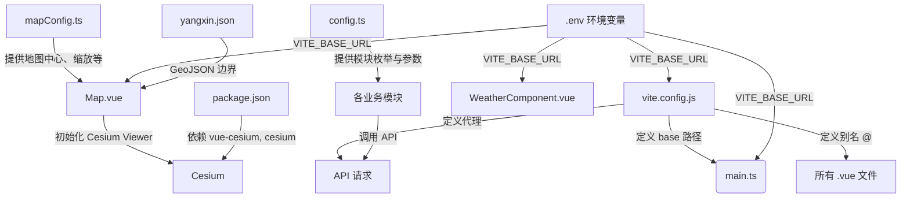

# 配置管理

<cite>
**本文档引用文件**  
- [mapConfig.ts](file://src/config/mapConfig.ts)
- [config.ts](file://src/services/config.ts)
- [vite.config.js](file://vite.config.js)
- [main.ts](file://src/main.ts)
- [Map.vue](file://src/mapComponents/Map.vue)
- [WeatherComponent.vue](file://src/components/WeatherComponent.vue)
- [package.json](file://package.json)
</cite>

## 目录
1. [项目结构](#项目结构)  
2. [地图配置管理](#地图配置管理)  
3. [API与业务模块配置](#api与业务模块配置)  
4. [构建与环境配置](#构建与环境配置)  
5. [静态资源与路径配置](#静态资源与路径配置)  
6. [配置依赖关系图](#配置依赖关系图)  

## 项目结构

本项目采用典型的 Vue 3 + Vite 架构，结合 Cesium 实现三维地理信息可视化。主要目录结构如下：

- `public/`：存放静态资源，包括 Cesium 库文件、地图瓦片、GeoJSON 数据等
- `src/`：源码目录
  - `config/`：地图相关配置
  - `services/`：API 配置与服务封装
  - `mapComponents/`：地图核心组件
  - `views/`：各业务模块视图（桥梁、燃气、供水等）
  - `stores/`：Pinia 状态管理
  - `router/`：路由配置
  - `assets/`：样式与字体资源

**Section sources**  
- [src](file://src)

## 地图配置管理

地图配置集中定义在 `src/config/mapConfig.ts` 文件中，包含地图中心点、缩放级别、相机边界限制、图层 URL 和样式资源等关键参数。

### 核心配置项

- **地图中心点**：阳新县（经度 115.186322，纬度 29.864861）
- **默认缩放级别**：11
- **相机边界限制**：
  - 西边界：114.8
  - 南边界：29.4
  - 东边界：115.6
  - 北边界：30.2
  - 缓冲距离：0.1 度
  - 最小高度：10,000 米（最大放大）
  - 最大高度：150,000 米（最小放大）
- **天地图配置**：支持矢量（vec）、影像（img）、地形（ter）三种底图类型，缩放级别限制为 3-15 级
- **样式资源**：字体和图标通过远程 URL 加载

该配置被 `Map.vue` 组件引用，用于初始化 Cesium Viewer 的相机位置和边界限制。

**Section sources**  
- [mapConfig.ts](file://src/config/mapConfig.ts#L9-L53)

## API与业务模块配置

API 配置位于 `src/services/config.ts`，主要定义业务模块枚举、公共请求参数和参数合并逻辑。

### 业务模块枚举

```typescript
export enum BusinessModule {
  WATER_SUPPLY = 'csaqzx_gs',        // 供水
  DRAINAGE = 'csaqzx_ps',            // 排水
  GAS = 'csaqzx_rq',                 // 燃气
  BRIDGE = 'csaqzx_ql',              // 桥梁
  GAS_END_USER = 'csaqzx_rqzdyh',    // 燃气终端用户
  BOTTLED_LPG = 'csaqzx_pzyhq',      // 瓶装液化气
  THIRD_PARTY_CONSTRUCTION = 'csaqzx_sfsg' // 第三方施工
}
```

### 公共参数

- **市州编码（Dsbm）**：420200（黄石市）
- **区划编码（Qhbm）**：420222（阳新县）

通过 `getModuleParams()` 函数可获取指定模块的默认参数，`mergeParams()` 函数用于合并自定义参数。

### 基础设施类型编码

定义了燃气、排水、供水、桥梁等各类基础设施的统计编码，用于后端数据查询与聚合。

**Section sources**  
- [config.ts](file://src/services/config.ts#L8-L113)

## 构建与环境配置

Vite 构建配置在 `vite.config.js` 中定义，包含开发服务器、构建输出、环境变量、代理等设置。

### 关键配置

- **基础路径（base）**：由 `VITE_BASE_URL` 环境变量决定，默认为 `/clmap/`
- **开发服务器**：
  - 端口：5174
  - 启用 CORS
  - 反向代理：将 API 请求代理至后端服务
- **构建优化**：
  - 启用代码分割（manualChunks）
  - 生产环境可选择移除 console 和 debugger
  - 输出路径：`dist/`
- **环境变量注入**：
  - `__APP_VERSION__`：应用版本
  - `__BUILD_TIME__`：构建时间戳

**Section sources**  
- [vite.config.js](file://vite.config.js#L19-L72)

## 静态资源与路径配置

项目通过多种方式管理静态资源路径，确保在不同部署环境下正确加载资源。

### 路径映射

- `@` 指向 `src/` 目录（通过 Vite 配置）
- Cesium 库路径由 `VITE_BASE_URL` 动态拼接
- GeoJSON 数据（如 `yangxin.json`）通过 `import.meta.env.BASE_URL` 加载

### 环境变量使用

多个组件中使用 `import.meta.env.VITE_BASE_URL` 获取基础路径，包括：

- `main.ts`：初始化 VueCesium 插件
- `Map.vue`：加载阳新县边界 GeoJSON
- `WeatherComponent.vue`：加载天气图标

**Section sources**  
- [main.ts](file://src/main.ts#L21-L26)
- [Map.vue](file://src/mapComponents/Map.vue#L227-L229)
- [WeatherComponent.vue](file://src/components/WeatherComponent.vue#L15-L18)

## 配置依赖关系图



**Diagram sources**  
- [vite.config.js](file://vite.config.js#L20)
- [main.ts](file://src/main.ts#L26)
- [mapConfig.ts](file://src/config/mapConfig.ts#L9-L14)
- [Map.vue](file://src/mapComponents/Map.vue#L74)
- [config.ts](file://src/services/config.ts#L8-L23)
- [WeatherComponent.vue](file://src/components/WeatherComponent.vue#L15)

**Section sources**  
- [vite.config.js](file://vite.config.js)
- [main.ts](file://src/main.ts)
- [mapConfig.ts](file://src/config/mapConfig.ts)
- [Map.vue](file://src/mapComponents/Map.vue)
- [config.ts](file://src/services/config.ts)
- [WeatherComponent.vue](file://src/components/WeatherComponent.vue)