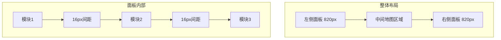
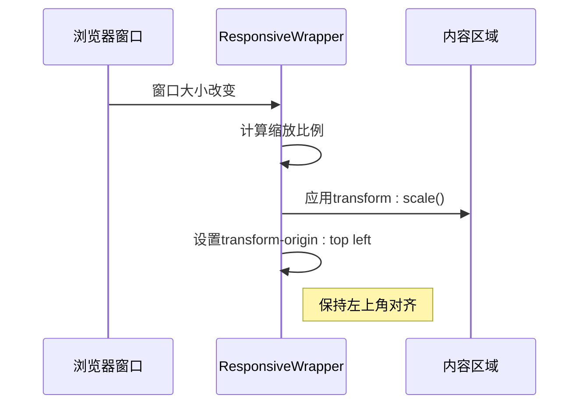

# UI设计系统

<cite>
**本文档引用的文件**
- [DashboardHeader.vue](file://src/components/DashboardHeader.vue)
- [variables.scss](file://src/assets/styles/variables.scss)
- [base.css](file://src/assets/base.css)
- [main.css](file://src/assets/main.css)
- [ResponsiveWrapper.vue](file://src/components/ResponsiveWrapper.vue)
- [App.vue](file://src/App.vue)
- [leftContent.vue](file://src/views/GasModule/leftContent.vue)
- [rightContent.vue](file://src/views/GasModule/rightContent.vue)
- [MapLegend.vue](file://src/views/HomeModule/components/MapLegend.vue)
- [MonitoringDialog.vue](file://src/views/GasModule/components/map/MonitoringDialog.vue)
- [BridgeDetailDialog.vue](file://src/views/BridgeModule/components/map/BridgeDetailDialog.vue)
- [StationDetailDialog.vue](file://src/views/GasModule/components/map/StationDetailDialog.vue)
- [CommonTable.vue](file://src/components/CommonTable.vue)
- [font.css](file://src/assets/font/font.css)
</cite>

## 更新摘要
**所做更改**
- 新增地图图例的视觉升级规范，包括渐变背景、边框装饰和模糊效果
- 增强对话框组件的样式一致性，统一字体系统和视觉层次
- 完善字体系统的一致化管理，统一使用SourceHanSansSC字体族
- 更新玻璃态背景效果的实现细节和应用场景

## 目录
1. [引言](#引言)
2. [颜色体系](#颜色体系)
3. [布局规范](#布局规范)
4. [SCSS变量与全局样式](#scss变量与全局样式)
5. [玻璃态背景效果](#玻璃态背景效果)
6. [响应式设计](#响应式设计)
7. [组件级设计规范](#组件级设计规范)
8. [字体系统一致性](#字体系统一致性)

## 引言

本UI设计系统文档旨在系统化整理政府dashboard项目的视觉规范，基于项目的设计规范，详细说明颜色体系、布局规范、SCSS变量、全局样式规则以及玻璃态背景和响应式设计的实现方法。该系统为城市安全综合监测预警平台提供统一的视觉语言和开发标准。

**Section sources**
- [DashboardHeader.vue](file://src/components/DashboardHeader.vue#L129-L137)
- [variables.scss](file://src/assets/styles/variables.scss#L1-L218)

## 颜色体系

本项目采用一套明确的颜色体系，用于确保界面的一致性和可识别性。主色调和功能色遵循Ant Design色彩体系，并在设计文档中进行了具体定义。

### 主色调
- **拂晓蓝**: `#1677ff`
- 用于主要按钮、重要信息标识和交互元素的高亮显示
- 在组件中通过`--primary-color` CSS变量和`$primary-color` SCSS变量实现

### 功能色
- **极光绿 (成功色)**: `#52c41a`
  - 用于表示成功状态、正常运行和积极反馈
  - 在组件中通过`--success-color`和`$success-color`变量实现
- **金盏花 (警告色)**: `#faad14`
  - 用于表示警告、需要注意的状态
- **薄暮红 (错误色)**: `#ff4d4f`
  - 用于表示错误、故障和危险状态
- **明蓝 (信息色)**: `#1890ff`
  - 用于表示信息提示和中性状态

### 背景色
- 采用半透明黑色渐变背景，配合毛玻璃效果
- 左侧面板使用从左到右的渐变：`rgba(0, 0, 0, 0.8)` 到 `rgba(0, 0, 0, 0)`
- 右侧面板使用从右到左的渐变：`rgba(0, 0, 0, 0.8)` 到 `rgba(0, 0, 0, 0)`

**Section sources**
- [variables.scss](file://src/assets/styles/variables.scss#L1-L218)
- [App.vue](file://src/App.vue#L33-L58)

## 布局规范

本项目采用固定的布局规范，以确保在大屏幕显示设备上的一致性和可读性。

### 基准分辨率
- **4096 x 1920** 作为设计和开发的基准分辨率
- 所有尺寸和间距均基于此分辨率进行设计

### 面板布局
- **左侧面板宽度**: 820px
- **右侧面板宽度**: 820px
- **中间地图区域**: 自适应宽度，填充剩余空间
- 左右面板与地图区域之间通过渐变背景实现平滑过渡

### 间距系统
- **模块间距**: 16px
- 在左右面板内部，各功能模块之间保持16px的垂直间距
- 通过CSS的`gap`属性实现，确保间距一致性



**Diagram sources**
- [leftContent.vue](file://src/views/GasModule/leftContent.vue#L1-L22)
- [rightContent.vue](file://src/views/GasModule/rightContent.vue#L1-L22)

**Section sources**
- [App.vue](file://src/App.vue#L33-L58)

## SCSS变量与全局样式

项目通过SCSS变量和全局CSS文件建立了一致的样式系统，确保设计规范的可维护性和可扩展性。

### SCSS变量

在`variables.scss`文件中定义了完整的SCSS变量系统：

#### 颜色变量
- `$primary-color`: 主色调
- `$success-color`: 成功色
- `$warning-color`: 警告色
- `$error-color`: 错误色

#### 间距系统
- `$spacing-xs`: 4px
- `$spacing-sm`: 8px
- `$spacing-md`: 16px (模块间距)
- `$spacing-lg`: 24px
- `$spacing-xl`: 32px

#### 字体大小
- `$font-size-xs`: 12px
- `$font-size-sm`: 14px
- `$font-size-md`: 16px
- `$font-size-lg`: 18px
- `$font-size-xl`: 20px
- `$font-size-xxl`: 24px
- `$font-size-2xl`: 28px
- `$font-size-3xl`: 30px
- `$font-size-4xl`: 32px

#### 字体粗细
- `$font-weight-normal`: 400
- `$font-weight-medium`: 500
- `$font-weight-semibold`: 600
- `$font-weight-bold`: 700

#### 圆角
- `$border-radius-sm`: 4px
- `$border-radius-md`: 6px
- `$border-radius-lg`: 8px
- `$border-radius-xl`: 12px

#### 混入函数
- `@mixin flex-center`: 居中对齐的flex布局
- `@mixin flex-between`: 两端对齐的flex布局
- `@mixin text-ellipsis`: 文本溢出省略
- `@mixin transition`: 过渡动画
- `@mixin respond-to`: 响应式媒体查询

### 全局样式规则

在`base.css`和`main.css`中定义了全局样式规则：

#### 基础重置
- 所有元素`box-sizing: border-box`
- 移除默认的margin和padding
- 统一字体家族和行高

#### 字体设置
- 主要字体: 'Microsoft YaHei'
- 备用字体: Inter, -apple-system, BlinkMacSystemFont等
- 根据屏幕宽度动态调整根字体大小：
  - 3840px及以上: 18px
  - 2560px-3839px: 16px
  - 2559px及以下: 14px

#### 全局类
- `.gradient-text`: 实现文字渐变效果
- 使用`-webkit-background-clip: text`和`background-clip: text`实现

**Section sources**
- [variables.scss](file://src/assets/styles/variables.scss#L1-L218)
- [base.css](file://src/assets/base.css#L1-L141)
- [main.css](file://src/assets/main.css#L1-L50)

## 玻璃态背景效果

项目采用现代的玻璃态（Glassmorphism）设计风格，通过半透明背景和模糊效果创造层次感和现代感。

### 实现方法

玻璃态效果主要通过以下CSS属性实现：

```css
.glass-effect {
  background: linear-gradient(270deg, rgba(8, 46, 77, 0.4) 0%, rgba(0, 0, 0, 0.4) 100%);
  backdrop-filter: blur(30px);
  border: 1px solid rgba(22, 119, 255, 0.2);
  box-shadow: 0 8px 32px rgba(0, 0, 0, 0.2);
}
```

### 关键属性

- **backdrop-filter**: `blur(10px)` 或 `blur(30px)`
  - 对元素背后的内容进行模糊处理
  - 是实现玻璃态效果的核心属性
- **背景渐变**: 半透明的线性渐变
  - 通常使用`rgba(0, 0, 0, 0.4)`到`rgba(0, 0, 0, 0.8)`的渐变
  - 增强层次感和深度
- **边框**: 细的半透明边框
  - 使用主色调的半透明版本
  - 如`rgba(22, 119, 255, 0.2)`
- **阴影**: 柔和的投影
  - 增强立体感
  - 使用`rgba(0, 0, 0, 0.2)`到`rgba(0, 0, 0, 0.3)`的阴影

### 应用场景

- 左右面板的整体背景
- 各功能模块的容器
- 弹出对话框和面板
- 滚动条的视觉增强

**Section sources**
- [App.vue](file://src/App.vue#L62-L105)
- [ResponsiveWrapper.vue](file://src/components/ResponsiveWrapper.vue#L137-L211)

## 响应式设计

项目采用基于缩放的响应式设计策略，确保在不同分辨率的大屏幕上都能获得最佳的显示效果。

### ResponsiveWrapper组件

核心实现是`ResponsiveWrapper.vue`组件，它通过动态缩放来适配不同分辨率。

#### 工作原理
1. 以4096x1920为基准分辨率
2. 计算当前屏幕尺寸与基准尺寸的比例
3. 使用CSS `transform: scale()`对内容进行缩放
4. 保持原始设计的比例和布局

#### 配置选项
- `baseWidth`: 基准宽度，默认4096
- `baseHeight`: 基准高度，默认1920
- `minScale`: 最小缩放比例，默认0.1
- `maxScale`: 最大缩放比例，默认3

#### 缩放模式
- **按宽度缩放**: `scale = windowWidth / baseWidth`
- **按高度缩放**: `scale = windowHeight / baseHeight`
- 可通过URL参数`showStyle=width`或`showStyle=height`控制

### 实现细节



### 交互处理

由于缩放会影响鼠标事件坐标，组件通过以下方式解决：

- 外层容器设置`pointer-events: none`
- 交互元素使用`:deep()`选择器恢复`pointer-events: auto`
- 支持的交互元素包括：
  - `.header`
  - `.left-content`
  - `.right-content`
  - `.map-toolbar`
  - `.sidebar-module`
  - `.login-card`

### 性能优化

- 使用`debounce`函数防抖，避免频繁重计算
- `will-change: transform`提示浏览器优化
- 通过`provide`向子组件提供缩放比例

**Section sources**
- [ResponsiveWrapper.vue](file://src/components/ResponsiveWrapper.vue#L1-L211)

## 组件级设计规范

### DashboardHeader组件

DashboardHeader组件采用了精心设计的渐变背景系统，确保视觉效果的一致性和专业性。

#### 渐变背景方向修正

**更新** DashboardHeader组件的渐变背景方向已从90度修正为180度，以提供更符合视觉预期的渐变效果。

##### 标题文字渐变
- **渐变角度**: 180deg（从上到下）
- **颜色配置**: 从`#ffffff`（白色）到`#10adc0`（青色）
- **应用位置**: 标题区域的渐变文字效果

##### 侧边栏渐变背景
- **左侧标签**: `linear-gradient(to right, rgba(0, 0, 0, 0.8), rgba(0, 0, 0, 0))`
- **右侧标签**: `linear-gradient(to left, rgba(0, 0, 0, 0.8), rgba(0, 0, 0, 0))`
- **渐变方向**: 从半透明黑色到完全透明的水平渐变

##### 标签激活状态渐变
- **激活状态**: `linear-gradient(0deg, #3ffefd 0%, #fff407 100%)`
- **渐变角度**: 0deg（从左到右）
- **颜色配置**: 从青色到黄色的水平渐变

#### 字体和排版规范
- **主标题**: `YouSheBiaoTiHei`字体，80px字号，白色文字
- **标签文字**: `YouSheBiaoTiHei`字体，48px字号，白色文字
- **文字效果**: 使用`-webkit-background-clip: text`实现文字渐变

#### 视觉一致性改进
- 统一的渐变角度（180deg）确保视觉方向的一致性
- 优化的透明度层级（0.8到0）提供更好的层次感
- 一致的字体家族和字号系统

**Section sources**
- [DashboardHeader.vue](file://src/components/DashboardHeader.vue#L129-L137)
- [DashboardHeader.vue](file://src/components/DashboardHeader.vue#L154-L168)
- [DashboardHeader.vue](file://src/components/DashboardHeader.vue#L182-L186)
- [DashboardHeader.vue](file://src/components/DashboardHeader.vue#L214)

## 字体系统一致性

项目建立了统一的字体管理系统，确保所有组件使用一致的字体规范。

### 字体家族定义

通过`font.css`文件定义了两个核心字体：

- **YouSheBiaoTiHei**: 用于标题和强调文本
- **SourceHanSansSC**: 用于正文和界面文本

### 字体使用规范

#### 标题字体
- **YouSheBiaoTiHei**: 用于所有标题级别
- 字号范围：28px - 44px
- 颜色：#FFFFFF（白色）

#### 正文字体
- **SourceHanSansSC**: 用于所有正文内容
- 字号范围：12px - 32px
- 颜色：#E4F3FF（浅蓝色）

#### 字体变量系统
- `--font-size-xs`: 12px
- `--font-size-sm`: 14px
- `--font-size-md`: 16px
- `--font-size-lg`: 18px
- `--font-size-xl`: 20px
- `--font-size-2xl`: 28px
- `--font-size-3xl`: 30px
- `--font-size-4xl`: 32px

### 字体混入函数

通过SCSS混入函数提供统一的字体样式：

- `@mixin text-heading-xl`: 32px, medium weight
- `@mixin text-heading-lg`: 28px, medium weight
- `@mixin text-body-lg`: 18px, normal weight
- `@mixin text-body-md`: 16px, normal weight

**Section sources**
- [font.css](file://src/assets/font/font.css#L1-L14)
- [variables.scss](file://src/assets/styles/variables.scss#L69-L90)
- [variables.scss](file://src/assets/styles/variables.scss#L146-L188)

## 地图表组件设计规范

### MapLegend组件

MapLegend组件实现了现代化的地图图例系统，提供清晰的设备类型标识。

#### 视觉设计特点

**更新** 图例组件采用了全新的视觉设计，增强了可读性和美观度：

- **位置**: 绝对定位，底部20px，右侧860px
- **背景**: 线性渐变背景，从#021A2E到#021F37
- **边框**: 半透明蓝色边框，增强立体感
- **模糊效果**: backdrop-filter: blur(4px)，实现毛玻璃效果

#### 排版规范

- **标题**: SourceHanSansSC字体，bold权重，40px字号
- **标签**: SourceHanSansSC字体，500权重，30px字号
- **间距**: 30px垂直间距，20px水平间距
- **图标**: 36px × 50px，object-fit: contain

#### 边框装饰系统

使用复杂的border-image渐变实现装饰边框：

```css
border-image: linear-gradient(153deg, rgba(25, 163, 203, 1), rgba(12, 93, 117, 0.24), rgba(8, 189, 243, 0.04), rgba(0, 28, 38, 0), rgba(8, 97, 132, 0), rgba(17, 171, 233, 1)) 2 2;
```

**Section sources**
- [MapLegend.vue](file://src/views/HomeModule/components/MapLegend.vue#L42-L103)

## 对话框组件样式增强

### MonitoringDialog组件

MonitoringDialog组件实现了统一的对话框设计规范，确保用户体验的一致性。

#### 头部设计
- **渐变标题**: 使用`.gradient-text`类实现文字渐变效果
- **关闭按钮**: 40px × 40px，圆角设计，悬浮效果
- **背景**: 使用地图模块的头部背景图片

#### 内容区域
- **搜索栏**: 360px × 60px，圆角6px，半透明背景
- **输入框**: SourceHanSansSC字体，30px字号，白色文字
- **占位符**: 65%不透明度，30px字号

#### 滚动条设计
- **宽度**: 6px
- **轨道**: 半透明黑色背景，圆角3px
- **滑块**: 渐变背景，从rgba(22, 119, 255, 0.6)到rgba(13, 165, 190, 0.6)

**Section sources**
- [MonitoringDialog.vue](file://src/views/GasModule/components/map/MonitoringDialog.vue#L259-L301)

### BridgeDetailDialog组件

BridgeDetailDialog组件采用了高级的玻璃态设计，提供沉浸式的用户体验。

#### 整体设计
- **位置**: 绝对定位，top: 80px，left: 1320px，宽度773px
- **背景**: 线性渐变，从#021F37到#02111D
- **边框**: 渐变边框装饰，增强视觉层次
- **模糊效果**: backdrop-filter: blur(20px)

#### 头部设计
- **背景图片**: 使用专门的头部背景
- **边框**: 2px半透明蓝色边框
- **字体**: SourceHanSansSC字体，medium权重，2xl字号

#### 内容区域
- **滚动区域**: 最大高度calc(100vh - 200px)，自动滚动
- **状态徽章**: 统一的badge样式，圆角8px
- **网格布局**: 信息项采用flex布局，gap: 15px

#### 滚动条增强
- **自定义滚动条**: 细宽度4px，半透明轨道
- **悬停效果**: 滑块颜色从rgba(0, 255, 255, 0.3)到rgba(0, 255, 255, 0.5)

**Section sources**
- [BridgeDetailDialog.vue](file://src/views/BridgeModule/components/map/BridgeDetailDialog.vue#L252-L338)

### StationDetailDialog组件

StationDetailDialog组件提供了企业信息展示的完整解决方案。

#### 设计特色
- **条件样式**: 根据气体类型动态切换样式类
- **图片展示**: 100%宽度，200px高度的企业图片
- **网格布局**: 信息项采用flex布局，gap: 15px

#### 状态管理
- **类型徽章**: 统一的badge-type样式
- **状态徽章**: 正常状态使用badge-normal，异常状态使用badge-error
- **颜色系统**: 
  - 正常: #313d56背景，#15779d边框
  - 异常: #ff4757背景，#ff6b81边框

#### 字体一致性
- **徽章字体**: SourceHanSansSC字体，medium权重，2xl字号
- **行高计算**: 使用calc(var(--font-size-2xl) × 1.4)确保垂直居中

**Section sources**
- [StationDetailDialog.vue](file://src/views/GasModule/components/map/StationDetailDialog.vue#L257-L299)

## 表格组件统一规范

### CommonTable组件

CommonTable组件实现了统一的数据表格设计规范，确保数据展示的一致性。

#### 头部设计
- **背景图片**: 使用专门的头部背景
- **渐变标题**: 文字渐变效果，从#FFFFFF到#10ADC0
- **字体系统**: YouSheBiaoTiHei字体，36px字号

#### 表头样式
- **背景色**: #2A5768深蓝色背景
- **边框**: 2px #09739C蓝色边框
- **字体**: SourceHanSansSC字体，500权重，28px字号
- **对齐**: 左对齐，padding-left: 20px

#### 表体设计
- **斑马线条纹**: 奇数行rgba(0, 0, 0, 0.3)，偶数行rgba(49, 49, 49, 0.3)
- **悬停效果**: rgba(22, 119, 255, 0.1)过渡效果
- **单元格**: 30px字号，58px行高，左对齐

#### 滚动条设计
- **宽度**: 6px
- **轨道**: 半透明黑色背景，圆角3px
- **滑块**: 渐变背景，从rgba(22, 119, 255, 0.6)到rgba(13, 165, 190, 0.6)

**Section sources**
- [CommonTable.vue](file://src/components/CommonTable.vue#L152-L309)