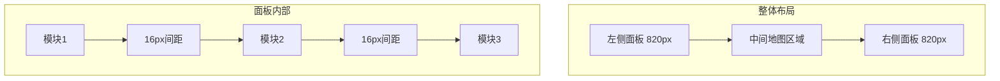
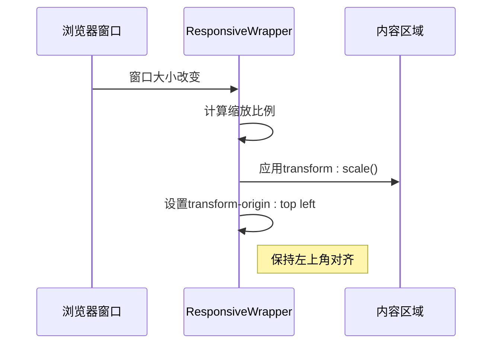

# UI设计系统

<cite>
**本文档引用的文件**
- [SAFETY_MONITORING_MODULE_README.md](file://SAFETY_MONITORING_MODULE_README.md)
- [variables.scss](file://src/assets/styles/variables.scss)
- [base.css](file://src/assets/base.css)
- [main.css](file://src/assets/main.css)
- [ResponsiveWrapper.vue](file://src/components/ResponsiveWrapper.vue)
- [App.vue](file://src/App.vue)
- [leftContent.vue](file://src/views/gasModule/leftContent.vue)
- [rightContent.vue](file://src/views/gasModule/rightContent.vue)
</cite>

## 目录
1. [引言](#引言)
2. [颜色体系](#颜色体系)
3. [布局规范](#布局规范)
4. [SCSS变量与全局样式](#scss变量与全局样式)
5. [玻璃态背景效果](#玻璃态背景效果)
6. [响应式设计](#响应式设计)

## 引言

本UI设计系统文档旨在系统化整理政府dashboard项目的视觉规范，基于`SAFETY_MONITORING_MODULE_README.md`中的设计规范，详细说明颜色体系、布局规范、SCSS变量、全局样式规则以及玻璃态背景和响应式设计的实现方法。该系统为城市安全综合监测预警平台提供统一的视觉语言和开发标准。

**Section sources**
- [SAFETY_MONITORING_MODULE_README.md](file://SAFETY_MONITORING_MODULE_README.md)

## 颜色体系

本项目采用一套明确的颜色体系，用于确保界面的一致性和可识别性。主色调和功能色遵循Ant Design色彩体系，并在设计文档中进行了具体定义。

### 主色调
- **拂晓蓝**: `#1677ff`
- 用于主要按钮、重要信息标识和交互元素的高亮显示
- 在组件中通过`--primary-color` CSS变量和`$primary-color` SCSS变量实现

### 功能色
- **极光绿 (成功色)**: `#52c41a`
  - 用于表示成功状态、正常运行和积极反馈
  - 在组件中通过`--success-color`和`$success-color`变量实现
- **金盏花 (警告色)**: `#faad14`
  - 用于表示警告、需要注意的状态
- **薄暮红 (错误色)**: `#ff4d4f`
  - 用于表示错误、故障和危险状态
- **明蓝 (信息色)**: `#1890ff`
  - 用于表示信息提示和中性状态

### 背景色
- 采用半透明黑色渐变背景，配合毛玻璃效果
- 左侧面板使用从左到右的渐变：`rgba(0, 0, 0, 0.8)` 到 `rgba(0, 0, 0, 0)`
- 右侧面板使用从右到左的渐变：`rgba(0, 0, 0, 0.8)` 到 `rgba(0, 0, 0, 0)`

**Section sources**
- [SAFETY_MONITORING_MODULE_README.md](file://SAFETY_MONITORING_MODULE_README.md#L57-L64)
- [variables.scss](file://src/assets/styles/variables.scss#L4-L13)
- [App.vue](file://src/App.vue#L46-L59)

## 布局规范

本项目采用固定的布局规范，以确保在大屏幕显示设备上的一致性和可读性。

### 基准分辨率
- **4096 x 1920** 作为设计和开发的基准分辨率
- 所有尺寸和间距均基于此分辨率进行设计

### 面板布局
- **左侧面板宽度**: 820px
- **右侧面板宽度**: 820px
- **中间地图区域**: 自适应宽度，填充剩余空间
- 左右面板与地图区域之间通过渐变背景实现平滑过渡

### 间距系统
- **模块间距**: 16px
- 在左右面板内部，各功能模块之间保持16px的垂直间距
- 通过CSS的`gap`属性实现，确保间距一致性



**Diagram sources**
- [SAFETY_MONITORING_MODULE_README.md](file://SAFETY_MONITORING_MODULE_README.md#L66-L71)
- [leftContent.vue](file://src/views/gasModule/leftContent.vue#L26)
- [rightContent.vue](file://src/views/gasModule/rightContent.vue#L26)

## SCSS变量与全局样式

项目通过SCSS变量和全局CSS文件建立了一致的样式系统，确保设计规范的可维护性和可扩展性。

### SCSS变量

在`variables.scss`文件中定义了完整的SCSS变量系统：

#### 颜色变量
- `$primary-color`: 主色调
- `$success-color`: 成功色
- `$warning-color`: 警告色
- `$error-color`: 错误色

#### 间距系统
- `$spacing-xs`: 4px
- `$spacing-sm`: 8px
- `$spacing-md`: 16px (模块间距)
- `$spacing-lg`: 24px
- `$spacing-xl`: 32px

#### 字体大小
- `$font-size-xs`: 12px
- `$font-size-sm`: 14px
- `$font-size-md`: 16px
- `$font-size-lg`: 18px
- `$font-size-xl`: 20px

#### 圆角
- `$border-radius-sm`: 4px
- `$border-radius-md`: 6px
- `$border-radius-lg`: 8px

#### 混入函数
- `@mixin flex-center`: 居中对齐的flex布局
- `@mixin flex-between`: 两端对齐的flex布局
- `@mixin text-ellipsis`: 文本溢出省略
- `@mixin transition`: 过渡动画
- `@mixin respond-to`: 响应式媒体查询

### 全局样式规则

在`base.css`和`main.css`中定义了全局样式规则：

#### 基础重置
- 所有元素`box-sizing: border-box`
- 移除默认的margin和padding
- 统一字体家族和行高

#### 字体设置
- 主要字体: 'Microsoft YaHei'
- 备用字体: Inter, -apple-system, BlinkMacSystemFont等
- 根据屏幕宽度动态调整根字体大小：
  - 3840px及以上: 18px
  - 2560px-3839px: 16px
  - 2559px及以下: 14px

#### 全局类
- `.gradient-text`: 实现文字渐变效果
- 使用`-webkit-background-clip: text`和`background-clip: text`实现

**Section sources**
- [variables.scss](file://src/assets/styles/variables.scss)
- [base.css](file://src/assets/base.css)
- [main.css](file://src/assets/main.css)

## 玻璃态背景效果

项目采用现代的玻璃态（Glassmorphism）设计风格，通过半透明背景和模糊效果创造层次感和现代感。

### 实现方法

玻璃态效果主要通过以下CSS属性实现：

```css
.glass-effect {
  background: linear-gradient(270deg, rgba(8, 46, 77, 0.4) 0%, rgba(0, 0, 0, 0.4) 100%);
  backdrop-filter: blur(30px);
  border: 1px solid rgba(22, 119, 255, 0.2);
  box-shadow: 0 8px 32px rgba(0, 0, 0, 0.2);
}
```

### 关键属性

- **backdrop-filter**: `blur(10px)` 或 `blur(30px)`
  - 对元素背后的内容进行模糊处理
  - 是实现玻璃态效果的核心属性
- **背景渐变**: 半透明的线性渐变
  - 通常使用`rgba(0, 0, 0, 0.4)`到`rgba(0, 0, 0, 0.8)`的渐变
  - 增强层次感和深度
- **边框**: 细的半透明边框
  - 使用主色调的半透明版本
  - 如`rgba(22, 119, 255, 0.2)`
- **阴影**: 柔和的投影
  - 增强立体感
  - 使用`rgba(0, 0, 0, 0.2)`到`rgba(0, 0, 0, 0.3)`的阴影

### 应用场景

- 左右面板的整体背景
- 各功能模块的容器
- 弹出对话框和面板
- 滚动条的视觉增强

**Section sources**
- [App.vue](file://src/App.vue#L68-L72)
- [ResponsiveWrapper.vue](file://src/components/ResponsiveWrapper.vue#L171-L173)
- [StationListPanel.vue](file://src/views/gasModule/components/map/StationListPanel.vue#L348-L351)

## 响应式设计

项目采用基于缩放的响应式设计策略，确保在不同分辨率的大屏幕上都能获得最佳的显示效果。

### ResponsiveWrapper组件

核心实现是`ResponsiveWrapper.vue`组件，它通过动态缩放来适配不同分辨率。

#### 工作原理
1. 以4096x1920为基准分辨率
2. 计算当前屏幕尺寸与基准尺寸的比例
3. 使用CSS `transform: scale()`对内容进行缩放
4. 保持原始设计的比例和布局

#### 配置选项
- `baseWidth`: 基准宽度，默认4096
- `baseHeight`: 基准高度，默认1920
- `minScale`: 最小缩放比例，默认0.1
- `maxScale`: 最大缩放比例，默认3

#### 缩放模式
- **按宽度缩放**: `scale = windowWidth / baseWidth`
- **按高度缩放**: `scale = windowHeight / baseHeight`
- 可通过URL参数`showStyle=width`或`showStyle=height`控制

### 实现细节



### 交互处理

由于缩放会影响鼠标事件坐标，组件通过以下方式解决：

- 外层容器设置`pointer-events: none`
- 交互元素使用`:deep()`选择器恢复`pointer-events: auto`
- 支持的交互元素包括：
  - `.header`
  - `.left-content`
  - `.right-content`
  - `.map-toolbar`
  - `.sidebar-module`
  - `.login-card`

### 性能优化

- 使用`debounce`函数防抖，避免频繁重计算
- `will-change: transform`提示浏览器优化
- 通过`provide`向子组件提供缩放比例

**Section sources**
- [ResponsiveWrapper.vue](file://src/components/ResponsiveWrapper.vue)
- [CODEBUDDY.md](file://CODEBUDDY.md#L320-L322)