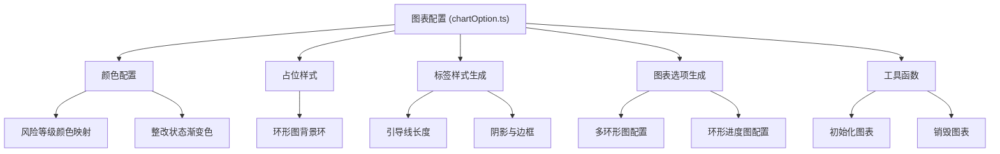
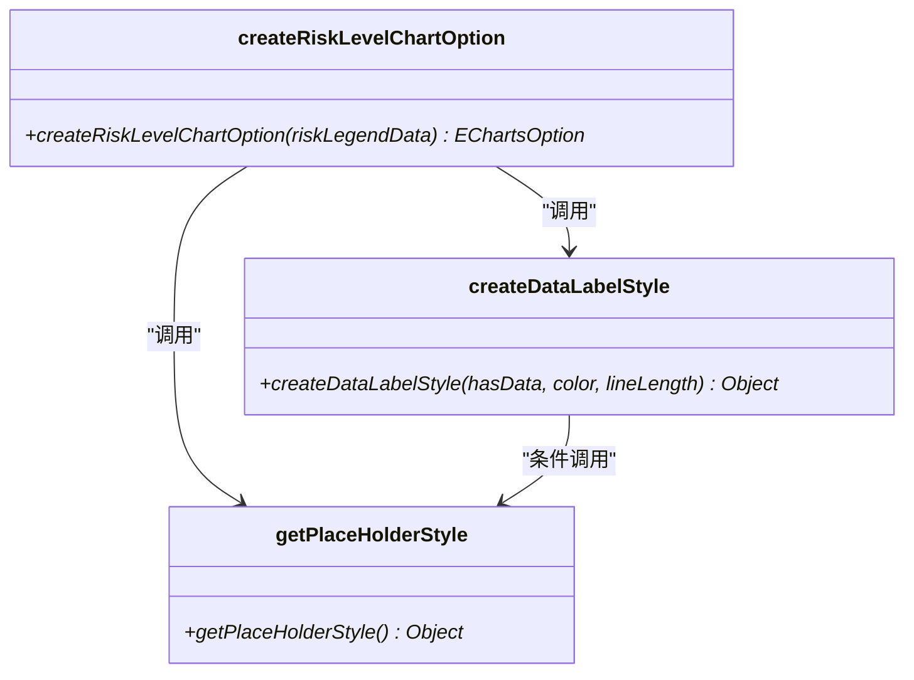
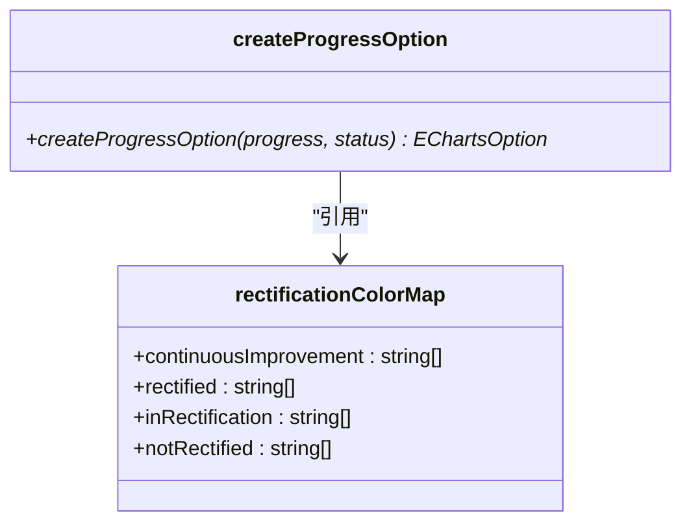
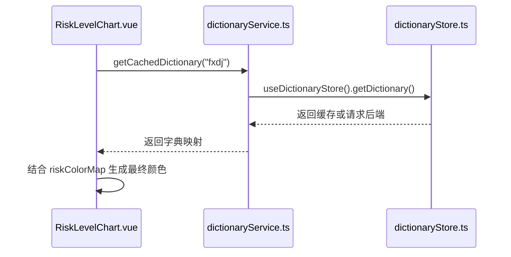
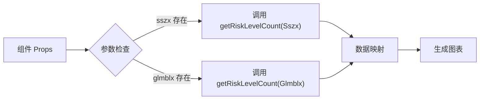

# 图表配置标准化

<cite>
**本文档引用文件**  
- [chartOption.ts](file://src/views/BridgeModule/chartOption.ts)
- [chartOption.ts](file://src/views/GasModule/chartOption.ts)
- [RiskLevelChart.vue](file://src/components/RiskLevelChart.vue)
- [waterSupplyService.ts](file://src/services/waterSupplyService.ts)
- [dictionaryService.ts](file://src/services/dictionaryService.ts)
</cite>

## 目录
1. [引言](#引言)
2. [图表配置结构](#图表配置结构)
3. [核心图表类型](#核心图表类型)
4. [颜色与样式规范](#颜色与样式规范)
5. [数据处理与映射](#数据处理与映射)
6. [组件集成与使用](#组件集成与使用)
7. [最佳实践与维护](#最佳实践与维护)

## 引言

本项目为“安全综合检测预警平台”，旨在通过可视化手段对城市基础设施（如桥梁、燃气、供水等）进行风险监测与预警。系统采用 Vue 3 + Pinia + ECharts 技术栈，结合 Cesium 实现三维地理信息展示。其中，图表作为核心数据呈现方式，其配置的标准化对于保证视觉一致性、提升开发效率、降低维护成本具有重要意义。

通过对桥梁模块和燃气模块中 `chartOption.ts` 文件的分析，发现两者采用了完全一致的图表配置结构与样式定义，体现了良好的模块化设计思想。本文档将基于现有实现，提炼出一套可复用的图表配置标准化方案。

## 图表配置结构

项目中的图表配置集中管理于各业务模块下的 `chartOption.ts` 文件中，采用模块化导出方式，包含颜色映射、占位样式、图表生成函数及工具方法。



**图表来源**  
- [chartOption.ts](file://src/views/BridgeModule/chartOption.ts)
- [chartOption.ts](file://src/views/GasModule/chartOption.ts)

**本节来源**  
- [chartOption.ts](file://src/views/BridgeModule/chartOption.ts#L1-L217)
- [chartOption.ts](file://src/views/GasModule/chartOption.ts#L1-L217)

## 核心图表类型

### 风险等级多环形图

该图表用于展示不同风险等级（重大、较大、一般、低）的数量分布，采用嵌套环形图形式，外环为实际数据，内环为透明占位，形成“圆环进度”视觉效果。



**图表来源**  
- [chartOption.ts](file://src/views/BridgeModule/chartOption.ts#L78-L118)
- [chartOption.ts](file://src/views/GasModule/chartOption.ts#L78-L118)

### 整改状态环形进度图

该图表用于展示隐患整改的完成进度，采用单环形图，通过渐变色填充表示完成比例，中心显示百分比数值，直观反映整改状态。



**图表来源**  
- [chartOption.ts](file://src/views/BridgeModule/chartOption.ts#L136-L195)
- [chartOption.ts](file://src/views/GasModule/chartOption.ts#L136-L195)

## 颜色与样式规范

### 风险等级颜色映射

统一定义了四类风险等级的颜色，确保跨模块视觉一致性。

| 风险等级 | 颜色值       | 说明     |
|----------|--------------|----------|
| 重大风险 | `#E88D6B`    | 橙红色   |
| 较大风险 | `#F4D982`    | 淡黄色   |
| 一般风险 | `#61E29D`    | 绿色     |
| 低风险   | `#9bb8c7`    | 蓝灰色   |

**本节来源**  
- [chartOption.ts](file://src/views/BridgeModule/chartOption.ts#L11-L16)
- [chartOption.ts](file://src/views/GasModule/chartOption.ts#L11-L16)

### 整改状态渐变色

根据不同整改状态定义了渐变色方案，增强状态识别度。

| 状态           | 渐变起始色 | 渐变结束色 | 说明         |
|----------------|------------|------------|--------------|
| 持续改进       | `#10ADC0`  | `#FFFFFF`  | 蓝白渐变     |
| 已整改         | `#FFF407`  | `#3FFEFD`  | 黄绿渐变     |
| 整改中         | `#CDAB06`  | `#FFFEED`  | 深黄到浅黄   |
| 未整改         | `#FEAC04`  | `#F75E04`  | 橙红渐变     |

**本节来源**  
- [chartOption.ts](file://src/views/BridgeModule/chartOption.ts#L124-L129)
- [chartOption.ts](file://src/views/GasModule/chartOption.ts#L124-L129)

### 占位样式配置

定义了环形图背景环的统一样式，用于在无数据时保持图表结构完整。

```typescript
{
  label: { show: false },
  labelLine: { show: false },
  itemStyle: {
    color: "rgba(29, 57, 64, 0.5)",
    borderColor: "rgba(29, 57, 64, 0.8)",
    borderWidth: 8,
  },
  emphasis: { disabled: true }
}
```

**本节来源**  
- [chartOption.ts](file://src/views/BridgeModule/chartOption.ts#L22-L31)
- [chartOption.ts](file://src/views/GasModule/chartOption.ts#L22-L31)

## 数据处理与映射

### 风险等级字典映射

通过 `dictionaryService.ts` 获取后端字典数据，并与前端颜色配置进行映射，确保数据与展示分离。



**图表来源**  
- [dictionaryService.ts](file://src/services/dictionaryService.ts#L15-L18)

**本节来源**  
- [RiskLevelChart.vue](file://src/components/RiskLevelChart.vue#L76-L96)
- [dictionaryService.ts](file://src/services/dictionaryService.ts#L15-L18)

### 动态数据适配

`RiskLevelChart.vue` 组件通过 `props` 接收 `sszx` 或 `glmblx` 参数，动态调用 `waterSupplyService.ts` 中的 `getRiskLevelCount` 方法获取数据，并自动适配风险等级名称与颜色。



**本节来源**  
- [RiskLevelChart.vue](file://src/components/RiskLevelChart.vue#L103-L144)
- [waterSupplyService.ts](file://src/services/waterSupplyService.ts#L160-L170)

## 组件集成与使用

`RiskLevelChart.vue` 是一个可复用的图表组件，通过 `props` 配置数据源，通过 `emits` 暴露数据加载事件，并通过 `defineExpose` 提供 `refresh` 方法供父组件调用。

### 关键 Props

| 属性名   | 类型   | 默认值     | 说明                     |
|----------|--------|------------|--------------------------|
| chartId  | string | risk-chart | 图表容器唯一ID           |
| sszx     | string | ""         | 城市安全中心标识         |
| glmblx   | string | ""         | 管理目标类型（与sszx二选一） |

### 暴露方法

- `refresh()`: 重新获取数据并刷新图表。

**本节来源**  
- [RiskLevelChart.vue](file://src/components/RiskLevelChart.vue#L26-L39)
- [RiskLevelChart.vue](file://src/components/RiskLevelChart.vue#L275-L284)

## 最佳实践与维护

1. **配置集中化**：将图表配置独立为 `chartOption.ts`，避免在组件内硬编码样式。
2. **样式可复用**：通过函数生成标签样式，支持动态引导线长度与颜色。
3. **数据与视图分离**：通过字典服务获取风险等级名称，前端仅负责颜色映射。
4. **空状态处理**：当无数据时，展示占位环，保持 UI 一致性。
5. **性能优化**：图表实例在组件卸载时销毁，避免内存泄漏。
6. **跨模块复用**：桥梁与燃气模块共享相同图表配置结构，便于统一维护。

建议将 `chartOption.ts` 中的通用配置提取至 `src/config/` 目录下，形成全局图表配置库，供所有业务模块引用，进一步提升标准化程度。

**本节来源**  
- [chartOption.ts](file://src/views/BridgeModule/chartOption.ts)
- [RiskLevelChart.vue](file://src/components/RiskLevelChart.vue)
- [waterSupplyService.ts](file://src/services/waterSupplyService.ts)
- [dictionaryService.ts](file://src/services/dictionaryService.ts)