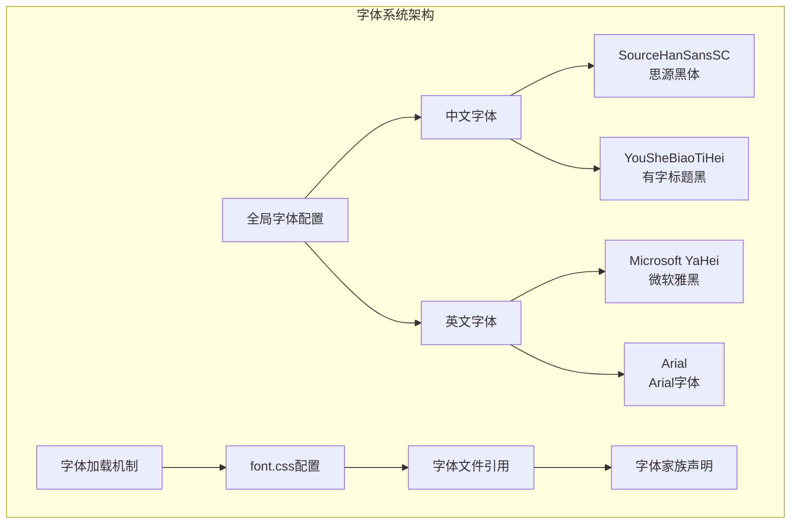
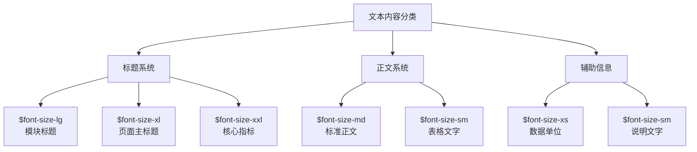
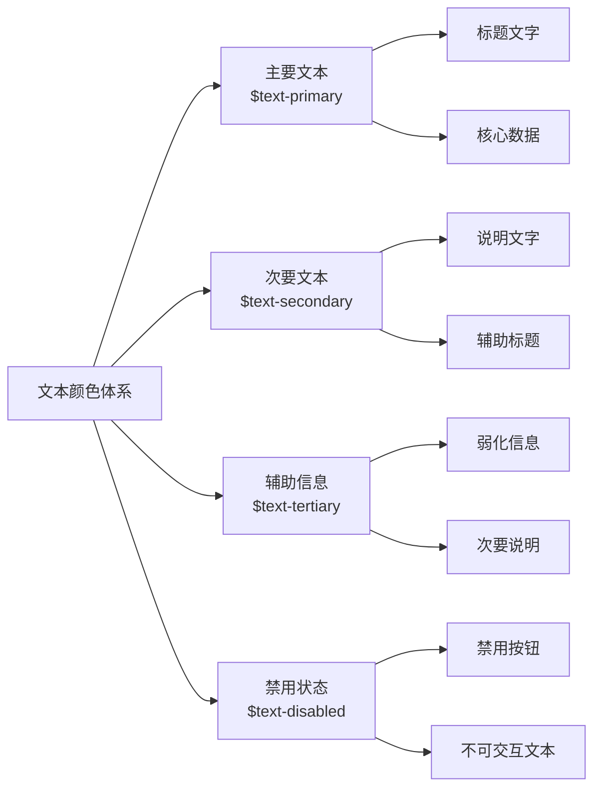
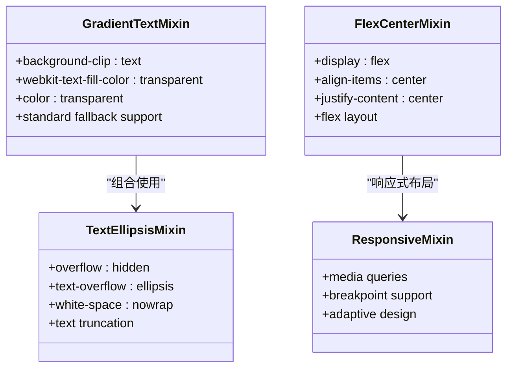
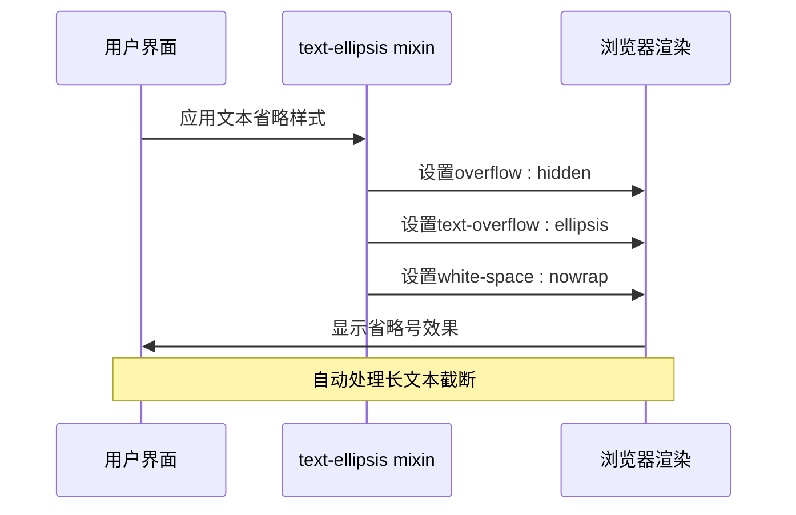
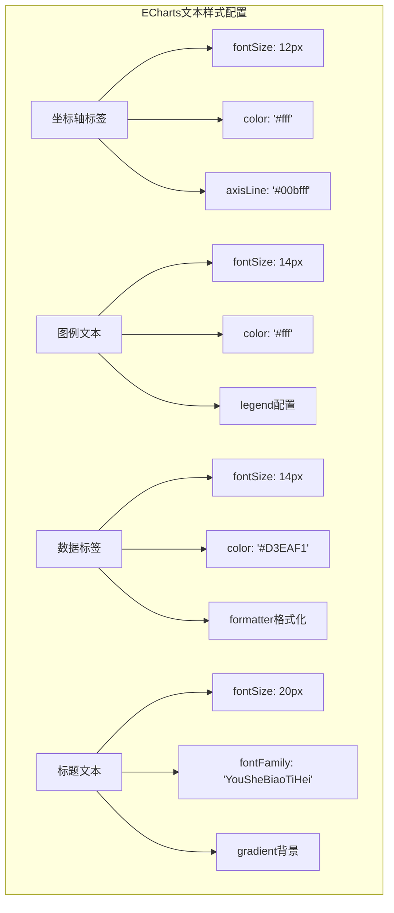
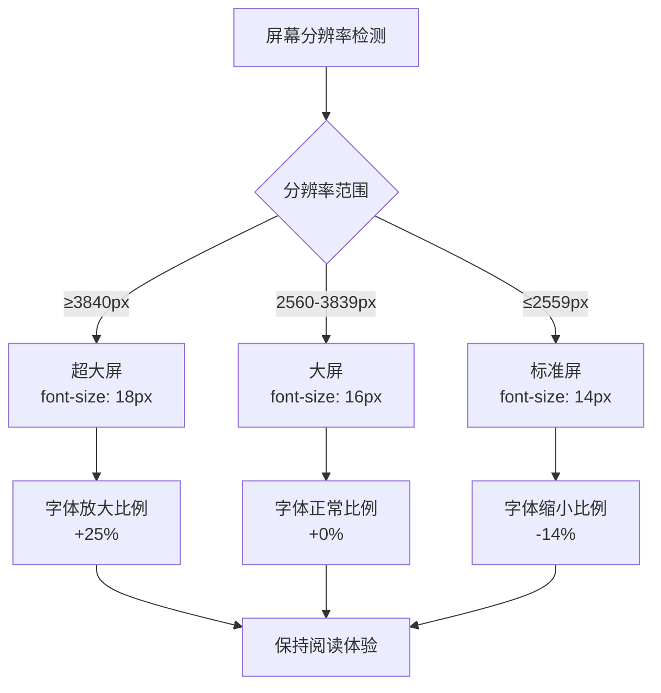

# 字体与文本样式

<cite>
**本文档引用的文件**
- [variables.scss](file://src/assets/styles/variables.scss)
- [font.css](file://src/assets/font/font.css)
- [main.css](file://src/assets/main.css)
- [base.css](file://src/assets/base.css)
- [DashboardHeader.vue](file://src/components/DashboardHeader.vue)
- [RiskHazardModule.vue](file://src/views/WaterSupply/components/RiskHazardModule.vue)
- [OverviewModule.vue](file://src/views/WaterSupply/components/OverviewModule.vue)
- [ehcartsOptions.ts](file://src/views/WaterSupply/components/ehcartsOptions.ts)
</cite>

## 目录
1. [项目概述](#项目概述)
2. [字体系统架构](#字体系统架构)
3. [字体大小层级](#字体大小层级)
4. [文本颜色体系](#文本颜色体系)
5. [字体混合模式](#字体混合模式)
6. [文本处理工具](#文本处理工具)
7. [ECharts图表文本样式](#echarts图表文本样式)
8. [响应式字体设计](#响应式字体设计)
9. [最佳实践指南](#最佳实践指南)
10. [总结](#总结)

## 项目概述

本政府仪表盘项目采用了一套完整的字体与文本样式系统，专为大屏展示和政府业务场景设计。系统基于SCSS变量构建，提供了统一的字体规范、颜色体系和文本处理功能，确保界面的专业性和一致性。

## 字体系统架构

### 字体文件结构

项目采用了双字体策略，结合中文字体和英文字体，确保在不同语言环境下的最佳显示效果：

**图表来源**
- [font.css](file://src/assets/font/font.css#L1-L14)
- [main.css](file://src/assets/main.css#L14-L14)

### 字体加载配置

系统通过CSS @font-face规则实现了字体的本地化加载，支持多种字体格式以确保跨浏览器兼容性：

**章节来源**
- [font.css](file://src/assets/font/font.css#L1-L14)

## 字体大小层级

### 标准字号定义

项目建立了从12px到24px的完整字号层级体系，每个尺寸都有明确的应用场景：

| 字号变量 | 实际大小 | 应用场景 | 示例用途 |
|---------|---------|----------|----------|
| `$font-size-xs` | 12px | 辅助信息、小标签 | 数据单元、次要说明 |
| `$font-size-sm` | 14px | 正文内容、表格文字 | 表格数据、列表项 |
| `$font-size-md` | 16px | 标准正文、段落 | 页面主体内容 |
| `$font-size-lg` | 18px | 标题文字、重要信息 | 模块标题、关键数据 |
| `$font-size-xl` | 20px | 大标题、强调文字 | 页面主标题、重要提示 |
| `$font-size-xxl` | 24px | 超大标题、数据展示 | 数据统计、核心指标 |

### 字号应用场景

**图表来源**
- [variables.scss](file://src/assets/styles/variables.scss#L69-L75)

**章节来源**
- [variables.scss](file://src/assets/styles/variables.scss#L69-L75)

## 文本颜色体系

### 颜色变量定义

项目采用分级的颜色体系，基于语义化的颜色变量名，确保文本颜色的一致性和可维护性：

| 颜色变量 | RGBA值 | 使用场景 | 视觉权重 |
|---------|--------|----------|----------|
| `$text-primary` | rgba(0, 0, 0, 0.88) | 主要文本、标题 | 最高 |
| `$text-secondary` | rgba(0, 0, 0, 0.65) | 次要文本、说明 | 高 |
| `$text-tertiary` | rgba(0, 0, 0, 0.45) | 辅助信息、弱化文本 | 中等 |
| `$text-disabled` | rgba(0, 0, 0, 0.25) | 禁用状态、不可交互 | 最低 |

### 颜色使用规范

**图表来源**
- [variables.scss](file://src/assets/styles/variables.scss#L50-L53)

**章节来源**
- [variables.scss](file://src/assets/styles/variables.scss#L50-L53)

## 字体混合模式

### 渐变文字效果

项目实现了强大的渐变文字效果，通过`.gradient-text`类和自定义mixins提供丰富的视觉表现：

**图表来源**
- [variables.scss](file://src/assets/styles/variables.scss#L120-L126)
- [variables.scss](file://src/assets/styles/variables.scss#L111-L115)

### 渐变文字实现原理

渐变文字效果通过CSS多重背景和文本填充技术实现：

**章节来源**
- [variables.scss](file://src/assets/styles/variables.scss#L120-L126)
- [DashboardHeader.vue](file://src/components/DashboardHeader.vue#L193-L208)

## 文本处理工具

### 文本省略处理

`text-ellipsis` mixin提供了优雅的文本截断解决方案，适用于各种容器环境：

**图表来源**
- [variables.scss](file://src/assets/styles/variables.scss#L111-L115)

### 文本处理应用场景

文本省略功能广泛应用于以下场景：
- 导航菜单项过长时的自动截断
- 数据表格中列宽受限的文本显示
- 卡片式布局中的标题文本处理
- 弹窗和对话框中的长内容显示

**章节来源**
- [variables.scss](file://src/assets/styles/variables.scss#L111-L115)

## ECharts图表文本样式

### 图表文本配置系统

项目为ECharts图表专门设计了完整的文本样式配置，确保图表信息的清晰传达：

**图表来源**
- [ehcartsOptions.ts](file://src/views/WaterSupply/components/ehcartsOptions.ts#L247-L248)
- [ehcartsOptions.ts](file://src/views/WaterSupply/components/ehcartsOptions.ts#L267-L268)

### 图表文本样式配置

项目在多个ECharts配置中展示了文本样式的具体应用：

**章节来源**
- [ehcartsOptions.ts](file://src/views/WaterSupply/components/ehcartsOptions.ts#L247-L248)
- [ehcartsOptions.ts](file://src/views/WaterSupply/components/ehcartsOptions.ts#L267-L268)

## 响应式字体设计

### 大屏适配策略

系统针对不同分辨率的大屏设备实现了智能的字体适配：

**图表来源**
- [main.css](file://src/assets/main.css#L33-L48)

### 响应式字体配置

系统通过媒体查询实现了基于屏幕尺寸的字体动态调整：

**章节来源**
- [main.css](file://src/assets/main.css#L33-L48)

## 最佳实践指南

### 字体选择原则

1. **中英混排优化**：优先使用支持中文字体的英文字体
2. **可读性优先**：在保证美观的同时确保信息传达效率
3. **品牌一致性**：统一使用项目指定的字体家族
4. **性能考虑**：合理控制字体文件大小和数量

### 文本样式应用规范

1. **标题层级清晰**：严格按照字号层级使用，避免混乱
2. **颜色对比度**：确保文本与背景的对比度符合可访问性标准
3. **渐变效果适度**：渐变文字仅用于强调和视觉焦点
4. **省略处理优雅**：在需要时使用省略效果，避免信息丢失

### 开发建议

1. **变量优先**：优先使用SCSS变量而非硬编码值
2. **组件复用**：将通用的文本样式封装为可复用的组件
3. **测试覆盖**：在不同设备和浏览器上测试字体显示效果
4. **文档维护**：及时更新字体使用规范和示例

## 总结

本政府仪表盘项目的字体与文本样式系统体现了专业级的设计理念：

- **系统性**：建立了完整的字体大小、颜色和处理工具体系
- **一致性**：通过变量和mixins确保全项目风格统一
- **专业性**：针对政府业务场景优化的字体选择和配置
- **可维护性**：模块化的架构便于扩展和维护

这套字体系统不仅满足了当前项目的需求，更为未来的功能扩展和界面优化奠定了坚实的基础。通过合理的字体管理和样式规范，确保了政府仪表盘界面的专业性和用户体验的优秀表现。