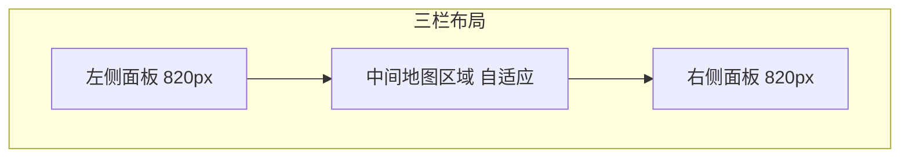
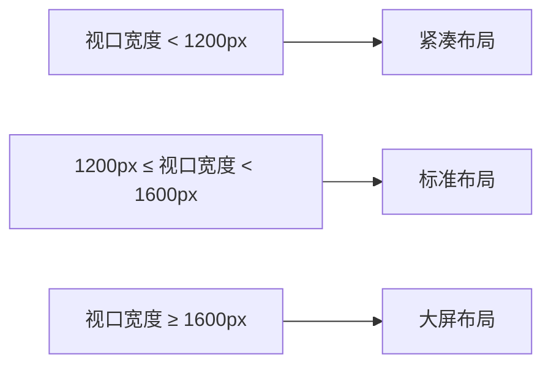
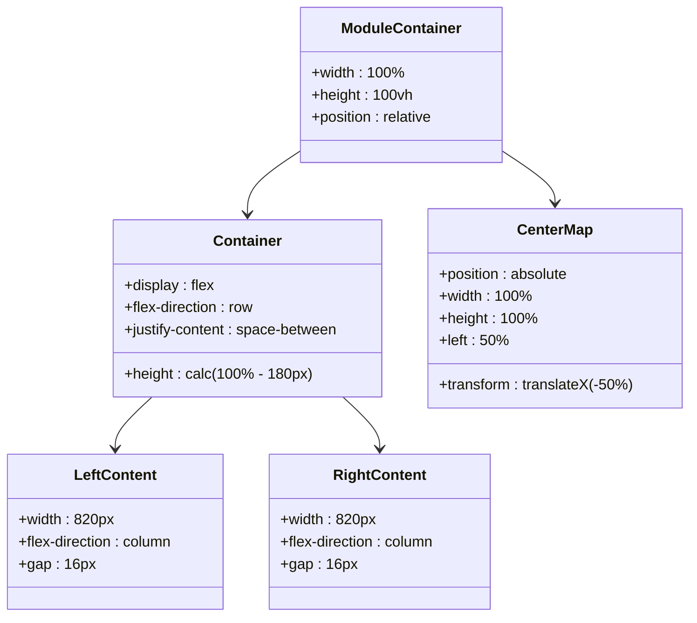

# 布局规范

<cite>
**本文档引用文件**  
- [SAFETY_MONITORING_MODULE_README.md](file://SAFETY_MONITORING_MODULE_README.md)
- [variables.scss](file://src/assets/styles/variables.scss)
- [ResponsiveWrapper.vue](file://src/components/ResponsiveWrapper.vue)
- [App.vue](file://src/App.vue)
- [gasModule/leftContent.vue](file://src/views/gasModule/leftContent.vue)
- [gasModule/rightContent.vue](file://src/views/gasModule/rightContent.vue)
- [gasModule/index.vue](file://src/views/gasModule/index.vue)
</cite>

## 目录
1. [引言](#引言)
2. [三栏布局设计](#三栏布局设计)
3. [模块间距规范](#模块间距规范)
4. [响应式断点策略](#响应式断点策略)
5. [布局容器实现](#布局容器实现)
6. [视觉一致性考量](#视觉一致性考量)

## 引言

本规范文档系统化描述政府dashboard项目的整体布局架构。基于SAFETY_MONITORING_MODULE_README.md中规定的4096x1920基准分辨率，详细说明左侧820px、右侧820px面板与中间自适应地图区域的三栏布局设计。文档涵盖模块间距、响应式断点、SCSS变量应用及布局容器实现等关键设计要素。

**Section sources**
- [SAFETY_MONITORING_MODULE_README.md](file://SAFETY_MONITORING_MODULE_README.md#L66-L70)

## 三栏布局设计

项目采用三栏布局架构，以4096x1920为基准分辨率，确保在大屏显示设备上的最佳视觉效果。布局由左侧固定宽度面板、右侧固定宽度面板和中间自适应地图区域组成。

左侧和右侧面板宽度均为820px，为数据展示模块提供充足空间。中间地图区域采用自适应设计，其宽度根据视口尺寸动态调整，确保地图内容始终占据可用空间。

该布局通过ResponsiveWrapper组件实现缩放适配，确保在不同分辨率下保持一致的视觉比例。地图区域使用绝对定位，覆盖整个背景，而左右面板则通过flex布局进行组织。

**Diagram sources**
- [SAFETY_MONITORING_MODULE_README.md](file://SAFETY_MONITORING_MODULE_README.md#L66-L70)
- [gasModule/index.vue](file://src/views/gasModule/index.vue#L5-L7)
- [App.vue](file://src/App.vue#L143-L153)

**Section sources**
- [SAFETY_MONITORING_MODULE_README.md](file://SAFETY_MONITORING_MODULE_README.md#L66-L70)
- [gasModule/index.vue](file://src/views/gasModule/index.vue#L5-L7)

## 模块间距规范

项目采用统一的模块间距规范，所有相邻模块之间的垂直间距为16px，对应SCSS变量$spacing-md。这一间距标准在variables.scss中定义，确保在整个项目中的一致性。

间距规范通过CSS的gap属性实现，应用于左右面板的flex容器中。这种设计确保了模块间的视觉节奏统一，避免了布局的拥挤或松散。

16px的间距选择基于设计系统中的间距层级，平衡了信息密度和可读性，特别适合大屏数据可视化场景。

**Section sources**
- [variables.scss](file://src/assets/styles/variables.scss#L64)
- [gasModule/leftContent.vue](file://src/views/gasModule/leftContent.vue#L26)
- [gasModule/rightContent.vue](file://src/views/gasModule/rightContent.vue#L26)

## 响应式断点策略

项目通过SCSS变量和混入实现响应式断点适配。variables.scss中定义了从$breakpoint-xs到$breakpoint-xxl的完整断点系统，其中关键断点为$breakpoint-xl(1200px)和$breakpoint-xxl(1600px)。

响应式策略采用移动优先原则，通过@respond-to混入函数封装媒体查询。当视口宽度小于xl断点(1200px)时，布局开始调整；当达到xxl断点(1600px)及以上时，启用完整的大屏布局。

ResponsiveWrapper组件是响应式实现的核心，它根据视口尺寸动态计算缩放比例，确保内容在不同设备上保持适当的显示比例。

**Diagram sources**
- [variables.scss](file://src/assets/styles/variables.scss#L89-L94)
- [ResponsiveWrapper.vue](file://src/components/ResponsiveWrapper.vue#L67-L85)

**Section sources**
- [variables.scss](file://src/assets/styles/variables.scss#L89-L94)
- [ResponsiveWrapper.vue](file://src/components/ResponsiveWrapper.vue#L67-L85)

## 布局容器实现

布局容器通过多个CSS类协同实现。.module-container作为最外层容器，采用相对定位并占据完整视口。.container作为主体容器，使用flex布局组织左右面板。

左右面板分别通过.left-content和.right-content类实现，宽度固定为820px，采用flex-direction: column布局内部模块。中间地图区域通过.center-map类实现，使用绝对定位覆盖背景。

ResponsiveWrapper组件通过transform: scale实现内容缩放，同时通过pointer-events控制确保交互元素的可操作性。

**Diagram sources**
- [App.vue](file://src/App.vue#L125-L159)
- [gasModule/leftContent.vue](file://src/views/gasModule/leftContent.vue#L20-L31)
- [gasModule/rightContent.vue](file://src/views/gasModule/rightContent.vue#L20-L31)

**Section sources**
- [App.vue](file://src/App.vue#L36-L61)
- [gasModule/leftContent.vue](file://src/views/gasModule/leftContent.vue#L20-L31)

## 视觉一致性考量

为确保在不同分辨率下保持视觉一致性，项目采用多种设计策略。首先，通过ResponsiveWrapper组件的缩放机制，确保内容比例一致。其次，使用相对单位和弹性布局，使内容能够自然适应不同屏幕尺寸。

颜色体系和字体层级在整个项目中保持统一，遵循Ant Design色彩体系。背景采用半透明黑色渐变和毛玻璃效果，增强视觉层次感。

对于大屏显示，特别优化了字体大小和元素间距，确保远距离观看的可读性。同时，通过CSS变量集中管理设计令牌，确保主题一致性。

**Section sources**
- [SAFETY_MONITORING_MODULE_README.md](file://SAFETY_MONITORING_MODULE_README.md#L57-L63)
- [variables.scss](file://src/assets/styles/variables.scss#L2-L41)
- [App.vue](file://src/App.vue#L69-L82)