# 组件样式规范

<cite>
**本文档中引用的文件**
- [variables.scss](file://src/assets/styles/variables.scss)
- [base.css](file://src/assets/base.css)
- [main.css](file://src/assets/main.css)
- [DashboardHeader.vue](file://src/components/DashboardHeader.vue)
- [App.vue](file://src/App.vue)
- [MapToolbar.vue](file://src/mapComponents/MapToolbar.vue)
- [OverviewModule.vue](file://src/views/WaterSupply/components/OverviewModule.vue)
- [EarlyWarningModule.vue](file://src/views/WaterSupply/components/EarlyWarningModule.vue)
- [leftContent.vue](file://src/views/WaterSupply/leftContent.vue)
</cite>

## 目录
1. [概述](#概述)
2. [核心变量系统](#核心变量系统)
3. [圆角规范](#圆角规范)
4. [过渡动画规范](#过渡动画规范)
5. [阴影系统](#阴影系统)
6. [背景效果规范](#背景效果规范)
7. [组件样式实现](#组件样式实现)
8. [玻璃态背景效果](#玻璃态背景效果)
9. [实际应用案例](#实际应用案例)
10. [最佳实践指南](#最佳实践指南)

## 概述

本规范文档详细说明了政府仪表板项目中通用UI组件的视觉设计规则。基于项目的核心样式架构，包括variables.scss中的圆角和过渡变量定义，以及base.css中的全局样式规则，为开发者提供了统一的视觉设计指导原则。

## 核心变量系统

### 色彩体系

项目采用Ant Design色彩体系作为基础，定义了主色调、功能色和中性色的完整体系：

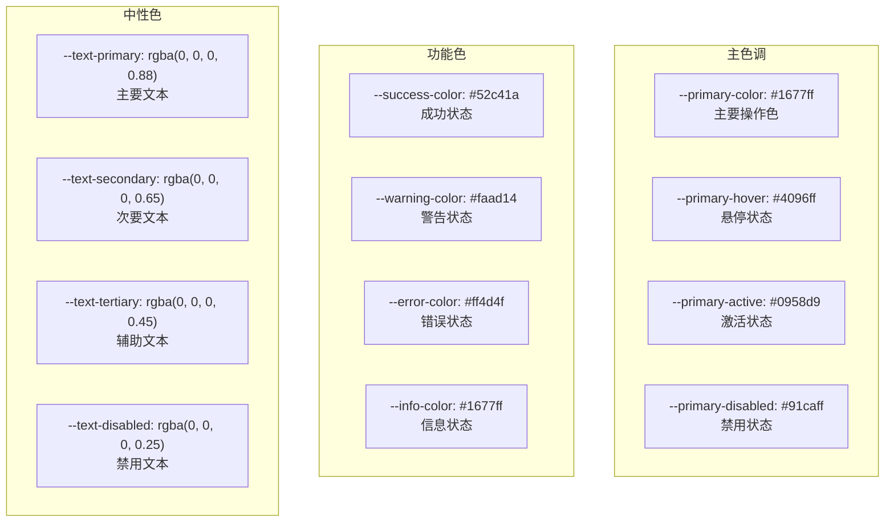

**图表来源**
- [variables.scss](file://src/assets/styles/variables.scss#L4-L25)

### 边框与分割线

| 变量名 | 值 | 用途 |
|--------|-----|------|
| `--border-primary` | `#d9d9d9` | 主要边框颜色 |
| `--border-secondary` | `#f0f0f0` | 次要边框颜色 |
| `--divider` | `rgba(5, 5, 5, 0.06)` | 分割线颜色 |

### 背景色彩

| 变量名 | 值 | 用途 |
|--------|-----|------|
| `--bg-layout` | `#f5f5f5` | 布局背景色 |
| `--bg-container` | `#ffffff` | 容器背景色 |
| `--bg-elevated` | `#ffffff` | 浮层背景色 |

**节来源**
- [variables.scss](file://src/assets/styles/variables.scss#L1-L60)
- [base.css](file://src/assets/base.css#L25-L50)

## 圆角规范

项目定义了四个级别的圆角半径，对应不同的组件层级和使用场景：

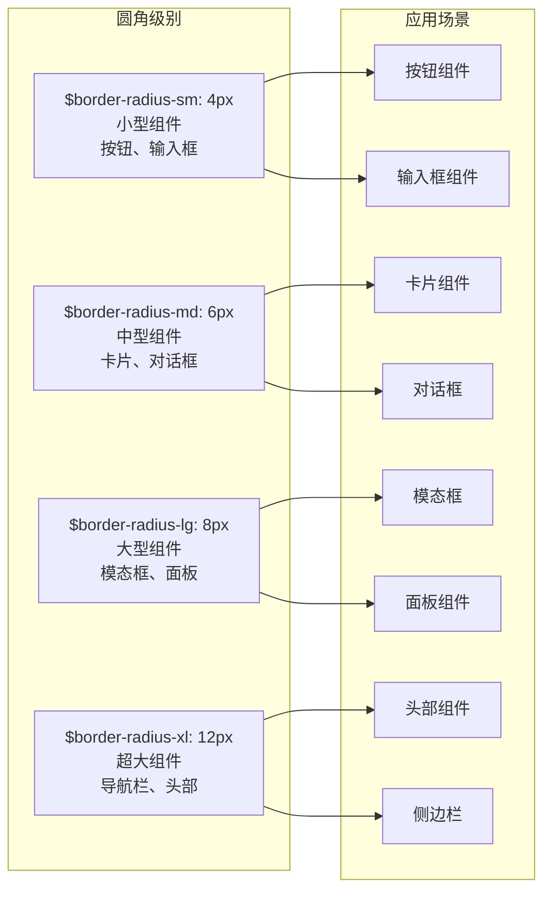

**图表来源**
- [variables.scss](file://src/assets/styles/variables.scss#L78-L81)

### 圆角应用规范

| 组件类型 | 推荐圆角 | 使用场景 |
|----------|----------|----------|
| 按钮 | `$border-radius-sm` (4px) | 所有按钮组件 |
| 输入框 | `$border-radius-sm` (4px) | 文本输入、选择器 |
| 卡片 | `$border-radius-md` (6px) | 数据展示卡片 |
| 对话框 | `$border-radius-lg` (8px) | 弹窗对话框 |
| 模态框 | `$border-radius-lg` (8px) | 页面级弹窗 |
| 导航栏 | `$border-radius-xl` (12px) | 顶部导航条 |

**节来源**
- [variables.scss](file://src/assets/styles/variables.scss#L78-L81)

## 过渡动画规范

项目定义了三个级别的动画时长，确保界面交互的流畅性和一致性：

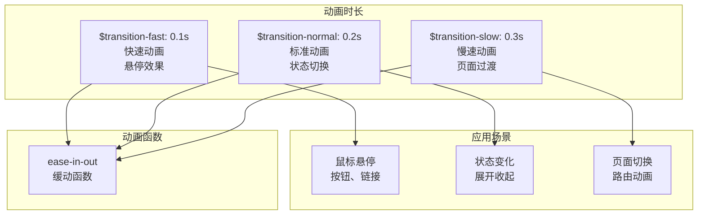

**图表来源**
- [variables.scss](file://src/assets/styles/variables.scss#L84-L86)

### 动画应用规范

| 动画类型 | 时长 | 缓动函数 | 使用场景 |
|----------|------|----------|----------|
| 悬停效果 | `$transition-fast` (0.1s) | ease-in-out | 鼠标悬停、按钮激活 |
| 状态切换 | `$transition-normal` (0.2s) | ease-in-out | 展开收起、显示隐藏 |
| 页面过渡 | `$transition-slow` (0.3s) | ease-in-out | 路由切换、模态框打开 |
| 表单验证 | `$transition-fast` (0.1s) | ease-in-out | 错误提示、成功反馈 |

**节来源**
- [variables.scss](file://src/assets/styles/variables.scss#L84-L86)

## 阴影系统

项目采用分层阴影系统，为不同层级的组件提供适当的视觉深度：

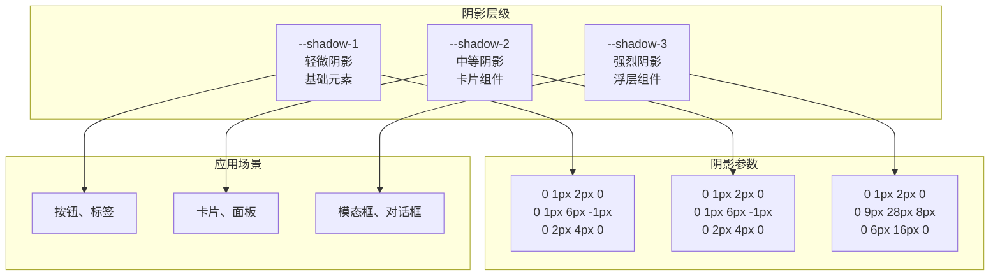

**图表来源**
- [variables.scss](file://src/assets/styles/variables.scss#L32-L40)

### 阴影应用规范

| 阴影层级 | 适用组件 | 视觉效果 |
|----------|----------|----------|
| `--shadow-1` | 基础元素 | 轻微立体感 |
| `--shadow-2` | 卡片组件 | 中等立体感 |
| `--shadow-3` | 浮层组件 | 明显立体感 |

**节来源**
- [variables.scss](file://src/assets/styles/variables.scss#L32-L40)

## 背景效果规范

### 渐变文字效果

项目实现了渐变文字效果，通过CSS混合属性实现文字渐变：

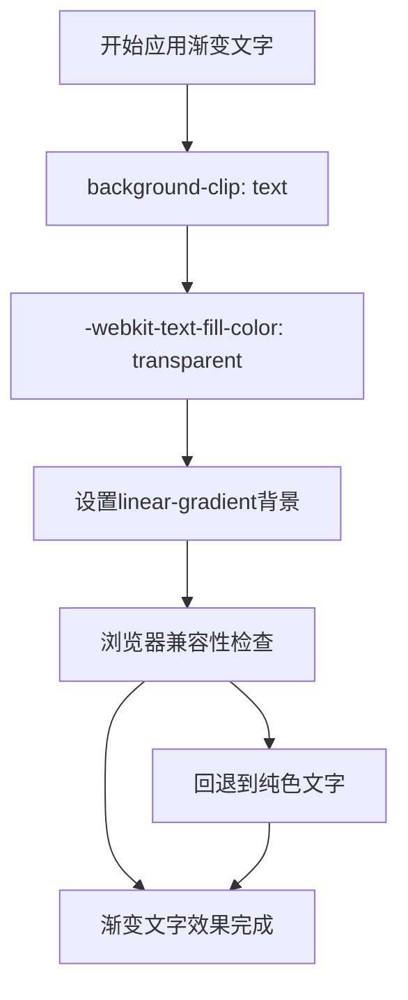

**图表来源**
- [variables.scss](file://src/assets/styles/variables.scss#L121-L126)

### 背景尺寸与定位

| 属性 | 值 | 用途 |
|------|-----|------|
| `background-size` | `100% 100%` | 完全覆盖 |
| `background-position` | `center` | 居中对齐 |
| `background-repeat` | `no-repeat` | 不重复 |

**节来源**
- [variables.scss](file://src/assets/styles/variables.scss#L121-L126)

## 组件样式实现

### 按钮组件规范

基于项目中的实际应用，按钮组件遵循以下样式规范：

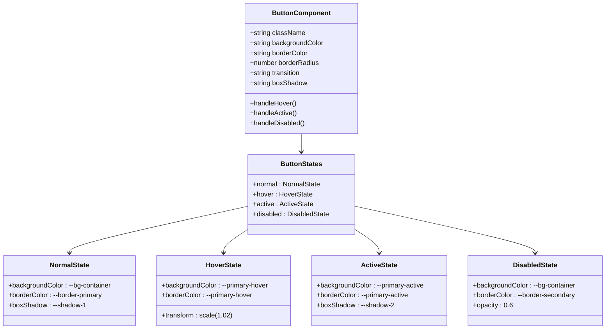

**图表来源**
- [DashboardHeader.vue](file://src/components/DashboardHeader.vue#L43-L48)

### 卡片组件规范

卡片组件采用统一的圆角、阴影和过渡效果：

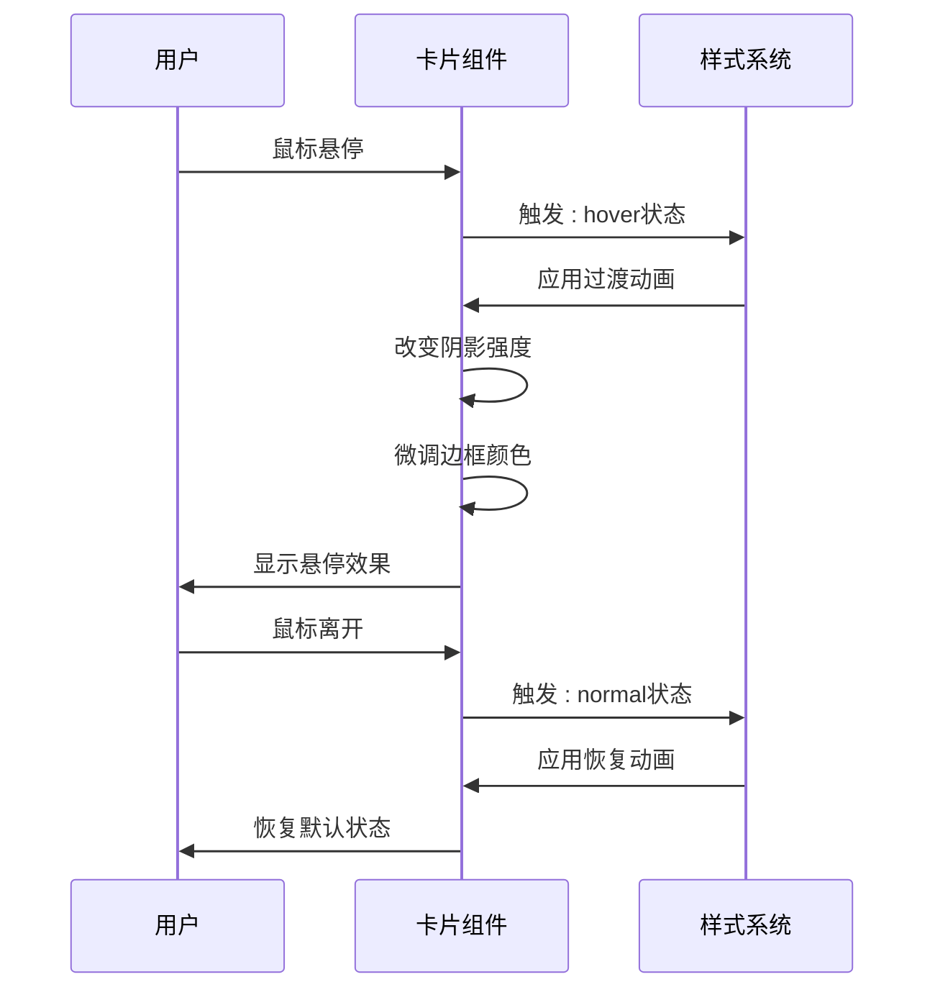

**图表来源**
- [App.vue](file://src/App.vue#L66-L82)

**节来源**
- [DashboardHeader.vue](file://src/components/DashboardHeader.vue#L43-L48)
- [App.vue](file://src/App.vue#L66-L82)

## 玻璃态背景效果

### CSS实现原理

玻璃态背景效果通过CSS的backdrop-filter属性实现，创造半透明和模糊的视觉效果：

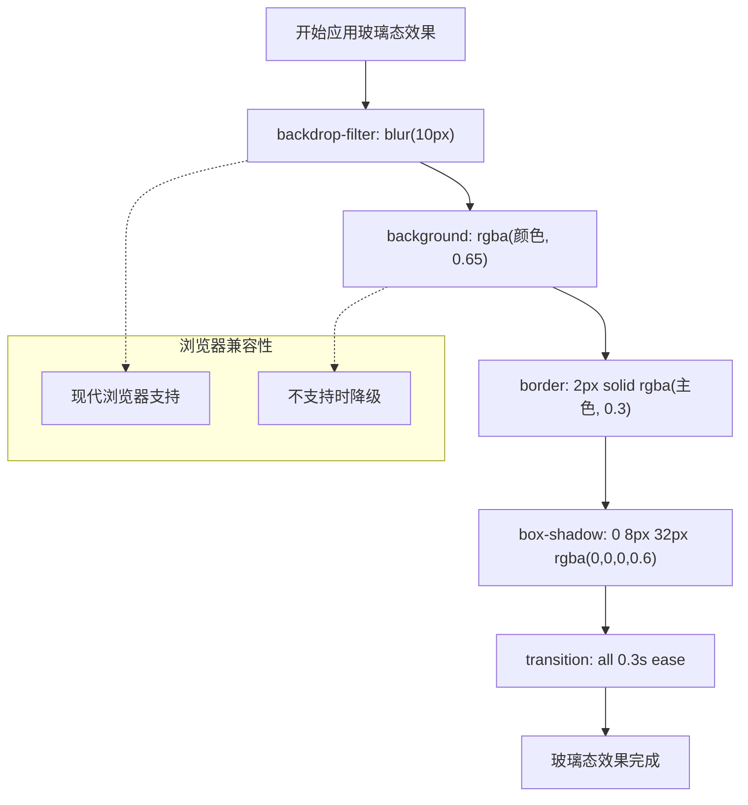

**图表来源**
- [App.vue](file://src/App.vue#L69)
- [MapToolbar.vue](file://src/mapComponents/MapToolbar.vue#L409)

### 玻璃态效果参数

| 参数 | 值 | 效果说明 |
|------|-----|----------|
| `backdrop-filter` | `blur(10px)` | 模糊程度 |
| `background` | `rgba(11, 28, 45, 0.65)` | 半透明背景 |
| `border` | `2px solid rgba(22, 119, 255, 0.3)` | 边框透明度 |
| `box-shadow` | `0 8px 32px rgba(0, 0, 0, 0.6)` | 阴影强度 |

**节来源**
- [App.vue](file://src/App.vue#L69)
- [MapToolbar.vue](file://src/mapComponents/MapToolbar.vue#L409)

## 实际应用案例

### DashboardHeader组件

DashboardHeader组件展示了复杂的样式组合和动画效果：

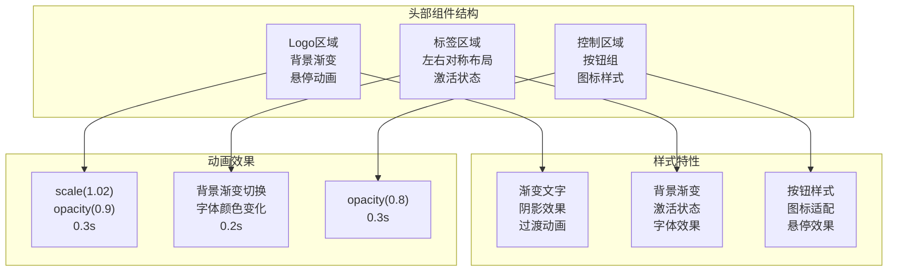

**图表来源**
- [DashboardHeader.vue](file://src/components/DashboardHeader.vue#L118-L128)

### OverviewModule组件

OverviewModule展示了数据卡片的样式规范：

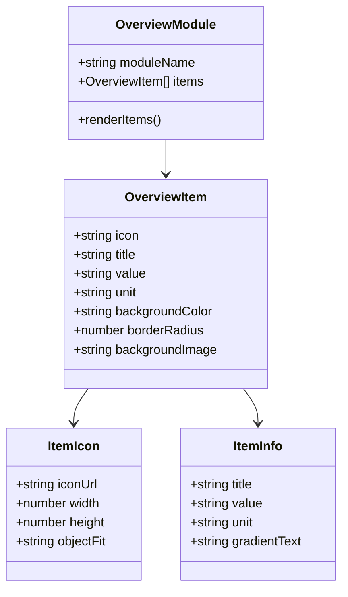

**图表来源**
- [OverviewModule.vue](file://src/views/WaterSupply/components/OverviewModule.vue#L107-L167)

### EarlyWarningModule组件

EarlyWarningModule展示了复杂的数据展示和交互样式：

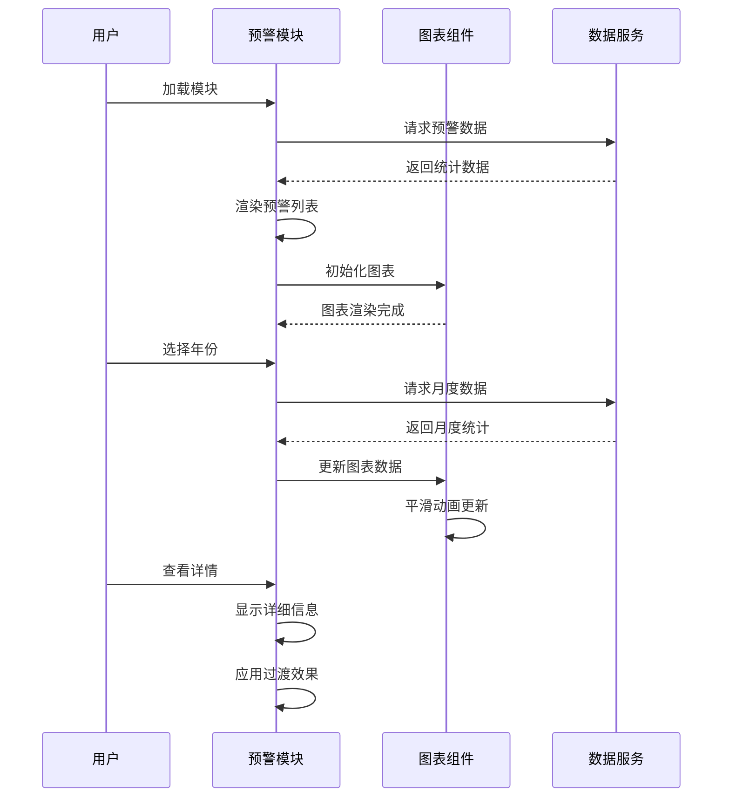

**图表来源**
- [EarlyWarningModule.vue](file://src/views/WaterSupply/components/EarlyWarningModule.vue#L180-L185)

**节来源**
- [DashboardHeader.vue](file://src/components/DashboardHeader.vue#L118-L128)
- [OverviewModule.vue](file://src/views/WaterSupply/components/OverviewModule.vue#L107-L167)
- [EarlyWarningModule.vue](file://src/views/WaterSupply/components/EarlyWarningModule.vue#L180-L185)

## 最佳实践指南

### 样式命名规范

1. **语义化命名**：使用描述性的类名，如`.module-header`、`.data-card`
2. **BEM方法论**：采用块-元素-修饰符模式
3. **组件隔离**：使用scoped样式避免样式污染

### 性能优化建议

1. **CSS压缩**：生产环境启用CSS压缩和合并
2. **关键CSS内联**：将首屏关键样式内联
3. **懒加载样式**：按需加载组件样式

### 响应式设计

1. **断点使用**：基于预定义断点进行响应式设计
2. **弹性布局**：优先使用Flexbox和Grid布局
3. **媒体查询**：合理使用媒体查询适配不同设备

### 可访问性考虑

1. **对比度**：确保文本与背景的对比度符合WCAG标准
2. **键盘导航**：保证所有交互元素可通过键盘操作
3. **屏幕阅读器**：为复杂组件提供适当的ARIA属性

### 维护性建议

1. **变量统一**：所有颜色、尺寸、动画都通过变量控制
2. **样式复用**：提取公共样式到全局样式文件
3. **注释规范**：为复杂样式添加详细注释

**节来源**
- [variables.scss](file://src/assets/styles/variables.scss#L1-L155)
- [base.css](file://src/assets/base.css#L1-L88)
- [main.css](file://src/assets/main.css#L1-L50)