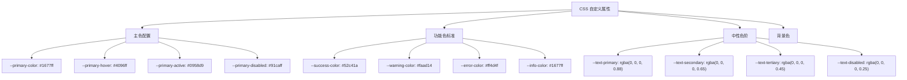
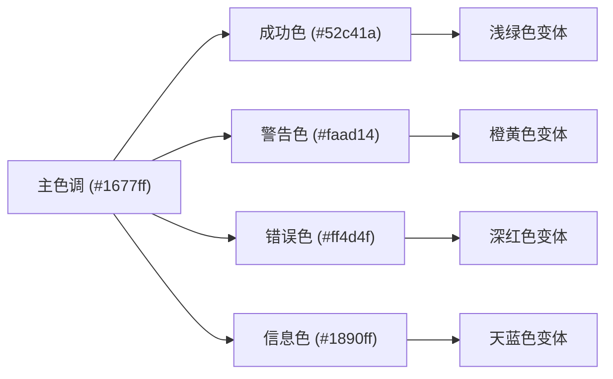
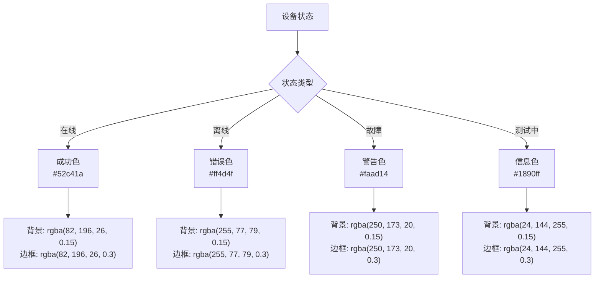
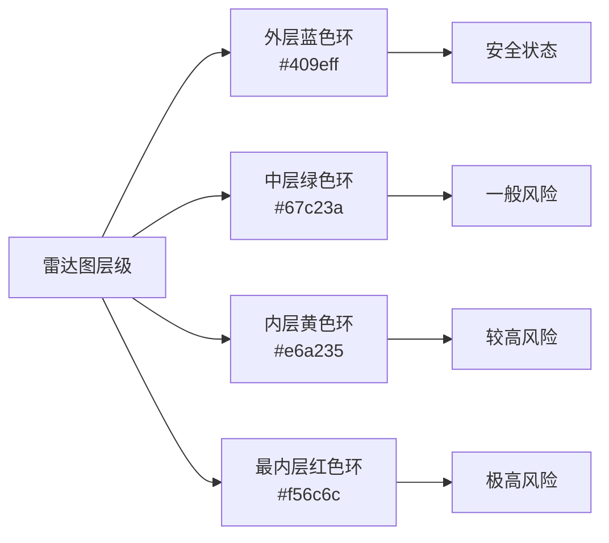
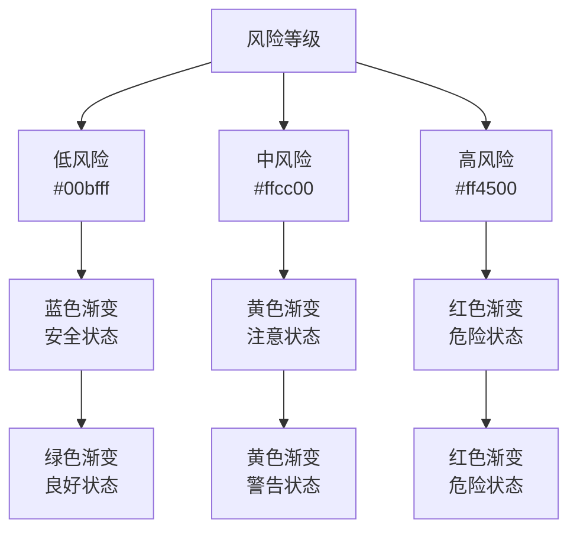
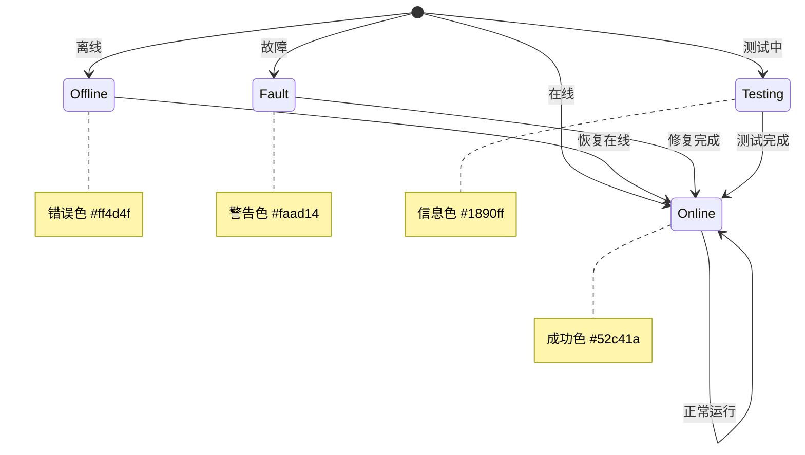

# 颜色系统

<cite>
**本文档引用的文件**
- [SAFETY_MONITORING_MODULE_README.md](file://SAFETY_MONITORING_MODULE_README.md)
- [variables.scss](file://src/assets/styles/variables.scss)
- [base.css](file://src/assets/base.css)
- [main.css](file://src/assets/main.css)
- [ehcartsOptions.ts](file://src/views/WaterSupply/components/ehcartsOptions.ts)
- [OverviewModule.vue](file://src/views/WaterSupply/components/OverviewModule.vue)
- [MonitoringDeviceModule.vue](file://src/views/gasModule/components/MonitoringDeviceModule.vue)
- [RiskHazardModule.vue](file://src/views/gasModule/components/RiskHazardModule.vue)
- [MonitoringDialog.vue](file://src/views/gasModule/components/map/MonitoringDialog.vue)
- [PipelineModule.vue](file://src/views/WaterSupply/components/PipelineModule.vue)
- [EarlyWarningModule.vue](file://src/views/WaterSupply/components/EarlyWarningModule.vue)
</cite>

## 目录
1. [简介](#简介)
2. [核心颜色体系](#核心颜色体系)
3. [颜色变量定义](#颜色变量定义)
4. [颜色使用规范](#颜色使用规范)
5. [UI组件中的颜色应用](#ui组件中的颜色应用)
6. [数据可视化中的颜色](#数据可视化中的颜色)
7. [状态指示颜色](#状态指示颜色)
8. [自定义扩展指南](#自定义扩展指南)
9. [最佳实践](#最佳实践)
10. [总结](#总结)

## 简介

本项目采用了一套完整的颜色系统，基于政府 dashboard 的专业性和权威性需求，建立了统一的色彩设计规范。该颜色系统不仅确保了视觉一致性，还通过科学的颜色心理学应用，提升了用户体验和信息传达效率。

## 核心颜色体系

项目定义了五个核心色彩，每个颜色都有其特定的语义和应用场景：

### 主色调 - 拂晓蓝 (#1677ff)
- **用途**: 主要功能按钮、重要信息标题、系统标识
- **心理效应**: 专业、可靠、科技感
- **适用场景**: 导航菜单、主要操作按钮、系统品牌标识

### 成功色 - 极光绿 (#52c41a)
- **用途**: 成功状态、积极反馈、确认操作
- **心理效应**: 安全、信任、积极
- **适用场景**: 成功提示、完成状态、积极反馈

### 警告色 - 金盏花 (#faad14)
- **用途**: 警告状态、需要注意的操作
- **心理效应**: 警觉、注意、提醒
- **适用场景**: 警告提示、风险提醒、需要关注的信息

### 错误色 - 薄暮红 (#ff4d4f)
- **用途**: 错误状态、危险操作、重要警告
- **心理效应**: 危险、紧急、停止
- **适用场景**: 错误提示、危险警告、重要停止操作

### 信息色 - 明蓝 (#1890ff)
- **用途**: 信息提示、辅助说明、次要操作
- **心理效应**: 清晰、简洁、信息性
- **适用场景**: 提示信息、辅助操作、次要功能

**章节来源**
- [SAFETY_MONITORING_MODULE_README.md](file://SAFETY_MONITORING_MODULE_README.md#L57-L62)

## 颜色变量定义

项目通过 CSS 自定义属性和 SCSS 变量两种方式定义颜色变量，确保跨平台和跨框架的一致性。

### CSS 自定义属性 (CSS Variables)



**图表来源**
- [variables.scss](file://src/assets/styles/variables.scss#L2-L30)

### SCSS 变量定义

SCSS 变量主要用于编译时的计算和函数调用：

| 变量名 | 颜色值 | 用途 |
|--------|--------|------|
| `$primary-color` | #1677ff | 主色调，用于主要交互元素 |
| `$success-color` | #52c41a | 成功状态，表示操作成功 |
| `$warning-color` | #faad14 | 警告状态，表示需要注意 |
| `$error-color` | #ff4d4f | 错误状态，表示操作失败 |
| `$info-color` | #1677ff | 信息状态，表示普通信息 |

**章节来源**
- [variables.scss](file://src/assets/styles/variables.scss#L43-L48)

## 颜色使用规范

### 语义化使用原则

1. **按功能分类使用**
   - 主色用于主要操作和导航
   - 成功色用于确认和积极反馈
   - 警告色用于提醒和注意
   - 错误色用于危险和错误状态
   - 信息色用于辅助信息

2. **避免颜色滥用**
   - 不同颜色代表不同语义，不能随意替换
   - 避免在同一界面中对同一功能使用多种颜色
   - 保持颜色使用的连贯性和一致性

3. **对比度要求**
   - 文字与背景对比度符合 WCAG AA 标准
   - 重要信息使用高对比度组合
   - 色盲友好设计考虑

### 颜色层次结构



## UI组件中的颜色应用

### 按钮状态颜色

项目中大量使用 Ant Design 的按钮组件，通过颜色变量实现统一的状态管理：

#### 状态颜色映射表

| 按钮类型 | 颜色变量 | 用途 | 视觉效果 |
|----------|----------|------|----------|
| 主要按钮 | `--primary-color` | 主要操作 | 拂晓蓝背景，白色文字 |
| 成功按钮 | `--success-color` | 操作成功 | 极光绿背景，白色文字 |
| 警告按钮 | `--warning-color` | 警告操作 | 金盏花背景，深色文字 |
| 错误按钮 | `--error-color` | 危险操作 | 薄暮红背景，白色文字 |
| 信息按钮 | `--info-color` | 信息展示 | 明蓝背景，白色文字 |

### 状态徽章系统



**图表来源**
- [MonitoringDialog.vue](file://src/views/gasModule/components/map/MonitoringDialog.vue#L567-L582)

### 文本颜色系统

| 文本层级 | 颜色变量 | 透明度 | 适用场景 |
|----------|----------|--------|----------|
| 主要文本 | `--text-primary` | 0.88 | 标题、重要信息 |
| 次要文本 | `--text-secondary` | 0.65 | 描述性文字、标签 |
| 辅助文本 | `--text-tertiary` | 0.45 | 提示信息、占位符 |
| 禁用文本 | `--text-disabled` | 0.25 | 不可用状态的文字 |

**章节来源**
- [variables.scss](file://src/assets/styles/variables.scss#L16-L19)

## 数据可视化中的颜色

### ECharts 图表颜色配置

项目使用 ECharts 进行数据可视化，颜色系统在图表中得到充分应用：

#### 雷达图颜色映射



**图表来源**
- [ehcartsOptions.ts](file://src/views/WaterSupply/components/ehcartsOptions.ts#L71-L126)

#### 环形图颜色配置

环形图使用渐变色增强视觉效果：

| 状态 | 渐变起始色 | 渐变结束色 | 语义含义 |
|------|------------|------------|----------|
| 在线 | #10ADC0 | #FFFFFF | 设备正常运行 |
| 离线 | #FFFEED | #CDAB06 | 设备离线状态 |
| 故障 | #FFE9DA | #CE5A0D | 设备故障状态 |

**章节来源**
- [MonitoringDeviceModule.vue](file://src/views/gasModule/components/MonitoringDeviceModule.vue#L359-L368)

### 风险评估颜色系统



**图表来源**
- [RiskHazardModule.vue](file://src/views/gasModule/components/RiskHazardModule.vue#L239-L292)

## 状态指示颜色

### 实时状态显示

项目中的各种状态指示都遵循统一的颜色规范：

#### 设备状态指示



#### 预警状态颜色

| 预警级别 | 颜色 | 语义 | 应用场景 |
|----------|------|------|----------|
| 严重 | 薄暮红 (#ff4d4f) | 紧急危险 | 系统故障、重大事故 |
| 一般 | 金盏花 (#faad14) | 需要注意 | 设备异常、环境变化 |
| 提示 | 明蓝 (#1890ff) | 一般信息 | 系统通知、维护提醒 |

**章节来源**
- [EarlyWarningModule.vue](file://src/views/WaterSupply/components/EarlyWarningModule.vue#L307-L330)

## 自定义扩展指南

### 添加新的功能色

当需要添加新的功能色时，应遵循以下步骤：

1. **定义颜色变量**
   ```scss
   // 在 variables.scss 中添加
   --new-feature-color: #your-color-code;
   ```

2. **建立语义映射**
   ```scss
   // 在组件中使用
   .new-status {
     background-color: var(--new-feature-color);
     color: #ffffff;
   }
   ```

3. **创建样式类**
   ```scss
   .status-new {
     background: linear-gradient(90deg, #ffffff 0%, var(--new-feature-color) 100%);
   }
   ```

### 扩展颜色方案

#### 渐变色系统

项目广泛使用渐变色来增强视觉效果：

```scss
// 线性渐变模板
.gradient-primary {
  background: linear-gradient(90deg, #ffffff 0%, var(--primary-color) 100%);
}

.gradient-success {
  background: linear-gradient(90deg, #ffffff 0%, var(--success-color) 100%);
}

.gradient-warning {
  background: linear-gradient(90deg, #ffffff 0%, var(--warning-color) 100%);
}
```

#### 透明度变体

```scss
// 透明度变体模板
.status-online {
  background: rgba(var(--success-color-rgb), 0.15);
  border: 1px solid rgba(var(--success-color-rgb), 0.3);
}
```

**章节来源**
- [OverviewModule.vue](file://src/views/WaterSupply/components/OverviewModule.vue#L147-L154)

## 最佳实践

### 颜色一致性保证

1. **全局变量管理**
   - 使用 CSS 自定义属性确保跨组件一致性
   - 通过 SCSS 变量支持动态计算
   - 建立颜色命名规范

2. **无障碍设计**
   - 确保足够的对比度 (WCAG AA 标准)
   - 考虑色盲用户的识别需求
   - 提供替代的视觉指示方式

3. **响应式颜色适配**
   - 根据不同屏幕尺寸调整颜色饱和度
   - 考虑不同光照条件下的可见性
   - 实现暗色模式支持

### 性能优化

1. **颜色缓存策略**
   - 预先计算常用颜色组合
   - 使用 CSS 变量减少重复计算
   - 优化渐变色渲染性能

2. **按需加载**
   - 根据功能模块动态加载颜色配置
   - 使用 CSS Modules 实现局部作用域
   - 避免全局污染

### 维护和更新

1. **版本控制**
   - 建立颜色变更记录
   - 维护颜色使用文档
   - 实施颜色审核流程

2. **自动化检查**
   - 开发颜色对比度检测工具
   - 实现自动化的可访问性测试
   - 建立颜色使用规范检查机制

## 总结

本项目建立了一套完整而专业的颜色系统，通过科学的颜色分类和严格的使用规范，实现了视觉一致性、语义清晰性和用户体验优化的多重目标。

### 核心优势

1. **语义明确**: 每种颜色都有明确的业务含义和使用场景
2. **系统统一**: 通过 CSS 变量和 SCSS 变量确保跨组件一致性
3. **易于扩展**: 清晰的架构设计支持新颜色的便捷添加
4. **专业美观**: 符合政府 dashboard 的专业形象要求
5. **无障碍友好**: 考虑了不同用户群体的使用需求

### 应用价值

- **提升用户体验**: 通过颜色语义化帮助用户快速理解系统状态
- **增强视觉识别**: 统一的颜色规范提高了系统的整体美感
- **降低认知负担**: 明确的颜色分类减少了用户的学习成本
- **支持业务发展**: 灵活的扩展机制支持系统的持续演进

这套颜色系统不仅满足了当前的功能需求，更为未来的功能扩展和界面优化奠定了坚实的基础。通过持续的优化和迭代，它将成为项目视觉设计的重要支撑。