# 水供应管道模块

<cite>
**本文档引用的文件**
- [index.vue](file://src/views/WaterSupply/index.vue)
- [leftContent.vue](file://src/views/WaterSupply/leftContent.vue)
- [rightContent.vue](file://src/views/WaterSupply/rightContent.vue)
- [PipelineModule.vue](file://src/views/WaterSupply/components/PipelineModule.vue)
- [waterSupplyService.ts](file://src/services/waterSupplyService.ts)
- [ehcartsOptions.ts](file://src/views/WaterSupply/components/ehcartsOptions.ts)
- [dictionaryService.ts](file://src/services/dictionaryService.ts)
- [dictionaryStore.ts](file://src/stores/dictionaryStore.ts)
- [OverviewModule.vue](file://src/views/WaterSupply/components/OverviewModule.vue)
- [WaterQualityModule.vue](file://src/views/WaterSupply/components/WaterQualityModule.vue)
- [MonitoringEquipmentModule.vue](file://src/views/WaterSupply/components/MonitoringEquipmentModule.vue)
- [RiskHazardModule.vue](file://src/views/WaterSupply/components/RiskHazardModule.vue)
- [EarlyWarningModule.vue](file://src/views/WaterSupply/components/EarlyWarningModule.vue)
- [commonService.ts](file://src/services/commonService.ts)
</cite>

## 目录
1. [简介](#简介)
2. [项目结构](#项目结构)
3. [核心组件](#核心组件)
4. [架构概览](#架构概览)
5. [详细组件分析](#详细组件分析)
6. [依赖关系分析](#依赖关系分析)
7. [性能考虑](#性能考虑)
8. [故障排除指南](#故障排除指南)
9. [结论](#结论)

## 简介

水供应管道模块是政府dashboard系统中的一个重要组成部分，专门负责展示和管理城市供水系统的实时监控数据。该模块采用现代化的Vue 3技术栈构建，集成了ECharts图表库来可视化复杂的供水管网数据，提供了全面的供水系统监控、预警和风险管理功能。

该模块主要包含以下核心功能：
- 供水基础设施总览统计
- 供水管网材质分布分析
- 隐患风险可视化展示
- 水质监测数据展示
- 设备运行状态监控
- 预警处置统计分析

## 项目结构

水供应管道模块遵循Vue 3的单文件组件架构，采用模块化的组织方式：

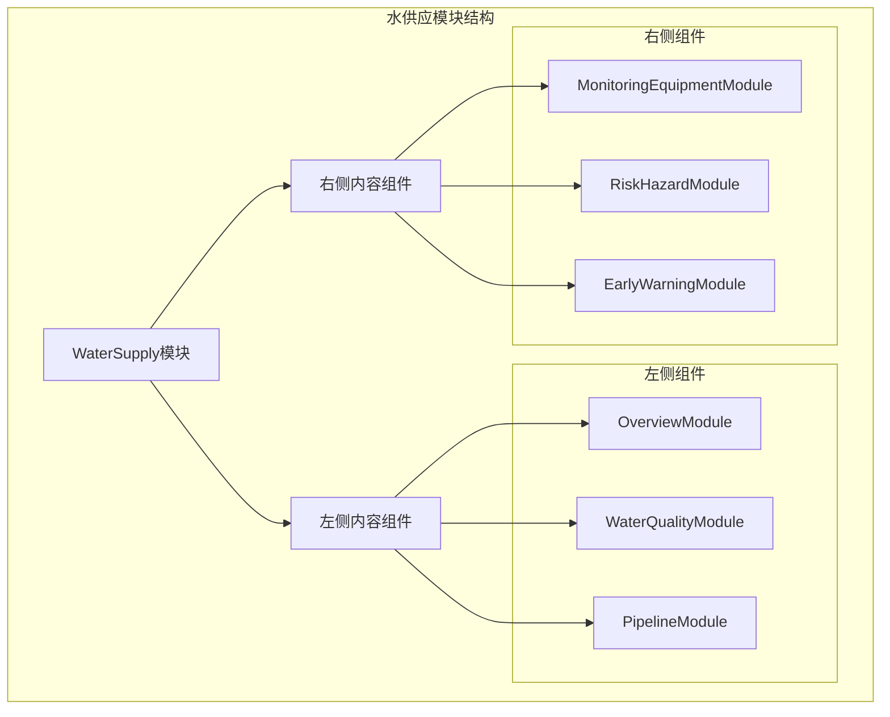

**图表来源**
- [index.vue](file://src/views/WaterSupply/index.vue#L8-L22)
- [leftContent.vue](file://src/views/WaterSupply/leftContent.vue#L9-L20)
- [rightContent.vue](file://src/views/WaterSupply/rightContent.vue#L8-L14)

**章节来源**
- [index.vue](file://src/views/WaterSupply/index.vue#L1-L99)
- [leftContent.vue](file://src/views/WaterSupply/leftContent.vue#L1-L29)
- [rightContent.vue](file://src/views/WaterSupply/rightContent.vue#L1-L24)

## 核心组件

### 模块配置系统

水供应模块采用了统一的配置注入机制，通过provide/inject模式实现组件间的数据共享：

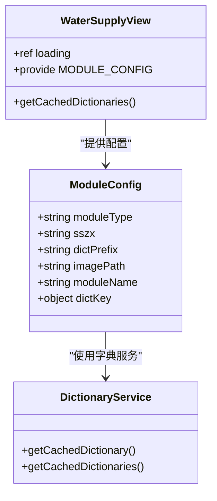

**图表来源**
- [index.vue](file://src/views/WaterSupply/index.vue#L34-L50)
- [dictionaryService.ts](file://src/services/dictionaryService.ts#L15-L28)

### 数据服务层

模块采用分层的服务架构，将数据获取逻辑封装在专门的服务文件中：

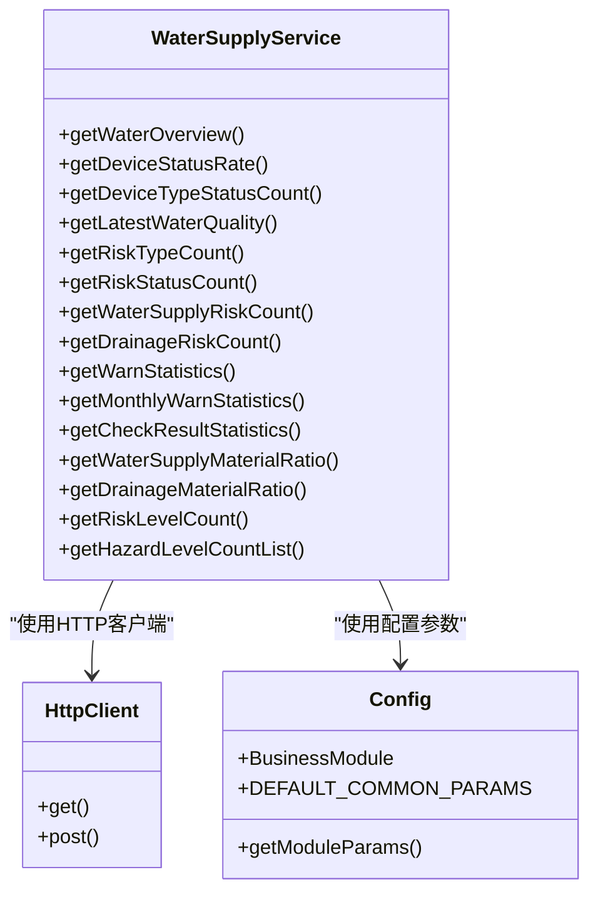

**图表来源**
- [waterSupplyService.ts](file://src/services/waterSupplyService.ts#L15-L186)

**章节来源**
- [index.vue](file://src/views/WaterSupply/index.vue#L34-L73)
- [waterSupplyService.ts](file://src/services/waterSupplyService.ts#L1-L186)

## 架构概览

水供应模块的整体架构采用MVVM模式，结合响应式数据绑定和组件化设计：

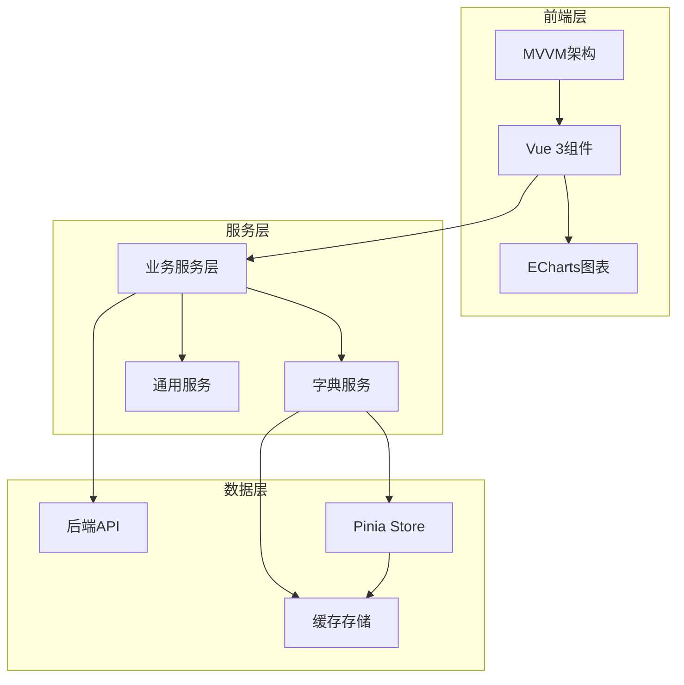

**图表来源**
- [index.vue](file://src/views/WaterSupply/index.vue#L24-L73)
- [dictionaryStore.ts](file://src/stores/dictionaryStore.ts#L26-L97)

## 详细组件分析

### 管道模块 (PipelineModule)

管道模块是水供应模块的核心组件，负责展示供水管网的材质分布和隐患风险可视化：

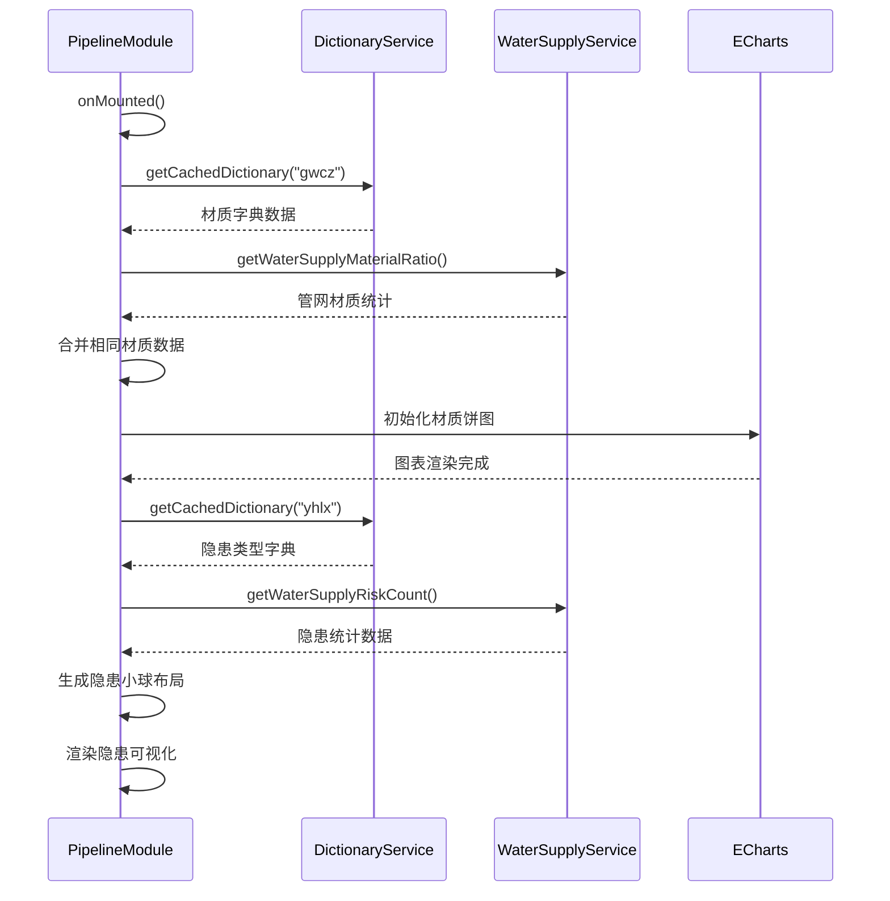

**图表来源**
- [PipelineModule.vue](file://src/views/WaterSupply/components/PipelineModule.vue#L118-L174)
- [PipelineModule.vue](file://src/views/WaterSupply/components/PipelineModule.vue#L231-L282)

#### 材质分布可视化

管道模块使用ECharts创建了交互式的材质分布饼图，支持多种材质类型的可视化展示：

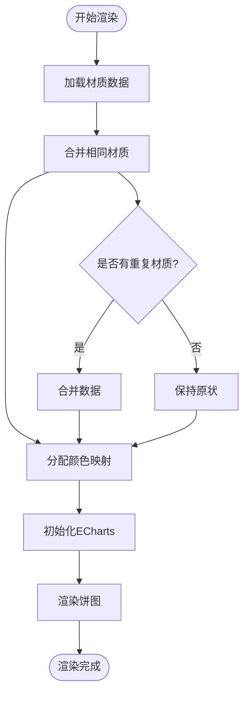

**图表来源**
- [PipelineModule.vue](file://src/views/WaterSupply/components/PipelineModule.vue#L132-L158)

#### 隐患风险可视化

模块创新性地实现了隐患风险的小球可视化布局算法：

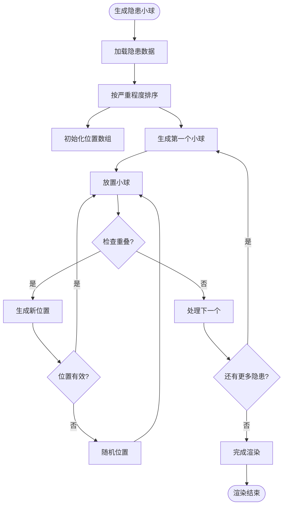

**图表来源**
- [PipelineModule.vue](file://src/views/WaterSupply/components/PipelineModule.vue#L182-L229)

**章节来源**
- [PipelineModule.vue](file://src/views/WaterSupply/components/PipelineModule.vue#L1-L486)

### 水质监测模块 (WaterQualityModule)

水质监测模块提供了实时的供水水质数据展示功能：

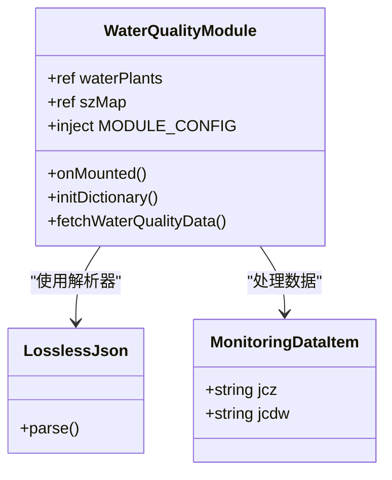

**图表来源**
- [WaterQualityModule.vue](file://src/views/WaterSupply/components/WaterQualityModule.vue#L61-L113)

**章节来源**
- [WaterQualityModule.vue](file://src/views/WaterSupply/components/WaterQualityModule.vue#L1-L200)

### 预警处置模块 (EarlyWarningModule)

预警处置模块集成了多种图表类型来展示预警数据：

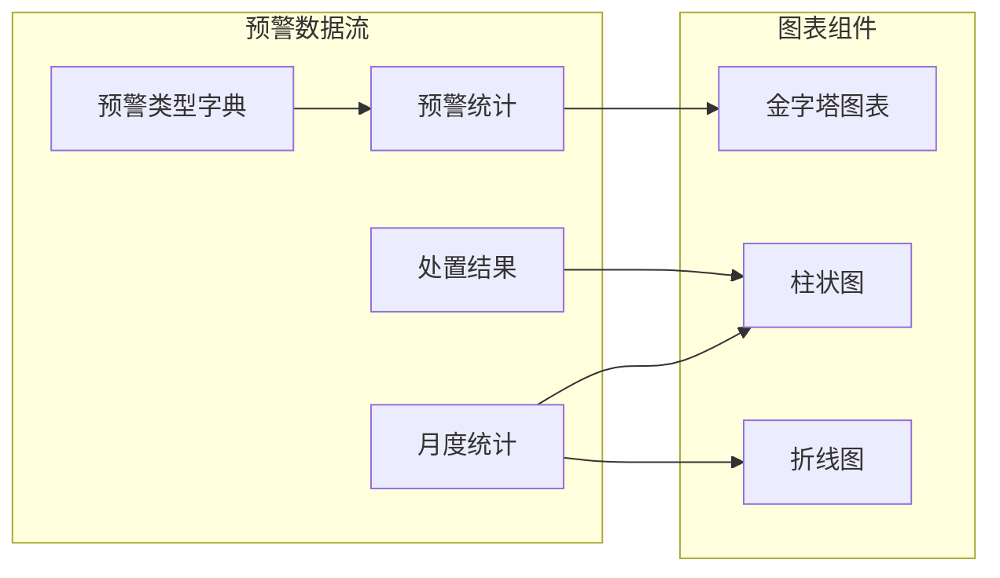

**图表来源**
- [EarlyWarningModule.vue](file://src/views/WaterSupply/components/EarlyWarningModule.vue#L111-L142)

**章节来源**
- [EarlyWarningModule.vue](file://src/views/WaterSupply/components/EarlyWarningModule.vue#L1-L200)

### 风险隐患模块 (RiskHazardModule)

风险隐患模块提供了多层次的风险可视化展示：

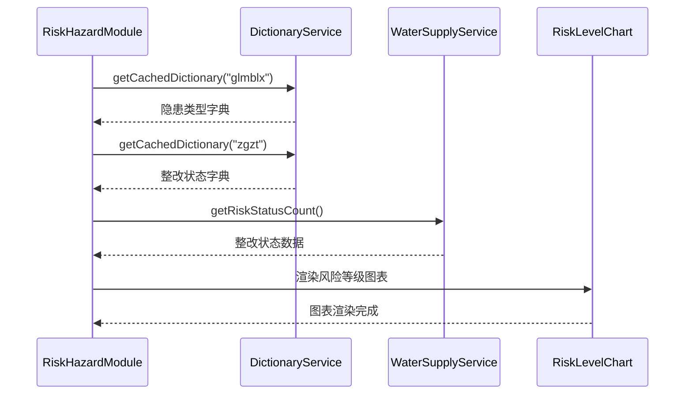

**图表来源**
- [RiskHazardModule.vue](file://src/views/WaterSupply/components/RiskHazardModule.vue#L142-L199)

**章节来源**
- [RiskHazardModule.vue](file://src/views/WaterSupply/components/RiskHazardModule.vue#L1-L200)

## 依赖关系分析

水供应模块的依赖关系呈现清晰的层次结构：

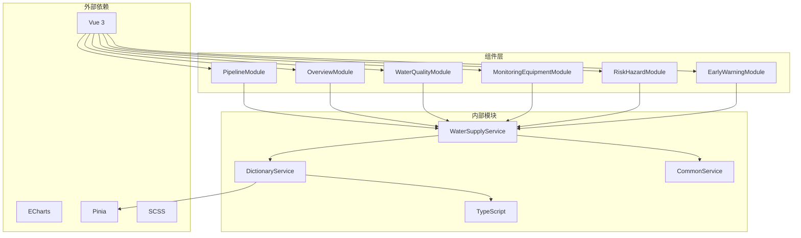

**图表来源**
- [index.vue](file://src/views/WaterSupply/index.vue#L24-L50)
- [waterSupplyService.ts](file://src/services/waterSupplyService.ts#L6-L10)

**章节来源**
- [index.vue](file://src/views/WaterSupply/index.vue#L24-L73)
- [waterSupplyService.ts](file://src/services/waterSupplyService.ts#L1-L186)

## 性能考虑

### 字典数据缓存策略

模块实现了高效的字典数据缓存机制，避免重复的API请求：

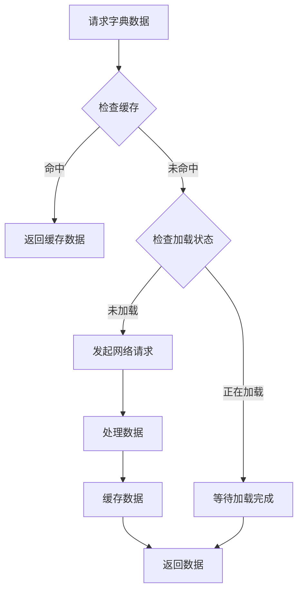

**图表来源**
- [dictionaryStore.ts](file://src/stores/dictionaryStore.ts#L38-L97)

### 图表渲染优化

管道模块的图表渲染采用了多项优化技术：

1. **延迟初始化**：图表在组件挂载后才进行初始化
2. **数据合并**：自动合并相同材质的统计数据
3. **颜色映射**：预定义材质颜色映射表
4. **渐变效果**：使用CSS渐变实现动态视觉效果

**章节来源**
- [dictionaryStore.ts](file://src/stores/dictionaryStore.ts#L1-L225)
- [PipelineModule.vue](file://src/views/WaterSupply/components/PipelineModule.vue#L118-L174)

## 故障排除指南

### 常见问题及解决方案

#### 字典数据加载失败

**问题描述**：字典数据无法正确加载或显示为空

**可能原因**：
1. 网络请求超时
2. 字典编码错误
3. 缓存数据损坏

**解决方案**：
1. 检查网络连接状态
2. 验证字典编码的正确性
3. 清除字典缓存后重新加载

#### 图表渲染异常

**问题描述**：ECharts图表无法正常显示或显示异常

**可能原因**：
1. DOM元素未就绪
2. 数据格式不正确
3. 图表配置错误

**解决方案**：
1. 确保在nextTick中执行图表初始化
2. 验证数据格式符合预期
3. 检查图表配置选项

#### 隐患小球重叠问题

**问题描述**：隐患小球在可视化界面中出现重叠现象

**可能原因**：
1. 小球数量过多
2. 布局算法参数不当
3. 容器尺寸不足

**解决方案**：
1. 调整小球大小和间距参数
2. 优化布局算法的尝试次数
3. 增加容器的可视区域

**章节来源**
- [dictionaryService.ts](file://src/services/dictionaryService.ts#L15-L45)
- [dictionaryStore.ts](file://src/stores/dictionaryStore.ts#L89-L96)

## 结论

水供应管道模块是一个功能完整、架构清晰的现代化Web应用模块。它成功地将复杂的城市供水系统数据转化为直观的可视化界面，为政府决策者提供了强有力的数据支持工具。

### 主要优势

1. **模块化设计**：采用Vue 3的组件化架构，代码结构清晰，易于维护和扩展
2. **数据可视化**：集成ECharts图表库，提供丰富的数据可视化能力
3. **性能优化**：实现了智能的字典数据缓存和图表渲染优化
4. **用户体验**：响应式设计，适配多种屏幕尺寸和设备类型

### 技术亮点

1. **创新的隐患可视化**：独创的隐患小球布局算法，有效解决了多数据点的可视化问题
2. **统一的配置管理**：通过provide/inject模式实现组件间的配置共享
3. **完善的错误处理**：建立了完整的错误捕获和处理机制
4. **高效的缓存策略**：避免重复的API请求，提升应用性能

该模块不仅满足了当前的功能需求，还为未来的功能扩展和技术升级奠定了坚实的基础。通过持续的优化和完善，相信能够为城市供水系统的智能化管理提供更加有力的技术支撑。