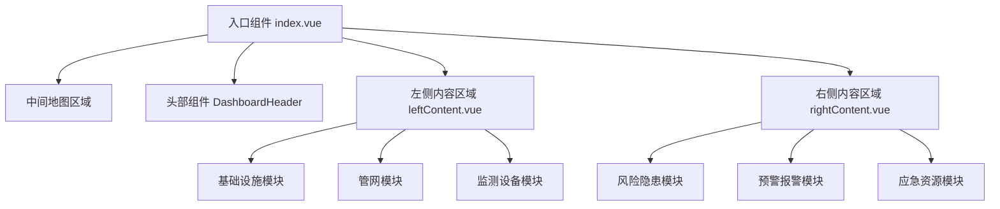
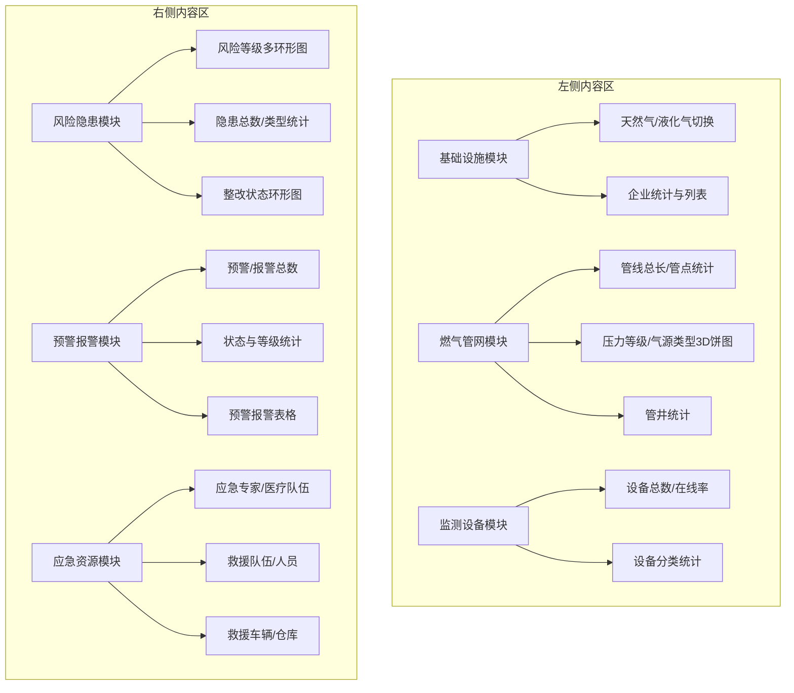
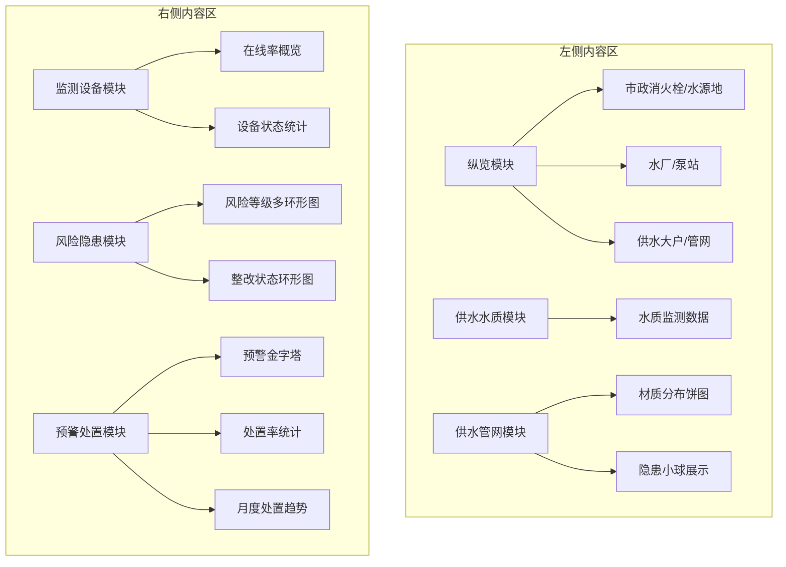
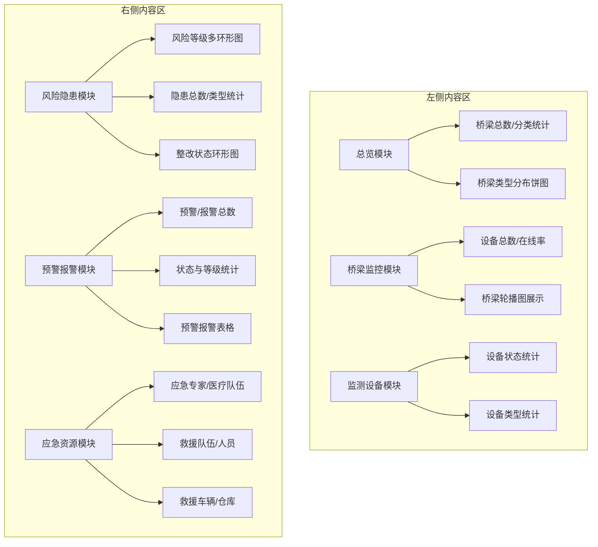
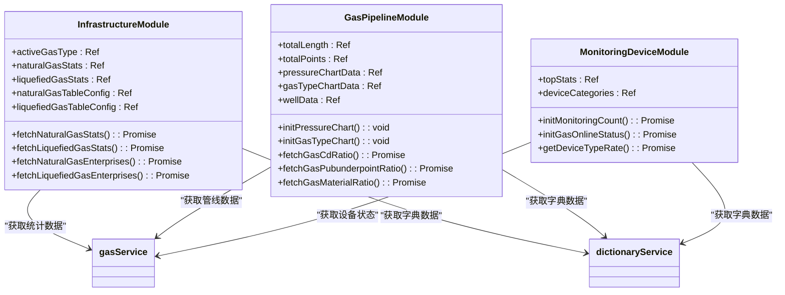
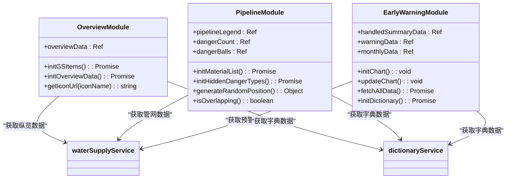
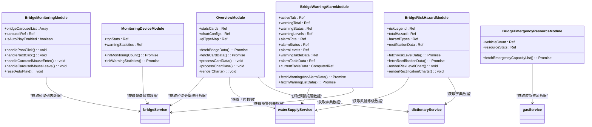
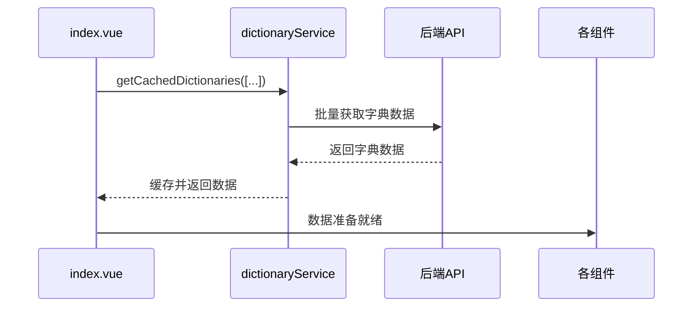
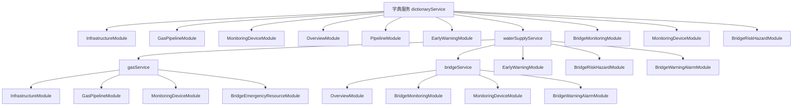

# 专项监测模块

<cite>
**本文档引用文件**   
- [leftContent.vue](file://src/views/gasModule/leftContent.vue)
- [rightContent.vue](file://src/views/gasModule/rightContent.vue)
- [leftContent.vue](file://src/views/WaterSupply/leftContent.vue)
- [rightContent.vue](file://src/views/WaterSupply/rightContent.vue)
- [InfrastructureModule.vue](file://src/views/gasModule/components/InfrastructureModule.vue)
- [GasPipelineModule.vue](file://src/views/gasModule/components/GasPipelineModule.vue)
- [MonitoringDeviceModule.vue](file://src/views/gasModule/components/MonitoringDeviceModule.vue)
- [RiskHazardModule.vue](file://src/views/gasModule/components/RiskHazardModule.vue)
- [WarningAlarmModule.vue](file://src/views/gasModule/components/WarningAlarmModule.vue)
- [EmergencyResourceModule.vue](file://src/views/gasModule/components/EmergencyResourceModule.vue)
- [OverviewModule.vue](file://src/views/WaterSupply/components/OverviewModule.vue)
- [PipelineModule.vue](file://src/views/WaterSupply/components/PipelineModule.vue)
- [WaterQualityModule.vue](file://src/views/WaterSupply/components/WaterQualityModule.vue)
- [MonitoringEquipmentModule.vue](file://src/views/WaterSupply/components/MonitoringEquipmentModule.vue)
- [EarlyWarningModule.vue](file://src/views/WaterSupply/components/EarlyWarningModule.vue)
- [CODEBUDDY.md](file://CODEBUDDY.md)
- [index.vue](file://src/views/BridgeModule/index.vue)
- [leftContent.vue](file://src/views/BridgeModule/leftContent.vue)
- [rightContent.vue](file://src/views/BridgeModule/rightContent.vue)
- [OverviewModule.vue](file://src/views/BridgeModule/components/OverviewModule.vue)
- [BridgeMonitoringModule.vue](file://src/views/BridgeModule/components/BridgeMonitoringModule.vue)
- [MonitoringDeviceModule.vue](file://src/views/BridgeModule/components/MonitoringDeviceModule.vue)
- [BridgeRiskHazardModule.vue](file://src/views/BridgeModule/components/BridgeRiskHazardModule.vue)
- [BridgeWarningAlarmModule.vue](file://src/views/BridgeModule/components/BridgeWarningAlarmModule.vue)
- [BridgeEmergencyResourceModule.vue](file://src/views/BridgeModule/components/BridgeEmergencyResourceModule.vue)
- [MapToolbar.vue](file://src/mapComponents/MapToolbar.vue)
- [bridgeService.ts](file://src/services/bridgeService.ts)
</cite>

## 更新摘要
**变更内容**   
- 新增桥梁专项监测模块的架构设计说明
- 扩展三模块布局模式，增加桥梁模块的布局描述
- 新增桥梁模块各功能组件的数据绑定与可视化方案
- 补充模块间数据联动机制中桥梁模块的集成方式
- 增加新模块开发流程中关于3D模型显示控制的说明

## 目录
1. [引言](#引言)
2. [模块架构设计](#模块架构设计)
3. [三模块布局模式](#三模块布局模式)
4. [功能模块数据绑定与可视化](#功能模块数据绑定与可视化)
5. [模块间数据联动与状态共享](#模块间数据联动与状态共享)
6. [新模块开发标准化流程](#新模块开发标准化流程)

## 引言
本项目构建了燃气、供水和桥梁三大专项监测模块，通过统一的架构设计实现对城市基础设施的全面监控。系统采用Vue 3组合式API和TypeScript构建，结合ECharts进行数据可视化，并通过Cesium实现三维地图展示。三大模块均采用一致的三模块布局模式，左侧展示基础设施、管网和监测设备，右侧展示风险隐患、预警报警和应急资源，形成完整的监测闭环。新增的桥梁专项监测模块包含总览、监控、风险隐患、预警报警、应急资源等多个功能组件，并在地图工具栏中增加了桥梁3D模型和默认3D Tiles的显示控制按钮。

## 模块架构设计
燃气、供水和桥梁监测模块均采用相似的架构设计，通过`index.vue`作为入口组件，整合地图、头部组件和左右内容区域。系统使用`ResponsiveWrapper`组件确保在不同分辨率下的适配性，并通过`DashboardHeader`提供统一的头部展示。

**Diagram sources**
- [src/views/gasModule/index.vue](file://src/views/gasModule/index.vue#L1-L70)
- [src/views/WaterSupply/index.vue](file://src/views/WaterSupply/index.vue#L1-L84)
- [src/views/BridgeModule/index.vue](file://src/views/BridgeModule/index.vue#L1-L56)

## 三模块布局模式
系统采用统一的三模块布局模式，通过`leftContent.vue`和`rightContent.vue`组件实现功能分区。

### 燃气模块布局
燃气模块左侧展示基础设施、燃气管网和监测设备，右侧展示风险隐患、预警报警和应急资源。

**Diagram sources**
- [src/views/gasModule/leftContent.vue](file://src/views/gasModule/leftContent.vue#L1-L33)
- [src/views/gasModule/rightContent.vue](file://src/views/gasModule/rightContent.vue#L1-L33)

### 供水模块布局
供水模块左侧展示纵览、供水水质和供水管网，右侧展示监测设备、风险隐患和预警处置。

**Diagram sources**
- [src/views/WaterSupply/leftContent.vue](file://src/views/WaterSupply/leftContent.vue#L1-L34)
- [src/views/WaterSupply/rightContent.vue](file://src/views/WaterSupply/rightContent.vue#L1-L28)

### 桥梁模块布局
桥梁模块左侧展示总览、桥梁监控和监测设备，右侧展示风险隐患、预警报警和应急资源。

**Diagram sources**
- [src/views/BridgeModule/leftContent.vue](file://src/views/BridgeModule/leftContent.vue#L1-L32)
- [src/views/BridgeModule/rightContent.vue](file://src/views/BridgeModule/rightContent.vue#L1-L32)

**Section sources**
- [src/views/gasModule/leftContent.vue](file://src/views/gasModule/leftContent.vue#L1-L33)
- [src/views/gasModule/rightContent.vue](file://src/views/gasModule/rightContent.vue#L1-L33)
- [src/views/WaterSupply/leftContent.vue](file://src/views/WaterSupply/leftContent.vue#L1-L34)
- [src/views/WaterSupply/rightContent.vue](file://src/views/WaterSupply/rightContent.vue#L1-L28)
- [src/views/BridgeModule/leftContent.vue](file://src/views/BridgeModule/leftContent.vue#L1-L32)
- [src/views/BridgeModule/rightContent.vue](file://src/views/BridgeModule/rightContent.vue#L1-L32)

## 功能模块数据绑定与可视化
各功能模块通过组合式API实现数据绑定和可视化，使用`ref`和`computed`管理响应式数据，并通过服务层获取真实数据。

### 燃气模块功能实现
燃气模块各组件通过`gasService`和`dictionaryService`获取数据，实现动态绑定。

**Diagram sources**
- [src/views/gasModule/components/InfrastructureModule.vue](file://src/views/gasModule/components/InfrastructureModule.vue#L1-L381)
- [src/views/gasModule/components/GasPipelineModule.vue](file://src/views/gasModule/components/GasPipelineModule.vue#L1-L676)
- [src/views/gasModule/components/MonitoringDeviceModule.vue](file://src/views/gasModule/components/MonitoringDeviceModule.vue#L1-L376)

### 供水模块功能实现
供水模块通过`waterSupplyService`和`dictionaryService`获取数据，实现动态绑定和可视化。

**Diagram sources**
- [src/views/WaterSupply/components/OverviewModule.vue](file://src/views/WaterSupply/components/OverviewModule.vue#L1-L170)
- [src/views/WaterSupply/components/PipelineModule.vue](file://src/views/WaterSupply/components/PipelineModule.vue#L1-L398)
- [src/views/WaterSupply/components/EarlyWarningModule.vue](file://src/views/WaterSupply/components/EarlyWarningModule.vue#L1-L421)

### 桥梁模块功能实现
桥梁模块通过`bridgeService`和`dictionaryService`获取数据，实现动态绑定和可视化。

**Diagram sources**
- [src/views/BridgeModule/components/OverviewModule.vue](file://src/views/BridgeModule/components/OverviewModule.vue#L1-L378)
- [src/views/BridgeModule/components/BridgeMonitoringModule.vue](file://src/views/BridgeModule/components/BridgeMonitoringModule.vue#L1-L457)
- [src/views/BridgeModule/components/MonitoringDeviceModule.vue](file://src/views/BridgeModule/components/MonitoringDeviceModule.vue#L1-L291)
- [src/views/BridgeModule/components/BridgeRiskHazardModule.vue](file://src/views/BridgeModule/components/BridgeRiskHazardModule.vue#L1-L603)
- [src/views/BridgeModule/components/BridgeWarningAlarmModule.vue](file://src/views/BridgeModule/components/BridgeWarningAlarmModule.vue#L1-L637)
- [src/views/BridgeModule/components/BridgeEmergencyResourceModule.vue](file://src/views/BridgeModule/components/BridgeEmergencyResourceModule.vue#L1-L297)
- [src/services/bridgeService.ts](file://src/services/bridgeService.ts#L1-L60)

**Section sources**
- [src/views/gasModule/components/InfrastructureModule.vue](file://src/views/gasModule/components/InfrastructureModule.vue#L1-L381)
- [src/views/gasModule/components/GasPipelineModule.vue](file://src/views/gasModule/components/GasPipelineModule.vue#L1-L676)
- [src/views/gasModule/components/MonitoringDeviceModule.vue](file://src/views/gasModule/components/MonitoringDeviceModule.vue#L1-L376)
- [src/views/WaterSupply/components/OverviewModule.vue](file://src/views/WaterSupply/components/OverviewModule.vue#L1-L170)
- [src/views/WaterSupply/components/PipelineModule.vue](file://src/views/WaterSupply/components/PipelineModule.vue#L1-L398)
- [src/views/WaterSupply/components/EarlyWarningModule.vue](file://src/views/WaterSupply/components/EarlyWarningModule.vue#L1-L421)
- [src/views/BridgeModule/components/OverviewModule.vue](file://src/views/BridgeModule/components/OverviewModule.vue#L1-L378)
- [src/views/BridgeModule/components/BridgeMonitoringModule.vue](file://src/views/BridgeModule/components/BridgeMonitoringModule.vue#L1-L457)
- [src/views/BridgeModule/components/MonitoringDeviceModule.vue](file://src/views/BridgeModule/components/MonitoringDeviceModule.vue#L1-L291)
- [src/views/BridgeModule/components/BridgeRiskHazardModule.vue](file://src/views/BridgeModule/components/BridgeRiskHazardModule.vue#L1-L603)
- [src/views/BridgeModule/components/BridgeWarningAlarmModule.vue](file://src/views/BridgeModule/components/BridgeWarningAlarmModule.vue#L1-L637)
- [src/views/BridgeModule/components/BridgeEmergencyResourceModule.vue](file://src/views/BridgeModule/components/BridgeEmergencyResourceModule.vue#L1-L297)
- [src/services/bridgeService.ts](file://src/services/bridgeService.ts#L1-L60)

## 模块间数据联动与状态共享
系统通过服务层和组合式API实现模块间的数据联动和状态共享，确保数据的一致性和实时性。

### 数据预加载机制
在模块初始化时，通过`onBeforeMount`钩子预加载所有需要的字典数据，避免重复请求。

**Diagram sources**
- [src/views/gasModule/index.vue](file://src/views/gasModule/index.vue#L41-L58)
- [src/views/WaterSupply/index.vue](file://src/views/WaterSupply/index.vue#L46-L64)
- [src/views/BridgeModule/index.vue](file://src/views/BridgeModule/index.vue#L38-L45)

### 状态共享模式
通过服务层的共享状态和组合式函数，实现跨组件的数据共享和状态同步。

**Diagram sources**
- [src/services/dictionaryService.ts](file://src/services/dictionaryService.ts)
- [src/services/waterSupplyService.ts](file://src/services/waterSupplyService.ts)
- [src/services/gasService.ts](file://src/services/gasService.ts)
- [src/services/bridgeService.ts](file://src/services/bridgeService.ts)

**Section sources**
- [src/views/gasModule/index.vue](file://src/views/gasModule/index.vue#L41-L58)
- [src/views/WaterSupply/index.vue](file://src/views/WaterSupply/index.vue#L46-L64)
- [src/views/BridgeModule/index.vue](file://src/views/BridgeModule/index.vue#L38-L45)

## 新模块开发标准化流程
根据`CODEBUDDY.md`中的指导原则，新模块开发应遵循以下标准化流程：

1. **创建模块目录结构**：在`src/views`下创建新模块目录，包含`components`子目录
2. **创建入口组件**：创建`index.vue`作为模块入口，整合地图、头部和左右内容区域
3. **实现左右内容组件**：创建`leftContent.vue`和`rightContent.vue`，根据业务需求引入相应功能模块
4. **开发功能模块**：在`components`目录下开发具体功能模块，每个模块独立封装
5. **数据服务集成**：通过`services`层获取数据，使用`ref`和`computed`管理响应式状态
6. **样式规范**：遵循现有样式规范，使用SCSS编写组件样式
7. **预加载优化**：在`index.vue`中预加载所需字典数据，提升用户体验
8. **响应式适配**：使用`ResponsiveWrapper`确保在不同分辨率下的显示效果
9. **3D模型控制集成**：在`MapToolbar.vue`中添加相应的3D模型显示控制按钮，通过emit事件与地图组件通信
10. **服务层封装**：在`services`目录下创建对应的服务文件，封装API调用逻辑

**Section sources**
- [CODEBUDDY.md](file://CODEBUDDY.md)
- [src/mapComponents/MapToolbar.vue](file://src/mapComponents/MapToolbar.vue#L75-L93)