# 供水水质模块

<cite>
**本文档引用的文件**
- [WaterQualityModule.vue](file://src/views/WaterSupply/components/WaterQualityModule.vue)
- [ehcartsOptions.ts](file://src/views/WaterSupply/components/ehcartsOptions.ts)
- [waterSupplyAndDrainage.ts](file://src/api/waterSupplyAndDrainage.ts)
- [waterSupplyService.ts](file://src/services/waterSupplyService.ts)
- [dictionaryService.ts](file://src/services/dictionaryService.ts)
- [dictionaryStore.ts](file://src/stores/dictionaryStore.ts)
- [apiFactory.ts](file://src/api/apiFactory.ts)
- [variables.scss](file://src/assets/styles/variables.scss)
</cite>

## 目录
1. [简介](#简介)
2. [项目结构](#项目结构)
3. [核心组件](#核心组件)
4. [架构概览](#架构概览)
5. [详细组件分析](#详细组件分析)
6. [数据流分析](#数据流分析)
7. [图表配置系统](#图表配置系统)
8. [API服务集成](#api服务集成)
9. [字典数据联动机制](#字典数据联动机制)
10. [性能优化策略](#性能优化策略)
11. [故障排除指南](#故障排除指南)
12. [总结](#总结)

## 简介

供水水质模块是政府Dashboard系统中的核心监控组件，负责展示城市供水系统的水质监测关键指标。该模块通过实时数据显示、历史趋势分析和可视化图表，为管理者提供全面的水质状况监控能力。模块支持多种水质参数的实时监测，包括浊度、pH值、余氯等关键指标，并提供了丰富的交互式图表来展示数据变化趋势。

## 项目结构

供水水质模块采用Vue 3 Composition API构建，遵循组件化开发模式，具有清晰的分层架构：

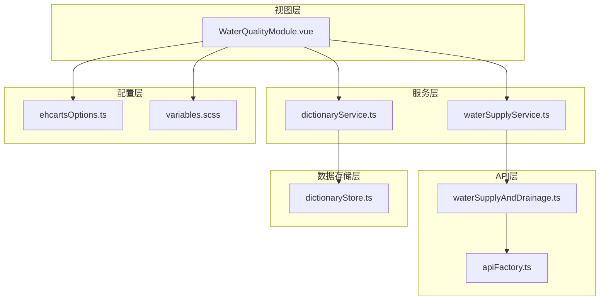

**图表来源**
- [WaterQualityModule.vue](file://src/views/WaterSupply/components/WaterQualityModule.vue#L1-L239)
- [waterSupplyService.ts](file://src/services/waterSupplyService.ts#L1-L162)
- [dictionaryService.ts](file://src/services/dictionaryService.ts#L1-L45)

**章节来源**
- [WaterQualityModule.vue](file://src/views/WaterSupply/components/WaterQualityModule.vue#L1-L239)
- [waterSupplyService.ts](file://src/services/waterSupplyService.ts#L1-L162)

## 核心组件

### WaterQualityModule.vue - 主要组件

WaterQualityModule是整个水质监控模块的核心组件，采用响应式设计，能够动态展示多个水厂的水质参数。

#### 组件特性

- **实时数据展示**：显示各水厂的水质参数实时值
- **状态指示**：通过颜色和图标区分正常/异常状态
- **响应式布局**：自适应不同屏幕尺寸
- **字典数据联动**：与水质参数字典进行关联映射

#### 数据结构

组件维护以下核心数据结构：

```typescript
interface WaterPlant {
  name: string;           // 水厂名称
  parameters: Parameter[]; // 水质参数列表
}

interface Parameter {
  id: string;             // 参数ID
  name: string;           // 参数名称
  value: number | string; // 参数值
  unit: string;           // 单位
  status: 'normal' | 'abnormal'; // 状态
}
```

**章节来源**
- [WaterQualityModule.vue](file://src/views/WaterSupply/components/WaterQualityModule.vue#L58-L98)

## 架构概览

供水水质模块采用分层架构设计，确保了良好的可维护性和扩展性：

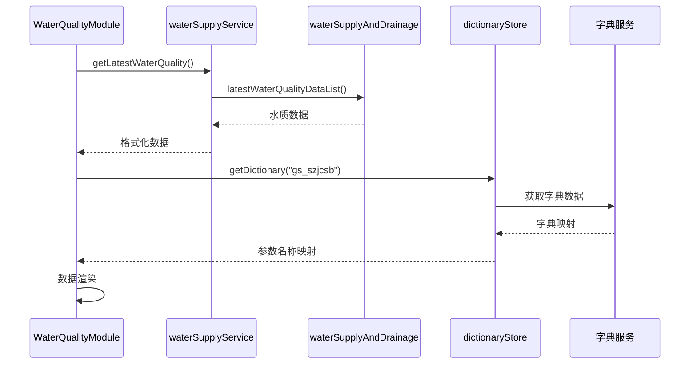

**图表来源**
- [WaterQualityModule.vue](file://src/views/WaterSupply/components/WaterQualityModule.vue#L67-L95)
- [waterSupplyService.ts](file://src/services/waterSupplyService.ts#L52-L56)
- [dictionaryStore.ts](file://src/stores/dictionaryStore.ts#L38-L96)

## 详细组件分析

### UI结构与样式设计

#### 布局架构

组件采用Flexbox布局，实现了灵活的响应式设计：

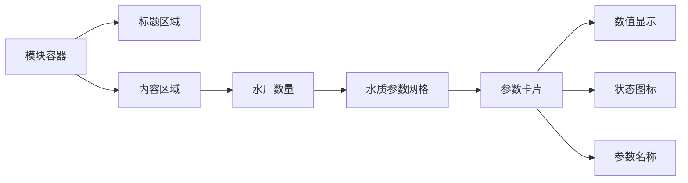

**图表来源**
- [WaterQualityModule.vue](file://src/views/WaterSupply/components/WaterQualityModule.vue#L13-L52)

#### 视觉设计特点

- **渐变文字效果**：使用CSS渐变背景实现动态色彩变化
- **状态指示器**：通过图片和颜色区分正常/异常状态
- **响应式字体**：自适应不同屏幕尺寸的文字大小
- **主题色彩**：采用深色系配色方案，突出专业性和科技感

#### 样式系统

组件使用SCSS预处理器，结合全局变量系统：

| 样式属性 | 值 | 用途 |
|---------|-----|------|
| 主色调 | #1677ff | 交互元素高亮 |
| 成功色 | #10ADC0 | 正常状态标识 |
| 警告色 | #FEAC04 | 警告状态标识 |
| 错误色 | #F75E04 | 异常状态标识 |
| 字体大小 | 28px/30px/36px | 标题/副标题/正文 |
| 间距系统 | 16px/24px/40px | 布局间距 |

**章节来源**
- [WaterQualityModule.vue](file://src/views/WaterSupply/components/WaterQualityModule.vue#L100-L239)
- [variables.scss](file://src/assets/styles/variables.scss#L1-L155)

### 数据处理与转换

#### 数据获取流程

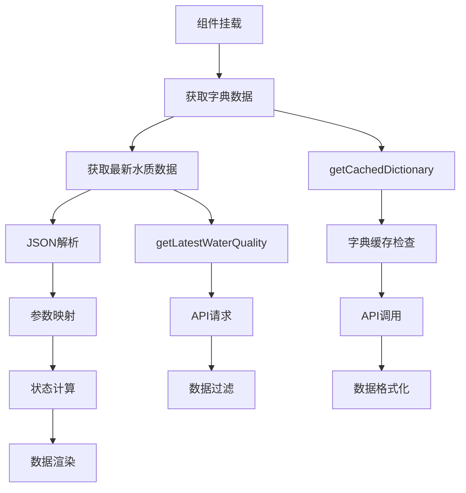

**图表来源**
- [WaterQualityModule.vue](file://src/views/WaterSupply/components/WaterQualityModule.vue#L67-L95)
- [waterSupplyService.ts](file://src/services/waterSupplyService.ts#L52-L56)

#### 数据转换逻辑

组件实现了复杂的数据转换逻辑：

1. **字典映射**：将参数ID映射为人类可读的参数名称
2. **状态判断**：基于阈值判断参数是否处于正常范围
3. **格式化处理**：将原始数据转换为适合UI展示的格式
4. **异步处理**：使用nextTick确保DOM更新时机正确

**章节来源**
- [WaterQualityModule.vue](file://src/views/WaterSupply/components/WaterQualityModule.vue#L67-L95)

## 数据流分析

### 数据流向图

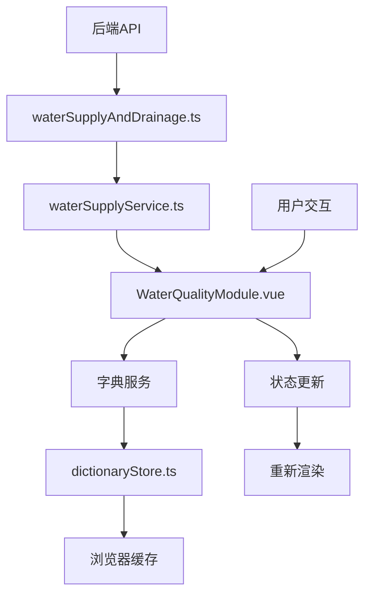

**图表来源**
- [waterSupplyAndDrainage.ts](file://src/api/waterSupplyAndDrainage.ts#L294-L324)
- [waterSupplyService.ts](file://src/services/waterSupplyService.ts#L52-L56)
- [dictionaryService.ts](file://src/services/dictionaryService.ts#L15-L18)

### 数据集成方式

#### 请求频率控制

模块采用懒加载策略，仅在组件挂载时获取数据：

- **首次加载**：组件挂载时触发数据获取
- **缓存策略**：字典数据采用长期缓存机制
- **无轮询**：避免不必要的API调用，降低服务器负载

#### 异常处理机制

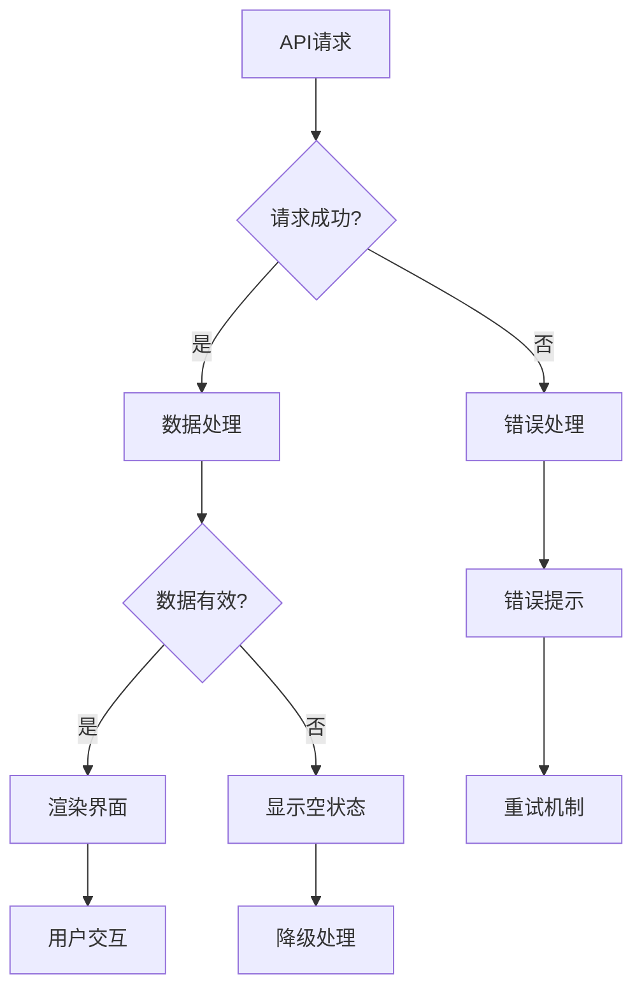

**图表来源**
- [waterSupplyService.ts](file://src/services/waterSupplyService.ts#L52-L56)
- [dictionaryStore.ts](file://src/stores/dictionaryStore.ts#L64-L96)

**章节来源**
- [waterSupplyAndDrainage.ts](file://src/api/waterSupplyAndDrainage.ts#L294-L324)
- [waterSupplyService.ts](file://src/services/waterSupplyService.ts#L52-L56)

## 图表配置系统

### ECharts配置架构

虽然当前WaterQualityModule主要展示静态数据，但系统预留了ECharts图表配置支持：

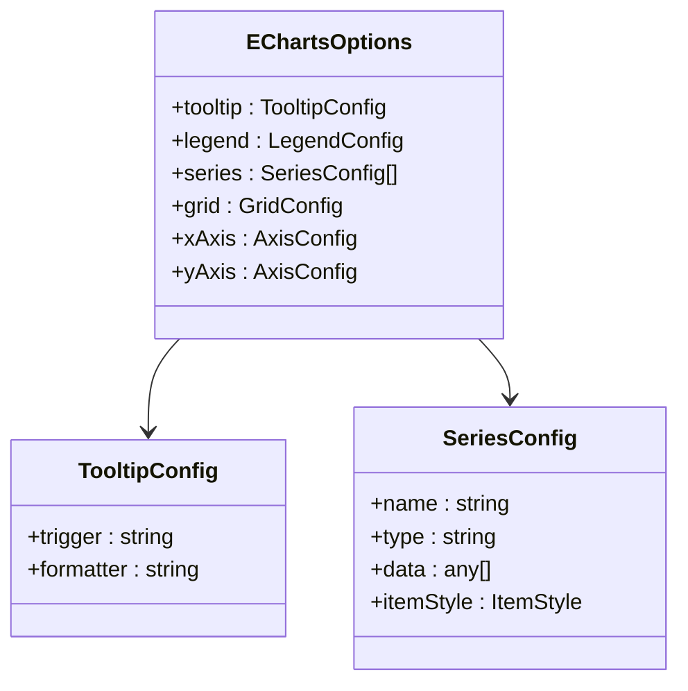

**图表来源**
- [ehcartsOptions.ts](file://src/views/WaterSupply/components/ehcartsOptions.ts#L1-L341)

### 图表类型支持

系统支持多种图表类型，为未来的功能扩展预留空间：

| 图表类型 | 配置文件 | 用途 | 特点 |
|---------|----------|------|------|
| 饼图 | officialWebsiteOption | 材质分布 | 环形显示，视觉效果好 |
| 雷达图 | risksOption | 风险评估 | 多维度对比分析 |
| 仪表盘 | riskRingsOption | 状态监控 | 直观的状态指示 |
| 柱状图 | handledOption | 数量统计 | 对比分析，趋势展示 |

**章节来源**
- [ehcartsOptions.ts](file://src/views/WaterSupply/components/ehcartsOptions.ts#L1-L341)

## API服务集成

### API架构设计

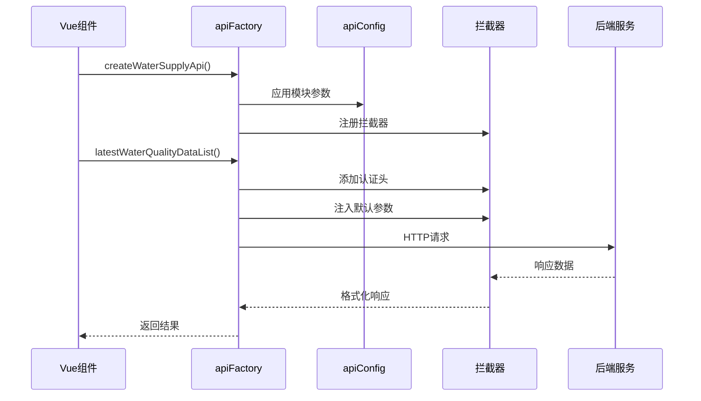

**图表来源**
- [apiFactory.ts](file://src/api/apiFactory.ts#L67-L209)
- [waterSupplyAndDrainage.ts](file://src/api/waterSupplyAndDrainage.ts#L294-L324)

### 请求配置与拦截

#### 拦截器链

系统实现了完整的HTTP请求拦截器链：

1. **请求拦截器**：
   - 添加认证Token
   - 注入业务模块参数
   - 开发环境日志记录

2. **响应拦截器**：
   - 状态码处理
   - 错误消息提示
   - 自动登出处理

#### 错误处理策略

| 错误类型 | 处理方式 | 用户体验 |
|---------|----------|----------|
| 网络错误 | 显示网络提示 | 提示检查网络 |
| 401未授权 | 自动跳转登录 | 重新登录 |
| 403禁止访问 | 显示权限提示 | 无操作 |
| 500服务器错误 | 显示系统错误 | 稍后重试 |
| 业务错误 | 显示具体错误 | 根据提示处理 |

**章节来源**
- [apiFactory.ts](file://src/api/apiFactory.ts#L99-L206)
- [waterSupplyAndDrainage.ts](file://src/api/waterSupplyAndDrainage.ts#L294-L324)

## 字典数据联动机制

### 字典服务架构

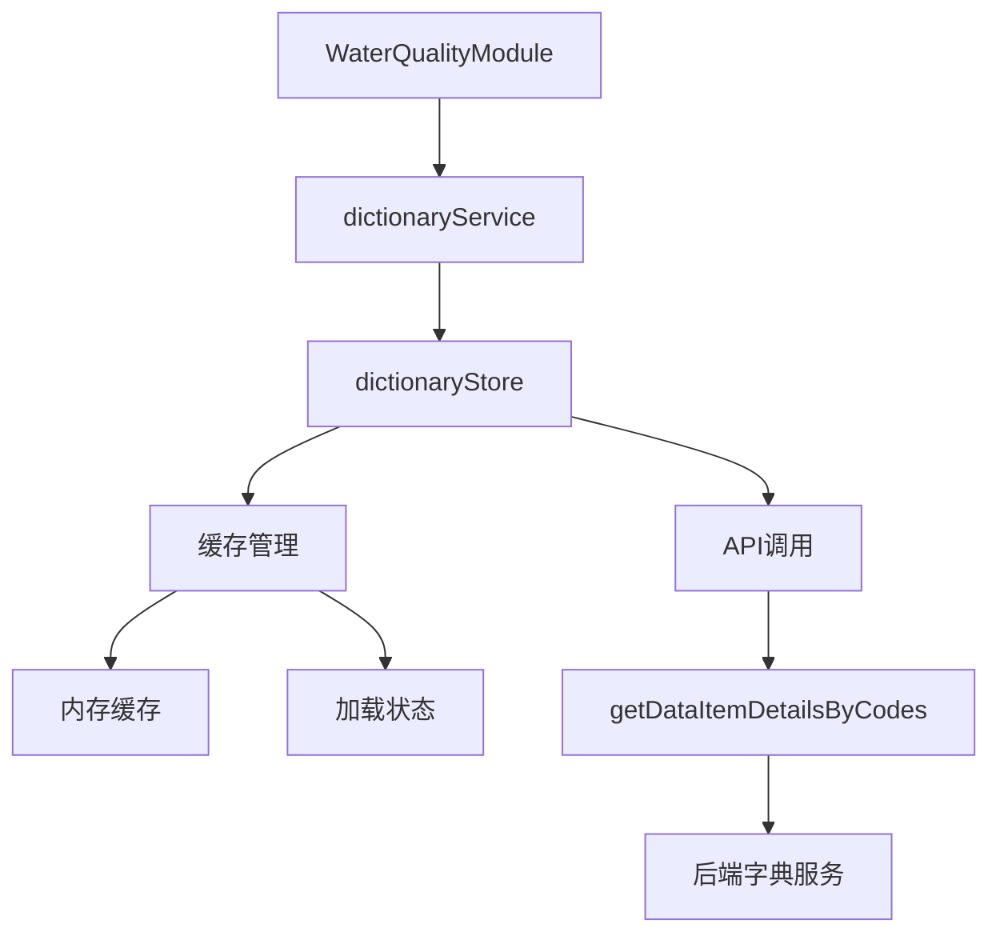

**图表来源**
- [dictionaryService.ts](file://src/services/dictionaryService.ts#L15-L18)
- [dictionaryStore.ts](file://src/stores/dictionaryStore.ts#L26-L222)

### 缓存策略

#### 缓存机制设计

字典数据采用多层缓存策略：

1. **内存缓存**：数据在内存中持久化存储
2. **并发控制**：防止重复请求相同字典数据
3. **超时机制**：支持手动清除缓存
4. **批量加载**：支持一次性加载多个字典

#### 性能优化

- **延迟加载**：按需加载字典数据
- **防抖处理**：避免频繁的字典查询
- **错误恢复**：缓存空数组作为错误兜底

**章节来源**
- [dictionaryService.ts](file://src/services/dictionaryService.ts#L15-L45)
- [dictionaryStore.ts](file://src/stores/dictionaryStore.ts#L38-L222)

## 性能优化策略

### 渲染性能优化

#### 组件渲染优化

1. **懒加载**：仅在需要时加载数据
2. **虚拟滚动**：对于大量数据采用虚拟滚动
3. **防抖节流**：限制频繁的DOM操作
4. **内存管理**：及时清理不需要的引用

#### 数据处理优化

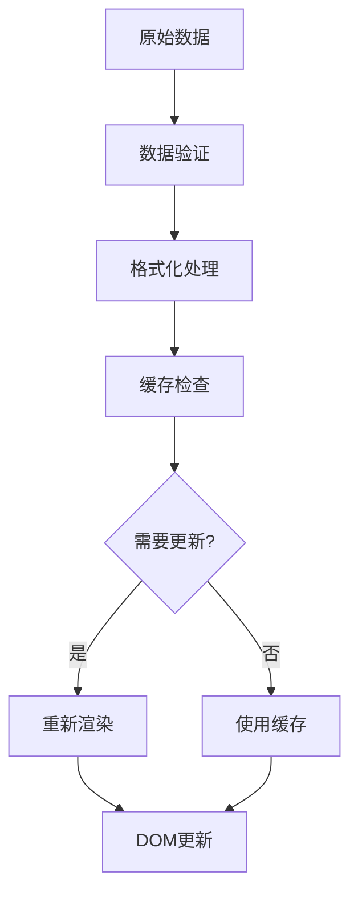

### 网络性能优化

#### 请求优化策略

- **请求合并**：批量获取多个字典数据
- **压缩传输**：启用Gzip压缩
- **CDN加速**：静态资源CDN部署
- **预加载**：关键数据预加载

#### 缓存策略

| 缓存类型 | 生命周期 | 更新策略 | 适用场景 |
|---------|----------|----------|----------|
| 字典缓存 | 长期 | 手动清除 | 静态配置数据 |
| 数据缓存 | 短期 | 自动过期 | 实时监控数据 |
| 图片缓存 | 长期 | 版本控制 | UI资源文件 |

## 故障排除指南

### 常见问题诊断

#### 数据加载问题

**症状**：水质数据无法加载或显示空白

**诊断步骤**：
1. 检查网络连接状态
2. 查看浏览器开发者工具的Network面板
3. 验证API响应状态码
4. 检查字典数据是否正确加载

**解决方案**：
```typescript
// 调试代码示例
console.log('字典数据:', szMap.value);
console.log('水质数据:', waterPlants.value);
```

#### 图表渲染异常

**症状**：图表无法正常显示或显示错误

**诊断方法**：
1. 检查ECharts库是否正确引入
2. 验证图表配置参数
3. 查看浏览器控制台错误信息
4. 确认DOM元素是否存在

#### 数据更新不及时

**症状**：水质数据长时间未更新

**排查流程**：
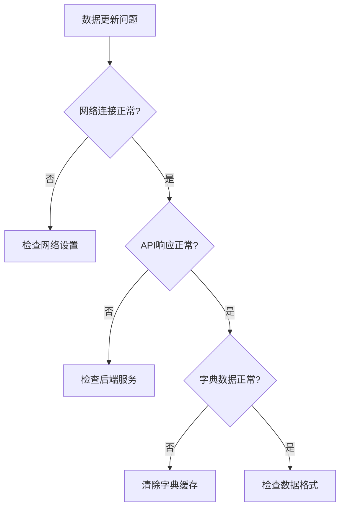

### 调试工具与技巧

#### 开发者工具使用

1. **Vue DevTools**：监控组件状态变化
2. **Network面板**：分析API请求和响应
3. **Console面板**：查看错误日志和调试信息
4. **Performance面板**：分析性能瓶颈

#### 日志记录

系统内置了完善的日志记录机制：

```typescript
// 开发环境日志示例
if ((import.meta as any).env?.DEV) {
  console.log('[API Request]', {
    method: config.method?.toUpperCase(),
    url: config.url,
    params: config.params,
    data: config.data,
  });
}
```

**章节来源**
- [apiFactory.ts](file://src/api/apiFactory.ts#L116-L145)
- [dictionaryStore.ts](file://src/stores/dictionaryStore.ts#L64-L96)

## 总结

供水水质模块是一个设计精良的监控系统组件，具有以下核心优势：

### 技术亮点

1. **模块化架构**：清晰的分层设计，便于维护和扩展
2. **性能优化**：智能缓存机制和懒加载策略
3. **用户体验**：响应式设计和直观的视觉反馈
4. **可扩展性**：预留图表配置接口，支持未来功能扩展

### 最佳实践

- **数据驱动**：基于真实数据的可视化展示
- **错误处理**：完善的异常处理和用户提示机制
- **性能考虑**：合理的缓存策略和资源管理
- **开发体验**：良好的代码组织和调试支持

### 发展方向

1. **图表增强**：集成更多类型的可视化图表
2. **实时更新**：支持WebSocket实现实时数据推送
3. **移动端优化**：进一步提升移动设备上的用户体验
4. **数据分析**：增加数据挖掘和预测分析功能

该模块为城市供水系统的智能化管理提供了坚实的技术基础，通过持续的优化和功能扩展，将为城市管理者提供更加全面和高效的水质监控能力。