# 供水监测模块

<cite>
**本文档引用的文件**
- [index.vue](file://src/views/WaterSupply/index.vue)
- [leftContent.vue](file://src/views/WaterSupply/leftContent.vue)
- [rightContent.vue](file://src/views/WaterSupply/rightContent.vue)
- [OverviewModule.vue](file://src/views/WaterSupply/components/OverviewModule.vue)
- [WaterQualityModule.vue](file://src/views/WaterSupply/components/WaterQualityModule.vue)
- [PipelineModule.vue](file://src/views/WaterSupply/components/PipelineModule.vue)
- [MonitoringEquipmentModule.vue](file://src/views/WaterSupply/components/MonitoringEquipmentModule.vue)
- [RiskHazardModule.vue](file://src/views/WaterSupply/components/RiskHazardModule.vue)
- [EarlyWarningModule.vue](file://src/views/WaterSupply/components/EarlyWarningModule.vue)
- [ehcartsOptions.ts](file://src/views/WaterSupply/components/ehcartsOptions.ts)
- [chartOption.ts](file://src/views/WaterSupply/chartOption.ts)
- [waterSupplyService.ts](file://src/services/waterSupplyService.ts)
- [CommonTable.vue](file://src/components/CommonTable.vue)
</cite>

## 更新摘要
**变更内容**
- 更新了供水管网模块的ECharts配置优化说明，包括颜色方案、图例位置和动画效果改进
- 新增了管道模块材质分布图的详细配置分析
- 补充了图例位置调整和动画效果优化的技术细节

## 目录
1. [概述](#概述)
2. [模块架构](#模块架构)
3. [三模块布局系统](#三模块布局系统)
4. [纵览模块详解](#纵览模块详解)
5. [供水水质模块](#供水水质模块)
6. [供水管网模块](#供水管网模块)
7. [监测设备模块](#监测设备模块)
8. [风险隐患模块](#风险隐患模块)
9. [预警处置模块](#预警处置模块)
10. [图表配置方案](#图表配置方案)
11. [响应式设计实现](#响应式设计实现)
12. [数据集成指南](#数据集成指南)
13. [总结](#总结)

## 概述

供水监测模块是一个基于Vue 3和TypeScript构建的综合性数据可视化系统，专门用于展示供水系统的实时监测数据和管理信息。该模块采用现代化的三列布局架构，集成了多种数据可视化组件，为用户提供全面的供水系统状态监控能力。

### 核心特性

- **三列布局架构**：左侧展示供水概况、水质和管网状态，右侧展示设备监控、风险分析和预警处置
- **实时数据可视化**：集成ECharts图表库，提供丰富的数据展示形式
- **响应式设计**：基于4096×1920基准分辨率的自适应布局
- **模块化组件**：每个功能模块独立封装，便于维护和扩展
- **字典数据驱动**：通过字典服务实现配置化管理

## 模块架构

供水监测模块采用分层架构设计，从上到下包括视图层、组件层和服务层。

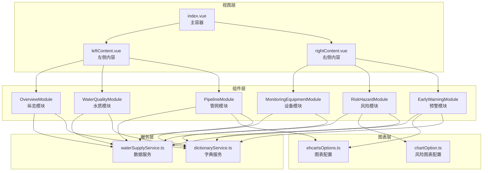

**图表来源**
- [index.vue](file://src/views/WaterSupply/index.vue#L1-L99)
- [leftContent.vue](file://src/views/WaterSupply/leftContent.vue#L1-L29)
- [rightContent.vue](file://src/views/WaterSupply/rightContent.vue#L1-L24)

**章节来源**
- [index.vue](file://src/views/WaterSupply/index.vue#L1-L99)

## 三模块布局系统

供水监测模块采用经典的三列布局架构，左侧三个模块负责供水系统的基础信息展示，右侧三个模块专注于监控和管理功能。

### 布局设计理念

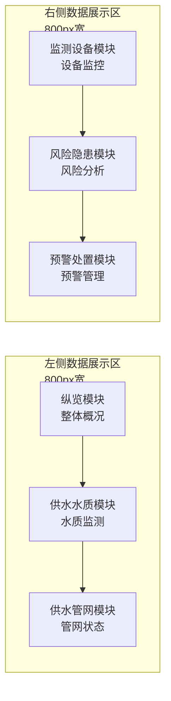

**图表来源**
- [leftContent.vue](file://src/views/WaterSupply/leftContent.vue#L9-L19)
- [rightContent.vue](file://src/views/WaterSupply/rightContent.vue#L8-L13)

### 布局实现细节

左侧布局采用垂直堆叠的方式，确保信息层次清晰：
- **纵览模块**：展示供水系统的基础统计数据
- **供水水质模块**：呈现水质监测指标和状态
- **供水管网模块**：可视化管网材质分布和隐患情况

右侧布局同样采用垂直排列，但更注重监控功能：
- **监测设备模块**：显示设备运行状态和在线率
- **风险隐患模块**：分析风险等级和整改状态
- **预警处置模块**：跟踪预警信息和处置进度

**章节来源**
- [leftContent.vue](file://src/views/WaterSupply/leftContent.vue#L1-L29)
- [rightContent.vue](file://src/views/WaterSupply/rightContent.vue#L1-L24)

## 纵览模块详解

纵览模块作为供水监测的门户，提供系统整体概况的快速浏览功能。该模块通过图标化的数据展示，让用户能够一目了然地了解供水系统的关键指标。

### 数据架构设计

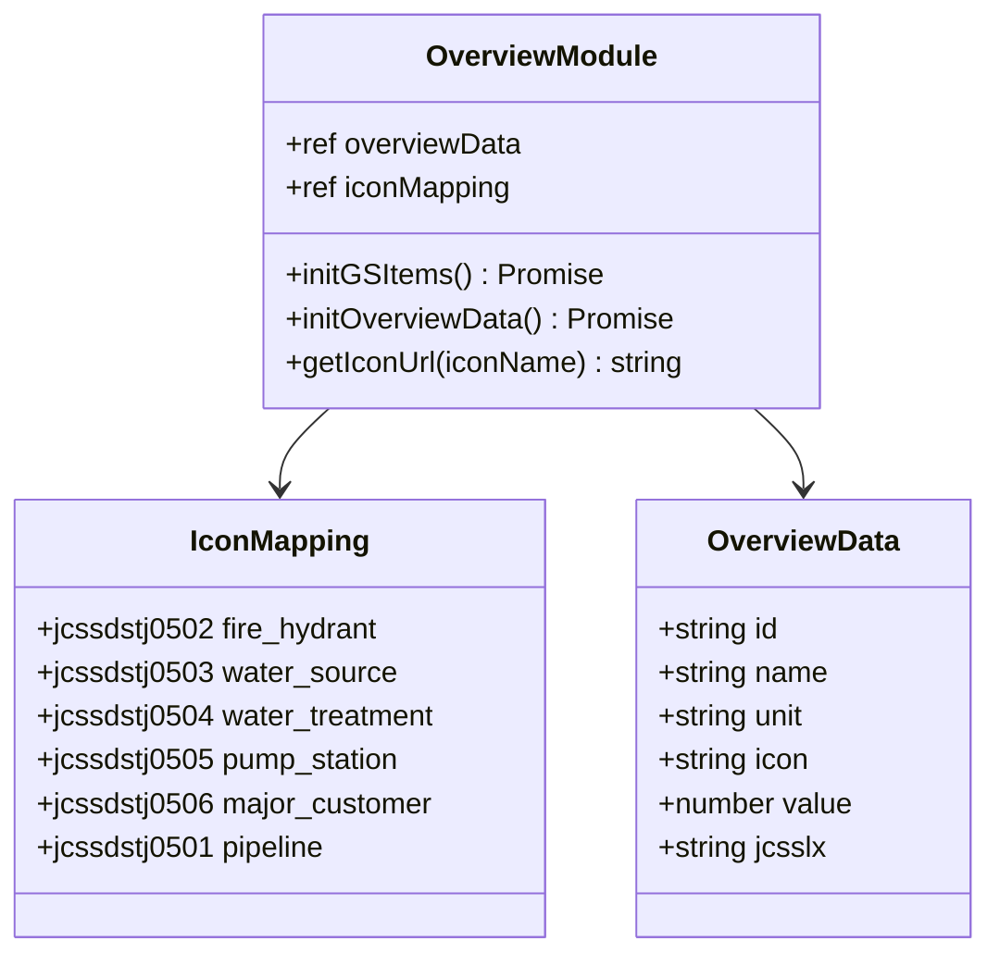

**图表来源**
- [OverviewModule.vue](file://src/views/WaterSupply/components/OverviewModule.vue#L34-L56)
- [OverviewModule.vue](file://src/views/WaterSupply/components/OverviewModule.vue#L70-L89)

### 核心功能实现

纵览模块的核心功能包括：

1. **字典数据初始化**：从字典服务获取基础配置数据
2. **实时数据获取**：动态获取最新的统计数据
3. **图标映射**：将类型代码映射到对应的图标资源
4. **响应式展示**：支持不同屏幕尺寸的自适应布局

### 数据流处理

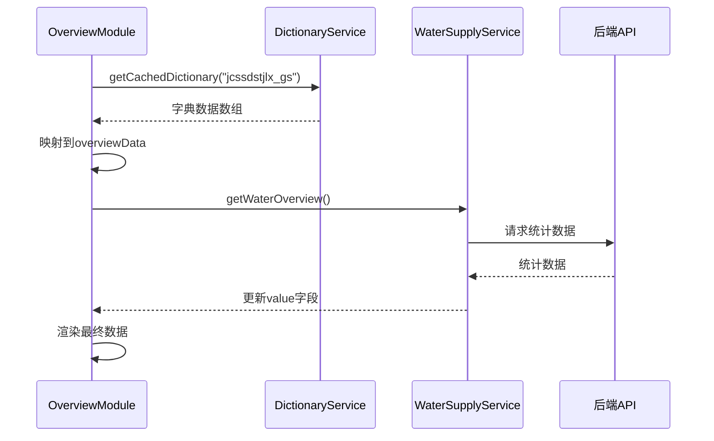

**图表来源**
- [OverviewModule.vue](file://src/views/WaterSupply/components/OverviewModule.vue#L91-L94)

**章节来源**
- [OverviewModule.vue](file://src/views/WaterSupply/components/OverviewModule.vue#L1-L183)

## 供水水质模块

供水水质模块专注于水质监测数据的可视化展示，通过直观的参数图表和状态指示，帮助用户快速掌握供水系统的水质状况。

### 水质监测架构

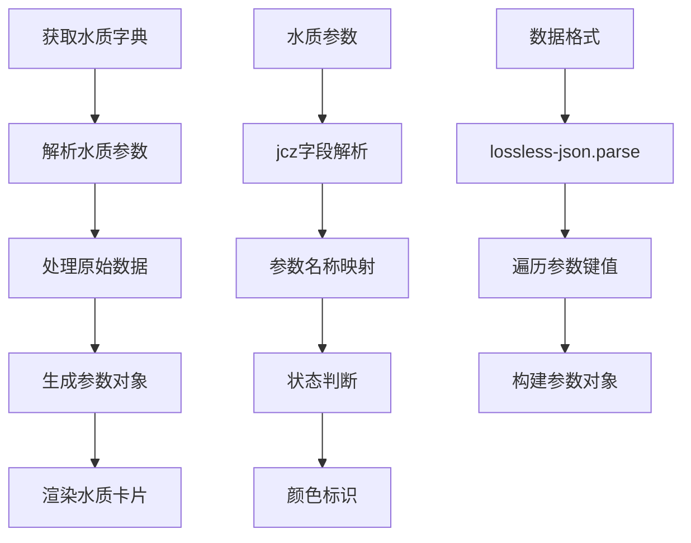

**图表来源**
- [WaterQualityModule.vue](file://src/views/WaterSupply/components/WaterQualityModule.vue#L67-L95)

### 水质参数展示逻辑

水质模块采用卡片式布局，每个水厂对应一个展示卡片：

1. **参数分类**：按照水质监测项目进行分类展示
2. **状态标识**：正常状态显示绿色，异常状态显示橙色
3. **数值展示**：采用渐变文字效果，增强视觉吸引力
4. **单位标注**：明确显示每个参数的计量单位

### 数据处理流程

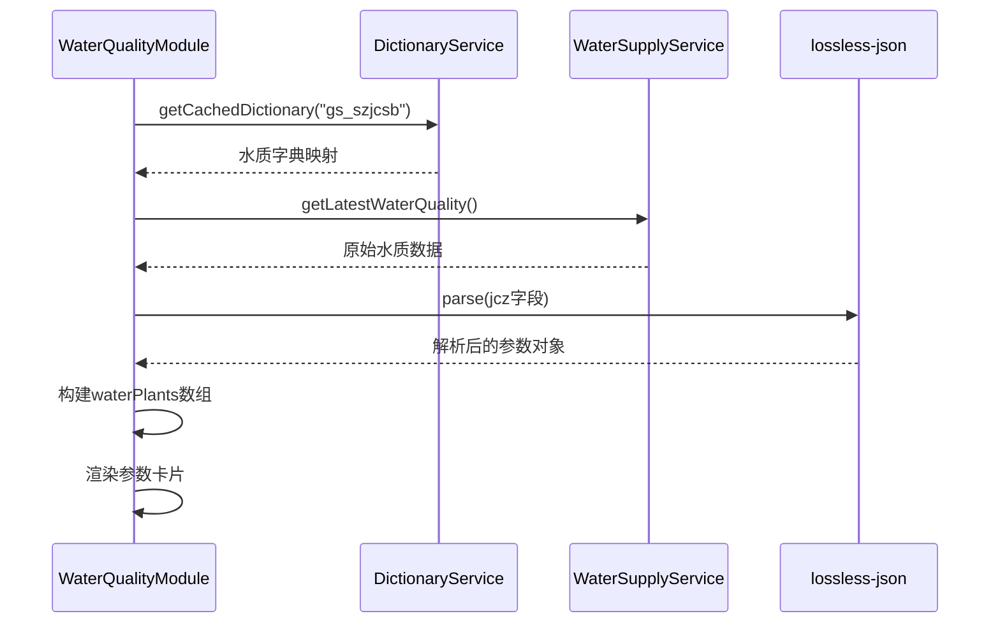

**图表来源**
- [WaterQualityModule.vue](file://src/views/WaterSupply/components/WaterQualityModule.vue#L67-L95)

**章节来源**
- [WaterQualityModule.vue](file://src/views/WaterSupply/components/WaterQualityModule.vue#L1-L269)

## 供水管网模块

供水管网模块是供水监测系统的核心组件之一，负责展示管网状态分析和运行数据可视化。该模块创新性地采用了隐患小球分布图和材质饼图相结合的展示方式。

### 管网状态可视化架构

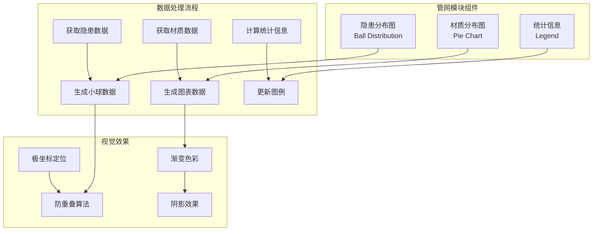

**图表来源**
- [PipelineModule.vue](file://src/views/WaterSupply/components/PipelineModule.vue#L60-L122)
- [PipelineModule.vue](file://src/views/WaterSupply/components/PipelineModule.vue#L125-L223)

### 隐患小球分布算法

管网模块最创新的功能是隐患小球的智能分布算法：

#### 分布算法原理

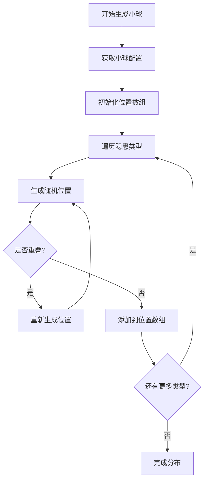

**图表来源**
- [PipelineModule.vue](file://src/views/WaterSupply/components/PipelineModule.vue#L137-L223)

#### 算法参数配置

| 参数名称 | 默认值 | 说明 |
|---------|--------|------|
| serious.size | 104px | 严重隐患小球直径 |
| normal.size | 70px | 一般隐患小球直径 |
| minDistance | 120px | 小球最小间距 |
| maxRadius | 160px | 最大分布半径 |
| minRadius | 60px | 最小分布半径 |

### 材质分布图表

**更新** 管网材质分布图经过全面优化，包括颜色方案、图例位置和动画效果的改进。

#### 颜色方案优化

材质分布图采用专业的渐变色彩方案：

```typescript
// 优化后的颜色配置
colors: ["#5D87AC", "#C3540C", "#4D74FF", "#93DBFF"]
```

#### 图例位置调整

图例采用垂直布局，位于图表左下方：

```typescript
legend: {
  show: true,
  orient: "vertical",
  bottom: "10%",
  left: "10%",
  textStyle: {
    color: "#e4f3ff",
    fontSize: 28,
    fontFamily: "SourceHanSansSC",
    fontWeight: 500,
  }
}
```

#### 动画效果改进

新增弹性动画效果，提升用户体验：

```typescript
animationType: 'scale',
animationEasing: 'elasticOut',
animationDelay: function (idx) {
  return Math.random() * 200;
}
```

#### 高级视觉效果

```typescript
itemStyle: {
  borderRadius: 2,
  borderColor: "rgba(13, 35, 42, 0.8)",
  borderWidth: 2,
  shadowBlur: 10,
  shadowColor: "rgba(93, 135, 172, 0.2)",
},
emphasis: {
  scale: true,
  scaleSize: 8,
  itemStyle: {
    shadowBlur: 20,
    shadowColor: "rgba(93, 135, 172, 0.4)",
    borderWidth: 3,
    borderColor: "#5D87AC",
  },
  label: {
    fontSize: 18,
    fontWeight: 600,
  }
}
```

**章节来源**
- [PipelineModule.vue](file://src/views/WaterSupply/components/PipelineModule.vue#L1-L449)
- [ehcartsOptions.ts](file://src/views/WaterSupply/components/ehcartsOptions.ts#L4-L95)

## 监测设备模块

监测设备模块专注于供水系统中各类监测设备的状态监控，提供设备运行状态的实时统计和分析功能。

### 设备监控架构设计

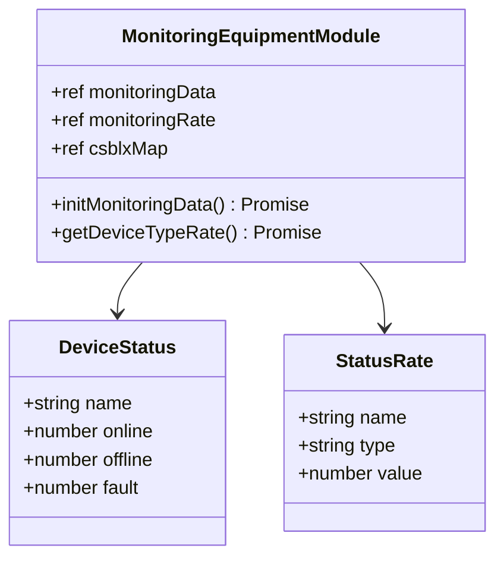

**图表来源**
- [MonitoringEquipmentModule.vue](file://src/views/WaterSupply/components/MonitoringEquipmentModule.vue#L48-L96)

### 在线率统计机制

设备模块实现了多层次的在线率统计：

1. **总体在线率**：计算所有设备的在线比例
2. **故障率统计**：分析设备故障情况
3. **离线率监控**：跟踪设备离线状态

### 设备状态分类

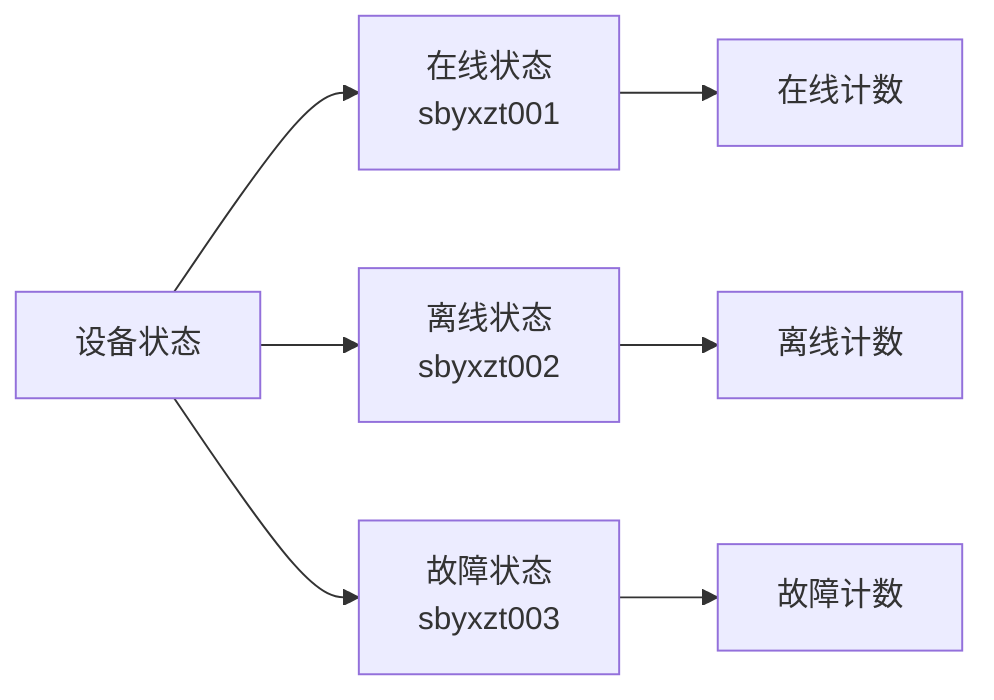

**图表来源**
- [MonitoringEquipmentModule.vue](file://src/views/WaterSupply/components/MonitoringEquipmentModule.vue#L58-L75)

### 数据处理流程

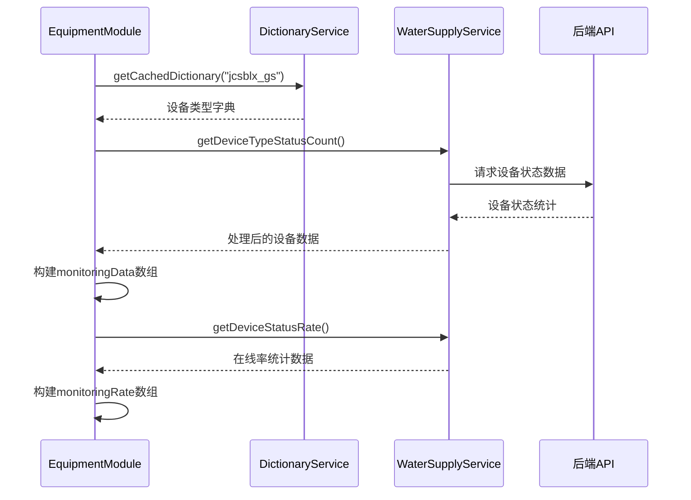

**图表来源**
- [MonitoringEquipmentModule.vue](file://src/views/WaterSupply/components/MonitoringEquipmentModule.vue#L52-L96)

**章节来源**
- [MonitoringEquipmentModule.vue](file://src/views/WaterSupply/components/MonitoringEquipmentModule.vue#L1-L260)

## 风险隐患模块

风险隐患模块是供水监测系统的重要组成部分，负责风险分析模型的实现和隐患排查机制的展示。该模块采用多层环形图和状态统计相结合的方式，提供全面的风险管理视角。

### 风险分析架构

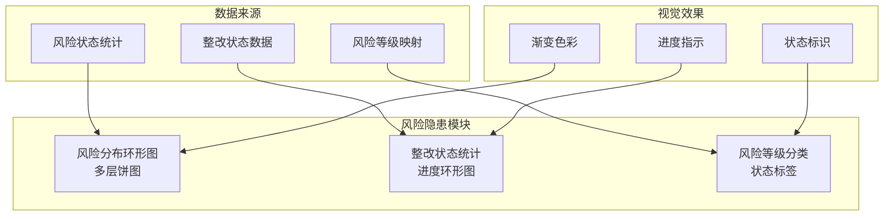

**图表来源**
- [RiskHazardModule.vue](file://src/views/WaterSupply/components/RiskHazardModule.vue#L45-L223)

### 风险等级分类体系

风险隐患模块建立了完善的风险等级分类体系：

| 风险等级 | 英文标识 | 颜色编码 | 状态描述 |
|---------|----------|----------|----------|
| 已消除风险 | rectified | #9bb8c7 | 风险已完全消除 |
| 已监测风险 | monitored | #61E29D | 风险正在持续监测 |
| 巡查管控 | controlled | #F4D982 | 通过巡查进行管控 |
| 未管控 | uncontrolled | #E88D6B | 尚未纳入管控范围 |

### 整改状态追踪

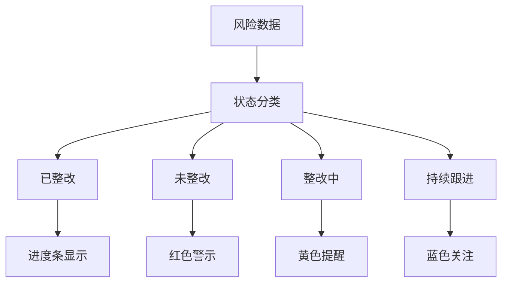

**图表来源**
- [RiskHazardModule.vue](file://src/views/WaterSupply/components/RiskHazardModule.vue#L50-L74)

### 多环形图配置

风险隐患模块使用复杂的多层环形图展示风险分布：

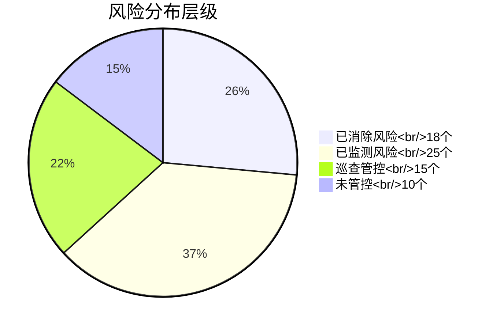

**图表来源**
- [RiskHazardModule.vue](file://src/views/WaterSupply/components/RiskHazardModule.vue#L126-L211)

**章节来源**
- [RiskHazardModule.vue](file://src/views/WaterSupply/components/RiskHazardModule.vue#L1-L421)

## 预警处置模块

预警处置模块是供水监测系统的信息管理中心，负责预警信息的统一管理和处置进度的实时跟踪。该模块采用金字塔式布局和柱状图结合的方式，提供直观的预警数据分析。

### 预警管理系统架构

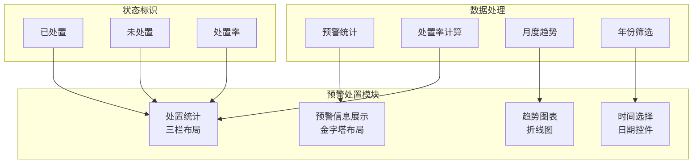

**图表来源**
- [EarlyWarningModule.vue](file://src/views/WaterSupply/components/EarlyWarningModule.vue#L84-L185)

### 预警信息展示逻辑

预警模块采用金字塔式的层次化展示：

1. **前三位预警**：采用醒目的颜色标识
2. **后三位预警**：使用标准配色方案
3. **数量统计**：显示每类预警的具体数量
4. **类型标识**：通过图标和文字明确预警类别

### 处置统计分析

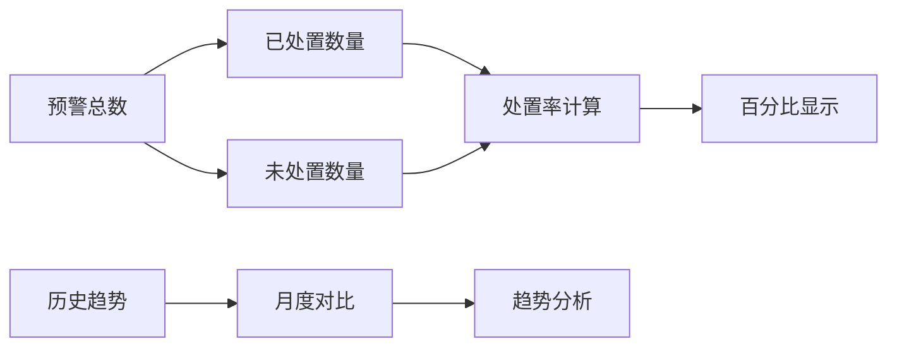

**图表来源**
- [EarlyWarningModule.vue](file://src/views/WaterSupply/components/EarlyWarningModule.vue#L114-L156)

### 图表配置方案

预警模块集成了专业的ECharts配置，支持：

1. **双轴柱状图**：同时展示已处置和未处置数量
2. **折线图**：显示处置率的变化趋势
3. **动态更新**：支持按年份筛选数据
4. **响应式布局**：适应不同屏幕尺寸

**章节来源**
- [EarlyWarningModule.vue](file://src/views/WaterSupply/components/EarlyWarningModule.vue#L1-L423)

## 图表配置方案

供水监测模块的图表配置方案基于ECharts库，提供了丰富而专业的图表选项。ehcartsOptions.ts文件包含了多个精心设计的图表配置模板。

### 图表配置架构

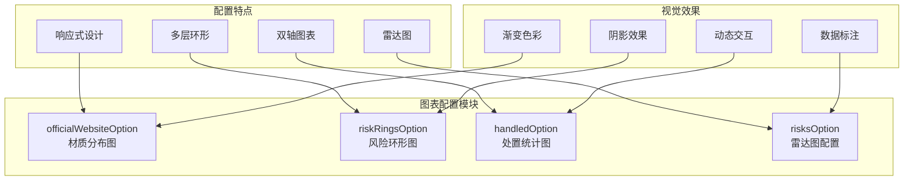

**图表来源**
- [ehcartsOptions.ts](file://src/views/WaterSupply/components/ehcartsOptions.ts#L1-L392)

### 材质分布图配置

**更新** 材质分布图经过全面优化，包括颜色方案、图例位置和动画效果的改进。

材质分布图采用环形饼图展示管网材质占比：

```typescript
// 优化后的材质分布图配置
export const officialWebsiteOption = {
  backgroundColor: 'transparent',
  tooltip: { show: false },
  title: {
    text: "管网\n\n材质",
    left: "30%",
    top: "20%",
    textStyle: {
      color: "#e4f3ff",
      fontSize: 36,
      fontWeight: 600,
      fontFamily: "YouSheBiaoTiHei",
      lineHeight: 32,
    },
    subtextStyle: {
      color: "rgba(228, 243, 255, 0.7)",
      fontSize: 14,
      fontFamily: "SourceHanSansSC",
    },
    itemGap: 8,
  },
  legend: {
    show: true,
    orient: "vertical",
    bottom: "10%",
    left: "10%",
    textStyle: {
      color: "#e4f3ff",
      fontSize: 28,
      fontFamily: "SourceHanSansSC",
      fontWeight: 500,
    },
    itemWidth: 20,
    itemHeight: 20,
    itemGap: 20,
    formatter: function(name) {
      return name;
    }
  },
  series: [{
    name: "管网材质",
    type: "pie",
    radius: ["40%", "55%"],
    center: ["40%", "30%"],
    startAngle: 90,
    padAngle: 1.5,
    clockwise: true,
    label: { show: false },
    labelLine: { show: false },
    itemStyle: {
      borderRadius: 2,
      borderColor: "rgba(13, 35, 42, 0.8)",
      borderWidth: 2,
      shadowBlur: 10,
      shadowColor: "rgba(93, 135, 172, 0.2)",
    },
    data: [
      { value: 38, name: "PE", itemStyle: { color: "#5D87AC" } },
      { value: 40, name: "球墨铸铁", itemStyle: { color: "#C3540C" } },
      { value: 10, name: "PE", itemStyle: { color: "#4D74FF" } },
      { value: 12, name: "球墨铸铁", itemStyle: { color: "#93DBFF" } }
    ],
    emphasis: {
      scale: true,
      scaleSize: 8,
      itemStyle: {
        shadowBlur: 20,
        shadowColor: "rgba(93, 135, 172, 0.4)",
        borderWidth: 3,
        borderColor: "#5D87AC",
      },
      label: {
        fontSize: 18,
        fontWeight: 600,
      }
    },
    animationType: 'scale',
    animationEasing: 'elasticOut',
    animationDelay: function (idx) {
      return Math.random() * 200;
    }
  }],
};
```

### 处置统计图配置

处置统计图使用双轴柱状图展示预警处理情况：

```typescript
// 处置统计图配置
export const handledOption = {
  tooltip: { trigger: "axis" },
  xAxis: { type: "category", data: [] },
  yAxis: [{
    type: "value",
    name: "单位：个",
    max: 50
  }, {
    type: "value",
    name: "单位：%",
    max: 100
  }],
  series: [{
    name: "未处置",
    type: "bar",
    itemStyle: { color: "#f5a623" }
  }, {
    name: "已处置", 
    type: "bar", 
    itemStyle: { color: "#007aff" }
  }, {
    name: "处置率",
    type: "line",
    smooth: true,
    yAxisIndex: 1
  }]
};
```

### 风险环形图配置

风险环形图采用多层环形结构展示风险等级分布：

```typescript
// 风险环形图配置
export const riskRingsOption = {
  series: [{
    type: "gauge",
    radius: "70%",
    splitNumber: 8,
    axisLine: {
      lineStyle: {
        color: [
          [0.1, "#00bfff"],
          [0.5, "#ffcc00"],
          [1, "#ff4500"]
        ]
      }
    }
  }]
};
```

**章节来源**
- [ehcartsOptions.ts](file://src/views/WaterSupply/components/ehcartsOptions.ts#L1-L392)

## 响应式设计实现

供水监测模块采用基于4096×1920基准分辨率的响应式设计，通过ResponsiveWrapper组件实现自适应布局。

### 响应式设计架构

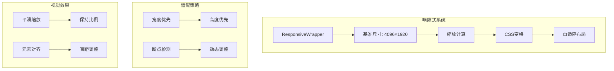

### 布局适配机制

模块采用以下适配策略：

1. **基准分辨率**：以4096×1920为设计基准
2. **等比缩放**：保持元素间的相对比例
3. **动态计算**：根据实际屏幕尺寸计算缩放因子
4. **平滑过渡**：使用CSS3 transform实现流畅的缩放效果

### 组件适配策略

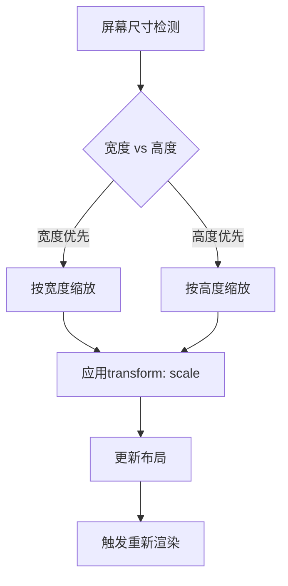

**章节来源**
- [index.vue](file://src/views/WaterSupply/index.vue#L16-L28)

## 数据集成指南

供水监测模块的数据集成遵循标准化的服务层架构，通过waterSupplyService.ts提供统一的数据访问接口。

### 数据服务架构

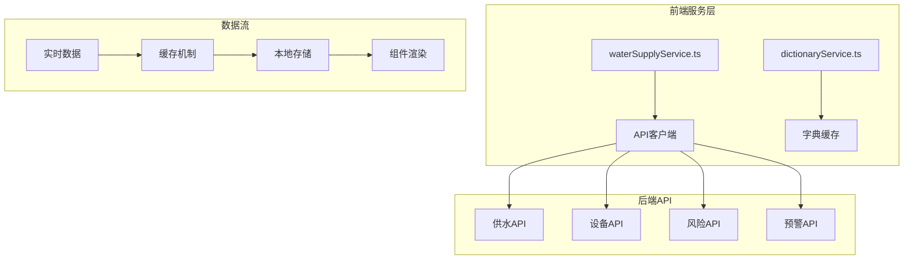

**图表来源**
- [waterSupplyService.ts](file://src/services/waterSupplyService.ts#L1-L186)

### 数据获取流程

```mermaid
sequenceDiagram
participant C as 组件
participant WS as WaterSupplyService
participant AC as API客户端
participant BS as 后端服务
participant DC as DictionaryCache
C->>DC : getCachedDictionary()
DC-->>C : 缓存字典数据
C->>WS : getWaterOverview()
WS->>AC : createWaterSupplyApi()
AC->>BS : 发送HTTP请求
BS-->>AC : 返回JSON数据
AC-->>WS : 处理响应数据
WS-->>C : 返回格式化数据
```

**图表来源**
- [index.vue](file://src/views/WaterSupply/index.vue#L46-L64)

### 字典数据管理

模块通过字典服务实现配置化管理：

| 字典类型 | 用途 | 数据来源 |
|---------|------|----------|
| jcssdstjlx_gs | 纵览模块配置 | 基础设施类型定义 |
| gs_szjcsb | 水质监测参数 | 水质检测项目映射 |
| gwcz | 管网材质 | 管材类型分类 |
| yhlx_gs | 隐患类型 | 风险分类标准 |
| jcsblx_gs | 设备类型 | 监测设备分类 |
| zgzt | 整改状态 | 风险整改状态 |
| yjlx_gs | 预警类型 | 预警信息分类 |

### 实时数据更新

模块支持多种数据更新策略：

1. **定时刷新**：设置固定的时间间隔自动更新
2. **事件驱动**：监听特定事件触发数据更新
3. **手动刷新**：提供用户手动刷新按钮
4. **增量更新**：只更新变化的数据部分

**章节来源**
- [waterSupplyService.ts](file://src/services/waterSupplyService.ts#L1-L186)

## 总结

供水监测模块是一个功能完整、架构清晰的综合性数据可视化系统。通过三列布局架构，模块实现了供水系统全方位的监控和管理功能。

### 核心优势

1. **模块化设计**：每个功能模块独立封装，便于维护和扩展
2. **数据驱动**：基于字典服务的配置化管理模式
3. **可视化丰富**：集成多种图表类型，满足不同数据展示需求
4. **响应式布局**：适应不同屏幕尺寸的自适应设计
5. **实时性强**：支持实时数据更新和动态交互

### 技术特色

- **创新算法**：隐患小球分布算法确保信息展示的科学性和美观性
- **专业图表**：基于ECharts的专业图表配置方案，经过全面优化
- **缓存机制**：字典数据缓存提升系统性能
- **类型安全**：TypeScript提供完整的类型安全保障

### 应用价值

供水监测模块不仅提供了直观的数据展示界面，更重要的是建立了一套完整的供水系统监控体系，为管理者提供了决策支持工具，有助于提高供水系统的安全性和可靠性。

该模块的成功实施展示了现代Web技术在政府信息化建设中的应用潜力，为类似项目的开发提供了宝贵的参考经验。

**更新说明** 本次更新重点优化了供水管网模块的ECharts配置，包括颜色方案、图例位置和动画效果的全面改进，提升了用户体验和视觉效果。