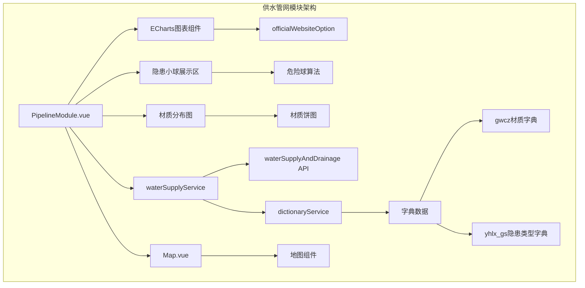
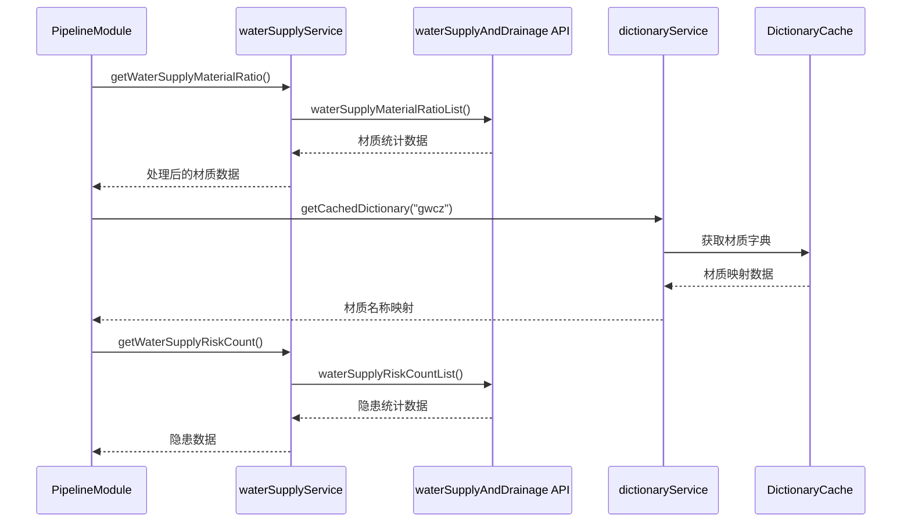
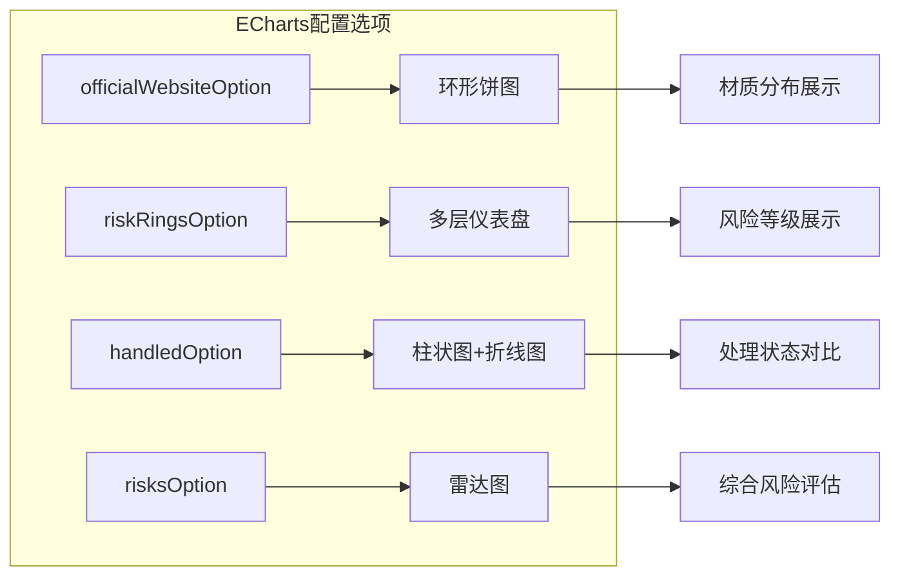
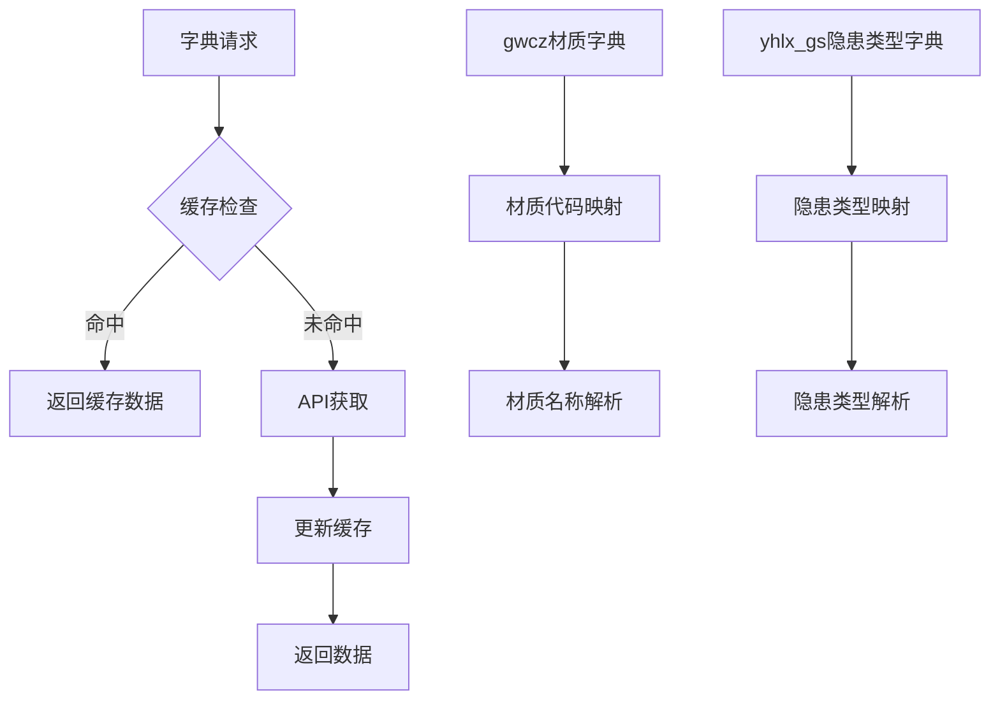
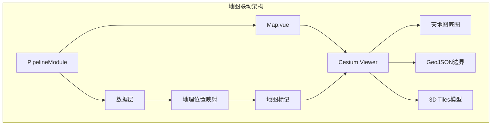
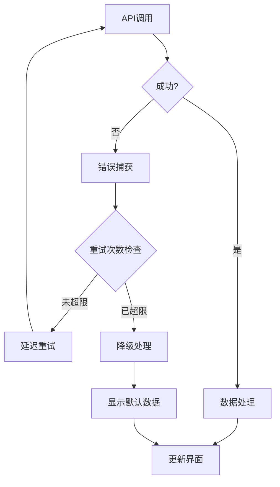
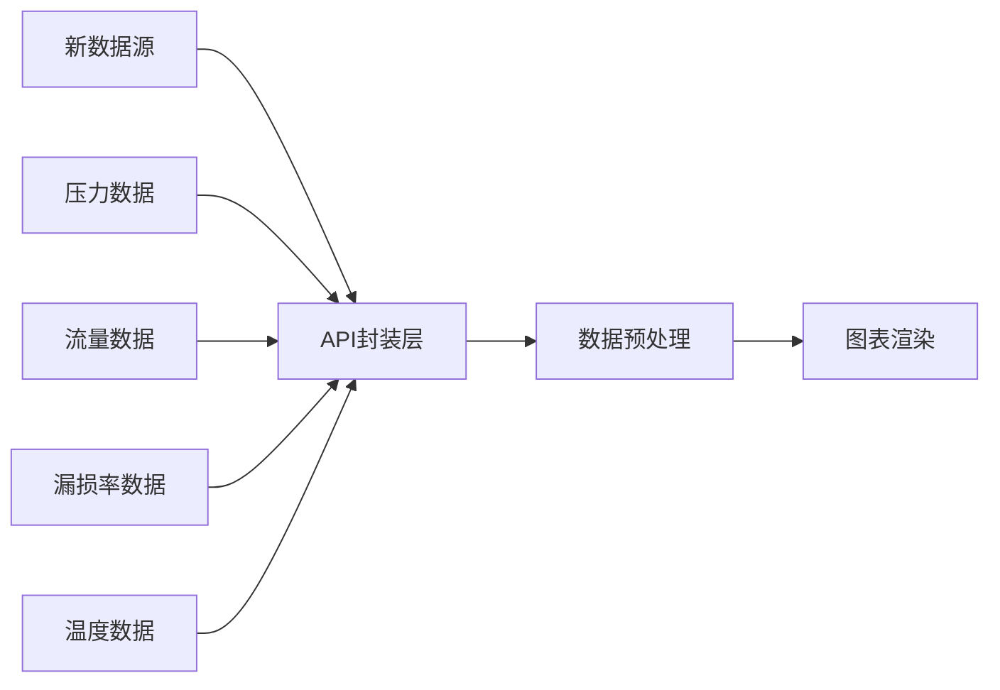

# 供水管网模块

<cite>
**本文档中引用的文件**
- [PipelineModule.vue](file://src/views/WaterSupply/components/PipelineModule.vue)
- [ehcartsOptions.ts](file://src/views/WaterSupply/components/ehcartsOptions.ts)
- [waterSupplyAndDrainage.ts](file://src/api/waterSupplyAndDrainage.ts)
- [waterSupplyService.ts](file://src/services/waterSupplyService.ts)
- [dictionaryService.ts](file://src/services/dictionaryService.ts)
- [WATER_SUPPLY_MODULE_README.md](file://WATER_SUPPLY_MODULE_README.md)
- [Map.vue](file://src/mapComponents/Map.vue)
</cite>

## 目录
1. [概述](#概述)
2. [模块架构](#模块架构)
3. [核心功能特性](#核心功能特性)
4. [数据集成与API调用](#数据集成与api调用)
5. [可视化组件分析](#可视化组件分析)
6. [状态管理与字典数据](#状态管理与字典数据)
7. [地图组件联动机制](#地图组件联动机制)
8. [性能优化与错误处理](#性能优化与错误处理)
9. [扩展开发指南](#扩展开发指南)
10. [故障排除](#故障排除)

## 概述

供水管网模块（PipelineModule.vue）是政府Dashboard系统中供水专项模块的核心组件，专门负责展示供水管网的状态分析和运行数据可视化。该模块集成了管网压力、流量、漏损率等关键运行参数，并通过多种图表和状态指示器提供直观的数据展示。

### 主要功能
- **管网材质分析**：展示供水管道材质分布情况
- **隐患风险统计**：可视化供水管网安全隐患分布
- **实时状态监控**：提供管网运行状态的实时监控
- **多维度数据分析**：支持压力、流量、漏损率等参数分析
- **地图联动展示**：与地图组件深度集成，实现空间数据可视化

## 模块架构

**图表来源**
- [PipelineModule.vue](file://src/views/WaterSupply/components/PipelineModule.vue#L60-L232)
- [waterSupplyService.ts](file://src/services/waterSupplyService.ts#L1-L162)

**章节来源**
- [PipelineModule.vue](file://src/views/WaterSupply/components/PipelineModule.vue#L1-L398)

## 核心功能特性

### 1. 管网材质分布可视化

模块采用环形饼图展示供水管道材质分布，支持多种材质类型的分类统计：

- **材质类型识别**：通过字典数据映射材质代码到中文名称
- **颜色编码系统**：每种材质对应特定颜色，便于视觉区分
- **比例计算**：实时计算各类材质在总管网中的占比

### 2. 隐患风险分布展示

采用创新的"隐患小球"设计，实现风险点的空间分布可视化：

- **智能布局算法**：防止小球重叠，确保信息可读性
- **分级显示系统**：严重隐患（≥3个）和一般隐患区别展示
- **动态位置生成**：基于极坐标随机分布，美观且实用

### 3. 实时数据更新机制

- **异步数据加载**：使用Vue的nextTick确保DOM更新时机
- **错误重试机制**：API调用失败时的降级处理
- **加载状态管理**：清晰的加载进度和错误提示

**章节来源**
- [PipelineModule.vue](file://src/views/WaterSupply/components/PipelineModule.vue#L86-L228)

## 数据集成与API调用

### API调用架构

**图表来源**
- [PipelineModule.vue](file://src/views/WaterSupply/components/PipelineModule.vue#L92-L98)
- [waterSupplyService.ts](file://src/services/waterSupplyService.ts#L144-L147)
- [dictionaryService.ts](file://src/services/dictionaryService.ts#L15-L17)

### 关键API接口

| API接口 | 功能描述 | 参数要求 | 返回数据格式 |
|---------|----------|----------|--------------|
| `waterSupplyMaterialRatioList` | 获取供水管线材质占比 | 市州编码、区划编码、专项编码 | 材质统计数组 |
| `waterSupplyRiskCountList` | 获取供水管网隐患统计 | 市州编码、区划编码、专项编码 | 隐患统计数组 |
| `rateListList` | 获取设备运行状态比例 | 市州编码、区划编码、专项编码 | 设备状态数据 |
| `latestWaterQualityDataList` | 获取最新水质监测数据 | 市州编码、区划编码、专项编码 | 水质监测数据 |

### 错误处理与重试机制

模块实现了完善的错误处理机制：

- **网络异常处理**：API调用失败时的降级策略
- **数据验证**：对返回数据进行完整性检查
- **用户友好提示**：友好的错误信息展示

**章节来源**
- [waterSupplyAndDrainage.ts](file://src/api/waterSupplyAndDrainage.ts#L663-L692)
- [waterSupplyService.ts](file://src/services/waterSupplyService.ts#L144-L147)

## 可视化组件分析

### ECharts配置详解

模块使用官方提供的ECharts配置模板，支持多种图表类型：

**图表来源**
- [ehcartsOptions.ts](file://src/views/WaterSupply/components/ehcartsOptions.ts#L1-L341)

### 隐患小球算法实现

隐患小球采用智能布局算法，确保视觉效果和信息密度的最佳平衡：

- **极坐标随机分布**：避免小球重叠的数学算法
- **层级显示系统**：严重隐患和一般隐患的视觉区分
- **动态尺寸调整**：根据隐患数量调整小球大小

**章节来源**
- [PipelineModule.vue](file://src/views/WaterSupply/components/PipelineModule.vue#L125-L228)

## 状态管理与字典数据

### 字典数据管理系统

**图表来源**
- [dictionaryService.ts](file://src/services/dictionaryService.ts#L15-L17)
- [PipelineModule.vue](file://src/views/WaterSupply/components/PipelineModule.vue#L92-L98)

### 字典数据应用

模块通过字典数据实现数据的语义化展示：

- **gwcz材质字典**：将技术代码转换为中文描述
- **yhlx_gs隐患类型字典**：标准化隐患分类名称
- **实时映射解析**：运行时的数据语义化转换

**章节来源**
- [PipelineModule.vue](file://src/views/WaterSupply/components/PipelineModule.vue#L92-L108)
- [dictionaryService.ts](file://src/services/dictionaryService.ts#L1-L45)

## 地图组件联动机制

### 地图集成架构

虽然当前PipelineModule主要专注于数据可视化，但具备与地图组件的深度集成潜力：

**图表来源**
- [Map.vue](file://src/mapComponents/Map.vue#L1-L200)

### 联动机制设计

- **数据驱动的地图更新**：管网数据变化时自动更新地图标记
- **空间查询支持**：基于地理位置的管网数据筛选
- **三维可视化**：支持管网的三维立体展示

**章节来源**
- [Map.vue](file://src/mapComponents/Map.vue#L1-L200)

## 性能优化与错误处理

### 性能优化策略

1. **异步数据加载**：使用nextTick确保DOM更新时机
2. **内存管理**：及时清理不需要的计算结果
3. **渲染优化**：减少不必要的重新渲染
4. **缓存机制**：字典数据的本地缓存

### 错误处理机制

### 常见问题解决方案

| 问题类型 | 症状表现 | 解决方案 | 预防措施 |
|----------|----------|----------|----------|
| 数据延迟 | 图表显示空白 | 增加重试机制 | 设置合理的超时时间 |
| 字典缺失 | 材质名称显示代码 | 提供默认值映射 | 完善字典缓存策略 |
| 布局重叠 | 隐患小球相互遮挡 | 优化布局算法 | 增加间距参数 |
| 内存泄漏 | 页面卡顿 | 及时清理定时器 | 使用生命周期钩子 |

**章节来源**
- [PipelineModule.vue](file://src/views/WaterSupply/components/PipelineModule.vue#L125-L228)

## 扩展开发指南

### 新增管网分析维度

要扩展支持新的管网分析维度，可以按照以下步骤进行：

1. **API接口扩展**：在waterSupplyService中添加新的数据获取方法
2. **图表配置**：在ehcartsOptions中添加对应的图表配置
3. **数据处理**：在PipelineModule中添加相应的数据处理逻辑
4. **样式适配**：调整CSS样式以适应新的展示需求

### 自定义图表类型

支持的图表类型扩展：

- **新增图表类型**：在ehcartsOptions中添加新的图表配置
- **自定义布局**：扩展模板结构以支持新的展示形式
- **交互功能**：添加图表间的联动交互

### 数据源扩展

## 故障排除

### 常见问题诊断

1. **图表不显示**
   - 检查数据是否正确加载
   - 验证ECharts初始化是否成功
   - 确认DOM元素是否存在

2. **隐患小球重叠**
   - 调整DANGER_BALL_CONFIG.minDistance参数
   - 增加maxAttempts尝试次数
   - 优化布局算法参数

3. **字典数据缺失**
   - 检查字典服务是否正常工作
   - 验证网络连接状态
   - 查看浏览器控制台错误信息

### 调试技巧

- **启用详细日志**：在开发环境中开启详细的控制台输出
- **断点调试**：在关键函数处设置断点进行逐步调试
- **数据验证**：检查API返回数据的完整性和格式

### 性能监控

- **加载时间监控**：记录各个API调用的响应时间
- **内存使用监控**：定期检查内存使用情况
- **渲染性能监控**：监控图表渲染的帧率

**章节来源**
- [PipelineModule.vue](file://src/views/WaterSupply/components/PipelineModule.vue#L225-L228)

## 结论

供水管网模块是一个功能完善、架构清晰的数据可视化组件，它成功地将复杂的管网数据转化为直观的图形展示。通过合理的架构设计、完善的错误处理机制和优秀的用户体验，该模块为供水系统的监控和管理提供了强有力的技术支撑。

模块的扩展性设计使其能够轻松适应新的分析需求，而其与地图组件的潜在集成能力则为未来的空间数据分析奠定了基础。随着供水系统的不断发展，该模块将继续发挥重要作用，为城市管理者提供准确、及时的管网状态信息。