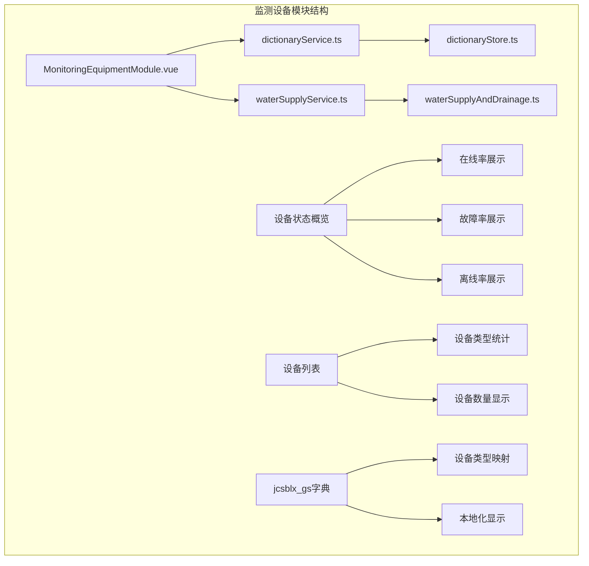
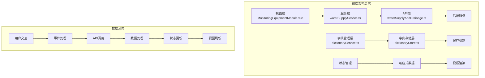
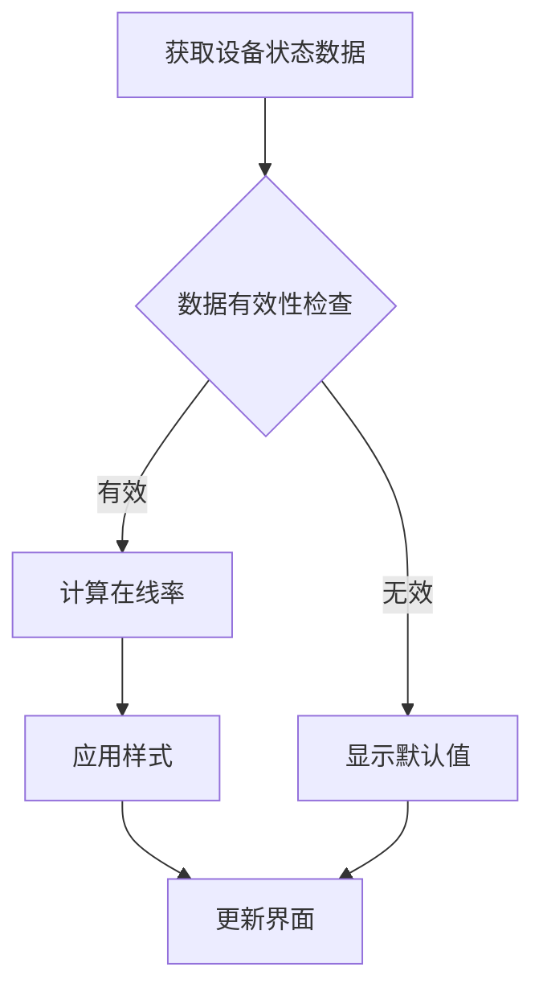
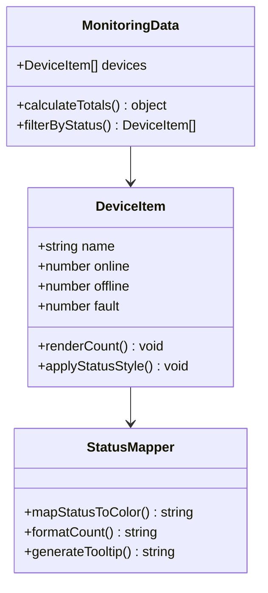
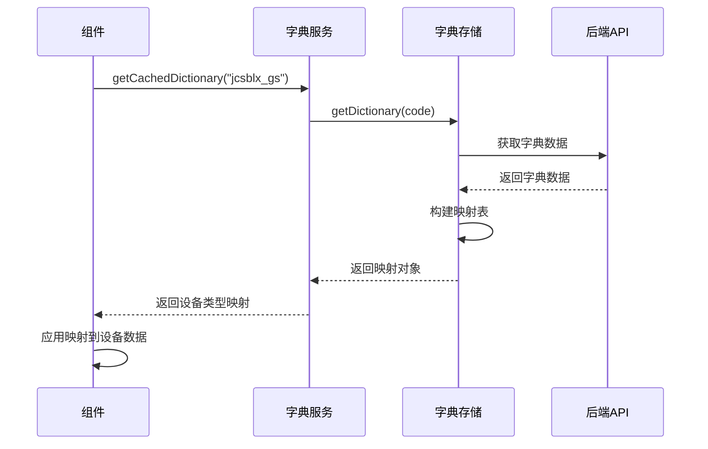
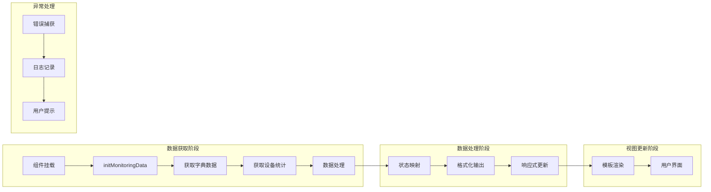
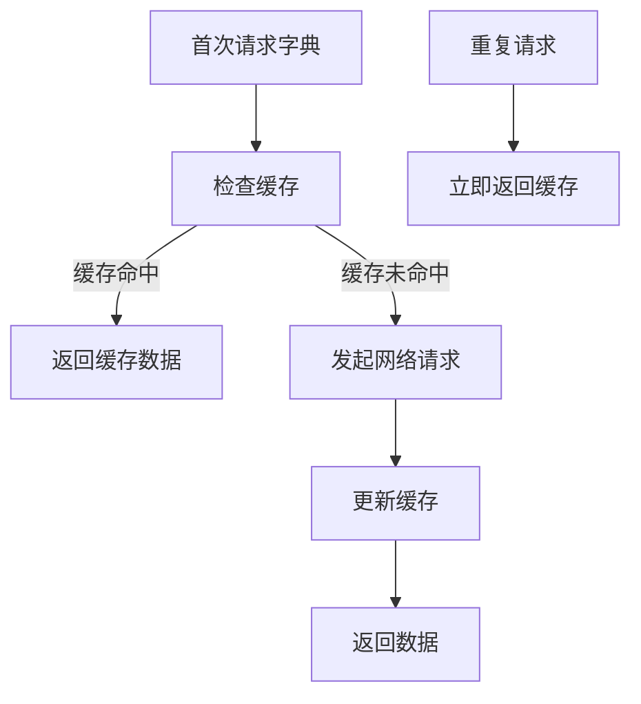
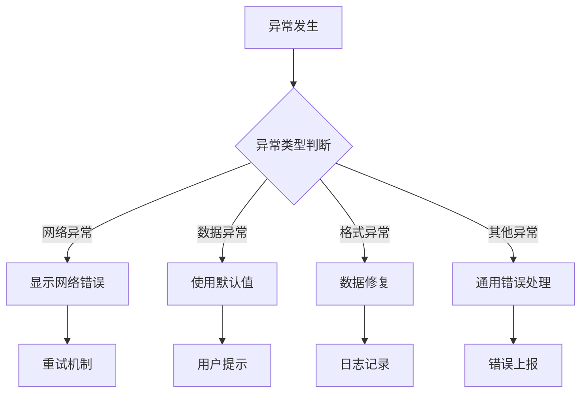

# 监测设备模块

<cite>
**本文档引用的文件**
- [MonitoringEquipmentModule.vue](file://src/views/WaterSupply/components/MonitoringEquipmentModule.vue)
- [waterSupplyService.ts](file://src/services/waterSupplyService.ts)
- [dictionaryService.ts](file://src/services/dictionaryService.ts)
- [dictionaryStore.ts](file://src/stores/dictionaryStore.ts)
- [waterSupplyAndDrainage.ts](file://src/api/waterSupplyAndDrainage.ts)
- [MonitoringDeviceModule.vue](file://src/views/gasModule/components/MonitoringDeviceModule.vue)
- [MonitoringDialog.vue](file://src/views/gasModule/components/map/MonitoringDialog.vue)
</cite>

## 目录
1. [概述](#概述)
2. [项目结构](#项目结构)
3. [核心组件分析](#核心组件分析)
4. [架构概览](#架构概览)
5. [详细组件分析](#详细组件分析)
6. [数据流分析](#数据流分析)
7. [性能优化措施](#性能优化措施)
8. [故障排查指南](#故障排查指南)
9. [总结](#总结)

## 概述

监测设备模块是政府Dashboard系统中供水模块的核心组件之一，负责展示各类水质监测设备、压力传感器、流量计等设备的实时状态信息。该模块通过与后端服务的交互，提供设备在线率、故障率、离线率等关键指标的可视化展示，并支持设备状态的动态更新和异常处理。

### 主要功能特性

- **设备状态概览**：展示设备的在线率、故障率、离线率等关键指标
- **设备列表展示**：按设备类型分类显示设备数量统计
- **字典数据映射**：通过jcsblx_gs字典实现设备类型的本地化显示
- **实时数据更新**：支持设备状态的实时刷新和更新
- **异常处理机制**：完善的错误捕获和用户提示机制

## 项目结构

监测设备模块采用Vue 3 Composition API开发，遵循组件化设计原则，主要文件组织结构如下：

**图表来源**
- [MonitoringEquipmentModule.vue](file://src/views/WaterSupply/components/MonitoringEquipmentModule.vue#L1-L247)
- [waterSupplyService.ts](file://src/services/waterSupplyService.ts#L1-L162)

**章节来源**
- [MonitoringEquipmentModule.vue](file://src/views/WaterSupply/components/MonitoringEquipmentModule.vue#L1-L50)

## 核心组件分析

### MonitoringEquipmentModule组件

MonitoringEquipmentModule是监测设备模块的主要组件，负责设备状态的展示和管理。该组件采用Composition API模式，实现了响应式的数据绑定和状态管理。

#### 核心数据结构

组件维护了以下核心数据状态：

- `csblxMap`：设备类型字典映射表
- `monitoringData`：设备状态统计数据
- `monitoringRate`：设备运行状态比率

#### 初始化流程

组件初始化过程包括以下关键步骤：

1. **字典数据加载**：从jcsblx_gs字典获取设备类型映射关系
2. **设备状态统计**：调用API获取各设备类型的在线、离线、故障状态数量
3. **状态比率计算**：计算设备的整体运行状态比率

**章节来源**
- [MonitoringEquipmentModule.vue](file://src/views/WaterSupply/components/MonitoringEquipmentModule.vue#L48-L76)

## 架构概览

监测设备模块采用分层架构设计，清晰分离了表现层、业务逻辑层和数据访问层：

**图表来源**
- [waterSupplyService.ts](file://src/services/waterSupplyService.ts#L1-L50)
- [dictionaryService.ts](file://src/services/dictionaryService.ts#L1-L45)

## 详细组件分析

### 设备状态概览组件

设备状态概览部分展示了三个关键指标：在线率、故障率和离线率。每个指标都采用了视觉化的展示方式，通过不同的颜色和图标来区分设备状态。

#### 在线率展示机制

**图表来源**
- [MonitoringEquipmentModule.vue](file://src/views/WaterSupply/components/MonitoringEquipmentModule.vue#L78-L91)

#### 设备列表渲染逻辑

设备列表采用网格布局，每种设备类型占据一个单元格，显示该类型设备的在线、离线和故障数量：

**图表来源**
- [MonitoringEquipmentModule.vue](file://src/views/WaterSupply/components/MonitoringEquipmentModule.vue#L19-L34)

**章节来源**
- [MonitoringEquipmentModule.vue](file://src/views/WaterSupply/components/MonitoringEquipmentModule.vue#L19-L34)

### 字典数据映射机制

设备类型映射是通过jcsblx_gs字典实现的，该字典包含了所有设备类型的本地化名称。映射过程采用高效的键值对结构，确保快速的查找和显示转换。

#### 映射构建流程

**图表来源**
- [dictionaryService.ts](file://src/services/dictionaryService.ts#L15-L18)
- [dictionaryStore.ts](file://src/stores/dictionaryStore.ts#L38-L92)

**章节来源**
- [MonitoringEquipmentModule.vue](file://src/views/WaterSupply/components/MonitoringEquipmentModule.vue#L52-L57)

### 服务调用逻辑

waterSupplyService提供了两个核心API接口，用于获取设备状态信息：

#### getDeviceStatusRate函数

该函数用于获取设备的整体运行状态比率，返回在线率、故障率、离线率等统计数据。

#### getDeviceTypeStatusCount函数

该函数获取按设备类型分类的详细状态统计，包括每种设备类型的在线、离线、故障数量。

**章节来源**
- [waterSupplyService.ts](file://src/services/waterSupplyService.ts#L27-L46)

## 数据流分析

监测设备模块的数据流遵循单向数据流原则，确保数据的一致性和可预测性：

**图表来源**
- [MonitoringEquipmentModule.vue](file://src/views/WaterSupply/components/MonitoringEquipmentModule.vue#L52-L76)

### 数据获取流程

数据获取采用异步处理模式，确保不会阻塞UI线程：

1. **字典数据预加载**：在设备统计之前先加载设备类型映射
2. **并行数据获取**：同时获取多个相关的统计数据
3. **数据验证**：对返回的数据进行有效性检查
4. **错误恢复**：提供默认值和错误处理机制

**章节来源**
- [MonitoringEquipmentModule.vue](file://src/views/WaterSupply/components/MonitoringEquipmentModule.vue#L52-L96)

## 性能优化措施

### 字典缓存机制

为了提高性能，系统实现了多层缓存机制：

#### 单次字典加载

**图表来源**
- [dictionaryStore.ts](file://src/stores/dictionaryStore.ts#L38-L92)

#### 批量字典处理

系统支持批量获取多个字典数据，减少网络请求次数：

- **并发请求**：同时处理多个字典的获取请求
- **去重处理**：避免重复请求相同的字典数据
- **超时控制**：设置合理的请求超时时间

### 内存优化策略

1. **懒加载**：只在需要时加载字典数据
2. **及时清理**：不再使用的字典数据及时从内存中移除
3. **数据压缩**：对大型字典数据进行适当的压缩存储

**章节来源**
- [dictionaryStore.ts](file://src/stores/dictionaryStore.ts#L103-L194)

## 故障排查指南

### 常见问题及解决方案

#### 设备状态不同步

**问题现象**：设备状态显示不准确，与实际状态不符

**排查步骤**：
1. 检查网络连接是否正常
2. 验证API接口返回的数据格式
3. 确认字典映射是否正确
4. 检查数据更新频率设置

**解决方案**：
- 实现数据一致性校验机制
- 添加手动刷新按钮
- 增加数据版本控制

#### 数据丢失问题

**问题现象**：设备统计数据突然消失或显示为空

**排查步骤**：
1. 检查后端服务是否正常运行
2. 验证API接口的可用性
3. 查看浏览器控制台错误信息
4. 检查网络代理设置

**解决方案**：
- 实现数据持久化存储
- 添加数据备份机制
- 提供离线模式支持

#### 性能问题

**问题现象**：页面加载缓慢，响应延迟

**排查步骤**：
1. 分析网络请求耗时
2. 检查字典数据大小
3. 评估DOM渲染复杂度
4. 监控内存使用情况

**解决方案**：
- 优化数据查询逻辑
- 实现虚拟滚动
- 减少不必要的重新渲染

### 异常处理策略

系统实现了多层次的异常处理机制：

**图表来源**
- [MonitoringEquipmentModule.vue](file://src/views/WaterSupply/components/MonitoringEquipmentModule.vue#L52-L96)

**章节来源**
- [MonitoringEquipmentModule.vue](file://src/views/WaterSupply/components/MonitoringEquipmentModule.vue#L52-L96)

## 总结

监测设备模块是一个功能完整、架构清晰的前端组件，成功实现了供水系统中设备状态的可视化展示。该模块具有以下特点：

### 技术优势

1. **模块化设计**：采用Vue 3 Composition API，代码结构清晰，易于维护
2. **性能优化**：实现了字典缓存、数据懒加载等优化措施
3. **异常处理**：建立了完善的错误处理和恢复机制
4. **用户体验**：提供直观的视觉反馈和及时的状态更新

### 功能完整性

- 支持多种设备类型的统计和展示
- 提供实时的状态更新机制
- 实现了灵活的字典映射系统
- 具备良好的扩展性和可维护性

### 改进建议

1. **增加实时推送**：考虑引入WebSocket实现实时数据更新
2. **增强筛选功能**：添加更复杂的设备筛选和排序功能
3. **移动端适配**：优化移动设备上的显示效果
4. **数据导出**：提供设备数据的导出功能

该模块为政府Dashboard系统提供了可靠的设备监控能力，为城市供水系统的智能化管理奠定了坚实基础。