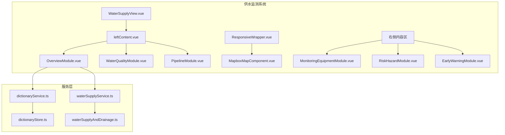
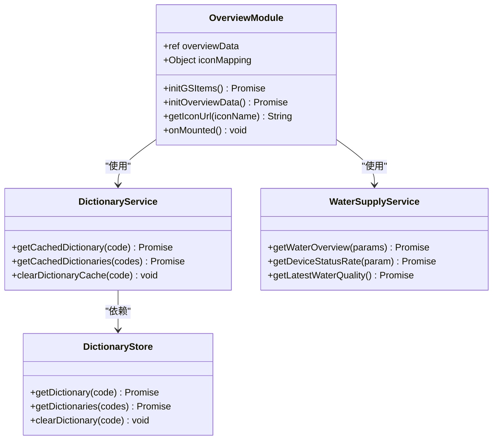
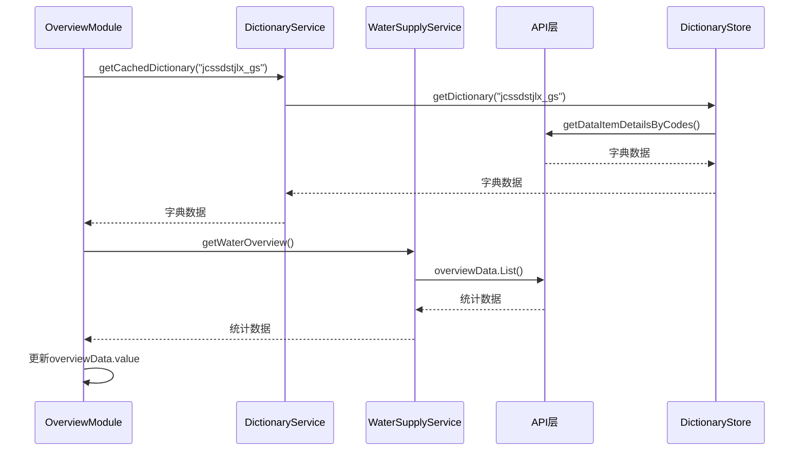
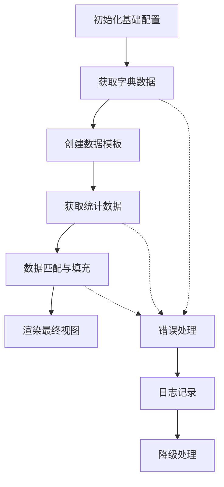
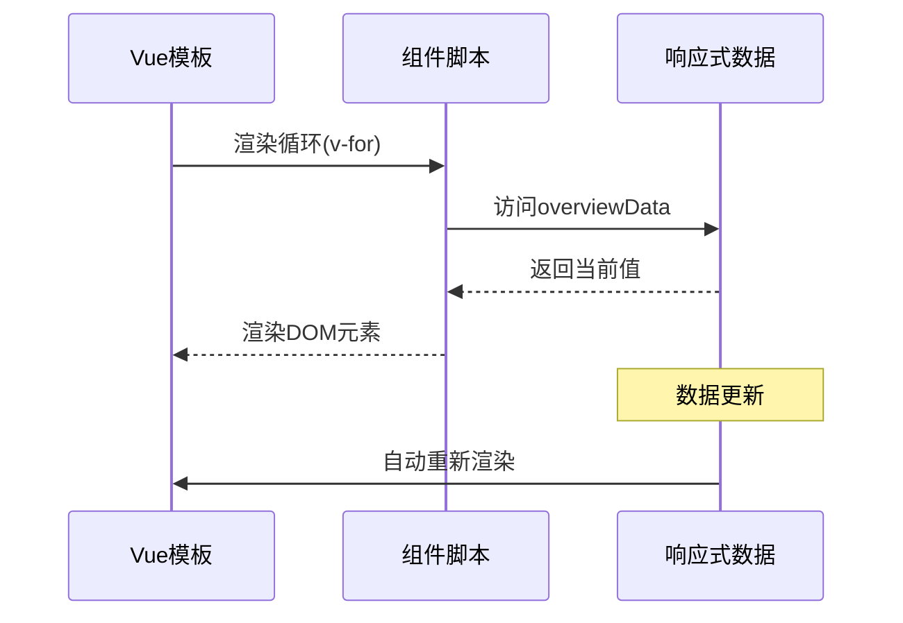
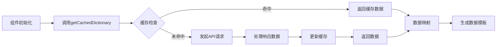
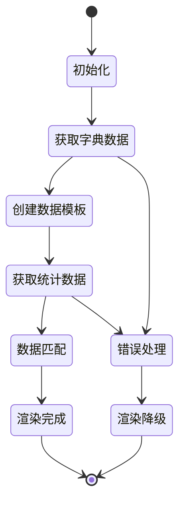

# 纵览模块

<cite>
**本文档引用的文件**
- [OverviewModule.vue](file://src/views/WaterSupply/components/OverviewModule.vue)
- [leftContent.vue](file://src/views/WaterSupply/leftContent.vue)
- [WATER_SUPPLY_MODULE_README.md](file://WATER_SUPPLY_MODULE_README.md)
- [dictionaryService.ts](file://src/services/dictionaryService.ts)
- [waterSupplyService.ts](file://src/services/waterSupplyService.ts)
- [dictionaryStore.ts](file://src/stores/dictionaryStore.ts)
- [waterSupplyAndDrainage.ts](file://src/api/waterSupplyAndDrainage.ts)
</cite>

## 目录
1. [简介](#简介)
2. [项目结构](#项目结构)
3. [核心组件](#核心组件)
4. [架构概览](#架构概览)
5. [详细组件分析](#详细组件分析)
6. [数据绑定机制](#数据绑定机制)
7. [字典服务交互](#字典服务交互)
8. [响应式容器渲染](#响应式容器渲染)
9. [使用示例](#使用示例)
10. [扩展指南](#扩展指南)
11. [故障排除](#故障排除)
12. [总结](#总结)

## 简介

纵览模块（OverviewModule.vue）是供水监测系统中的核心概况展示组件，负责向用户呈现供水系统的整体运行状况。该模块采用Vue 3 Composition API构建，通过数据聚合的方式展示关键指标统计、系统健康状态和实时运行摘要，为决策者提供全面的供水系统视图。

作为供水专项模块的重要组成部分，纵览模块不仅展示了供水基础设施的各类统计数据，还通过直观的视觉设计帮助用户快速理解系统的运行状态和关键指标。

## 项目结构

纵览模块在供水监测系统中的组织结构体现了清晰的分层架构设计：



**图表来源**
- [leftContent.vue](file://src/views/WaterSupply/leftContent.vue#L1-L34)
- [OverviewModule.vue](file://src/views/WaterSupply/components/OverviewModule.vue#L1-L170)

**章节来源**
- [leftContent.vue](file://src/views/WaterSupply/leftContent.vue#L1-L34)
- [WATER_SUPPLY_MODULE_README.md](file://WATER_SUPPLY_MODULE_README.md#L1-L115)

## 核心组件

纵览模块的核心功能围绕以下几个关键组件展开：

### 组件层次结构



**图表来源**
- [OverviewModule.vue](file://src/views/WaterSupply/components/OverviewModule.vue#L25-L95)
- [dictionaryService.ts](file://src/services/dictionaryService.ts#L1-L45)
- [waterSupplyService.ts](file://src/services/waterSupplyService.ts#L1-L162)

**章节来源**
- [OverviewModule.vue](file://src/views/WaterSupply/components/OverviewModule.vue#L25-L95)
- [dictionaryService.ts](file://src/services/dictionaryService.ts#L1-L45)

## 架构概览

纵览模块采用了现代化的前端架构模式，结合了Vue 3的响应式编程和TypeScript的类型安全特性：



**图表来源**
- [OverviewModule.vue](file://src/views/WaterSupply/components/OverviewModule.vue#L44-L94)
- [dictionaryService.ts](file://src/services/dictionaryService.ts#L15-L18)
- [waterSupplyService.ts](file://src/services/waterSupplyService.ts#L15-L21)

## 详细组件分析

### 组件结构与设计目标

纵览模块的设计目标是提供一个简洁而强大的数据概览界面，主要特点包括：

1. **模块化设计**：每个数据项独立展示，便于维护和扩展
2. **响应式布局**：适配不同屏幕尺寸，确保在大屏展示中的最佳效果
3. **视觉一致性**：统一的样式规范和交互体验
4. **数据驱动**：完全基于数据动态生成内容

### 数据聚合展示机制

模块通过以下机制实现数据聚合展示：



**图表来源**
- [OverviewModule.vue](file://src/views/WaterSupply/components/OverviewModule.vue#L44-L94)

### 关键指标统计

纵览模块展示的供水系统关键指标包括：

| 指标类型 | 字典编码 | 描述 | 单位 |
|---------|---------|------|------|
| 市政消火栓 | jcssdstj0502 | 市政消火栓总数 | 个 |
| 水源地 | jcssdstj0503 | 水源地数量 | 个 |
| 水厂 | jcssdstj0504 | 水厂数量 | 座 |
| 供水泵站 | jcssdstj0505 | 供水泵站数量 | 座 |
| 供水大户 | jcssdstj0506 | 供水大用户数量 | 户 |
| 供水管网 | jcssdstj0501 | 供水管网总长度 | 公里 |

**章节来源**
- [OverviewModule.vue](file://src/views/WaterSupply/components/OverviewModule.vue#L34-L41)
- [waterSupplyAndDrainage.ts](file://src/api/waterSupplyAndDrainage.ts#L148-L199)

## 数据绑定机制

纵览模块采用了Vue 3的响应式数据绑定机制，确保数据变化能够实时反映在界面上：

### 响应式数据结构

```typescript
// 响应式数据定义
const overviewData = ref([]);

// 数据项结构
interface OverviewItem {
  id: string;
  name: string;
  unit: string;
  icon: string;
  value: number | null;
  jcsslx: string;
}
```

### 数据绑定流程



**图表来源**
- [OverviewModule.vue](file://src/views/WaterSupply/components/OverviewModule.vue#L8-L19)

**章节来源**
- [OverviewModule.vue](file://src/views/WaterSupply/components/OverviewModule.vue#L31-L32)

## 字典服务交互

纵览模块与字典服务的交互体现了现代前端应用中数据管理的最佳实践：

### 字典数据获取流程



**图表来源**
- [dictionaryService.ts](file://src/services/dictionaryService.ts#L15-L18)
- [dictionaryStore.ts](file://src/stores/dictionaryStore.ts#L38-L95)

### 字典缓存策略

字典服务实现了智能的缓存机制：

1. **双重缓存**：内存缓存 + 异步持久化
2. **并发控制**：防止重复请求同一字典
3. **超时机制**：避免无限等待
4. **错误恢复**：提供降级方案

**章节来源**
- [dictionaryService.ts](file://src/services/dictionaryService.ts#L1-L45)
- [dictionaryStore.ts](file://src/stores/dictionaryStore.ts#L1-L222)

## 响应式容器渲染

纵览模块在ResponsiveWrapper容器中的渲染行为体现了现代Web应用的响应式设计理念：

### 渲染生命周期



**图表来源**
- [OverviewModule.vue](file://src/views/WaterSupply/components/OverviewModule.vue#L91-L94)

### 样式适配机制

模块采用SCSS预处理器实现灵活的样式管理：

- **弹性布局**：使用flex-wrap实现自动换行
- **间距控制**：统一的gap值确保视觉一致性
- **图片适配**：object-fit确保图标完美显示
- **渐变文字**：CSS渐变实现动态文字效果

**章节来源**
- [OverviewModule.vue](file://src/views/WaterSupply/components/OverviewModule.vue#L98-L168)

## 使用示例

### 基本使用方法

纵览模块作为独立组件可以直接在父组件中使用：

```vue
<!-- 在leftContent.vue中使用 -->
<template>
  <div class="left-content">
    <OverviewModule />
    <!-- 其他模块 -->
  </div>
</template>
```

### 自定义配置示例

开发者可以通过修改图标映射来定制显示内容：

```typescript
// 自定义图标映射
const customIconMapping = {
  ...iconMapping,
  new_type: "custom_icon",
};

// 修改数据模板生成逻辑
const createCustomData = (rawData) => {
  return rawData.map(item => ({
    ...item,
    icon: customIconMapping[item.type] || "default_icon"
  }));
};
```

### 扩展数据字段

为了支持更复杂的数据展示需求，可以扩展数据结构：

```typescript
interface ExtendedOverviewItem extends OverviewItem {
  trend?: number;        // 趋势变化
  lastUpdated?: string;  // 最后更新时间
  status?: string;       // 状态标识
  percentage?: number;   // 百分比
}
```

**章节来源**
- [leftContent.vue](file://src/views/WaterSupply/leftContent.vue#L11-L13)
- [OverviewModule.vue](file://src/views/WaterSupply/components/OverviewModule.vue#L34-L56)

## 扩展指南

### 集成真实API数据源

根据WATER_SUPPLY_MODULE_README.md中的建议，集成真实API数据源需要以下步骤：

1. **配置API客户端**：确保waterSupplyAndDrainage.ts中的API配置正确
2. **实现数据转换**：将API响应数据转换为组件所需格式
3. **错误处理**：添加适当的错误处理和重试机制
4. **性能优化**：考虑数据缓存和分页加载

### 状态管理集成

推荐使用Pinia状态管理：

```typescript
// 新建waterSupplyStore.ts
import { defineStore } from 'pinia';

export const useWaterSupplyStore = defineStore('waterSupply', {
  state: () => ({
    overviewData: [],
    loading: false,
    error: null
  }),
  actions: {
    async fetchOverviewData() {
      this.loading = true;
      try {
        const data = await getWaterOverview();
        this.overviewData = data;
      } catch (error) {
        this.error = error;
      } finally {
        this.loading = false;
      }
    }
  }
});
```

### 实时数据更新

实现WebSocket连接以支持实时数据更新：

```typescript
// WebSocket连接管理
const setupRealtimeUpdates = () => {
  const ws = new WebSocket('wss://api.example.com/realtime');
  
  ws.onmessage = (event) => {
    const newData = JSON.parse(event.data);
    updateOverviewData(newData);
  };
  
  return () => ws.close();
};
```

**章节来源**
- [WATER_SUPPLY_MODULE_README.md](file://WATER_SUPPLY_MODULE_README.md#L92-L103)
- [waterSupplyService.ts](file://src/services/waterSupplyService.ts#L1-L162)

## 故障排除

### 常见问题及解决方案

#### 1. 数据加载延迟

**问题描述**：纵览模块数据加载缓慢，影响用户体验

**解决方案**：
- 检查网络连接和API响应时间
- 实现数据预加载机制
- 添加加载状态指示器
- 优化字典数据缓存策略

```typescript
// 加载状态管理
const isLoading = ref(true);
const loadTimeout = setTimeout(() => {
  isLoading.value = false;
}, 5000); // 5秒超时
```

#### 2. 统计数据不一致

**问题描述**：字典数据和统计数据不匹配

**解决方案**：
- 验证数据匹配逻辑的准确性
- 添加数据完整性检查
- 实现数据同步机制

```typescript
// 数据匹配验证
const validateDataMatch = (dictionary, statistics) => {
  const dictTypes = new Set(dictionary.map(item => item.f_ItemValue));
  const statTypes = new Set(statistics.map(item => item.jcsslx));
  
  const missingInStats = [...dictTypes].filter(type => !statTypes.has(type));
  const missingInDict = [...statTypes].filter(type => !dictTypes.has(type));
  
  return { missingInStats, missingInDict };
};
```

#### 3. 图标资源加载失败

**问题描述**：图标无法正确显示

**解决方案**：
- 检查图标文件路径
- 实现图标加载失败的降级处理
- 添加默认图标

```typescript
// 图标加载失败处理
const getIconUrl = (iconName) => {
  try {
    return new URL(
      `../../../assets/img/waterSupply/${iconName}.png`,
      import.meta.url
    ).href;
  } catch (error) {
    console.warn(`图标 ${iconName} 加载失败，使用默认图标`);
    return '/assets/default-icon.png';
  }
};
```

#### 4. 内存泄漏问题

**问题描述**：长时间使用后出现内存占用过高

**解决方案**：
- 正确清理事件监听器
- 实现组件卸载时的资源清理
- 使用WeakMap等弱引用数据结构

```typescript
// 资源清理
onUnmounted(() => {
  if (timer) clearTimeout(timer);
  if (ws) ws.close();
});
```

### 性能优化建议

1. **虚拟滚动**：对于大量数据项，考虑使用虚拟滚动技术
2. **懒加载**：实现组件的懒加载机制
3. **数据压缩**：对传输的数据进行压缩处理
4. **CDN加速**：将静态资源部署到CDN

**章节来源**
- [OverviewModule.vue](file://src/views/WaterSupply/components/OverviewModule.vue#L58-L60)
- [OverviewModule.vue](file://src/views/WaterSupply/components/OverviewModule.vue#L86-L88)

## 总结

纵览模块作为供水监测系统的核心组件，展现了现代前端开发的最佳实践。通过Vue 3的响应式编程、TypeScript的类型安全、以及合理的架构设计，该模块成功实现了数据聚合展示的目标。

### 主要优势

1. **模块化设计**：清晰的职责分离，便于维护和扩展
2. **响应式架构**：实时数据更新，良好的用户体验
3. **类型安全**：TypeScript提供编译时类型检查
4. **性能优化**：智能缓存和数据管理机制
5. **可扩展性**：灵活的配置和扩展机制

### 业务价值

纵览模块为供水系统的管理者提供了关键的决策支持信息，通过直观的数据展示帮助用户快速掌握系统运行状态，识别潜在问题，制定相应的管理策略。

随着系统的不断发展，纵览模块将继续发挥其核心作用，为供水监测系统的智能化管理提供坚实的技术支撑。