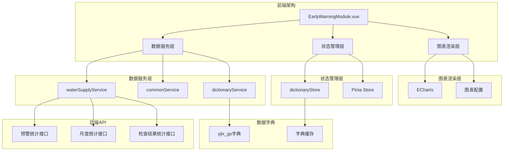
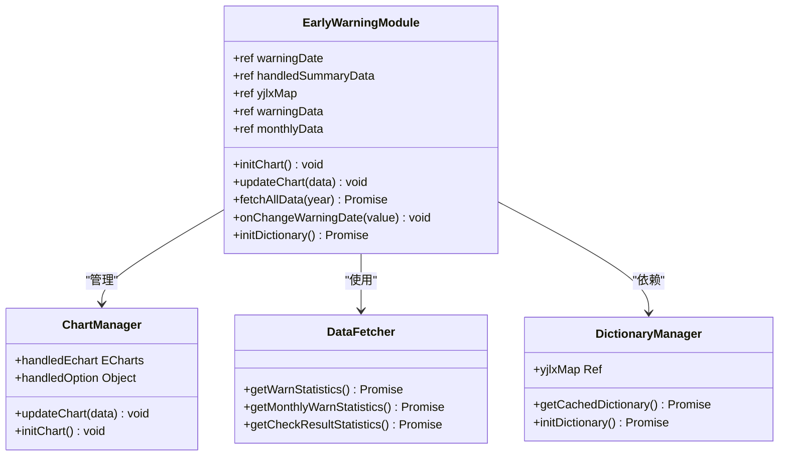
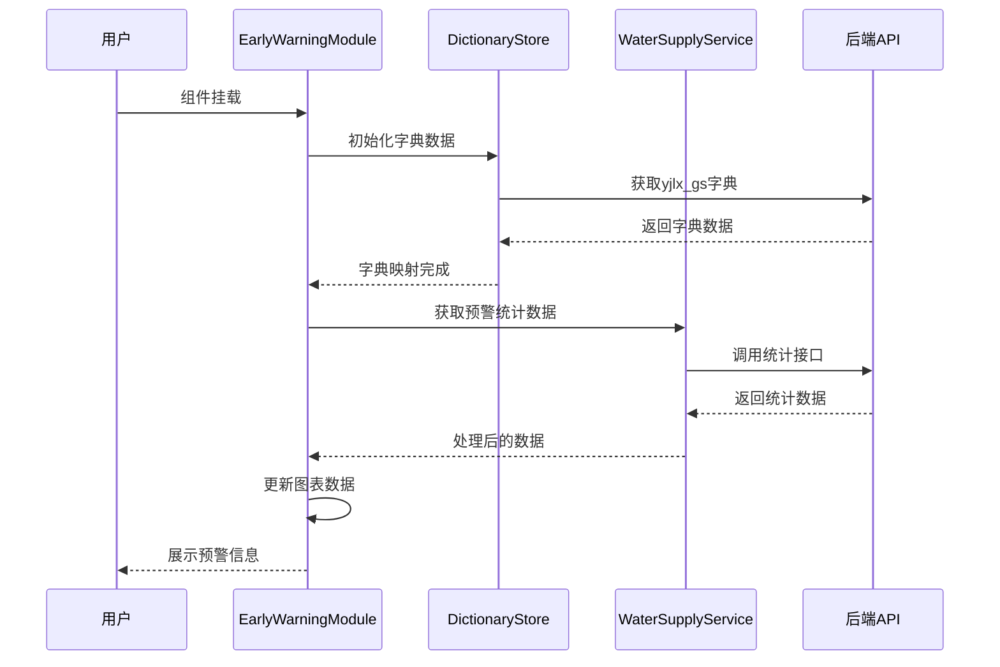
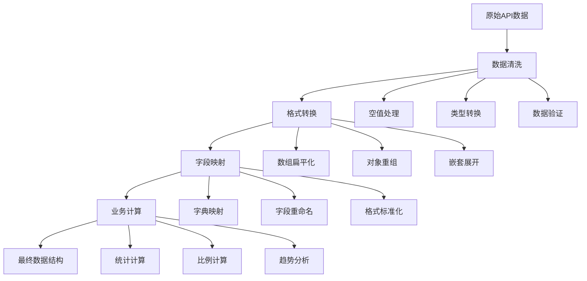
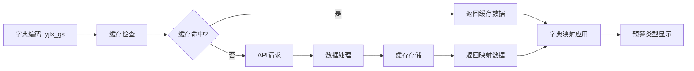
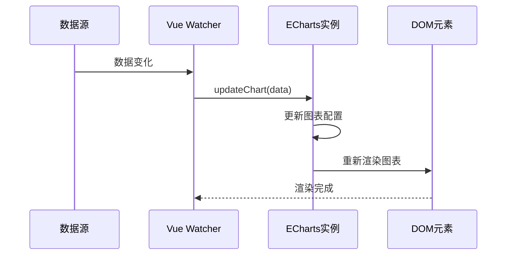
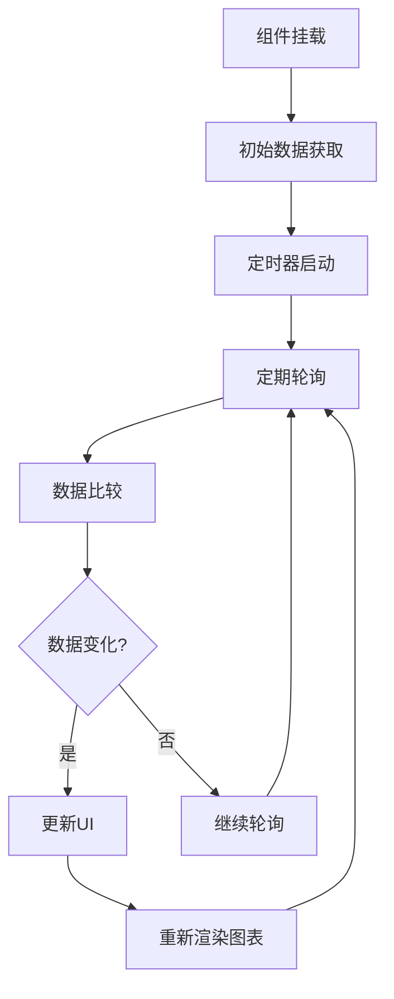
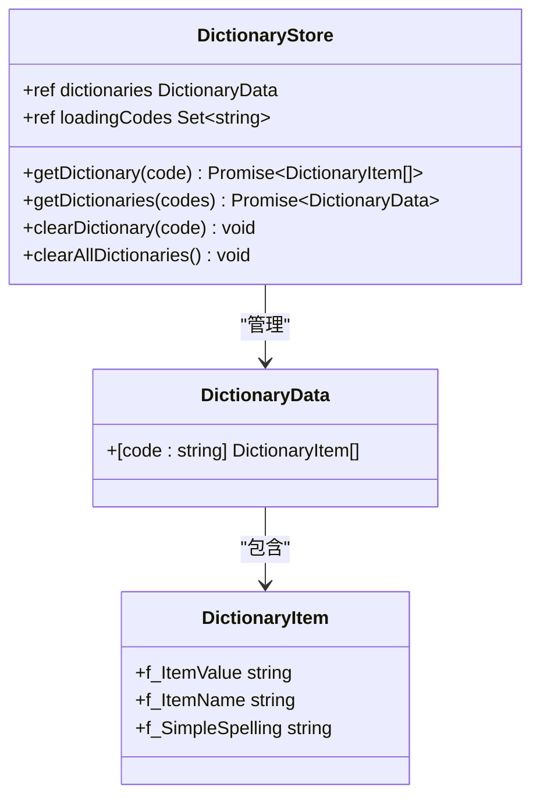
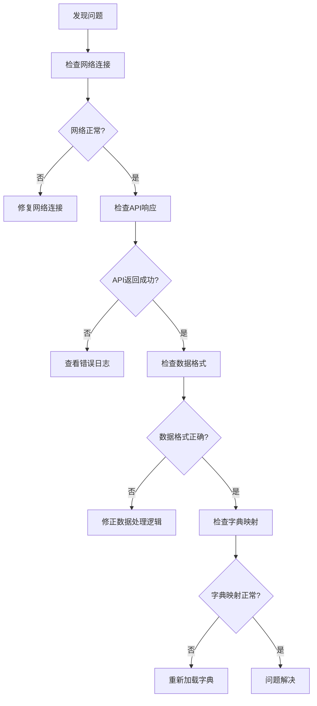

# 预警处置模块

<cite>
**本文档引用的文件**
- [EarlyWarningModule.vue](file://src/views/WaterSupply/components/EarlyWarningModule.vue)
- [commonService.ts](file://src/services/commonService.ts)
- [dictionaryService.ts](file://src/services/dictionaryService.ts)
- [dictionaryStore.ts](file://src/stores/dictionaryStore.ts)
- [waterSupplyService.ts](file://src/services/waterSupplyService.ts)
- [apiConfig.ts](file://src/api/apiConfig.ts)
- [ehcartsOptions.ts](file://src/views/WaterSupply/components/ehcartsOptions.ts)
- [WarningAlarmModule.vue](file://src/views/gasModule/components/WarningAlarmModule.vue)
</cite>

## 目录
1. [概述](#概述)
2. [项目架构](#项目架构)
3. [核心组件分析](#核心组件分析)
4. [预警数据管理](#预警数据管理)
5. [字典数据映射](#字典数据映射)
6. [图表展示功能](#图表展示功能)
7. [数据获取机制](#数据获取机制)
8. [状态管理](#状态管理)
9. [性能优化策略](#性能优化策略)
10. [故障排除指南](#故障排除指南)
11. [扩展与集成](#扩展与集成)

## 概述

预警处置模块（EarlyWarningModule.vue）是政府Dashboard系统中负责水供应领域预警信息管理和处置统计的核心组件。该模块通过实时数据展示、统计分析和图表可视化，为管理者提供全面的预警信息概览和处置进度跟踪功能。

### 主要功能特性

- **多维度预警统计**：支持按预警级别、类型、状态等多维度进行统计分析
- **实时数据展示**：提供实时的预警数量、处置进度等关键指标
- **可视化图表**：集成ECharts实现丰富的数据可视化效果
- **字典映射**：基于yjlx_gs字典实现预警类型的标准化映射
- **响应式设计**：适配不同屏幕尺寸的现代化界面布局

## 项目架构

预警处置模块采用Vue 3 Composition API构建，结合Pinia状态管理和ECharts图表库，形成了完整的预警信息管理体系。



**架构图源文件**
- [EarlyWarningModule.vue](file://src/views/WaterSupply/components/EarlyWarningModule.vue#L84-L193)
- [waterSupplyService.ts](file://src/services/waterSupplyService.ts#L106-L138)
- [dictionaryStore.ts](file://src/stores/dictionaryStore.ts#L26-L222)

## 核心组件分析

### 组件结构与布局

预警处置模块采用模块化设计，主要包含以下几个核心部分：



**类图源文件**
- [EarlyWarningModule.vue](file://src/views/WaterSupply/components/EarlyWarningModule.vue#L84-L193)
- [ehcartsOptions.ts](file://src/views/WaterSupply/components/ehcartsOptions.ts#L222-L341)

### 数据流架构

组件内部的数据流转遵循单向数据流原则，确保数据的一致性和可预测性：



**序列图源文件**
- [EarlyWarningModule.vue](file://src/views/WaterSupply/components/EarlyWarningModule.vue#L166-L185)
- [waterSupplyService.ts](file://src/services/waterSupplyService.ts#L106-L138)

**章节源文件**
- [EarlyWarningModule.vue](file://src/views/WaterSupply/components/EarlyWarningModule.vue#L84-L193)

## 预警数据管理

### 数据获取与处理

预警处置模块通过三个核心接口获取不同类型的数据：

#### 1. 预警统计数据获取

```typescript
// 获取预警统计信息（总览数据）
async function getWarnStatistics(Sszx: string) {
  const res = await waterApi.gspspDtransPubmnteawarn.warnStatisticsList({
    Year: '2025',
    Sszx
  });
  return res?.data || {};
}
```

#### 2. 月度预警统计

```typescript
// 获取月度预警统计（趋势分析）
async function getMonthlyWarnStatistics(year?: string) {
  const currentYear = year || new Date().getFullYear().toString();
  const res = await waterApi.gspspDtransPubmnteawarn.monthlyWarnStatisticsList({
    Year: currentYear,
  });
  return res.data || [];
}
```

#### 3. 检查结果统计

```typescript
// 获取排查结果统计（预警类型分布）
async function getCheckResultStatistics(year?: string) {
  const currentYear = year || new Date().getFullYear().toString();
  const res = await waterApi.gspspDtransPubmnteawarn.checkResultStatisticsList({
    Year: currentYear,
  });
  return res?.data || [];
}
```

### 数据处理与转换

模块对获取的原始数据进行多层处理，确保数据格式的一致性和可用性：



**流程图源文件**
- [waterSupplyService.ts](file://src/services/waterSupplyService.ts#L106-L138)
- [EarlyWarningModule.vue](file://src/views/WaterSupply/components/EarlyWarningModule.vue#L128-L156)

**章节源文件**
- [waterSupplyService.ts](file://src/services/waterSupplyService.ts#L106-L138)
- [EarlyWarningModule.vue](file://src/views/WaterSupply/components/EarlyWarningModule.vue#L128-L156)

## 字典数据映射

### yjlx_gs字典系统

预警处置模块基于yjlx_gs字典实现预警类型的标准化映射，确保不同系统间的数据一致性：

#### 字典数据结构

```typescript
interface DictionaryItem {
  f_ItemValue: string;    // 字典值
  f_ItemName: string;     // 字典名称
  f_SimpleSpelling?: string; // 简拼
}
```

#### 字典映射机制



**流程图源文件**
- [dictionaryStore.ts](file://src/stores/dictionaryStore.ts#L38-L95)
- [dictionaryService.ts](file://src/services/dictionaryService.ts#L15-L18)

### 字典缓存策略

系统实现了智能的字典缓存机制，包括：

- **防重复请求**：通过loadingCodes集合防止同一字典的并发请求
- **自动过期**：支持手动清除特定字典缓存
- **批量加载**：支持同时加载多个字典以提高效率
- **错误恢复**：请求失败时返回空数组，保证系统稳定性

**章节源文件**
- [dictionaryStore.ts](file://src/stores/dictionaryStore.ts#L26-L222)
- [dictionaryService.ts](file://src/services/dictionaryService.ts#L1-L45)
- [EarlyWarningModule.vue](file://src/views/WaterSupply/components/EarlyWarningModule.vue#L166-L177)

## 图表展示功能

### ECharts集成

预警处置模块集成了强大的ECharts图表库，提供直观的数据可视化效果：

#### 图表配置选项

```typescript
// 处置统计图表配置
export const handledOption = {
  tooltip: { trigger: "axis" },
  grid: { left: 2, right: 2, top: 2, bottom: 2 },
  xAxis: { type: "category", data: [] },
  yAxis: [{
    type: "value",
    name: "单位：个",
    min: 0,
    max: 50,
    interval: 10
  }, {
    type: "value",
    name: "单位：%",
    min: 0,
    max: 100,
    interval: 20,
    position: "right"
  }],
  series: [
    { name: "未处置", type: "bar", itemStyle: { color: "#f5a623" } },
    { name: "已处置", type: "bar", itemStyle: { color: "#007aff" } },
    { name: "处置率", type: "line", smooth: true, yAxisIndex: 1 }
  ]
};
```

### 图表交互功能

#### 1. 实时数据更新



**序列图源文件**
- [EarlyWarningModule.vue](file://src/views/WaterSupply/components/EarlyWarningModule.vue#L187-L192)
- [ehcartsOptions.ts](file://src/views/WaterSupply/components/ehcartsOptions.ts#L222-L341)

#### 2. 响应式图表布局

图表组件具备良好的响应式特性，能够适应不同的屏幕尺寸和容器大小：

- **自适应宽度**：图表宽度随容器变化而自动调整
- **动态高度**：根据内容复杂度动态调整图表高度
- **交互优化**：支持触摸设备的手势操作

**章节源文件**
- [ehcartsOptions.ts](file://src/views/WaterSupply/components/ehcartsOptions.ts#L222-L341)
- [EarlyWarningModule.vue](file://src/views/WaterSupply/components/EarlyWarningModule.vue#L105-L126)

## 数据获取机制

### 异步数据流管理

预警处置模块采用Promise.all并行处理多个数据接口，确保数据获取的高效性和一致性：

```typescript
// 并行获取所有统计数据
const [checkResultData, warnStatisticsData, monthlyWarnData] = await Promise.all([
  getCheckResultStatistics(year),
  getWarnStatistics('csaqzx_gs'),
  getMonthlyWarnStatistics(year)
]);
```

### 数据轮询与更新

虽然当前实现主要依赖组件挂载时的一次性数据获取，但系统架构支持多种数据更新机制：

#### 1. 时间驱动更新



#### 2. 事件驱动更新

系统预留了WebSocket集成接口，支持实时数据推送：

- **连接建立**：组件挂载时建立WebSocket连接
- **消息监听**：监听预警事件推送消息
- **即时更新**：收到新消息时立即更新数据和界面

**章节源文件**
- [EarlyWarningModule.vue](file://src/views/WaterSupply/components/EarlyWarningModule.vue#L128-L156)
- [waterSupplyService.ts](file://src/services/waterSupplyService.ts#L106-L138)

## 状态管理

### Pinia Store架构

预警处置模块的状态管理基于Pinia，实现了字典数据的集中缓存和管理：



**类图源文件**
- [dictionaryStore.ts](file://src/stores/dictionaryStore.ts#L26-L222)

### 缓存策略

#### 1. 智能缓存机制

- **LRU淘汰**：最近最少使用的字典优先被淘汰
- **容量控制**：限制最大缓存条目数量，防止内存溢出
- **预热机制**：系统启动时预加载常用字典

#### 2. 并发控制

```typescript
// 防止重复请求的并发控制
async function getDictionary(code: string): Promise<DictionaryItem[]> {
  // 检查是否正在加载
  if (loadingCodes.value.has(code)) {
    return new Promise((resolve) => {
      let attempts = 0;
      const check = () => {
        attempts++;
        if (dictionaries.value[code] || attempts > 50) {
          resolve(dictionaries.value[code] || []);
        } else {
          setTimeout(check, 100);
        }
      };
      check();
    });
  }
  
  // 标记为正在加载
  loadingCodes.value.add(code);
  
  try {
    // 执行实际的数据获取
    const result = await getDataItemDetailsByCodes(code);
    // 处理和缓存数据...
  } finally {
    // 清理加载标记
    loadingCodes.value.delete(code);
  }
}
```

**章节源文件**
- [dictionaryStore.ts](file://src/stores/dictionaryStore.ts#L38-L95)

## 性能优化策略

### 数据加载优化

#### 1. 批量字典加载

系统支持一次性加载多个字典，减少网络请求次数：

```typescript
// 批量获取字典数据
async function getDictionaries(codes: string[]): Promise<DictionaryData> {
  // 分离已缓存和未缓存的字典
  const cachedCodes = codes.filter(code => dictionaries.value[code]);
  const uncachedCodes = codes.filter(code => !dictionaries.value[code]);
  
  // 并行处理已缓存和未缓存的数据
  const [cachedResults, uncachedResults] = await Promise.all([
    Promise.all(cachedCodes.map(code => dictionaries.value[code])),
    this.getDictionaries(uncachedCodes)
  ]);
  
  // 合并结果
  return { ...cachedResults, ...uncachedResults };
}
```

#### 2. 图表渲染优化

- **虚拟滚动**：对于大量数据的表格展示，使用虚拟滚动技术
- **懒加载**：图表组件采用懒加载策略，仅在可见时渲染
- **防抖处理**：窗口大小变化时使用防抖函数优化图表重绘

### 内存管理

#### 1. 自动清理机制

```typescript
// 组件卸载时的清理工作
onUnmounted(() => {
  if (handledEchart) {
    handledEchart.dispose();
    handledEchart = null;
  }
});
```

#### 2. 缓存容量控制

- **最大缓存条目**：限制字典缓存的最大条目数量
- **定期清理**：定期清理长时间未访问的字典数据
- **内存监控**：监控内存使用情况，及时释放大对象

**章节源文件**
- [dictionaryStore.ts](file://src/stores/dictionaryStore.ts#L98-L222)
- [EarlyWarningModule.vue](file://src/views/WaterSupply/components/EarlyWarningModule.vue#L105-L126)

## 故障排除指南

### 常见问题诊断

#### 1. 预警数据显示异常

**症状**：预警数量显示不正确或图表数据缺失

**诊断步骤**：


**解决方案**：
- 检查网络连接状态
- 验证API接口的可用性
- 确认数据格式符合预期
- 重新加载字典缓存

#### 2. 图表渲染问题

**症状**：图表无法正常显示或显示异常

**排查清单**：
- [ ] 检查ECharts库是否正确加载
- [ ] 验证图表容器是否存在且有正确尺寸
- [ ] 确认图表配置选项是否完整
- [ ] 检查数据是否为空或格式错误

#### 3. 字典映射失效

**症状**：预警类型显示为编码而非名称

**解决步骤**：
1. 清除字典缓存：`clearDictionaryCache('yjlx_gs')`
2. 重新加载字典数据
3. 检查字典服务是否正常工作
4. 验证数据库中的字典配置

### 监控与恢复方案

#### 1. 数据完整性监控

```typescript
// 数据完整性检查
function validateWarningData(data: any): boolean {
  if (!data || typeof data !== 'object') return false;
  
  // 检查必需字段
  const requiredFields = ['totalCount', 'handledCount', 'unhandledCount'];
  return requiredFields.every(field => field in data);
}
```

#### 2. 自动恢复机制

```typescript
// 自动重试机制
async function fetchDataWithRetry(
  fetchFunction: () => Promise<any>, 
  maxRetries: number = 3
): Promise<any> {
  let lastError;
  
  for (let i = 0; i < maxRetries; i++) {
    try {
      return await fetchFunction();
    } catch (error) {
      lastError = error;
      if (i < maxRetries - 1) {
        await new Promise(resolve => setTimeout(resolve, 1000 * (i + 1)));
      }
    }
  }
  
  throw lastError;
}
```

**章节源文件**
- [EarlyWarningModule.vue](file://src/views/WaterSupply/components/EarlyWarningModule.vue#L128-L156)
- [dictionaryStore.ts](file://src/stores/dictionaryStore.ts#L38-L95)

## 扩展与集成

### 新预警规则引擎集成

#### 1. 规则引擎接口

```typescript
interface WarningRuleEngine {
  registerRule(rule: WarningRule): void;
  evaluateEvent(event: WarningEvent): WarningResult[];
  getRuleStats(): RuleStatistics;
}

interface WarningRule {
  id: string;
  name: string;
  condition: ConditionExpression;
  severity: SeverityLevel;
  action: ActionDefinition;
}
```

#### 2. 集成示例

```typescript
// 集成新的预警规则引擎
class EnhancedWarningEngine implements WarningRuleEngine {
  private rules: Map<string, WarningRule> = new Map();
  
  async registerRule(rule: WarningRule): Promise<void> {
    // 验证规则有效性
    if (!await this.validateRule(rule)) {
      throw new Error('Invalid warning rule');
    }
    
    // 存储规则
    this.rules.set(rule.id, rule);
    
    // 通知相关组件更新
    this.notifyRuleUpdate(rule);
  }
  
  async evaluateEvent(event: WarningEvent): Promise<WarningResult[]> {
    const results: WarningResult[] = [];
    
    for (const rule of this.rules.values()) {
      if (await this.matchCondition(rule.condition, event)) {
        results.push(this.createWarningResult(rule, event));
      }
    }
    
    return results;
  }
}
```

### 外部通知系统对接

#### 1. 通知服务接口

```typescript
interface NotificationService {
  sendWarningNotification(warning: WarningEvent): Promise<boolean>;
  subscribeToWarnings(userId: string): Promise<void>;
  unsubscribeFromWarnings(userId: string): Promise<void>;
}
```

#### 2. WebSocket实时推送

```typescript
// WebSocket连接管理
class WarningWebSocket {
  private socket: WebSocket | null = null;
  private reconnectAttempts = 0;
  private readonly MAX_RECONNECT_ATTEMPTS = 5;
  
  connect(url: string): void {
    this.socket = new WebSocket(url);
    
    this.socket.onopen = () => {
      this.reconnectAttempts = 0;
      this.handleConnectionEstablished();
    };
    
    this.socket.onmessage = (event) => {
      const warningEvent = JSON.parse(event.data);
      this.handleIncomingWarning(warningEvent);
    };
    
    this.socket.onclose = () => {
      this.handleConnectionClosed();
    };
  }
  
  handleConnectionClosed(): void {
    if (this.reconnectAttempts < this.MAX_RECONNECT_ATTEMPTS) {
      this.reconnectAttempts++;
      setTimeout(() => this.connect(this.socket?.url || ''), 
                 Math.pow(2, this.reconnectAttempts) * 1000);
    }
  }
}
```

### 数据导出与报告

#### 1. 数据导出功能

```typescript
// 预警数据导出
class WarningDataExporter {
  async exportToExcel(data: WarningData[], options: ExportOptions): Promise<Blob> {
    const workbook = XLSX.utils.book_new();
    
    // 创建统计数据工作表
    const statsSheet = XLSX.utils.json_to_sheet([
      {
        总预警数: data.totalCount,
        已处置: data.handledCount,
        未处置: data.unhandledCount,
        处置率: `${((data.handledCount / data.totalCount) * 100).toFixed(2)}%`
      }
    ]);
    
    // 创建详细数据工作表
    const detailSheet = XLSX.utils.json_to_sheet(data.details);
    
    XLSX.utils.book_append_sheet(workbook, statsSheet, '统计摘要');
    XLSX.utils.book_append_sheet(workbook, detailSheet, '详细数据');
    
    const excelBuffer = XLSX.write(workbook, { 
      bookType: 'xlsx', 
      type: 'array' 
    });
    
    return new Blob([excelBuffer], { type: 'application/vnd.openxmlformats-officedocument.spreadsheetml.sheet' });
  }
}
```

#### 2. 自动化报告生成

```typescript
// 定期报告生成
class WarningReportGenerator {
  async generateDailyReport(): Promise<Report> {
    const today = new Date();
    const yesterday = new Date(today);
    yesterday.setDate(yesterday.getDate() - 1);
    
    const dailyData = await this.fetchDailyStatistics(yesterday, today);
    const report = this.createReportTemplate(dailyData);
    
    return this.renderReport(report);
  }
  
  async generateMonthlyReport(): Promise<Report> {
    const now = new Date();
    const firstDayOfMonth = new Date(now.getFullYear(), now.getMonth(), 1);
    const lastDayOfMonth = new Date(now.getFullYear(), now.getMonth() + 1, 0);
    
    const monthlyData = await this.fetchMonthlyStatistics(firstDayOfMonth, lastDayOfMonth);
    const report = this.createReportTemplate(monthlyData);
    
    return this.renderReport(report);
  }
}
```

**章节源文件**
- [EarlyWarningModule.vue](file://src/views/WaterSupply/components/EarlyWarningModule.vue#L166-L185)
- [waterSupplyService.ts](file://src/services/waterSupplyService.ts#L106-L138)

## 总结

预警处置模块作为政府Dashboard系统的重要组成部分，通过精心设计的架构和丰富的功能特性，为水供应领域的预警管理提供了全面的解决方案。模块具备以下核心优势：

### 技术优势

- **模块化设计**：清晰的组件分离和职责划分
- **高性能架构**：基于Vue 3和Pinia的现代前端技术栈
- **数据驱动**：基于响应式数据流的实时更新机制
- **可扩展性**：预留的扩展接口支持未来功能增强

### 功能特色

- **多维度统计**：支持预警级别的详细分析
- **实时可视化**：直观的图表展示和交互体验
- **智能缓存**：高效的字典数据缓存和管理机制
- **容错能力**：完善的错误处理和恢复机制

### 应用价值

预警处置模块不仅满足了当前的业务需求，更为未来的系统扩展和功能增强奠定了坚实的基础。通过持续的优化和完善，该模块将在提升政府治理能力、保障公共安全方面发挥越来越重要的作用。