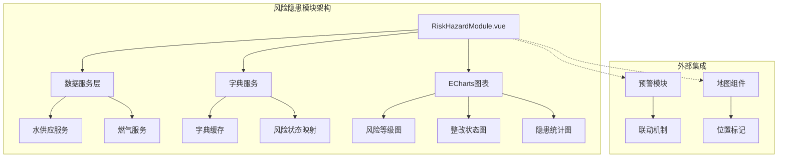
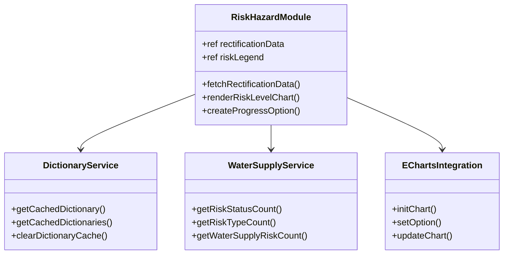
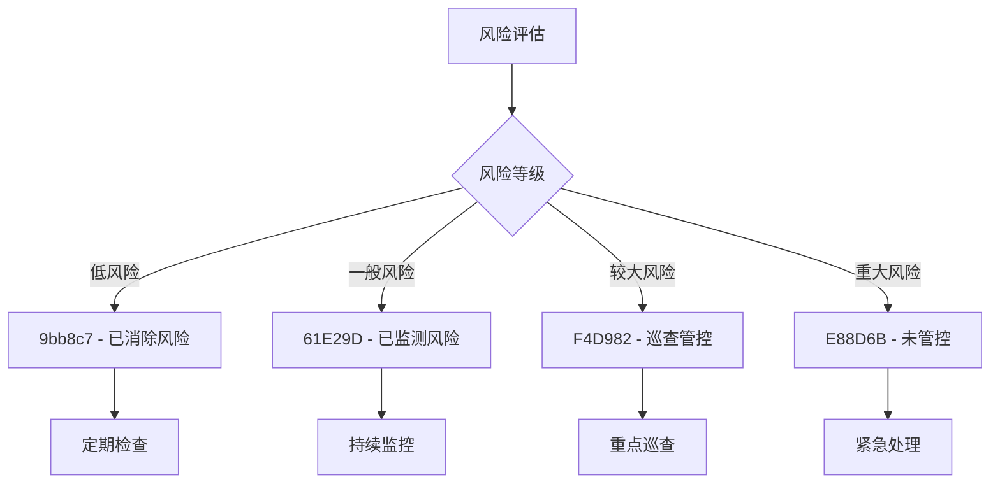
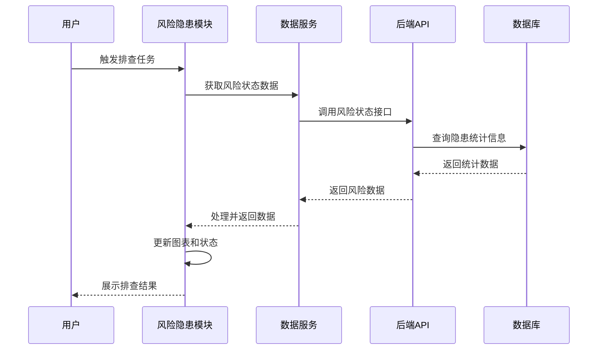
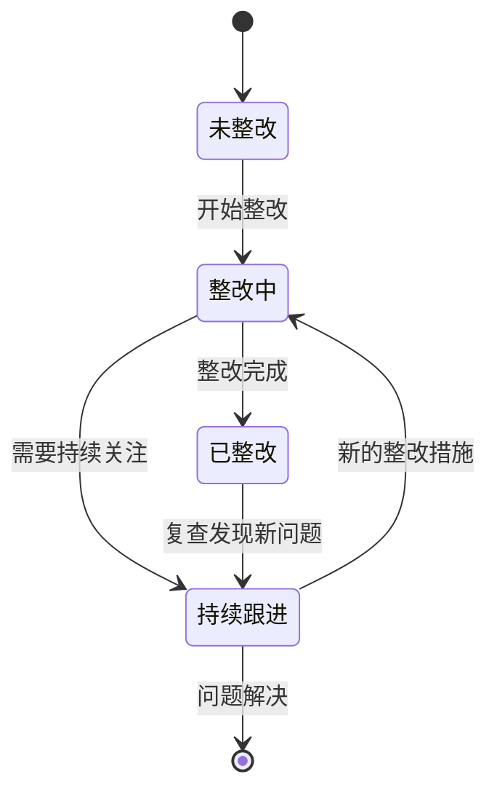
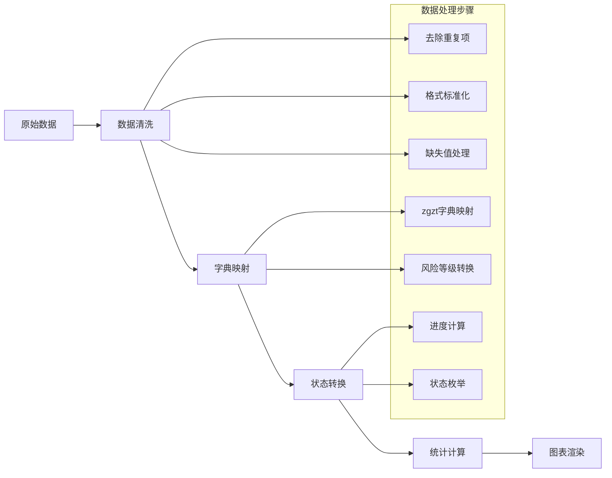
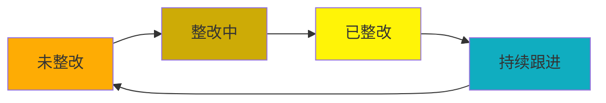
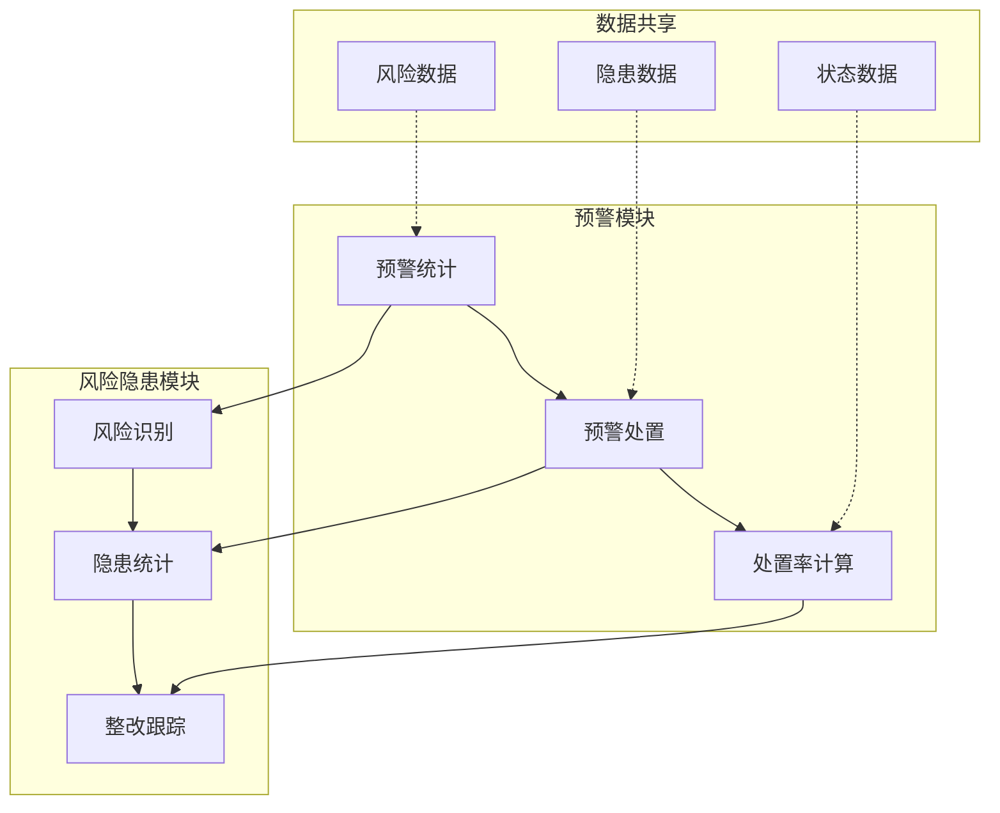
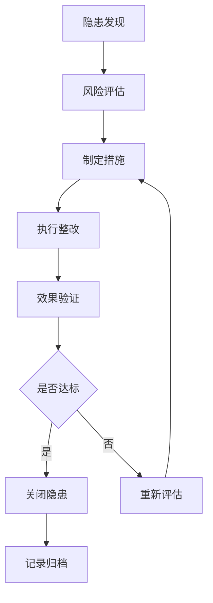

# 风险隐患模块技术文档

<cite>
**本文档引用的文件**
- [RiskHazardModule.vue](file://src/views/WaterSupply/components/RiskHazardModule.vue)
- [RiskHazardModule.vue](file://src/views/gasModule/components/RiskHazardModule.vue)
- [waterSupplyService.ts](file://src/services/waterSupplyService.ts)
- [dictionaryService.ts](file://src/services/dictionaryService.ts)
- [common.ts](file://src/api/common.ts)
- [waterSupplyAndDrainage.ts](file://src/api/waterSupplyAndDrainage.ts)
- [EarlyWarningModule.vue](file://src/views/WaterSupply/components/EarlyWarningModule.vue)
- [index.ts](file://src/types/index.ts)
</cite>

## 目录
1. [概述](#概述)
2. [模块架构](#模块架构)
3. [风险分析模型](#风险分析模型)
4. [隐患排查机制](#隐患排查机制)
5. [数据获取与处理](#数据获取与处理)
6. [风险等级与状态管理](#风险等级与状态管理)
7. [预警模块联动](#预警模块联动)
8. [扩展接口设计](#扩展接口设计)
9. [故障排除指南](#故障排除指南)
10. [最佳实践](#最佳实践)

## 概述

风险隐患模块（RiskHazardModule）是政府Dashboard系统中的核心安全监控组件，负责识别、分析和管理各类风险隐患。该模块基于历史数据、设备状态和环境因素构建风险分析模型，通过可视化图表和列表形式展示隐患详情，并提供与预警模块的深度集成能力。

### 主要功能特性

- **风险识别与分类**：基于zgzt字典进行风险等级和整改状态的智能分类
- **多维度统计分析**：提供风险等级分布、隐患类型统计和整改状态跟踪
- **实时数据更新**：支持动态数据刷新和状态变更追踪
- **可视化展示**：采用ECharts实现丰富的图表展示效果
- **预警联动机制**：与预警模块无缝集成，形成完整的安全管理体系

## 模块架构

### 整体架构设计



**架构图源文件**
- [RiskHazardModule.vue](file://src/views/WaterSupply/components/RiskHazardModule.vue#L1-L480)
- [RiskHazardModule.vue](file://src/views/gasModule/components/RiskHazardModule.vue#L1-L567)

### 组件层次结构



**类图源文件**
- [RiskHazardModule.vue](file://src/views/WaterSupply/components/RiskHazardModule.vue#L44-L89)
- [dictionaryService.ts](file://src/services/dictionaryService.ts#L15-L45)
- [waterSupplyService.ts](file://src/services/waterSupplyService.ts#L58-L90)

## 风险分析模型

### 风险识别算法

风险隐患模块采用多层次的风险识别模型：

1. **历史数据分析**：基于历史隐患记录和整改效果进行趋势分析
2. **设备状态监控**：实时监控设备运行状态和异常指标
3. **环境因素评估**：考虑地理位置、气候条件等外部因素
4. **专家经验规则**：整合领域专家制定的风险评估规则

### 风险等级分类体系



**流程图源文件**
- [RiskHazardModule.vue](file://src/views/WaterSupply/components/RiskHazardModule.vue#L225-L246)

### 隐患类型分类

模块支持多种隐患类型的智能识别和分类：

| 隐患类型 | 风险等级 | 处理优先级 | 可视化颜色 |
|---------|---------|-----------|-----------|
| 一般隐患 | 低风险 | 中等 | 蓝色 (#1677ff) |
| 较大隐患 | 一般风险 | 高 | 橙色 (#feac04) |
| 重大隐患 | 重大风险 | 最高 | 红色 (#ff4d4f) |

**表格源文件**
- [RiskHazardModule.vue](file://src/views/gasModule/components/RiskHazardModule.vue#L80-L85)

## 隐患排查机制

### 排查流程设计



**序列图源文件**
- [waterSupplyService.ts](file://src/services/waterSupplyService.ts#L75-L90)
- [RiskHazardModule.vue](file://src/views/gasModule/components/RiskHazardModule.vue#L99-L137)

### 整改状态跟踪

模块提供完整的整改状态跟踪机制：



**状态图源文件**
- [RiskHazardModule.vue](file://src/views/WaterSupply/components/RiskHazardModule.vue#L50-L55)

## 数据获取与处理

### API接口设计

模块通过统一的API接口获取风险数据：

| 接口名称 | 功能描述 | 请求参数 | 返回数据 |
|---------|---------|---------|---------|
| riskStatusCountList | 按整改状态统计隐患数量 | Glmblx, Dsbm, Qhbm | 隐患状态统计 |
| riskTypeCountList | 按隐患类型统计数量 | Glmblx, Dsbm, Qhbm | 隐患类型统计 |
| inventoryRiskStatusCountList | 按风险等级统计数量 | Sszx, Dsbm, Qhbm | 风险等级统计 |

**表格源文件**
- [waterSupplyAndDrainage.ts](file://src/api/waterSupplyAndDrainage.ts#L367-L481)

### 数据处理流程



**流程图源文件**
- [waterSupplyService.ts](file://src/services/waterSupplyService.ts#L75-L90)
- [dictionaryService.ts](file://src/services/dictionaryService.ts#L15-L18)

### 通用API接口

模块基于通用API接口实现数据交互：

**接口源文件**
- [common.ts](file://src/api/common.ts#L1-L800)

## 风险等级与状态管理

### 风险等级颜色标识

模块采用直观的颜色编码系统：

| 风险等级 | 颜色代码 | 含义 | 处理建议 |
|---------|---------|------|---------|
| 已消除风险 | #9bb8c7 | 低风险，已处理 | 定期检查 |
| 已监测风险 | #61E29D | 一般风险，持续监控 | 保持关注 |
| 巡查管控 | #F4D982 | 较大风险，重点巡查 | 加强检查 |
| 未管控 | #E88D6B | 重大风险，紧急处理 | 立即处理 |

**表格源文件**
- [RiskHazardModule.vue](file://src/views/WaterSupply/components/RiskHazardModule.vue#L225-L246)

### 处置状态跟踪

整改状态采用四阶段管理模式：



**图表源文件**
- [RiskHazardModule.vue](file://src/views/gasModule/components/RiskHazardModule.vue#L90-L96)

## 预警模块联动

### 联动机制设计

风险隐患模块与预警模块形成完整的安全管理体系：



**架构图源文件**
- [EarlyWarningModule.vue](file://src/views/WaterSupply/components/EarlyWarningModule.vue#L1-L421)

### 数据同步机制

两个模块通过以下方式实现数据同步：

1. **实时数据推送**：风险状态变更时自动通知预警模块
2. **定时数据拉取**：预警模块定期从风险模块获取最新数据
3. **事件驱动更新**：关键状态变更触发双向更新

**联动源文件**
- [EarlyWarningModule.vue](file://src/views/WaterSupply/components/EarlyWarningModule.vue#L128-L156)

## 扩展接口设计

### 第三方算法集成

模块支持集成第三方风险评估算法：

```typescript
// 示例：第三方算法集成接口
interface ThirdPartyRiskAlgorithm {
  evaluateRisk(data: RiskData): RiskAssessment;
  integrateWithModule(algorithm: RiskAlgorithm): void;
}

// 集成示例
const algorithm = new ThirdPartyRiskAlgorithm();
riskHazardModule.integrateWithModule(algorithm);
```

### 扩展接口规范

| 接口类型 | 方法签名 | 参数说明 | 返回值 |
|---------|---------|---------|-------|
| 风险评估 | evaluateRisk(data) | 风险数据对象 | 风险评估结果 |
| 状态更新 | updateStatus(id, status) | 隐患ID和新状态 | 更新结果 |
| 数据导出 | exportData(format) | 导出格式 | 导出文件 |
| 实时推送 | pushUpdates(callback) | 回调函数 | 推送控制 |

### 闭环管理支持

模块提供完整的闭环管理能力：



**流程图源文件**
- [RiskHazardModule.vue](file://src/views/gasModule/components/RiskHazardModule.vue#L102-L130)

## 故障排除指南

### 常见问题诊断

#### 风险数据更新延迟

**问题表现**：
- 风险统计数据长时间不更新
- 图表显示过期数据
- 整改状态显示滞后

**诊断步骤**：
1. 检查网络连接状态
2. 验证API接口响应时间
3. 确认数据缓存策略
4. 检查字典数据完整性

**解决方案**：
```javascript
// 强制刷新数据
async function refreshRiskData() {
  try {
    // 清除缓存
    clearDictionaryCache('zgzt');
    
    // 重新获取数据
    const data = await fetchRectificationData();
    
    // 更新图表
    renderRiskLevelChart();
    renderRectificationCharts();
  } catch (error) {
    console.error('数据刷新失败:', error);
  }
}
```

#### 分类错误问题

**问题表现**：
- 风险等级显示错误
- 整改状态分类混乱
- 隐患类型识别不准确

**诊断方法**：
1. 验证字典数据完整性
2. 检查映射关系配置
3. 确认数据转换逻辑

**修复建议**：
```javascript
// 数据验证函数
function validateRiskClassification(data) {
  const validStatuses = ['已整改', '未整改', '整改中', '持续跟进'];
  const validLevels = ['低风险', '一般风险', '较大风险', '重大风险'];
  
  return data.every(item => {
    const isValidStatus = validStatuses.includes(item.riskStatus);
    const isValidLevel = validLevels.includes(item.riskLevel);
    return isValidStatus && isValidLevel;
  });
}
```

#### 图表渲染异常

**问题表现**：
- 图表无法正常显示
- 数据不正确显示
- 交互功能失效

**调试步骤**：
1. 检查ECharts初始化
2. 验证数据格式
3. 确认DOM元素存在

**解决方案**：
```javascript
// 图表初始化检查
function initializeCharts() {
  const chartElements = document.querySelectorAll('.risk-echart, .status-chart');
  
  chartElements.forEach(element => {
    if (element && !element.__echarts__) {
      const chart = echarts.init(element);
      // 设置初始配置
      chart.setOption(getDefaultChartOptions());
    }
  });
}
```

### 数据校验建议

#### 输入数据验证

```javascript
// 数据验证函数
function validateRiskData(data) {
  const errors = [];
  
  // 验证必需字段
  const requiredFields = ['count', 'riskStatus', 'riskLevel'];
  requiredFields.forEach(field => {
    if (!data[field]) {
      errors.push(`缺少必需字段: ${field}`);
    }
  });
  
  // 验证数值范围
  if (data.count < 0) {
    errors.push('隐患数量不能为负数');
  }
  
  // 验证状态有效性
  const validStatuses = Object.values(zgztMap);
  if (!validStatuses.includes(data.riskStatus)) {
    errors.push(`无效的状态: ${data.riskStatus}`);
  }
  
  return {
    isValid: errors.length === 0,
    errors
  };
}
```

#### 输出数据校验

```javascript
// 输出验证函数
function validateChartData(chartData) {
  const validationRules = {
    riskLegend: {
      type: 'array',
      minLength: 4,
      maxLength: 4
    },
    rectificationData: {
      type: 'array',
      minItems: 0
    },
    totalHazard: {
      type: 'number',
      min: 0
    }
  };
  
  // 实现具体的验证逻辑
  // ...
}
```

## 最佳实践

### 性能优化建议

1. **数据缓存策略**
   - 使用字典服务缓存风险状态字典
   - 实现本地数据缓存机制
   - 设置合理的缓存过期时间

2. **图表渲染优化**
   - 使用虚拟滚动处理大量数据
   - 实现图表懒加载
   - 优化重绘频率

3. **内存管理**
   - 及时清理废弃的图表实例
   - 避免内存泄漏
   - 合理使用Vue的响应式系统

### 安全考虑

1. **数据访问控制**
   - 实现基于角色的数据权限控制
   - 加密敏感风险数据传输
   - 记录数据访问日志

2. **输入验证**
   - 严格验证API请求参数
   - 防止XSS攻击
   - 实现CSRF防护

### 监控与维护

1. **性能监控**
   - 监控API响应时间
   - 跟踪图表渲染性能
   - 监控内存使用情况

2. **错误处理**
   - 实现优雅的错误降级
   - 提供详细的错误日志
   - 建立告警机制

3. **版本管理**
   - 保持组件版本一致性
   - 实现向后兼容性
   - 制定升级计划

通过遵循这些最佳实践，可以确保风险隐患模块的稳定性、性能和安全性，为用户提供可靠的风险管理工具。