# 桥模块

<cite>
**本文档引用的文件**
- [src/views/BridgeModule/index.vue](file://src/views/BridgeModule/index.vue)
- [src/views/BridgeModule/leftContent.vue](file://src/views/BridgeModule/leftContent.vue)
- [src/views/BridgeModule/rightContent.vue](file://src/views/BridgeModule/rightContent.vue)
- [src/views/BridgeModule/sidebarModule.vue](file://src/views/BridgeModule/sidebarModule.vue)
- [src/views/BridgeModule/components/OverviewModule.vue](file://src/views/BridgeModule/components/OverviewModule.vue)
- [src/views/BridgeModule/components/BridgeMonitoringModule.vue](file://src/views/BridgeModule/components/BridgeMonitoringModule.vue)
- [src/views/BridgeModule/components/MonitoringDeviceModule.vue](file://src/views/BridgeModule/components/MonitoringDeviceModule.vue)
- [src/views/BridgeModule/components/BridgeRiskHazardModule.vue](file://src/views/BridgeModule/components/BridgeRiskHazardModule.vue)
- [src/views/BridgeModule/components/BridgeWarningAlarmModule.vue](file://src/views/BridgeModule/components/BridgeWarningAlarmModule.vue)
- [src/views/BridgeModule/components/map/BridgeListPanel.vue](file://src/views/BridgeModule/components/map/BridgeListPanel.vue)
- [src/views/BridgeModule/components/map/BridgeDetailDialog.vue](file://src/views/BridgeModule/components/map/BridgeDetailDialog.vue)
- [src/views/BridgeModule/chartOption.ts](file://src/views/BridgeModule/chartOption.ts)
- [src/services/bridgeService.ts](file://src/services/bridgeService.ts)
- [src/services/waterSupplyService.ts](file://src/services/waterSupplyService.ts)
- [src/services/dictionaryService.ts](file://src/services/dictionaryService.ts)
- [src/components/CommonTable.vue](file://src/components/CommonTable.vue)
</cite>

## 更新摘要
**变更内容**
- 更新了BridgeWarningAlarmModule和MonitoringDeviceModule的表格组件重构部分
- 新增了CommonTable组件的maxHeight属性使用说明
- 更新了风险级别高亮和状态徽章显示的实现细节
- 增强了数值格式化和表格渲染的文档描述
- 新增了表格滚动优化和性能提升的相关说明

## 目录
1. [简介](#简介)
2. [项目结构](#项目结构)
3. [核心组件](#核心组件)
4. [架构概览](#架构概览)
5. [详细组件分析](#详细组件分析)
6. [依赖关系分析](#依赖关系分析)
7. [性能考虑](#性能考虑)
8. [故障排除指南](#故障排除指南)
9. [结论](#结论)

## 简介

桥模块是政府dashboard系统中的一个重要功能模块，专门用于桥梁基础设施的监测、管理和可视化展示。该模块提供了完整的桥梁信息管理、风险评估、预警报警等功能，通过现代化的前端技术栈实现丰富的用户交互体验。

该模块采用Vue 3 + TypeScript + Vite的技术架构，集成了ECharts图表库、Naive UI组件库和Cesium三维地球引擎，为用户提供了一个功能完备的桥梁管理平台。

## 项目结构

桥模块位于`src/views/BridgeModule/`目录下，采用按功能模块组织的结构设计：

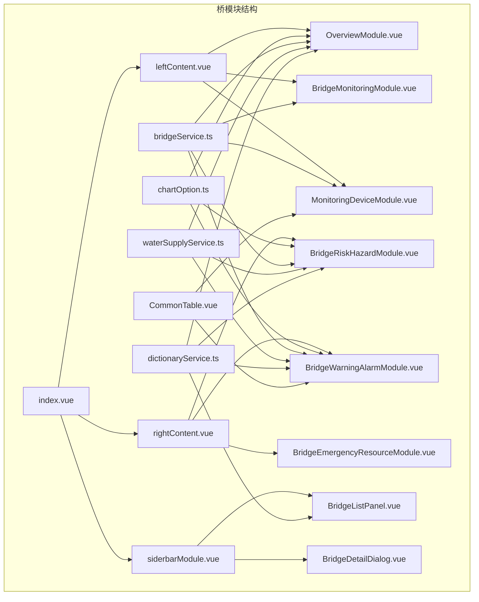
```mermaid
graph TB
subgraph "桥模块结构"
A[index.vue] --> B[leftContent.vue]
A --> C[siderbarModule.vue]
A --> D[rightContent.vue]
B --> E[OverviewModule.vue]
B --> F[BridgeMonitoringModule.vue]
B --> G[MonitoringDeviceModule.vue]
D --> H[BridgeRiskHazardModule.vue]
D --> I[BridgeWarningAlarmModule.vue]
D --> J[BridgeEmergencyResourceModule.vue]
C --> K[BridgeListPanel.vue]
C --> L[BridgeDetailDialog.vue]
M[chartOption.ts] --> E
M --> H
M --> I
N[bridgeService.ts] --> E
N --> F
N --> G
N --> H
N --> I
O[waterSupplyService.ts] --> E
O --> H
O --> I
P[dictionaryService.ts] --> E
P --> H
P --> I
P --> K
Q[CommonTable.vue] --> G
Q --> I
end
```

**图表来源**
- [src/views/BridgeModule/index.vue](file://src/views/BridgeModule/index.vue#L1-L79)
- [src/views/BridgeModule/leftContent.vue](file://src/views/BridgeModule/leftContent.vue#L1-L32)
- [src/views/BridgeModule/rightContent.vue](file://src/views/BridgeModule/rightContent.vue#L1-L32)

**章节来源**
- [src/views/BridgeModule/index.vue](file://src/views/BridgeModule/index.vue#L1-L79)
- [src/views/BridgeModule/leftContent.vue](file://src/views/BridgeModule/leftContent.vue#L1-L32)
- [src/views/BridgeModule/rightContent.vue](file://src/views/BridgeModule/rightContent.vue#L1-L32)

## 核心组件

桥模块包含多个功能组件，每个组件都有明确的职责分工：

### 主要组件架构

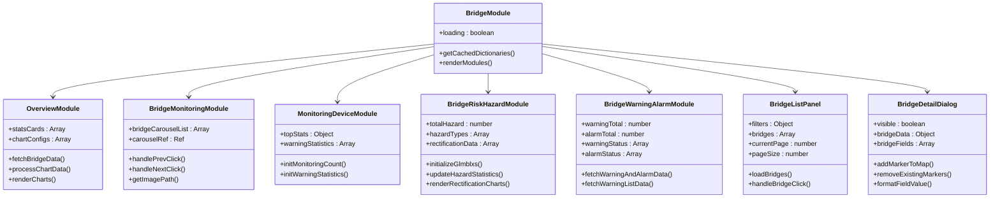
```mermaid
classDiagram
class BridgeModule {
+loading : boolean
+getCachedDictionaries()
+renderModules()
}
class OverviewModule {
+statsCards : Array
+chartConfigs : Array
+fetchBridgeData()
+processChartData()
+renderCharts()
}
class BridgeMonitoringModule {
+bridgeCarouselList : Array
+carouselRef : Ref
+handlePrevClick()
+handleNextClick()
+getImagePath()
}
class MonitoringDeviceModule {
+topStats : Object
+warningStatistics : Array
+initMonitoringCount()
+initWarningStatistics()
}
class BridgeRiskHazardModule {
+totalHazard : number
+hazardTypes : Array
+rectificationData : Array
+initializeGlmblxs()
+updateHazardStatistics()
+renderRectificationCharts()
}
class BridgeWarningAlarmModule {
+warningTotal : number
+alarmTotal : number
+warningStatus : Array
+alarmStatus : Array
+fetchWarningAndAlarmData()
+fetchWarningListData()
}
class BridgeListPanel {
+filters : Object
+bridges : Array
+currentPage : number
+pageSize : number
+loadBridges()
+handleBridgeClick()
}
class BridgeDetailDialog {
+visible : boolean
+bridgeData : Object
+bridgeFields : Array
+addMarkerToMap()
+removeExistingMarkers()
+formatFieldValue()
}
BridgeModule --> OverviewModule
BridgeModule --> BridgeMonitoringModule
BridgeModule --> MonitoringDeviceModule
BridgeModule --> BridgeRiskHazardModule
BridgeModule --> BridgeWarningAlarmModule
BridgeModule --> BridgeListPanel
BridgeModule --> BridgeDetailDialog
```

**图表来源**
- [src/views/BridgeModule/index.vue](file://src/views/BridgeModule/index.vue#L24-L56)
- [src/views/BridgeModule/components/OverviewModule.vue](file://src/views/BridgeModule/components/OverviewModule.vue#L39-L190)
- [src/views/BridgeModule/components/BridgeMonitoringModule.vue](file://src/views/BridgeModule/components/BridgeMonitoringModule.vue#L58-L235)

### 组件职责说明

1. **BridgeModule**: 主容器组件，负责整体布局和数据预加载
2. **OverviewModule**: 总览模块，展示桥梁统计数据和分类图表
3. **BridgeMonitoringModule**: 桥梁监控模块，提供桥梁图片轮播展示
4. **MonitoringDeviceModule**: 监测设备模块，展示设备状态统计（**已重构为使用CommonTable组件**）
5. **BridgeRiskHazardModule**: 风险隐患模块，展示风险等级和整改状态
6. **BridgeWarningAlarmModule**: 预警报警模块，展示预警和报警统计（**已重构为使用CommonTable组件**）
7. **BridgeListPanel**: 桥梁列表面板，提供桥梁查询和筛选功能
8. **BridgeDetailDialog**: 桥梁详情对话框，展示桥梁详细信息和地图标注

**章节来源**
- [src/views/BridgeModule/components/OverviewModule.vue](file://src/views/BridgeModule/components/OverviewModule.vue#L1-L379)
- [src/views/BridgeModule/components/BridgeMonitoringModule.vue](file://src/views/BridgeModule/components/BridgeMonitoringModule.vue#L1-L457)
- [src/views/BridgeModule/components/MonitoringDeviceModule.vue](file://src/views/BridgeModule/components/MonitoringDeviceModule.vue#L1-L253)

## 架构概览

桥模块采用了清晰的分层架构设计，实现了关注点分离和模块化管理：

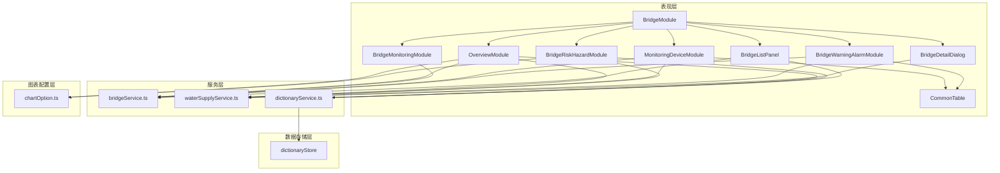
```mermaid
graph TB
subgraph "表现层"
A[BridgeModule]
B[OverviewModule]
C[BridgeMonitoringModule]
D[MonitoringDeviceModule]
E[BridgeRiskHazardModule]
F[BridgeWarningAlarmModule]
G[BridgeListPanel]
H[BridgeDetailDialog]
I[CommonTable]
end
subgraph "服务层"
J[bridgeService.ts]
K[waterSupplyService.ts]
L[dictionaryService.ts]
end
subgraph "图表配置层"
M[chartOption.ts]
end
subgraph "数据存储层"
N[dictionaryStore]
end
A --> B
A --> C
A --> D
A --> E
A --> F
A --> G
A --> H
B --> J
B --> K
B --> L
B --> M
C --> J
D --> J
D --> K
E --> K
E --> L
E --> M
F --> J
F --> K
G --> J
G --> L
H --> K
L --> N
D --> I
F --> I
```

**图表来源**
- [src/views/BridgeModule/index.vue](file://src/views/BridgeModule/index.vue#L24-L56)
- [src/services/bridgeService.ts](file://src/services/bridgeService.ts#L1-L57)
- [src/services/waterSupplyService.ts](file://src/services/waterSupplyService.ts#L1-L186)
- [src/services/dictionaryService.ts](file://src/services/dictionaryService.ts#L1-L45)

### 数据流架构

桥模块的数据流遵循单向数据流原则，确保了数据的一致性和可预测性：

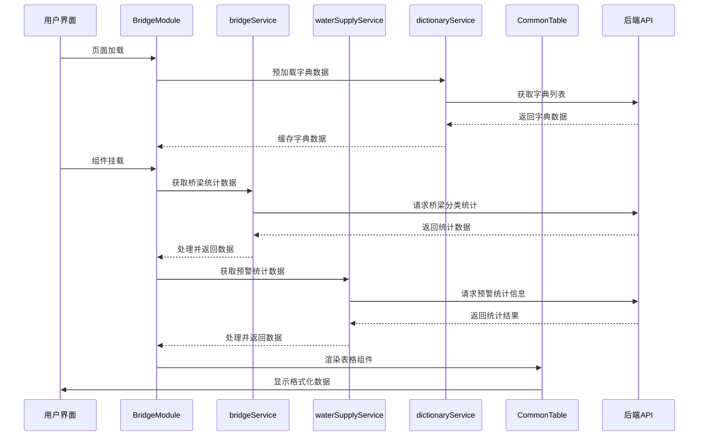
```mermaid
sequenceDiagram
participant U as 用户界面
participant BM as BridgeModule
participant BS as bridgeService
participant WS as waterSupplyService
participant DS as dictionaryService
participant CT as CommonTable
participant API as 后端API
U->>BM : 页面加载
BM->>DS : 预加载字典数据
DS->>API : 获取字典列表
API-->>DS : 返回字典数据
DS-->>BM : 缓存字典数据
U->>BM : 组件挂载
BM->>BS : 获取桥梁统计数据
BS->>API : 请求桥梁分类统计
API-->>BS : 返回统计数据
BS-->>BM : 处理并返回数据
BM->>WS : 获取预警统计数据
WS->>API : 请求预警统计信息
API-->>WS : 返回统计结果
WS-->>BM : 处理并返回数据
BM->>CT : 渲染表格组件
CT->>U : 显示格式化数据
```

**图表来源**
- [src/views/BridgeModule/index.vue](file://src/views/BridgeModule/index.vue#L38-L56)
- [src/services/bridgeService.ts](file://src/services/bridgeService.ts#L15-L56)
- [src/services/waterSupplyService.ts](file://src/services/waterSupplyService.ts#L15-L107)

**章节来源**
- [src/views/BridgeModule/index.vue](file://src/views/BridgeModule/index.vue#L24-L56)
- [src/services/bridgeService.ts](file://src/services/bridgeService.ts#L1-L57)
- [src/services/waterSupplyService.ts](file://src/services/waterSupplyService.ts#L1-L186)

## 详细组件分析

### 概述模块 (OverviewModule)

概述模块是桥模块的核心展示组件，负责提供桥梁基础设施的整体概览信息。

#### 数据结构和处理流程

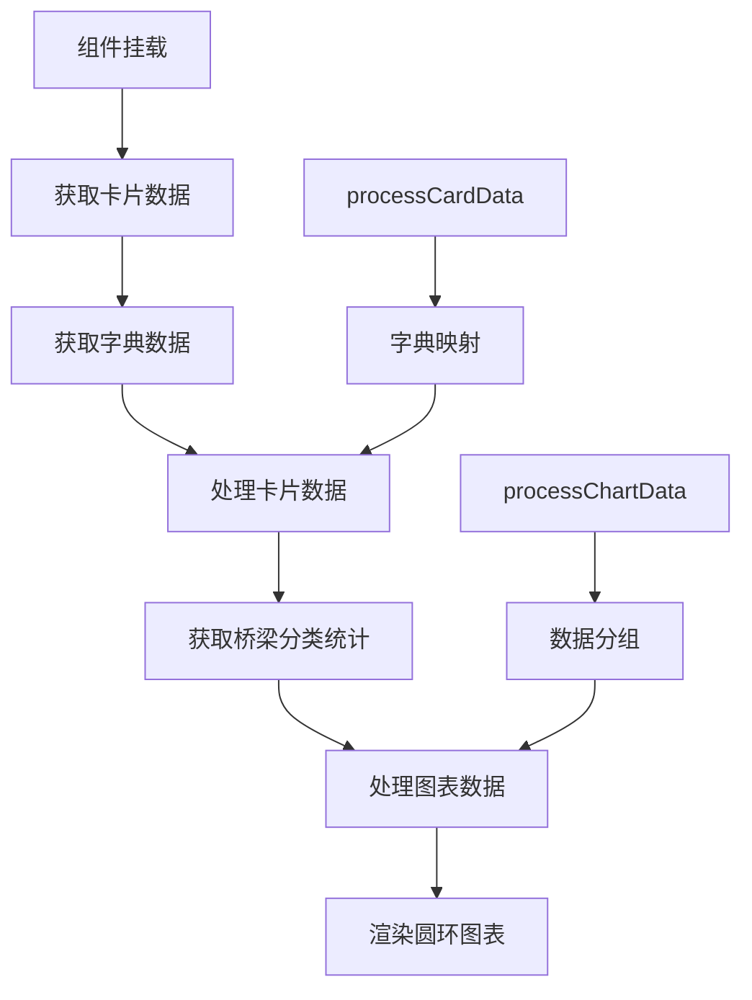
```mermaid
flowchart TD
A[组件挂载] --> B[获取卡片数据]
B --> C[获取字典数据]
C --> D[处理卡片数据]
D --> E[获取桥梁分类统计]
E --> F[处理图表数据]
F --> G[渲染圆环图表]
H[字典映射] --> D
I[数据分组] --> F
J[processCardData] --> H
K[processChartData] --> I
```

**图表来源**
- [src/views/BridgeModule/components/OverviewModule.vue](file://src/views/BridgeModule/components/OverviewModule.vue#L65-L147)

#### 统计卡片设计

概述模块包含四种类型的统计卡片，每种卡片都有特定的颜色主题和用途：

| 卡片类型 | 编码 | 颜色主题 | 用途 |
|---------|------|----------|------|
| 总桥梁数 | jcssdstj0601 | 青蓝色渐变 | 显示桥梁总数 |
| 大桥及特大桥 | jcssdstj0602 | 橙黄色渐变 | 显示大型桥梁数量 |
| 立交桥 | jcssdstj0603 | 蓝色渐变 | 显示立交桥数量 |
| 涵洞 | jcssdstj0604 | 蓝色渐变 | 显示涵洞数量 |

#### 图表配置

概述模块使用ECharts创建多环形图，支持动态颜色配置和响应式布局：

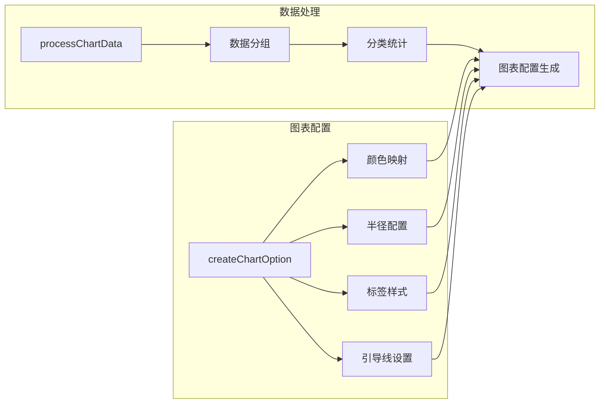
```mermaid
graph LR
subgraph "图表配置"
A[createChartOption] --> B[颜色映射]
A --> C[半径配置]
A --> D[标签样式]
A --> E[引导线设置]
end
subgraph "数据处理"
F[processChartData] --> G[数据分组]
G --> H[分类统计]
H --> I[图表配置生成]
end
B --> I
C --> I
D --> I
E --> I
```

**图表来源**
- [src/views/BridgeModule/chartOption.ts](file://src/views/BridgeModule/chartOption.ts#L78-L118)
- [src/views/BridgeModule/components/OverviewModule.vue](file://src/views/BridgeModule/components/OverviewModule.vue#L121-L147)

**章节来源**
- [src/views/BridgeModule/components/OverviewModule.vue](file://src/views/BridgeModule/components/OverviewModule.vue#L1-L379)
- [src/views/BridgeModule/chartOption.ts](file://src/views/BridgeModule/chartOption.ts#L1-L217)

### 桥梁监控模块 (BridgeMonitoringModule)

桥梁监控模块提供桥梁图片的轮播展示功能，支持自动播放和手动控制。

#### 轮播组件架构

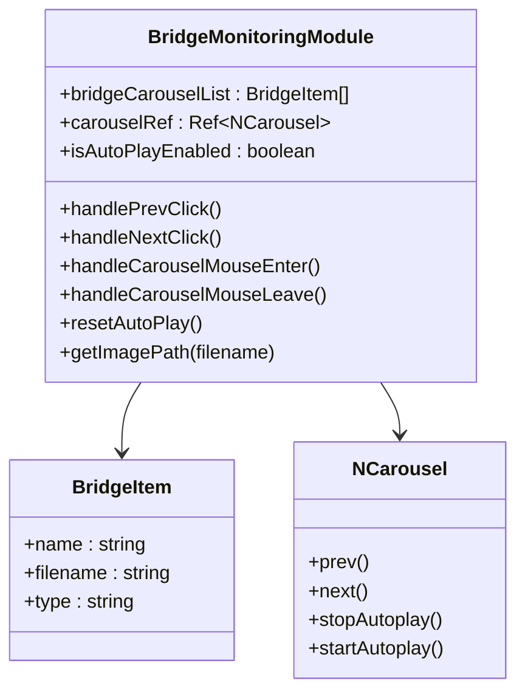
```mermaid
classDiagram
class BridgeMonitoringModule {
+bridgeCarouselList : BridgeItem[]
+carouselRef : Ref~NCarousel~
+isAutoPlayEnabled : boolean
+handlePrevClick()
+handleNextClick()
+handleCarouselMouseEnter()
+handleCarouselMouseLeave()
+resetAutoPlay()
+getImagePath(filename)
}
class BridgeItem {
+name : string
+filename : string
+type : string
}
class NCarousel {
+prev()
+next()
+stopAutoplay()
+startAutoplay()
}
BridgeMonitoringModule --> BridgeItem
BridgeMonitoringModule --> NCarousel
```

**图表来源**
- [src/views/BridgeModule/components/BridgeMonitoringModule.vue](file://src/views/BridgeModule/components/BridgeMonitoringModule.vue#L63-L235)

#### 图片管理策略

模块支持两种图片管理方式：

1. **静态导入**: 适用于少量固定图片
2. **动态路径**: 适用于大量动态图片资源

图片路径生成采用环境变量配置，确保开发和生产环境的一致性。

**章节来源**
- [src/views/BridgeModule/components/BridgeMonitoringModule.vue](file://src/views/BridgeModule/components/BridgeMonitoringModule.vue#L1-L457)

### 监测设备模块 (MonitoringDeviceModule)

监测设备模块专注于展示桥梁监测设备的状态统计信息，现已完全迁移到使用CommonTable组件。

#### 表格组件重构

**更新** 模块已完全迁移到使用CommonTable组件，实现了统一的表格渲染和数据格式化功能。

#### 设备状态统计

模块提供三种关键的设备统计指标：

| 统计指标 | 描述 | 颜色主题 |
|---------|------|----------|
| 在线数 | 设备正常运行数量 | 蓝色渐变 |
| 离线数 | 设备断网或故障数量 | 橙色渐变 |
| 故障数 | 设备硬件或软件故障数量 | 红色渐变 |

#### 数据获取流程

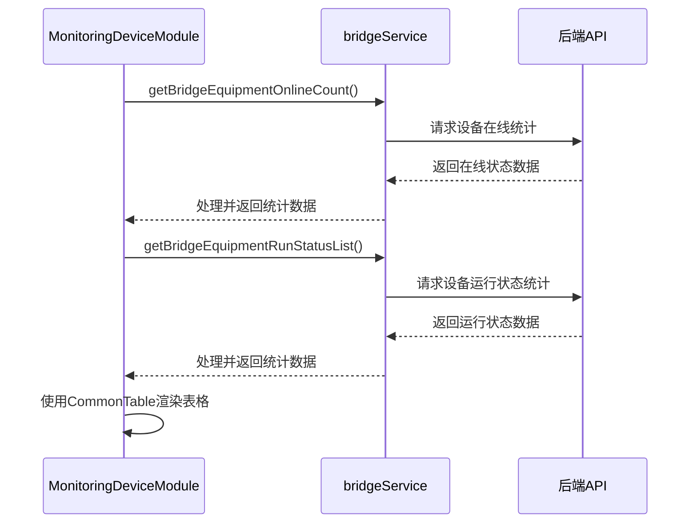
```mermaid
sequenceDiagram
participant M as MonitoringDeviceModule
participant BS as bridgeService
participant API as 后端API
M->>BS : getBridgeEquipmentOnlineCount()
BS->>API : 请求设备在线统计
API-->>BS : 返回在线状态数据
BS-->>M : 处理并返回统计数据
M->>BS : getBridgeEquipmentRunStatusList()
BS->>API : 请求设备运行状态统计
API-->>BS : 返回运行状态数据
BS-->>M : 处理并返回统计数据
M->>M : 使用CommonTable渲染表格
```

**图表来源**
- [src/views/BridgeModule/components/MonitoringDeviceModule.vue](file://src/views/BridgeModule/components/MonitoringDeviceModule.vue#L99-L147)

#### 表格列配置

模块使用CommonTable组件的自定义插槽功能，实现了风险级别高亮和状态徽章显示：

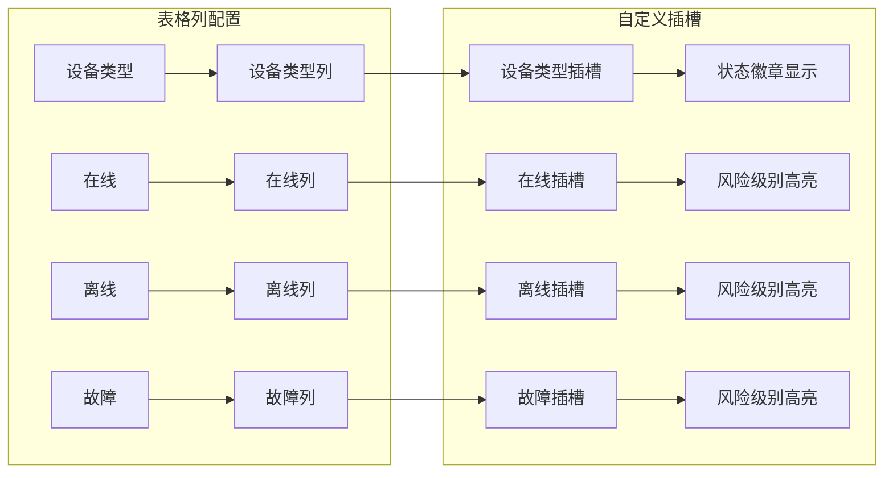
```mermaid
graph LR
subgraph "表格列配置"
A[设备类型] --> B[设备类型列]
C[在线] --> D[在线列]
E[离线] --> F[离线列]
G[故障] --> H[故障列]
end
subgraph "自定义插槽"
I[设备类型插槽] --> J[状态徽章显示]
K[在线插槽] --> L[风险级别高亮]
M[离线插槽] --> N[风险级别高亮]
O[故障插槽] --> P[风险级别高亮]
end
B --> I
D --> K
F --> M
H --> O
```

**图表来源**
- [src/views/BridgeModule/components/MonitoringDeviceModule.vue](file://src/views/BridgeModule/components/MonitoringDeviceModule.vue#L84-L97)
- [src/components/CommonTable.vue](file://src/components/CommonTable.vue#L39-L46)

#### 表格滚动优化

**新增** 模块使用maxHeight属性实现了表格滚动优化，设置了300px的最大高度，提升了大数据量下的性能表现：

```mermaid
graph TD
A[表格容器] --> B[maxHeight: 300px]
B --> C[溢出滚动]
C --> D[虚拟滚动优化]
D --> E[性能提升]
```

**章节来源**
- [src/views/BridgeModule/components/MonitoringDeviceModule.vue](file://src/views/BridgeModule/components/MonitoringDeviceModule.vue#L1-L253)

### 风险隐患模块 (BridgeRiskHazardModule)

风险隐患模块是桥模块中最复杂的组件，负责展示桥梁风险评估和整改状态信息。

#### 风险等级图表

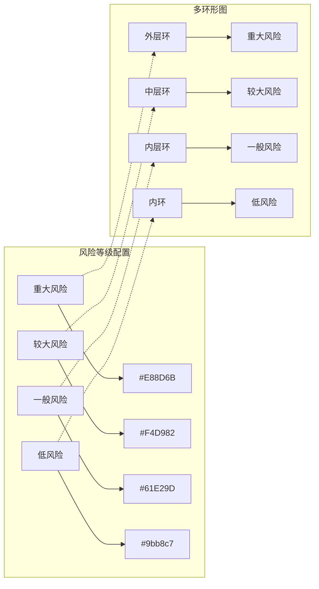
```mermaid
graph LR
subgraph "风险等级配置"
A[重大风险] --> B["#E88D6B"]
C[较大风险] --> D["#F4D982"]
E[一般风险] --> F["#61E29D"]
G[低风险] --> H["#9bb8c7"]
end
subgraph "多环形图"
I[外层环] --> J[重大风险]
K[中层环] --> L[较大风险]
M[内层环] --> N[一般风险]
O[内环] --> P[低风险]
end
A -.-> I
C -.-> K
E -.-> M
G -.-> O
```

**图表来源**
- [src/views/BridgeModule/chartOption.ts](file://src/views/BridgeModule/chartOption.ts#L11-L16)
- [src/views/BridgeModule/chartOption.ts](file://src/views/BridgeModule/chartOption.ts#L83-L88)

#### 整改状态管理

模块支持四种整改状态的可视化展示：

| 状态类型 | 编码 | 颜色方案 | 描述 |
|---------|------|----------|------|
| 已整改 | rectified | 白色到青蓝色渐变 | 风险已完全消除 |
| 未整改 | notRectified | 橙色到红色渐变 | 风险尚未处理 |
| 整改中 | inRectification | 黄色到橙色渐变 | 正在处理中 |
| 持续跟进 | continuousImprovement | 青蓝色到白色渐变 | 持续监控改进 |

**章节来源**
- [src/views/BridgeModule/components/BridgeRiskHazardModule.vue](file://src/views/BridgeModule/components/BridgeRiskHazardModule.vue#L1-L585)
- [src/views/BridgeModule/chartOption.ts](file://src/views/BridgeModule/chartOption.ts#L124-L195)

### 预警报警模块 (BridgeWarningAlarmModule)

预警报警模块提供桥梁预警和报警信息的综合展示，现已完全迁移到使用CommonTable组件。

#### 表格组件重构

**更新** 模块已完全迁移到使用CommonTable组件，实现了统一的表格渲染和数据格式化功能。

#### 统计卡片设计

模块包含两个主要的统计卡片区域：

1. **预警统计卡片**: 展示预警总数和各级别预警数量
2. **报警统计卡片**: 展示报警总数和各类报警状态

#### 数据结构设计

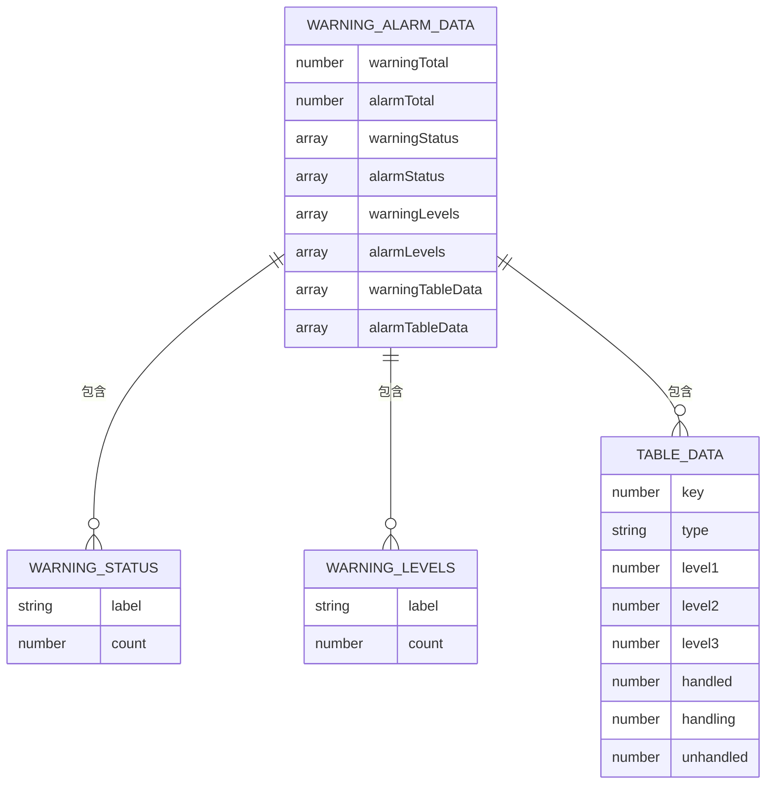
```mermaid
erDiagram
WARNING_ALARM_DATA {
number warningTotal
number alarmTotal
array warningStatus
array alarmStatus
array warningLevels
array alarmLevels
array warningTableData
array alarmTableData
}
WARNING_STATUS {
string label
number count
}
WARNING_LEVELS {
string label
number count
}
TABLE_DATA {
number key
string type
number level1
number level2
number level3
number handled
number handling
number unhandled
}
WARNING_ALARM_DATA ||--o{ WARNING_STATUS : "包含"
WARNING_ALARM_DATA ||--o{ WARNING_LEVELS : "包含"
WARNING_ALARM_DATA ||--o{ TABLE_DATA : "包含"
```

**图表来源**
- [src/views/BridgeModule/components/BridgeWarningAlarmModule.vue](file://src/views/BridgeModule/components/BridgeWarningAlarmModule.vue#L146-L177)

#### 表格列配置

模块使用CommonTable组件的自定义插槽功能，实现了风险级别高亮和状态徽章显示：

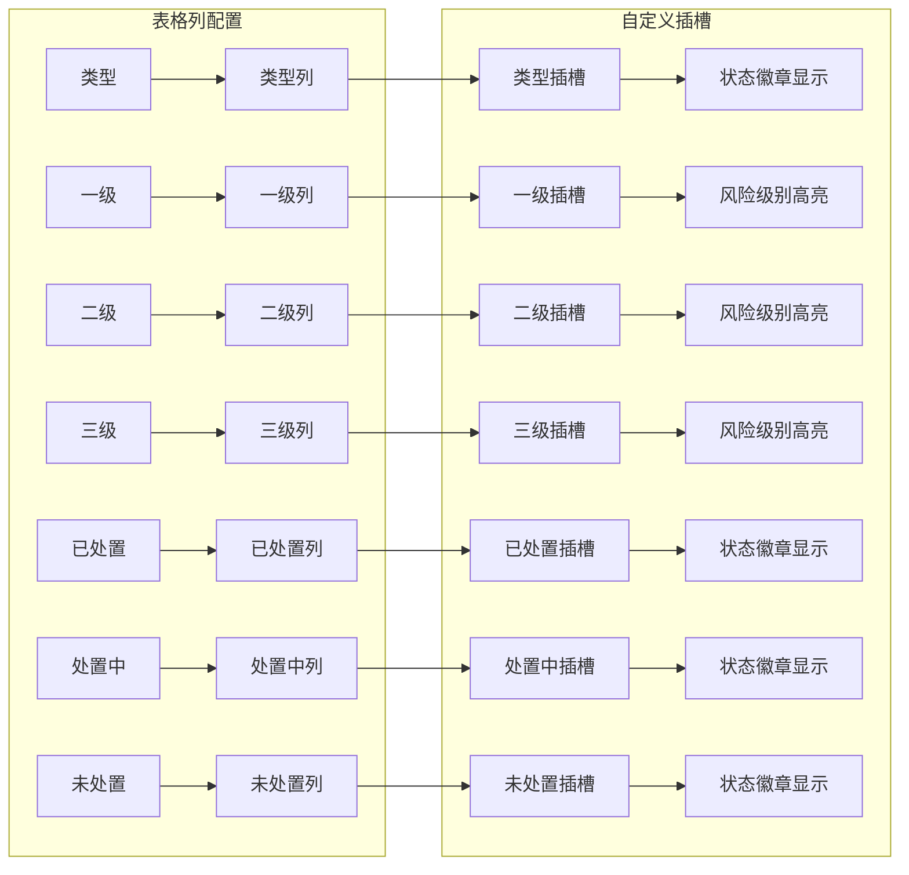
```mermaid
graph LR
subgraph "表格列配置"
A[类型] --> B[类型列]
C[一级] --> D[一级列]
E[二级] --> F[二级列]
G[三级] --> H[三级列]
I[已处置] --> J[已处置列]
K[处置中] --> L[处置中列]
M[未处置] --> N[未处置列]
end
subgraph "自定义插槽"
O[类型插槽] --> P[状态徽章显示]
Q[一级插槽] --> R[风险级别高亮]
S[二级插槽] --> T[风险级别高亮]
U[三级插槽] --> V[风险级别高亮]
W[已处置插槽] --> X[状态徽章显示]
Y[处置中插槽] --> Z[状态徽章显示]
AA[未处置插槽] --> AB[状态徽章显示]
end
B --> O
D --> Q
F --> S
H --> U
J --> W
L --> Y
N --> AA
```

**图表来源**
- [src/views/BridgeModule/components/BridgeWarningAlarmModule.vue](file://src/views/BridgeModule/components/BridgeWarningAlarmModule.vue#L161-L175)
- [src/components/CommonTable.vue](file://src/components/CommonTable.vue#L39-L46)

#### 表格滚动优化

**新增** 模块使用maxHeight属性实现了表格滚动优化，设置了260px的最大高度，提升了大数据量下的性能表现：

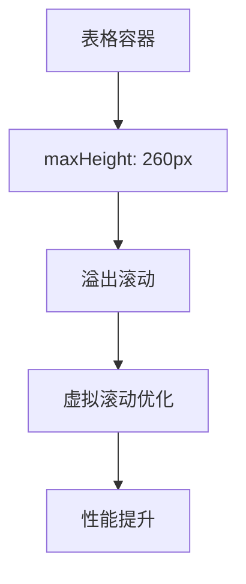
```mermaid
graph TD
A[表格容器] --> B[maxHeight: 260px]
B --> C[溢出滚动]
C --> D[虚拟滚动优化]
D --> E[性能提升]
```

**章节来源**
- [src/views/BridgeModule/components/BridgeWarningAlarmModule.vue](file://src/views/BridgeModule/components/BridgeWarningAlarmModule.vue#L1-L548)

### 地图交互组件

桥模块的地图交互功能通过Vue Cesium集成实现，提供丰富的三维可视化能力。

#### 桥梁列表面板

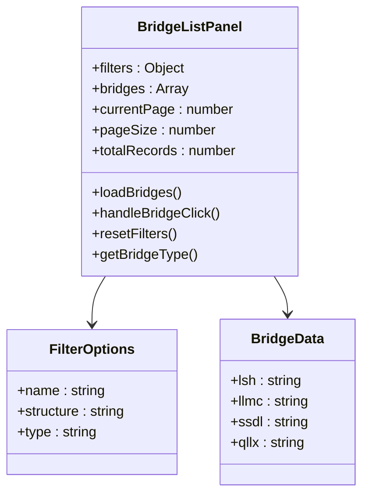
```mermaid
classDiagram
class BridgeListPanel {
+filters : Object
+bridges : Array
+currentPage : number
+pageSize : number
+totalRecords : number
+loadBridges()
+handleBridgeClick()
+resetFilters()
+getBridgeType()
}
class FilterOptions {
+name : string
+structure : string
+type : string
}
class BridgeData {
+lsh : string
+llmc : string
+ssdl : string
+qllx : string
}
BridgeListPanel --> FilterOptions
BridgeListPanel --> BridgeData
```

**图表来源**
- [src/views/BridgeModule/components/map/BridgeListPanel.vue](file://src/views/BridgeModule/components/map/BridgeListPanel.vue#L127-L264)

#### 桥梁详情对话框

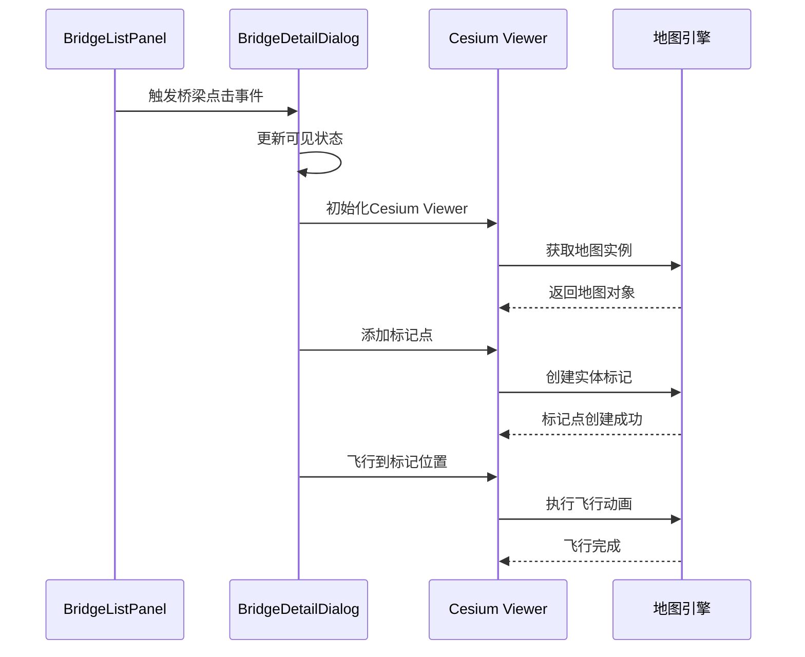
```mermaid
sequenceDiagram
participant LP as BridgeListPanel
participant DD as BridgeDetailDialog
participant CE as Cesium Viewer
participant MAP as 地图引擎
LP->>DD : 触发桥梁点击事件
DD->>DD : 更新可见状态
DD->>CE : 初始化Cesium Viewer
CE->>MAP : 获取地图实例
MAP-->>CE : 返回地图对象
DD->>CE : 添加标记点
CE->>MAP : 创建实体标记
MAP-->>CE : 标记点创建成功
DD->>CE : 飞行到标记位置
CE->>MAP : 执行飞行动画
MAP-->>CE : 飞行完成
```

**图表来源**
- [src/views/BridgeModule/components/map/BridgeDetailDialog.vue](file://src/views/BridgeModule/components/map/BridgeDetailDialog.vue#L177-L225)

**章节来源**
- [src/views/BridgeModule/components/map/BridgeListPanel.vue](file://src/views/BridgeModule/components/map/BridgeListPanel.vue#L1-L713)
- [src/views/BridgeModule/components/map/BridgeDetailDialog.vue](file://src/views/BridgeModule/components/map/BridgeDetailDialog.vue#L1-L409)

## 依赖关系分析

桥模块的依赖关系体现了清晰的分层架构和模块化设计：

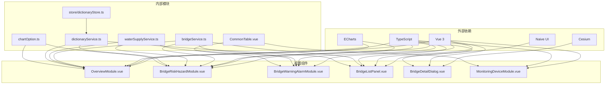
```mermaid
graph TB
subgraph "外部依赖"
A[ECharts]
B[Naive UI]
C[Cesium]
D[Vue 3]
E[TypeScript]
end
subgraph "内部模块"
F[bridgeService.ts]
G[waterSupplyService.ts]
H[dictionaryService.ts]
I[chartOption.ts]
J[store/dictionaryStore.ts]
K[CommonTable.vue]
end
subgraph "视图组件"
L[OverviewModule.vue]
M[BridgeRiskHazardModule.vue]
N[BridgeWarningAlarmModule.vue]
O[BridgeListPanel.vue]
P[BridgeDetailDialog.vue]
Q[MonitoringDeviceModule.vue]
end
A --> L
A --> M
B --> O
C --> P
D --> L
D --> M
D --> N
D --> O
D --> P
D --> Q
E --> L
E --> M
E --> N
E --> O
E --> P
E --> Q
F --> L
F --> M
F --> N
F --> O
G --> L
G --> M
G --> N
H --> L
H --> M
H --> O
I --> L
I --> M
J --> H
K --> N
K --> Q
```

**图表来源**
- [src/services/bridgeService.ts](file://src/services/bridgeService.ts#L6-L10)
- [src/services/waterSupplyService.ts](file://src/services/waterSupplyService.ts#L6-L10)
- [src/services/dictionaryService.ts](file://src/services/dictionaryService.ts#L8-L18)

### 服务层依赖

桥模块的服务层提供了统一的API访问接口，封装了业务逻辑和数据处理：

| 服务文件 | 主要功能 | 依赖关系 |
|---------|----------|----------|
| bridgeService.ts | 桥梁数据访问 | httpClient, config, BusinessModule |
| waterSupplyService.ts | 供水相关数据 | httpClient, config, BusinessModule |
| dictionaryService.ts | 字典数据缓存 | dictionaryStore |

### 图表配置依赖

图表配置模块提供了统一的ECharts配置管理：

| 配置项 | 作用 | 使用场景 |
|-------|------|----------|
| riskColorMap | 风险等级颜色映射 | 风险等级图表 |
| rectificationColorMap | 整改状态颜色映射 | 整改状态图表 |
| createChartOption | 图表配置生成器 | 多环形图 |
| createProgressOption | 进度图表配置 | 整改状态环形图 |

### CommonTable组件依赖

**新增** CommonTable组件作为统一的表格渲染基础，为多个模块提供一致的表格体验：

| 组件特性 | 功能描述 | 使用场景 |
|---------|----------|----------|
| 自定义插槽 | 支持列级别的自定义渲染 | 风险级别高亮显示 |
| 数值格式化 | 支持列级别的数据格式化 | 状态徽章显示 |
| 响应式布局 | 支持动态网格布局 | 不同屏幕尺寸适配 |
| 滚动支持 | 支持大数据量表格滚动 | 预警报警列表展示 |
| 最大高度控制 | 支持maxHeight属性控制 | 性能优化和布局控制 |
| 斑马纹样式 | 自动奇偶行样式区分 | 提升可读性 |

**章节来源**
- [src/services/bridgeService.ts](file://src/services/bridgeService.ts#L1-L57)
- [src/services/waterSupplyService.ts](file://src/services/waterSupplyService.ts#L1-L186)
- [src/services/dictionaryService.ts](file://src/services/dictionaryService.ts#L1-L45)
- [src/views/BridgeModule/chartOption.ts](file://src/views/BridgeModule/chartOption.ts#L1-L217)
- [src/components/CommonTable.vue](file://src/components/CommonTable.vue#L1-L309)

## 性能考虑

桥模块在设计时充分考虑了性能优化，采用了多种技术和策略来提升用户体验：

### 数据缓存策略

1. **字典数据缓存**: 使用dictionaryStore实现字典数据的本地缓存，避免重复请求
2. **组件状态缓存**: 桥梁列表数据在组件卸载时保持缓存，重新进入时直接使用
3. **图表实例复用**: ECharts图表实例在组件销毁时进行清理，避免内存泄漏
4. **表格组件复用**: CommonTable组件实例在组件销毁时进行清理，避免内存泄漏

### 图片优化

1. **懒加载机制**: 桥梁图片采用懒加载策略，减少初始加载时间
2. **路径动态生成**: 使用环境变量动态生成图片路径，支持CDN加速
3. **格式优化**: 支持多种图片格式，根据浏览器兼容性选择最优格式

### 响应式设计

1. **自适应布局**: 所有组件都支持响应式布局，适配不同屏幕尺寸
2. **弹性网格**: 使用CSS Grid和Flexbox实现灵活的布局调整
3. **字体缩放**: 字体大小根据屏幕分辨率自动调整

### 表格滚动优化

**新增** 模块广泛使用maxHeight属性实现了表格滚动优化：

1. **统一滚动控制**: 通过maxHeight属性统一控制表格最大高度
2. **性能提升**: 限制表格可视区域，减少DOM节点数量
3. **用户体验**: 提供平滑的滚动体验，避免页面抖动
4. **内存优化**: 控制表格渲染的内存占用

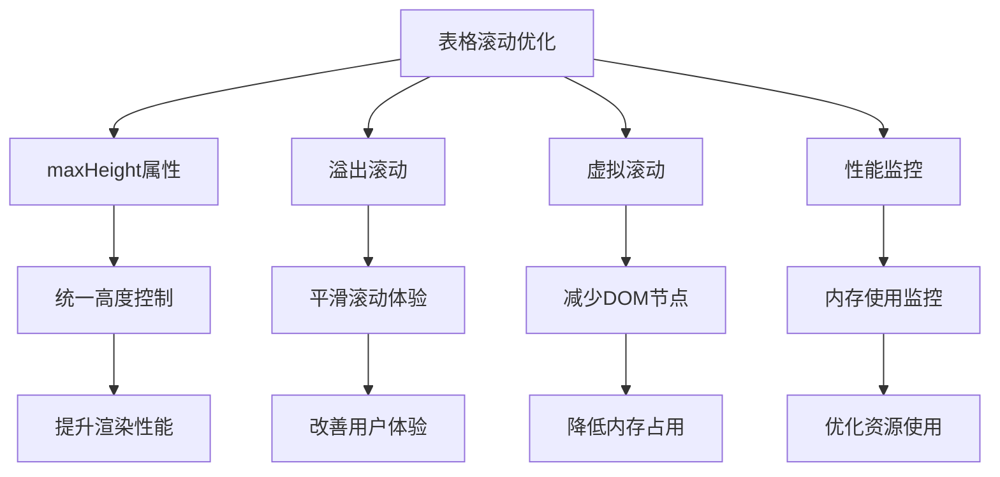
```mermaid
flowchart TD
A[表格滚动优化] --> B[maxHeight属性]
A --> C[溢出滚动]
A --> D[虚拟滚动]
A --> E[性能监控]
B --> F[统一高度控制]
C --> G[平滑滚动体验]
D --> H[减少DOM节点]
E --> I[内存使用监控]
F --> J[提升渲染性能]
G --> K[改善用户体验]
H --> L[降低内存占用]
I --> M[优化资源使用]
```

### 性能监控

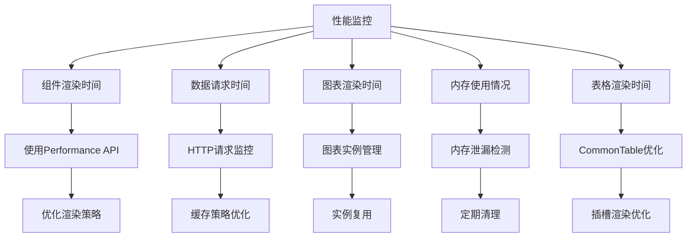
```mermaid
flowchart TD
A[性能监控] --> B[组件渲染时间]
A --> C[数据请求时间]
A --> D[图表渲染时间]
A --> E[内存使用情况]
A --> F[表格渲染时间]
B --> G[使用Performance API]
C --> H[HTTP请求监控]
D --> I[图表实例管理]
E --> J[内存泄漏检测]
F --> K[CommonTable优化]
G --> L[优化渲染策略]
H --> M[缓存策略优化]
I --> N[实例复用]
J --> O[定期清理]
K --> P[插槽渲染优化]
```

## 故障排除指南

桥模块可能遇到的各种问题及其解决方案：

### 常见问题及解决方案

#### 1. 数据加载失败

**问题症状**: 组件显示空白或加载状态长时间存在

**可能原因**:
- 网络连接异常
- API接口返回错误
- 字典数据缓存失效
- CommonTable组件渲染异常

**解决步骤**:
1. 检查网络连接状态
2. 查看浏览器开发者工具的Network面板
3. 验证API接口的可用性
4. 清除字典缓存后重试
5. 检查CommonTable组件的列配置

#### 2. 图表渲染异常

**问题症状**: 图表显示不完整或出现空白

**可能原因**:
- ECharts实例初始化失败
- DOM元素未就绪
- 图表配置参数错误

**解决步骤**:
1. 确认DOM元素ID正确
2. 检查图表容器的尺寸设置
3. 验证图表配置参数的有效性
4. 使用nextTick确保DOM更新完成

#### 3. 地图标记问题

**问题症状**: 桥梁标记点无法显示或定位不准确

**可能原因**:
- Cesium Viewer实例未正确初始化
- 经纬度坐标格式错误
- 标记点重复添加

**解决步骤**:
1. 检查Cesium库的加载状态
2. 验证经纬度坐标的格式和范围
3. 确保每次添加新标记前先移除旧标记
4. 检查地图权限和配置

#### 4. 表格渲染问题

**问题症状**: CommonTable组件显示异常或数据格式化错误

**可能原因**:
- 列配置参数错误
- 自定义插槽渲染异常
- 数据格式不符合要求
- CommonTable组件实例问题
- maxHeight属性设置不当

**解决步骤**:
1. 检查列配置数组的完整性
2. 验证自定义插槽的命名和参数传递
3. 确认数据格式符合预期
4. 重新初始化CommonTable组件实例
5. 检查表格样式和布局配置
6. 调整maxHeight属性值以优化性能

#### 5. 性能问题

**问题症状**: 页面卡顿或响应缓慢

**可能原因**:
- 数据量过大导致渲染压力
- 图表实例过多未及时清理
- 图片资源加载阻塞
- 表格组件渲染压力
- maxHeight属性设置不合理

**解决步骤**:
1. 实施数据分页加载
2. 优化图表渲染频率
3. 使用图片懒加载
4. 实现组件卸载时的资源清理
5. 优化表格组件的渲染性能
6. 合理设置maxHeight属性值
7. 监控内存使用情况

### 调试工具和技巧

1. **浏览器开发者工具**: 使用Performance面板分析渲染性能
2. **Vue DevTools**: 检查组件状态和生命周期
3. **Network面板**: 监控API请求和响应时间
4. **Console日志**: 添加关键节点的日志输出
5. **CommonTable调试**: 检查列配置和插槽渲染
6. **maxHeight调试**: 监控表格滚动性能和内存使用

**章节来源**
- [src/views/BridgeModule/components/OverviewModule.vue](file://src/views/BridgeModule/components/OverviewModule.vue#L69-L72)
- [src/views/BridgeModule/components/BridgeDetailDialog.vue](file://src/views/BridgeModule/components/BridgeDetailDialog.vue#L188-L225)

## 结论

桥模块作为一个功能完备的桥梁管理平台，展现了现代前端技术的最佳实践。通过合理的架构设计、清晰的组件划分和完善的性能优化策略，该模块为政府用户提供了直观、高效的桥梁管理体验。

### 主要优势

1. **模块化设计**: 清晰的组件职责分离，便于维护和扩展
2. **数据驱动**: 基于服务层的数据访问模式，确保数据一致性
3. **可视化丰富**: 集成多种图表库，提供丰富的数据可视化能力
4. **用户体验**: 响应式设计和流畅的交互体验
5. **性能优化**: 多层次的性能优化策略，确保应用稳定性
6. **统一表格**: CommonTable组件提供一致的表格渲染体验
7. **滚动优化**: maxHeight属性实现表格滚动优化，提升性能表现

### 技术亮点

1. **TypeScript集成**: 提供类型安全和更好的开发体验
2. **Vue 3 Composition API**: 利用最新的Vue特性提升开发效率
3. **现代化构建工具**: Vite提供快速的开发和构建体验
4. **三维可视化**: Cesium集成实现精确的地理信息展示
5. **组件化UI**: Naive UI提供丰富的UI组件库
6. **表格标准化**: CommonTable组件实现表格渲染的标准化
7. **性能监控**: maxHeight属性实现表格滚动性能监控

### 未来发展方向

1. **移动端适配**: 进一步优化移动端用户体验
2. **实时数据**: 集成WebSocket实现实时数据更新
3. **AI辅助**: 集成机器学习算法进行风险预测
4. **扩展性增强**: 支持更多基础设施类型的管理
5. **国际化支持**: 添加多语言支持以服务更广泛的用户群体
6. **表格组件优化**: 进一步优化CommonTable组件的性能和功能
7. **滚动性能优化**: 深入优化maxHeight属性的使用，实现更好的虚拟滚动效果

桥模块不仅满足了当前的功能需求，更为未来的功能扩展和技术演进奠定了坚实的基础。通过表格组件的标准化重构和maxHeight属性的统一使用，模块的可维护性、性能表现和用户体验都得到了显著提升。