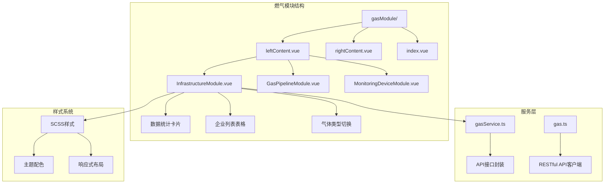
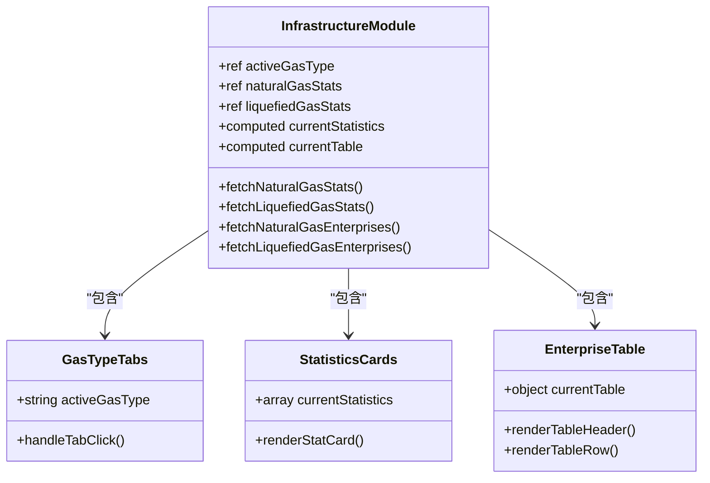
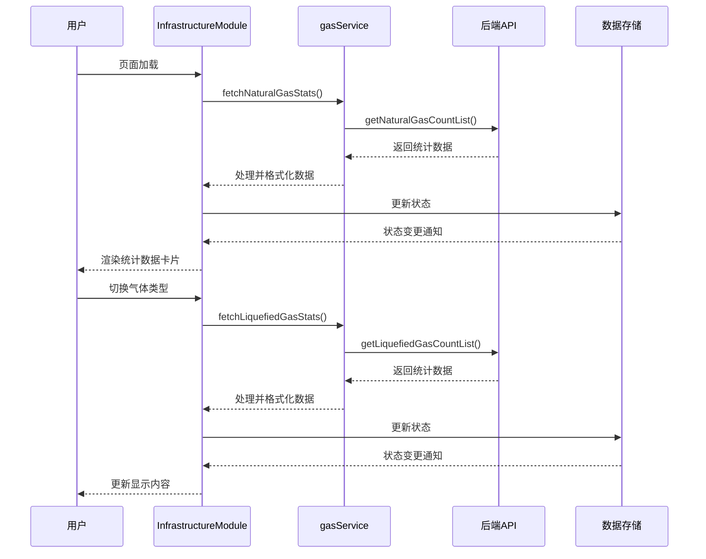
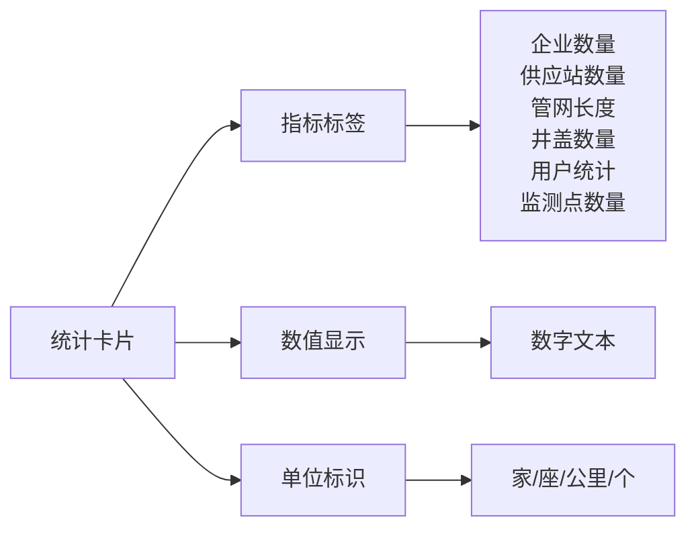
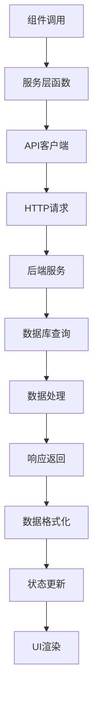
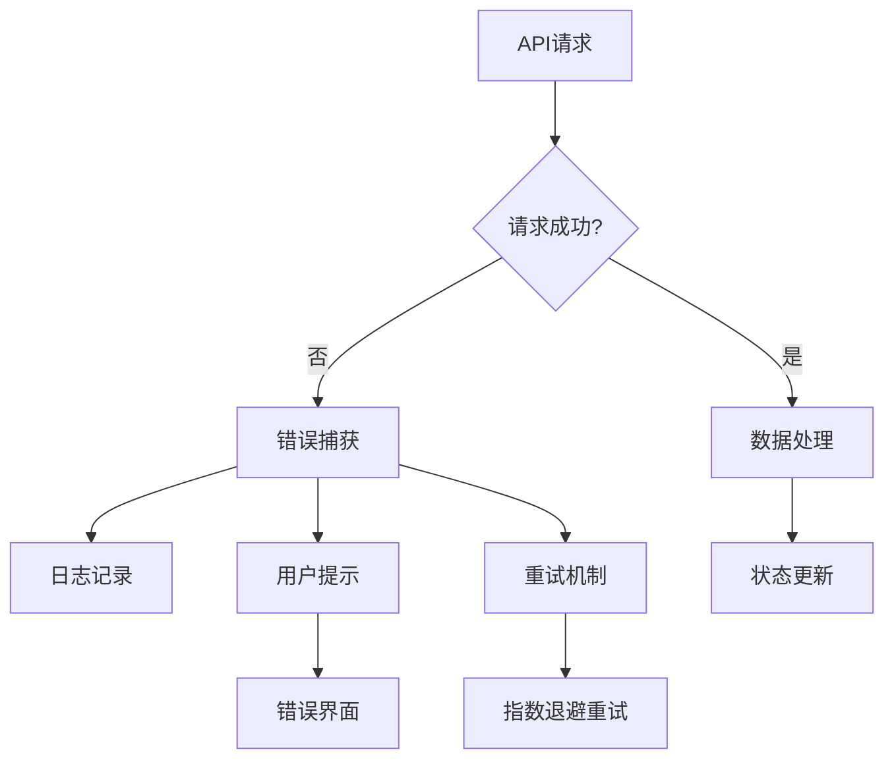
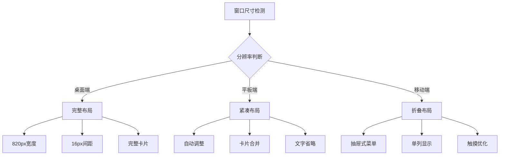
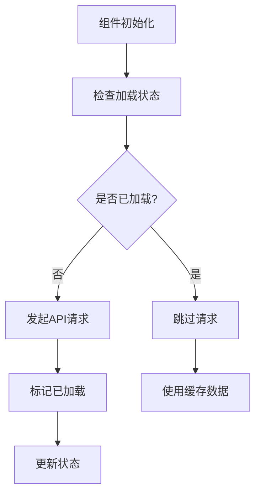
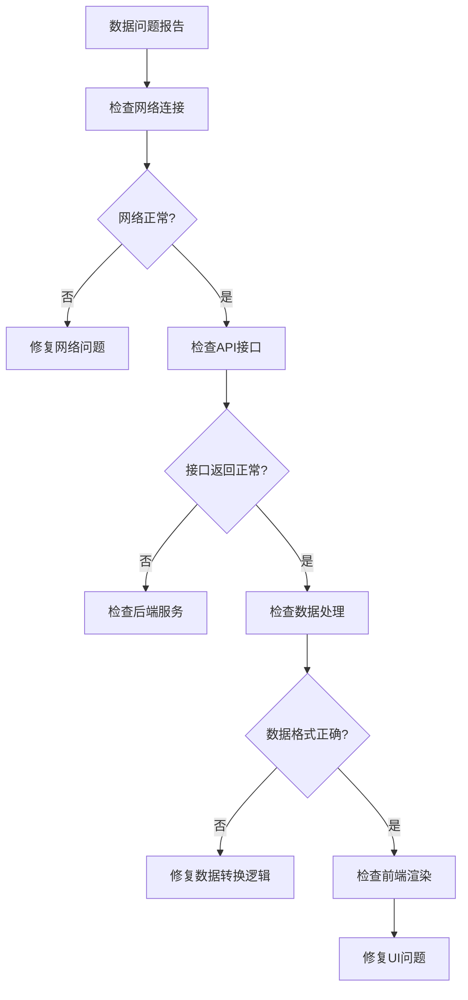

# 基础设施模块

<cite>
**本文档引用的文件**
- [InfrastructureModule.vue](file://src/views/gasModule/components/InfrastructureModule.vue)
- [leftContent.vue](file://src/views/gasModule/leftContent.vue)
- [GAS_MODULE_README.md](file://GAS_MODULE_README.md)
- [gasService.ts](file://src/services/gasService.ts)
- [gas.ts](file://src/api/gas.ts)
- [ResponsiveWrapper.vue](file://src/components/ResponsiveWrapper.vue)
- [index.ts](file://src/types/index.ts)
</cite>

## 目录
1. [模块概述](#模块概述)
2. [项目结构](#项目结构)
3. [核心组件](#核心组件)
4. [架构概览](#架构概览)
5. [详细组件分析](#详细组件分析)
6. [数据结构定义](#数据结构定义)
7. [API对接实现](#api对接实现)
8. [响应式适配机制](#响应式适配机制)
9. [性能优化策略](#性能优化策略)
10. [常见问题排查](#常见问题排查)
11. [总结](#总结)

## 模块概述

基础设施模块是燃气系统数据总览的核心组件，位于燃气模块的左侧功能区，采用卡片式设计展示燃气基础设施的关键统计数据。该模块作为燃气监测系统的重要入口，为用户提供直观的燃气设施概览信息。

### 核心功能定位

基础设施模块主要承担以下职责：
- **数据总览**：展示燃气管道总长度、调压站数量、阀门井数量等关键指标
- **用户统计**：提供燃气用户、工商用户和加气站的统计信息
- **双气体类型支持**：同时支持天然气和液化气两种气体类型的数据显示
- **实时数据更新**：动态加载和更新基础设施统计数据
- **企业列表展示**：提供详细的燃气企业信息列表

**章节来源**
- [InfrastructureModule.vue](file://src/views/gasModule/components/InfrastructureModule.vue#L1-L50)
- [GAS_MODULE_README.md](file://GAS_MODULE_README.md#L11-L21)

## 项目结构

基础设施模块在项目中的组织结构清晰明确，遵循模块化开发原则：



**图表来源**
- [leftContent.vue](file://src/views/gasModule/leftContent.vue#L1-L33)
- [InfrastructureModule.vue](file://src/views/gasModule/components/InfrastructureModule.vue#L1-L50)

**章节来源**
- [leftContent.vue](file://src/views/gasModule/leftContent.vue#L1-L33)
- [InfrastructureModule.vue](file://src/views/gasModule/components/InfrastructureModule.vue#L1-L50)

## 核心组件

基础设施模块由多个核心组件协同工作，形成完整的数据展示体系：

### 组件层次结构



**图表来源**
- [InfrastructureModule.vue](file://src/views/gasModule/components/InfrastructureModule.vue#L49-L191)

**章节来源**
- [InfrastructureModule.vue](file://src/views/gasModule/components/InfrastructureModule.vue#L49-L191)

## 架构概览

基础设施模块采用现代化的Vue 3 Composition API架构，结合响应式设计和模块化开发理念：



**图表来源**
- [InfrastructureModule.vue](file://src/views/gasModule/components/InfrastructureModule.vue#L102-L178)
- [gasService.ts](file://src/services/gasService.ts#L54-L70)

## 详细组件分析

### 气体类型切换组件

气体类型切换是模块的核心交互组件，支持天然气和液化气两种气体类型的无缝切换：

#### 组件特性
- **双态设计**：支持天然气和液化气两种气体类型
- **视觉反馈**：提供明显的激活状态指示
- **平滑过渡**：使用CSS动画实现流畅的状态切换
- **数据隔离**：每种气体类型维护独立的数据状态

#### 样式设计
- **主色调**：拂晓蓝（#1677ff）作为基础配色
- **激活效果**：渐变色彩变换，增强视觉吸引力
- **字体设计**：采用优雅的字体样式，提升专业感

**章节来源**
- [InfrastructureModule.vue](file://src/views/gasModule/components/InfrastructureModule.vue#L8-L18)

### 统计数据卡片组件

统计数据卡片采用图标+数值的卡片式设计，直观展示关键基础设施指标：

#### 卡片布局结构


**图表来源**
- [InfrastructureModule.vue](file://src/views/gasModule/components/InfrastructureModule.vue#L19-L27)

#### 数据映射规则
| 指标名称 | 单位 | 显示格式 |
|---------|------|----------|
| 企业 | 家 | 整数显示 |
| 供应站 | 座 | 整数显示 |
| 管网 | 公里 | 整数显示 |
| 井盖 | 个 | 整数显示 |
| 用户 | 户 | 整数显示 |
| 监测点 | 个 | 整数显示 |

**章节来源**
- [InfrastructureModule.vue](file://src/views/gasModule/components/InfrastructureModule.vue#L160-L171)

### 企业列表表格组件

企业列表提供详细的燃气企业信息，支持按气体类型筛选：

#### 表格列配置
- **天然气企业**：企业名称、职工人数、窨井数量、厂站数量、管线长度
- **液化气企业**：企业名称、职工人数、液化气瓶数量、客户总数、运输车辆数量

#### 交互特性
- **悬停效果**：鼠标悬停时显示渐变背景
- **滚动支持**：支持垂直滚动查看更多企业信息
- **响应式设计**：自适应不同屏幕尺寸

**章节来源**
- [InfrastructureModule.vue](file://src/views/gasModule/components/InfrastructureModule.vue#L29-L44)

## 数据结构定义

基础设施模块的数据结构设计遵循统一性和扩展性的原则：

### 统计数据结构

```typescript
interface StatisticItem {
  key: string;           // 指标唯一标识
  label: string;         // 显示标签
  value: number | string;// 数值
  unit: string;          // 单位
}

interface GasStatistics {
  naturalGasStats: StatisticItem[];
  liquefiedGasStats: StatisticItem[];
}
```

### 企业数据结构

```typescript
interface EnterpriseItem {
  id: string;                    // 企业ID
  qymc: string;                  // 企业名称
  zgrs: number;                  // 职工人数
  yyyjsl?: number;               // 窨井数量（天然气）
  yyczsl?: number;               // 厂站数量（天然气）
  yygxcd?: number;               // 管线长度（天然气）
  yhqpsl?: number;               // 液化气瓶数量（液化气）
  khzs?: number;                 // 客户总数（液化气）
  ysclsl?: number;               // 运输车辆数量（液化气）
}
```

### API响应结构

```typescript
interface ApiResponse {
  name: string;    // 指标名称
  count: number;   // 统计数量
}

interface EnterpriseApiResponse {
  id: string;
  qymc: string;
  zgrs: number;
  // 其他字段根据气体类型动态添加
}
```

**章节来源**
- [InfrastructureModule.vue](file://src/views/gasModule/components/InfrastructureModule.vue#L56-L91)
- [gasService.ts](file://src/services/gasService.ts#L54-L70)

## API对接实现

基础设施模块通过服务层与后端API进行数据交互，实现了完整的数据生命周期管理：

### 服务层架构



**图表来源**
- [gasService.ts](file://src/services/gasService.ts#L54-L70)
- [gas.ts](file://src/api/gas.ts#L210-L238)

### 核心API接口

#### 天然气统计数据接口
- **接口路径**：`/jcss/trq/count/list`
- **功能描述**：获取天然气基础设施数量统计
- **返回格式**：数组形式的统计数据对象

#### 液化气统计数据接口
- **接口路径**：`/jcss/yhq/count/list`
- **功能描述**：获取液化气基础设施数量统计
- **返回格式**：数组形式的统计数据对象

#### 企业列表接口
- **天然气企业**：`/gspspDtransGas/gasenterpriseledger/list`
- **液化气企业**：`/gspspDtransGas/bottlegasenterpriseledger/list`

### 错误处理机制



**图表来源**
- [InfrastructureModule.vue](file://src/views/gasModule/components/InfrastructureModule.vue#L103-L158)

**章节来源**
- [gasService.ts](file://src/services/gasService.ts#L54-L70)
- [gas.ts](file://src/api/gas.ts#L210-L238)

## 响应式适配机制

基础设施模块采用先进的响应式设计，确保在不同设备和分辨率下都能提供最佳的用户体验：

### 布局参数规范

根据GAS_MODULE_README.md的设计规范，模块采用以下布局参数：

| 参数项 | 数值 | 说明 |
|--------|------|------|
| 基准分辨率 | 4096×1920 | 设计基准尺寸 |
| 左侧宽度 | 820px | 固定宽度布局 |
| 模块间距 | 16px | 组件间标准间距 |
| 内边距 | 40px 30px | 模块内部填充 |
| 字体大小 | 20px/24px | 主要文本尺寸 |
| 卡片宽度 | 95px | 统计卡片固定宽度 |

### 响应式适配策略



**图表来源**
- [ResponsiveWrapper.vue](file://src/components/ResponsiveWrapper.vue#L67-L85)
- [leftContent.vue](file://src/views/gasModule/leftContent.vue#L21-L31)

### 配色方案实现

模块严格遵循设计规范的配色方案：

#### 主色调体系
- **拂晓蓝**：#1677ff（主色调）
- **成功色**：#52c41a（绿色系）
- **警告色**：#faad14（橙黄色）
- **错误色**：#ff4d4f（红色系）

#### 渐变效果
- **卡片背景**：线性渐变从rgba(0,150,255,0.08)到rgba(0,100,200,0.05)
- **激活状态**：渐变色彩变换，增强视觉反馈

**章节来源**
- [GAS_MODULE_README.md](file://GAS_MODULE_README.md#L88-L109)
- [InfrastructureModule.vue](file://src/views/gasModule/components/InfrastructureModule.vue#L193-L381)

## 性能优化策略

基础设施模块实施了多层次的性能优化措施，确保良好的用户体验：

### 数据加载优化

#### 防重复加载机制


**图表来源**
- [InfrastructureModule.vue](file://src/views/gasModule/components/InfrastructureModule.vue#L85-L91)

#### 懒加载策略
- **按需加载**：仅在用户切换到相应气体类型时才加载对应数据
- **预加载准备**：组件挂载时预先加载天然气数据
- **缓存机制**：避免重复请求相同数据

### 渲染性能优化

#### 虚拟滚动
对于企业列表，当数据量较大时采用虚拟滚动技术：
- **可见区域渲染**：只渲染当前可视区域的企业信息
- **动态高度**：根据内容自动调整行高
- **内存优化**：减少DOM节点数量

#### 组件缓存
- **keep-alive**：使用Vue的keep-alive指令缓存组件状态
- **状态持久化**：在组件卸载时保存用户选择状态
- **快速恢复**：重新激活时立即恢复之前的状态

### 网络优化

#### 请求合并
- **批量请求**：同时获取统计数据和企业列表
- **并发控制**：合理控制并发请求数量
- **超时处理**：设置合理的请求超时时间

#### 数据压缩
- **JSON序列化**：优化数据传输格式
- **增量更新**：支持部分数据更新而非全量刷新

**章节来源**
- [InfrastructureModule.vue](file://src/views/gasModule/components/InfrastructureModule.vue#L102-L178)

## 常见问题排查

基础设施模块在实际使用中可能遇到以下常见问题及解决方案：

### 数据加载问题

#### 问题现象
- **数据加载缓慢**：页面显示空白或长时间无响应
- **统计数据不准确**：显示的数值与预期不符
- **企业列表为空**：无法显示企业信息

#### 排查步骤



#### 解决方案
1. **网络连接检查**：确认浏览器能够正常访问API服务器
2. **API接口验证**：使用Postman或curl测试API接口
3. **数据格式校验**：检查返回数据是否符合预期格式
4. **错误日志分析**：查看浏览器控制台和服务器日志

### 显示问题

#### 问题现象
- **布局错乱**：卡片排列不整齐或超出边界
- **样式异常**：颜色显示不正确或字体过大
- **响应式失效**：在移动设备上显示异常

#### 排查方法
1. **浏览器兼容性**：测试不同浏览器的显示效果
2. **CSS样式检查**：验证SCSS编译后的CSS是否正确
3. **媒体查询测试**：检查断点设置是否合理
4. **缩放比例验证**：确认响应式缩放计算正确

### 性能问题

#### 问题现象
- **页面卡顿**：滚动时出现明显延迟
- **内存泄漏**：长时间使用后页面变慢
- **CPU占用过高**：浏览器标签页占用大量CPU资源

#### 优化措施
1. **性能监控**：使用浏览器开发者工具分析性能瓶颈
2. **内存分析**：检查是否存在未释放的DOM引用
3. **渲染优化**：减少不必要的重新渲染
4. **事件监听器清理**：确保组件销毁时移除事件监听器

### 数据关联性问题

基础设施模块与其他监测模块存在密切的数据关联：

#### 数据共享机制
- **实时数据同步**：各模块共享最新的统计数据
- **状态一致性**：确保气体类型切换时数据同步更新
- **缓存策略**：合理利用缓存避免重复数据获取

#### 跨模块通信
- **事件总线**：使用Vue事件系统进行模块间通信
- **状态管理**：通过Vuex或Pinia管理全局状态
- **依赖注入**：使用provide/inject模式传递共享数据

**章节来源**
- [InfrastructureModule.vue](file://src/views/gasModule/components/InfrastructureModule.vue#L173-L186)

## 总结

基础设施模块作为燃气系统数据总览的核心组件，展现了现代Web应用开发的最佳实践。通过模块化的架构设计、响应式的布局适配、完善的性能优化和健壮的错误处理机制，该模块为用户提供了直观、高效、可靠的燃气基础设施数据展示体验。

### 核心优势

1. **设计理念先进**：采用卡片式设计和双气体类型支持，满足多样化需求
2. **技术架构成熟**：基于Vue 3 Composition API，代码结构清晰可维护
3. **用户体验优秀**：响应式设计确保跨设备兼容性，交互流畅自然
4. **性能表现优异**：多层次优化策略保证良好的加载速度和运行效率
5. **扩展性良好**：模块化设计便于功能扩展和维护升级

### 应用价值

基础设施模块不仅为燃气系统的日常监测提供了重要的数据支撑，也为决策者提供了直观的运营概览。其标准化的设计规范和可靠的技术实现，为整个燃气监测系统的稳定运行奠定了坚实基础。

通过持续的优化和完善，基础设施模块将继续发挥其在燃气安全管理中的重要作用，为城市安全运行保驾护航。