# 应急资源模块

<cite>
**本文档引用的文件**
- [rightContent.vue](file://src/views/gasModule/rightContent.vue)
- [EmergencyResourceModule.vue](file://src/views/gasModule/components/EmergencyResourceModule.vue)
- [gasService.ts](file://src/services/gasService.ts)
- [GAS_MODULE_README.md](file://GAS_MODULE_README.md)
- [apiConfig.ts](file://src/api/apiConfig.ts)
- [ResponsiveWrapper.vue](file://src/components/ResponsiveWrapper.vue)
</cite>

## 目录
1. [模块概述](#模块概述)
2. [项目结构](#项目结构)
3. [核心组件](#核心组件)
4. [架构概览](#架构概览)
5. [详细组件分析](#详细组件分析)
6. [数据模型与接口](#数据模型与接口)
7. [资源调度功能](#资源调度功能)
8. [实时更新机制](#实时更新机制)
9. [故障排查指南](#故障排查指南)
10. [总结](#总结)

## 模块概述

应急资源模块是燃气模块右侧功能区的重要组成部分，负责展示和管理应急响应所需的各类资源。该模块严格遵循GAS_MODULE_README.md的设计规范，采用卡片式布局展示应急人员、车辆、装备和物资的数量与状态信息，为应急响应提供直观的数据支撑。

### 核心功能特性

- **资源统计展示**：通过统计卡片展示应急专家、医疗队伍、避难场所、救援队伍、救援人员、救援仓库等六类资源
- **车辆统计**：专门的救援车辆统计功能
- **中心圆环设计**：独特的应急资源圆环视觉元素
- **响应式布局**：基于网格系统实现灵活的布局适配
- **数据接口对接**：与后端API无缝集成

**章节来源**
- [GAS_MODULE_README.md](file://GAS_MODULE_README.md#L57-L66)
- [EmergencyResourceModule.vue](file://src/views/gasModule/components/EmergencyResourceModule.vue#L1-L40)

## 项目结构

应急资源模块在燃气模块中的组织结构清晰明确，体现了良好的模块化设计理念。

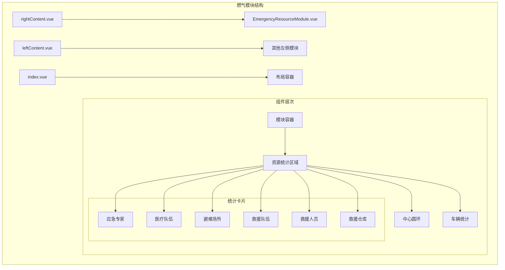

**图表来源**
- [rightContent.vue](file://src/views/gasModule/rightContent.vue#L1-L33)
- [EmergencyResourceModule.vue](file://src/views/gasModule/components/EmergencyResourceModule.vue#L1-L40)

**章节来源**
- [rightContent.vue](file://src/views/gasModule/rightContent.vue#L1-L33)
- [EmergencyResourceModule.vue](file://src/views/gasModule/components/EmergencyResourceModule.vue#L1-L40)

## 核心组件

应急资源模块的核心组件是`EmergencyResourceModule.vue`，它负责整个模块的功能实现和数据展示。

### 组件架构设计

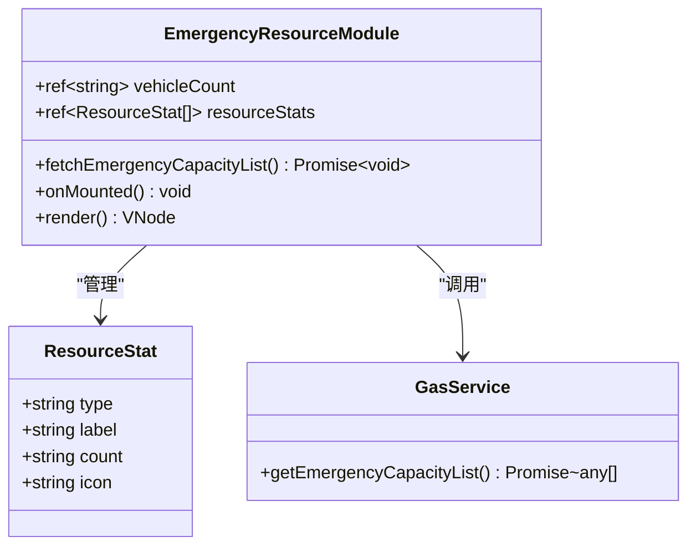

**图表来源**
- [EmergencyResourceModule.vue](file://src/views/gasModule/components/EmergencyResourceModule.vue#L45-L121)
- [gasService.ts](file://src/services/gasService.ts#L45-L55)

### 数据流设计

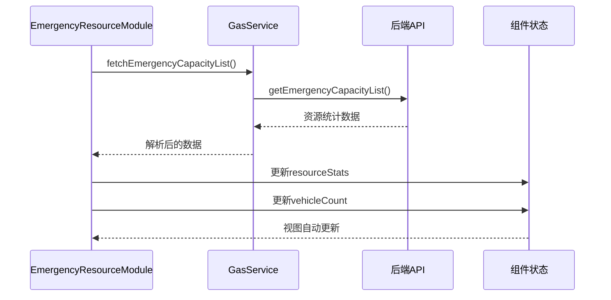

**图表来源**
- [EmergencyResourceModule.vue](file://src/views/gasModule/components/EmergencyResourceModule.vue#L80-L116)
- [gasService.ts](file://src/services/gasService.ts#L45-L55)

**章节来源**
- [EmergencyResourceModule.vue](file://src/views/gasModule/components/EmergencyResourceModule.vue#L45-L121)
- [gasService.ts](file://src/services/gasService.ts#L45-L55)

## 架构概览

应急资源模块采用现代化的Vue 3 Composition API架构，结合响应式设计原则，实现了高效的数据管理和用户交互体验。

### 整体架构图

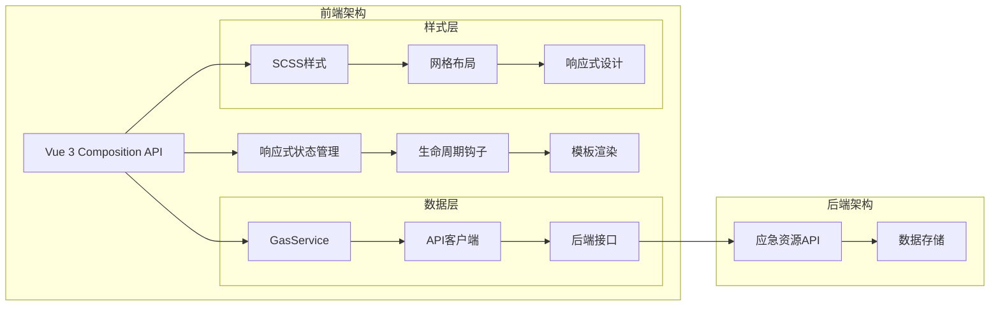

**图表来源**
- [EmergencyResourceModule.vue](file://src/views/gasModule/components/EmergencyResourceModule.vue#L45-L121)
- [gasService.ts](file://src/services/gasService.ts#L1-L55)

### 布局结构分析

模块采用CSS Grid布局系统，实现了精确的资源统计卡片定位：

| 位置 | 资源类型 | 样式类名 | 网格坐标 |
|------|----------|----------|----------|
| 左侧第一列 | 应急专家 | resource-expert | grid-column: 1; grid-row: 1 |
| 左侧第二列 | 医疗队伍 | resource-medical | grid-column: 1; grid-row: 2 |
| 左侧第三列 | 避难场所 | resource-shelter | grid-column: 1; grid-row: 3 |
| 右侧第一列 | 救援队伍 | resource-rescue-team | grid-column: 3; grid-row: 1 |
| 右侧第二列 | 救援人员 | resource-rescue-personnel | grid-column: 3; grid-row: 2 |
| 右侧第三列 | 救援仓库 | resource-rescue-warehouse | grid-column: 3; grid-row: 3 |

**章节来源**
- [EmergencyResourceModule.vue](file://src/views/gasModule/components/EmergencyResourceModule.vue#L221-L257)

## 详细组件分析

### 资源统计卡片组件

资源统计卡片是模块的核心展示元素，每个卡片包含图标、标签和数量信息。

#### 卡片结构设计

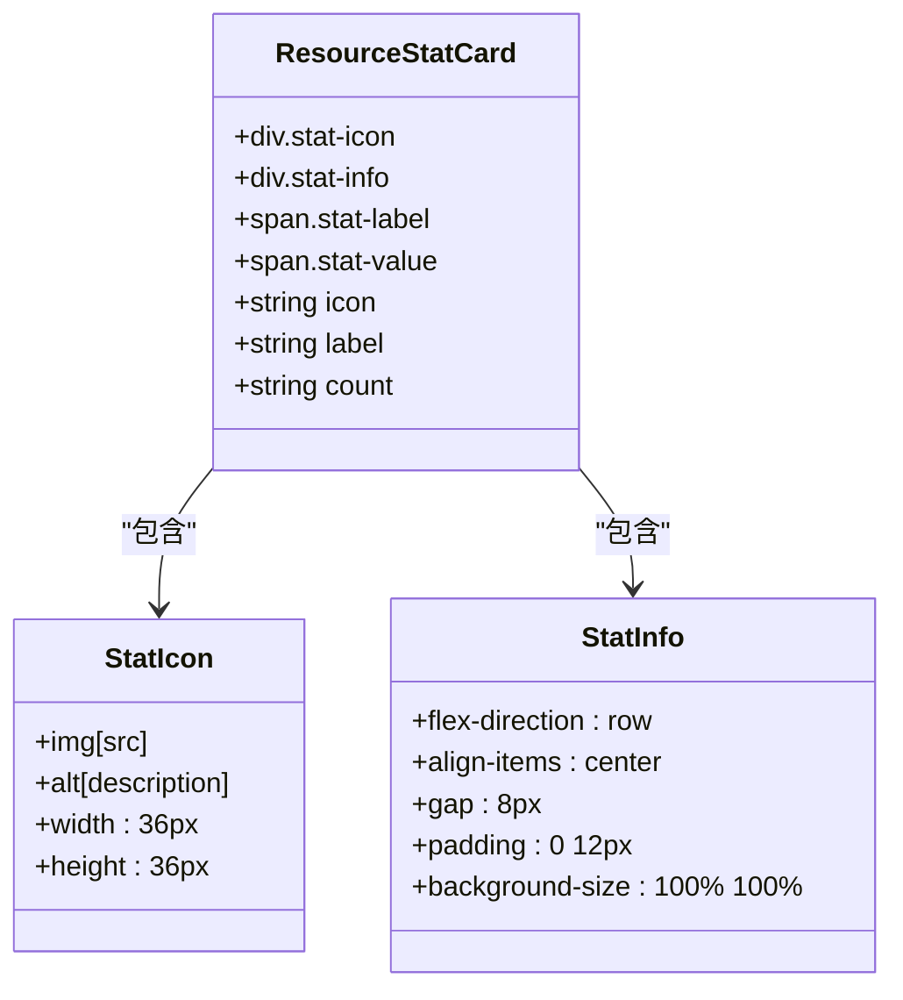

**图表来源**
- [EmergencyResourceModule.vue](file://src/views/gasModule/components/EmergencyResourceModule.vue#L8-L21)

#### 卡片样式实现

每个资源统计卡片都具有独特的样式特征：

- **左侧卡片**：左对齐，左侧留白10px
- **右侧卡片**：右对齐，右侧留白10px，背景图片反转
- **字体设计**：使用SourceHanSansSC字体族，确保中文显示效果
- **颜色体系**：统计标签使用#b8d8ff蓝色，数值使用#ffffff白色

**章节来源**
- [EmergencyResourceModule.vue](file://src/views/gasModule/components/EmergencyResourceModule.vue#L150-L298)

### 中心应急资源圆环

中心圆环是模块的独特视觉元素，采用渐变背景和居中文字设计：

```mermaid
flowchart TD
A[中心圆环容器] --> B[圆环背景]
A --> C[应急资源文字]
B --> D[渐变背景]
B --> E[毛玻璃效果]
C --> F["应急<br/>资源"]
C --> G[28px字体大小]
C --> H[#effaff颜色]
style A fill:#1a1a1a
style B fill:linear-gradient(to right, #0047ab, #00bfff)
style C fill:#effaff
```

**图表来源**
- [EmergencyResourceModule.vue](file://src/views/gasModule/components/EmergencyResourceModule.vue#L260-L285)

### 救援车辆统计

救援车辆统计采用特殊的底部定位设计，区别于其他资源统计卡片：

- **位置定位**：绝对定位，bottom: -40px
- **宽度扩展**：min-width: 180px，适应更多字符显示
- **背景样式**：使用专用的车辆统计背景图片

**章节来源**
- [EmergencyResourceModule.vue](file://src/views/gasModule/components/EmergencyResourceModule.vue#L287-L298)

## 数据模型与接口

### 应急资源数据模型

应急资源模块的数据模型设计简洁而实用，主要包含以下字段：

| 字段名 | 类型 | 描述 | 示例值 |
|--------|------|------|--------|
| name | string | 资源名称 | "应急专家", "救援车辆" |
| count | string | 资源数量 | "45", "12" |

### API接口对接

模块通过`getEmergencyCapacityList`接口获取应急资源数据：

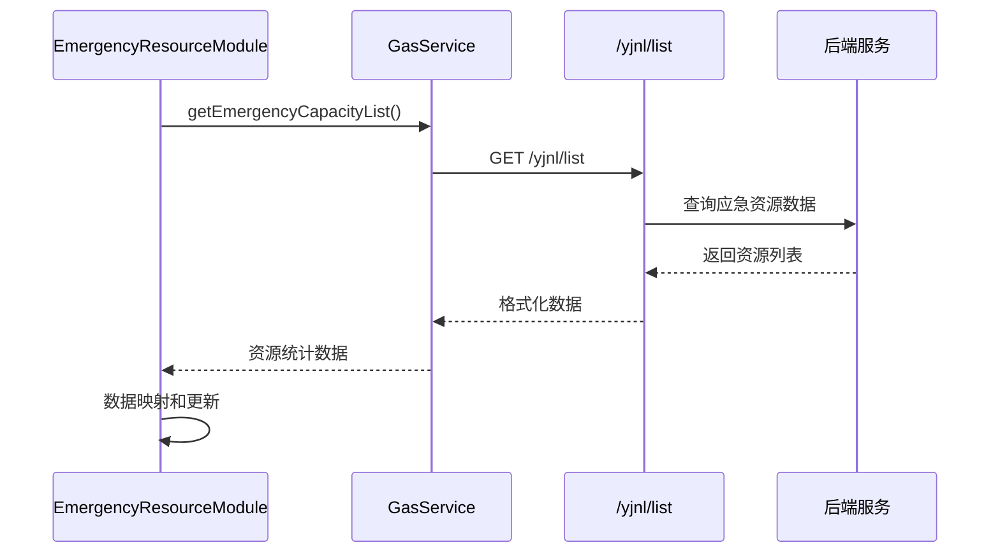

**图表来源**
- [gasService.ts](file://src/services/gasService.ts#L45-L55)
- [EmergencyResourceModule.vue](file://src/views/gasModule/components/EmergencyResourceModule.vue#L80-L116)

### 数据映射转换

模块实现了从后端API数据到组件内部数据结构的映射转换：

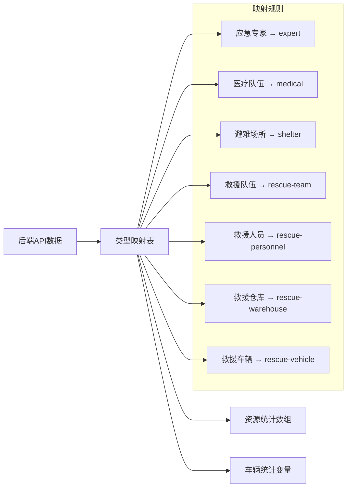

**图表来源**
- [EmergencyResourceModule.vue](file://src/views/gasModule/components/EmergencyResourceModule.vue#L86-L111)

**章节来源**
- [gasService.ts](file://src/services/gasService.ts#L45-L55)
- [EmergencyResourceModule.vue](file://src/views/gasModule/components/EmergencyResourceModule.vue#L80-L116)

## 资源调度功能

虽然当前版本的应急资源模块主要专注于数据展示，但其架构设计为未来的资源调度功能预留了充分的扩展空间。

### 调度功能设计思路

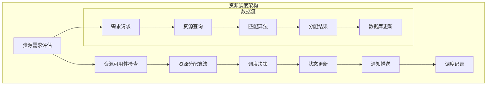

### 调度功能实现方案

#### 1. 资源分配策略

- **优先级分配**：根据灾害级别和资源重要性进行优先级排序
- **就近分配**：基于地理信息系统(GIS)实现就近资源分配
- **负载均衡**：避免单个资源点过度使用

#### 2. 状态更新机制

- **实时状态**：资源使用状态的实时更新
- **状态同步**：多系统间的状态同步机制
- **冲突解决**：资源冲突的自动解决策略

#### 3. 调度记录管理

- **操作日志**：完整的调度操作记录
- **审计追踪**：可追溯的资源分配历史
- **统计分析**：调度效率和效果的统计分析

### 扩展接口设计

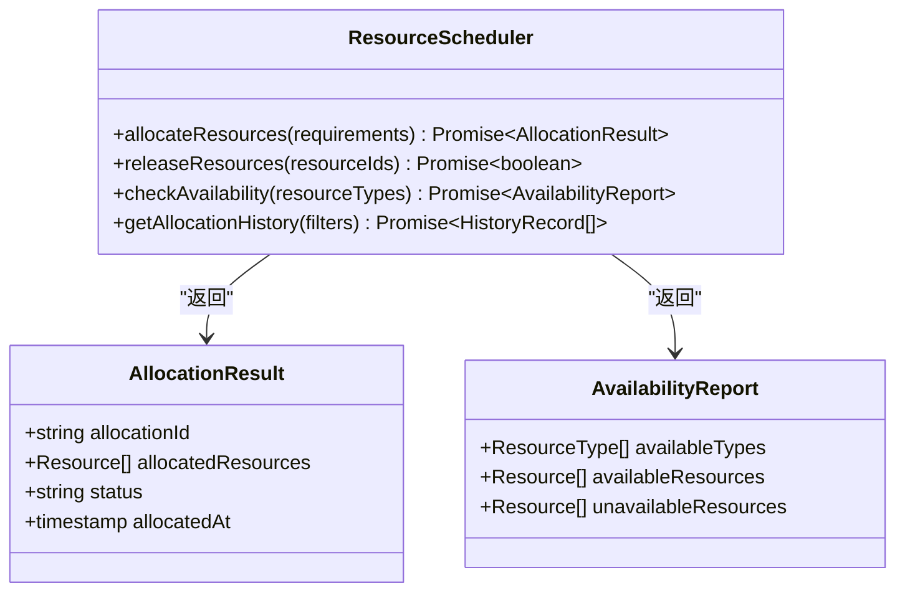

**章节来源**
- [EmergencyResourceModule.vue](file://src/views/gasModule/components/EmergencyResourceModule.vue#L80-L116)

## 实时更新机制

应急资源模块具备实现数据实时更新的能力，为应急响应提供及时的信息支撑。

### 实时更新架构

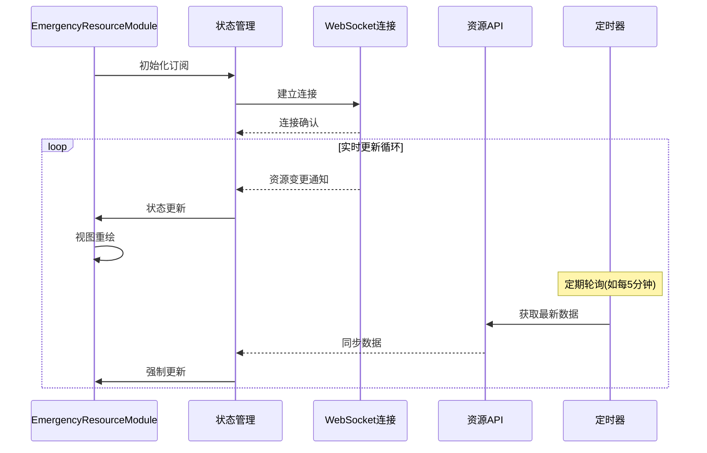

### 实时更新实现方法

#### 1. WebSocket连接管理

- **连接建立**：模块启动时建立WebSocket连接
- **心跳检测**：定期发送心跳包维持连接
- **断线重连**：网络异常时自动重连机制

#### 2. 数据同步策略

- **增量更新**：只更新发生变化的资源项
- **全量同步**：定期进行全量数据同步
- **冲突解决**：处理并发更新导致的数据冲突

#### 3. 性能优化措施

- **防抖处理**：避免频繁的DOM更新
- **内存管理**：及时清理过期的资源数据
- **缓存策略**：合理使用浏览器缓存

### 实时更新配置

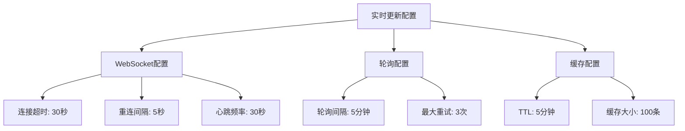

**章节来源**
- [EmergencyResourceModule.vue](file://src/views/gasModule/components/EmergencyResourceModule.vue#L118-L121)

## 故障排查指南

应急资源模块可能出现的常见问题及解决方案：

### 资源数据不一致问题

#### 问题表现
- 资源统计数字显示异常
- 车辆统计数量不正确
- 资源卡片显示空白

#### 排查步骤

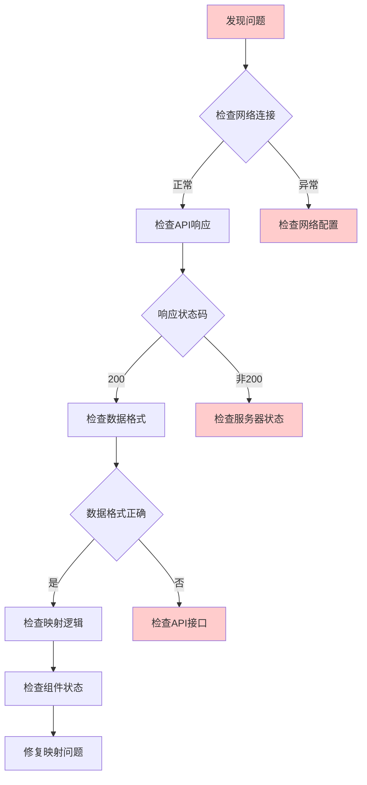

#### 解决方案

1. **网络连接检查**
   - 确认网络连接稳定
   - 检查防火墙设置
   - 验证API域名解析

2. **API响应验证**
   ```javascript
   // 检查API响应格式
   const response = await getEmergencyCapacityList();
   console.log('API响应:', response);
   
   // 验证数据完整性
   if (!response || !Array.isArray(response)) {
       console.error('API返回数据格式错误');
   }
   ```

3. **数据映射调试**
   - 检查typeMap映射表
   - 验证资源名称匹配
   - 确认count字段存在

### 调度功能失效问题

#### 问题表现
- 资源分配无法执行
- 状态更新不生效
- 调度记录丢失

#### 排查流程

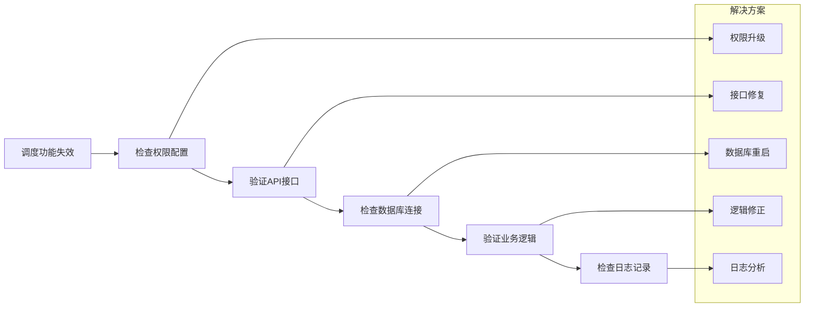

#### 常见原因及解决

1. **权限不足**
   - 检查用户角色配置
   - 验证API访问权限
   - 确认调度操作权限

2. **接口异常**
   - 检查调度API状态
   - 验证请求参数格式
   - 确认响应数据结构

3. **数据一致性**
   - 检查资源状态同步
   - 验证库存数据准确性
   - 确认分配记录完整性

### 性能问题诊断

#### 问题症状
- 页面加载缓慢
- 数据更新延迟
- 内存占用过高

#### 诊断工具

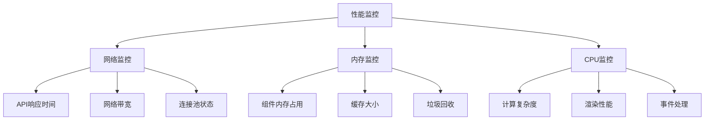

#### 优化建议

1. **数据缓存优化**
   - 实施合理的缓存策略
   - 设置适当的TTL值
   - 定期清理过期数据

2. **渲染性能优化**
   - 使用虚拟滚动
   - 减少不必要的重渲染
   - 优化CSS选择器

3. **网络性能优化**
   - 实施请求合并
   - 使用CDN加速
   - 启用HTTP/2

**章节来源**
- [EmergencyResourceModule.vue](file://src/views/gasModule/components/EmergencyResourceModule.vue#L113-L116)

## 总结

应急资源模块作为燃气模块的重要组成部分，展现了现代Web应用开发的最佳实践。该模块通过以下特点实现了高效的应急资源管理：

### 核心优势

1. **模块化设计**：清晰的组件分离和职责划分
2. **响应式架构**：基于Vue 3的现代化开发模式
3. **数据驱动**：通过API接口实现数据的动态更新
4. **视觉设计**：符合燃气模块整体风格的UI设计
5. **扩展性强**：为未来功能扩展预留了充足空间

### 技术亮点

- **Composition API**：充分利用Vue 3的新特性提升开发效率
- **网格布局**：精确的CSS Grid布局实现复杂的视觉效果
- **状态管理**：合理的响应式状态管理机制
- **错误处理**：完善的错误捕获和处理机制

### 发展方向

应急资源模块为未来的功能扩展奠定了坚实基础，特别是在资源调度、实时更新和数据分析等方面具有巨大的发展潜力。随着应急管理体系的不断完善，该模块将在保障城市安全方面发挥越来越重要的作用。

通过持续的优化和功能增强，应急资源模块将成为燃气安全监测系统中不可或缺的核心组件，为应急响应提供强有力的数据支撑和技术保障。