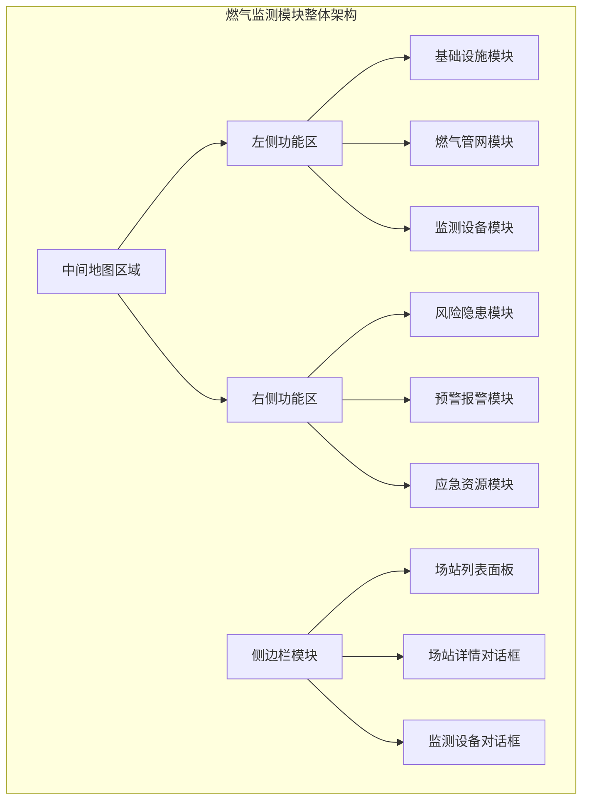
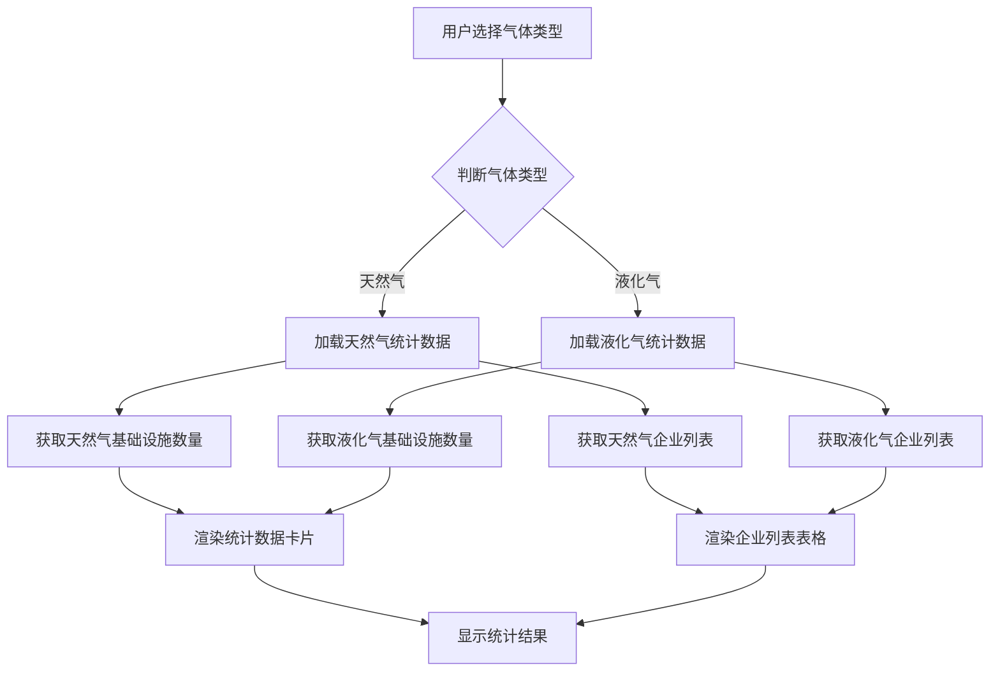
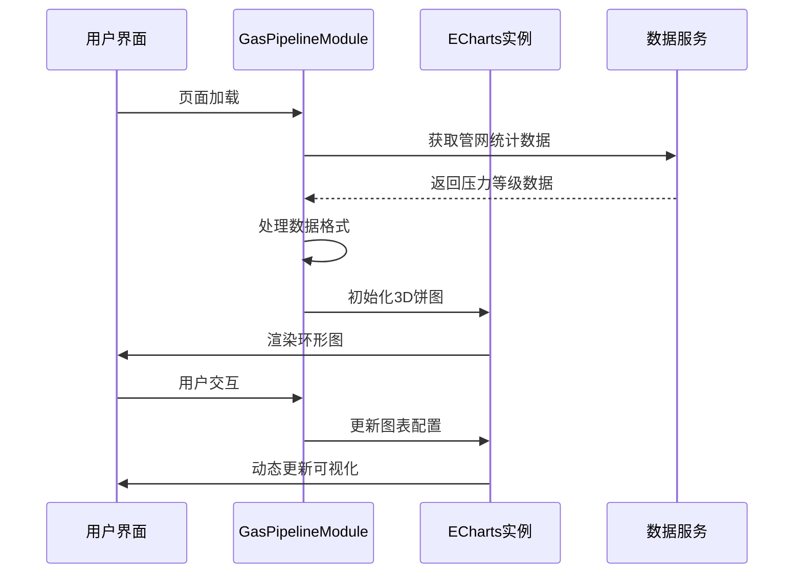
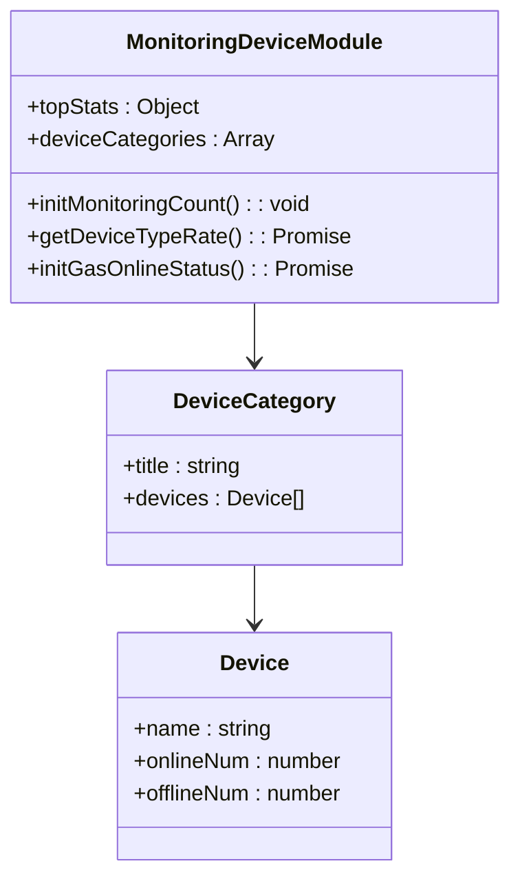
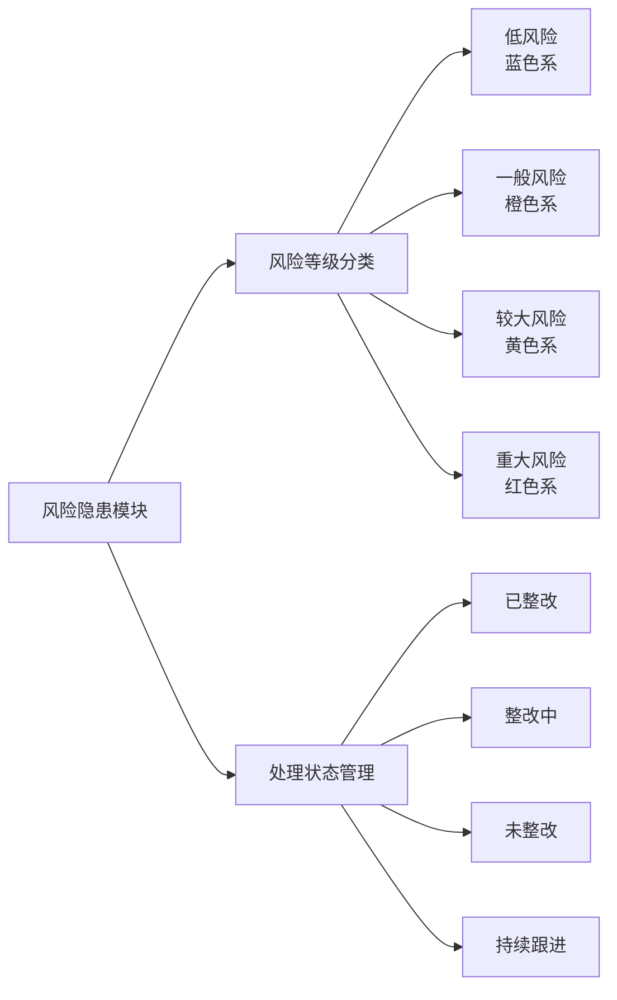
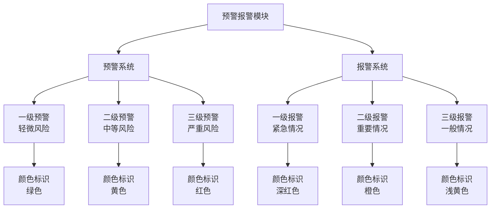
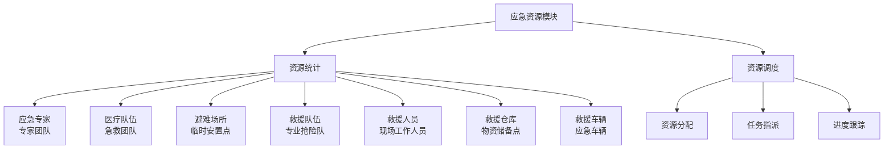
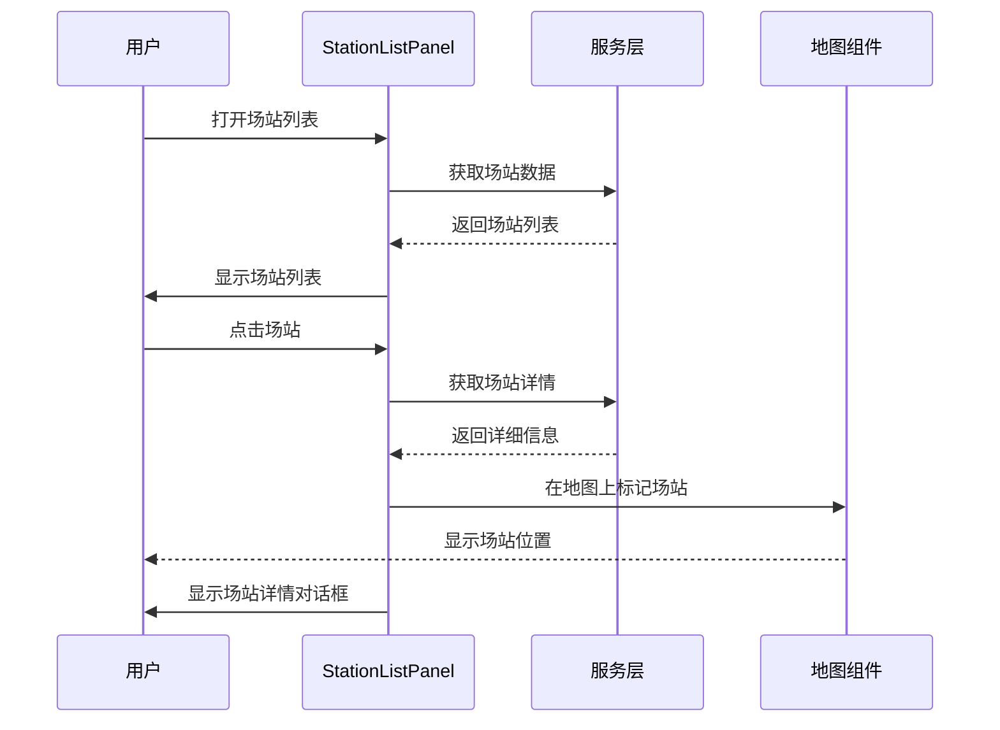
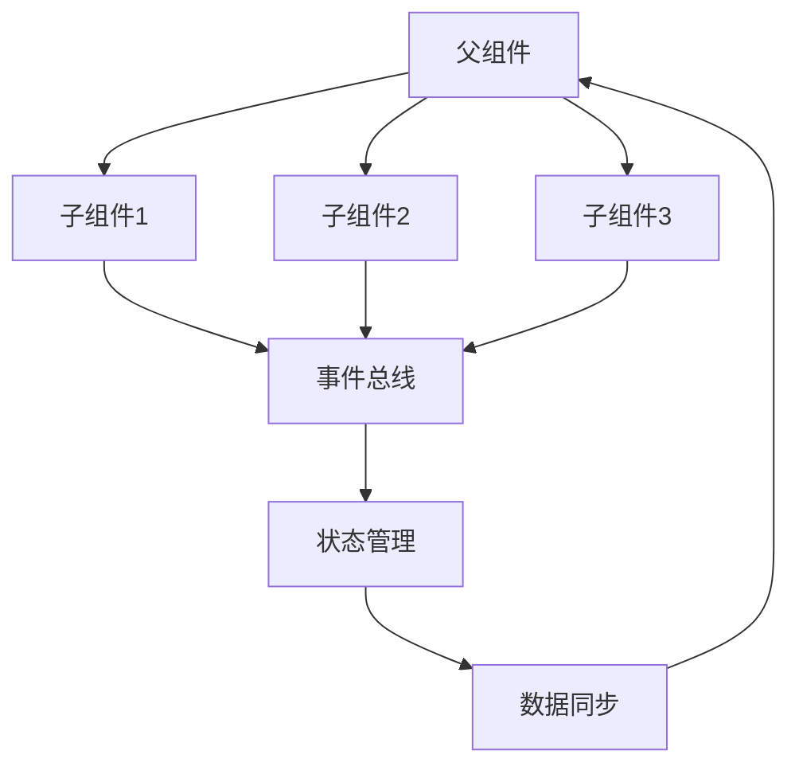

# 燃气监测模块详细文档

<cite>
**本文档引用的文件**
- [src/views/gasModule/index.vue](file://src/views/gasModule/index.vue)
- [src/views/gasModule/leftContent.vue](file://src/views/gasModule/leftContent.vue)
- [src/views/gasModule/rightContent.vue](file://src/views/gasModule/rightContent.vue)
- [src/views/gasModule/sidebarModule.vue](file://src/views/gasModule/sidebarModule.vue)
- [src/views/gasModule/components/InfrastructureModule.vue](file://src/views/gasModule/components/InfrastructureModule.vue)
- [src/views/gasModule/components/GasPipelineModule.vue](file://src/views/gasModule/components/GasPipelineModule.vue)
- [src/views/gasModule/components/MonitoringDeviceModule.vue](file://src/views/gasModule/components/MonitoringDeviceModule.vue)
- [src/views/gasModule/components/RiskHazardModule.vue](file://src/views/gasModule/components/RiskHazardModule.vue)
- [src/views/gasModule/components/WarningAlarmModule.vue](file://src/views/gasModule/components/WarningAlarmModule.vue)
- [src/views/gasModule/components/EmergencyResourceModule.vue](file://src/views/gasModule/components/EmergencyResourceModule.vue)
- [src/views/gasModule/components/map/StationListPanel.vue](file://src/views/gasModule/components/map/StationListPanel.vue)
- [src/views/gasModule/components/map/StationDetailDialog.vue](file://src/views/gasModule/components/map/StationDetailDialog.vue)
- [src/views/gasModule/components/map/MonitoringDialog.vue](file://src/views/gasModule/components/map/MonitoringDialog.vue)
- [GAS_MODULE_README.md](file://GAS_MODULE_README.md)
- [src/types/index.ts](file://src/types/index.ts)
</cite>

## 目录
1. [模块概述](#模块概述)
2. [整体架构设计](#整体架构设计)
3. [左侧功能区模块](#左侧功能区模块)
4. [右侧功能区模块](#右侧功能区模块)
5. [地图交互模块](#地图交互模块)
6. [配色方案与布局规范](#配色方案与布局规范)
7. [数据接口对接](#数据接口对接)
8. [技术实现细节](#技术实现细节)
9. [总结](#总结)

## 模块概述

燃气监测模块是阳新县城市安全监测系统的核心专项页面，严格按照设计图纸要求重新设计，提供燃气系统的全面监测、预警和应急管理功能。该模块采用三模块布局架构，左侧展示基础设施、燃气管网和监测设备三大核心数据，右侧涵盖风险隐患、预警报警和应急资源三大管理功能。

### 核心功能定位

- **左侧三大模块**：基础设施统计、燃气管网分析、监测设备状态
- **右侧三大模块**：风险隐患管理、预警报警处理、应急资源调度
- **中间地图区域**：燃气管理核心控制区，预留地图组件集成位置

**章节来源**
- [src/views/gasModule/index.vue](file://src/views/gasModule/index.vue#L1-L70)
- [GAS_MODULE_README.md](file://GAS_MODULE_README.md#L1-L50)

## 整体架构设计

### 三模块布局架构

燃气监测模块采用经典的三列布局设计，左侧、中间和右侧各具功能特色：



**图表来源**
- [src/views/gasModule/index.vue](file://src/views/gasModule/index.vue#L5-L22)
- [src/views/gasModule/leftContent.vue](file://src/views/gasModule/leftContent.vue#L1-L33)
- [src/views/gasModule/rightContent.vue](file://src/views/gasModule/rightContent.vue#L1-L33)

### 布局参数规范

| 区域 | 宽度 | 高度 | 用途 |
|------|------|------|------|
| 左侧内容区 | 820px | 100% | 基础设施、管网、设备统计 |
| 右侧内容区 | 820px | 100% | 风险、预警、资源管理 |
| 中间地图区 | 自适应 | 100% | 燃气管网可视化展示 |
| 侧边栏模块 | 固定 | 100% | 场站管理和设备监控 |

**章节来源**
- [src/views/gasModule/leftContent.vue](file://src/views/gasModule/leftContent.vue#L21-L31)
- [src/views/gasModule/rightContent.vue](file://src/views/gasModule/rightContent.vue#L21-L31)

## 左侧功能区模块

### 基础设施模块（InfrastructureModule）

基础设施模块负责展示燃气基础设施的全面统计数据，支持天然气和液化气两种气体类型的切换展示。

#### 核心功能特性

- **双气体类型支持**：天然气回路和液化气回路的统计对比
- **企业列表展示**：详细的企业基本信息和运营数据
- **动态数据加载**：按需加载不同类型的基础设施数量统计

#### 数据统计逻辑



**图表来源**
- [src/views/gasModule/components/InfrastructureModule.vue](file://src/views/gasModule/components/InfrastructureModule.vue#L173-L184)

#### 图标展示机制

基础设施模块采用卡片式设计，每个统计项目包含：
- **统计标签**：清晰的业务含义标识
- **数值展示**：采用渐变文字效果提升视觉吸引力
- **单位标注**：根据业务类型自动映射合适的计量单位

**章节来源**
- [src/views/gasModule/components/InfrastructureModule.vue](file://src/views/gasModule/components/InfrastructureModule.vue#L1-L381)

### 燃气管网模块（GasPipelineModule）

燃气管网模块通过ECharts实现管网分布的环形图可视化，提供直观的管网结构分析。

#### 3D环形图可视化



**图表来源**
- [src/views/gasModule/components/GasPipelineModule.vue](file://src/views/gasModule/components/GasPipelineModule.vue#L333-L354)

#### 管网分布分析

- **压力等级分布**：高压、中压、低压管道的比例分析
- **气源类型分布**：不同气源类型的占比统计
- **管井状态监控**：正常和异常状态的可视化展示

#### 管网统计功能

模块提供以下核心统计指标：
- **管线总长**：各类管道的总长度统计
- **管点总数**：管网节点的总体数量
- **管井统计**：各类管井的数量和状态分布

**章节来源**
- [src/views/gasModule/components/GasPipelineModule.vue](file://src/views/gasModule/components/GasPipelineModule.vue#L1-L676)

### 监测设备模块（MonitoringDeviceModule）

监测设备模块实现设备运行状态的全面监控，包括在线率、离线率、故障率的精确计算与展示。

#### 状态监控方案



**图表来源**
- [src/views/gasModule/components/MonitoringDeviceModule.vue](file://src/views/gasModule/components/MonitoringDeviceModule.vue#L190-L205)

#### 在线率计算逻辑

设备模块采用以下公式计算在线率：
- **在线率** = 在线设备数量 ÷ 总设备数量 × 100%
- **离线率** = 离线设备数量 ÷ 总设备数量 × 100%
- **故障率** = 故障设备数量 ÷ 总设备数量 × 100%

#### 设备分类统计

模块支持按设备类型进行分类统计，包括：
- **压力监测设备**
- **流量监测设备**
- **泄漏检测设备**
- **温度传感器**
- **阀门状态监测**
- **智能表具**

**章节来源**
- [src/views/gasModule/components/MonitoringDeviceModule.vue](file://src/views/gasModule/components/MonitoringDeviceModule.vue#L1-L376)

## 右侧功能区模块

### 风险隐患模块（RiskHazardModule）

风险隐患模块建立完善的风险等级分类体系与处理状态管理，为燃气安全提供全面保障。

#### 风险等级分类体系



**图表来源**
- [src/views/gasModule/components/RiskHazardModule.vue](file://src/views/gasModule/components/RiskHazardModule.vue#L71-L77)

#### 风险统计与可视化

模块采用多环形图设计展示风险分布：
- **风险等级环形图**：展示不同风险等级的数量分布
- **隐患类型统计**：按隐患类型进行分类统计
- **整改状态环形图**：展示各类风险的处理进度

#### 处理状态管理

支持四种处理状态的精细化管理：
- **已整改**：已完成风险消除
- **整改中**：正在实施风险治理
- **未整改**：尚未开始风险治理
- **持续跟进**：长期关注的风险点

**章节来源**
- [src/views/gasModule/components/RiskHazardModule.vue](file://src/views/gasModule/components/RiskHazardModule.vue#L1-L567)

### 预警报警模块（WarningAlarmModule）

预警报警模块实现三级预警机制与时间筛选功能，提供实时的预警信息展示与处理。

#### 三级预警机制



**图表来源**
- [src/views/gasModule/components/WarningAlarmModule.vue](file://src/views/gasModule/components/WarningAlarmModule.vue#L153-L157)

#### 时间筛选功能

模块提供灵活的时间范围筛选：
- **今日**：当前日期的预警统计
- **本周**：本周内的预警事件
- **本月**：本月的预警汇总

#### 预警统计与表格

- **预警总数**：各类预警的累计数量
- **报警总数**：各类报警的累计数量
- **状态统计**：已处置、处置中、未处置的分布
- **等级统计**：各级别预警的占比分析

**章节来源**
- [src/views/gasModule/components/WarningAlarmModule.vue](file://src/views/gasModule/components/WarningAlarmModule.vue#L1-L704)

### 应急资源模块（EmergencyResourceModule）

应急资源模块提供完善的应急响应资源管理，支持资源调度和实时统计。

#### 资源调度设计



**图表来源**
- [src/views/gasModule/components/EmergencyResourceModule.vue](file://src/views/gasModule/components/EmergencyResourceModule.vue#L59-L78)

#### 资源统计功能

模块提供以下资源统计维度：
- **人员统计**：专家、医疗、救援人员数量
- **设施统计**：避难场所、仓库等基础设施
- **车辆统计**：救援车辆的实时状态
- **物资统计**：应急物资的储备情况

#### 资源调度流程

1. **资源查询**：实时查看各类资源的可用状态
2. **任务分配**：根据应急需求分配相应资源
3. **状态跟踪**：监控资源的使用和移动状态
4. **反馈更新**：及时更新资源状态信息

**章节来源**
- [src/views/gasModule/components/EmergencyResourceModule.vue](file://src/views/gasModule/components/EmergencyResourceModule.vue#L1-L301)

## 地图交互模块

### 场站管理系统

地图交互模块提供完整的燃气场站管理功能，包括场站列表、详情查看和设备监控。

#### 场站列表面板



**图表来源**
- [src/views/gasModule/components/map/StationListPanel.vue](file://src/views/gasModule/components/map/StationListPanel.vue#L196-L224)

#### 场站详情对话框

场站详情对话框提供丰富的场站信息展示：
- **基本信息**：企业名称、地址、联系方式
- **运营状态**：正常/异常状态标识
- **设备信息**：监测设备的详细列表
- **操作按钮**：查看监测设备、查看监控等功能

#### 监测设备对话框

监测设备对话框实现设备的全面管理：
- **设备列表**：按筛选条件显示监测设备
- **状态监控**：实时显示设备运行状态
- **预警信息**：展示设备的预警和告警信息
- **操作功能**：支持设备的远程控制和配置

**章节来源**
- [src/views/gasModule/components/map/StationDetailDialog.vue](file://src/views/gasModule/components/map/StationDetailDialog.vue#L1-L427)
- [src/views/gasModule/components/map/MonitoringDialog.vue](file://src/views/gasModule/components/map/MonitoringDialog.vue#L1-L657)

## 配色方案与布局规范

### 设计规范严格遵循

燃气监测模块严格遵循设计图纸规范，确保视觉效果的一致性和专业性。

#### 颜色体系

| 主题色 | RGB值 | 用途 |
|--------|-------|------|
| 主色调 | #1677ff | 标题文字、主要按钮 |
| 成功色 | #52c41a | 正常状态、成功提示 |
| 警告色 | #faad14 | 注意状态、警告提示 |
| 错误色 | #ff4d4f | 异常状态、错误提示 |
| 信息色 | #1890ff | 信息提示、链接文字 |

#### 燃气模块专属配色

| 风险等级 | 颜色 | 用途 |
|----------|------|------|
| 燃气管网 | 渐变黄色 | #ffffff → #faad14 |
| 高风险 | 红色系 | #ff4d4f |
| 中风险 | 橙色系 | #faad14 |
| 低风险 | 蓝色系 | #1677ff |

#### 布局规范

- **基准分辨率**：4096 x 1920
- **左侧宽度**：820px
- **右侧宽度**：820px
- **模块间距**：16px
- **内边距**：40px 30px

**章节来源**
- [GAS_MODULE_README.md](file://GAS_MODULE_README.md#L88-L110)

## 数据接口对接

### 接口设计规范

燃气监测模块预留了完整的数据接口对接点，支持与后端系统的无缝集成。

#### 基础设施数据接口

```typescript
// 基础设施统计数据接口
const infrastructureData = ref([
  { id: 1, name: '燃气管道', value: 245, unit: '公里', icon: 'pipeline' },
  { id: 2, name: '调压站', value: 15, unit: '座', icon: 'pressure' },
  { id: 3, name: '阀门井', value: 120, unit: '个', icon: 'valve' },
  { id: 4, name: '燃气用户', value: 5000, unit: '户', icon: 'user' },
  { id: 5, name: '工商用户', value: 200, unit: '户', icon: 'business' },
  { id: 6, name: '加气站', value: 8, unit: '座', icon: 'gas' }
]);
```

#### 风险隐患数据接口

```typescript
// 风险隐患数据接口
const riskData = ref([
  { key: 1, location: '兴国镇建设路段', type: '管道老化', level: '高风险' },
  { key: 2, location: '阳新大道', type: '压力异常', level: '一般风险' },
  { key: 3, location: '滨江路', type: '泄漏风险', level: '较大风险' }
]);
```

#### 预警报警数据接口

```typescript
// 预警报警数据接口
const warningList = ref([
  { id: 1, level: '严重', title: '燃气管道压力异常', location: '兴国镇建设路段' },
  { id: 2, level: '一般', title: '监测设备离线', location: '阳新大道' },
  { id: 3, level: '提示', title: '环境温度异常', location: '滨江路' }
]);
```

#### 应急资源数据接口

```typescript
// 应急资源数据接口
const resourceData = ref([
  { key: 1, name: '抢险队伍', type: '人员', quantity: '45人', status: '待命' },
  { key: 2, name: '应急车辆', type: '车辆', quantity: '8辆', status: '可用' },
  { key: 3, name: '救援物资', type: '物资', quantity: '1000件', status: '充足' }
]);
```

**章节来源**
- [GAS_MODULE_README.md](file://GAS_MODULE_README.md#L126-L155)

## 技术实现细节

### 核心技术栈

- **Vue 3**：采用Composition API进行组件开发
- **Ant Design Vue**：提供统一的UI组件库
- **ECharts**：实现复杂的数据可视化图表
- **SCSS**：提供强大的样式预处理能力

### 关键特性

1. **响应式设计**：使用ResponsiveWrapper实现多分辨率适配
2. **模块化开发**：每个功能模块独立组件，便于维护和扩展
3. **性能优化**：使用keep-alive缓存组件，提升用户体验
4. **数据可视化**：ECharts实现管网分析图表
5. **统一样式**：全局data-module样式类确保一致性

### 组件通信机制



**章节来源**
- [src/views/gasModule/index.vue](file://src/views/gasModule/index.vue#L25-L38)
- [GAS_MODULE_README.md](file://GAS_MODULE_README.md#L112-L126)

## 总结

燃气监测模块作为阳新县城市安全监测系统的核心组件，实现了以下关键目标：

### 功能完整性

- **全面覆盖**：涵盖燃气监测的各个方面，从基础设施到应急响应
- **专业性强**：严格遵循设计图纸规范，功能定位准确
- **实用价值**：提供实时监控、预警处理、应急调度等核心功能

### 技术先进性

- **可视化技术**：ECharts实现复杂的3D环形图展示
- **响应式设计**：适配多种分辨率和设备类型
- **模块化架构**：便于维护和功能扩展

### 用户体验

- **直观易用**：清晰的界面设计和交互流程
- **信息丰富**：提供全面的数据统计和分析
- **实时更新**：支持数据的实时刷新和状态更新

燃气监测模块的成功实施，为阳新县的城市安全管理提供了强有力的技术支撑，有效提升了燃气系统的安全运行水平和应急响应能力。