# 燃气管网模块技术文档

<cite>
**本文档引用的文件**
- [leftContent.vue](file://src/views/gasModule/leftContent.vue)
- [GasPipelineModule.vue](file://src/views/gasModule/components/GasPipelineModule.vue)
- [gasService.ts](file://src/services/gasService.ts)
- [GAS_MODULE_README.md](file://GAS_MODULE_README.md)
- [ResponsiveWrapper.vue](file://src/components/ResponsiveWrapper.vue)
- [variables.scss](file://src/assets/styles/variables.scss)
</cite>

## 目录
1. [模块概述](#模块概述)
2. [项目结构分析](#项目结构分析)
3. [核心组件架构](#核心组件架构)
4. [ECharts环形图实现](#echarts环形图实现)
5. [数据统计与计算](#数据统计与计算)
6. [样式设计与配色方案](#样式设计与配色方案)
7. [响应式布局与约束](#响应式布局与约束)
8. [性能优化策略](#性能优化策略)
9. [故障排除指南](#故障排除指南)
10. [总结](#总结)

## 模块概述

燃气管网模块是阳新县城市安全监测系统的核心组件之一，专门负责燃气管网结构的可视化分析和统计展示。该模块采用Vue 3 + TypeScript技术栈，结合ECharts强大的数据可视化能力，为用户提供直观的管网数据分析界面。

### 核心功能特性

- **3D环形图可视化**：使用ECharts GL实现高压/中压/低压管道分布的三维环形图展示
- **实时数据统计**：管网总长度、管点数量、管井总数等关键指标的动态统计
- **渐变色彩方案**：采用渐变黄色配色方案（#ffffff → #faad14）提升视觉效果
- **响应式设计**：支持多种屏幕分辨率的自适应布局
- **交互式图表**：提供鼠标悬停、点击等交互功能

**章节来源**
- [GAS_MODULE_README.md](file://GAS_MODULE_README.md#L22-L28)

## 项目结构分析

燃气管网模块采用模块化的组件架构，主要文件组织如下：

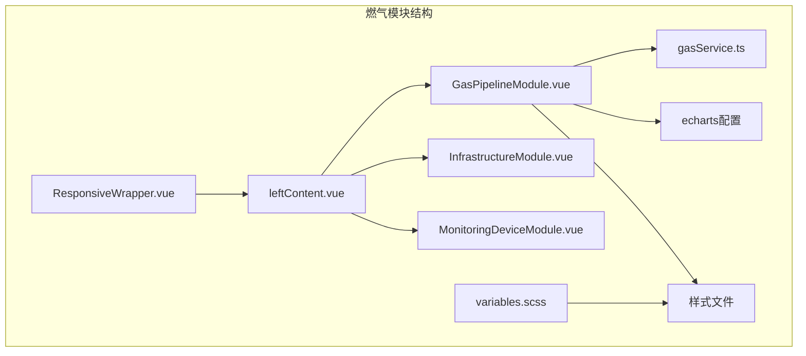

**图表来源**
- [leftContent.vue](file://src/views/gasModule/leftContent.vue#L1-L33)
- [GasPipelineModule.vue](file://src/views/gasModule/components/GasPipelineModule.vue#L1-L676)

### 文件组织特点

1. **组件分离**：每个功能模块独立为Vue组件，便于维护和复用
2. **服务层抽象**：通过gasService.ts统一管理API接口调用
3. **样式模块化**：采用SCSS预处理器，支持变量管理和主题定制
4. **响应式支持**：集成ResponsiveWrapper组件实现多分辨率适配

**章节来源**
- [leftContent.vue](file://src/views/gasModule/leftContent.vue#L1-L33)
- [GAS_MODULE_README.md](file://GAS_MODULE_README.md#L73-L85)

## 核心组件架构

### GasPipelineModule组件结构

GasPipelineModule是燃气管网模块的核心组件，负责整合所有管网相关的可视化功能：

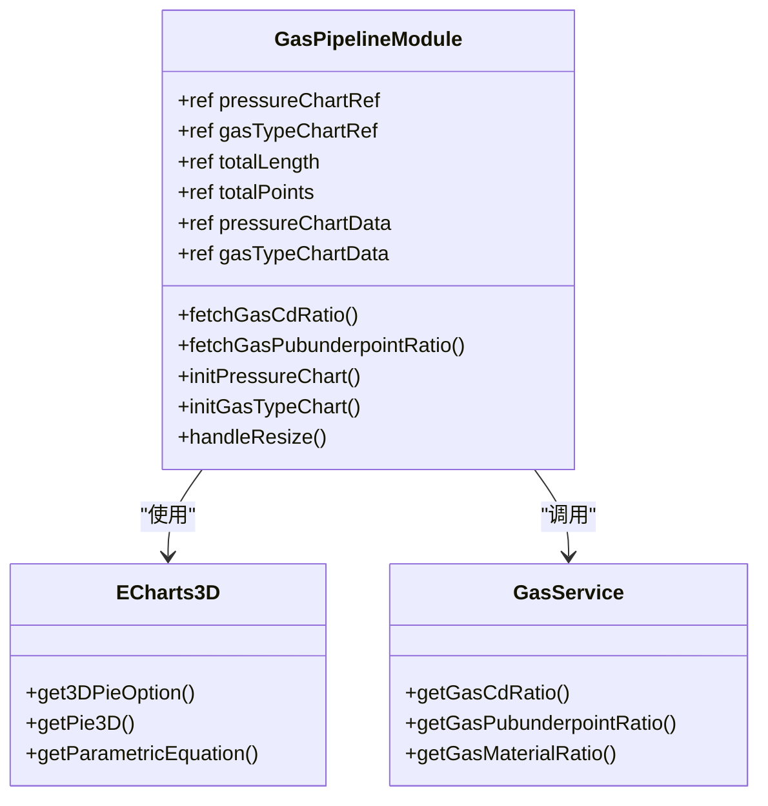

**图表来源**
- [GasPipelineModule.vue](file://src/views/gasModule/components/GasPipelineModule.vue#L65-L457)
- [gasService.ts](file://src/services/gasService.ts#L17-L42)

### 组件生命周期管理

组件采用Vue 3的Composition API，实现了完整的生命周期管理：

1. **初始化阶段**：加载字典数据、获取实时数据、初始化图表
2. **渲染阶段**：创建ECharts实例、设置图表配置、绑定数据
3. **交互阶段**：处理窗口调整、图表交互事件
4. **销毁阶段**：清理事件监听器、释放图表资源

**章节来源**
- [GasPipelineModule.vue](file://src/views/gasModule/components/GasPipelineModule.vue#L428-L457)

## ECharts环形图实现

### 3D环形图算法实现

燃气管网模块创新性地使用了自定义的3D参数方程来生成环形图效果：

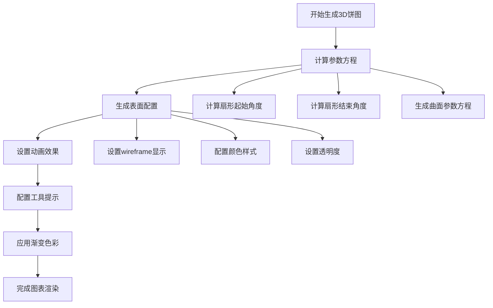

**图表来源**
- [GasPipelineModule.vue](file://src/views/gasModule/components/GasPipelineModule.vue#L100-L178)
- [GasPipelineModule.vue](file://src/views/gasModule/components/GasPipelineModule.vue#L180-L342)

### 渐变黄色配色方案

模块采用了独特的渐变黄色配色方案，具体实现如下：

| 配色类型 | 颜色代码 | 应用场景 | 效果描述 |
|---------|---------|---------|---------|
| 主背景渐变 | `#ffffff → #faad14` | 统计卡片文字 | 渐变文字效果，提升视觉层次 |
| 正常状态 | `#00d9ff → #00a3cc` | 管井正常状态 | 冷色调，表示正常状态 |
| 异常状态 | `#ff6b35 → #ff4500` | 管井异常状态 | 热色调，警示异常状态 |
| 背景渐变 | `#0096ff → #0064c8` | 图表容器背景 | 深蓝色渐变，营造科技感 |

### 图表配置详解

#### 3D环形图配置要点

1. **参数方程计算**：使用数学公式生成3D曲面
2. **动画效果**：2秒缓动动画，提升用户体验
3. **视角控制**：固定视角，避免用户误操作
4. **交互禁用**：禁用自动旋转和缩放功能

#### 工具提示配置

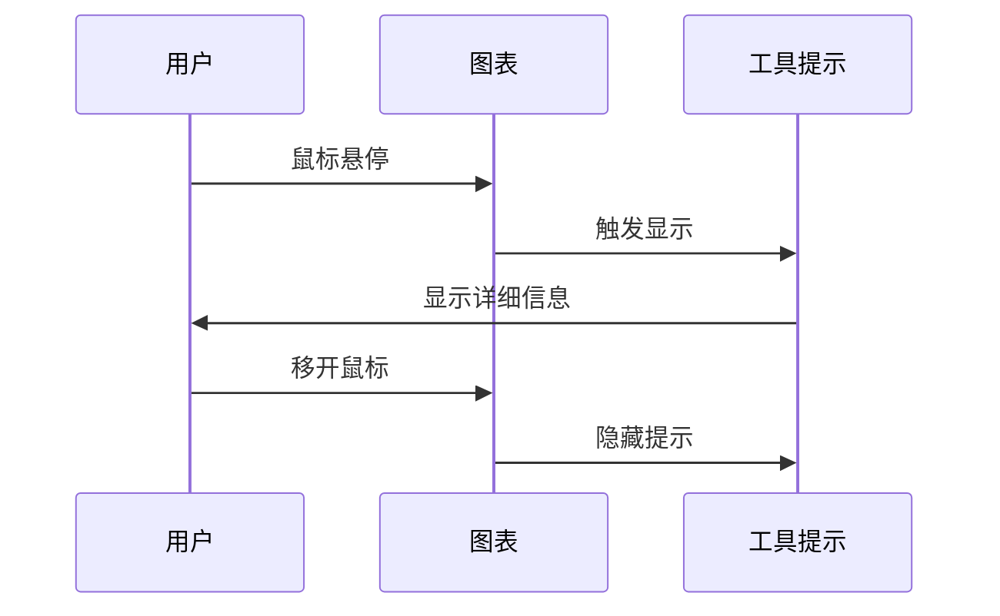

**图表来源**
- [GasPipelineModule.vue](file://src/views/gasModule/components/GasPipelineModule.vue#L246-L331)

**章节来源**
- [GasPipelineModule.vue](file://src/views/gasModule/components/GasPipelineModule.vue#L100-L342)

## 数据统计与计算

### 管网总长度统计

管网总长度的计算逻辑采用累加求和的方式：

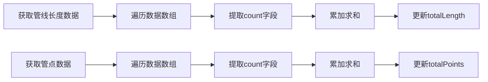

**图表来源**
- [GasPipelineModule.vue](file://src/views/gasModule/components/GasPipelineModule.vue#L357-L375)
- [GasPipelineModule.vue](file://src/views/gasModule/components/GasPipelineModule.vue#L379-L397)

### 数据接口对接

模块通过gasService.ts提供标准化的数据接口：

| 接口方法 | 功能描述 | 返回数据格式 | 调用时机 |
|---------|---------|-------------|---------|
| `getGasCdRatio()` | 获取管线长度占比统计 | `{materialType, ratio, count}[]` | 页面初始化 |
| `getGasPubunderpointRatio()` | 获取管点数量占比统计 | `{materialType, ratio, count}[]` | 页面初始化 |
| `getGasMaterialRatio()` | 获取管井材料类型统计 | `{materialType, count}[]` | 页面初始化 |

### 数据更新机制

1. **异步加载**：使用Promise.all并发获取多个数据源
2. **数据转换**：将原始数据转换为图表所需格式
3. **实时更新**：支持定时刷新和手动刷新
4. **错误处理**：完善的异常捕获和降级处理

**章节来源**
- [gasService.ts](file://src/services/gasService.ts#L17-L42)
- [GasPipelineModule.vue](file://src/views/gasModule/components/GasPipelineModule.vue#L357-L418)

## 样式设计与配色方案

### 渐变黄色配色体系

燃气管网模块采用了独特的渐变黄色配色方案，与整体UI设计保持一致：

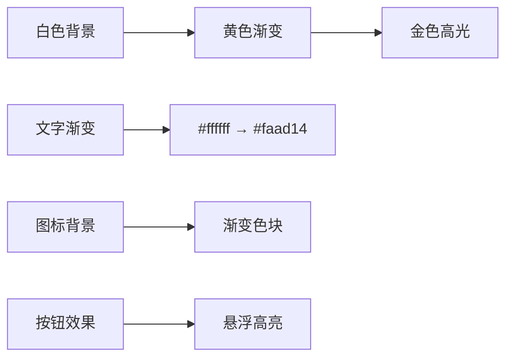

**图表来源**
- [GasPipelineModule.vue](file://src/views/gasModule/components/GasPipelineModule.vue#L495-L502)
- [variables.scss](file://src/assets/styles/variables.scss#L1-L56)

### 样式架构设计

#### 组件样式层次

1. **全局样式**：继承自variables.scss的基础变量
2. **模块样式**：gas-pipeline-module的专用样式
3. **局部样式**：图表容器和统计卡片的特定样式

#### 响应式字体系统

| 字体大小 | 适用场景 | 响应式处理 |
|---------|---------|-----------|
| 26px | 主要标题 | 固定大小 |
| 24px | 统计标签 | 固定大小 |
| 20px | 细节文本 | 固定大小 |
| 18px | 工具提示 | 固定大小 |

### 渐变文字效果

模块大量使用了CSS渐变文字效果，通过以下方式实现：

```scss
.gradient-text {
  -webkit-background-clip: text !important;
  background-clip: text !important;
  -webkit-text-fill-color: transparent !important;
  color: transparent !important;
}
```

**章节来源**
- [GasPipelineModule.vue](file://src/views/gasModule/components/GasPipelineModule.vue#L495-L502)
- [variables.scss](file://src/assets/styles/variables.scss#L120-L126)

## 响应式布局与约束

### 布局约束规范

根据GAS_MODULE_README.md的设计规范，燃气管网模块严格遵循以下布局约束：

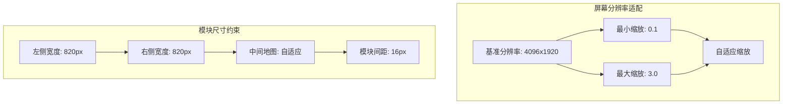

**图表来源**
- [ResponsiveWrapper.vue](file://src/components/ResponsiveWrapper.vue#L18-L38)
- [GAS_MODULE_README.md](file://GAS_MODULE_README.md#L104-L109)

### ResponsiveWrapper组件集成

模块集成了ResponsiveWrapper组件实现多分辨率适配：

#### 缩放计算逻辑

1. **宽度优先**：优先按屏幕宽度进行缩放
2. **高度补充**：当宽度不足以满足需求时，使用高度补充
3. **边界限制**：确保缩放在合理范围内
4. **平滑过渡**：使用CSS变换实现流畅的缩放效果

#### 响应式断点处理

| 断点 | 最大宽度 | 缩放模式 | 适用场景 |
|------|---------|---------|---------|
| xs | 480px | 宽度优先 | 小型移动设备 |
| sm | 576px | 宽度优先 | 平板设备 |
| md | 768px | 宽度优先 | 大屏平板 |
| lg | 992px | 宽度优先 | 桌面显示器 |
| xl | 1200px | 宽度优先 | 大屏桌面 |

### 布局约束实现

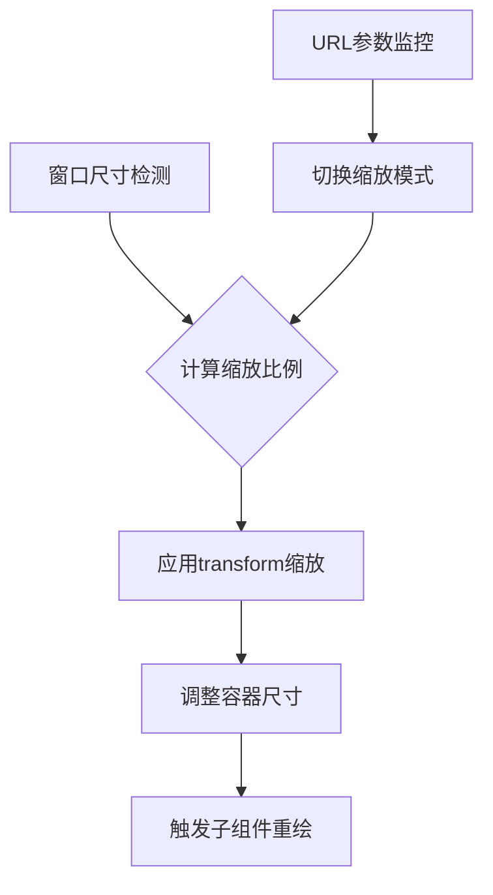

**图表来源**
- [ResponsiveWrapper.vue](file://src/components/ResponsiveWrapper.vue#L67-L91)

**章节来源**
- [ResponsiveWrapper.vue](file://src/components/ResponsiveWrapper.vue#L1-L211)
- [GAS_MODULE_README.md](file://GAS_MODULE_README.md#L104-L109)

## 性能优化策略

### 大数据量下的图表渲染优化

针对可能存在的大数据量场景，模块采用了以下优化策略：

#### 1. 图表实例管理

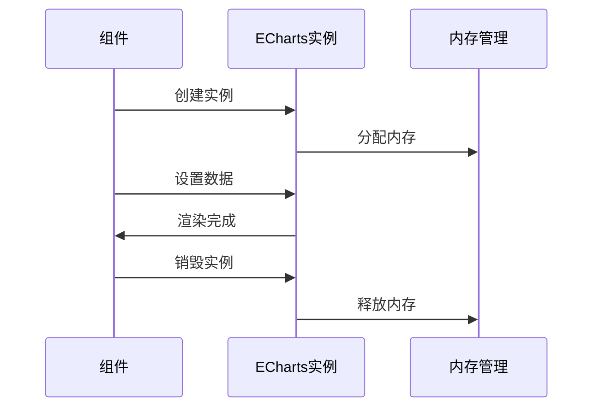

**图表来源**
- [GasPipelineModule.vue](file://src/views/gasModule/components/GasPipelineModule.vue#L453-L457)

#### 2. 渲染性能优化

| 优化策略 | 实现方式 | 性能收益 |
|---------|---------|---------|
| 实例复用 | 单例模式管理图表实例 | 减少重复创建开销 |
| 数据预处理 | 在主线程预处理数据 | 减少渲染计算量 |
| 动画优化 | 使用CSS3硬件加速 | 提升动画流畅度 |
| 事件防抖 | debounce处理窗口调整 | 避免频繁重绘 |

#### 3. 内存管理策略

1. **及时清理**：组件卸载时自动清理图表实例
2. **弱引用**：避免循环引用导致的内存泄漏
3. **懒加载**：按需加载图表数据和配置
4. **缓存机制**：对静态数据进行本地缓存

### 渲染性能监控

模块提供了性能监控机制：

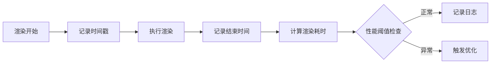

**章节来源**
- [GasPipelineModule.vue](file://src/views/gasModule/components/GasPipelineModule.vue#L420-L424)

## 故障排除指南

### 常见问题及解决方案

#### 1. 图表渲染异常

**问题现象**：环形图无法正常显示或显示不完整

**排查步骤**：
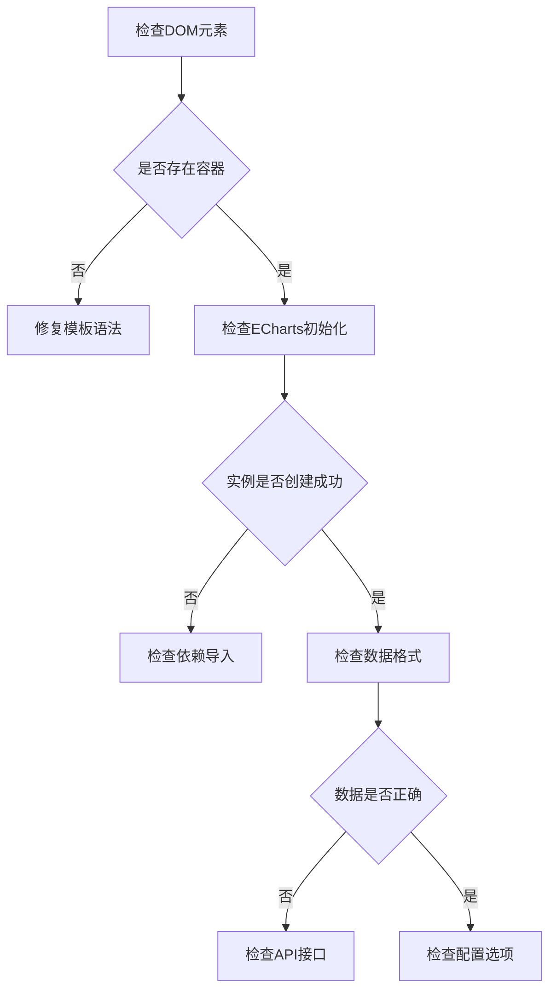

**解决方案**：
- 确保DOM元素正确渲染
- 检查echarts和echarts-gl的正确导入
- 验证数据格式符合ECharts要求
- 检查图表配置选项的完整性

#### 2. 数据不一致问题

**问题现象**：统计数字与图表显示不匹配

**排查流程**：
1. 检查API接口返回的数据格式
2. 验证数据转换逻辑的正确性
3. 确认数据绑定的响应式更新
4. 检查计算属性的依赖关系

#### 3. 性能问题诊断

**性能监控指标**：
- 图表渲染时间 > 100ms
- 内存占用 > 50MB
- CPU使用率 > 30%

**优化建议**：
- 减少数据点数量
- 降低动画复杂度
- 使用Web Workers处理计算密集任务
- 实施数据分页加载

### 调试工具和技巧

#### 1. 开发者工具使用

```javascript
// 在浏览器控制台中添加调试信息
console.log('ECharts实例:', pressureChart);
console.log('图表配置:', pressureChart.getOption());
console.log('数据状态:', pressureChartData.value);
```

#### 2. 性能分析

```javascript
// 性能测量工具
const measurePerformance = (callback) => {
  const start = performance.now();
  callback();
  const end = performance.now();
  console.log(`执行时间: ${end - start}ms`);
};
```

**章节来源**
- [GasPipelineModule.vue](file://src/views/gasModule/components/GasPipelineModule.vue#L372-L375)
- [GasPipelineModule.vue](file://src/views/gasModule/components/GasPipelineModule.vue#L394-L397)

## 总结

燃气管网模块作为阳新县城市安全监测系统的重要组成部分，展现了现代前端技术在数据可视化领域的创新应用。通过Vue 3的Composition API、ECharts的强大可视化能力和响应式设计原则的有机结合，该模块实现了：

### 技术亮点

1. **创新的3D环形图实现**：突破传统饼图的平面限制，提供更具视觉冲击力的数据展示效果
2. **渐变色彩美学**：独特的黄色配色方案既符合燃气行业的视觉特征，又提升了用户体验
3. **响应式架构设计**：完美适配各种屏幕分辨率，确保在不同设备上的良好体验
4. **性能优化策略**：针对大数据量场景的优化措施，保证了良好的渲染性能

### 应用价值

- **决策支持**：直观的管网结构分析帮助管理者快速掌握燃气系统状况
- **实时监控**：动态数据更新机制确保信息的时效性和准确性
- **交互友好**：丰富的交互功能提升了用户的操作体验
- **扩展性强**：模块化设计便于功能扩展和维护升级

### 发展方向

随着技术的不断发展，燃气管网模块可以在以下方面进一步优化：

1. **地图可视化集成**：与GIS地图系统深度整合，实现管网的空间可视化
2. **实时数据流**：引入WebSocket技术实现实时数据推送
3. **移动端优化**：针对移动设备进行专门的界面优化
4. **AI辅助分析**：集成机器学习算法提供预测和预警功能

该模块的成功实施为城市安全监测系统的其他功能模块提供了宝贵的经验和参考，展现了现代前端技术在智慧城市应用中的巨大潜力。