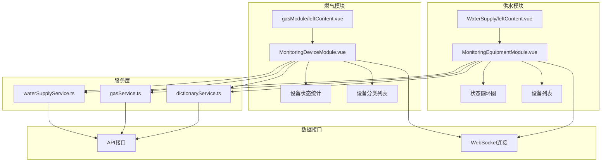
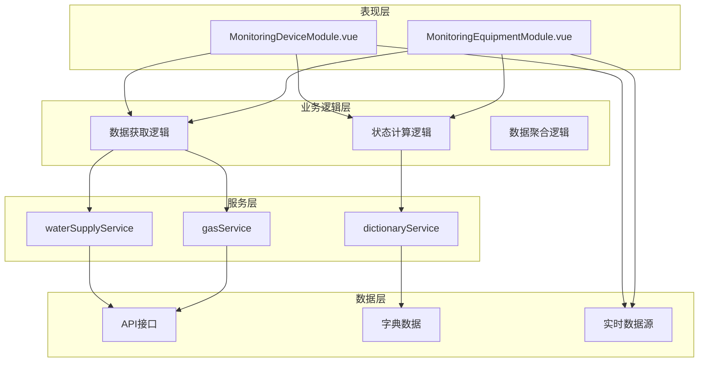
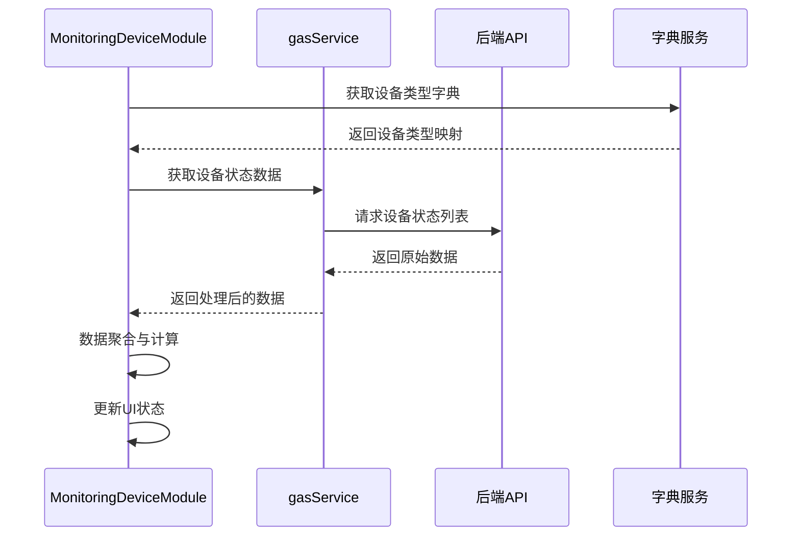
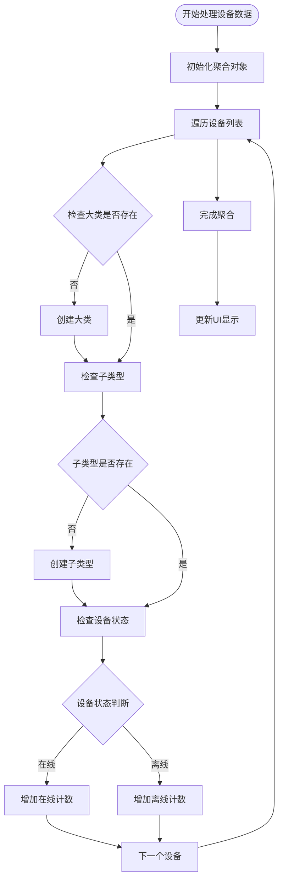
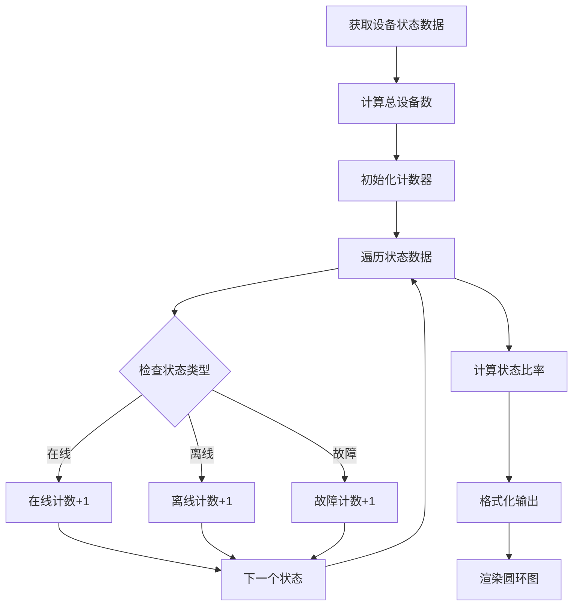
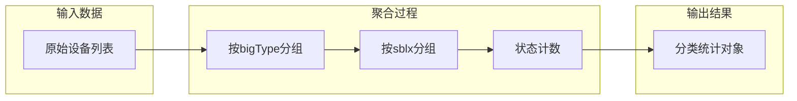
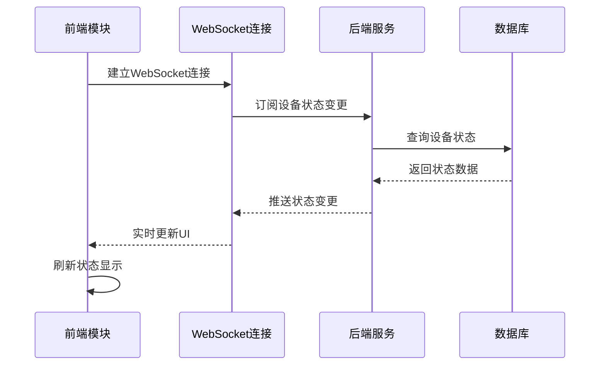
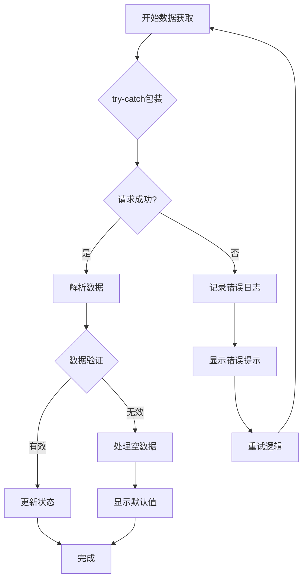

# 监测设备模块

<cite>
**本文档引用的文件**
- [leftContent.vue](file://src/views/gasModule/leftContent.vue)
- [MonitoringDeviceModule.vue](file://src/views/gasModule/components/MonitoringDeviceModule.vue)
- [MonitoringEquipmentModule.vue](file://src/views/WaterSupply/components/MonitoringEquipmentModule.vue)
- [GAS_MODULE_README.md](file://GAS_MODULE_README.md)
- [waterSupplyService.ts](file://src/services/waterSupplyService.ts)
- [gasService.ts](file://src/services/gasService.ts)
- [dictionaryService.ts](file://src/services/dictionaryService.ts)
- [index.ts](file://src/types/index.ts)
</cite>

## 目录
1. [简介](#简介)
2. [项目结构](#项目结构)
3. [核心组件](#核心组件)
4. [架构概览](#架构概览)
5. [详细组件分析](#详细组件分析)
6. [数据模型与算法](#数据模型与算法)
7. [UI设计规范](#ui设计规范)
8. [实时数据集成](#实时数据集成)
9. [异常处理与诊断](#异常处理与诊断)
10. [总结](#总结)

## 简介

监测设备模块是阳新县城市安全监测系统的重要组成部分，负责实时监控各类监测设备的运行状态。该模块采用模块化设计，支持供水和燃气两大领域的设备状态监控，通过直观的可视化界面展示设备在线率、离线率和故障率等关键指标。

模块的核心功能包括：
- 设备状态实时监控与统计
- 在线率、离线率、故障率的计算与可视化
- 各类监测设备状态列表展示
- 颜色编码的状态指示系统
- 数据刷新与实时更新机制

## 项目结构

监测设备模块在项目中的组织结构如下：



**图表来源**
- [leftContent.vue](file://src/views/gasModule/leftContent.vue#L1-L33)
- [MonitoringDeviceModule.vue](file://src/views/gasModule/components/MonitoringDeviceModule.vue#L1-L50)

**章节来源**
- [leftContent.vue](file://src/views/gasModule/leftContent.vue#L1-L33)
- [MonitoringDeviceModule.vue](file://src/views/gasModule/components/MonitoringDeviceModule.vue#L1-L376)

## 核心组件

监测设备模块包含两个主要组件，分别服务于不同的业务领域：

### 燃气监测设备模块 (MonitoringDeviceModule)

燃气模块专注于燃气系统的设备监控，提供以下核心功能：
- **设备总数统计**：实时显示在线和离线设备数量
- **在线率计算**：精确计算设备在线百分比
- **设备分类管理**：按设备类型和用途进行分类统计
- **状态可视化**：通过统计卡片直观展示设备状态

### 供水监测设备模块 (MonitoringEquipmentModule)

供水模块针对供水系统的设备监控，具有以下特点：
- **状态圆环图**：采用圆形图表展示三种状态的比例
- **设备类型映射**：通过字典服务实现设备类型的本地化显示
- **实时状态更新**：动态更新设备状态统计数据
- **分级统计**：支持在线、离线、故障三种状态的详细统计

**章节来源**
- [MonitoringDeviceModule.vue](file://src/views/gasModule/components/MonitoringDeviceModule.vue#L1-L376)
- [MonitoringEquipmentModule.vue](file://src/views/WaterSupply/components/MonitoringEquipmentModule.vue#L1-L247)

## 架构概览

监测设备模块采用分层架构设计，确保良好的可维护性和扩展性：



**图表来源**
- [MonitoringDeviceModule.vue](file://src/views/gasModule/components/MonitoringDeviceModule.vue#L77-L101)
- [MonitoringEquipmentModule.vue](file://src/views/WaterSupply/components/MonitoringEquipmentModule.vue#L40-L96)

## 详细组件分析

### 燃气监测设备模块详细分析

燃气模块采用卡片式布局，提供清晰的状态概览：

#### 数据获取与处理流程



**图表来源**
- [MonitoringDeviceModule.vue](file://src/views/gasModule/components/MonitoringDeviceModule.vue#L88-L101)
- [gasService.ts](file://src/services/gasService.ts#L194-L200)

#### 设备分类统计算法

模块实现了复杂的设备分类统计算法：



**图表来源**
- [MonitoringDeviceModule.vue](file://src/views/gasModule/components/MonitoringDeviceModule.vue#L111-L147)

**章节来源**
- [MonitoringDeviceModule.vue](file://src/views/gasModule/components/MonitoringDeviceModule.vue#L110-L147)

### 供水监测设备模块详细分析

供水模块采用状态圆环图的形式展示设备状态：

#### 圆环图状态计算算法



**图表来源**
- [MonitoringEquipmentModule.vue](file://src/views/WaterSupply/components/MonitoringEquipmentModule.vue#L150-L187)

**章节来源**
- [MonitoringEquipmentModule.vue](file://src/views/WaterSupply/components/MonitoringEquipmentModule.vue#L150-L187)

## 数据模型与算法

### 设备状态数据模型

监测设备模块使用标准化的数据模型来表示设备状态：

#### 燃气设备状态模型

| 字段名 | 类型 | 描述 | 示例值 |
|--------|------|------|--------|
| bigType | string | 设备大类 | "压力监测" |
| sblx | string | 设备类型 | "压力传感器" |
| sbyxzt | string | 设备状态 | "sbyxzt001" |
| number | number | 设备数量 | 15 |
| onlineNum | number | 在线设备数 | 12 |
| offlineNum | number | 离线设备数 | 3 |

#### 供水设备状态模型

| 字段名 | 类型 | 描述 | 示例值 |
|--------|------|------|--------|
| deviceType | string | 设备类型编码 | "jcsblx_gs001" |
| statusCounts | Array | 状态统计数组 | [{status: "sbyxzt001", count: 10}] |
| name | string | 设备类型名称 | "压力传感器" |
| online | number/string | 在线设备数 | 10 |
| offline | number/string | 离线设备数 | 2 |
| fault | number/string | 故障设备数 | 1 |

### 状态计算算法

#### 在线率计算公式

```
在线率 = (在线设备数 / 总设备数) × 100%
离线率 = (离线设备数 / 总设备数) × 100%
故障率 = (故障设备数 / 总设备数) × 100%
```

#### 设备分类聚合算法

模块实现了基于设备类型和状态的双重聚合算法：



**图表来源**
- [MonitoringDeviceModule.vue](file://src/views/gasModule/components/MonitoringDeviceModule.vue#L115-L147)

**章节来源**
- [MonitoringDeviceModule.vue](file://src/views/gasModule/components/MonitoringDeviceModule.vue#L110-L147)
- [MonitoringEquipmentModule.vue](file://src/views/WaterSupply/components/MonitoringEquipmentModule.vue#L150-L187)

## UI设计规范

### 颜色编码系统

监测设备模块采用统一的颜色编码系统来表示设备状态：

#### 燃气模块颜色规范

| 状态 | 颜色代码 | 视觉效果 | 用途 |
|------|----------|----------|------|
| 在线 | #1677ff | 明蓝色渐变 | 设备正常运行 |
| 离线 | #faad14 | 金盏花色 | 设备断开连接 |
| 故障 | #ff4d4f | 薄暮红 | 设备出现故障 |

#### 供水模块颜色规范

| 状态 | 颜色代码 | 视觉效果 | 用途 |
|------|----------|----------|------|
| 在线 | #10adc0 | 极光绿 | 设备正常工作 |
| 离线 | #cdab06 | 金盏花色 | 设备未连接 |
| 故障 | #ce5a0d | 薄暮红 | 设备异常 |

### 布局设计原则

#### 燃气模块布局

燃气模块采用卡片式布局，每个统计卡片包含：
- **图标区域**：设备统计图标
- **信息区域**：状态标签和数值
- **数值显示**：梯度文字效果

#### 供水模块布局

供水模块采用圆环图加列表的组合布局：
- **状态圆环**：展示三种状态的比例
- **设备列表**：详细列出各类设备状态
- **颜色标识**：每种状态对应特定颜色

**章节来源**
- [GAS_MODULE_README.md](file://GAS_MODULE_README.md#L88-L108)
- [MonitoringDeviceModule.vue](file://src/views/gasModule/components/MonitoringDeviceModule.vue#L207-L376)
- [MonitoringEquipmentModule.vue](file://src/views/WaterSupply/components/MonitoringEquipmentModule.vue#L100-L247)

## 实时数据集成

### WebSocket实时数据接入

虽然当前代码中没有直接的WebSocket实现，但模块设计考虑了实时数据集成的需求：

#### 实时数据流架构



#### 数据刷新策略

模块采用以下数据刷新策略：

1. **首次加载**：组件挂载时获取初始数据
2. **定时刷新**：定期重新获取数据更新状态
3. **事件驱动**：监听特定事件触发数据更新
4. **错误恢复**：处理网络异常时的重试机制

### API接口集成

#### 核心API接口

| 接口名称 | 用途 | 参数 | 返回值 |
|----------|------|------|--------|
| getDeviceStatusRate | 获取设备状态比例 | Sszx, Sjly | 状态比例数据 |
| getDeviceTypeStatusCount | 获取设备类型状态统计 | Sszx, Sjly | 设备类型统计 |
| getEquipmentOperationStatusList | 获取设备操作状态列表 | 无 | 设备状态列表 |

**章节来源**
- [waterSupplyService.ts](file://src/services/waterSupplyService.ts#L23-L46)
- [gasService.ts](file://src/services/gasService.ts#L194-L200)

## 异常处理与诊断

### 常见问题诊断

#### 设备状态同步延迟

**症状表现**：
- 设备状态更新不及时
- 数据显示与实际状态不符
- 页面刷新后状态重置

**诊断步骤**：
1. 检查API请求是否成功
2. 验证数据解析逻辑
3. 确认数据缓存机制
4. 检查网络连接状态

**解决方案**：
```typescript
// 添加请求超时处理
const fetchDataWithTimeout = async (promise, timeout = 5000) => {
  let timer;
  const timeoutPromise = new Promise((_, reject) => {
    timer = setTimeout(() => {
      reject(new Error('请求超时'));
    }, timeout);
  });
  
  try {
    const result = await Promise.race([promise, timeoutPromise]);
    clearTimeout(timer);
    return result;
  } catch (error) {
    clearTimeout(timer);
    throw error;
  }
};
```

#### 统计错误诊断

**症状表现**：
- 设备总数计算错误
- 状态比例显示异常
- 分类统计不准确

**诊断方法**：
1. 验证数据完整性
2. 检查聚合算法逻辑
3. 确认状态码映射正确性
4. 验证边界条件处理

**章节来源**
- [MonitoringDeviceModule.vue](file://src/views/gasModule/components/MonitoringDeviceModule.vue#L146-L147)
- [MonitoringEquipmentModule.vue](file://src/views/WaterSupply/components/MonitoringEquipmentModule.vue#L95-L96)

### 错误处理机制

#### 数据获取错误处理



#### 用户体验优化

1. **加载状态指示**：显示数据加载进度
2. **错误信息提示**：友好的错误消息显示
3. **自动重试机制**：网络异常时自动重试
4. **降级显示方案**：数据获取失败时的备用显示

**章节来源**
- [MonitoringDeviceModule.vue](file://src/views/gasModule/components/MonitoringDeviceModule.vue#L146-L147)
- [MonitoringEquipmentModule.vue](file://src/views/WaterSupply/components/MonitoringEquipmentModule.vue#L95-L96)

## 总结

监测设备模块作为城市安全监测系统的核心组件，实现了以下关键功能：

### 主要成就

1. **模块化设计**：供水和燃气模块分离，满足不同业务需求
2. **可视化展示**：通过圆环图和统计卡片直观展示设备状态
3. **实时更新**：支持数据的定期刷新和状态更新
4. **统一规范**：遵循项目设计规范，保持视觉一致性

### 技术亮点

- **灵活的数据模型**：支持多种设备类型和状态的扩展
- **高效的聚合算法**：实现复杂的数据分类和统计
- **优雅的UI设计**：采用渐变色彩和图标增强用户体验
- **健壮的错误处理**：完善的异常处理和恢复机制

### 改进建议

1. **实时WebSocket集成**：实现真正的实时数据推送
2. **移动端适配**：优化小屏幕设备的显示效果
3. **数据导出功能**：支持设备状态数据的导出
4. **高级筛选功能**：提供更精细的设备状态筛选

监测设备模块为城市安全监测提供了可靠的技术支撑，其设计理念和实现方式值得在类似项目中借鉴和应用。