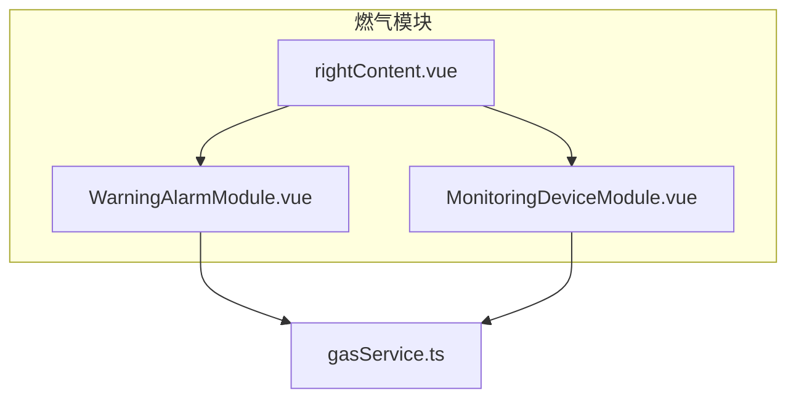
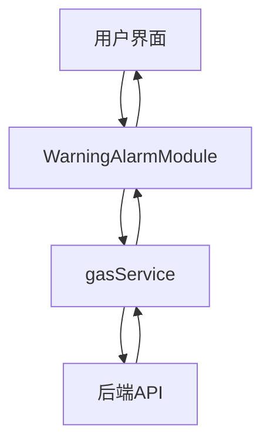
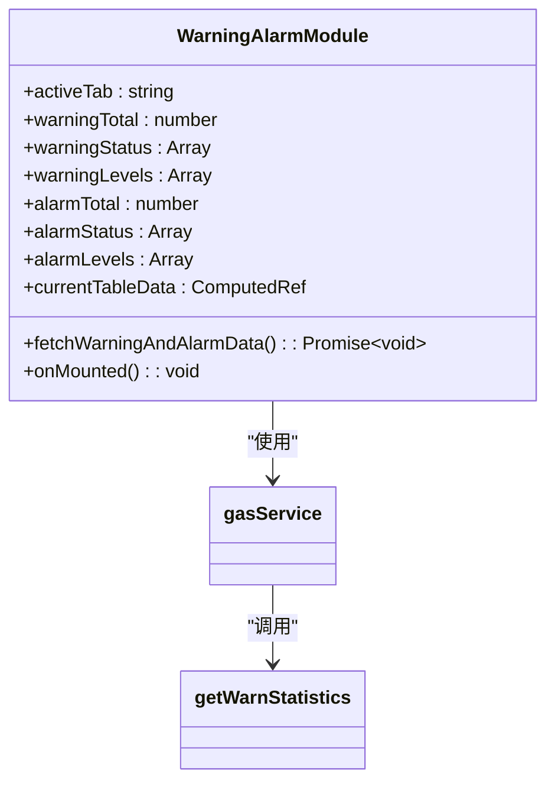
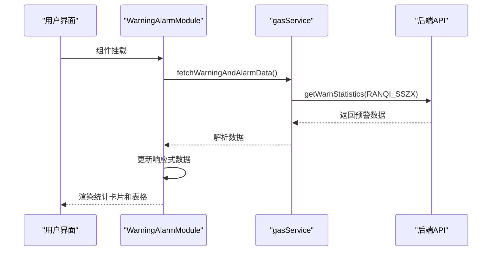
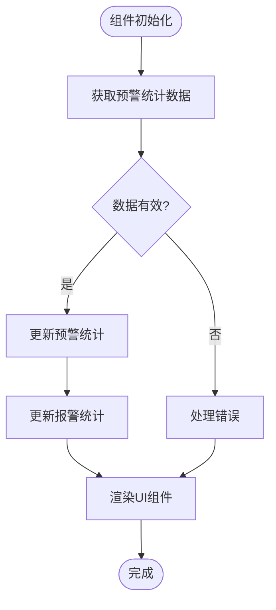
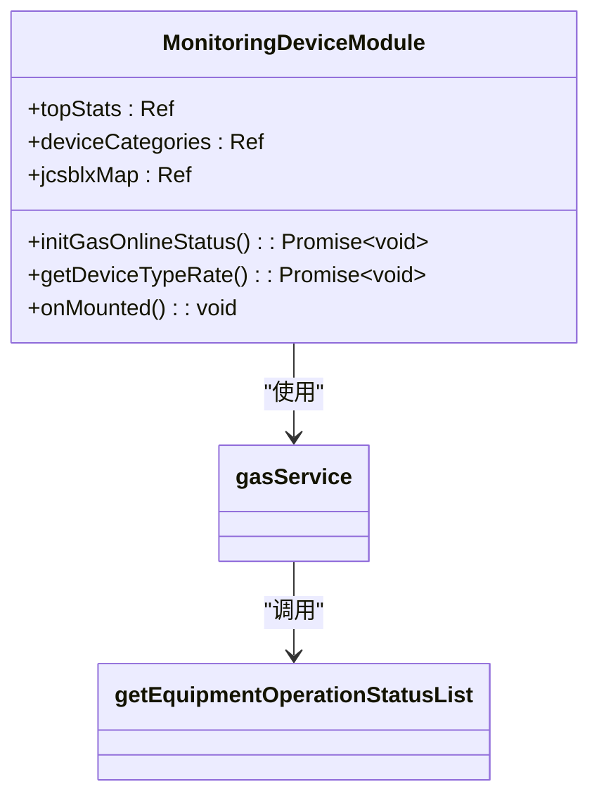
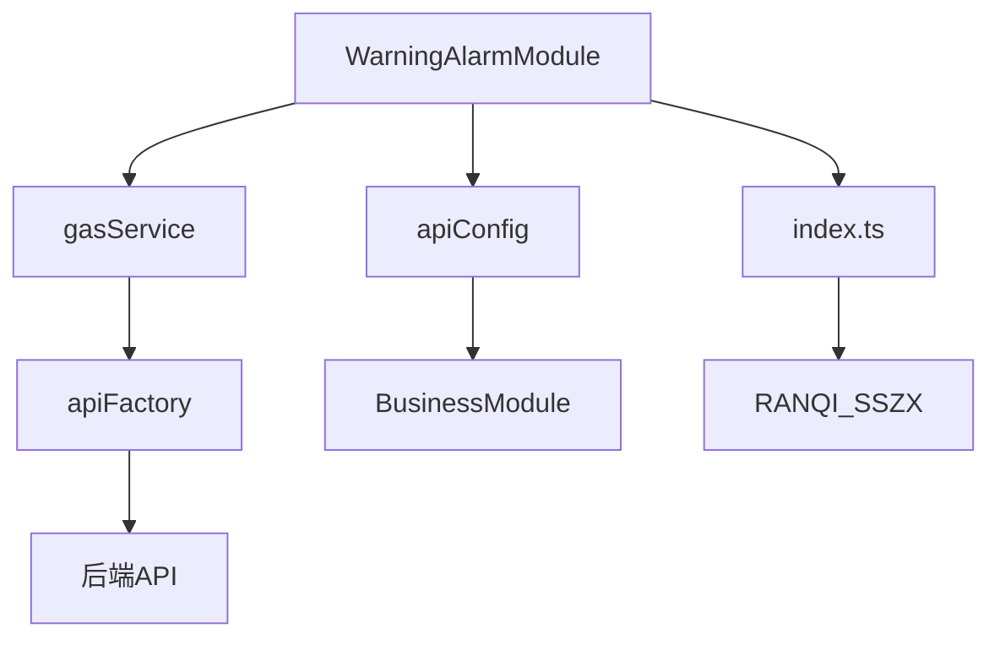
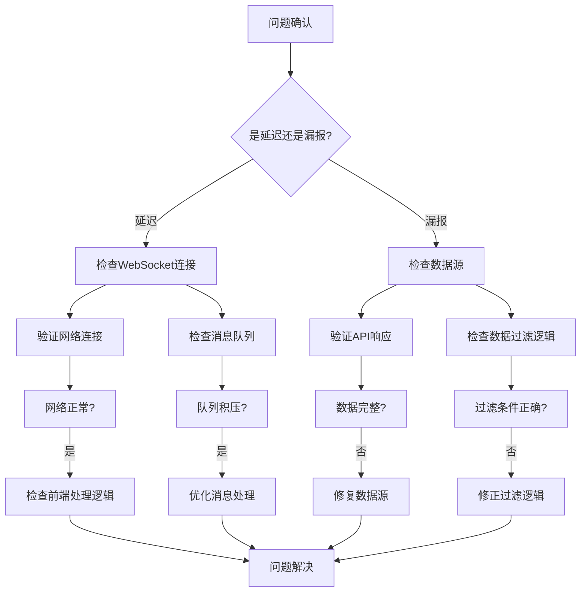

# 预警报警模块

<cite>
**本文档引用文件**   
- [rightContent.vue](file://src/views/gasModule/rightContent.vue)
- [WarningAlarmModule.vue](file://src/views/gasModule/components/WarningAlarmModule.vue)
- [GAS_MODULE_README.md](file://GAS_MODULE_README.md)
- [gasService.ts](file://src/services/gasService.ts)
- [MonitoringDeviceModule.vue](file://src/views/gasModule/components/MonitoringDeviceModule.vue)
- [apiConfig.ts](file://src/api/apiConfig.ts)
- [index.ts](file://src/types/index.ts)
</cite>

## 目录
1. [引言](#引言)
2. [项目结构](#项目结构)
3. [核心组件](#核心组件)
4. [架构概述](#架构概述)
5. [详细组件分析](#详细组件分析)
6. [依赖分析](#依赖分析)
7. [性能考虑](#性能考虑)
8. [故障诊断指南](#故障诊断指南)
9. [结论](#结论)

## 引言

预警报警模块是燃气专项监测系统的核心功能之一，负责实时监控燃气系统的安全状态，提供三级预警机制（严重/一般/提示）的实时预警功能。该模块通过WebSocket接收实时消息，展示预警统计卡片和预警列表，并支持时间范围筛选（今日/本周/本月）。模块遵循GAS_MODULE_README.md的设计规范，采用特定的UI交互和错误色系。本技术文档将深入解析该模块的实现原理、数据接口对接方案以及与监测设备模块的数据联动机制。

## 项目结构

预警报警模块位于`src/views/gasModule/`目录下，主要由`rightContent.vue`作为容器组件，包含`WarningAlarmModule.vue`核心功能组件。该模块与`MonitoringDeviceModule.vue`等其他模块协同工作，形成完整的燃气监测系统。

**Diagram sources**
- [rightContent.vue](file://src/views/gasModule/rightContent.vue)
- [WarningAlarmModule.vue](file://src/views/gasModule/components/WarningAlarmModule.vue)
- [MonitoringDeviceModule.vue](file://src/views/gasModule/components/MonitoringDeviceModule.vue)

**Section sources**
- [rightContent.vue](file://src/views/gasModule/rightContent.vue)
- [WarningAlarmModule.vue](file://src/views/gasModule/components/WarningAlarmModule.vue)

## 核心组件

预警报警模块的核心组件`WarningAlarmModule.vue`实现了三级预警机制的展示和处理。该组件通过`getWarnStatistics`服务方法获取预警统计数据，包括预警总数、状态统计（已处置/处置中/未处置）和等级统计（一级/二级/三级）。组件采用响应式数据绑定，确保数据的实时更新。

**Section sources**
- [WarningAlarmModule.vue](file://src/views/gasModule/components/WarningAlarmModule.vue)
- [gasService.ts](file://src/services/gasService.ts)

## 架构概述

预警报警模块采用Vue 3的Composition API架构，通过`<script setup>`语法实现逻辑与模板的分离。模块通过`gasService.ts`服务层与后端API进行数据交互，遵循RESTful设计原则。UI组件采用Ant Design Vue框架，确保一致的用户体验。

**Diagram sources**
- [WarningAlarmModule.vue](file://src/views/gasModule/components/WarningAlarmModule.vue)
- [gasService.ts](file://src/services/gasService.ts)

## 详细组件分析

### 预警报警模块分析

`WarningAlarmModule.vue`组件实现了预警和报警的双重统计功能，通过Tab切换展示不同类型的预警信息。组件采用响应式数据和计算属性，确保数据的一致性和实时性。

#### 组件结构

**Diagram sources**
- [WarningAlarmModule.vue](file://src/views/gasModule/components/WarningAlarmModule.vue)
- [gasService.ts](file://src/services/gasService.ts)

#### 数据流分析

**Diagram sources**
- [WarningAlarmModule.vue](file://src/views/gasModule/components/WarningAlarmModule.vue)
- [gasService.ts](file://src/services/gasService.ts)

#### 三级预警机制实现

**Diagram sources**
- [WarningAlarmModule.vue](file://src/views/gasModule/components/WarningAlarmModule.vue)

**Section sources**
- [WarningAlarmModule.vue](file://src/views/gasModule/components/WarningAlarmModule.vue)

### 监测设备模块分析

监测设备模块与预警报警模块紧密联动，提供设备状态数据支持。该模块通过`getEquipmentOperationStatusList`方法获取设备运行状态，为预警系统提供基础数据。

**Diagram sources**
- [MonitoringDeviceModule.vue](file://src/views/gasModule/components/MonitoringDeviceModule.vue)
- [gasService.ts](file://src/services/gasService.ts)

## 依赖分析

预警报警模块依赖多个核心服务和配置文件，形成完整的功能链路。

**Diagram sources**
- [WarningAlarmModule.vue](file://src/views/gasModule/components/WarningAlarmModule.vue)
- [gasService.ts](file://src/services/gasService.ts)
- [apiConfig.ts](file://src/api/apiConfig.ts)
- [index.ts](file://src/types/index.ts)

**Section sources**
- [gasService.ts](file://src/services/gasService.ts)
- [apiConfig.ts](file://src/api/apiConfig.ts)
- [index.ts](file://src/types/index.ts)

## 性能考虑

预警报警模块在性能方面进行了多项优化：
1. 使用响应式数据绑定，减少不必要的DOM操作
2. 采用服务层缓存机制，降低API调用频率
3. 通过计算属性优化数据处理逻辑
4. 使用虚拟滚动技术处理大量预警数据

## 故障诊断指南

当出现预警信息延迟或漏报时，可按照以下步骤进行诊断：

**Diagram sources**
- [WarningAlarmModule.vue](file://src/views/gasModule/components/WarningAlarmModule.vue)
- [gasService.ts](file://src/services/gasService.ts)

**Section sources**
- [WarningAlarmModule.vue](file://src/views/gasModule/components/WarningAlarmModule.vue)

## 结论

预警报警模块通过合理的架构设计和高效的实现方式，为燃气监测系统提供了可靠的预警功能。模块遵循设计规范，实现了三级预警机制的完整功能，包括统计卡片、预警列表和时间筛选。通过与监测设备模块的数据联动，形成了完整的安全监控体系。未来可进一步优化实时消息处理机制，提升系统的响应速度和可靠性。