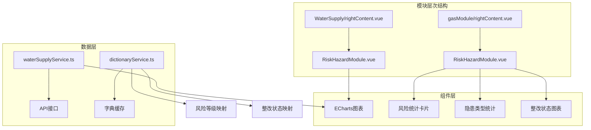
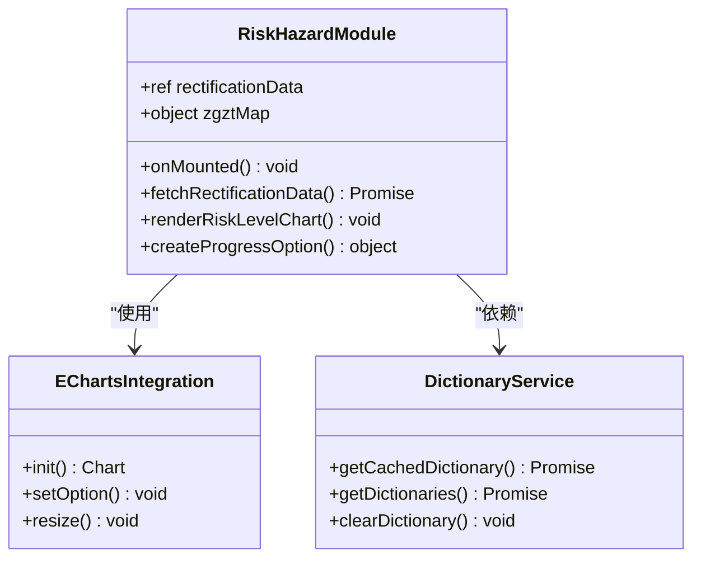
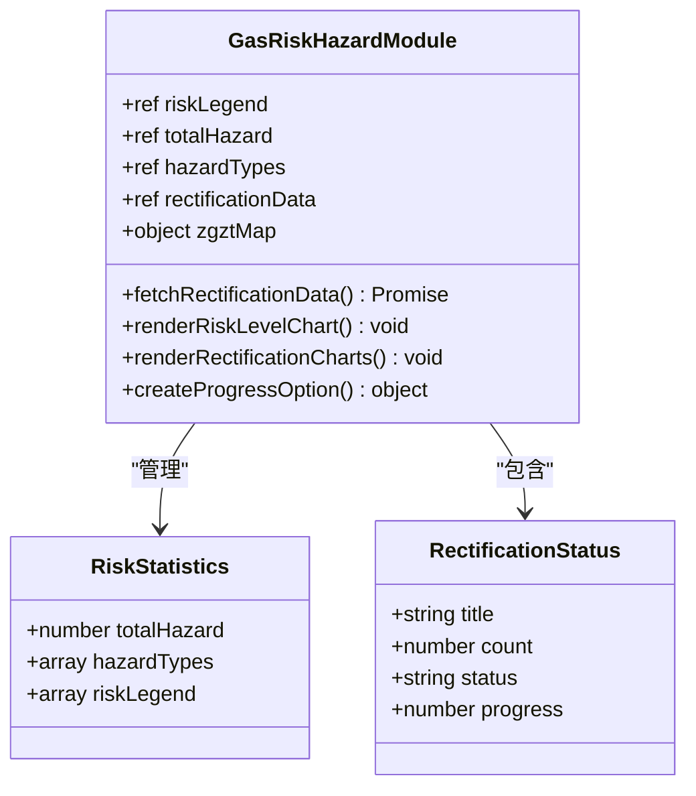
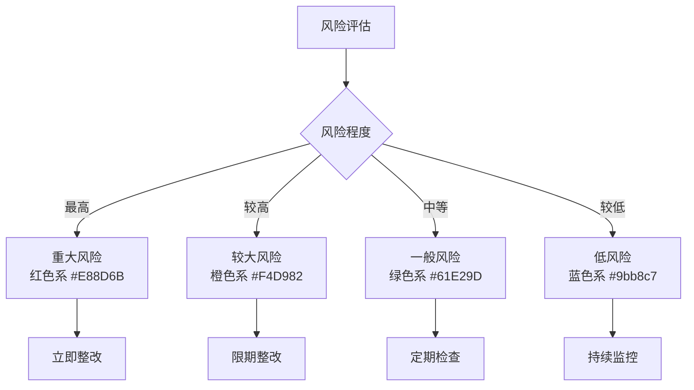
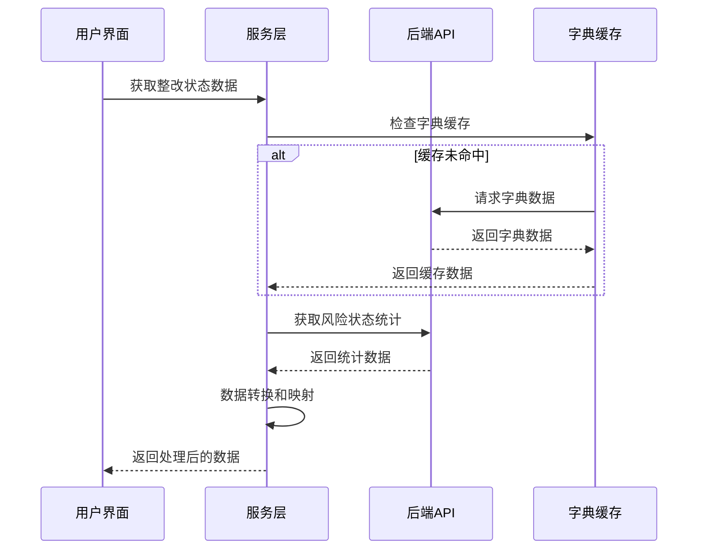
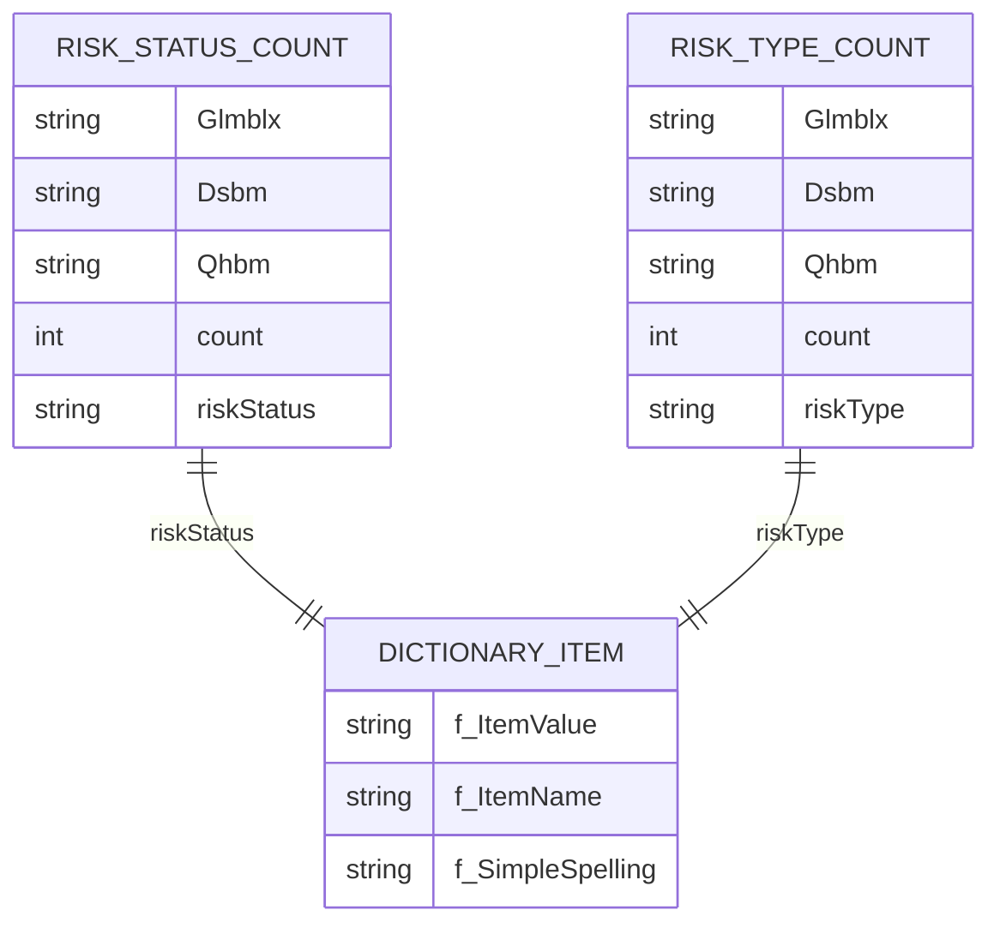
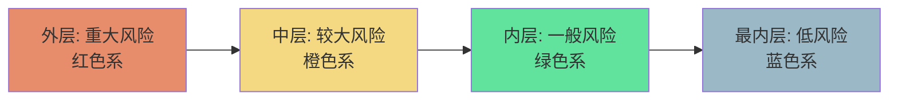
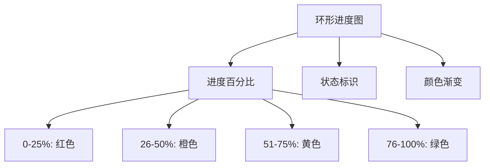
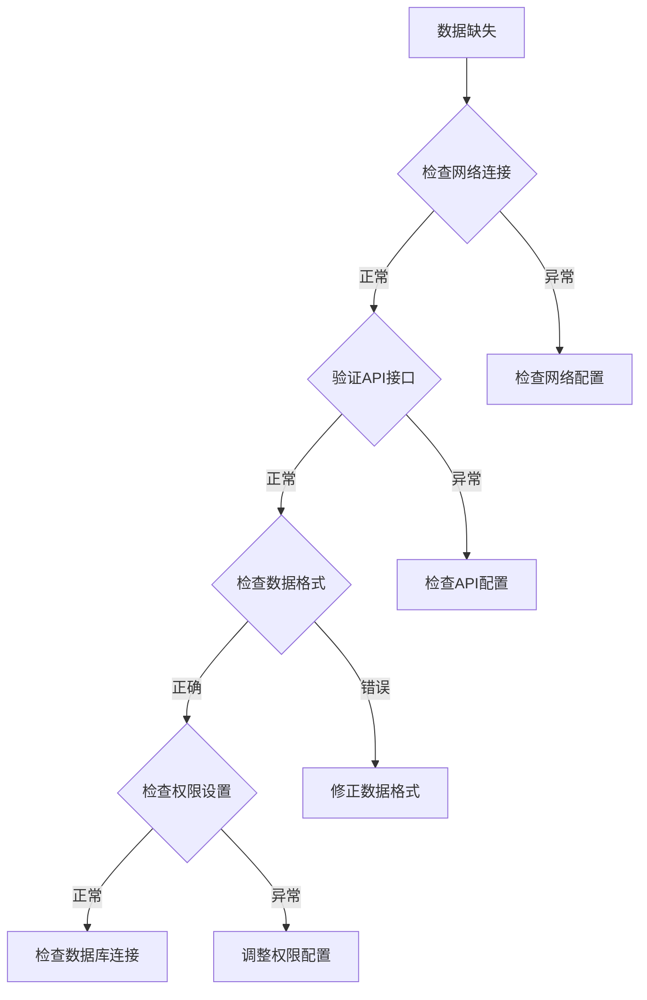

# 风险隐患模块专业文档

<cite>
**本文档引用的文件**
- [src/views/WaterSupply/rightContent.vue](file://src/views/WaterSupply/rightContent.vue)
- [src/views/gasModule/rightContent.vue](file://src/views/gasModule/rightContent.vue)
- [src/views/WaterSupply/components/RiskHazardModule.vue](file://src/views/WaterSupply/components/RiskHazardModule.vue)
- [src/views/gasModule/components/RiskHazardModule.vue](file://src/views/gasModule/components/RiskHazardModule.vue)
- [src/services/waterSupplyService.ts](file://src/services/waterSupplyService.ts)
- [src/services/dictionaryService.ts](file://src/services/dictionaryService.ts)
- [src/stores/dictionaryStore.ts](file://src/stores/dictionaryStore.ts)
- [GAS_MODULE_README.md](file://GAS_MODULE_README.md)
- [src/api/waterSupplyAndDrainage.ts](file://src/api/waterSupplyAndDrainage.ts)
- [src/api/gas.ts](file://src/api/gas.ts)
</cite>

## 目录
1. [模块概述](#模块概述)
2. [项目结构分析](#项目结构分析)
3. [核心组件架构](#核心组件架构)
4. [风险统计卡片系统](#风险统计卡片系统)
5. [风险等级分类体系](#风险等级分类体系)
6. [整改状态管理系统](#整改状态管理系统)
7. [数据模型与接口](#数据模型与接口)
8. [视觉呈现方案](#视觉呈现方案)
9. [模块关联性分析](#模块关联性分析)
10. [故障排查指南](#故障排查指南)
11. [最佳实践建议](#最佳实践建议)

## 模块概述

风险隐患模块是阳新县城市安全监测系统的核心功能模块之一，负责展示和管理各类风险隐患的统计信息、处理状态和风险等级分布。该模块采用双模块设计，在供水模块和燃气模块中均有部署，分别针对不同的业务场景提供专业的风险管理功能。

### 核心功能特性

- **风险统计卡片**：实时展示高/中/低风险等级分布情况
- **整改状态追踪**：监控隐患整改进度和处理状态
- **风险类型分类**：基于管道老化、压力异常、泄漏风险等维度进行分类
- **可视化图表**：采用ECharts实现多环形图和进度图展示
- **数据字典管理**：支持动态加载和缓存风险相关字典数据

## 项目结构分析

风险隐患模块在项目中的组织结构体现了清晰的职责分离和模块化设计：



**图表来源**
- [src/views/WaterSupply/rightContent.vue](file://src/views/WaterSupply/rightContent.vue#L8-L12)
- [src/views/gasModule/rightContent.vue](file://src/views/gasModule/rightContent.vue#L1-L11)

**章节来源**
- [src/views/WaterSupply/rightContent.vue](file://src/views/WaterSupply/rightContent.vue#L1-L28)
- [src/views/gasModule/rightContent.vue](file://src/views/gasModule/rightContent.vue#L1-L33)

## 核心组件架构

### 供水模块风险隐患组件

供水模块的风险隐患组件采用简洁的布局设计，主要包含风险统计图表和整改状态展示：



**图表来源**
- [src/views/WaterSupply/components/RiskHazardModule.vue](file://src/views/WaterSupply/components/RiskHazardModule.vue#L44-L75)

### 燃气模块风险隐患组件

燃气模块的风险隐患组件功能更加丰富，包含完整的风险统计、隐患分类和整改追踪：



**图表来源**
- [src/views/gasModule/components/RiskHazardModule.vue](file://src/views/gasModule/components/RiskHazardModule.vue#L70-L96)

**章节来源**
- [src/views/WaterSupply/components/RiskHazardModule.vue](file://src/views/WaterSupply/components/RiskHazardModule.vue#L1-L480)
- [src/views/gasModule/components/RiskHazardModule.vue](file://src/views/gasModule/components/RiskHazardModule.vue#L1-L567)

## 风险统计卡片系统

### 供水模块风险统计

供水模块采用多环形图设计，通过四个同心环展示不同风险状态的分布：

| 风险状态 | 颜色标识 | 数值范围 | 描述 |
|---------|---------|---------|------|
| 已消除风险 | #9bb8c7 | 18个 | 已经完成整改的风险点 |
| 已监测风险 | #61E29D | 25个 | 正在持续监控的风险点 |
| 巡查管控 | #F4D982 | 15个 | 通过定期巡查进行管控的风险点 |
| 未管控 | #E88D6B | 10个 | 尚未采取管控措施的风险点 |

### 燃气模块风险统计

燃气模块提供更详细的统计信息，包括隐患总数和三类隐患分布：

| 统计维度 | 数值 | 风险等级 | 配色方案 |
|---------|------|---------|---------|
| 隐患总数 | 28 | 综合 | 渐变金色 |
| 较大隐患 | 11 | 中风险 | 橙色系 |
| 重大隐患 | 8 | 高风险 | 红色系 |
| 一般隐患 | 9 | 低风险 | 蓝色系 |

**章节来源**
- [src/views/WaterSupply/components/RiskHazardModule.vue](file://src/views/WaterSupply/components/RiskHazardModule.vue#L225-L246)
- [src/views/gasModule/components/RiskHazardModule.vue](file://src/views/gasModule/components/RiskHazardModule.vue#L72-L85)

## 风险等级分类体系

### 风险等级定义

根据GAS_MODULE_README.md的设计规范，风险等级采用标准化的颜色体系：



**图表来源**
- [GAS_MODULE_README.md](file://GAS_MODULE_README.md#L97-L102)
- [src/views/gasModule/components/RiskHazardModule.vue](file://src/views/gasModule/components/RiskHazardModule.vue#L72-L77)

### 风险类型分类

风险类型主要涵盖以下几个方面：

| 风险类型 | 判定依据 | 处理策略 | 预警级别 |
|---------|---------|---------|---------|
| 管道老化 | 材质年限、腐蚀程度 | 更新改造 | 高 |
| 压力异常 | 压力值超出正常范围 | 设备检修 | 中 |
| 泄漏风险 | 检测到气体泄漏迹象 | 立即封堵 | 最高 |
| 结构损坏 | 管道变形、破损 | 修复加固 | 中 |
| 外部威胁 | 施工破坏、第三方破坏 | 设置防护 | 低 |

**章节来源**
- [GAS_MODULE_README.md](file://GAS_MODULE_README.md#L42-L47)

## 整改状态管理系统

### 整改状态映射

系统采用统一的状态映射机制，确保数据一致性：



**图表来源**
- [src/views/WaterSupply/components/RiskHazardModule.vue](file://src/views/WaterSupply/components/RiskHazardModule.vue#L49-L55)
- [src/views/gasModule/components/RiskHazardModule.vue](file://src/views/gasModule/components/RiskHazardModule.vue#L89-L96)

### 整改状态分类

| 状态名称 | 英文标识 | 处理进度 | 视觉反馈 |
|---------|---------|---------|---------|
| 已整改 | rectified | 100%完成 | 绿色渐变 |
| 未整改 | notRectified | 0%完成 | 橙色渐变 |
| 整改中 | inRectification | 50%完成 | 黄色渐变 |
| 持续跟进 | continuousImprovement | 进行中 | 蓝色渐变 |

**章节来源**
- [src/views/WaterSupply/components/RiskHazardModule.vue](file://src/views/WaterSupply/components/RiskHazardModule.vue#L50-L55)
- [src/views/gasModule/components/RiskHazardModule.vue](file://src/views/gasModule/components/RiskHazardModule.vue#L91-L96)

## 数据模型与接口

### API接口设计

系统通过标准化的API接口获取风险数据：



**图表来源**
- [src/api/waterSupplyAndDrainage.ts](file://src/api/waterSupplyAndDrainage.ts#L403-L442)
- [src/api/waterSupplyAndDrainage.ts](file://src/api/waterSupplyAndDrainage.ts#L443-L481)

### 数据查询接口

| 接口名称 | 参数 | 返回格式 | 用途 |
|---------|------|---------|------|
| getRiskStatusCount | Glmblx: string | Array<RiskStatusItem> | 获取整改状态统计 |
| getRiskTypeCount | Glmblx: string | Array<RiskTypeItem> | 获取风险类型统计 |
| getWaterSupplyRiskCount | 无 | Array<RiskCountItem> | 获取供水管网隐患统计 |
| getCachedDictionary | code: string | Array<DictionaryItem> | 获取字典数据 |

### 分页查询接口对接示例

```typescript
// 分页查询风险数据示例
async function fetchRiskData(page: number = 1, pageSize: number = 20) {
    try {
        // 获取字典数据
        const zgztDict = await getCachedDictionary('zgzt');
        const glmbzxDict = await getCachedDictionary('rqzx_glmbzx');
        
        // 构建查询参数
        const queryParams = {
            Glmblx: glmbzxDict.map(item => item.f_ItemValue).join(','),
            page,
            pageSize,
            sortField: 'createTime',
            sortOrder: 'desc'
        };
        
        // 获取风险状态统计
        const riskStats = await getRiskStatusCount(queryParams);
        
        // 数据转换和处理
        const processedData = riskStats.map(item => ({
            ...item,
            statusName: zgztDict.find(dict => dict.f_ItemValue === item.riskStatus)?.f_ItemName,
            progress: item.count / riskStats.reduce((sum, stat) => sum + stat.count, 0)
        }));
        
        return processedData;
    } catch (error) {
        console.error('获取风险数据失败:', error);
        throw error;
    }
}
```

**章节来源**
- [src/services/waterSupplyService.ts](file://src/services/waterSupplyService.ts#L62-L90)
- [src/services/dictionaryService.ts](file://src/services/dictionaryService.ts#L15-L28)

## 视觉呈现方案

### 配色规范

根据GAS_MODULE_README.md的设计规范，风险隐患模块采用统一的配色体系：

| 风险等级 | RGB值 | 渐变色 | 应用场景 |
|---------|-------|-------|---------|
| 高风险 | #FF4D4F | 红色渐变 | 重大隐患、紧急整改 |
| 中风险 | #FAAD14 | 橙色渐变 | 较大隐患、限期整改 |
| 低风险 | #1677FF | 蓝色渐变 | 一般隐患、定期检查 |
| 未整改 | #FF7875 | 粉红渐变 | 待处理状态 |
| 整改中 | #F75E04 | 深橙渐变 | 进行中状态 |
| 已整改 | #52C41A | 绿色渐变 | 完成状态 |

### 图表可视化

#### 多环形图设计

供水模块采用四层环形图展示风险状态分布：



**图表来源**
- [src/views/WaterSupply/components/RiskHazardModule.vue](file://src/views/WaterSupply/components/RiskHazardModule.vue#L126-L210)

#### 进度图设计

整改状态采用环形进度图展示：



**图表来源**
- [src/views/WaterSupply/components/RiskHazardModule.vue](file://src/views/WaterSupply/components/RiskHazardModule.vue#L248-L317)

**章节来源**
- [GAS_MODULE_README.md](file://GAS_MODULE_README.md#L97-L102)
- [src/views/WaterSupply/components/RiskHazardModule.vue](file://src/views/WaterSupply/components/RiskHazardModule.vue#L320-L480)

## 模块关联性分析

### 与预警报警模块的关联

风险隐患模块与预警报警模块存在密切的关联关系：

```mermaid
flowchart TD
A[风险隐患模块] < --> B[预警报警模块]
A --> C[风险等级评估]
A --> D[隐患统计分析]
B --> E[预警级别判断]
B --> F[报警触发条件]
C --> G[高风险 → 严重预警]
C --> H[中风险 → 一般预警]
C --> I[低风险 → 提示预警]
D --> J[隐患数量 → 预警频率]
D --> K[隐患类型 → 预警内容]
```

### 数据共享机制

两个模块通过以下方式实现数据共享：

| 共享维度 | 数据类型 | 传递方式 | 应用场景 |
|---------|---------|---------|---------|
| 风险等级 | 字典映射 | 字典缓存 | 统一风险分类 |
| 隐患类型 | 类型编码 | API接口 | 数据一致性 |
| 时间范围 | 时间戳 | 查询参数 | 数据同步 |
| 地理位置 | 坐标信息 | 空间查询 | 地图关联 |

**章节来源**
- [src/views/WaterSupply/components/RiskHazardModule.vue](file://src/views/WaterSupply/components/RiskHazardModule.vue#L1-L10)
- [src/views/gasModule/components/RiskHazardModule.vue](file://src/views/gasModule/components/RiskHazardModule.vue#L1-L10)

## 故障排查指南

### 常见问题及解决方案

#### 1. 风险数据缺失

**症状表现**：
- 风险统计图表显示为空白
- 整改状态数据为零
- 字典数据加载失败

**排查步骤**：


**解决方案**：
1. 检查API接口是否正常响应
2. 验证查询参数是否正确
3. 确认用户权限是否足够
4. 检查数据缓存是否过期

#### 2. 风险等级分类错误

**症状表现**：
- 风险等级显示不正确
- 颜色映射错误
- 分类统计异常

**排查步骤**：
1. 检查字典数据是否正确加载
2. 验证风险等级映射关系
3. 确认数据转换逻辑
4. 检查前端颜色配置

#### 3. 整改状态更新失败

**症状表现**：
- 整改状态无法更新
- 进度图不更新
- 数据同步延迟

**排查步骤**：
1. 检查API接口调用
2. 验证数据提交格式
3. 确认后端处理逻辑
4. 检查错误日志

### 性能优化建议

#### 1. 数据缓存优化

```typescript
// 实现智能缓存策略
const riskDataCache = new Map();

async function getRiskDataWithCache(params) {
    const cacheKey = JSON.stringify(params);
    
    // 检查缓存
    if (riskDataCache.has(cacheKey)) {
        const cachedData = riskDataCache.get(cacheKey);
        if (isCacheValid(cachedData)) {
            return cachedData.data;
        }
    }
    
    // 从API获取数据
    const data = await getRiskStatusCount(params);
    
    // 更新缓存
    riskDataCache.set(cacheKey, {
        data,
        timestamp: Date.now(),
        ttl: 300000 // 5分钟
    });
    
    return data;
}
```

#### 2. 图表渲染优化

```typescript
// 实现图表懒加载
const chartInstances = new Map();

function lazyRenderChart(elementId, optionGenerator) {
    const observer = new IntersectionObserver((entries) => {
        entries.forEach(entry => {
            if (entry.isIntersecting && !chartInstances.has(elementId)) {
                const chartDom = document.getElementById(elementId);
                if (chartDom) {
                    const chart = echarts.init(chartDom);
                    chart.setOption(optionGenerator());
                    chartInstances.set(elementId, chart);
                    observer.unobserve(entry.target);
                }
            }
        });
    });
    
    observer.observe(document.getElementById(elementId));
}
```

**章节来源**
- [src/services/dictionaryService.ts](file://src/services/dictionaryService.ts#L15-L45)
- [src/stores/dictionaryStore.ts](file://src/stores/dictionaryStore.ts#L61-L179)

## 最佳实践建议

### 1. 数据治理

- **建立数据质量检查机制**：定期验证风险数据的完整性和准确性
- **实施数据版本控制**：记录风险数据的变更历史
- **制定数据更新策略**：明确数据更新频率和触发条件

### 2. 用户体验优化

- **实现响应式设计**：确保在不同设备上的良好显示效果
- **提供数据导出功能**：支持Excel和PDF格式导出
- **增加数据钻取功能**：允许用户深入查看具体风险详情

### 3. 系统集成

- **建立统一的字典管理平台**：避免重复定义风险相关字典
- **实现跨模块数据共享**：确保预警、应急等模块的数据一致性
- **提供标准化的API接口**：便于其他系统集成

### 4. 安全与合规

- **实施数据访问控制**：根据用户角色限制数据访问权限
- **建立审计日志机制**：记录所有风险数据的操作行为
- **确保数据隐私保护**：遵守相关法律法规要求

通过以上专业化的风险隐患模块设计和实现，系统能够有效支撑城市安全管理决策，提升风险防控能力，为保障城市运行安全提供有力支撑。