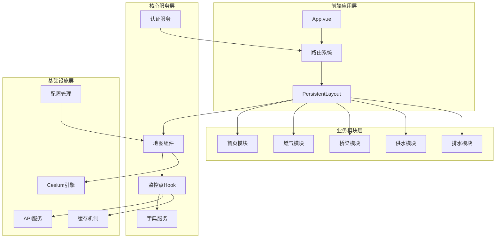
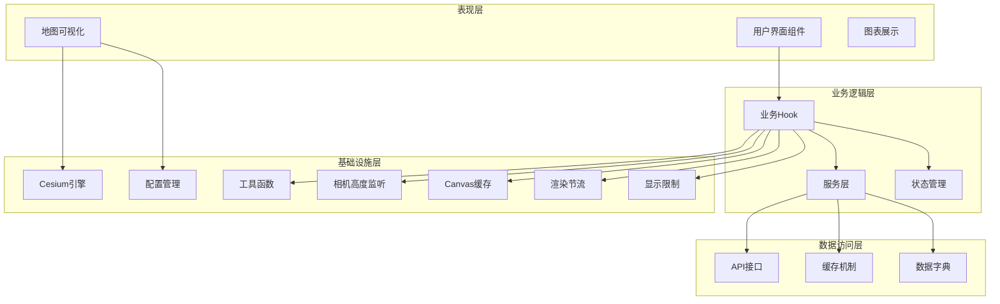
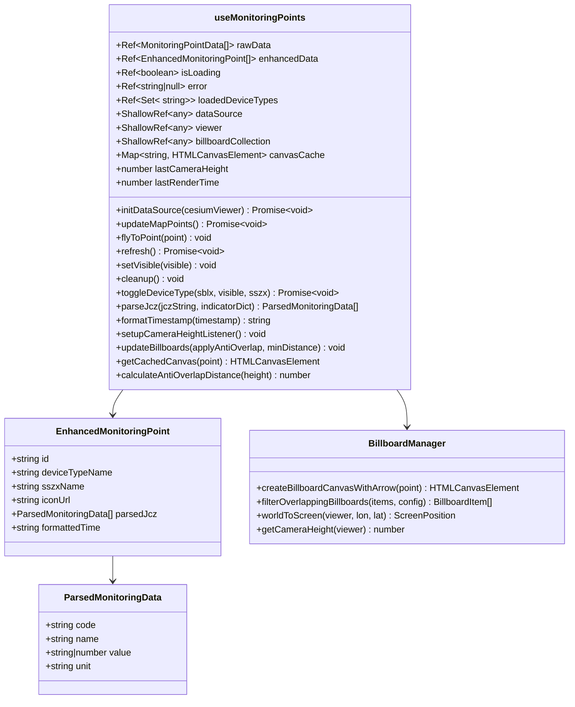
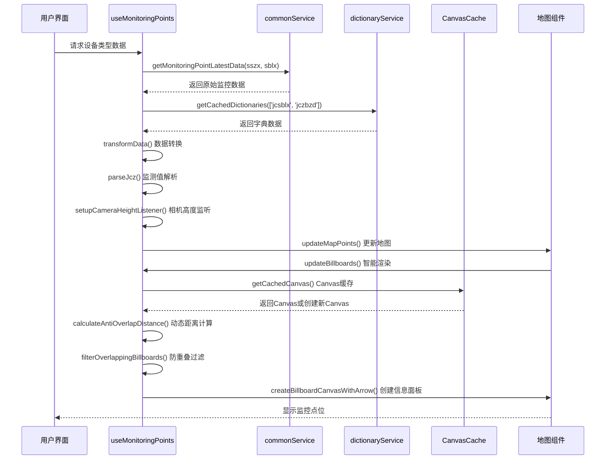
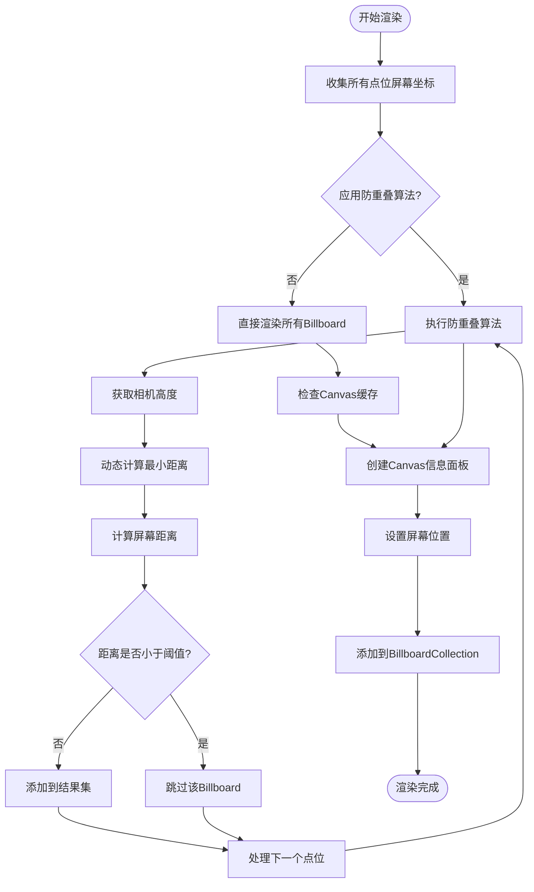
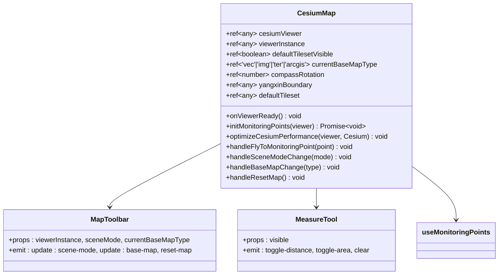
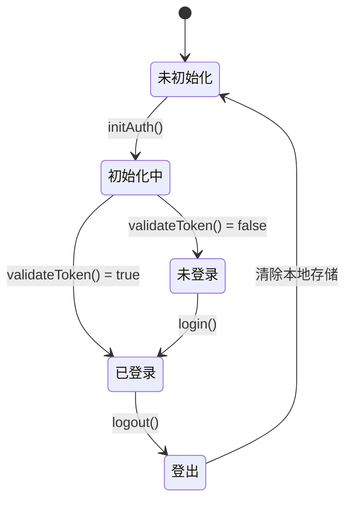
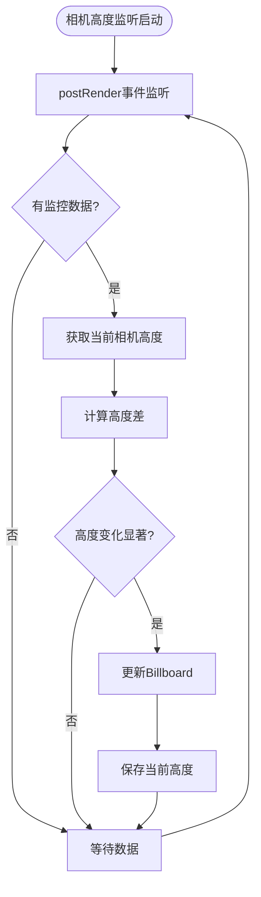
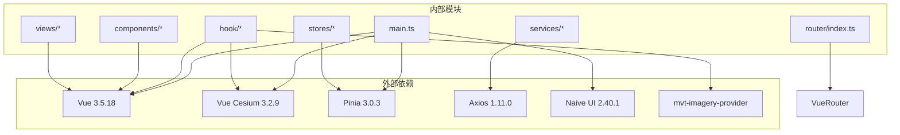

# 监控点管理系统

<cite>
**本文档引用的文件**
- [package.json](file://package.json)
- [main.ts](file://src/main.ts)
- [App.vue](file://src/App.vue)
- [router/index.ts](file://src/router/index.ts)
- [mapConfig.ts](file://src/config/mapConfig.ts)
- [monitoringIconConfig.ts](file://src/config/monitoringIconConfig.ts)
- [auth.ts](file://src/stores/auth.ts)
- [mapStore.ts](file://src/stores/mapStore.ts)
- [useMonitoringPoints.ts](file://src/hook/useMonitoringPoints.ts)
- [billboardManager.ts](file://src/hook/billboardManager.ts)
- [commonService.ts](file://src/services/commonService.ts)
- [dictionaryService.ts](file://src/services/dictionaryService.ts)
- [PersistentLayout.vue](file://src/layouts/PersistentLayout.vue)
- [Map.vue](file://src/mapComponents/Map.vue)
- [index.vue (HomeModule)](file://src/views/HomeModule/index.vue)
- [index.vue (BridgeModule)](file://src/views/BridgeModule/index.vue)
- [index.vue (GasModule)](file://src/views/GasModule/index.vue)
- [OptimizedLayerTree.vue](file://src/mapComponents/OptimizedLayerTree.vue)
- [useMapHooks.ts](file://src/hook/useMapHooks.ts)
- [dictionaryStore.ts](file://src/stores/dictionaryStore.ts)
</cite>

## 更新摘要
**变更内容**
- 新增动态相机高度感知的防重叠算法章节
- 更新Canvas缓存机制和智能渲染节流功能描述
- 新增最大显示限制和性能优化章节
- 更新架构图以反映新的相机高度监听机制
- 新增实时渲染节流和缓存管理功能说明

## 目录
1. [项目概述](#项目概述)
2. [项目结构](#项目结构)
3. [核心组件](#核心组件)
4. [架构概览](#架构概览)
5. [详细组件分析](#详细组件分析)
6. [性能优化详解](#性能优化详解)
7. [依赖关系分析](#依赖关系分析)
8. [故障排除指南](#故障排除指南)
9. [结论](#结论)

## 项目概述

监控点管理系统是一个基于Vue 3和Cesium的政府级综合监测预警平台。该系统专注于为政府部门提供实时的监控点位可视化管理和数据分析功能，涵盖燃气、供水、桥梁、排水等多个专项领域。

### 主要特性

- **多专题监控**：支持燃气监测、供水监测、桥梁监测、排水监测等专项业务
- **实时数据可视化**：基于Cesium的3D地球引擎，提供丰富的地理空间数据展示
- **智能防重叠算法**：动态相机高度感知的防重叠算法，优化大量监控点位的显示效果
- **Canvas缓存机制**：智能Canvas缓存避免重复创建，提升渲染性能
- **智能渲染节流**：基于相机高度变化的渲染节流机制，减少不必要的重绘
- **最大显示限制**：防止WebGL资源耗尽的监控点位显示上限控制
- **响应式布局**：适配不同分辨率的显示设备
- **模块化架构**：清晰的业务模块划分和组件化设计

## 项目结构

项目采用现代化的Vue 3单页应用架构，结合Cesium 3D地球引擎实现地理空间数据可视化。

**图表来源**
- [main.ts](file://src/main.ts#L1-L30)
- [router/index.ts](file://src/router/index.ts#L1-L136)
- [PersistentLayout.vue](file://src/layouts/PersistentLayout.vue#L1-L58)

**章节来源**
- [package.json](file://package.json#L1-L49)
- [main.ts](file://src/main.ts#L1-L30)
- [App.vue](file://src/App.vue#L1-L159)

## 核心组件

### 应用入口与配置

应用通过Vue 3创建，集成Pinia状态管理、Naive UI组件库和Vue Cesium插件，提供完整的3D地球可视化能力。

### 路由系统

采用Vue Router的嵌套路由设计，实现持久化布局和模块化页面管理：

- **独立布局**：登录页面
- **持久化布局**：业务模块父路由，包含地图和头部导航
- **业务模块**：首页、燃气、桥梁、供水、排水专项模块

### 地图配置系统

统一的地图配置管理，包括：
- 地图中心坐标（阳新县）
- 相机范围限制
- 天地图底图配置
- 样式资源路径

**章节来源**
- [router/index.ts](file://src/router/index.ts#L1-L136)
- [mapConfig.ts](file://src/config/mapConfig.ts#L1-L55)

## 架构概览

系统采用分层架构设计，各层职责明确，便于维护和扩展。

**图表来源**
- [useMonitoringPoints.ts](file://src/hook/useMonitoringPoints.ts#L1-L736)
- [Map.vue](file://src/mapComponents/Map.vue#L1-L627)
- [commonService.ts](file://src/services/commonService.ts#L1-L160)

## 详细组件分析

### 监控点管理Hook

监控点管理Hook是系统的核心组件，负责处理所有监控点位相关的业务逻辑。

**图表来源**
- [useMonitoringPoints.ts](file://src/hook/useMonitoringPoints.ts#L25-L736)
- [billboardManager.ts](file://src/hook/billboardManager.ts#L1-L243)

#### 数据流处理

监控点数据的完整处理流程：

**图表来源**
- [useMonitoringPoints.ts](file://src/hook/useMonitoringPoints.ts#L145-L343)
- [commonService.ts](file://src/services/commonService.ts#L108-L121)

**章节来源**
- [useMonitoringPoints.ts](file://src/hook/useMonitoringPoints.ts#L1-L736)

### Billboard管理模块

Billboard管理模块实现了复杂的防重叠算法和智能渲染功能。

**图表来源**
- [billboardManager.ts](file://src/hook/billboardManager.ts#L181-L216)

#### 防重叠算法实现

系统采用基于相机高度感知的动态防重叠算法，根据相机高度动态调整最小距离阈值：

- **高空模式**（≥10,000米）：最小距离120像素，适合远距离浏览
- **中空模式**（5,000-9,999米）：最小距离80像素，平衡显示密度
- **低空模式**（2,000-4,999米）：最小距离50像素，适合中距离观察
- **近距离模式**（500-1,999米）：最小距离30像素，适合近景查看
- **超近距离**（<500米）：最小距离20像素，适合精细观察

**章节来源**
- [billboardManager.ts](file://src/hook/billboardManager.ts#L1-L250)

### 地图组件

地图组件基于Vue Cesium实现，提供完整的3D地球可视化功能。

**图表来源**
- [Map.vue](file://src/mapComponents/Map.vue#L1-L627)

**章节来源**
- [Map.vue](file://src/mapComponents/Map.vue#L1-L627)

### 状态管理系统

系统采用Pinia进行状态管理，包含认证状态、地图状态、字典状态等。

**图表来源**
- [auth.ts](file://src/stores/auth.ts#L1-L76)

**章节来源**
- [auth.ts](file://src/stores/auth.ts#L1-L76)
- [mapStore.ts](file://src/stores/mapStore.ts#L1-L400)

## 性能优化详解

### 相机高度感知的智能渲染

系统实现了基于相机高度的智能渲染机制，通过实时监听相机变化来优化渲染性能：

#### 相机高度监听机制

**图表来源**
- [useMonitoringPoints.ts](file://src/hook/useMonitoringPoints.ts#L248-L284)

#### 渲染节流机制

系统采用智能渲染节流，避免频繁的重绘操作：

- **节流间隔**：300毫秒（可配置）
- **高度变化阈值**：10%或1000米（双重条件）
- **实时更新**：相机移动结束时的兜底更新

#### Canvas缓存管理

系统实现了高效的Canvas缓存机制：

- **缓存策略**：基于监控点ID的Map缓存
- **最大缓存数量**：100个Canvas对象
- **缓存淘汰**：LRU算法，自动删除最旧的缓存项
- **内存控制**：防止内存泄漏和过度占用

#### 最大显示限制

为防止WebGL资源耗尽，系统实施了监控点位显示限制：

- **最大显示数量**：50个Billboard
- **自动截断**：超过限制时自动截断到最大数量
- **性能保护**：避免大量数据导致的渲染性能问题

**章节来源**
- [useMonitoringPoints.ts](file://src/hook/useMonitoringPoints.ts#L83-L85)
- [useMonitoringPoints.ts](file://src/hook/useMonitoringPoints.ts#L463-L465)
- [useMonitoringPoints.ts](file://src/hook/useMonitoringPoints.ts#L248-L284)

## 依赖关系分析

系统依赖关系清晰，各模块耦合度适中，便于维护和扩展。

**图表来源**
- [package.json](file://package.json#L15-L32)
- [main.ts](file://src/main.ts#L10-L27)

**章节来源**
- [package.json](file://package.json#L1-L49)

## 故障排除指南

### 常见问题及解决方案

#### 地图加载失败

**症状**：Cesium Viewer无法正常显示
**原因**：
- Cesium资源加载失败
- 地图配置错误
- 网络连接问题

**解决方案**：
1. 检查Cesium资源路径配置
2. 验证地图中心坐标和缩放级别
3. 确认网络连接正常

#### 监控点数据不显示

**症状**：地图上没有监控点位标记
**原因**：
- API接口返回数据格式错误
- 设备类型配置缺失
- 坐标数据无效

**解决方案**：
1. 检查API接口返回的数据格式
2. 验证设备类型映射配置
3. 确认坐标数据的有效性（经度-180到180，纬度-90到90）

#### 性能问题

**症状**：页面响应缓慢，渲染卡顿
**原因**：
- 监控点数量过多
- 防重叠算法计算复杂度过高
- 相机频繁移动导致重复计算

**解决方案**：
1. 优化防重叠算法参数
2. 实施数据分页加载
3. 减少同时显示的监控点数量
4. 检查Canvas缓存是否正常工作
5. 验证渲染节流机制是否生效

#### 相机高度监听失效

**症状**：监控点位不随相机高度变化而调整
**原因**：
- 相机高度监听器未正确设置
- 相机移动事件未触发
- 防重叠距离计算错误

**解决方案**：
1. 检查`setupCameraHeightListener()`方法是否被调用
2. 验证postRender事件监听器是否注册
3. 确认`getCameraHeight()`函数返回有效数值
4. 检查`calculateAntiOverlapDistance()`方法的逻辑

#### Canvas缓存问题

**症状**：Canvas创建频繁，内存占用过高
**原因**：
- 缓存机制失效
- 缓存键生成错误
- 缓存清理逻辑异常

**解决方案**：
1. 检查`getCachedCanvas()`方法的缓存逻辑
2. 验证缓存键（监控点ID）的唯一性
3. 确认缓存淘汰机制正常工作
4. 监控缓存大小，避免超过100个对象

**章节来源**
- [useMonitoringPoints.ts](file://src/hook/useMonitoringPoints.ts#L508-L520)
- [Map.vue](file://src/mapComponents/Map.vue#L374-L392)

## 结论

监控点管理系统是一个功能完善、架构清晰的政府级监测预警平台。系统通过模块化设计和分层架构，实现了良好的可维护性和扩展性。主要优势包括：

### 技术优势

- **先进的技术栈**：Vue 3 + TypeScript + Cesium 3D引擎
- **智能的用户体验**：基于相机高度感知的动态防重叠算法
- **卓越的性能优化**：多层缓存、智能渲染节流和显示限制
- **清晰的架构设计**：模块化和组件化的设计理念
- **实时的相机监听**：基于postRender事件的高效渲染机制

### 业务价值

- **多专题支持**：覆盖燃气、供水、桥梁、排水等多个政府专项
- **实时数据可视化**：提供直观的地理空间数据展示
- **智能化处理**：自动化的数据解析、防重叠处理和性能优化
- **易于扩展**：清晰的架构为未来功能扩展奠定基础

### 性能优化亮点

- **动态相机高度感知**：根据相机高度自动调整防重叠距离
- **智能Canvas缓存**：避免重复创建Canvas对象，提升渲染效率
- **渲染节流机制**：减少不必要的重绘操作，优化性能
- **最大显示限制**：防止WebGL资源耗尽，确保系统稳定性

该系统为政府部门提供了强大的监测预警能力，能够有效提升城市治理的智能化水平。通过持续的性能优化和功能增强，系统将继续为政府数字化转型提供强有力的技术支撑。