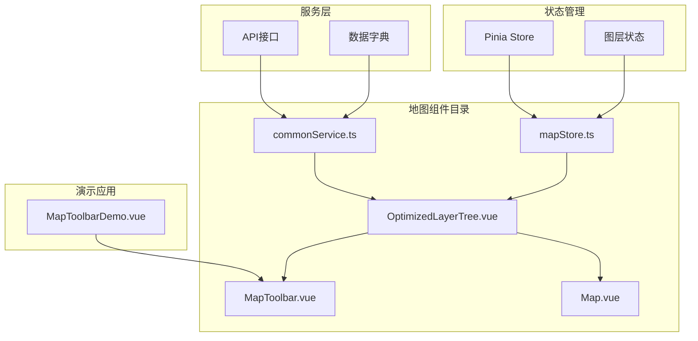
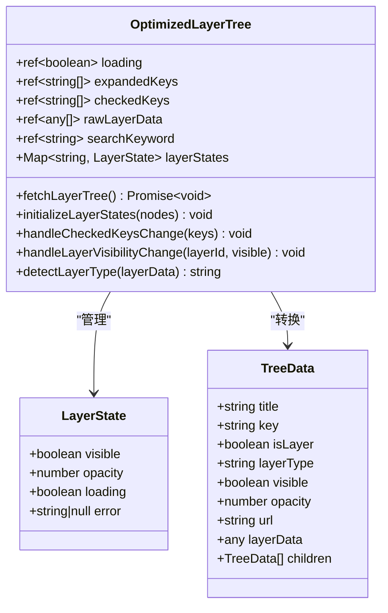
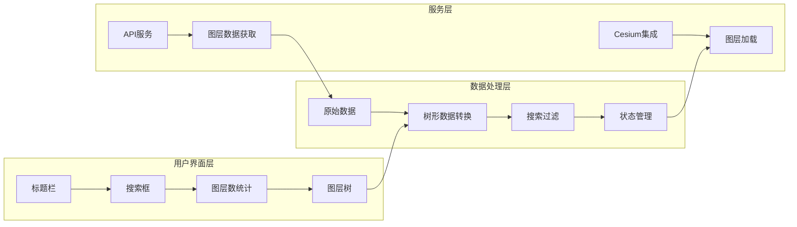
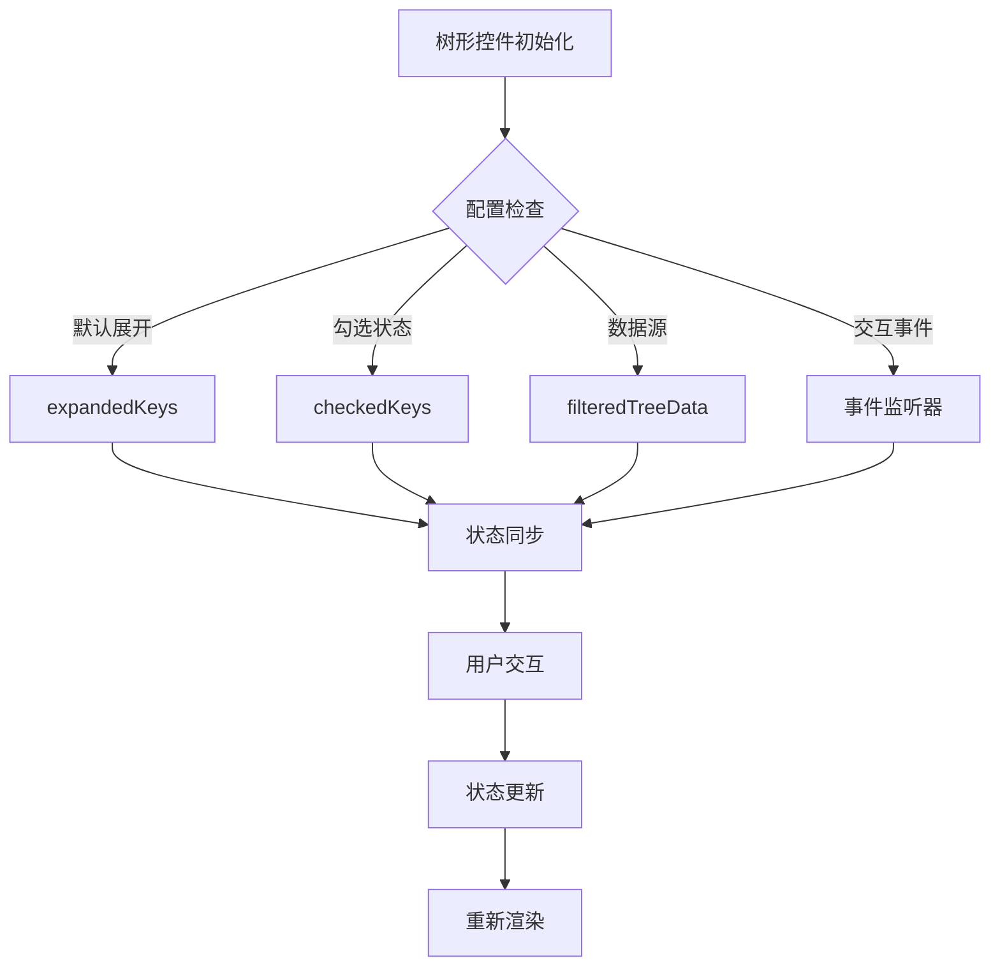
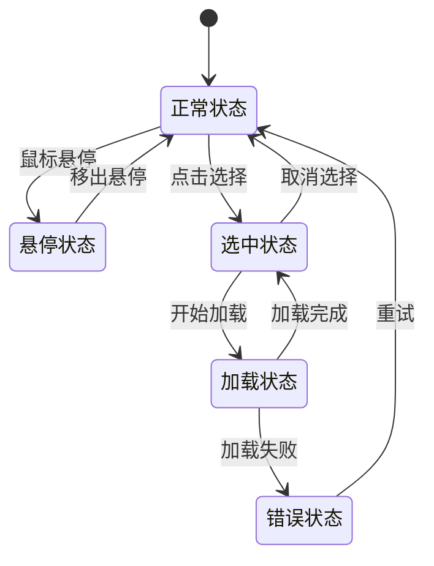
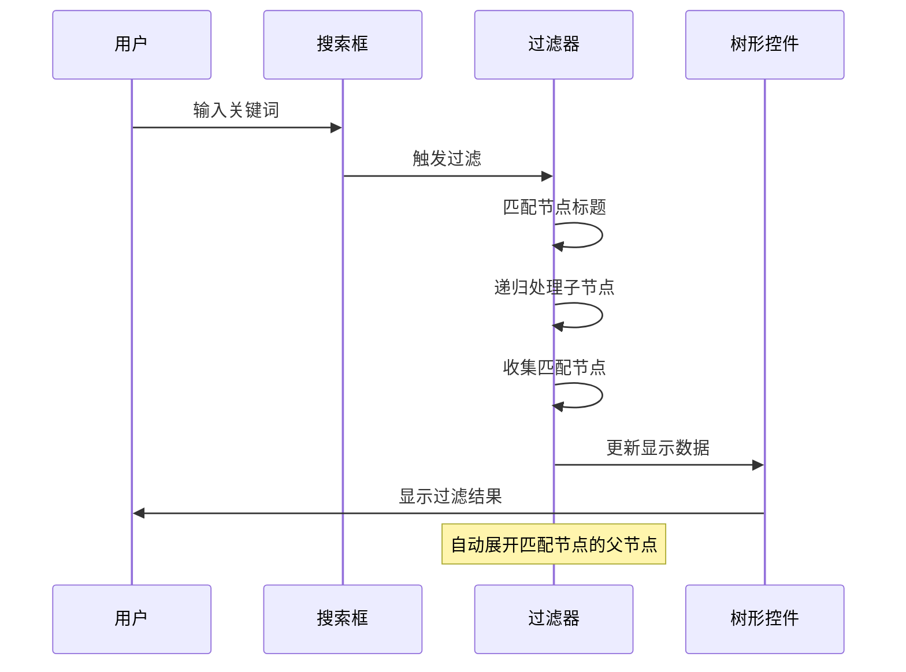
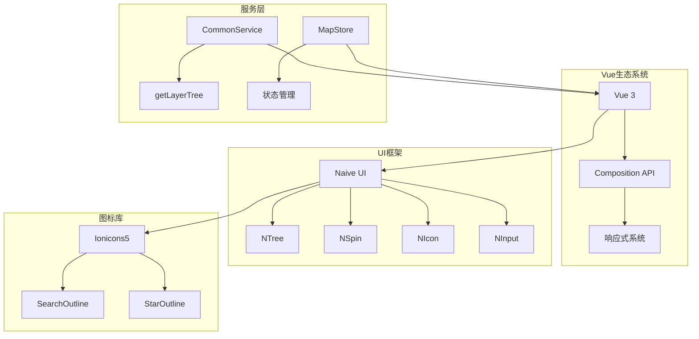
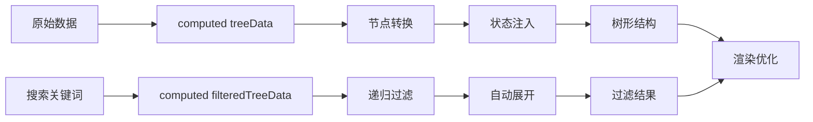
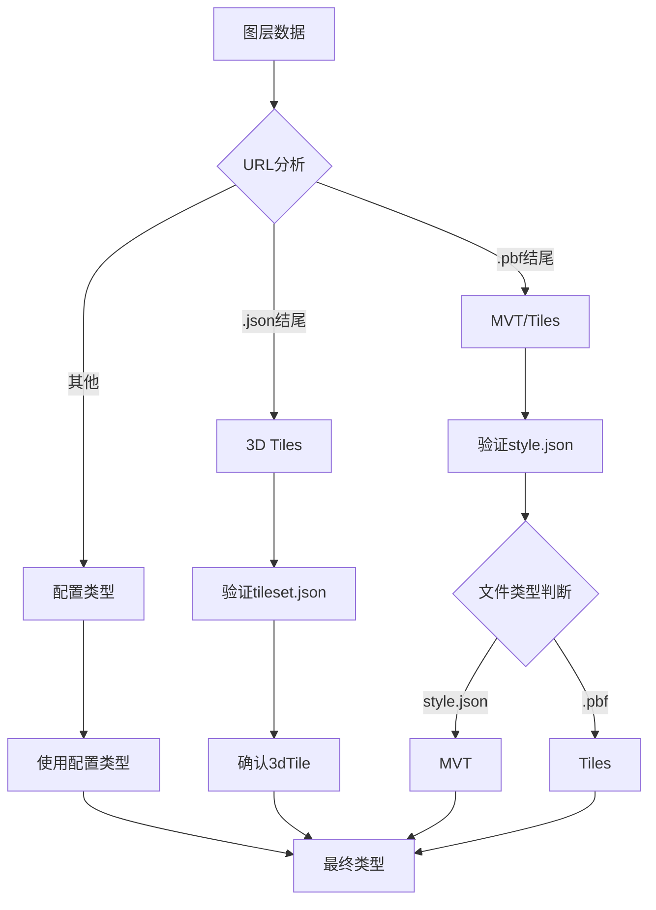

# 图层树组件

<cite>
**本文档引用的文件**
- [OptimizedLayerTree.vue](file://src/mapComponents/OptimizedLayerTree.vue)
- [README_LAYER_TREE.md](file://src/mapComponents/README_LAYER_TREE.md)
- [MapToolbar.vue](file://src/mapComponents/MapToolbar.vue)
- [commonService.ts](file://src/services/commonService.ts)
- [mapStore.ts](file://src/stores/mapStore.ts)
- [MapToolbarDemo.vue](file://src/views/MapToolbarDemo.vue)
</cite>

## 目录
1. [概述](#概述)
2. [项目结构](#项目结构)
3. [核心组件](#核心组件)
4. [架构概览](#架构概览)
5. [详细组件分析](#详细组件分析)
6. [依赖关系分析](#依赖关系分析)
7. [性能考虑](#性能考虑)
8. [故障排除指南](#故障排除指南)
9. [结论](#结论)

## 概述

OptimizedLayerTree.vue是一个优化的图层树组件，专门用于渲染和管理地图图层。该组件支持多种图层类型，包括MVT矢量瓦片、3D Tiles三维模型、普通瓦片图层和WMS服务图层。组件提供了完整的图层管理功能，包括搜索过滤、状态管理、异步加载和可视化控制。

### 主要特性

- **多图层类型支持**：MVT、3dTile、tile、wms、group
- **智能搜索过滤**：实时关键词搜索和自动展开功能
- **状态管理**：完整的图层可见性、透明度和加载状态跟踪
- **性能优化**：按需加载、状态缓存和计算属性优化
- **响应式设计**：自适应布局和主题适配
- **错误处理**：完善的加载失败处理和用户友好提示

## 项目结构

**图表来源**
- [OptimizedLayerTree.vue](file://src/mapComponents/OptimizedLayerTree.vue#L1-L50)
- [MapToolbar.vue](file://src/mapComponents/MapToolbar.vue#L1-L30)
- [commonService.ts](file://src/services/commonService.ts#L85-L91)

**章节来源**
- [OptimizedLayerTree.vue](file://src/mapComponents/OptimizedLayerTree.vue#L1-L687)
- [README_LAYER_TREE.md](file://src/mapComponents/README_LAYER_TREE.md#L1-L252)

## 核心组件

### 组件结构层次

**图表来源**
- [OptimizedLayerTree.vue](file://src/mapComponents/OptimizedLayerTree.vue#L70-L111)
- [OptimizedLayerTree.vue](file://src/mapComponents/OptimizedLayerTree.vue#L190-L216)

**章节来源**
- [OptimizedLayerTree.vue](file://src/mapComponents/OptimizedLayerTree.vue#L70-L140)

## 架构概览

### 组件架构设计

**图表来源**
- [OptimizedLayerTree.vue](file://src/mapComponents/OptimizedLayerTree.vue#L1-L687)
- [MapToolbar.vue](file://src/mapComponents/MapToolbar.vue#L18-L23)

## 详细组件分析

### 模板结构分析

#### 标题栏组件

标题栏提供清晰的视觉标识，包含"图层"标题文本，采用简洁的设计风格，确保在深色主题下具有良好的可读性。

#### 搜索框功能

搜索框实现了智能搜索过滤机制：
- **实时搜索**：输入时立即触发过滤
- **自动展开**：匹配节点自动展开父级
- **高亮显示**：关键词匹配部分高亮
- **清空功能**：支持一键清除搜索条件

#### 图层数统计

图层数统计显示当前树形结构中的图层数量，采用醒目的蓝色数字突出显示，便于用户快速了解图层规模。

#### 树形控件配置

树形控件采用高度定制化的配置：

**图表来源**
- [OptimizedLayerTree.vue](file://src/mapComponents/OptimizedLayerTree.vue#L34-L65)

**章节来源**
- [OptimizedLayerTree.vue](file://src/mapComponents/OptimizedLayerTree.vue#L1-L687)

### 样式设计分析

#### 主题色彩系统

组件采用深色主题设计，主要色彩配置：
- **主色调**：#1677ff (拂晓蓝)
- **背景色**：rgba(0, 15, 35, 0.85)
- **边框色**：rgba(22, 119, 255, 0.3)

#### 响应式布局

组件采用flex布局，确保在不同屏幕尺寸下的良好表现：
- **垂直排列**：标题、搜索、统计、树形内容依次排列
- **弹性伸缩**：树形内容区域自动填充剩余空间
- **滚动处理**：树形内容支持垂直滚动

#### 交互状态样式

**图表来源**
- [OptimizedLayerTree.vue](file://src/mapComponents/OptimizedLayerTree.vue#L449-L686)

**章节来源**
- [OptimizedLayerTree.vue](file://src/mapComponents/OptimizedLayerTree.vue#L449-L686)

### 交互功能分析

#### 搜索过滤机制

搜索过滤功能实现了智能的关键词匹配和自动展开逻辑：

**图表来源**
- [OptimizedLayerTree.vue](file://src/mapComponents/OptimizedLayerTree.vue#L218-L269)

#### 图层计数显示

图层数计算采用递归遍历算法，准确统计所有叶子节点的数量，支持动态更新。

#### 加载状态指示器

加载状态通过`NSpin`组件实现，提供：
- **加载描述**："加载图层树..."
- **覆盖层**：全屏遮罩效果
- **动画效果**：平滑的显示/隐藏过渡

**章节来源**
- [OptimizedLayerTree.vue](file://src/mapComponents/OptimizedLayerTree.vue#L218-L290)

### 树形控件配置选项

#### 展开/折叠功能

组件支持智能的展开/折叠管理：
- **状态持久化**：展开状态通过`expandedKeys`维护
- **默认行为**：支持默认全部展开或手动控制
- **事件响应**：`@update:expanded-keys`事件处理状态变化

#### 勾选状态管理

复选框功能实现完整的图层控制：
- **级联选择**：支持父子节点联动
- **状态同步**：勾选状态与图层可见性同步
- **批量操作**：支持全选/反选操作

#### 自定义渲染

组件提供自定义插槽支持：
- **图层项渲染**：自定义图层名称和操作按钮
- **收藏功能**：可扩展的收藏图标
- **状态指示**：加载中、错误状态的视觉反馈

**章节来源**
- [OptimizedLayerTree.vue](file://src/mapComponents/OptimizedLayerTree.vue#L32-L65)

## 依赖关系分析

### 外部依赖

**图表来源**
- [OptimizedLayerTree.vue](file://src/mapComponents/OptimizedLayerTree.vue#L71-L76)
- [commonService.ts](file://src/services/commonService.ts#L85-L91)

### 内部依赖

组件与多个内部模块紧密集成：
- **MapStore**：状态管理和图层控制
- **CommonService**：API数据获取
- **MapToolbar**：工具栏集成

**章节来源**
- [OptimizedLayerTree.vue](file://src/mapComponents/OptimizedLayerTree.vue#L71-L90)
- [mapStore.ts](file://src/stores/mapStore.ts#L1-L50)

## 性能考虑

### 计算属性优化

组件大量使用计算属性实现性能优化：

#### 树形数据转换

**图表来源**
- [OptimizedLayerTree.vue](file://src/mapComponents/OptimizedLayerTree.vue#L190-L216)
- [OptimizedLayerTree.vue](file://src/mapComponents/OptimizedLayerTree.vue#L218-L269)

#### 数据过滤算法

搜索过滤采用高效的递归算法：
- **时间复杂度**：O(n)，其中n为节点总数
- **空间复杂度**：O(h)，其中h为树的最大深度
- **剪枝优化**：未匹配节点直接跳过子树

#### 状态缓存策略

图层状态使用Map数据结构进行缓存：
- **键值对存储**：以图层ID为键，状态对象为值
- **内存优化**：及时清理无用状态
- **并发安全**：线程安全的状态更新

**章节来源**
- [OptimizedLayerTree.vue](file://src/mapComponents/OptimizedLayerTree.vue#L92-L111)
- [OptimizedLayerTree.vue](file://src/mapComponents/OptimizedLayerTree.vue#L218-L269)

### 图层类型智能检测

组件实现了智能的图层类型检测机制：

**图表来源**
- [OptimizedLayerTree.vue](file://src/mapComponents/OptimizedLayerTree.vue#L326-L351)

## 故障排除指南

### 常见问题及解决方案

#### 图层树不显示

**可能原因**：
1. API接口调用失败
2. 数据格式不符合要求
3. 组件未正确挂载

**解决步骤**：
1. 检查浏览器控制台错误信息
2. 验证`getLayerTree`接口返回数据
3. 确认数据结构符合`LayerTreeNode`接口

#### MVT图层加载失败

**可能原因**：
1. URL不可访问
2. style.json格式错误
3. Cesium版本不兼容

**诊断方法**：
1. 检查网络请求状态码
2. 验证style.json文件格式
3. 查看Cesium控制台错误信息

#### 3D Tiles加载失败

**可能原因**：
1. tileset.json文件缺失
2. Cesium版本不支持
3. 网络连接问题

**解决策略**：
1. 确认tileset.json文件存在
2. 检查Cesium版本兼容性
3. 验证网络请求成功

**章节来源**
- [README_LAYER_TREE.md](file://src/mapComponents/README_LAYER_TREE.md#L228-L245)

### 调试技巧

#### 日志输出

组件在关键位置添加了详细的日志输出：
- **数据加载**：图层树数据获取过程
- **状态变更**：图层可见性切换
- **错误处理**：加载失败的具体原因

#### 状态监控

通过`defineExpose`暴露的方法可以外部监控组件状态：
- `updateLayerState`：更新图层状态
- `fetchLayerTree`：重新获取数据
- `layerStates`：访问完整状态映射

**章节来源**
- [OptimizedLayerTree.vue](file://src/mapComponents/OptimizedLayerTree.vue#L441-L446)

## 结论

OptimizedLayerTree.vue是一个功能完整、性能优化的地图图层管理组件。它通过以下特点实现了优秀的用户体验：

### 技术优势

1. **架构设计**：采用模块化设计，职责分离明确
2. **性能优化**：大量使用计算属性和状态缓存
3. **用户体验**：智能搜索、自动展开、状态同步
4. **错误处理**：完善的加载失败处理机制

### 应用价值

该组件为政府数字化平台提供了强大的地图图层管理能力，支持多种图层类型的统一管理，简化了复杂的地图操作流程，提高了开发效率和用户体验质量。

### 扩展建议

1. **功能增强**：可添加图层排序、分组管理等功能
2. **性能优化**：可引入虚拟滚动处理大数据量场景
3. **交互改进**：可增加拖拽排序、批量操作等高级功能

通过持续的优化和功能扩展，OptimizedLayerTree.vue将成为一个更加完善和强大的地图图层管理解决方案。