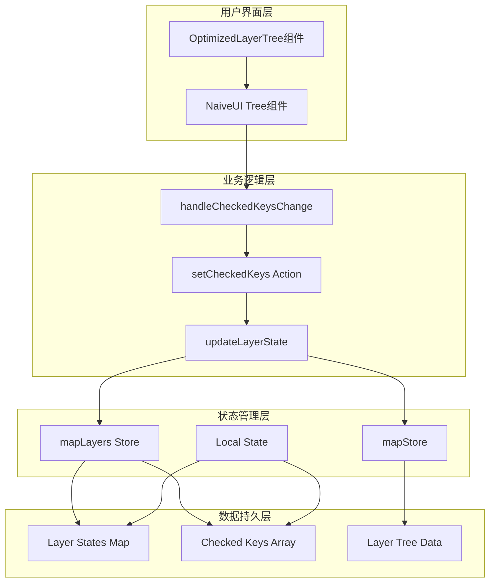
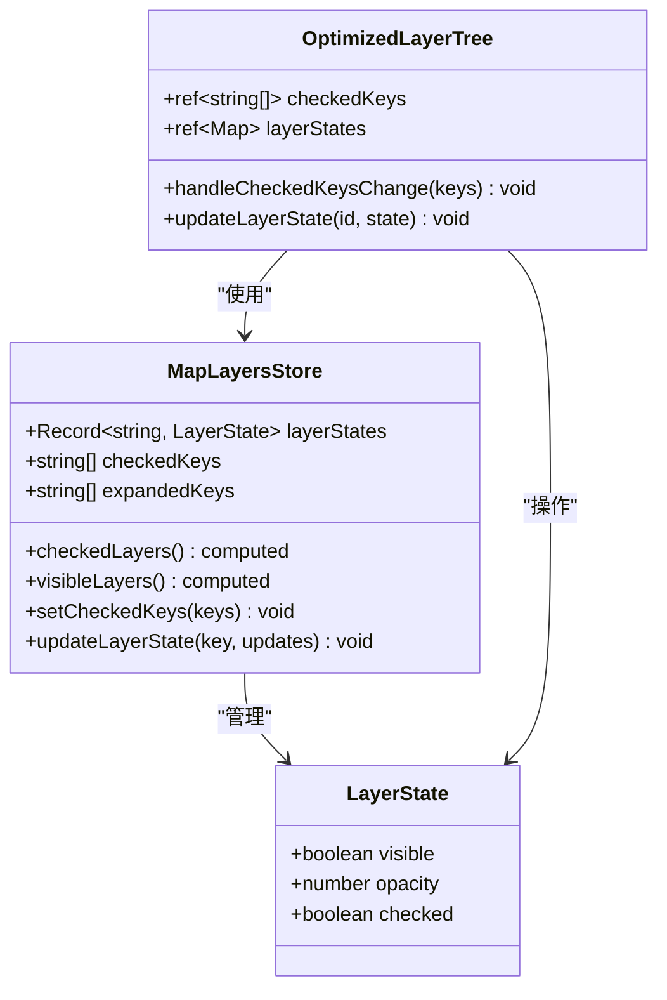
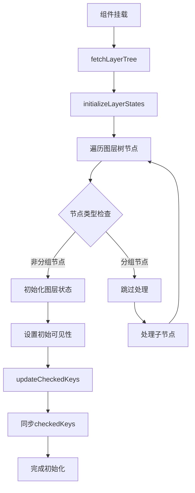
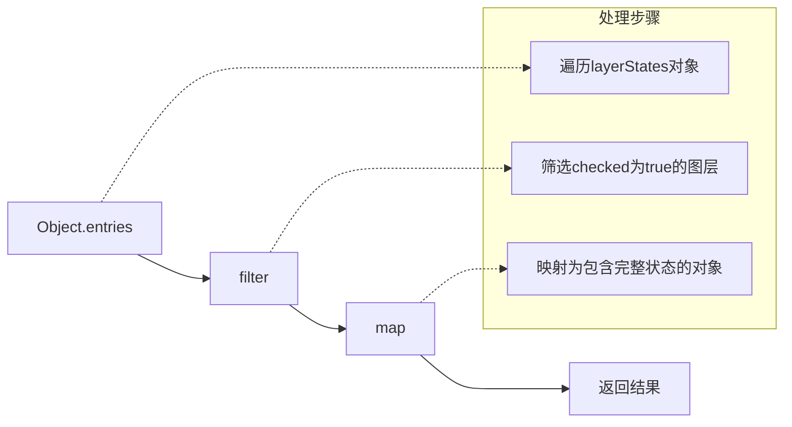
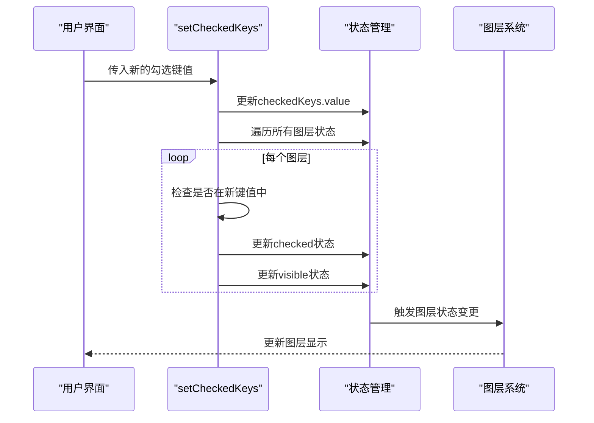
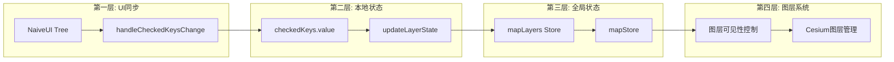
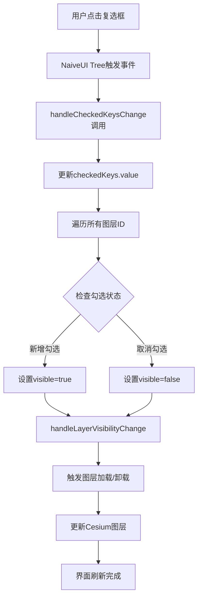
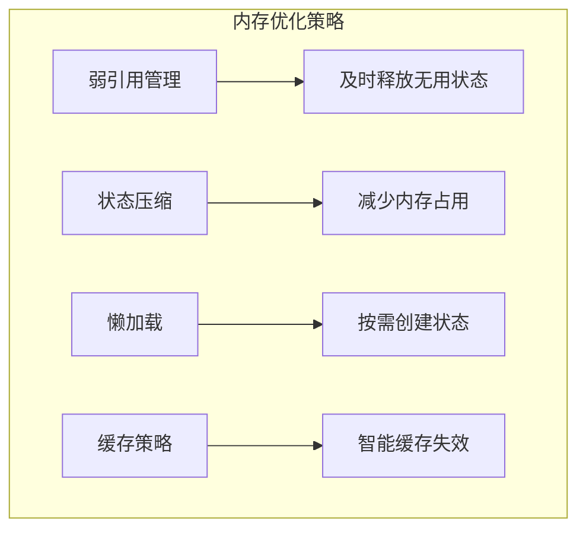

# 勾选状态管理

<cite>
**本文档中引用的文件**
- [OptimizedLayerTree.vue](file://src/mapComponents/OptimizedLayerTree.vue)
- [mapStore.ts](file://src/stores/mapStore.ts)
- [mapLayers.ts](file://src/stores/mapLayers.ts)
- [README_LAYER_TREE.md](file://src/mapComponents/README_LAYER_TREE.md)
</cite>

## 目录
1. [概述](#概述)
2. [系统架构](#系统架构)
3. [核心数据结构](#核心数据结构)
4. [checkedKeys状态管理](#checkedkeys状态管理)
5. [checkedLayers计算属性](#checkedlayers计算属性)
6. [setCheckedKeys Action方法](#setcheckedkeys-action方法)
7. [双向同步机制](#双向同步机制)
8. [用户交互流程](#用户交互流程)
9. [性能优化策略](#性能优化策略)
10. [故障排除指南](#故障排除指南)

## 概述

勾选状态管理系统是政府Dashboard项目中负责管理地图图层可见性的核心组件。该系统通过Vue响应式状态管理，实现了图层勾选状态的实时同步和双向绑定，确保用户界面与底层图层状态保持一致。

系统采用Pinia状态管理库，结合Vue的响应式系统，提供了高效的状态同步机制。主要功能包括：
- 图层勾选状态的实时管理
- 可见性与勾选状态的双向同步
- 计算属性驱动的状态查询
- 用户交互的即时反馈

## 系统架构



**图表来源**
- [OptimizedLayerTree.vue](file://src/mapComponents/OptimizedLayerTree.vue#L300-L323)
- [mapLayers.ts](file://src/stores/mapLayers.ts#L75-L84)

## 核心数据结构

### LayerState接口定义

系统使用以下数据结构来管理图层状态：

| 字段名 | 类型 | 描述 | 默认值 |
|--------|------|------|--------|
| visible | boolean | 图层可见性状态 | false |
| opacity | number | 图层透明度 (0-1) | 1.0 |
| checked | boolean | 图层勾选状态 | false |

### 状态存储结构



**图表来源**
- [mapLayers.ts](file://src/stores/mapLayers.ts#L5-L18)
- [OptimizedLayerTree.vue](file://src/mapComponents/OptimizedLayerTree.vue#L95-L111)

**章节来源**
- [mapLayers.ts](file://src/stores/mapLayers.ts#L5-L18)
- [OptimizedLayerTree.vue](file://src/mapComponents/OptimizedLayerTree.vue#L95-L111)

## checkedKeys状态管理

### checkedKeys的作用机制

`checkedKeys`是一个响应式数组，用于跟踪当前被勾选的图层ID集合。该状态在多个层面发挥重要作用：

1. **UI状态同步**: 直接绑定到NaiveUI Tree组件的`checked-keys`属性
2. **状态查询基础**: 作为计算属性的基础数据源
3. **批量操作入口**: 支持基于勾选状态的批量图层操作

### 状态初始化流程



**图表来源**
- [OptimizedLayerTree.vue](file://src/mapComponents/OptimizedLayerTree.vue#L116-L162)

### checkedKeys的生命周期管理

系统通过以下机制维护checkedKeys状态的完整性：

- **初始化阶段**: 从图层树数据中提取初始勾选状态
- **运行时更新**: 响应用户交互和程序化变更
- **状态同步**: 确保本地状态与全局状态的一致性

**章节来源**
- [OptimizedLayerTree.vue](file://src/mapComponents/OptimizedLayerTree.vue#L116-L162)
- [OptimizedLayerTree.vue](file://src/mapComponents/OptimizedLayerTree.vue#L300-L323)

## checkedLayers计算属性

### 实现逻辑详解

`checkedLayers`计算属性是系统的核心查询机制，通过函数式编程范式实现高效的图层状态过滤：



**图表来源**
- [mapLayers.ts](file://src/stores/mapLayers.ts#L33-L36)

### 算法复杂度分析

| 操作 | 时间复杂度 | 空间复杂度 | 说明 |
|------|------------|------------|------|
| Object.entries | O(n) | O(n) | 遍历所有图层状态 |
| filter | O(n) | O(k) | k为勾选图层数量 |
| map | O(k) | O(k) | 创建结果数组 |
| 总体 | O(n) | O(k) | n为总图层数，k为勾选数 |

### 使用场景示例

1. **批量操作**: 获取所有勾选图层进行统一处理
2. **状态查询**: 快速获取当前可见图层列表
3. **性能监控**: 统计勾选图层数量用于性能分析

**章节来源**
- [mapLayers.ts](file://src/stores/mapLayers.ts#L33-L36)

## setCheckedKeys Action方法

### 双向同步实现原理

`setCheckedKeys`方法是系统中最复杂的同步机制，实现了从UI状态到业务状态的双向映射：



**图表来源**
- [mapLayers.ts](file://src/stores/mapLayers.ts#L75-L84)

### 同步策略详解

#### 正向同步（UI → 状态）

1. **直接赋值**: 将UI提供的键值直接赋给`checkedKeys.value`
2. **状态映射**: 遍历所有图层，建立键值与状态的映射关系
3. **批量更新**: 一次性更新所有受影响的图层状态

#### 反向同步（状态 → UI）

1. **状态查询**: 通过`layerStates.value`获取当前状态
2. **条件判断**: 检查每个图层是否应该被勾选
3. **状态应用**: 将计算结果应用到对应图层

### 错误处理机制

系统实现了完善的错误处理策略：

- **边界检查**: 确保输入键值的有效性
- **状态验证**: 验证图层状态的完整性
- **回滚机制**: 在异常情况下恢复到稳定状态

**章节来源**
- [mapLayers.ts](file://src/stores/mapLayers.ts#L75-L84)

## 双向同步机制

### 状态同步架构

系统采用多层次的同步机制，确保状态一致性：



**图表来源**
- [OptimizedLayerTree.vue](file://src/mapComponents/OptimizedLayerTree.vue#L300-L323)
- [mapLayers.ts](file://src/stores/mapLayers.ts#L75-L84)

### 同步时机控制

#### 实时同步

- **用户交互**: 点击复选框时立即同步
- **批量操作**: 应用全选/取消全选时同步
- **程序化控制**: 通过API调用时同步

#### 延迟同步

- **性能优化**: 大量图层操作时批量处理
- **状态合并**: 连续操作时合并状态变更
- **内存管理**: 定期清理无用状态

### 冲突解决策略

当出现状态冲突时，系统采用以下优先级：

1. **用户操作优先**: 用户手动操作具有最高优先级
2. **程序化操作次之**: API调用的操作优先于自动操作
3. **自动操作最低**: 系统自动生成的状态变更优先级最低

**章节来源**
- [OptimizedLayerTree.vue](file://src/mapComponents/OptimizedLayerTree.vue#L300-L323)
- [mapLayers.ts](file://src/stores/mapLayers.ts#L75-L84)

## 用户交互流程

### 勾选状态变更流程



**图表来源**
- [OptimizedLayerTree.vue](file://src/mapComponents/OptimizedLayerTree.vue#L300-L323)

### 交互模式识别

系统支持多种交互模式：

#### 单图层操作
- **单选**: 点击单个图层的复选框
- **状态切换**: 切换图层的可见性状态

#### 批量操作
- **全选**: 选择所有可见图层
- **反选**: 取消当前所有勾选
- **分组操作**: 对整个分组进行批量操作

#### 智能操作
- **级联操作**: 影响子图层的可见性
- **依赖检测**: 检测图层间的依赖关系
- **状态预览**: 提供操作前的状态预览

### 性能优化措施

为了确保良好的用户体验，系统实现了多项性能优化：

1. **虚拟化渲染**: 大量图层时使用虚拟滚动
2. **防抖处理**: 避免频繁的状态更新
3. **增量更新**: 只更新发生变化的部分
4. **缓存机制**: 缓存计算结果避免重复计算

**章节来源**
- [OptimizedLayerTree.vue](file://src/mapComponents/OptimizedLayerTree.vue#L300-L323)

## 性能优化策略

### 状态管理优化

#### 响应式粒度控制

系统采用细粒度的响应式设计：

- **局部状态**: 图层特定的状态独立管理
- **全局状态**: 全局共享的状态集中管理
- **计算属性**: 延迟计算减少不必要的重计算

#### 内存使用优化



### 渲染性能优化

#### 虚拟化技术

对于大量图层，系统采用虚拟化技术：

- **视口渲染**: 只渲染可见区域的图层
- **动态加载**: 滚动时动态加载新图层
- **预加载机制**: 预先加载相邻图层

#### 重绘优化

- **批量更新**: 合并多个状态变更
- **异步处理**: 非关键操作异步执行
- **优先级调度**: 关键操作优先处理

### 网络性能优化

#### 数据传输优化

- **增量同步**: 只传输变更的数据
- **压缩算法**: 使用高效的序列化格式
- **缓存策略**: 智能缓存图层数据

**章节来源**
- [OptimizedLayerTree.vue](file://src/mapComponents/OptimizedLayerTree.vue#L300-L323)

## 故障排除指南

### 常见问题诊断

#### 勾选状态不同步

**症状**: 用户勾选图层后，界面显示与实际状态不一致

**可能原因**:
1. 状态更新延迟
2. 事件监听器缺失
3. 状态同步链断裂

**解决方案**:
1. 检查`handleCheckedKeysChange`函数的调用
2. 验证`updateLayerState`的执行路径
3. 确认状态同步链的完整性

#### 性能问题

**症状**: 大量图层时界面卡顿

**诊断步骤**:
1. 检查图层数量是否超过阈值
2. 分析状态更新频率
3. 监控内存使用情况

**优化建议**:
1. 启用虚拟化渲染
2. 减少不必要的状态更新
3. 实施状态缓存机制

#### 状态丢失

**症状**: 页面刷新后勾选状态重置

**排查方法**:
1. 检查状态持久化机制
2. 验证初始化流程
3. 确认数据源完整性

### 调试工具和技巧

#### 状态监控

系统提供了内置的状态监控功能：

- **状态快照**: 记录关键状态的时间点
- **变更追踪**: 跟踪状态变更的来源
- **性能指标**: 监控状态操作的性能

#### 日志记录

详细的日志记录帮助问题定位：

```typescript
// 示例：状态变更日志
console.log('状态变更:', {
  layerId: layerId,
  previousState: currentState,
  newState: newState,
  timestamp: Date.now()
});
```

### 最佳实践建议

#### 开发规范

1. **状态命名**: 使用语义化的状态名称
2. **类型安全**: 严格使用TypeScript类型定义
3. **错误处理**: 完善的错误处理机制
4. **文档维护**: 及时更新状态文档

#### 测试策略

- **单元测试**: 测试状态管理函数
- **集成测试**: 测试组件间的状态交互
- **性能测试**: 验证大规模数据的处理能力
- **兼容性测试**: 确保跨浏览器兼容性

**章节来源**
- [OptimizedLayerTree.vue](file://src/mapComponents/OptimizedLayerTree.vue#L300-L323)
- [mapLayers.ts](file://src/stores/mapLayers.ts#L75-L84)

## 结论

勾选状态管理系统是政府Dashboard项目中的核心功能模块，通过精心设计的状态管理和双向同步机制，实现了高效、可靠的图层状态控制。系统采用现代化的前端技术栈，结合Vue响应式系统和Pinia状态管理，提供了优秀的用户体验和良好的可维护性。

该系统的主要优势包括：

1. **高性能**: 通过虚拟化和优化算法确保大规模数据的流畅处理
2. **高可靠性**: 完善的错误处理和状态恢复机制
3. **高扩展性**: 模块化设计支持功能扩展和定制
4. **易维护性**: 清晰的代码结构和完善的文档

未来的发展方向包括进一步的性能优化、更丰富的交互功能以及更好的开发者体验。