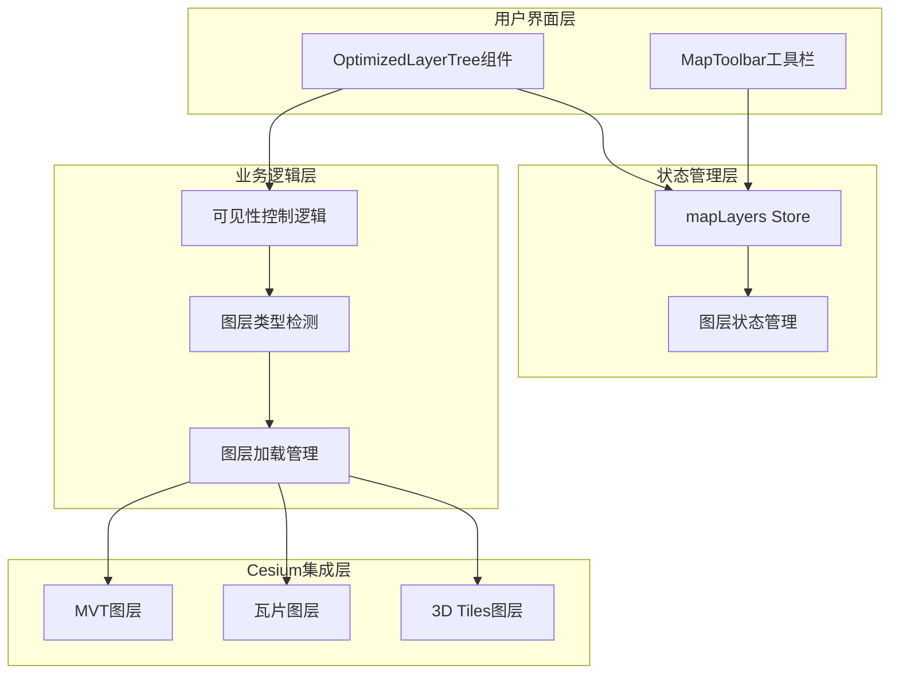
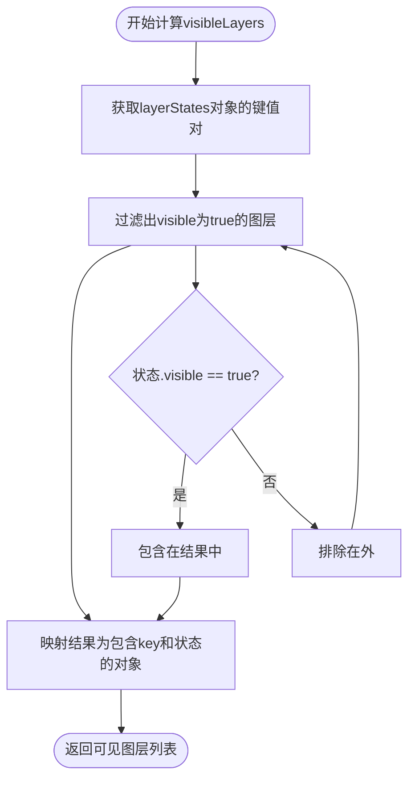
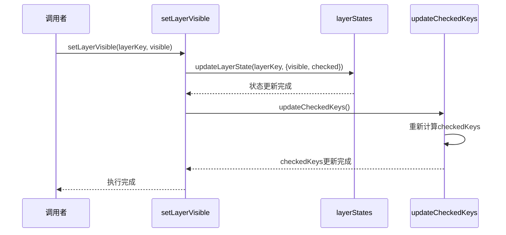
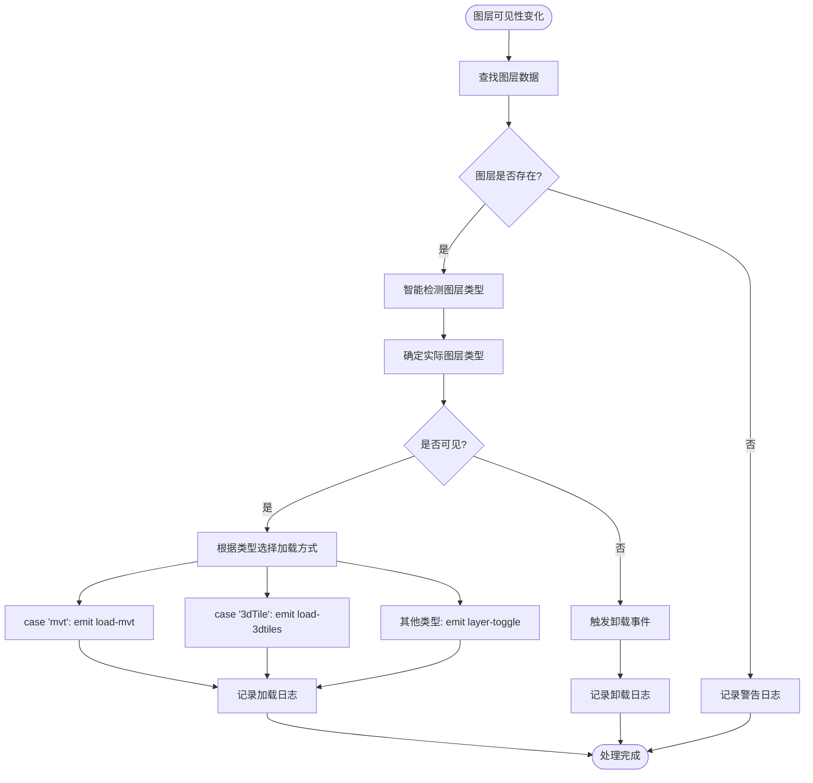
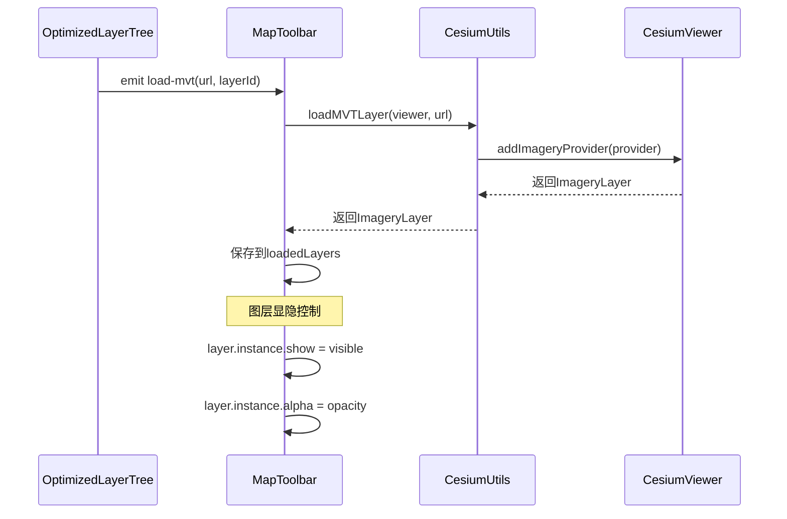
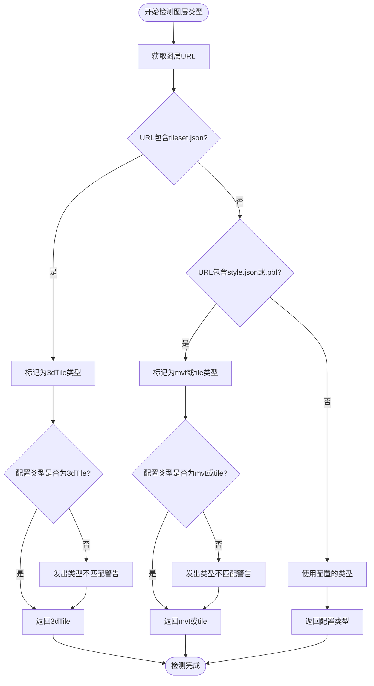
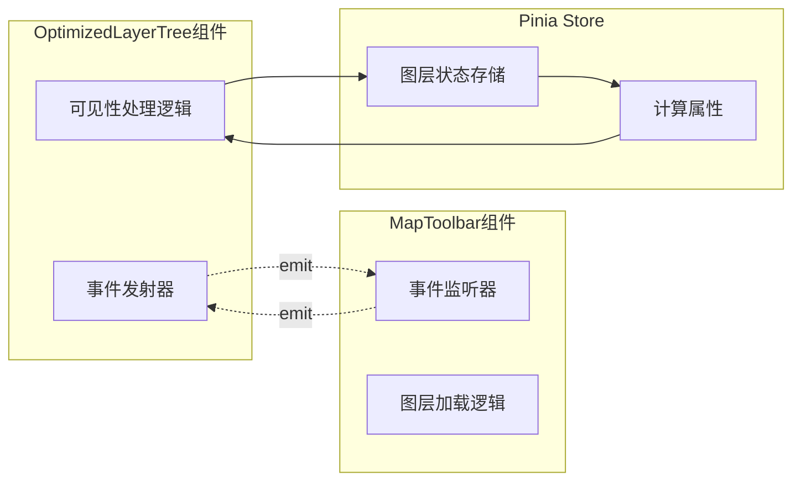
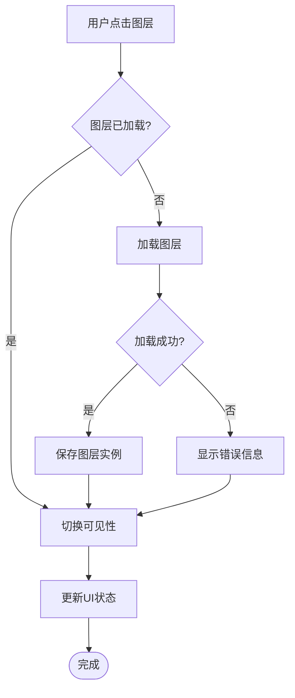

# 可见性控制

<cite>
**本文档中引用的文件**
- [mapLayers.ts](file://src/stores/mapLayers.ts)
- [OptimizedLayerTree.vue](file://src/mapComponents/OptimizedLayerTree.vue)
- [MapToolbar.vue](file://src/mapComponents/MapToolbar.vue)
- [README_LAYER_TREE.md](file://src/mapComponents/README_LAYER_TREE.md)
- [MAP_TOOLBAR_INTEGRATION.md](file://MAP_TOOLBAR_INTEGRATION.md)
</cite>

## 目录
1. [概述](#概述)
2. [系统架构](#系统架构)
3. [visibleLayers计算属性](#visiblelayers计算属性)
4. [setLayerVisible Action详解](#setlayervisible-action详解)
5. [图层可见性处理流程](#图层可见性处理流程)
6. [智能图层类型检测机制](#智能图层类型检测机制)
7. [组件间通信机制](#组件间通信机制)
8. [性能优化策略](#性能优化策略)
9. [故障排除指南](#故障排除指南)
10. [总结](#总结)

## 概述

可见性控制系统是政府Dashboard项目中地图图层管理的核心组件，负责统一管理各种类型图层的显示与隐藏状态。该系统采用Vue 3的组合式API和Pinia状态管理，实现了响应式的图层可见性控制，支持MVT矢量瓦片、3D Tiles三维模型等多种图层类型的智能加载和卸载。

系统的主要特点包括：
- **统一的状态管理**：通过Pinia store集中管理所有图层的可见性状态
- **智能类型检测**：自动识别图层类型并执行相应的加载逻辑
- **响应式更新**：实时同步图层状态变化到UI界面
- **错误处理机制**：完善的加载失败处理和用户友好的错误提示
- **性能优化**：按需加载和懒加载策略减少资源消耗

## 系统架构

**图表来源**
- [OptimizedLayerTree.vue](file://src/mapComponents/OptimizedLayerTree.vue#L1-L50)
- [mapLayers.ts](file://src/stores/mapLayers.ts#L1-L114)

## visibleLayers计算属性

`visibleLayers`是mapLayers store中的一个重要计算属性，负责过滤并返回当前可见的所有图层信息。

### 实现原理

**图表来源**
- [mapLayers.ts](file://src/stores/mapLayers.ts#L39-L44)

### 核心特性

1. **响应式计算**：基于Vue的computed特性，当layerStates发生变化时自动重新计算
2. **深度过滤**：仅返回visible属性为true的图层记录
3. **结构保持**：保留原始图层的完整状态信息（包括opacity、checked等属性）
4. **性能优化**：使用Object.entries()进行高效遍历

**章节来源**
- [mapLayers.ts](file://src/stores/mapLayers.ts#L39-L44)

## setLayerVisible Action详解

`setLayerVisible` action是可见性控制的核心入口，负责更新图层可见性状态并同步checked状态。

### 方法签名与参数

**图表来源**
- [mapLayers.ts](file://src/stores/mapLayers.ts#L56-L59)

### 执行流程

1. **状态更新**：调用`updateLayerState`同时更新visible和checked属性
2. **状态同步**：调用`updateCheckedKeys`重新计算checkedKeys数组
3. **响应式传播**：通过Pinia的响应式系统自动更新所有依赖组件

### 关键实现细节

- **原子性操作**：setLayerVisible是一个原子操作，确保状态一致性
- **双向绑定**：visible和checked属性保持同步，避免状态不一致
- **批量更新**：通过updateCheckedKeys一次性更新所有相关状态

**章节来源**
- [mapLayers.ts](file://src/stores/mapLayers.ts#L56-L59)

## 图层可见性处理流程

OptimizedLayerTree组件中的`handleLayerVisibilityChange`方法是图层可见性变化的核心处理器，负责根据图层类型执行相应的加载或卸载操作。

### 处理流程架构

**图表来源**
- [OptimizedLayerTree.vue](file://src/mapComponents/OptimizedLayerTree.vue#L356-L393)

### 图层类型处理策略

| 图层类型 | 处理方式 | 触发事件 | 特殊处理 |
|---------|---------|---------|---------|
| MVT | 发送load-mvt事件 | emit("load-mvt", url, layerId) | 返回ImageryLayer对象，支持show属性控制 |
| 3dTile | 发送load-3dtiles事件 | emit("load-3dtiles", url, layerId) | 返回Tileset对象，支持cesiumUtils控制 |
| tile/wms | 发送layer-toggle事件 | emit("layer-toggle", layerId, visible, layerData) | 通用图层处理 |
| 其他 | 记录警告 | console.warn | 未知类型处理 |

### MapToolbar中的响应处理

MapToolbar作为OptimizedLayerTree的集成组件，负责具体的图层加载和控制：

**图表来源**
- [MapToolbar.vue](file://src/mapComponents/MapToolbar.vue#L153-L265)

**章节来源**
- [OptimizedLayerTree.vue](file://src/mapComponents/OptimizedLayerTree.vue#L356-L393)
- [MapToolbar.vue](file://src/mapComponents/MapToolbar.vue#L153-L265)

## 智能图层类型检测机制

`detectLayerType`函数是系统的重要容错机制，能够在后端配置类型不准确的情况下，通过URL特征自动识别正确的图层类型。

### 检测算法流程

**图表来源**
- [OptimizedLayerTree.vue](file://src/mapComponents/OptimizedLayerTree.vue#L329-L351)

### 检测规则详解

1. **3D Tiles优先级最高**
   - URL包含`tileset.json` → 强制识别为3dTile类型
   - 无论配置类型为何，都发出类型不匹配警告

2. **MVT类型检测**
   - URL包含`style.json` → 识别为mvt类型
   - URL包含`.pbf` → 识别为tile类型
   - 配置类型必须为mvt或tile，否则发出警告

3. **默认行为**
   - 使用配置的type字段作为最终类型
   - 提供最大灵活性，允许手动覆盖自动检测结果

### 容错机制设计

- **类型警告系统**：当检测到类型不匹配时，记录详细的警告信息
- **URL特征优先**：基于URL的特征比配置更可靠
- **渐进式降级**：如果自动检测失败，回退到配置类型

**章节来源**
- [OptimizedLayerTree.vue](file://src/mapComponents/OptimizedLayerTree.vue#L329-L351)

## 组件间通信机制

可见性控制系统采用了事件驱动的组件间通信机制，确保各组件之间的松耦合和高内聚。

### 通信架构

**图表来源**
- [OptimizedLayerTree.vue](file://src/mapComponents/OptimizedLayerTree.vue#L1-L50)
- [MapToolbar.vue](file://src/mapComponents/MapToolbar.vue#L1-L50)

### 事件类型与处理

| 事件名称 | 参数 | 触发时机 | 处理组件 |
|---------|------|---------|---------|
| load-mvt | url, layerId | MVT图层可见性变为true | MapToolbar |
| load-3dtiles | url, layerId | 3D Tiles图层可见性变为true | MapToolbar |
| layer-toggle | layerId, visible, layerData | 通用图层显隐变化 | MapToolbar |
| layer-opacity-change | layerId, opacity | 图层透明度变化 | MapToolbar |

### 状态同步机制

1. **单向数据流**：OptimizedLayerTree作为状态变更的发起方
2. **事件驱动**：通过Vue的emit机制实现组件间通信
3. **异步处理**：图层加载采用异步模式，避免阻塞UI
4. **错误传播**：加载失败时通过事件向上层传播错误信息

**章节来源**
- [OptimizedLayerTree.vue](file://src/mapComponents/OptimizedLayerTree.vue#L376-L393)
- [MapToolbar.vue](file://src/mapComponents/MapToolbar.vue#L227-L265)

## 性能优化策略

可见性控制系统采用了多层次的性能优化策略，确保在大量图层场景下的流畅运行。

### 懒加载策略

**图表来源**
- [MapToolbar.vue](file://src/mapComponents/MapToolbar.vue#L247-L265)

### 优化技术详解

1. **按需加载**
   - 仅在图层可见时才加载对应的Cesium对象
   - 避免一次性加载所有图层造成内存压力

2. **实例缓存**
   - 将加载成功的图层实例保存在loadedLayers Map中
   - 重复显示时直接使用缓存实例，避免重复加载

3. **异步处理**
   - 图层加载采用Promise模式，避免阻塞主线程
   - 加载过程中的状态更新采用非阻塞方式

4. **内存管理**
   - 图层不可见时及时释放相关资源
   - 使用WeakMap避免内存泄漏

### 性能监控指标

- **加载时间**：记录各类图层的平均加载时间
- **内存占用**：监控图层实例的内存使用情况
- **响应延迟**：测量用户操作到界面更新的时间
- **错误率**：统计图层加载失败的比例

**章节来源**
- [MapToolbar.vue](file://src/mapComponents/MapToolbar.vue#L153-L265)

## 故障排除指南

### 常见问题与解决方案

#### 1. 图层加载失败

**症状**：图层可见性切换后无效果，控制台出现错误信息

**可能原因**：
- MVT样式文件不存在（404错误）
- 3D Tiles文件格式不正确
- 网络连接问题

**解决步骤**：
1. 检查图层URL是否正确
2. 验证样式文件格式（version、sources、layers字段）
3. 确认网络连接正常
4. 查看浏览器开发者工具的网络面板

#### 2. 类型检测错误

**症状**：图层类型显示为"未知"，无法正确加载

**可能原因**：
- URL格式不符合预期
- 配置的type字段错误
- 后端返回数据异常

**解决步骤**：
1. 检查图层URL的特征字符串
2. 验证配置的type字段准确性
3. 查看控制台的类型检测警告信息

#### 3. 状态不同步

**症状**：UI显示的图层状态与实际不符

**可能原因**：
- Pinia store状态更新失败
- 事件通信中断
- 组件生命周期问题

**解决步骤**：
1. 检查Pinia store的devtools
2. 验证事件监听器是否正常工作
3. 确认组件的mounted和unmounted生命周期

### 调试技巧

1. **启用详细日志**：在开发环境中开启console.log输出
2. **使用Vue DevTools**：监控组件状态和事件
3. **检查网络请求**：确认图层数据能够正确加载
4. **验证类型检测**：测试detectLayerType函数的返回值

**章节来源**
- [OptimizedLayerTree.vue](file://src/mapComponents/OptimizedLayerTree.vue#L329-L351)
- [MapToolbar.vue](file://src/mapComponents/MapToolbar.vue#L162-L183)

## 总结

可见性控制系统是政府Dashboard项目中地图功能的核心基础设施，通过精心设计的架构实现了高效的图层管理。系统的主要优势包括：

### 技术亮点

1. **模块化设计**：清晰的职责分离，便于维护和扩展
2. **智能容错**：完善的类型检测和错误处理机制
3. **性能优化**：懒加载和缓存策略确保良好的用户体验
4. **响应式架构**：基于Vue 3和Pinia的现代前端技术栈

### 应用价值

- **提升用户体验**：直观的图层控制界面和流畅的操作响应
- **降低开发成本**：标准化的图层管理接口和可复用的组件
- **增强系统稳定性**：完善的错误处理和状态同步机制
- **支持复杂场景**：灵活的多类型图层支持和扩展能力

### 未来发展方向

1. **性能进一步优化**：考虑Web Workers进行后台处理
2. **更多图层类型支持**：扩展对新图层格式的支持
3. **智能预加载**：基于用户行为预测的图层预加载
4. **云端图层管理**：支持远程图层配置和动态更新

通过这套完整的可见性控制系统，开发者可以轻松构建复杂的地图应用，同时确保系统的稳定性和可维护性。