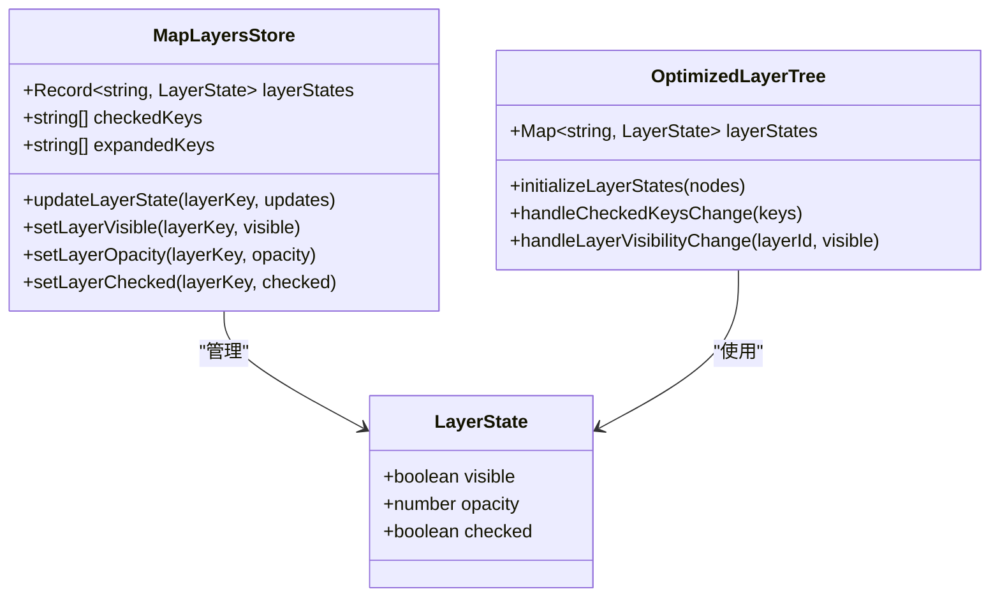
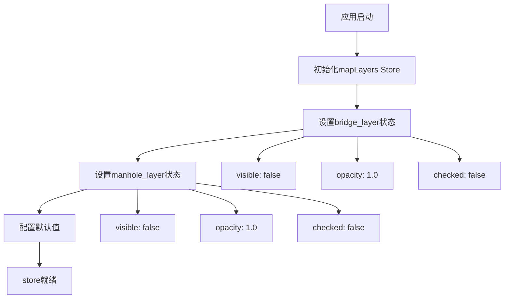
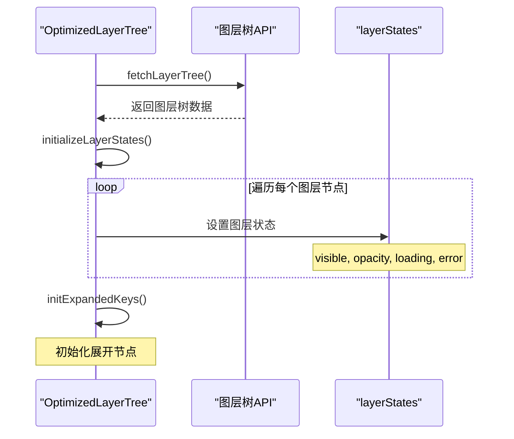
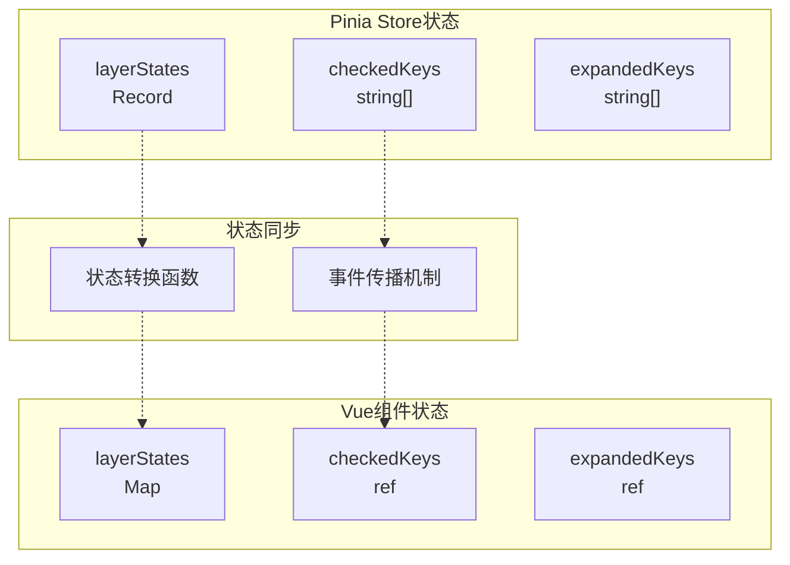
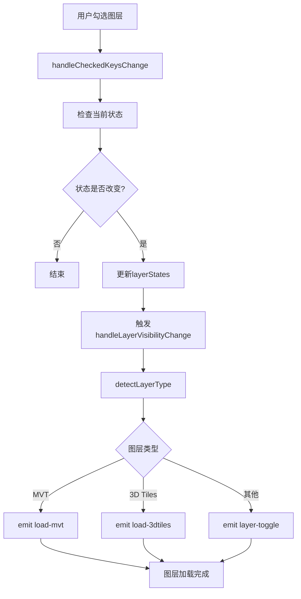
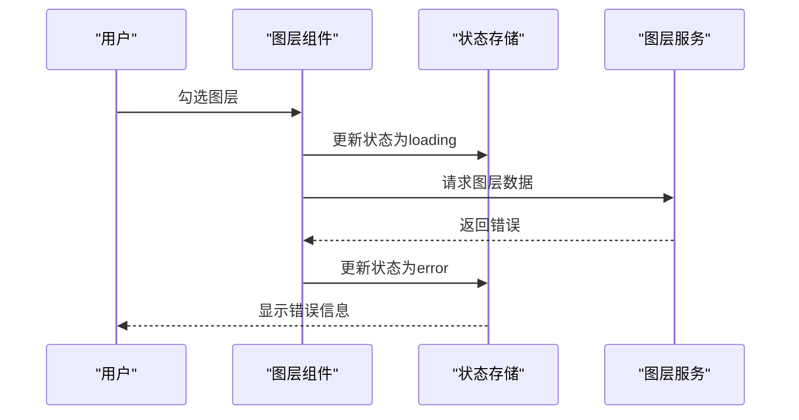

# 图层状态定义

<cite>
**本文档中引用的文件**
- [src/stores/mapLayers.ts](file://src/stores/mapLayers.ts)
- [src/mapComponents/OptimizedLayerTree.vue](file://src/mapComponents/OptimizedLayerTree.vue)
- [src/stores/mapStore.ts](file://src/stores/mapStore.ts)
- [src/config/mapConfig.ts](file://src/config/mapConfig.ts)
- [src/types/index.ts](file://src/types/index.ts)
</cite>

## 目录
1. [简介](#简介)
2. [LayerState接口结构](#layerstate接口结构)
3. [图层状态对象初始化](#图层状态对象初始化)
4. [状态字段详解](#状态字段详解)
5. [状态管理架构](#状态管理架构)
6. [实际应用场景](#实际应用场景)
7. [性能优化考虑](#性能优化考虑)
8. [总结](#总结)

## 简介

在政府dashboard项目中，图层状态管理是一个核心功能模块，负责控制地图上各种地理要素的显示状态、透明度和用户交互行为。本文档详细解析LayerState接口的结构设计、状态对象的初始化过程以及其在地图渲染中的重要作用。

## LayerState接口结构

### 接口定义

LayerState接口是图层状态管理的核心数据结构，定义了图层的基本状态属性：

**图表来源**
- [src/stores/mapLayers.ts](file://src/stores/mapLayers.ts#L5-L9)
- [src/mapComponents/OptimizedLayerTree.vue](file://src/mapComponents/OptimizedLayerTree.vue#L101-L111)

### 类型定义对比

系统中存在两种主要的LayerState类型定义：

| 文件 | 定义位置 | 字段数量 | 特殊字段 |
|------|----------|----------|----------|
| mapLayers.ts | Pinia Store | 3个 | checked |
| OptimizedLayerTree.vue | Vue组件 | 4个 | loading, error |

**节来源**
- [src/stores/mapLayers.ts](file://src/stores/mapLayers.ts#L5-L9)
- [src/mapComponents/OptimizedLayerTree.vue](file://src/mapComponents/OptimizedLayerTree.vue#L101-L111)

## 图层状态对象初始化

### 初始状态设置

系统在不同模块中对图层状态进行了预设初始化：

#### Pinia Store中的初始状态

**图表来源**
- [src/stores/mapLayers.ts](file://src/stores/mapLayers.ts#L13-L23)

#### 动态初始化过程

OptimizedLayerTree组件通过递归遍历图层树结构来初始化状态：

**图表来源**
- [src/mapComponents/OptimizedLayerTree.vue](file://src/mapComponents/OptimizedLayerTree.vue#L145-L162)

**节来源**
- [src/stores/mapLayers.ts](file://src/stores/mapLayers.ts#L13-L23)
- [src/mapComponents/OptimizedLayerTree.vue](file://src/mapComponents/OptimizedLayerTree.vue#L145-L162)

## 状态字段详解

### visible字段

**数据类型**: `boolean`

**业务含义**: 控制图层的可见性状态

**默认值**: `false`（所有图层默认隐藏）

**使用场景**:
- 用户通过图层树界面勾选图层
- 系统初始化时的默认状态
- 动态显示/隐藏特定地理要素

**影响范围**:
- 决定图层是否在地图上渲染
- 影响用户界面的图层列表显示
- 控制图层加载和卸载逻辑

### opacity字段

**数据类型**: `number`

**业务含义**: 控制图层的透明度，取值范围0-1

**默认值**: `1.0`（完全不透明）

**使用场景**:
- 用户调整图层透明度
- 多图层叠加显示时的视觉平衡
- 特定场景下的视觉效果优化

**技术实现**:
- 与Cesium图层系统的opacity属性直接映射
- 支持实时动态调整
- 影响渲染性能（高透明度可能增加GPU负担）

### checked字段

**数据类型**: `boolean`

**业务含义**: 控制图层在图层树中的选中状态

**默认值**: `false`（默认未选中）

**特殊关系**:
- checked状态直接影响visible状态
- 两个状态同步更新以保持一致性

**节来源**
- [src/stores/mapLayers.ts](file://src/stores/mapLayers.ts#L6-L8)
- [src/mapComponents/OptimizedLayerTree.vue](file://src/mapComponents/OptimizedLayerTree.vue#L149-L153)

## 状态管理架构

### 双重状态管理模式

系统采用双重状态管理模式，分别服务于不同的使用场景：

**图表来源**
- [src/stores/mapLayers.ts](file://src/stores/mapLayers.ts#L12-L30)
- [src/mapComponents/OptimizedLayerTree.vue](file://src/mapComponents/OptimizedLayerTree.vue#L96-L111)

### 状态计算属性

系统提供了多个计算属性来简化状态访问：

| 计算属性 | 返回类型 | 用途 |
|----------|----------|------|
| checkedLayers | `{key, visible, opacity, checked}[]` | 获取所有选中的图层 |
| visibleLayers | `{key, visible, opacity, checked}[]` | 获取所有可见的图层 |
| activeCustomLayers | `Layer[]` | 获取所有激活的自定义图层 |

**节来源**
- [src/stores/mapLayers.ts](file://src/stores/mapLayers.ts#L32-L44)

## 实际应用场景

### 图层加载流程

当用户勾选图层时，系统执行以下流程：

**图表来源**
- [src/mapComponents/OptimizedLayerTree.vue](file://src/mapComponents/OptimizedLayerTree.vue#L302-L322)

### 错误处理机制

系统具备完善的错误处理能力：

**图表来源**
- [src/mapComponents/MapToolbar.vue](file://src/mapComponents/MapToolbar.vue#L194-L223)

**节来源**
- [src/mapComponents/OptimizedLayerTree.vue](file://src/mapComponents/OptimizedLayerTree.vue#L302-L322)
- [src/mapComponents/MapToolbar.vue](file://src/mapComponents/MapToolbar.vue#L194-L223)

## 性能优化考虑

### 状态更新策略

1. **批量更新**: 使用`Partial<LayerState>`允许部分字段更新
2. **响应式优化**: Vue的响应式系统自动追踪状态变化
3. **内存管理**: 及时清理不需要的图层实例

### 渲染优化

1. **懒加载**: 图层仅在需要时才加载
2. **透明度缓存**: 避免频繁的CSS属性更新
3. **状态同步**: 减少不必要的DOM重新渲染

### 存储优化

1. **选择性存储**: 仅存储必要的状态信息
2. **类型安全**: TypeScript确保类型正确性
3. **默认值**: 合理的默认值减少存储开销

## 总结

LayerState接口的设计体现了现代前端应用的状态管理最佳实践：

1. **简洁性**: 三个核心字段覆盖了图层管理的主要需求
2. **一致性**: 在不同模块间保持状态定义的一致性
3. **扩展性**: 支持未来功能的灵活扩展
4. **性能**: 优化的状态更新和渲染机制
5. **用户体验**: 直观的状态管理和反馈机制

这种设计使得政府dashboard项目能够高效地管理复杂的地理信息系统，为用户提供流畅的地图交互体验。通过合理的状态分离和同步机制，系统能够在保证功能完整性的同时维持良好的性能表现。