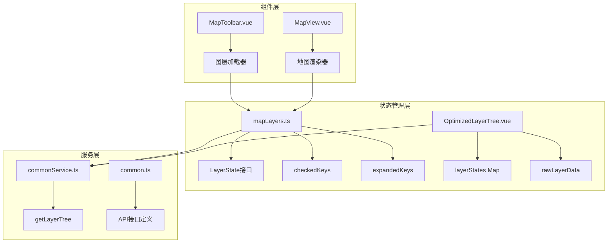
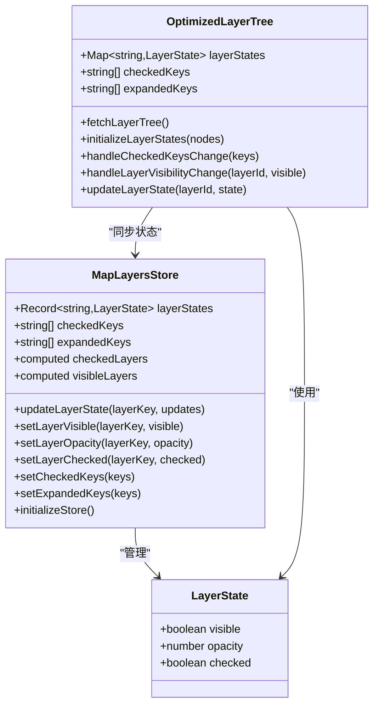
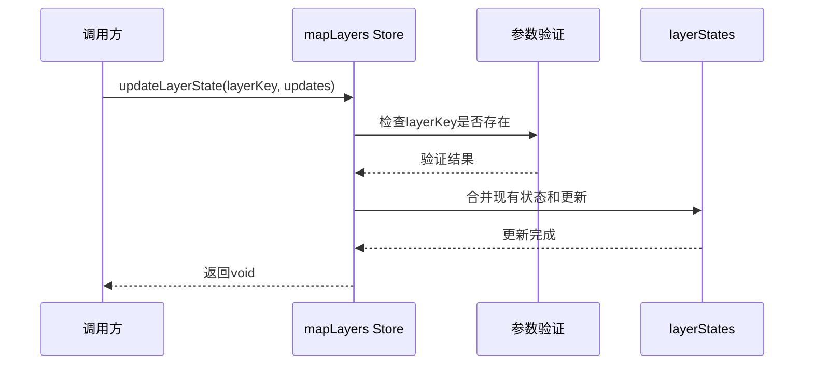
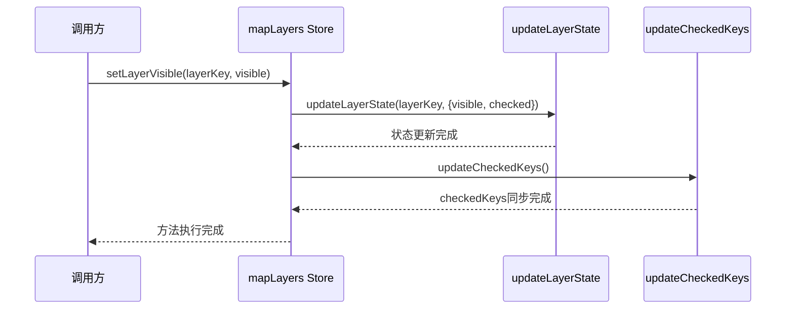
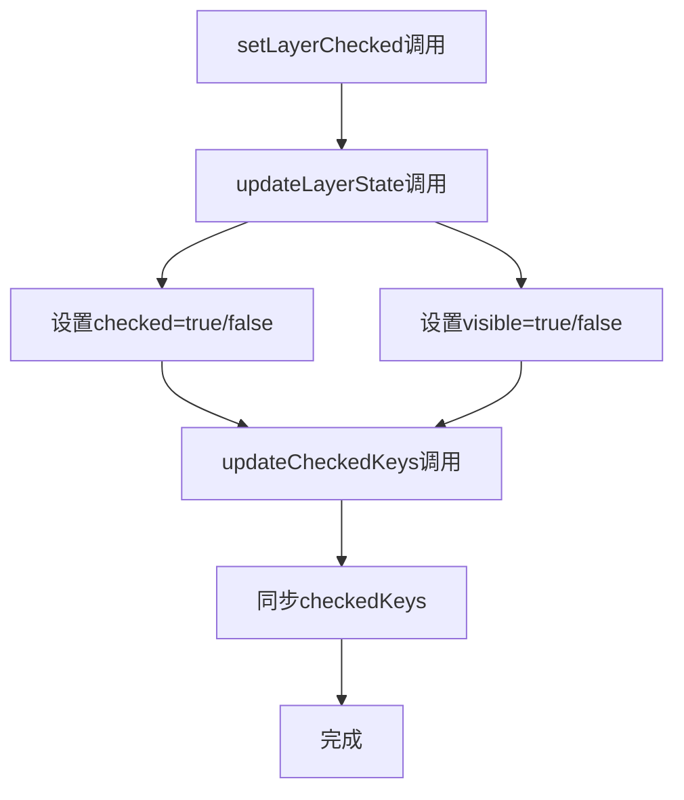
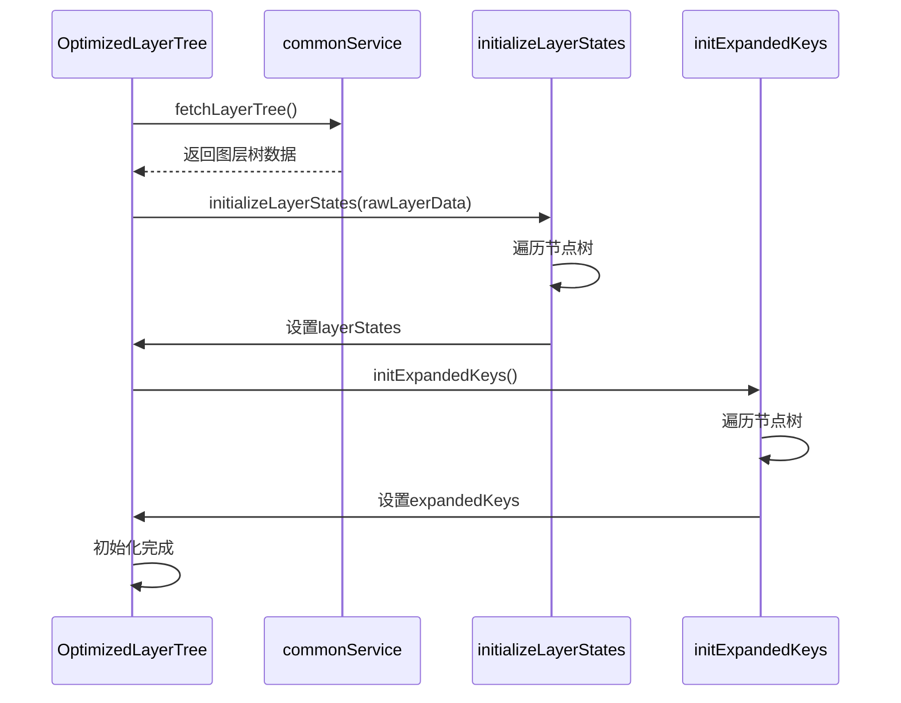
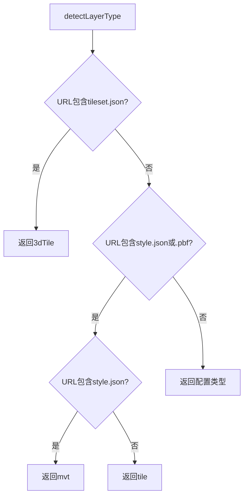
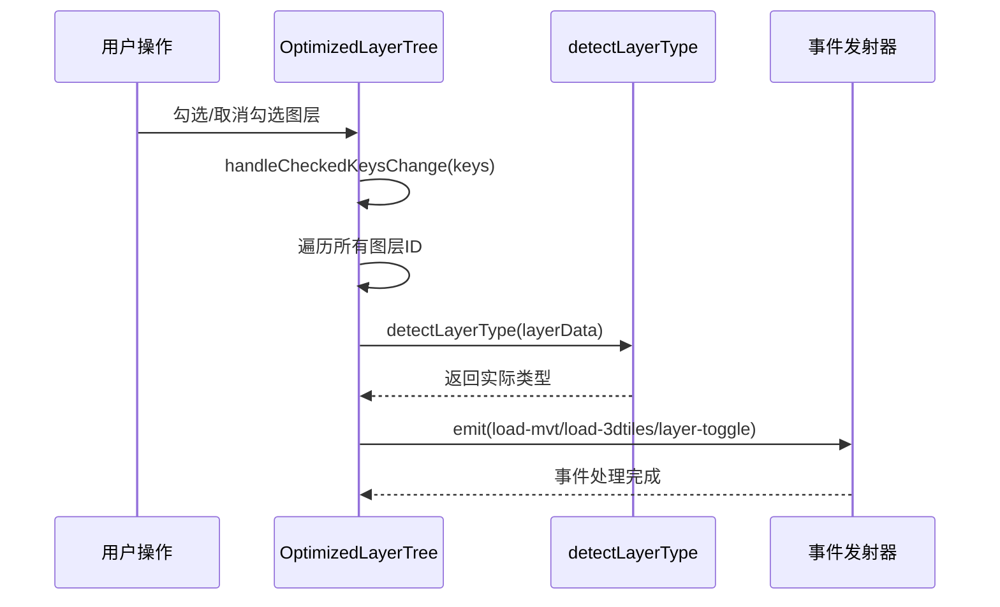
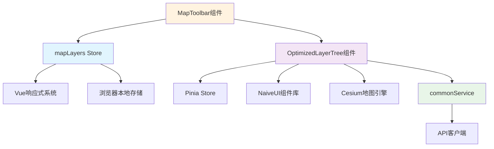

# 图层状态管理

<cite>
**本文档中引用的文件**
- [mapLayers.ts](file://src/stores/mapLayers.ts)
- [OptimizedLayerTree.vue](file://src/mapComponents/OptimizedLayerTree.vue)
- [common.ts](file://src/api/common.ts)
- [commonService.ts](file://src/services/commonService.ts)
- [mapStore.ts](file://src/stores/mapStore.ts)
- [README_LAYER_TREE.md](file://src/mapComponents/README_LAYER_TREE.md)
</cite>

## 目录
1. [概述](#概述)
2. [项目结构](#项目结构)
3. [核心组件](#核心组件)
4. [架构概览](#架构概览)
5. [详细组件分析](#详细组件分析)
6. [依赖关系分析](#依赖关系分析)
7. [性能考虑](#性能考虑)
8. [故障排除指南](#故障排除指南)
9. [结论](#结论)

## 概述

图层状态管理系统是政府Dashboard项目中的核心功能模块，负责管理地图图层的状态、可见性、透明度以及用户交互。该系统采用Pinia状态管理库，结合Vue 3的响应式系统，实现了高效的图层状态同步和视图更新机制。

系统主要包含两个核心状态管理模块：
- **mapLayers store**：管理基础图层状态的核心store
- **OptimizedLayerTree组件**：提供图层树界面和高级状态管理功能

## 项目结构



**图表来源**
- [mapLayers.ts](file://src/stores/mapLayers.ts#L1-L114)
- [OptimizedLayerTree.vue](file://src/mapComponents/OptimizedLayerTree.vue#L1-L200)
- [commonService.ts](file://src/services/commonService.ts#L87-L91)

**章节来源**
- [mapLayers.ts](file://src/stores/mapLayers.ts#L1-L114)
- [OptimizedLayerTree.vue](file://src/mapComponents/OptimizedLayerTree.vue#L1-L200)

## 核心组件

### LayerState接口定义

LayerState接口是图层状态管理的核心数据结构，定义了每个图层的基本状态属性：

| 字段名 | 类型 | 默认值 | 描述 |
|--------|------|--------|------|
| visible | boolean | false | 图层可见性状态 |
| opacity | number | 1.0 | 图层透明度（0-1） |
| checked | boolean | false | 图层在树中的选中状态 |

### 三大核心状态

#### 1. layerStates（图层状态记录）
- **数据类型**：`Record<string, LayerState>`
- **存储结构**：以图层ID为键，LayerState对象为值的对象记录
- **初始状态**：包含bridge_layer和manhole_layer两个预设图层
- **用途**：存储每个图层的完整状态信息，支持动态扩展

#### 2. checkedKeys（勾选图层键集合）
- **数据类型**：`string[]`
- **存储内容**：所有被勾选的图层ID数组
- **更新机制**：通过updateCheckedKeys方法自动同步
- **用途**：维护当前选中的图层集合，用于树形控件的双向绑定

#### 3. expandedKeys（展开节点键集合）
- **数据类型**：`string[]`
- **存储内容**：所有展开状态的节点ID数组
- **初始值**：包含'gas_special'和'bridge_special'两个特殊节点
- **用途**：控制图层树的展开/折叠状态

**章节来源**
- [mapLayers.ts](file://src/stores/mapLayers.ts#L5-L31)

## 架构概览



**图表来源**
- [mapLayers.ts](file://src/stores/mapLayers.ts#L5-L114)
- [OptimizedLayerTree.vue](file://src/mapComponents/OptimizedLayerTree.vue#L101-L111)

## 详细组件分析

### mapLayers Store详细分析

#### 计算属性实现

##### checkedLayers计算属性
```mermaid
flowchart TD
A[开始计算] --> B[遍历layerStates]
B --> C{state.checked?}
C --> |是| D[添加到结果]
C --> |否| E[跳过]
D --> F[返回[{key, ...state}]]
E --> F
F --> G[结束]
```

**图表来源**
- [mapLayers.ts](file://src/stores/mapLayers.ts#L33-L37)

##### visibleLayers计算属性
```mermaid
flowchart TD
A[开始计算] --> B[遍历layerStates]
B --> C{state.visible?}
C --> |是| D[添加到结果]
C --> |否| E[跳过]
D --> F[返回[{key, ...state}]]
E --> F
F --> G[结束]
```

**图表来源**
- [mapLayers.ts](file://src/stores/mapLayers.ts#L40-L44)

#### Action方法详解

##### updateLayerState方法
该方法是状态更新的核心入口，支持部分更新：



**图表来源**
- [mapLayers.ts](file://src/stores/mapLayers.ts#L47-L54)

##### setLayerVisible方法
该方法同时更新可见性和勾选状态，并同步更新checkedKeys：



**图表来源**
- [mapLayers.ts](file://src/stores/mapLayers.ts#L56-L59)

##### setLayerChecked方法
该方法确保勾选状态与可见性保持一致：



**图表来源**
- [mapLayers.ts](file://src/stores/mapLayers.ts#L65-L68)

**章节来源**
- [mapLayers.ts](file://src/stores/mapLayers.ts#L47-L114)

### OptimizedLayerTree组件分析

#### 状态初始化流程



**图表来源**
- [OptimizedLayerTree.vue](file://src/mapComponents/OptimizedLayerTree.vue#L126-L131)

#### 图层类型智能检测

组件实现了智能的图层类型检测机制，能够根据URL特征自动识别图层类型：



**图表来源**
- [OptimizedLayerTree.vue](file://src/mapComponents/OptimizedLayerTree.vue#L329-L351)

#### 图层可见性变化处理



**图表来源**
- [OptimizedLayerTree.vue](file://src/mapComponents/OptimizedLayerTree.vue#L302-L323)

**章节来源**
- [OptimizedLayerTree.vue](file://src/mapComponents/OptimizedLayerTree.vue#L126-L446)

## 依赖关系分析

### 状态管理依赖图



**图表来源**
- [mapLayers.ts](file://src/stores/mapLayers.ts#L1-L3)
- [OptimizedLayerTree.vue](file://src/mapComponents/OptimizedLayerTree.vue#L71-L76)

### 数据流分析

系统的数据流向遵循单向数据流原则：

1. **初始化阶段**：API → Store → Component
2. **用户交互**：Component → Store → View
3. **状态同步**：Store ↔ Component

**章节来源**
- [mapLayers.ts](file://src/stores/mapLayers.ts#L90-L114)
- [OptimizedLayerTree.vue](file://src/mapComponents/OptimizedLayerTree.vue#L436-L446)

## 性能考虑

### 状态更新优化

1. **批量更新**：使用updateLayerState进行原子性状态更新
2. **计算属性缓存**：checkedLayers和visibleLayers利用Vue的计算属性缓存机制
3. **懒加载**：图层仅在需要时才进行加载和渲染

### 内存管理

1. **Map vs Object**：OptimizedLayerTree使用Map数据结构提高查找效率
2. **及时清理**：不再使用的图层状态会被自动清理
3. **事件解绑**：组件销毁时自动清理事件监听器

## 故障排除指南

### 常见问题及解决方案

#### 1. 图层状态不同步
**症状**：图层树显示与实际状态不一致
**原因**：checkedKeys未正确同步
**解决**：调用updateCheckedKeys()方法重新同步

#### 2. 图层加载失败
**症状**：图层无法正常显示
**原因**：图层类型检测错误或URL无效
**解决**：检查图层配置和网络连接

#### 3. 性能问题
**症状**：大量图层导致界面卡顿
**解决**：启用图层懒加载和虚拟滚动

**章节来源**
- [OptimizedLayerTree.vue](file://src/mapComponents/OptimizedLayerTree.vue#L353-L394)

## 结论

图层状态管理系统通过精心设计的架构，实现了高效、可扩展的地图图层状态管理。系统的主要优势包括：

1. **模块化设计**：清晰分离基础状态管理和高级功能
2. **响应式更新**：基于Vue 3的响应式系统，确保状态变更的即时反映
3. **类型安全**：完整的TypeScript类型定义，减少运行时错误
4. **性能优化**：智能的懒加载和状态缓存机制
5. **易于扩展**：插件化的架构设计支持新功能的快速集成

该系统为政府Dashboard项目提供了稳定可靠的地图图层管理能力，支撑了复杂的城市治理应用场景。