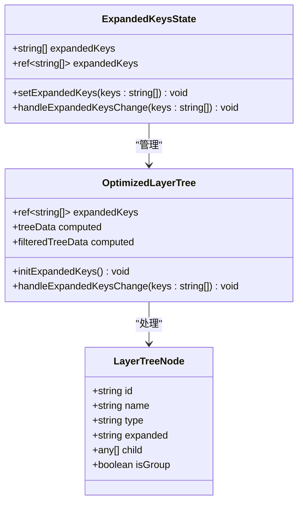
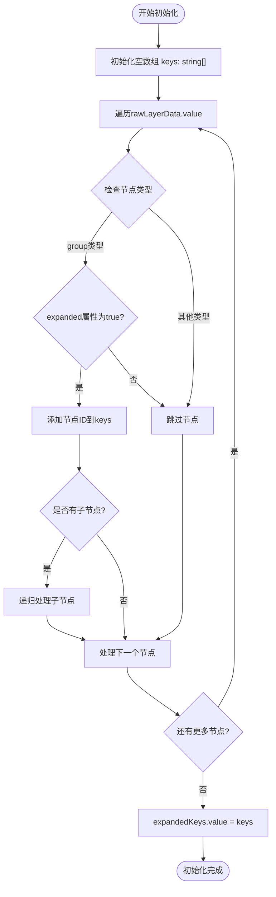
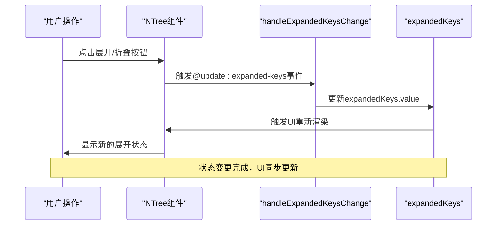
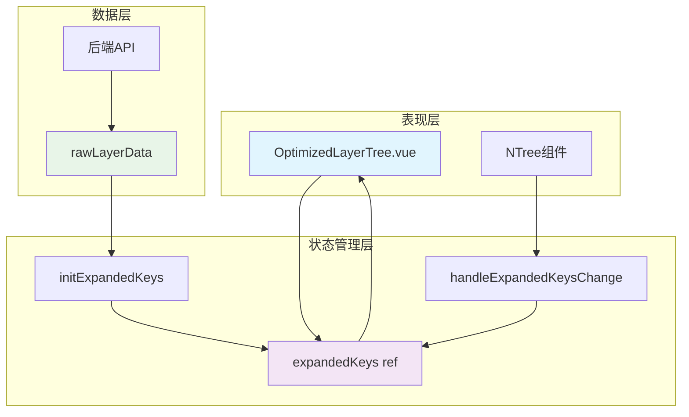

# 展开状态管理

<cite>
**本文档中引用的文件**
- [OptimizedLayerTree.vue](file://src/mapComponents/OptimizedLayerTree.vue)
- [mapStore.ts](file://src/stores/mapStore.ts)
- [mapLayers.ts](file://src/stores/mapLayers.ts)
- [commonService.ts](file://src/services/commonService.ts)
- [README_LAYER_TREE.md](file://src/mapComponents/README_LAYER_TREE.md)
</cite>

## 目录
1. [概述](#概述)
2. [expandedKeys状态结构](#expandedkeys状态结构)
3. [状态初始化机制](#状态初始化机制)
4. [状态更新流程](#状态更新流程)
5. [架构设计分析](#架构设计分析)
6. [性能优化考虑](#性能优化考虑)
7. [故障排除指南](#故障排除指南)
8. [总结](#总结)

## 概述

展开状态管理是政府Dashboard系统中图层树组件的核心功能之一，负责维护用户界面中图层分组节点的展开/折叠状态。该系统采用Vue响应式状态管理，结合Pinia状态库，实现了高效的状态同步和用户体验优化。

展开状态管理主要涉及两个核心概念：
- **expandedKeys**: 存储当前展开的节点ID数组
- **initExpandedKeys**: 初始化函数，根据后端配置确定默认展开节点

## expandedKeys状态结构

### 状态定义

expandedKeys是一个字符串数组，存储当前展开的图层分组节点的唯一标识符：

**图表来源**
- [OptimizedLayerTree.vue](file://src/mapComponents/OptimizedLayerTree.vue#L94-L95)
- [mapStore.ts](file://src/stores/mapStore.ts#L42)

### 状态特性

expandedKeys具有以下关键特性：

1. **响应式更新**: 使用Vue的ref创建响应式状态
2. **类型安全**: 明确的字符串数组类型定义
3. **实时同步**: 与UI组件状态保持实时同步
4. **持久化潜力**: 可以扩展为支持本地存储

**章节来源**
- [OptimizedLayerTree.vue](file://src/mapComponents/OptimizedLayerTree.vue#L94-L95)

## 状态初始化机制

### initExpandedKeys函数实现

initExpandedKeys函数负责根据后端配置的expanded属性初始化默认展开节点：

**图表来源**
- [OptimizedLayerTree.vue](file://src/mapComponents/OptimizedLayerTree.vue#L167-L184)

### 初始化逻辑详解

初始化过程遵循深度优先遍历算法：

1. **遍历根节点**: 从rawLayerData.value开始遍历
2. **节点类型检查**: 只处理type为"group"的节点
3. **展开条件验证**: 检查expanded属性是否为"true"或true
4. **递归处理**: 对每个符合条件的节点递归处理其子节点
5. **状态赋值**: 最终将收集到的节点ID数组赋值给expandedKeys

**章节来源**
- [OptimizedLayerTree.vue](file://src/mapComponents/OptimizedLayerTree.vue#L167-L184)

## 状态更新流程

### handleExpandedKeysChange方法

handleExpandedKeysChange方法处理用户交互导致的展开状态变化：

**图表来源**
- [OptimizedLayerTree.vue](file://src/mapComponents/OptimizedLayerTree.vue#L295-L296)

### 状态同步机制

状态更新遵循单向数据流原则：

1. **事件捕获**: 通过@update:expanded-keys监听用户操作
2. **状态更新**: 直接修改expandedKeys.value
3. **自动重绘**: Vue响应式系统自动触发相关组件重绘
4. **状态持久化**: 可扩展支持本地存储或服务器同步

**章节来源**
- [OptimizedLayerTree.vue](file://src/mapComponents/OptimizedLayerTree.vue#L295-L296)

## 架构设计分析

### 状态管理模式

系统采用分层状态管理模式：

**图表来源**
- [OptimizedLayerTree.vue](file://src/mapComponents/OptimizedLayerTree.vue#L70-L95)
- [mapStore.ts](file://src/stores/mapStore.ts#L39-L45)

### 组件间通信

展开状态管理涉及多个组件间的协调：

1. **OptimizedLayerTree**: 主要状态管理者
2. **NTree**: UI渲染组件
3. **MapStore**: 全局状态管理
4. **CommonService**: 数据获取服务

**章节来源**
- [OptimizedLayerTree.vue](file://src/mapComponents/OptimizedLayerTree.vue#L74-L98)

## 性能优化考虑

### 渲染性能优化

1. **懒加载**: 只在需要时加载子节点数据
2. **虚拟滚动**: 大型树结构使用虚拟滚动技术
3. **防抖处理**: 用户快速操作时的防抖机制
4. **内存管理**: 及时清理不需要的状态数据

### 状态同步优化

1. **批量更新**: 合并多个状态变更操作
2. **差异检测**: 只更新发生变化的部分
3. **缓存策略**: 缓存计算结果避免重复计算

## 故障排除指南

### 常见问题及解决方案

| 问题类型 | 症状描述 | 可能原因 | 解决方案 |
|---------|---------|---------|---------|
| 展开状态丢失 | 页面刷新后展开状态重置 | 缺少状态持久化 | 实现localStorage或服务器同步 |
| 初始化失败 | 默认展开节点不生效 | 后端数据格式错误 | 检查expanded属性值类型 |
| 性能问题 | 大量节点时渲染缓慢 | 递归处理效率低 | 实现虚拟化或分页加载 |
| 状态不一致 | UI与实际状态不同步 | 事件监听器缺失 | 检查@update:expanded-keys绑定 |

### 调试技巧

1. **状态监控**: 使用Vue DevTools监控expandedKeys变化
2. **日志记录**: 在关键函数添加console.log调试
3. **单元测试**: 为initExpandedKeys编写单元测试
4. **边界测试**: 测试极端情况如空数据、大量节点

**章节来源**
- [OptimizedLayerTree.vue](file://src/mapComponents/OptimizedLayerTree.vue#L116-L139)

## 总结

展开状态管理系统是政府Dashboard项目中一个精心设计的功能模块，它体现了现代前端开发的最佳实践：

1. **清晰的职责分离**: 状态管理、UI渲染、数据获取各司其职
2. **高效的性能优化**: 响应式更新配合合理的数据结构设计
3. **良好的可扩展性**: 支持状态持久化和多组件协作
4. **完善的错误处理**: 完整的异常捕获和用户反馈机制

该系统不仅满足了当前的功能需求，还为未来的功能扩展奠定了坚实的基础。通过合理的架构设计和性能优化，确保了在大规模数据场景下的稳定运行。