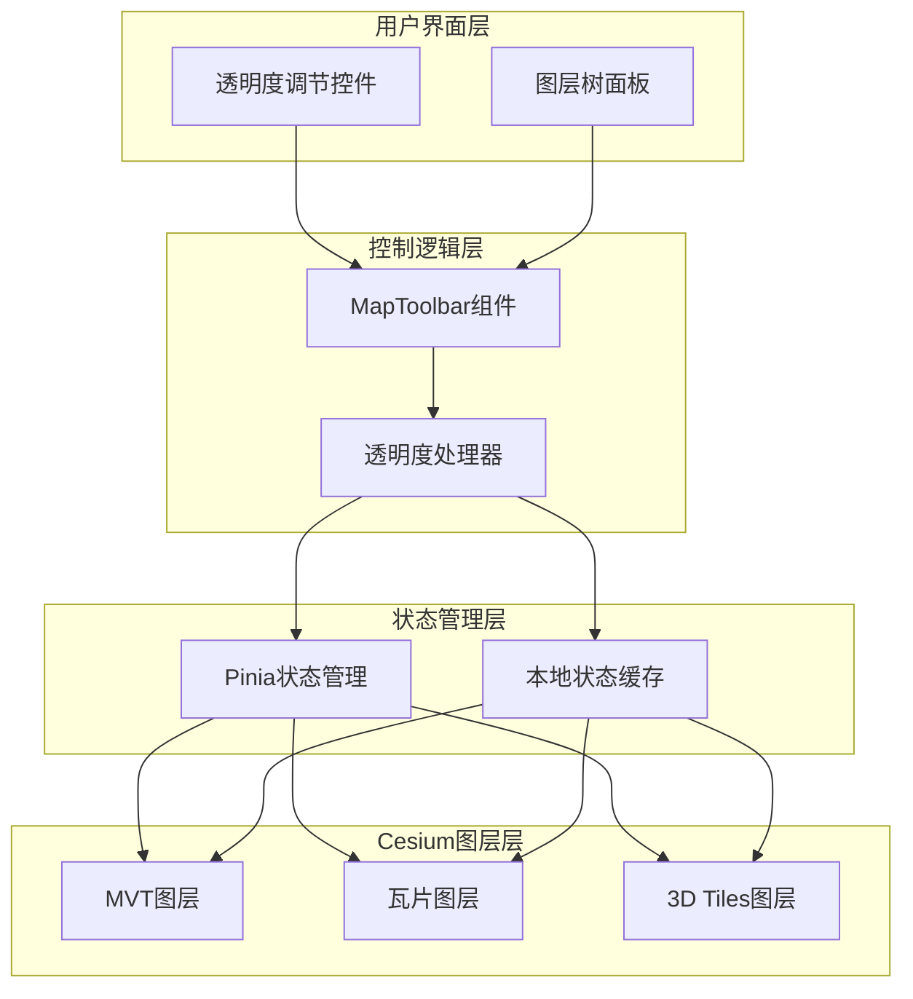
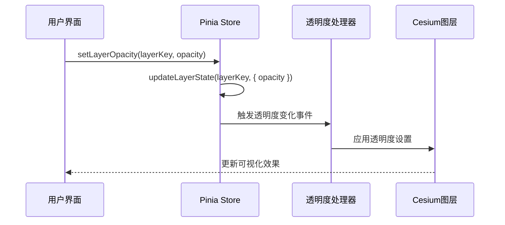
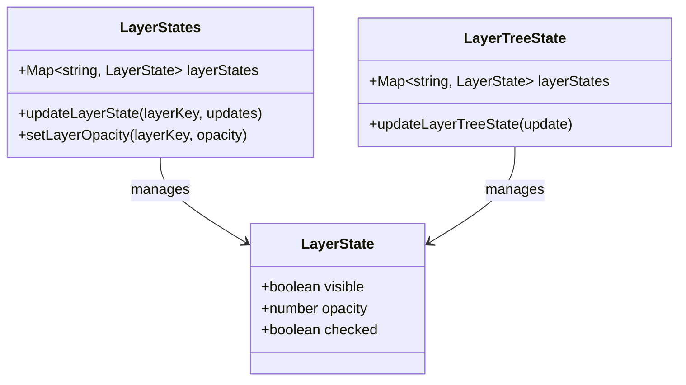
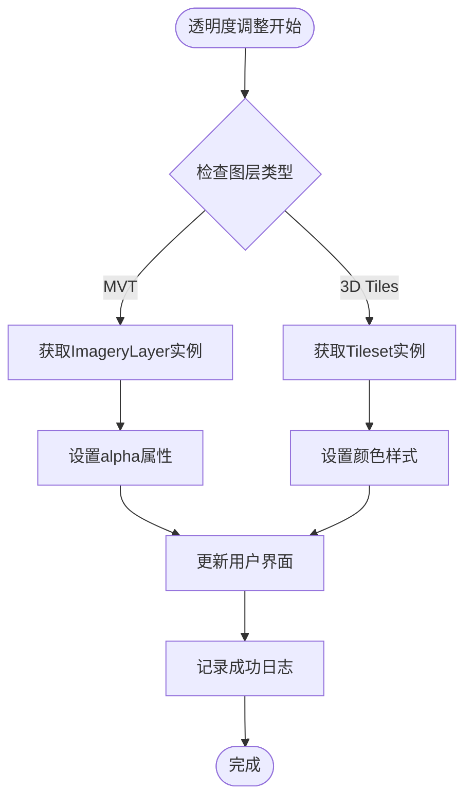
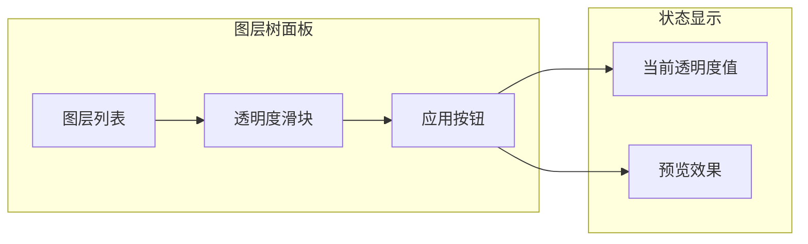

# 透明度管理

<cite>
**本文档中引用的文件**
- [mapLayers.ts](file://src/stores/mapLayers.ts)
- [OptimizedLayerTree.vue](file://src/mapComponents/OptimizedLayerTree.vue)
- [MapToolbar.vue](file://src/mapComponents/MapToolbar.vue)
- [useMapHooks.ts](file://src/hook/useMapHooks.ts)
- [mapStore.ts](file://src/stores/mapStore.ts)
- [README_LAYER_TREE.md](file://src/mapComponents/README_LAYER_TREE.md)
- [MAP_TOOLBAR_INTEGRATION.md](file://MAP_TOOLBAR_INTEGRATION.md)
</cite>

## 目录
1. [概述](#概述)
2. [系统架构](#系统架构)
3. [核心组件分析](#核心组件分析)
4. [透明度状态管理](#透明度状态管理)
5. [透明度控制流程](#透明度控制流程)
6. [用户界面设计](#用户界面设计)
7. [性能考虑](#性能考虑)
8. [故障排除](#故障排除)
9. [最佳实践](#最佳实践)

## 概述

透明度管理系统是政府Dashboard地图应用中的核心功能模块，负责控制地图上各种图层的透明度表现。该系统通过统一的状态管理机制，支持MVT矢量瓦片图层和3D Tiles三维模型的透明度调节，并提供直观的用户界面供用户进行透明度控制。

系统采用分层架构设计，包含状态管理层、控制逻辑层和用户界面层，确保透明度控制的精确性和用户体验的流畅性。

## 系统架构

**图表来源**
- [MapToolbar.vue](file://src/mapComponents/MapToolbar.vue#L268-L285)
- [OptimizedLayerTree.vue](file://src/mapComponents/OptimizedLayerTree.vue#L416-L433)

## 核心组件分析

### setLayerOpacity Action方法

`setLayerOpacity` 方法是透明度管理的核心入口，位于 `mapLayers.ts` 状态管理模块中。

**图表来源**
- [mapLayers.ts](file://src/stores/mapLayers.ts#L60-L62)
- [MapToolbar.vue](file://src/mapComponents/MapToolbar.vue#L268-L285)

**章节来源**
- [mapLayers.ts](file://src/stores/mapLayers.ts#L60-L62)
- [OptimizedLayerTree.vue](file://src/mapComponents/OptimizedLayerTree.vue#L416-L433)

### updateLayerState 方法

`updateLayerState` 方法负责更新图层状态，支持多种状态字段的批量更新。

**章节来源**
- [OptimizedLayerTree.vue](file://src/mapComponents/OptimizedLayerTree.vue#L416-L433)
- [mapStore.ts](file://src/stores/mapStore.ts#L246-L262)

## 透明度状态管理

### 状态结构定义

透明度状态在多个层次中进行管理，确保数据的一致性和持久化。

**图表来源**
- [mapLayers.ts](file://src/stores/mapLayers.ts#L5-L9)
- [mapStore.ts](file://src/stores/mapStore.ts#L246-L262)

### 持久化存储机制

透明度状态通过以下机制实现持久化存储：

1. **Pinia Store持久化**：核心透明度状态存储在 `mapLayers.ts` 中
2. **本地缓存同步**：图层树状态同步到 `layerTreeState` 中
3. **实时状态更新**：每次透明度变化都会触发状态同步

**章节来源**
- [mapLayers.ts](file://src/stores/mapLayers.ts#L11-L30)
- [mapStore.ts](file://src/stores/mapStore.ts#L246-L262)

## 透明度控制流程

### MVT图层透明度控制

对于MVT矢量瓦片图层，透明度控制通过Cesium的 `ImageryLayer.alpha` 属性实现：

**图表来源**
- [MapToolbar.vue](file://src/mapComponents/MapToolbar.vue#L280-L283)
- [useMapHooks.ts](file://src/hook/useMapHooks.ts#L154-L162)

### 3D Tiles图层透明度控制

3D Tiles图层通过Cesium3DTileStyle的颜色表达式实现透明度控制：

**章节来源**
- [MapToolbar.vue](file://src/mapComponents/MapToolbar.vue#L275-L279)
- [useMapHooks.ts](file://src/hook/useMapHooks.ts#L164-L180)

## 用户界面设计

### 透明度调节控件

透明度调节控件集成在图层树面板中，提供直观的滑块控件：

**图表来源**
- [OptimizedLayerTree.vue](file://src/mapComponents/OptimizedLayerTree.vue#L416-L433)

### 用户交互流程

1. **选择目标图层**：用户在图层树中选择需要调整透明度的图层
2. **拖拽透明度滑块**：通过滑块直观调整透明度数值
3. **实时预览效果**：透明度变化实时反映在地图可视化中
4. **确认应用**：透明度设置立即生效并更新状态

**章节来源**
- [OptimizedLayerTree.vue](file://src/mapComponents/OptimizedLayerTree.vue#L416-L433)

## 性能考虑

### 透明度更新优化

系统采用多种优化策略确保透明度控制的性能：

1. **防抖处理**：透明度滑块的实时更新采用防抖机制
2. **增量更新**：只更新发生变化的图层状态
3. **批量操作**：支持批量透明度设置操作
4. **内存管理**：及时清理不再使用的图层实例

### 渲染性能优化

- **GPU加速**：利用WebGL硬件加速进行透明度渲染
- **纹理缓存**：缓存透明度处理后的纹理数据
- **LOD控制**：根据透明度级别调整渲染细节

## 故障排除

### 常见问题及解决方案

| 问题类型 | 症状描述 | 解决方案 |
|---------|---------|---------|
| 透明度不生效 | 调整透明度后地图无变化 | 检查图层类型是否支持透明度控制 |
| 性能下降 | 透明度调整时界面卡顿 | 减少同时调整的图层数量 |
| 状态不同步 | 透明度设置后状态显示异常 | 重新初始化图层状态 |
| 格式错误 | 透明度值超出范围 | 确保透明度值在0.0-1.0范围内 |

### 调试技巧

1. **控制台日志**：启用详细的透明度操作日志
2. **状态检查**：验证图层状态是否正确更新
3. **网络监控**：检查图层加载状态
4. **性能分析**：使用浏览器开发者工具分析性能瓶颈

**章节来源**
- [MapToolbar.vue](file://src/mapComponents/MapToolbar.vue#L153-L183)
- [MAP_TOOLBAR_INTEGRATION.md](file://MAP_TOOLBAR_INTEGRATION.md#L175-L221)

## 最佳实践

### 开发建议

1. **状态一致性**：确保所有图层类型的透明度状态保持一致
2. **错误处理**：完善透明度控制的错误处理机制
3. **用户体验**：提供清晰的透明度数值显示和视觉反馈
4. **性能监控**：定期监控透明度控制的性能表现

### 部署注意事项

1. **兼容性测试**：在不同浏览器和设备上测试透明度功能
2. **资源优化**：优化透明度相关资源的加载和缓存
3. **监控告警**：建立透明度功能的监控和告警机制
4. **文档维护**：及时更新透明度管理的相关文档

### 扩展建议

1. **动画效果**：添加透明度变化的平滑过渡动画
2. **批量操作**：支持多图层同时调整透明度
3. **预设方案**：提供常用的透明度预设方案
4. **导出功能**：支持透明度设置的导出和导入

**章节来源**
- [README_LAYER_TREE.md](file://src/mapComponents/README_LAYER_TREE.md#L220-L252)