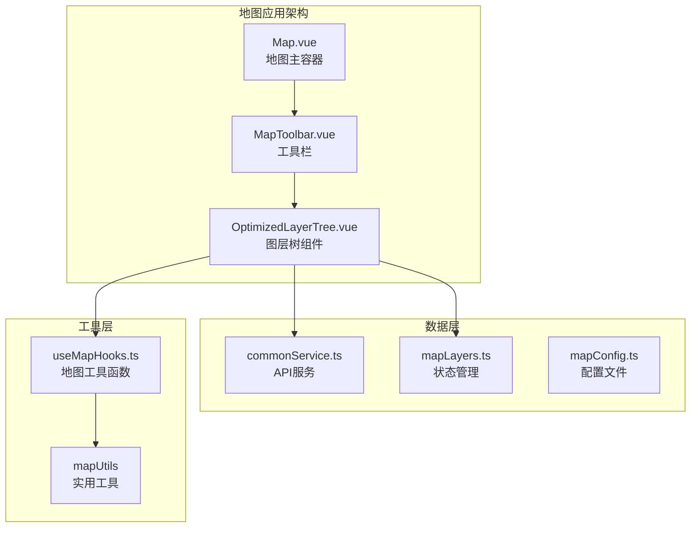
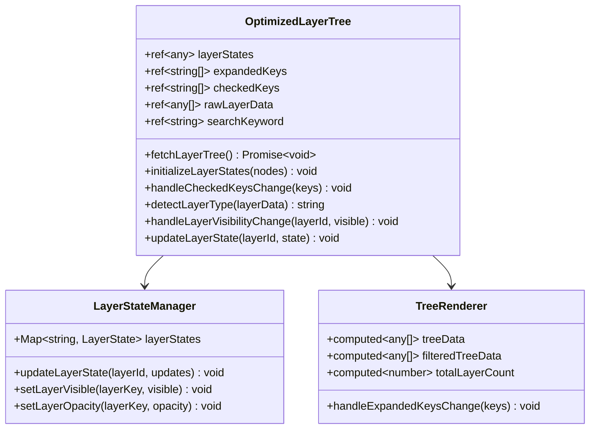
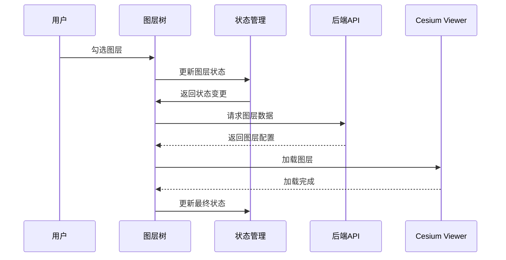
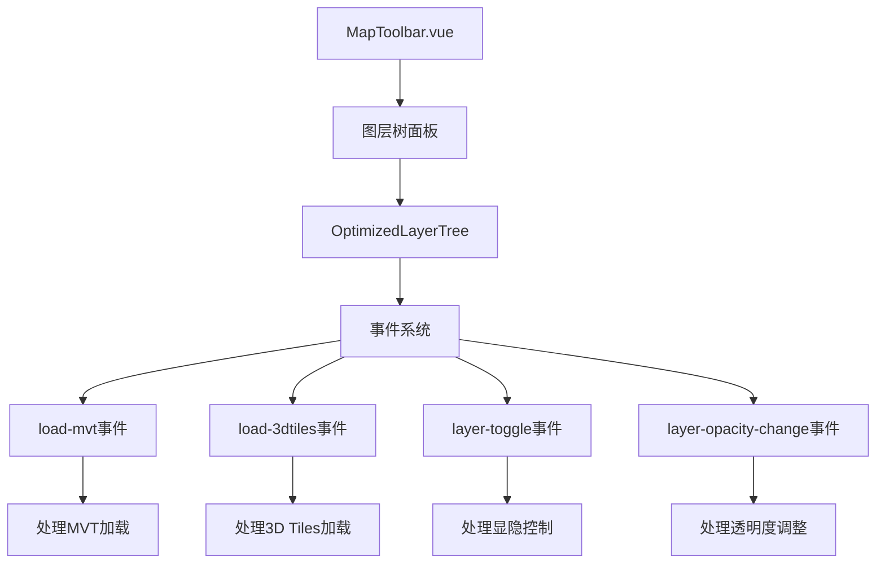
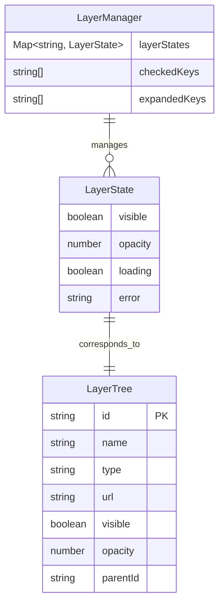
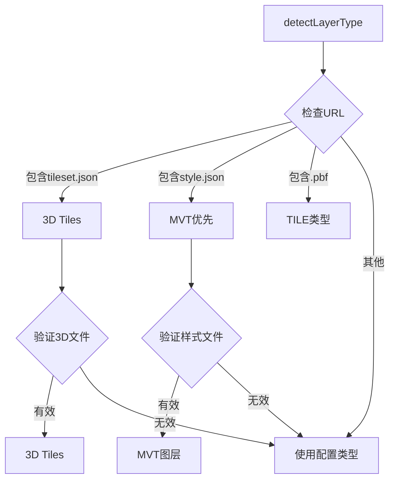
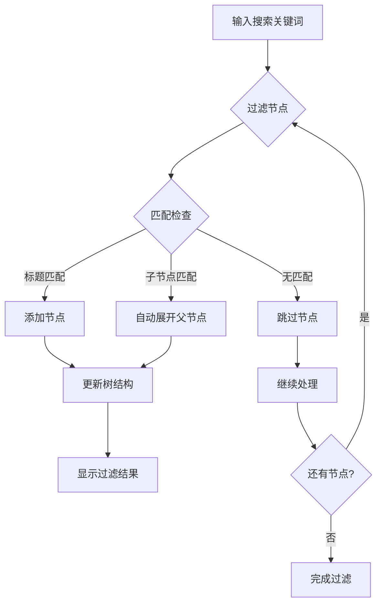
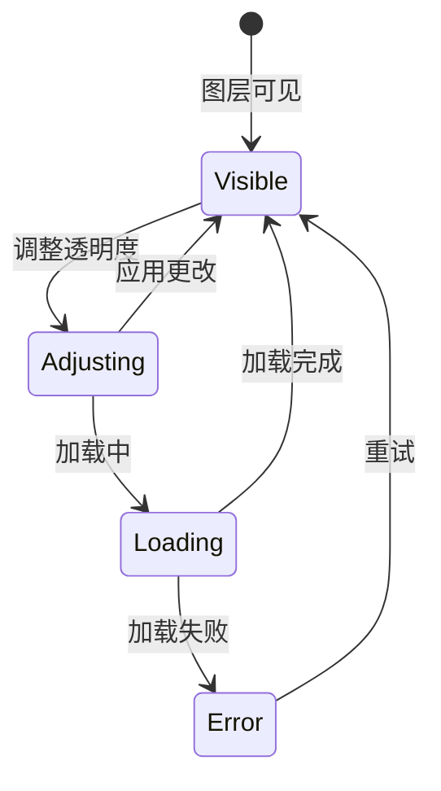
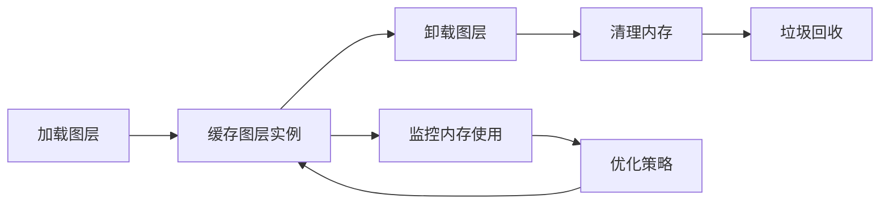

# 图层管理

<cite>
**本文档中引用的文件**
- [OptimizedLayerTree.vue](file://src/mapComponents/OptimizedLayerTree.vue)
- [MapToolbar.vue](file://src/mapComponents/MapToolbar.vue)
- [mapLayers.ts](file://src/stores/mapLayers.ts)
- [mapConfig.ts](file://src/config/mapConfig.ts)
- [useMapHooks.ts](file://src/hook/useMapHooks.ts)
- [commonService.ts](file://src/services/commonService.ts)
- [README_LAYER_TREE.md](file://src/mapComponents/README_LAYER_TREE.md)
- [LAYER_TREE_QUICK_START.md](file://LAYER_TREE_QUICK_START.md)
- [MAP_TOOLBAR_INTEGRATION.md](file://MAP_TOOLBAR_INTEGRATION.md)
</cite>

## 目录
1. [概述](#概述)
2. [组件架构](#组件架构)
3. [OptimizedLayerTree核心功能](#optimizedlayertree核心功能)
4. [MapToolbar集成](#maptoolbar集成)
5. [图层状态管理](#图层状态管理)
6. [图层类型支持](#图层类型支持)
7. [用户交互功能](#用户交互功能)
8. [性能优化](#性能优化)
9. [故障排查](#故障排查)
10. [最佳实践](#最佳实践)

## 概述

OptimizedLayerTree是一个专为政府Dashboard设计的高性能图层树组件，支持多种图层类型的可视化管理和交互控制。该组件与MapToolbar深度集成，提供了完整的图层管理解决方案，包括MVT矢量瓦片、3D Tiles三维模型等多种图层类型的加载、显示、隐藏和透明度控制功能。

### 主要特性

- **多图层类型支持**：MVT矢量瓦片、3D Tiles三维模型、普通瓦片、WMS服务图层
- **智能图层管理**：按需加载、状态缓存、错误处理
- **丰富的用户交互**：搜索过滤、展开折叠、透明度调节
- **性能优化**：虚拟滚动、事件防抖、状态缓存
- **无缝集成**：与MapToolbar和Cesium Viewer深度集成

## 组件架构

**图表来源**
- [Map.vue](file://src/mapComponents/Map.vue)
- [MapToolbar.vue](file://src/mapComponents/MapToolbar.vue)
- [OptimizedLayerTree.vue](file://src/mapComponents/OptimizedLayerTree.vue)

**章节来源**
- [OptimizedLayerTree.vue](file://src/mapComponents/OptimizedLayerTree.vue#L1-L50)
- [MapToolbar.vue](file://src/mapComponents/MapToolbar.vue#L1-L100)

## OptimizedLayerTree核心功能

### 组件结构

OptimizedLayerTree采用模块化设计，包含以下核心部分：

**图表来源**
- [OptimizedLayerTree.vue](file://src/mapComponents/OptimizedLayerTree.vue#L70-L150)
- [mapLayers.ts](file://src/stores/mapLayers.ts#L11-L50)

### 数据流管理

组件内部实现了完整的数据流管理机制：

**图表来源**
- [OptimizedLayerTree.vue](file://src/mapComponents/OptimizedLayerTree.vue#L300-L400)
- [mapLayers.ts](file://src/stores/mapLayers.ts#L46-L80)

**章节来源**
- [OptimizedLayerTree.vue](file://src/mapComponents/OptimizedLayerTree.vue#L70-L200)

## MapToolbar集成

### 集成架构

MapToolbar作为OptimizedLayerTree的主要入口点，提供了完整的工具栏界面：

**图表来源**
- [MapToolbar.vue](file://src/mapComponents/MapToolbar.vue#L10-L30)
- [OptimizedLayerTree.vue](file://src/mapComponents/OptimizedLayerTree.vue#L85-L90)

### 事件通信机制

MapToolbar与OptimizedLayerTree通过事件系统进行通信：

| 事件名称 | 参数 | 描述 |
|---------|------|------|
| `load-mvt` | `(url: string, layerId: string)` | 加载MVT矢量瓦片图层 |
| `load-3dtiles` | `(url: string, layerId: string)` | 加载3D Tiles三维模型 |
| `layer-toggle` | `(layerId: string, visible: boolean, layerData: any)` | 图层显隐切换 |
| `layer-opacity-change` | `(layerId: string, opacity: number)` | 透明度调整 |

**章节来源**
- [MapToolbar.vue](file://src/mapComponents/MapToolbar.vue#L146-L286)
- [OptimizedLayerTree.vue](file://src/mapComponents/OptimizedLayerTree.vue#L85-L90)

## 图层状态管理

### 状态结构设计

图层状态管理系统采用分层设计，支持复杂的图层状态追踪：

**图表来源**
- [OptimizedLayerTree.vue](file://src/mapComponents/OptimizedLayerTree.vue#L101-L111)
- [mapLayers.ts](file://src/stores/mapLayers.ts#L5-L10)

### 状态更新机制

组件提供了多种状态更新方式：

1. **实时状态更新**：用户交互时立即更新
2. **批量状态更新**：通过`updateLayerState`方法批量更新
3. **异步状态更新**：图层加载过程中的状态变化

**章节来源**
- [OptimizedLayerTree.vue](file://src/mapComponents/OptimizedLayerTree.vue#L416-L434)
- [mapLayers.ts](file://src/stores/mapLayers.ts#L46-L80)

## 图层类型支持

### 支持的图层类型

OptimizedLayerTree支持多种图层类型，每种类型都有相应的处理机制：

| 图层类型 | URL格式 | 处理方式 | 特殊功能 |
|---------|---------|----------|----------|
| **MVT** | `/api/tiles/style.json` | `loadMVTLayer` | 矢量瓦片渲染、样式控制 |
| **3dTile** | `/api/3dtiles/tileset.json` | `load3DTiles` | 三维模型加载、材质控制 |
| **tile** | `/api/tiles/{z}/{x}/{y}.pbf` | 通用图层 | 瓦片渲染、缓存优化 |
| **wms** | `http://geoserver/wms` | 通用图层 | WMS服务、图层组合 |
| **group** | 无URL | 分组节点 | 层级管理、展开控制 |

### 图层类型检测

组件具备智能的图层类型检测能力：

**图表来源**
- [OptimizedLayerTree.vue](file://src/mapComponents/OptimizedLayerTree.vue#L326-L351)

**章节来源**
- [OptimizedLayerTree.vue](file://src/mapComponents/OptimizedLayerTree.vue#L326-L394)
- [useMapHooks.ts](file://src/hook/useMapHooks.ts#L35-L151)

## 用户交互功能

### 搜索和过滤

图层树提供了强大的搜索和过滤功能：

**图表来源**
- [OptimizedLayerTree.vue](file://src/mapComponents/OptimizedLayerTree.vue#L219-L269)

### 图层树操作

用户可以通过以下方式与图层树交互：

1. **展开/折叠**：控制图层分组的显示状态
2. **勾选/取消勾选**：控制图层的可见性
3. **拖拽调整**：调整图层的显示顺序（如支持）
4. **右键菜单**：图层属性、导出等功能（如支持）

### 透明度控制

组件支持实时的透明度调整：

**图表来源**
- [OptimizedLayerTree.vue](file://src/mapComponents/OptimizedLayerTree.vue#L293-L323)

**章节来源**
- [OptimizedLayerTree.vue](file://src/mapComponents/OptimizedLayerTree.vue#L8-L65)
- [OptimizedLayerTree.vue](file://src/mapComponents/OptimizedLayerTree.vue#L219-L290)

## 性能优化

### 按需加载策略

OptimizedLayerTree采用了多种性能优化策略：

1. **懒加载**：图层仅在用户勾选时才加载
2. **状态缓存**：使用Map存储图层状态，避免重复计算
3. **虚拟滚动**：大数据量时使用n-tree的虚拟滚动特性
4. **事件防抖**：透明度调整使用防抖处理

### 内存管理

组件实现了完善的内存管理机制：

**图表来源**
- [OptimizedLayerTree.vue](file://src/mapComponents/OptimizedLayerTree.vue#L416-L434)

### 错误处理

组件具备完善的错误处理机制：

- **网络错误**：图层加载失败时的错误提示
- **格式错误**：样式文件格式验证
- **兼容性错误**：Cesium版本兼容性检查
- **状态恢复**：错误状态下的自动恢复机制

**章节来源**
- [OptimizedLayerTree.vue](file://src/mapComponents/OptimizedLayerTree.vue#L142-L185)
- [OptimizedLayerTree.vue](file://src/mapComponents/OptimizedLayerTree.vue#L416-L434)

## 故障排查

### 常见问题及解决方案

#### 图层树不显示

**问题诊断步骤**：
1. 检查`getLayerTree`接口是否正常返回数据
2. 查看浏览器控制台是否有错误信息
3. 确认数据格式是否符合LayerTreeNode接口

**解决方案**：
- 确保后端API返回正确的图层树数据
- 检查网络连接和跨域设置
- 验证数据格式的完整性

#### MVT图层加载失败

**常见原因**：
1. URL指向的样式文件不存在
2. 样式文件格式不正确
3. 网络请求被阻止

**解决步骤**：
1. 验证URL的可访问性
2. 检查style.json文件的格式
3. 查看Cesium控制台的详细错误信息

#### 3D Tiles加载失败

**问题排查**：
1. 确认tileset.json文件存在
2. 检查Cesium版本兼容性
3. 验证网络请求状态

**章节来源**
- [README_LAYER_TREE.md](file://src/mapComponents/README_LAYER_TREE.md#L228-L245)
- [LAYER_TREE_QUICK_START.md](file://LAYER_TREE_QUICK_START.md#L132-L151)

## 最佳实践

### 开发建议

1. **合理使用Mock数据**：开发阶段使用Mock数据进行功能测试
2. **错误处理完善**：为所有异步操作添加错误处理
3. **性能监控**：定期监控图层加载性能
4. **状态持久化**：考虑将用户偏好状态持久化

### 部署注意事项

1. **CDN配置**：确保图层资源可通过CDN访问
2. **缓存策略**：合理配置静态资源缓存
3. **网络优化**：使用压缩和分片传输
4. **监控告警**：建立图层加载成功率监控

### 扩展建议

1. **自定义图标**：根据业务需求定制图层图标
2. **主题适配**：支持深色/浅色主题切换
3. **权限控制**：基于用户角色控制图层显示
4. **批量操作**：支持图层的批量选择和操作

**章节来源**
- [LAYER_TREE_QUICK_START.md](file://LAYER_TREE_QUICK_START.md#L165-L227)
- [MAP_TOOLBAR_INTEGRATION.md](file://MAP_TOOLBAR_INTEGRATION.md#L416-L440)