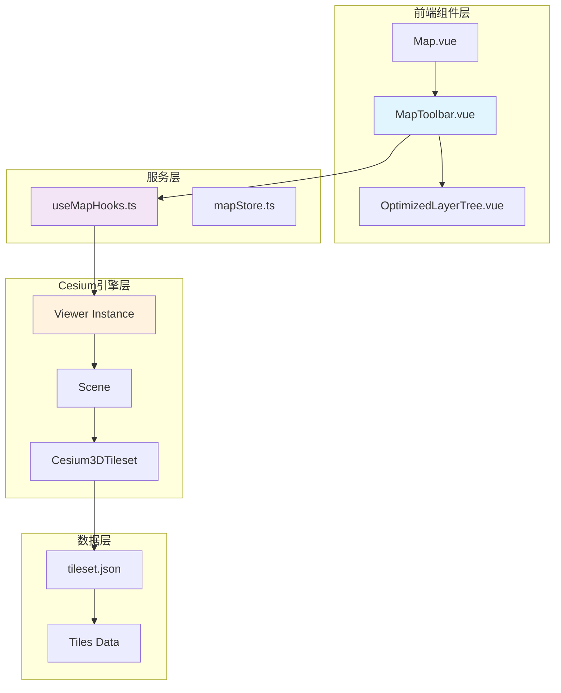
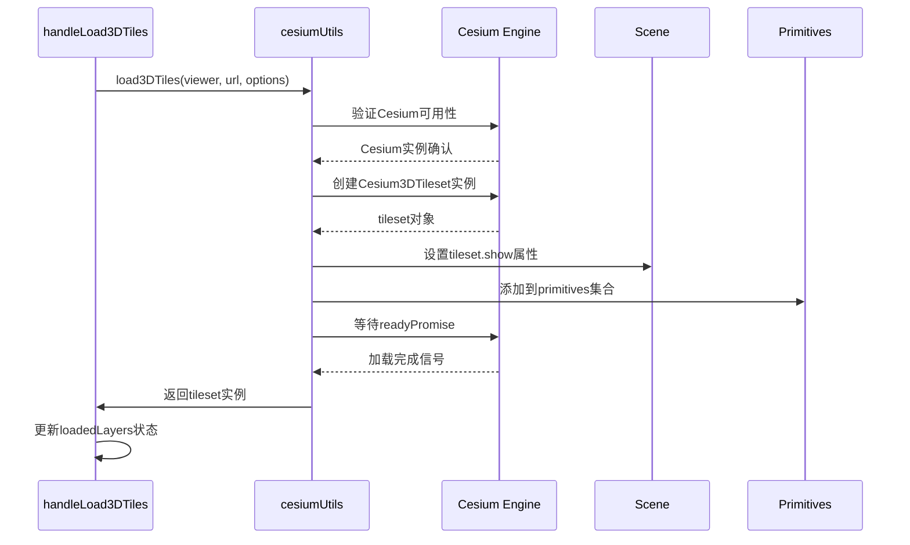
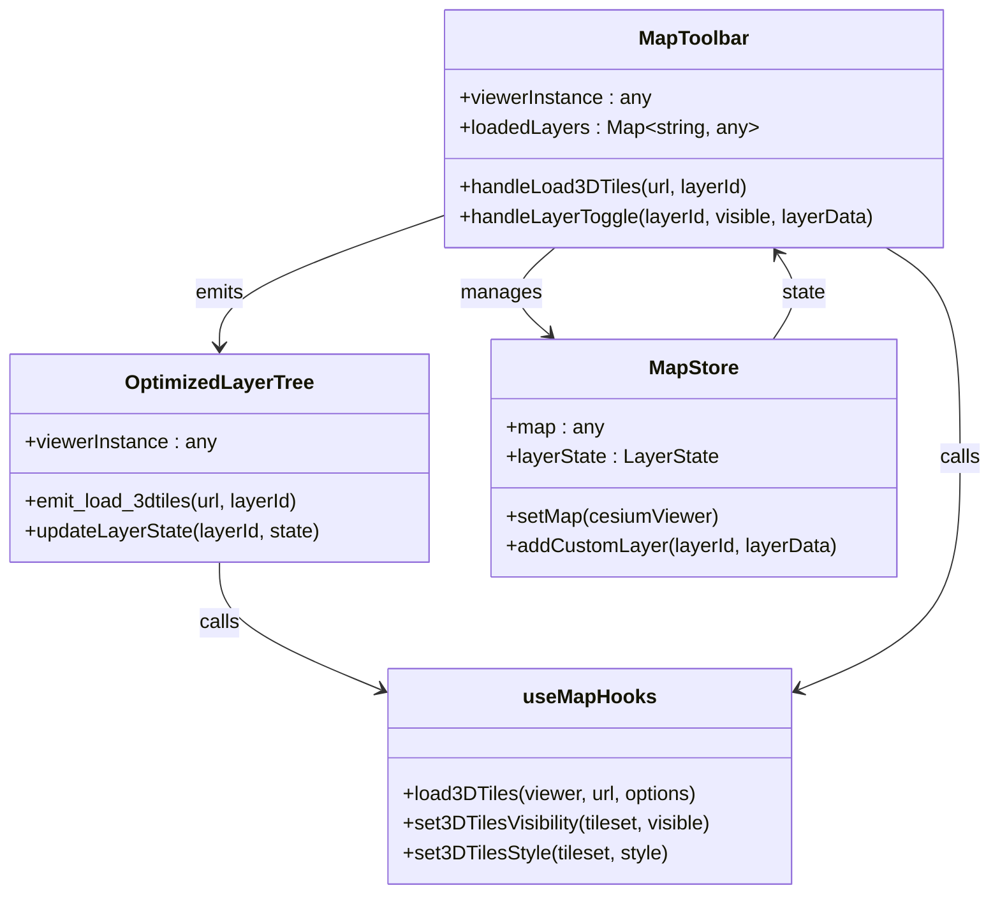
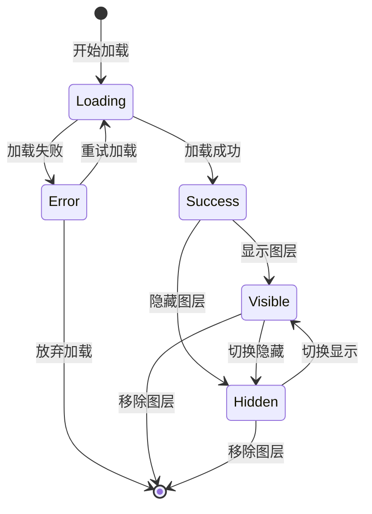
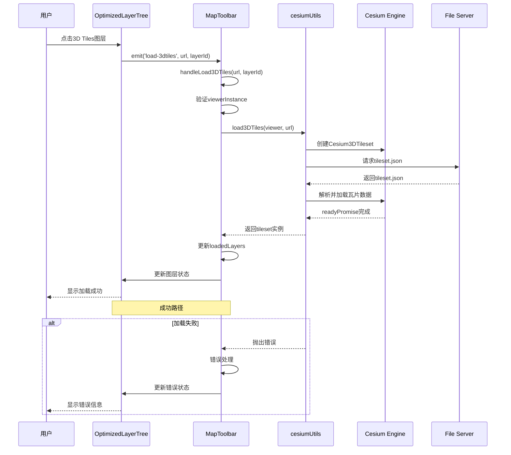
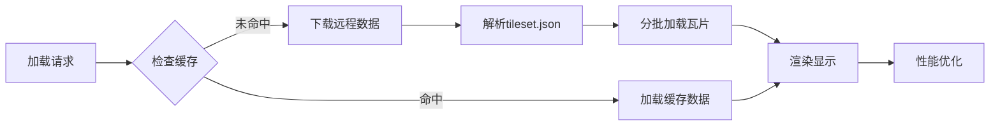

# 3D Tiles加载流程

<cite>
**本文档引用的文件**
- [MapToolbar.vue](file://src/mapComponents/MapToolbar.vue)
- [useMapHooks.ts](file://src/hook/useMapHooks.ts)
- [OptimizedLayerTree.vue](file://src/mapComponents/OptimizedLayerTree.vue)
- [mapStore.ts](file://src/stores/mapStore.ts)
- [mapConfig.ts](file://src/config/mapConfig.ts)
- [Map.vue](file://src/mapComponents/Map.vue)
</cite>

## 目录
1. [概述](#概述)
2. [系统架构](#系统架构)
3. [handleLoad3DTiles方法详解](#handleLoad3dtiles方法详解)
4. [Cesium3DTileset对象创建流程](#cesium3dtileset对象创建流程)
5. [viewer实例依赖关系](#viewer实例依赖关系)
6. [状态管理机制](#状态管理机制)
7. [错误处理机制](#错误处理机制)
8. [完整加载流程](#完整加载流程)
9. [性能优化考虑](#性能优化考虑)
10. [故障排除指南](#故障排除指南)

## 概述

3D Tiles加载流程是政府Dashboard地图系统中的核心功能之一，负责通过Cesium库异步加载3D建筑模型、地形和其他三维地理要素。该流程涉及多个组件间的协作，包括MapToolbar工具栏组件、Cesium地图引擎、以及图层管理系统。

## 系统架构



**图表来源**
- [MapToolbar.vue](file://src/mapComponents/MapToolbar.vue#L1-L504)
- [useMapHooks.ts](file://src/hook/useMapHooks.ts#L1-L200)
- [Map.vue](file://src/mapComponents/Map.vue#L38-L277)

## handleLoad3DTiles方法详解

### 方法签名与参数

`handleLoad3DTiles`方法是MapToolbar组件中的核心异步加载函数，负责处理3D Tiles图层的加载逻辑：

```typescript
const handleLoad3DTiles = async (url: string, layerId: string) => {
  // 参数验证和初始化
}
```

### 核心实现逻辑

该方法采用标准的异步错误处理模式，包含以下关键步骤：

1. **参数验证**：检查viewer实例是否可用
2. **日志记录**：提供详细的加载进度跟踪
3. **异步加载**：调用cesiumUtils.load3DTiles进行实际加载
4. **状态更新**：成功或失败后的状态管理
5. **错误处理**：用户友好的错误提示

**章节来源**
- [MapToolbar.vue](file://src/mapComponents/MapToolbar.vue#L187-L224)

## Cesium3DTileset对象创建流程

### load3DTiles函数实现

`cesiumUtils.load3DTiles`函数是3D Tiles加载的核心实现，提供了完整的Cesium3DTileset对象创建和初始化流程：



**图表来源**
- [useMapHooks.ts](file://src/hook/useMapHooks.ts#L95-L150)

### 关键配置参数

load3DTiles函数支持以下配置选项：

| 参数 | 类型 | 默认值 | 描述 |
|------|------|--------|------|
| maximumScreenSpaceError | number | 16 | 屏幕空间误差阈值，影响LOD质量 |
| maximumMemoryUsage | number | 512 | 最大内存使用量(MB)，影响加载性能 |
| show | boolean | true | 是否立即显示图层 |

**章节来源**
- [useMapHooks.ts](file://src/hook/useMapHooks.ts#L102-L150)

## viewer实例依赖关系

### viewer实例的生命周期管理

viewer实例是3D Tiles加载的基础，其生命周期管理遵循严格的父子组件通信模式：

```mermaid
flowchart TD
Start([Map.vue初始化]) --> InitViewer[创建Cesium Viewer实例]
InitViewer --> ReadyEvent[等待@ready事件]
ReadyEvent --> SetInstance[设置viewerInstance]
SetInstance --> PropPass[通过Props传递给子组件]
PropPass --> ChildComp[MapToolbar组件接收]
ChildComp --> Load3DTiles[调用handleLoad3DTiles]
Load3DTiles --> ValidateViewer{验证viewer可用性}
ValidateViewer --> |可用| LoadTileset[执行3D Tiles加载]
ValidateViewer --> |不可用| LogWarning[记录警告日志]
LoadTileset --> Success[加载成功]
LogWarning --> End([结束])
Success --> End
```

**图表来源**
- [Map.vue](file://src/mapComponents/Map.vue#L232-L238)
- [MapToolbar.vue](file://src/mapComponents/MapToolbar.vue#L82-L92)

### 依赖关系图



**图表来源**
- [MapToolbar.vue](file://src/mapComponents/MapToolbar.vue#L78-L110)
- [OptimizedLayerTree.vue](file://src/mapComponents/OptimizedLayerTree.vue#L77-L90)
- [useMapHooks.ts](file://src/hook/useMapHooks.ts#L33-L200)

**章节来源**
- [MapToolbar.vue](file://src/mapComponents/MapToolbar.vue#L82-L92)
- [Map.vue](file://src/mapComponents/Map.vue#L232-L238)

## 状态管理机制

### loadedLayers状态管理

系统使用Vue的响应式Map结构来管理已加载的图层状态：

```typescript
const loadedLayers = ref<Map<string, any>>(new Map());
```

每个图层的状态包含：
- **layerId**: 唯一标识符
- **type**: 图层类型（"3dtiles"）
- **instance**: Cesium3DTileset实例

### 图层树状态同步

当3D Tiles加载完成后，系统会自动更新图层树的状态：



**章节来源**
- [MapToolbar.vue](file://src/mapComponents/MapToolbar.vue#L108-L110)
- [MapToolbar.vue](file://src/mapComponents/MapToolbar.vue#L197-L198)

## 错误处理机制

### 异常分类与处理策略

系统针对不同类型的错误实现了专门的用户友好提示：

#### 404错误处理
```typescript
if (errorMessage.includes("404") || errorMessage.includes("Failed to fetch")) {
  userFriendlyError = "3D模型文件不存在";
}
```

#### 版本兼容性错误
```typescript
else if (errorMessage.includes("not a function")) {
  userFriendlyError = "Cesium版本不兼容";
}
```

### 错误处理流程

```mermaid
flowchart TD
Error[加载错误发生] --> ExtractMsg[提取错误消息]
ExtractMsg --> Check404{是否404错误?}
Check404 --> |是| Set404Msg[设置"3D模型文件不存在"]
Check404 --> |否| CheckCompat{是否版本不兼容?}
CheckCompat --> |是| SetCompatMsg[设置"Cesium版本不兼容"]
CheckCompat --> |否| SetDefaultMsg[设置默认错误消息]
Set404Msg --> UpdateUI[更新图层树UI状态]
SetCompatMsg --> UpdateUI
SetDefaultMsg --> UpdateUI
UpdateUI --> ShowError[显示错误提示]
```

**图表来源**
- [MapToolbar.vue](file://src/mapComponents/MapToolbar.vue#L206-L222)

### 用户界面反馈

错误处理不仅记录日志，还会通过图层树组件向用户显示具体的错误信息：

```typescript
layerTreeRef.value.updateLayerState(layerId, {
  loading: false,
  error: userFriendlyError,
});
```

**章节来源**
- [MapToolbar.vue](file://src/mapComponents/MapToolbar.vue#L206-L222)

## 完整加载流程

### 从URL请求到图层添加的完整流程



**图表来源**
- [MapToolbar.vue](file://src/mapComponents/MapToolbar.vue#L187-L224)
- [useMapHooks.ts](file://src/hook/useMapHooks.ts#L95-L150)
- [OptimizedLayerTree.vue](file://src/mapComponents/OptimizedLayerTree.vue#L88-L89)

### 关键时间节点

| 阶段 | 时间复杂度 | 主要操作 | 性能影响 |
|------|------------|----------|----------|
| 参数验证 | O(1) | 检查viewer实例 | 极低 |
| Cesium实例检查 | O(1) | 验证Cesium可用性 | 极低 |
| tileset创建 | O(1) | 构造Cesium3DTileset | 低 |
| 瓦片数据加载 | O(n) | 异步加载瓦片 | 高（取决于数据量） |
| 相机调整 | O(1) | 调整视角到tileset | 中等 |

**章节来源**
- [useMapHooks.ts](file://src/hook/useMapHooks.ts#L138-L143)

## 性能优化考虑

### 内存管理

系统通过以下方式优化3D Tiles的内存使用：

1. **maximumMemoryUsage配置**：默认设置为512MB，可根据设备性能调整
2. **按需加载**：只在视锥体内显示的瓦片会被加载
3. **LOD控制**：通过maximumScreenSpaceError控制细节层次

### 加载策略



### 性能监控指标

- **加载时间**：从请求到首次渲染的时间
- **内存占用**：加载过程中内存使用峰值
- **帧率稳定性**：加载期间的FPS表现
- **网络带宽**：瓦片数据传输量

## 故障排除指南

### 常见问题及解决方案

#### 1. 3D模型文件不存在
**症状**：显示"3D模型文件不存在"错误
**原因**：tileset.json文件路径错误或文件缺失
**解决方案**：
- 验证URL的正确性
- 检查服务器上的文件存在性
- 确认跨域资源共享(CORS)设置

#### 2. Cesium版本不兼容
**症状**：显示"Cesium版本不兼容"错误
**原因**：使用的Cesium版本过旧或API不匹配
**解决方案**：
- 更新Cesium到最新稳定版本
- 检查API兼容性文档
- 调整代码适配新版本

#### 3. 网络连接问题
**症状**：加载超时或网络错误
**解决方案**：
- 检查网络连接状态
- 配置代理服务器
- 实现重试机制

#### 4. 内存不足
**症状**：页面卡顿或崩溃
**解决方案**：
- 减少maximumMemoryUsage值
- 优化瓦片数据压缩
- 实现渐进式加载

### 调试技巧

1. **启用详细日志**：在浏览器开发者工具中查看console输出
2. **网络监控**：使用Network面板检查请求状态
3. **性能分析**：使用Performance面板分析加载瓶颈
4. **内存检查**：使用Memory面板监控内存使用

**章节来源**
- [MapToolbar.vue](file://src/mapComponents/MapToolbar.vue#L209-L222)
- [useMapHooks.ts](file://src/hook/useMapHooks.ts#L112-L150)

## 结论

3D Tiles加载流程是一个复杂的异步处理系统，涉及多个组件的协调工作。通过合理的错误处理、状态管理和性能优化，系统能够提供稳定可靠的3D地理数据加载能力。开发者在使用该功能时应注意版本兼容性、网络环境和设备性能等因素，以确保最佳的用户体验。