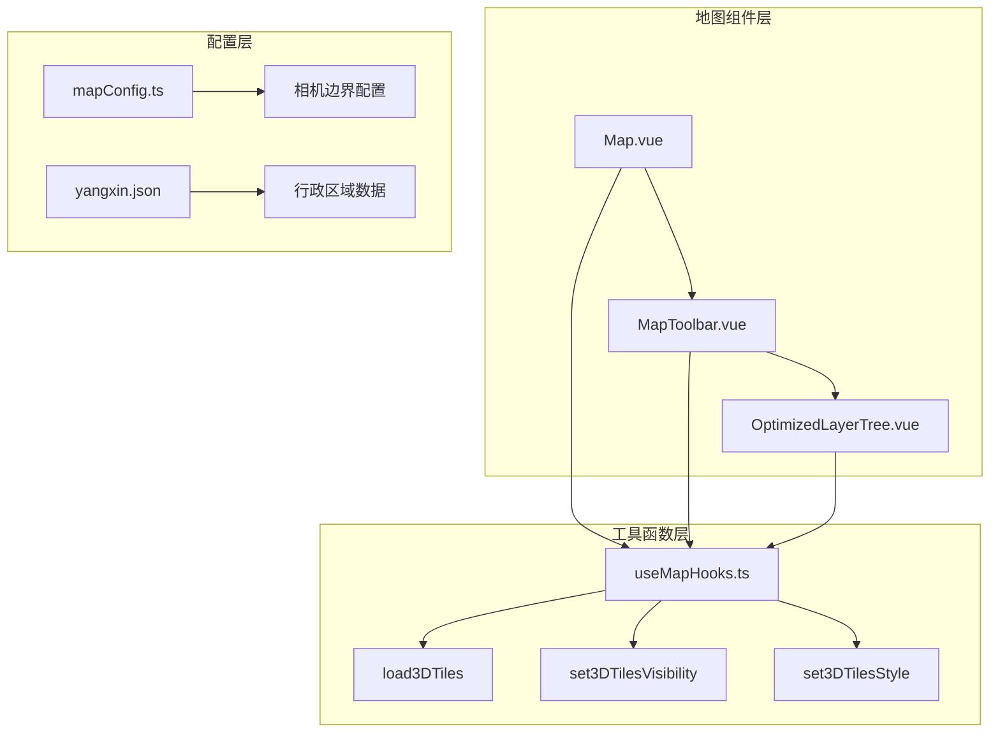
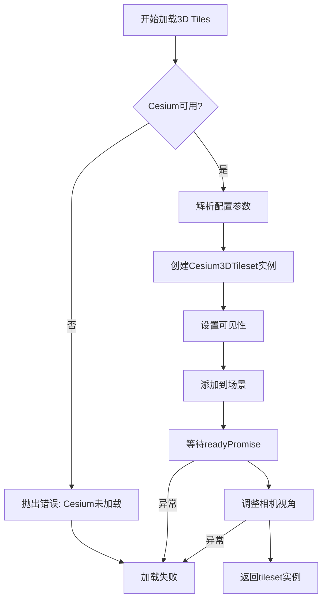
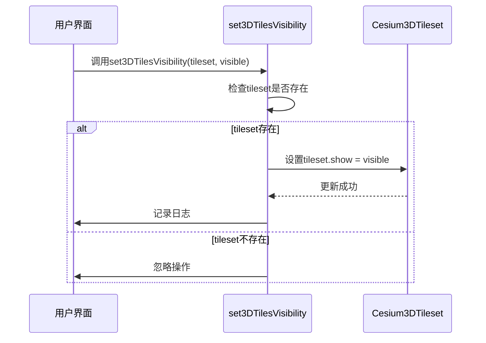
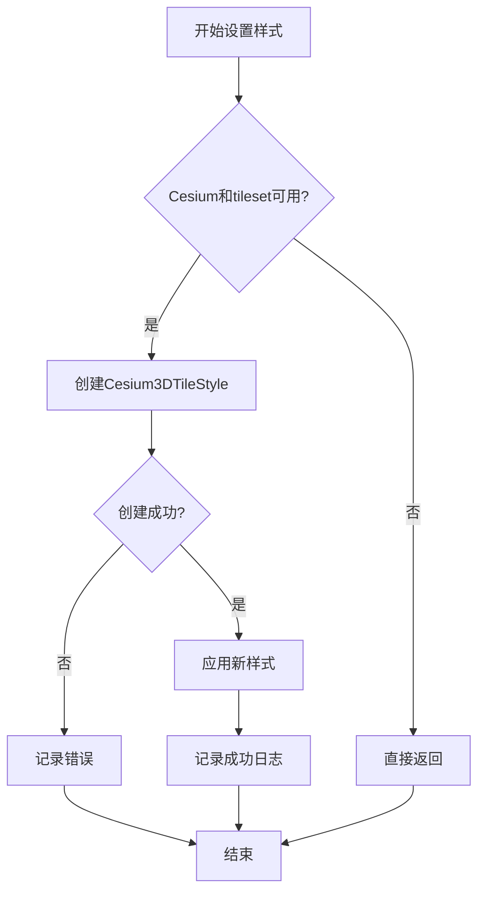
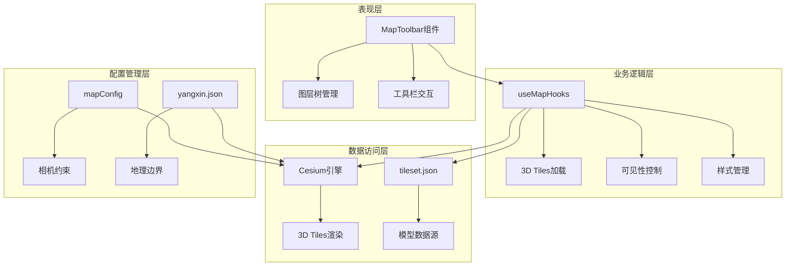
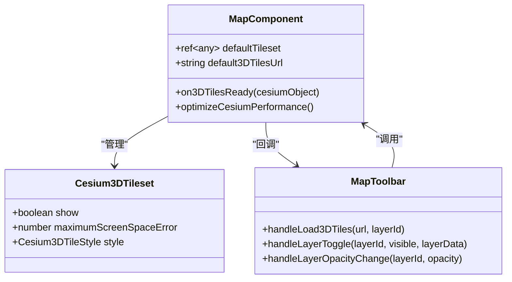
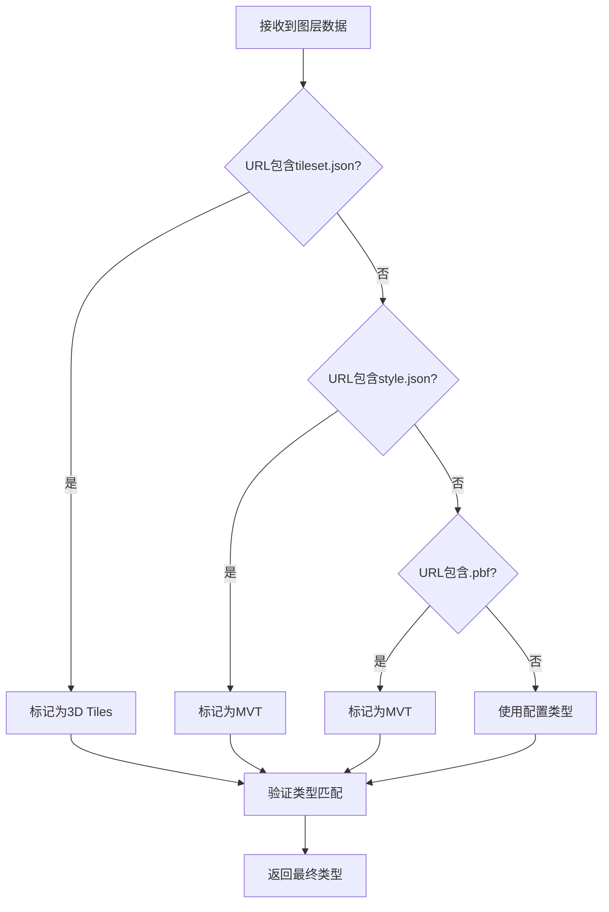
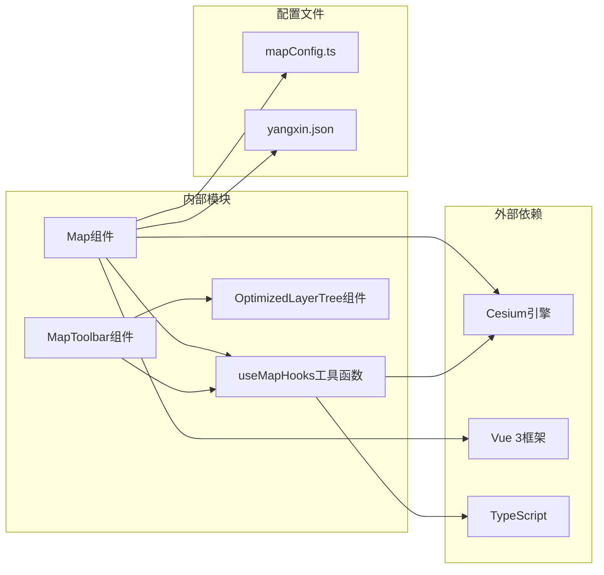
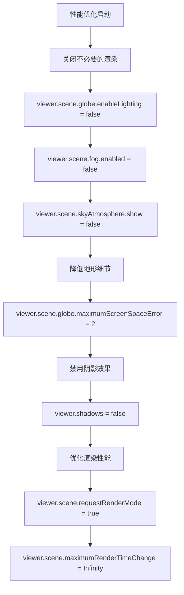
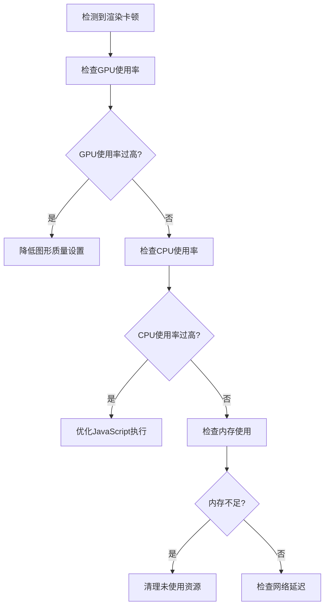

# 3D Tiles图层集成

<cite>
**本文档中引用的文件**
- [useMapHooks.ts](file://src/hook/useMapHooks.ts)
- [MapToolbar.vue](file://src/mapComponents/MapToolbar.vue)
- [Map.vue](file://src/mapComponents/Map.vue)
- [OptimizedLayerTree.vue](file://src/mapComponents/OptimizedLayerTree.vue)
- [mapConfig.ts](file://src/config/mapConfig.ts)
- [yangxin.json](file://public/yangxin.json)
- [CAMERA_BOUNDS_RESTRICTION.md](file://CAMERA_BOUNDS_RESTRICTION.md)
- [LAYER_TREE_QUICK_START.md](file://LAYER_TREE_QUICK_START.md)
</cite>

## 目录
1. [简介](#简介)
2. [项目结构概览](#项目结构概览)
3. [核心组件分析](#核心组件分析)
4. [架构概览](#架构概览)
5. [详细组件分析](#详细组件分析)
6. [依赖关系分析](#依赖关系分析)
7. [性能优化建议](#性能优化建议)
8. [故障排除指南](#故障排除指南)
9. [总结](#总结)

## 简介

本文档详细介绍了政府Dashboard项目中3D Tiles图层的集成实现。该项目基于Cesium引擎构建，提供了完整的3D Tiles加载、控制和管理功能。系统支持动态加载3D建筑物模型、道路网络和其他城市基础设施的三维表示，为城市管理提供了直观的空间可视化能力。

## 项目结构概览

项目采用模块化架构设计，3D Tiles相关功能分布在多个关键模块中：

**图表来源**
- [Map.vue](file://src/mapComponents/Map.vue#L1-L50)
- [MapToolbar.vue](file://src/mapComponents/MapToolbar.vue#L1-L50)
- [useMapHooks.ts](file://src/hook/useMapHooks.ts#L95-L200)

**章节来源**
- [Map.vue](file://src/mapComponents/Map.vue#L1-L432)
- [useMapHooks.ts](file://src/hook/useMapHooks.ts#L1-L545)

## 核心组件分析

### 3D Tiles加载器 (load3DTiles)

`load3DTiles`函数是3D Tiles图层集成的核心入口点，负责处理完整的加载流程：

**图表来源**
- [useMapHooks.ts](file://src/hook/useMapHooks.ts#L102-L147)

### 可见性控制 (set3DTilesVisibility)

该函数提供简单的3D Tiles显隐控制功能：

**图表来源**
- [useMapHooks.ts](file://src/hook/useMapHooks.ts#L158-L162)

### 样式控制 (set3DTilesStyle)

样式控制功能允许动态修改3D Tiles的颜色和透明度：

**图表来源**
- [useMapHooks.ts](file://src/hook/useMapHooks.ts#L170-L179)

**章节来源**
- [useMapHooks.ts](file://src/hook/useMapHooks.ts#L95-L200)

## 架构概览

系统采用分层架构设计，确保3D Tiles功能的可维护性和扩展性：

**图表来源**
- [MapToolbar.vue](file://src/mapComponents/MapToolbar.vue#L188-L224)
- [useMapHooks.ts](file://src/hook/useMapHooks.ts#L527-L545)

## 详细组件分析

### Map组件 - 3D Tiles集成点

Map组件作为3D Tiles的主要集成点，负责初始化和配置默认的3D Tiles图层：

**图表来源**
- [Map.vue](file://src/mapComponents/Map.vue#L26-L32)
- [Map.vue](file://src/mapComponents/Map.vue#L214-L227)

### 图层树组件 - 类型检测

OptimizedLayerTree组件实现了智能的图层类型检测机制：

**图表来源**
- [OptimizedLayerTree.vue](file://src/mapComponents/OptimizedLayerTree.vue#L329-L351)

### 错误处理机制

系统实现了完善的错误处理和用户友好的错误提示：

| 错误类型 | 错误信息 | 解决方案 |
|---------|---------|---------|
| 404错误 | "3D模型文件不存在" | 检查tileset.json路径和服务器配置 |
| 网络错误 | "Failed to fetch" | 验证网络连接和跨域设置 |
| 版本不兼容 | "Cesium版本不兼容" | 更新Cesium版本到兼容版本 |
| 格式错误 | "样式文件格式错误" | 验证tileset.json格式规范 |

**章节来源**
- [MapToolbar.vue](file://src/mapComponents/MapToolbar.vue#L188-L224)
- [OptimizedLayerTree.vue](file://src/mapComponents/OptimizedLayerTree.vue#L329-L351)

## 依赖关系分析

系统的依赖关系呈现清晰的层次结构：

**图表来源**
- [Map.vue](file://src/mapComponents/Map.vue#L55-L65)
- [useMapHooks.ts](file://src/hook/useMapHooks.ts#L1-L10)

**章节来源**
- [Map.vue](file://src/mapComponents/Map.vue#L1-L432)
- [useMapHooks.ts](file://src/hook/useMapHooks.ts#L1-L545)

## 性能优化建议

### 3D Tiles性能配置

根据阳新县的地理范围（约0.8°×0.8°），推荐以下性能配置：

| 参数 | 建议值 | 说明 |
|-----|-------|------|
| maximumScreenSpaceError | 16 | 平衡质量和性能的默认值 |
| maximumMemoryUsage | 512MB | 避免内存溢出 |
| 相机最小高度 | 10000米 | 确保能看清街道级别细节 |
| 相机最大高度 | 150000米 | 能够看到整个县域范围 |

### 渲染优化策略

**图表来源**
- [Map.vue](file://src/mapComponents/Map.vue#L260-L277)

### 内存管理建议

1. **及时释放未使用的3D Tiles**
   - 在图层切换时移除不需要的tileset
   - 使用`viewer.scene.primitives.remove(tileset)`清理内存

2. **合理设置最大内存使用量**
   - 根据设备性能调整`maximumMemoryUsage`参数
   - 监控内存使用情况，避免内存泄漏

3. **延迟加载策略**
   - 仅在相机接近时加载高精度模型
   - 使用LOD（Level of Detail）技术

**章节来源**
- [mapConfig.ts](file://src/config/mapConfig.ts#L16-L26)
- [Map.vue](file://src/mapComponents/Map.vue#L260-L277)

## 故障排除指南

### 常见加载失败问题

#### 1. Cesium未加载错误
**症状**: 控制台显示"Error: Cesium未加载"
**原因**: Cesium引擎未正确初始化
**解决方案**:
- 检查Cesium脚本是否正确引入
- 确认Cesium全局变量已定义
- 验证Cesium版本兼容性

#### 2. tileset.json文件不存在
**症状**: 显示"3D模型文件不存在"
**原因**: 3D Tiles数据源路径错误或服务器配置问题
**解决方案**:
- 验证tileset.json文件路径
- 检查服务器CORS配置
- 确认文件权限设置

#### 3. 网络连接超时
**症状**: 加载过程中出现网络超时错误
**解决方案**:
- 检查网络连接稳定性
- 增加加载超时时间
- 使用CDN加速3D模型加载

### 性能问题诊断

#### 1. 渲染卡顿
**诊断步骤**:

#### 2. 内存泄漏
**预防措施**:
- 定期清理未使用的3D Tiles实例
- 监控内存使用趋势
- 实现资源池管理机制

### 调试工具和技巧

1. **浏览器开发者工具**
   - 使用Performance面板分析渲染性能
   - 使用Memory面板监控内存使用
   - 使用Network面板检查资源加载

2. **Cesium Inspector**
   - 启用Cesium3DTilesInspector调试工具
   - 查看tileset加载状态
   - 分析渲染统计信息

3. **日志分析**
   - 启用详细的控制台日志
   - 监控加载时间和错误信息
   - 记录用户交互行为

**章节来源**
- [MapToolbar.vue](file://src/mapComponents/MapToolbar.vue#L209-L222)
- [CAMERA_BOUNDS_RESTRICTION.md](file://CAMERA_BOUNDS_RESTRICTION.md#L91-L161)

## 总结

政府Dashboard项目的3D Tiles图层集成为城市管理提供了强大的空间可视化能力。通过模块化的架构设计、完善的错误处理机制和性能优化策略，系统能够稳定地处理大规模3D城市模型的加载和渲染。

### 主要特性

1. **完整的生命周期管理**: 从加载到卸载的全流程控制
2. **智能类型检测**: 基于URL自动识别3D Tiles图层类型
3. **灵活的控制接口**: 支持显隐切换、透明度调节和样式修改
4. **健壮的错误处理**: 提供用户友好的错误提示和恢复机制
5. **性能优化**: 针对不同设备和场景的优化配置

### 最佳实践

1. **合理配置性能参数**: 根据目标设备调整渲染质量
2. **实施渐进式加载**: 按需加载高精度模型
3. **建立监控机制**: 实时跟踪系统性能指标
4. **完善测试覆盖**: 确保各种边界条件下的稳定性

通过遵循本文档的指导原则和最佳实践，开发团队可以构建出高性能、高可靠性的3D Tiles应用，为用户提供优秀的空间数据可视化体验。